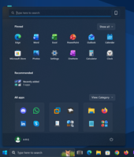
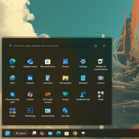
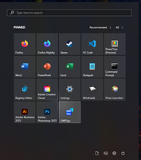
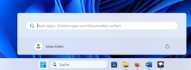
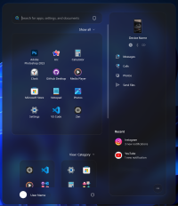
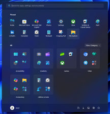
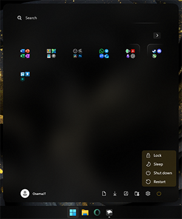
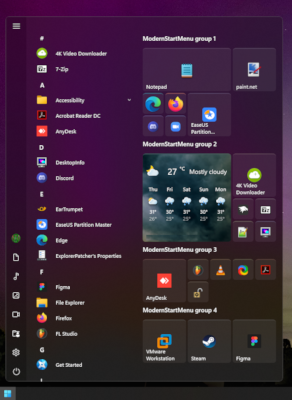
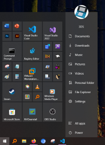

# The Windows 11 Start menu styling guide

## Table of contents

* [Introduction](#introduction)
  * [Finding targets](#finding-targets)
  * [Missing customizations](#missing-customizations)
  * [Contributing](#contributing)
* [Themes](#themes)
  * [Windows 10 Start menu themes](#windows-10-start-menu-themes)
* [Custom Acrylic background](#custom-acrylic-background)
* [Remove the search box](#remove-the-search-box)
* [Move pinned app lists](#move-pinned-app-lists)
* [Remove the Recommended section](#remove-the-recommended-section)
* [Remove the user profile button](#remove-the-user-profile-button)
* [Move the power button](#move-the-power-button)
* [Force light/dark mode](#force-lightdark-mode)
* [Semantic zoom (navigation)](#semantic-zoom-navigation)
* [Transforms](#transforms)
  * [Translate](#translate)
  * [Rotate](#rotate)
  * [Scale](#scale)
  * [Skew](#skew)
  * [Other properties and attributes](#other-properties-and-attributes)
* [Colors](#colors)
  * [Solid color](#solid-color)
  * [Accent colors](#accent-colors)
  * [Clear transparent background](#clear-transparent-background)
  * [Acrylic effect as color](#acrylic-effect-as-color)
  * [WindhawkBlur effect as color](#windhawkblur-effect-as-color)
    * [Hex color](#hex-color)
    * [ThemeResource color](#themeresource-color)
  * [Mica effect as color](#mica-effect-as-color)
  * [Gradient as color](#gradient-as-color)
  * [Image as color](#image-as-color)
  * [Reveal as color](#reveal-as-color)
* [Search menu](#search-menu)
* [Search menu remote debugging](#search-menu-remote-debugging)
* [Search menu WebView styles](#search-menu-webview-styles)
  * [Hide the back button](#hide-the-back-button)
  * [Hide the Copilot button](#hide-the-copilot-button)
  * [Change the background color of search type headers](#change-the-background-color-of-search-type-headers)
  * [Hide the search type headers](#hide-the-search-type-headers)
  * [Hide the search type header scroll buttons](#hide-the-search-type-header-scroll-buttons)
  * [Hide the quick settings panel](#hide-the-quick-settings-panel)
  * [Hide the top result title](#hide-the-top-result-title)
  * [Change the background color of all search results](#change-the-background-color-of-all-search-results)
  * [Hide left-side pill of the selected search result](#hide-left-side-pill-of-the-selected-search-result)
  * [Change the width of the preview panel](#change-the-width-of-the-preview-panel)
  * [Change the background color of the preview panel](#change-the-background-color-of-the-preview-panel)
  * [Change the text font](#change-the-text-font)
  * [Change the icons font](#change-the-icons-font)

## Introduction

This is a collection of commonly requested Start menu styling customizations for
Windows 11. It is intended to be used with the [Windows 11 Start Menu
Styler](https://windhawk.net/mods/windows-11-start-menu-styler) Windhawk mod.

If you're not familiar with Windhawk, here are the steps for installing the mod:

* Download Windhawk from [windhawk.net](https://windhawk.net/) and install it.
* Go to "Mods" in the upper right menu.
* Find and install the "Windows 11 Start Menu Styler" mod.

After installing the mod, open its Settings tab and adjust the styles according
to your preferences.

Some customizations are best adjusted with other Windhawk mods. Links to those
mods are provided where applicable.

**See also**: [The Windows 11 taskbar styling
guide](https://github.com/ramensoftware/windows-11-taskbar-styling-guide/blob/main/README.md),
[The Windows 11 notification center styling
guide](https://github.com/ramensoftware/windows-11-notification-center-styling-guide/blob/main/README.md).

### Finding targets

[How to find targets using UWPSpy](https://github.com/bbmaster123/FWFU/blob/main/uwpspy.md).

### Missing customizations

If you're looking for a customization that is not listed here, please [open an
issue](https://github.com/ramensoftware/windows-11-start-menu-styling-guide/issues/new).

### Contributing

If you have a Start menu styling customization or theme that you would like to
share, please submit a pull request.

## Themes

Themes are collections of styles that can be imported into the Windows 11
Start Menu Styler mod. The following themes are available:

| Link | Screenshot
| ---- | ----------
| [TranslucentStartMenu](Themes/TranslucentStartMenu/README.md) | [](Themes/TranslucentStartMenu/screenshot.png)
| [NoRecommendedSection](Themes/NoRecommendedSection/README.md) | [](Themes/NoRecommendedSection/screenshot.png)
| [SideBySide](Themes/SideBySide/README.md) | [](Themes/SideBySide/screenshot.png)
| [SideBySide2](Themes/SideBySide2/README.md) | [](Themes/SideBySide2/screenshot.png)
| [SideBySideMinimal](Themes/SideBySideMinimal/README.md) | [](Themes/SideBySideMinimal/screenshot.png)
| [Down Aero](Themes/Down%20Aero/README.md) | [](Themes/Down%20Aero/screenshot.png)
| [Windows10](Themes/Windows10/README.md) | [](Themes/Windows10/screenshot.png)
| [Windows11_Metro10](Themes/Windows11_Metro10/README.md) | [](Themes/Windows11_Metro10/screenshot.png)
| [Fluent2Inspired](Themes/Fluent2Inspired/README.md) | [](Themes/Fluent2Inspired/screenshot.png)
| [RosePine](Themes/RosePine/README.md) | [](Themes/RosePine/screenshot.png)
| [Windows11_Metro10Minimal](Themes/Windows11_Metro10Minimal/README.md) | [](Themes/Windows11_Metro10Minimal/screenshot.png)
| [Everblush](Themes/Everblush/README.md) | [](Themes/Everblush/screenshot.png)
| [Sun Valley](Themes/SunValley/README.md) | [](Themes/SunValley/screenshot.png)
| [UniMenu](Themes/UniMenu/README.md) | [](Themes/UniMenu/screenshot.png)
| [LegacyFluent](Themes/LegacyFluent/README.md) | [](Themes/LegacyFluent/screenshot.png)
| [OnlySearch](Themes/OnlySearch/README.md) | [](Themes/OnlySearch/screenshot.png)
| [WindowGlass](Themes/WindowGlass/README.md) | [](Themes/WindowGlass/screenshot.png)
| [Fluid](Themes/Fluid/README.md) | [](Themes/Fluid/screenshot.png)
| [Oversimplified&Accentuated](Themes/Oversimplified&Accentuated/README.md) | [](Themes/Oversimplified&Accentuated/screenshot.png)

### Windows 10 Start menu themes

The themes below are designed for customizing the Windows 10 Start menu. They
aren't integrated into the Windows 11 Start Menu Styler mod, and must be
imported manually. For details, see their respective README files.

| Link | Screenshot
| ---- | ----------
| [ModernStartMenu](Themes/ModernStartMenu/README.md) | [](Themes/ModernStartMenu/screenshot.png)
| [Hybrid](Themes/Hybrid/README.md) | [](Themes/Hybrid/screenshot.png)

## Custom Acrylic background

Target `Border#AcrylicBorder` for the Start menu or `Border#AppBorder` for the search menu, then set `Background` to an `AcrylicBrush` object.

For example:

```
Background:=<AcrylicBrush BackgroundSource="Backdrop" TintColor="Pink" TintOpacity="0.25" />
```

The [AcrylicBrush properties](https://learn.microsoft.com/en-us/uwp/api/windows.ui.xaml.media.acrylicbrush?view=winrt-22621#properties)
can be adjusted as needed.

## Remove the search box

Target `StartDocked.SearchBoxToggleButton` with `Height=0`, `Margin=0,0,0,24`.

## Move pinned app lists

Target `StartMenu.PinnedList` with `Margin=0,0,0,0`.
Adjust values as needed.

## Remove the Recommended section

Target the following elements:

* `Windows.UI.Xaml.Controls.Grid#TopLevelSuggestionsListHeader`
* `Windows.UI.Xaml.Controls.Grid#NoTopLevelSuggestionsText`
* `Windows.UI.Xaml.Controls.Grid#TopLevelSuggestionsContainer`
* `Windows.UI.Xaml.Controls.Grid#ShowMoreSuggestions`

Set the style of each to:

`Visibility=Collapsed`

In addition, the pinned items can be adjusted to
occupy the whole height by targeting `StartMenu.PinnedList` and setting
`Height=504`.

## Remove the user profile button

Target `StartDocked.UserTileView` with `Visibility=Collapsed`.

## Move the power button

Target `StartDocked.PowerOptionsView` with `Margin=-580,-1330,0,0`.
Adjust values as needed.

## Force light/dark mode

Sets light/dark mode independently of what is set in Windows.

`RequestedTheme=1`

`1` = Light Mode

`2` = Dark mode

## Semantic zoom (navigation)

Semantic zoom is the feature that allows us to navigate the apps list using the alphanumeric headers in the list. This lets you jump to a particular letter or number in the apps list quickly.
For themes that have the apps list visible in the main Start menu view, this feature does not work. As an optional workaround, you may enable the hidden zoom button. This button allows you to access the alphanumeric navigation view. This is the zoomed-out view, which is why this is called semantic zoom.

Target:
```
Windows.UI.Xaml.Controls.SemanticZoom#ZoomControl
```
Styles:
```
IsZoomOutButtonEnabled=True
```

Target:
```
Windows.UI.Xaml.Controls.Button#ZoomOutButton
```
Styles:
```
Width=40
Height=40
```

Target:
```
Windows.UI.Xaml.Controls.Button#ZoomOutButton > Windows.UI.Xaml.Controls.ContentPresenter#ContentPresenter > Windows.UI.Xaml.Controls.TextBlock
```
Styles:
```
Text=
FontSize=28
```

You may replace `Text=` with any other character. Use Character Map to find, copy, and paste the character into the style box.

## Transforms

You can use transformation styles to translate, rotate, scale, or skew elements.

> [!TIP]
> **Should I use `RenderTransform` or `Transform3D`?**
>
> For 2D transformations, it is best to stick to `RenderTransform` in most cases. Using `Transform3D` for 2D transformations can cause elements to become blurry. For 3D transformations, you must use `Transform3D`.

> [!TIP]
> You can mix and match transformations when using `Transform3D`! You can also use `RenderTransform` and `Transform3D` together.
>
> For example: `Transform3D:=<CompositeTransform3D ScaleX="1.5" TranslateY="-15" RotationZ="15" />`

### Translate

```
RenderTransform:=<TranslateTransform X="15" Y="-15" />
```

-- or --

```
Transform3D:=<CompositeTransform3D TranslateX="15" TranslateY="-15" TranslateZ="-15" />
```

### Rotate

```
RenderTransform:=<RotateTransform Angle="15" />
```

-- or --

```
Transform3D:=<CompositeTransform3D RotationX="-15" RotationY="15" RotationZ="-15" />
```

- `X`: 3D vertical rotation.
- `Y`: 3D horizontal rotation.
- `Z`: 2D rotation.

### Scale

```
RenderTransform:=<ScaleTransform ScaleX="1.5" ScaleY="-1.5" />
```

-- or --

```
Transform3D:=<CompositeTransform3D ScaleX="-1.5" ScaleY="1.5" ScaleZ="-1.5" />
```

### Skew

```
RenderTransform:=<SkewTransform AngleX="-15" AngleY="15" />
```

### Other properties and attributes

- Applies to Rotate, Scale and Skew:
  - `CenterX`: Offsets the transform's origin on the X axis.
  - `CenterY`: Offsets the transform's origin on the Y axis.
  - `CenterZ`: Offsets the transform's origin on the Z axis. (Only for `Transform3D`)

  Example:
  ```
  RenderTransform:=<RotateTransform Angle="15" CenterX="10" CenterY="20" />
  ```
- `RenderTransformOrigin`
  - Applies to `RenderTransform` only, `Transform3D` does not support this attribute. It is a separate attribute and is not set inside of the `RenderTransform` like `CenterX/Y/Z`.
  - Sets the transform origin relative to its target's width and height. Format is `X,Y` and both numbers range from 0-1.

  Example:

  ```
  RenderTransformOrigin=0.5,0.5
  ```
  This centers the transform's origin.

- `TransformGroup`
  - Applies to `RenderTransform` only, `Transform3D` does not support this attribute. It is a separate attribute and is not set inside of the `RenderTransform` like `CenterX/Y/Z`.
  - Allows you to combine RenderTransforms together into one style, mimicking Transform3D's functionality.

  Example:
  ```
  RenderTransform:=<TransformGroup><RotateTransform Angle="15" /><TranslateTransform X="15" Y="-15" /></TransformGroup>
  ```
## Colors

In the following examples, we will use `Background` as our style, but this
also works for other properties that accept colors, such as `Fill`.

### Solid color

```
Background=<color>
```

Replace `<color>` with the desired color.

A color can be a name (e.g. `Red`) or a hex code (e.g. `#FF0000`).

The color can be semi-transparent (e.g. `#80FF0000`). To have a fully
transparent background, use `Transparent` or `#00000000`.

### Accent colors

A color can also be a `ThemeResource` or `StaticResource`. There are many such
styles built into Windows.

```
Background:=<SolidColorBrush Color="{ThemeResource SystemAccentColor}" Opacity="0.8" />
```

Accent colors come as part of an accent color palette. This means that for any color you pick as your system accent color, 3 additional shades are part of that color's palette. For example: `SystemAccentColorLight2` or `SystemAccentColorDark1`.

The word `Light` or `Dark` is appended at the end with a number ranging from 1
to 3. See [the official Microsoft
docs](https://learn.microsoft.com/en-us/windows/apps/design/style/color#accent-color-palette)
for more information.

```
Background:=<SolidColorBrush Color="{ThemeResource SystemAccentColorDark2}" Opacity="0.5" />
```

### Clear Transparent Background

To have a fully transparent background:

Style:
```
Background=Transparent
```

### Acrylic effect as color

In order to use the acrylic effect (a blurred background) you can use the
`AcrylicBrush`.

```
Background:=<AcrylicBrush TintColor="Black" TintOpacity="0.8" />
```

`TintColor` - Required. Defines what color to use.

`TintOpacity` - Defines the strength of the chosen color.

`TintLuminosityOpacity` - Defines the brightness of the acrylic effect.

`BackgroundSource` - Defines what should be considered the background of the acrylic effect. Set to "Backdrop" to use the desktop wallpaper.

`Opacity` - Defines how transparent the brush effect itself is. If set to less than 1, it blends the AcrylicBrush with clear transparency.

You can also set Acrylic to use an accent color for a more dynamic look that fits the current theme.

```
Background:=<AcrylicBrush TintColor="{ThemeResource SystemAccentColorDark2}" TintOpacity="0.3" />
```

### WindhawkBlur effect as color

An alternative to Acrylic is the mod's own blur implementation called `WindhawkBlur`. It differs from Acrylic because it has a customizable blur radius and has fewer bugs (e.g. https://github.com/ramensoftware/windhawk-mods/issues/742).

> [!NOTE]
> WindhawkBlur does not currently support color names (e.g. `Red`) or the `FallbackColor` property.

- `BlurAmount`: Radius of blur effect (set to 30 to mimic Acrylic).
#### Hex color

```
Fill:=<WindhawkBlur BlurAmount="10" TintColor="#80ff0000" />
```
```
Fill:=<WindhawkBlur BlurAmount="10" TintColor="#ff0000" TintOpacity="0.5" />
```
_These examples set a blur that is tinted with red at 50% opacity. Both versions have the same effect._

- `TintColor`: Hex color in `#AARRGGBB` or `#RRGGBB` format that is applied to the blur.
- `TintOpacity`: Opacity of the color that overrides the alpha of `TintColor`.

> [!TIP]
> There is no need to specify a `TintOpacity` value if your `TintColor` has an alpha value.

#### ThemeResource color

```
<WindhawkBlur BlurAmount="10" TintColor="{ThemeResource SystemAccentColor}" TintOpacity="0.5"/>
```

- `TintColor`: ThemeResource color, such as `SystemAccentColor`.
- `TintOpacity`: Overrides the opacity of the ThemeResource color.

### Mica effect as color

> [!NOTE]
> Unfortunately, it is not possible to set a Mica effect at this time with any of Windhawk's styler mods.

### Gradient as color

The background can also be a gradient. For example, to have a gradient from
yellow to red to blue to lime green, use the following style:

```
Background:=<LinearGradientBrush StartPoint="0,0.5" EndPoint="1,0.5"><GradientStop Color="Yellow" Offset="0.0" /><GradientStop Color="Red" Offset="0.25" /><GradientStop Color="Blue" Offset="0.75" /><GradientStop Color="LimeGreen" Offset="1.0" /></LinearGradientBrush>
```

### Image as color

The background can also be an image:

```
Background:=<ImageBrush Stretch="UniformToFill" ImageSource="<image>" />
```

Replace `<image>` with your own image, a URL or a local file path.
If you only see a fully transparent background when using a local file path, you must set a URL instead.
Images can be jpg, jpg XR, png, bmp, svg, tiff, gif, or ico.

Stretch can be set to the following values:

`None` - Image is rendered at its native resolution and aspect ratio.

`Fill` - Image is stretched or squished to fill the size of the element.

`Uniform` - Image is resized to fit the element dimensions, while it preserves its native aspect ratio.

`UniformToFill` - Image is resized to fill the destination dimensions while it preserves its native aspect ratio. Crops to fit element.

### Reveal as color

> [!NOTE]
> Reveal is a deprecated XAML feature. It may have issues
> or stop working at any time.

Reveal is the cursor-based illumination effect from Windows 10.

```
Background:=<RevealBorderBrush Color="Transparent" TargetTheme="1" Opacity="1" />
```

```
BorderBrush:=<RevealBorderBrush Color="Transparent" TargetTheme="1" Opacity="1" />
```

**Only** `RevealBorderBrush` should be used, `RevealBackgroundBrush` does not work correctly in most scenarios.

`Opacity` can be changed to increase or decrease the intensity of the effect.

## Search menu

The search menu has some of its own unique targets, but does share some targets with the Start menu. This means that some Start menu styles will automatically be inherited and applied to search as well, but some elements may need to specifically targeted.

## Search menu remote debugging

To make finding targets in the search menu's WebView easier, you can inspect it using Microsoft Edge's remote debugging tools.

1. Install this Windhawk mod: [Search Menu Inspect Helper](https://windhawk.net/mods/search-menu-inspect-helper).
2. Configure remote debugging by following these steps up to number 11: [Remote debugging desktop WebView2 WinUI 2 (UWP) apps](https://learn.microsoft.com/en-us/microsoft-edge/webview2/how-to/remote-debugging-desktop).
3. Instead of step 11 (Configure your WebView2 WinUI 2 (UWP) app for remote debugging), install the mod, and terminate the SearchHost.exe process. It will be relaunched automatically with remote debugging enabled.
4. Continue with the rest of the steps.

## Search menu WebView styles

While the Start menu uses WinUI for its user interface, most of the search content (all but the top search bar) is a WebView element. To style the search WebView, CSS targets and styles can be used. For example, to set a red background, the target `body` and the style `background: red !important` can be used.

### Hide the back button

Target:
```
.scope-with-background__backButton
```
Style:
```
display: none !important
```

### Hide the Copilot button

Target:
```
#chatButtonRight
```
Style:
```
display: none !important
```

### Change the background color of search type headers

Target:
```
.scope-tile > div
```
Style:
```
background-color: Black !important
```

### Hide the search type headers

Target:
```
#scopesHeader
```
Style:
```
display: none !important
```

### Hide the search type header scroll buttons

Target:
```
.scope-with-background__rightCaret, .scope-with-background__leftCaret
```
Style:
```
display: none !important
```

### Hide the quick settings panel

Target:
```
.curatedSettingsGroup
```
Style:
```
display: none !important
```

### Hide the top result title

Target:
```
#topHitHeader
```
Style:
```
display: none !important
```

### Change the background color of all search results

Target:
```
.suggContainer
```
Style:
```
background-color: Black !important
```

### Hide left-side pill of the selected search result

Target:
```
.leftPill::before
```
Style:
```
display: none !important
```

### Change the width of the preview panel

Target:
```
#qfPreviewPane
```
Style:
```
min-width: 300px !important
```

### Change the background color of the preview panel

Target:
```
.previewContainer
```
Style:
```
background-color: Black !important
```

### Change the text font

Target:
```
h4, .suggContainer, .groupTitle, .suggsListContainer, .title, .details, .secondaryText, .scope-tile > div, .menu-item_details
```
Style:
```
font-family: 'Inter' !important
```

### Change the icons font

Target:
```
.cortanaFontIcon, .iconContent
```
Style:
```
font-family: 'Segoe MDL2 Assets' !important
```
