# The Windows 11 start menu styling guide

## Table of contents

* [Introduction](#introduction)
  * [Finding targets](#finding-targets)
  * [Missing customizations](#missing-customizations)
  * [Contributing](#contributing)
* [Themes](#themes)
* [Custom Acrylic background](#custom-acrylic-background)
* [Remove the search box](#remove-the-search-box)
* [Move pinned app lists](#move-pinned-app-lists)
* [Remove the Recommended section](#remove-the-recommended-section)
* [Remove the user profile button](#remove-the-user-profile-button)
* [Move the power button](#move-the-power-button)
* [Force Light/Dark Mode](#force-lightdark-mode)
* [Semantic Zoom (Navigation)](#semantic-zoom-navigation)
* [Search Menu](#search-menu)
* [Colors](#colors)
  * [Solid color](#solid-color)
  * [Accent colors](#accent-colors)
  * [Clear transparent background](#clear-transparent-background)
  * [Acrylic effect as color](#acrylic-effect-as-color)
  * [Mica effect as color](#mica-effect-as-color)
  * [Gradient as color](#gradient-as-color)
  * [Image as color](#image-as-color)
  * [Reveal as color](#reveal-as-color)

## Introduction

This is a collection of commonly requested start menu styling customizations for
Windows 11. It is intended to be used with the [Windows 11 Start Menu
Styler](https://windhawk.net/mods/windows-11-start-menu-styler) Windhawk mod.

If you're not familiar with Windhawk, here are the steps for installing the mod:

* Download Windhawk from [windhawk.net](https://windhawk.net/) and install it.
* Go to "Mods" in the upper right menu.
* Find and install the "Windows 11 Start Menu Styler" mod.

After installing the mod, open its Settings tab and adjust the styles according
to your preferences.

Some customizations are best to be adjusted with other Windhawk mods. Links to
those mods are provided where applicable.

**See also**: [The Windows 11 taskbar styling
guide](https://github.com/ramensoftware/windows-11-taskbar-styling-guide/blob/main/README.md),
[The Windows 11 notification center styling
guide](https://github.com/ramensoftware/windows-11-notification-center-styling-guide/blob/main/README.md).

### Finding Targets

[How to find targets using UWPSpy](https://github.com/bbmaster123/FWFU/blob/main/uwpspy.md).

### Missing customizations

If you're looking for a customization that is not listed here, please [open an
issue](https://github.com/ramensoftware/windows-11-start-menu-styling-guide/issues/new).

### Contributing

If you have a start menu styling customization or theme that you would like to
share, please submit a pull request.

## Themes

Themes are collections of styles that can be imported into the Windows 11
Start Menu Styler mod. The following themes are available:

| Link | Screenshot
| ---- | ----------
| [NoRecommendedSection](Themes/NoRecommendedSection/README.md) | [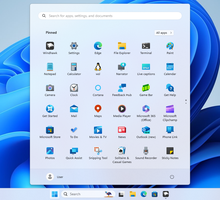](Themes/NoRecommendedSection/screenshot.png)
| [SideBySide](Themes/SideBySide/README.md) | [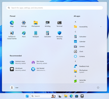](Themes/SideBySide/screenshot.png)
| [SideBySide2](Themes/SideBySide2/README.md) | [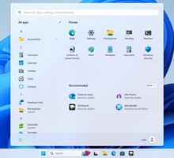](Themes/SideBySide2/screenshot.png)
| [SideBySideMinimal](Themes/SideBySideMinimal/README.md) | [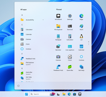](Themes/SideBySideMinimal/screenshot.png)
| [Windows10](Themes/Windows10/README.md) | [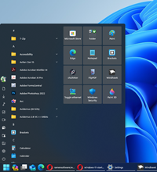](Themes/Windows10/screenshot.png)
| [TranslucentStartMenu](Themes/TranslucentStartMenu/README.md) | [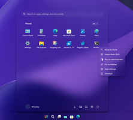](Themes/TranslucentStartMenu/screenshot.png)
| [Windows11_Metro10](Themes/Windows11_Metro10/README.md) | [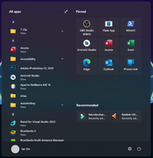](Themes/Windows11_Metro10/screenshot.png)
| [Fluent2Inspired](Themes/Fluent2Inspired/README.md) | [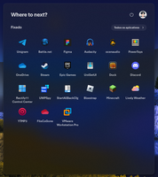](Themes/Fluent2Inspired/screenshot.png)
| [RosePine](Themes/RosePine/README.md) | [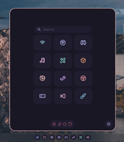](Themes/RosePine/screenshot.png)
| [Windows11_Metro10Minimal](Themes/Windows11_Metro10Minimal/README.md) | [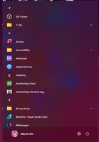](Themes/Windows11_Metro10Minimal/screenshot.png)
| [Everblush](Themes/Everblush/README.md) | [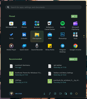](Themes/Everblush/screenshot.png)

## Custom Acrylic background

Target `Border#AcrylicBorder` and set `Background` with an `AcrylicBrush` object, for example:

```
Background:=<AcrylicBrush BackgroundSource="Backdrop" TintColor="Pink" TintOpacity="0.25" />
```

The [AcrylicBrush properties](https://learn.microsoft.com/en-us/uwp/api/windows.ui.xaml.media.acrylicbrush?view=winrt-22621#properties)
can be adjusted as needed.

## Remove the search box

Target `StartDocked.SearchBoxToggleButton`with `Height=0`, `Margin=0,0,0,24` 

## Move pinned app lists

Target `StartMenu.PinnedList` with `Margin=0,0,0,0`
Adjust values as needed.

## Remove the Recommended section

Target the following elements:

`Windows.UI.Xaml.Controls.Grid#ShowMoreSuggestions`

`Windows.UI.Xaml.Controls.Grid#SuggestionsParentContainer`

`Windows.UI.Xaml.Controls.Grid#TopLevelSuggestionsListHeader`

Set the style of each to:

`Visibility=Collapsed`

In addition, the pinned items can be adjusted to
occupy the whole height by targeting `StartMenu.PinnedList` and setting
`Height=504`.

## Remove the user profile button

Target `StartDocked.UserTileView` with `Visibility=Collapsed`.

## Move the power button

Target `StartDocked.PowerOptionsView` with `Margin=-580,-1330,0,0`.
Adjust values as needed.

## Force Light/Dark mode

Sets light/dark mode independantly of what is set in Windows.

`RequestedTheme=1`

`1` = Light Mode

`2` = Dark mode

## Semantic Zoom (Navigation)

Semantic zoom is the feature that allows us to navigate the apps list using the alpha-numeric headers in the list. This lets you jump to a particular letter or number in the apps list quickly.
For themes that have the apps list visible in the main start menu view, this feature does not work. As an optional work around, you may enable the hidden zoom button. This button allows you to access the Alpha-numeric navigation view. This is the zoomed out view, which is why this is called semantic zoom.

````
Target:
Windows.UI.Xaml.Controls.SemanticZoom#ZoomControl
Styles: 
IsZoomOutButtonEnabled=True

Target:
Windows.UI.Xaml.Controls.Button#ZoomOutButton
Styles:
Width=40
Height=40

Target:
Windows.UI.Xaml.Controls.Button#ZoomOutButton > Windows.UI.Xaml.Controls.ContentPresenter#ContentPresenter > Windows.UI.Xaml.Controls.TextBlock
Styles:
Text=
FontSize=28
````

You may replace `Text=` with any other charater. Use Character Map to find, copy, and paste the character into the style box.

# Search Menu
The search menu may also be included in your custom theme, and some of the built in themes support this as well. The search menu has some of its own unique targets, but does share some targets with the start menu. This means that some start menu styles will automatically be inherited and applied to search as well.

In order to include search in your theme:
1. Go to the `Advanced` tab at the top in the Start Menu Styler mod.
2. In the custom process inclusion list below, enter `searchhost.exe` if you are on Windows 11 24h2 or higher, otherwise enter `searchexperiencehost.exe` instead.
3. Click save.


# Colors

In the following examples, we will use `Background` as our style, but this
also works for other properties that accept colors, such as `Fill`.

### Solid color

```
Background=<color>
```

Replace `<color>` with the desired color.

A color can be a name (e.g. `Red`) or a hex code (e.g. `#FF0000`).

The color can be semi-transparent (e.g. `#80FF0000`). To have a fully
transparent background, use `Transparent` or `#00000000`.

### Accent colors

A Color can also be a `ThemeResource` or `StaticResource`. There are many such
styles built into Windows.

```
Background:=<SolidColorBrush Color="{ThemeResource SystemAccentColor}" Opacity="0.8" />
```

Accent colors come as part of an accent color palette. This means that for any color you pick as your system accent color, 3 additional shades are part of that color's palette.  
For example:

`SystemAccentColorLight2` or `SystemAccentColorDark1` 
 
The word `Light` or `Dark` is appended at end with
a number ranging from 1-3. See [the official Microsoft
docs](https://learn.microsoft.com/en-us/windows/apps/design/style/color#accent-color-palette)
for more information.

```
Background:=<SolidColorBrush Color="{ThemeResource SystemAccentColorDark2}" Opacity="0.5" />
```

### Clear Transparent Background

To have a fully transparent background:

```
Target: BorderAcrylicBorder
Style: Background=Transparent
```

### Acrylic effect as color

In order to use the acrylic effect (a blurred background) you can use the
`AcrylicBrush`.

```
Background:=<AcrylicBrush TintColor="Black" TintOpacity="0.8" />
```

`TintColor` - Required. Defines what color to use.

`TintOpacity` - Defines the strength of the chosen color.

`TintLuminosityOpacity` - Defines the brightness of the acrylic effect.

`BackgroundSource` - Defines what should be considered the background of the acrylic effect. Set to "Backdrop" to use the desktop wallpaper.

`Opacity` - Defines how transparent the brush effect itself is. If set to less than 1, it blends the AcrylicBrush with clear transparency.

You can also set Acrylic to use an accent color for a more dynamic look, that fits current theme.

```
Background:=<AcrylicBrush TintColor="{ThemeResource SystemAccentColorDark2}" TintOpacity="0.3" />
```

### Mica effect as color

> [!NOTE]
> Unfortunately, it is not possible to set a Mica effect at this time with any of Windhawk's styler mods

### Gradient as color

The background can also be a gradient. For example, to have a gradient from
yellow to red to blue to lime green, use the following style:

```
Background:=<LinearGradientBrush StartPoint="0,0.5" EndPoint="1,0.5"><GradientStop Color="Yellow" Offset="0.0" /><GradientStop Color="Red" Offset="0.25" /><GradientStop Color="Blue" Offset="0.75" /><GradientStop Color="LimeGreen" Offset="1.0" /></LinearGradientBrush>
```

### Image as color

The background can also be an image:

```
Background:=<ImageBrush Stretch="UniformToFill" ImageSource="<image>" />
```

Replace `<image>` with your own image, a URL or a local file path. 
If you only see a fully transparent background when using a local file path, you must set a URL instead
images can be jpg, jpg XR, png, bmp, svg, tiff, gif, or ico.

Stretch can be set to the following values:

`None` - Image is rendered at its native resolution and aspect ratio.

`Fill` - Image is stretched or squished to fill the size of the element.

`Uniform` - Image is resized to fit the element dimensions, while it preserves its native aspect ratio.

`UniformToFill` - Image is resized to fill the destination dimensions while it preserves its native aspect ratio. Crops to fit element.


### Reveal as color

> [!NOTE]
> Reveal is a deprecated XAML feature. It may have issues
> or stop working at any time.

Reveal is the cursor-based illumination effect from Windows 10.

```
Background:=<RevealBorderBrush Color="Transparent" TargetTheme="1" Opacity="1" />
```

```
BorderBrush:=<RevealBorderBrush Color="Transparent" TargetTheme="1" Opacity="1" />
```

ONLY `RevealBorderBrush` should be used, `RevealBackgroundBrush` does not work correctly in most scenarios.

`Opacity` can be changed to increase or decrease the intensity of the effect.
