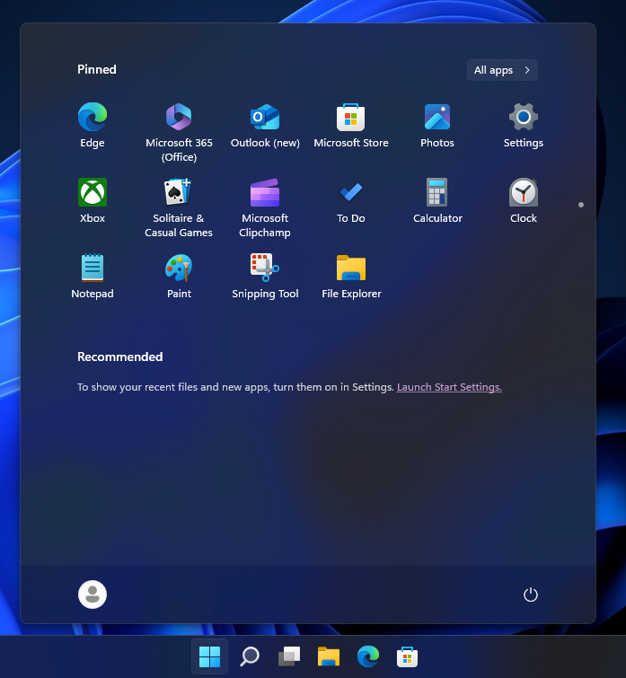
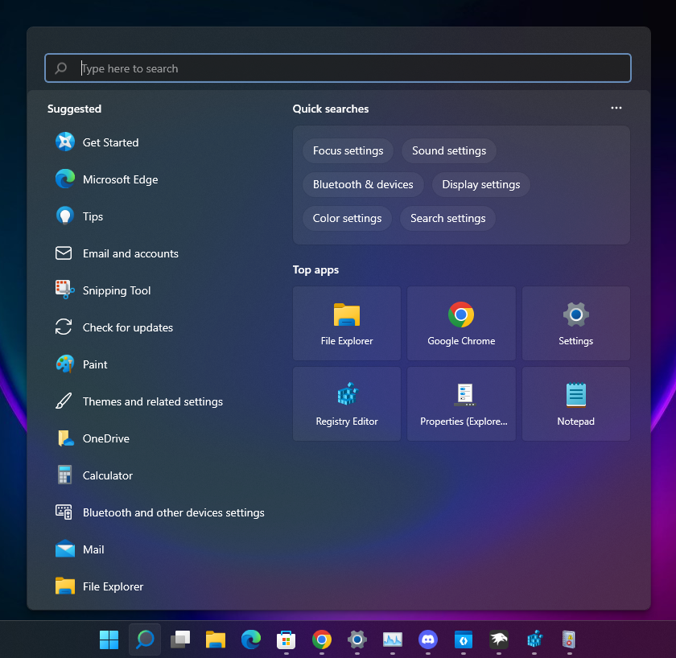

# SunValley (Legacy, formerly 21996) theme for Windows 11 Start Menu Styler

> [!NOTE]
> This theme was superseded by the new [SunValley theme](https://github.com/ramensoftware/windows-11-start-menu-styling-guide/blob/main/Themes/SunValley/README.md)
>
> This theme will not be updated to support newer versions of Windows 11, and the reason why I decided to keep it here is for archival purposes.

This theme tries to recreate the design that the Windows 11 Start menu and search menu had on early Windows 11 builds,
which included:
* Squared search box
* No search box on the Start menu
* Changed 'All' to 'All apps' as it was on older Windows 11 builds
* Reverted the search icon back to the one from 22000
* 21370-22000.9-like Acrylic
* Accent color & light/dark mode support

**Author**: [Tails](https://github.com/milestprower92)

## Old Windows 11 Start Menu:

## Search Menu


## Theme selection

The theme is integrated into the mod and can be selected directly from the mod's
settings:

* Open the Windows 11 Start Menu Styler mod in Windhawk.
* Go to the "Settings" tab.
* Select the theme and save the settings.

## Manual installation

The theme styles can also be imported manually. To do that, follow these steps:

* Open the Windows 11 Start Menu Styler mod in Windhawk.
* Go to the "Advanced" tab.
* Copy the content below to the text box under "Mod settings" and click "Save".

<details>
<summary>Content to import (click to expand)</summary>

```yaml
controlStyles:
  - target: Border#TaskbarSearchBackground
    styles:
      - CornerRadius=4
      - BorderThickness=0,0,0,0
      - Height=33
      - BorderBrush:=<SolidColorBrush Color="{ThemeResource ControlStrokeColorDefault}"/>
  - target: StartDocked.SearchBoxToggleButton > Grid > ContentPresenter > TextBlock#PlaceholderText
    styles:
      - Margin=28,0,0,2
      - Text=Type here to search
  - target: StartDocked.SearchBoxToggleButton#StartMenuSearchBox > Grid > Border#BorderElement
    styles:
      - BorderThickness=2
      - BorderBrush:=<SolidColorBrush Color="{ThemeResource SystemAccentColorLight1}"/>
  - target: FontIcon#SearchGlyph
    styles:
      - Foreground:=<SolidColorBrush Color="gray" />
      - Margin=13,0,-13,1
      - Transform3D:=<CompositeTransform3D RotationY="180" TranslateX="16" />
      - Visibility=Visible
  - target: Microsoft.UI.Xaml.Controls.AnimatedIcon#SearchIconPlayer
    styles:
      - Visibility=1
      - FlowDirection=1
      - Transform3D:=<CompositeTransform3D RotationY="180" TranslateX="16" />
  - target: FontIcon#SearchBoxOnTaskbarSearchGlyph
    styles:
      - Visibility=0
      - Foreground:=<SolidColorBrush Color="gray" />
      - FlowDirection=1
      - FontFamily=Segoe Fluent Icons
      - RequestedTheme=1
      - Transform3D:=<CompositeTransform3D RotationY="180" TranslateX="23" TranslateY="0.5" />
      - FontSize=17
  - target: StartDocked.SearchBoxToggleButton#StartMenuSearchBox > Grid
    styles:
      - BorderBrush:=<SolidColorBrush Color="{ThemeResource ControlStrokeColorDefault}"/>
      - BorderThickness=1,1,1,0
      - CornerRadius=4
  - target: Cortana.UI.Views.RichSearchBoxControl#SearchBoxControl > Grid#RootGrid
    styles:
      - CornerRadius=4
      - BorderBrush:=<SolidColorBrush Color="{ThemeResource SystemAccentColorLight1}" />
      - BorderThickness=2,2,2,2
      - Margin=-2,-0,0,-2
  - target: StartDocked.SearchBoxToggleButton
    styles:
      - CornerRadius=4
      - Height=40
  - target: Windows.UI.Xaml.Controls.Grid#SearchBoxOnTaskbarGleamContainer
    styles:
      - CornerRadius=4
  - target: Windows.UI.Xaml.Controls.Grid#SearchBoxOnTaskbarGleamImageContainer
    styles:
      - CornerRadius=4
      - Transform3D:=<CompositeTransform3D TranslateX="1.8" />
  - target: Windows.UI.Xaml.Controls.Image#SearchIconOff
    styles:
      - Transform3D:=<CompositeTransform3D RotationY="180" TranslateX="16" TranslateY="-1" />
  - target: Windows.UI.Xaml.Controls.Image#SearchIconOn
    styles:
      - Transform3D:=<CompositeTransform3D RotationY="180" TranslateX="16" TranslateY="-1" />
  - target: Windows.UI.Xaml.Controls.Button#ShowAllAppsButton > Windows.UI.Xaml.Controls.ContentPresenter#ContentPresenter > Windows.UI.Xaml.Controls.StackPanel > Windows.UI.Xaml.Controls.TextBlock#ShowAllAppsButtonText
    styles:
      - Text=All apps
  - target: Windows.UI.Xaml.Controls.TextBlock#AllAppsHeading
    styles:
      - Text=All apps
  - target: StartDocked.SearchBoxToggleButton
    styles:
      - Height=0
      - Margin=0,0,0,32
  - target: StartDocked.LauncherFrame
    styles:
      - Height=670
  - target: Windows.UI.Xaml.Controls.Grid#InnerContent
    styles:
      - Margin=0,0,0,0
  - target: Cortana.UI.Views.HostedWebViewControl#QueryFormulationHostedWebView
    styles:
      - Background:=<AcrylicBrush TintColor="{ThemeResource SystemChromeMediumColor}" TintOpacity="1" TintLuminosityOpacity="1" FallbackColor="{ThemeResource SystemChromeLowColor}" />
  - target: Windows.UI.Xaml.Controls.Grid#QueryFormulationRoot
    styles:
      - CornerRadius=10
  - target: Windows.UI.Xaml.Controls.Border#AcrylicBorder
    styles:
      - Opacity=0.5
  - target: Windows.UI.Xaml.Controls.Grid#MainContent
    styles:
      - Background:=<AcrylicBrush TintColor="{ThemeResource SystemChromeMediumColor}" TintOpacity="0" TintLuminosityOpacity="0.5" FallbackColor="{ThemeResource SystemChromeLowColor}" />
      - CornerRadius=7
  - target: Windows.UI.Xaml.Controls.Border#AppBorder
    styles:
      - Background:=<AcrylicBrush TintColor="{ThemeResource SystemChromeMediumColor}" TintOpacity="0" TintLuminosityOpacity="0.7" FallbackColor="{ThemeResource SystemChromeLowColor}" />
  - target: Border#FullBleedBackground
    styles:
      - Background:=<AcrylicBrush TintColor="{ThemeResource SystemChromeMediumColor}" TintOpacity="0.76" TintLuminosityOpacity="0.77" FallbackColor="{ThemeResource SystemChromeLowColor}" />
  - target: Image#SearchIconOn
    styles:
      - Visibility=Collapsed
  - target: Image#SearchIconOff
    styles:
      - Visibility=Collapsed
  - target: StartMenu.SearchBoxToggleButton#SearchBoxToggleButton > Grid > Border
    styles:
      - CornerRadius=3
      - BorderThickness=2
      - BorderBrush:=<SolidColorBrush Color="{ThemeResource SystemAccentColor}"/>
      - Background:=<AcrylicBrush TintColor="{ThemeResource SystemChromeMediumHighColor}" TintOpacity="0" TintLuminosityOpacity="0.7" FallbackColor="{ThemeResource SystemChromeMediumColor}" />
  - target: Windows.UI.Xaml.Controls.TextBlock#AllListHeadingText
    styles:
      - Text=All apps
  - target: Microsoft.UI.Xaml.Controls.DropDownButton > Grid@CommonStates
    styles:
      - Background@Normal:=<AcrylicBrush TintColor="{ThemeResource SystemChromeMediumHighColor}" FallbackColor="{ThemeResource SystemChromeMediumHighColor}" TintOpacity="0" TintLuminosityOpacity="1" />
      - BorderBrush:=<AcrylicBrush TintColor="{ThemeResource SystemChromeHighColor}" FallbackColor="{ThemeResource SystemChromeMediumHighColor}" TintOpacity="0" />
      - BorderThickness=1
  - target: StartMenu.SearchBoxToggleButton > Grid > ContentPresenter > TextBlock#PlaceholderText
    styles:
      - Text=Type here to search
      - Margin=24,0,0,0
  - target: StartMenu.SearchBoxToggleButton#SearchBoxToggleButton
    styles:
      - Height=40
  - target: StartMenu.SearchBoxToggleButton > Grid > Rectangle#TextCaret
    styles:
      - Margin=24,0,0,0
  - target: Windows.UI.Xaml.Controls.TextBlock#PlaceholderTextContentPresenter
    styles:
      - Text=Type here to search
      - Width=750
      - TextAlignment=Left
```
</details>
