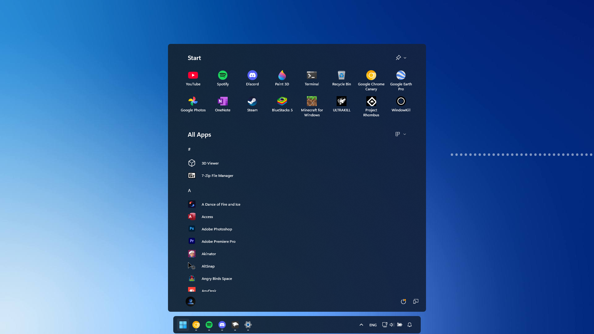

# Borderless theme for Windows 11 Start Menu Styler

A theme for the Start menu that removes the drop shadow and borders (thus the name), the greyish tint in Dark Mode, and the search bar and suggestions (on the old Start Menu).
Updated to include Search Popout as well (Search Bar still perserved).

**Author**: [Ali Cool](https://github.com/AliCool412)


<!--
## Theme selection

The theme is integrated into the mod and can be selected directly from the mod's
settings:

* Open the Windows 11 Start Menu Styler mod in Windhawk.
* Go to the "Settings" tab.
* Select the theme and save the settings.

## Manual installation

The theme styles can also be imported manually. To do that, follow these steps:
-->
## Manual installation

The theme styles can be imported manually. To do that, follow these steps:

* Open the Windows 11 Start Menu Styler mod in Windhawk.
* Go to the "Advanced" tab.
* Copy the content below to the text box under "Mod settings" and click "Save".

<details>
<summary>Content to import (click to expand)</summary>

```json
{
"controlStyles[0].target":"Windows.UI.Xaml.Controls.Grid#TopLevelSuggestionsListHeader",
"controlStyles[0].styles[0]":"Visibility=Collapsed",
"controlStyles[1].target":"Windows.UI.Xaml.Controls.Grid#NoTopLevelSuggestionsText",
"controlStyles[1].styles[0]":"Visibility=Collapsed",
"controlStyles[2].target":"Windows.UI.Xaml.Controls.Grid#TopLevelSuggestionsContainer",
"controlStyles[2].styles[0]":"Visibility=Collapsed",
"controlStyles[3].target":"Windows.UI.Xaml.Controls.Grid#ShowMoreSuggestions",
"controlStyles[3].styles[0]":"Visibility=Collapsed",
"controlStyles[4].target":"Border#DropShadow",
"controlStyles[4].styles[0]":"Opacity=0",
"controlStyles[5].target":"Border#AcrylicBorder",
"controlStyles[5].styles[0]":"BorderThickness=0",
"controlStyles[6].target":"Windows.UI.Xaml.Shapes.Rectangle",
"controlStyles[6].styles[0]":"Visibility=Collapsed",
"controlStyles[7].target":"StartDocked.SearchBoxToggleButton#StartMenuSearchBox",
"controlStyles[7].styles[0]":"Visibility=Collapsed",
"controlStyles[8].target":"Windows.UI.Xaml.Controls.TextBlock#ShowAllAppsButtonText",
"controlStyles[8].styles[0]":"Text=All Apps",
"controlStyles[9].target":"Windows.UI.Xaml.Controls.Button#CloseAllAppsButton > Windows.UI.Xaml.Controls.ContentPresenter#ContentPresenter > Windows.UI.Xaml.Controls.StackPanel > Windows.UI.Xaml.Controls.TextBlock",
"controlStyles[9].styles[0]":"Text=Back",
"controlStyles[10].target":"Windows.UI.Xaml.Controls.TextBlock#UserTileNameText",
"controlStyles[10].styles[0]":"Visibility=Collapsed",
"controlStyles[11].target":"Windows.UI.Xaml.Controls.Button#ShowAllAppsButton",
"controlStyles[11].styles[0]":"Height=30",
"controlStyles[11].styles[1]":"Width=Auto",
"controlStyles[12].target":"Windows.UI.Xaml.Controls.Button#CloseAllAppsButton",
"controlStyles[12].styles[0]":"Height=30",
"controlStyles[12].styles[1]":"Width=Auto",
"controlStyles[13].target":"Windows.UI.Xaml.Controls.TextBlock#PinnedListHeaderText",
"controlStyles[13].styles[0]":"Text=Start",
"controlStyles[13].styles[1]":"FontSize=20",
"controlStyles[14].target":"Windows.UI.Xaml.Controls.TextBlock#AllAppsHeading",
"controlStyles[14].styles[0]":"Text=All Apps",
"controlStyles[14].styles[1]":"FontSize=20",
"controlStyles[15].target":"StartDocked.NavigationPaneButton#UserTileButton > Windows.UI.Xaml.Controls.Grid > Windows.UI.Xaml.Controls.ContentPresenter",
"controlStyles[15].styles[0]":"Padding=3,0,3,0",
"controlStyles[16].target":"Windows.UI.Xaml.Controls.Button#ShowAllAppsButton > Windows.UI.Xaml.Controls.ContentPresenter#ContentPresenter > Windows.UI.Xaml.Controls.StackPanel > Windows.UI.Xaml.Controls.FontIcon",
"controlStyles[16].styles[0]":"Glyph=",
"controlStyles[16].styles[1]":"FontSize=16",
"controlStyles[17].target":"Windows.UI.Xaml.Controls.Button#CloseAllAppsButton > Windows.UI.Xaml.Controls.ContentPresenter#ContentPresenter > Windows.UI.Xaml.Controls.StackPanel > Windows.UI.Xaml.Controls.FontIcon",
"controlStyles[17].styles[0]":"Glyph=",
"controlStyles[17].styles[1]":"FontSize=10",
"controlStyles[18].target":"Windows.UI.Xaml.Controls.Border#AcrylicOverlay",
"controlStyles[18].styles[0]":"Opacity=0",
"controlStyles[19].target":"Windows.UI.Xaml.Controls.Border#StartDropShadow",
"controlStyles[19].styles[0]":"Visibility=Collapsed",
"controlStyles[20].target":"Windows.UI.Xaml.Controls.Grid#MainContent > Windows.UI.Xaml.Controls.Grid > StartMenu.SearchBoxToggleButton#SearchBoxToggleButton",
"controlStyles[20].styles[0]":"Visibility=Collapsed",
"controlStyles[21].target":"Windows.UI.Xaml.Controls.TextBlock#AllListHeadingText",
"controlStyles[21].styles[0]":"Text=All Apps",
"controlStyles[21].styles[1]":"FontSize=20",
"controlStyles[22].target":"Microsoft.UI.Xaml.Controls.DropDownButton#ViewSelectionButton > Windows.UI.Xaml.Controls.Grid#RootGrid > ContentPresenter#ContentPresenter > Windows.UI.Xaml.Controls.TextBlock",
"controlStyles[22].styles[0]":"Text=",
"controlStyles[22].styles[1]":"FontFamily=Segoe Fluent Icons",
"controlStyles[22].styles[2]":"FontSize=16",
"controlStyles[23].target":"Windows.UI.Xaml.Controls.TextBlock#ShowMorePinnedButtonText",
"controlStyles[23].styles[0]":"Text=",
"controlStyles[23].styles[1]":"FontFamily=Segoe Fluent Icons",
"controlStyles[23].styles[2]":"FontSize=16",
"controlStyles[24].target":"Windows.UI.Xaml.Controls.Border#RightCompanionDropShadow",
"controlStyles[24].styles[0]":"Visibility=Collapsed",
"controlStyles[25].target":"Border#RootGridDropShadow",
"controlStyles[25].styles[0]":"Visibility=Collapsed",
"controlStyles[26].target":"Windows.UI.Xaml.Controls.Primitives.ToggleButton#ShowHideCompanion > Windows.UI.Xaml.Controls.Border > Windows.UI.Xaml.Controls.ContentPresenter#ContentPresenter",
"controlStyles[26].styles[0]":"CornerRadius=2",
"controlStyles[27].target":"Windows.UI.Xaml.Controls.Primitives.ToggleButton#ShowHideCompanion > Border > ContentPresenter#ContentPresenter > FontIcon > Grid > TextBlock",
"controlStyles[27].styles[0]":"FontSize=16",
"controlStyles[27].styles[1]":"Text=",
"controlStyles[28].target":"Frame#StartFrame",
"controlStyles[28].styles[0]":"Margin=0,-64,0,0",
"controlStyles[29].target":"Grid#MainMenu > Grid#MainContent > Grid",
"controlStyles[29].styles[0]":"Grid.Row=3",
"controlStyles[30].target":"Windows.UI.Xaml.Controls.Primitives.ToggleButton#ShowHideCompanion > Border > ContentPresenter",
"controlStyles[30].styles[0]":"Height=40",
"controlStyles[30].styles[1]":"Width=40",
"controlStyles[30].styles[2]":"CornerRadius=4",
"controlStyles[31].target":"Windows.UI.Xaml.Controls.Primitives.ToggleButton#ShowHideCompanion > Border",
"controlStyles[31].styles[0]":"Height=40",
"controlStyles[31].styles[1]":"Width=40",
"controlStyles[32].target":"Windows.UI.Xaml.Controls.Primitives.ToggleButton#ShowHideCompanion",
"controlStyles[32].styles[0]":"Height=40",
"controlStyles[32].styles[1]":"Width=40",
"controlStyles[32].styles[2]":"Margin=16,0,-16,0",
"controlStyles[33].target":"Windows.UI.Xaml.Controls.Border#dropshadow",
"controlStyles[33].styles[0]":"Opacity=0",
"controlStyles[34].target":"Windows.UI.Xaml.Controls.Border#LayerBorder",
"controlStyles[34].styles[0]":"Opacity=0",
"controlStyles[35].target":"Windows.UI.Xaml.Controls.Border#AppBorder",
"controlStyles[35].styles[0]":"BorderThickness=0"
}
```
</details>
