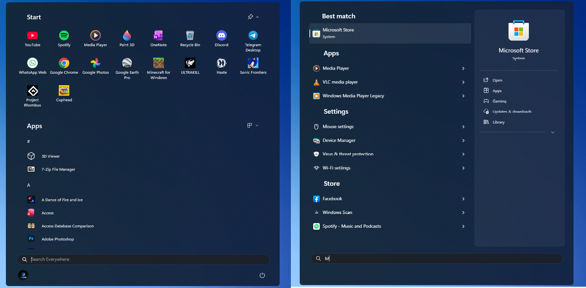

# Borderless theme for Windows 11 Start Menu Styler

A theme for the Start menu that removes the drop shadow and borders (thus the name), and the acrylic tint to make the mica backdrop more visible.
Updated with search popout.

**Author**: [Ali Cool](https://github.com/AliCool412)



## Theme selection

The theme is integrated into the mod and can be selected directly from the mod's
settings:

* Open the Windows 11 Start Menu Styler mod in Windhawk.
* Go to the "Settings" tab.
* Select the theme and save the settings.

## Manual installation

The theme styles can also be imported manually. To do that, follow these steps:

* Open the Windows 11 Start Menu Styler mod in Windhawk.
* Go to the "Settings" tab and select "Textual mode".
* Copy the content below to the text box and click "Save settings".

### Redesigned Start Menu

<details>
<summary>Content to import (click to expand)</summary>

```yaml
styleConstants:
  - ''
controlStyles:
  - target: Windows.UI.Xaml.Controls.Grid#TopLevelSuggestionsListHeader
    styles:
      - Visibility=Collapsed
  - target: Windows.UI.Xaml.Controls.Grid#NoTopLevelSuggestionsText
    styles:
      - Visibility=Collapsed
  - target: Windows.UI.Xaml.Controls.Grid#TopLevelSuggestionsContainer
    styles:
      - Visibility=Collapsed
  - target: Windows.UI.Xaml.Controls.Grid#ShowMoreSuggestions
    styles:
      - Visibility=Collapsed
  - target: Border#DropShadow
    styles:
      - Opacity=0
  - target: Border#AcrylicBorder
    styles:
      - BorderThickness=0
  - target: Windows.UI.Xaml.Controls.TextBlock#ShowAllAppsButtonText
    styles:
      - Text=All Apps
  - target: Windows.UI.Xaml.Controls.TextBlock#UserTileNameText
    styles:
      - Visibility=Collapsed
  - target: Windows.UI.Xaml.Controls.Button#ShowAllAppsButton
    styles:
      - Height=30
      - Width=Auto
  - target: Windows.UI.Xaml.Controls.Button#CloseAllAppsButton
    styles:
      - Height=30
      - Width=Auto
  - target: Windows.UI.Xaml.Controls.TextBlock#PinnedListHeaderText
    styles:
      - Text=Start
      - FontSize=20
  - target: Windows.UI.Xaml.Controls.TextBlock#AllAppsHeading
    styles:
      - Text=Apps
      - FontSize=20
  - target: StartDocked.NavigationPaneButton#UserTileButton > Windows.UI.Xaml.Controls.Grid > Windows.UI.Xaml.Controls.ContentPresenter
    styles:
      - Padding=3,0,3,0
  - target: Windows.UI.Xaml.Controls.Button#ShowAllAppsButton > Windows.UI.Xaml.Controls.ContentPresenter#ContentPresenter > Windows.UI.Xaml.Controls.StackPanel > Windows.UI.Xaml.Controls.FontIcon
    styles:
      - Glyph=
      - FontSize=16
  - target: Windows.UI.Xaml.Controls.Button#CloseAllAppsButton > Windows.UI.Xaml.Controls.ContentPresenter#ContentPresenter > Windows.UI.Xaml.Controls.StackPanel > Windows.UI.Xaml.Controls.FontIcon
    styles:
      - Glyph=
      - FontSize=10
  - target: Windows.UI.Xaml.Controls.Border#AcrylicOverlay
    styles:
      - Opacity=0
  - target: Windows.UI.Xaml.Controls.Border#StartDropShadow
    styles:
      - Visibility=Collapsed
  - target: Windows.UI.Xaml.Controls.TextBlock#AllListHeadingText
    styles:
      - Text=Apps
      - FontSize=20
  - target: Microsoft.UI.Xaml.Controls.DropDownButton#ViewSelectionButton > Windows.UI.Xaml.Controls.Grid#RootGrid > ContentPresenter#ContentPresenter > Windows.UI.Xaml.Controls.TextBlock
    styles:
      - Text=
      - FontFamily=Segoe Fluent Icons
      - FontSize=16
  - target: Windows.UI.Xaml.Controls.TextBlock#ShowMorePinnedButtonText
    styles:
      - Text=
      - FontFamily=Segoe Fluent Icons
      - FontSize=16
  - target: Windows.UI.Xaml.Controls.Border#RightCompanionDropShadow
    styles:
      - Visibility=Collapsed
  - target: Border#RootGridDropShadow
    styles:
      - Visibility=Collapsed
  - target: Windows.UI.Xaml.Controls.Primitives.ToggleButton#ShowHideCompanion > Windows.UI.Xaml.Controls.Border > Windows.UI.Xaml.Controls.ContentPresenter#ContentPresenter
    styles:
      - CornerRadius=2
  - target: Windows.UI.Xaml.Controls.Primitives.ToggleButton#ShowHideCompanion > Border > ContentPresenter#ContentPresenter > FontIcon > Grid > TextBlock
    styles:
      - FontSize=16
      - FontWeight=Light
  - target: Frame#StartFrame
    styles:
      - Margin=0,-24,0,0
  - target: Windows.UI.Xaml.Controls.Primitives.ToggleButton#ShowHideCompanion > Border > ContentPresenter
    styles:
      - Height=40
      - Width=40
      - CornerRadius=4
  - target: Windows.UI.Xaml.Controls.Primitives.ToggleButton#ShowHideCompanion > Border
    styles:
      - Height=40
      - Width=40
  - target: Windows.UI.Xaml.Controls.Primitives.ToggleButton#ShowHideCompanion
    styles:
      - Height=40
      - Width=40
  - target: Windows.UI.Xaml.Controls.Border#dropshadow
    styles:
      - Opacity=0
  - target: Windows.UI.Xaml.Controls.Border#LayerBorder
    styles:
      - Opacity=0
  - target: Windows.UI.Xaml.Controls.Border#AppBorder
    styles:
      - BorderThickness=0
  - target: Windows.UI.Xaml.Controls.Grid#MainMenu > Windows.UI.Xaml.Controls.Grid#MainContent > Windows.UI.Xaml.Controls.Grid
    styles:
      - Grid.Row=4
  - target: Windows.UI.Xaml.Controls.Grid#NavPanePlaceholder
    styles:
      - Margin=32,0,32,0
  - target: Windows.UI.Xaml.Controls.Frame#StartFrame
    styles:
      - Margin=0,-64,0,48
  - target: Cortana.UI.Views.RichSearchBoxControl#SearchBoxControl
    styles:
      - Grid.Row=2
      - Margin=33,-65,33,65
      - Height=32
  - target: Windows.UI.Xaml.Controls.Border#TaskbarSearchBackground
    styles:
      - Grid.Row=2
      - Margin=33,-65,33,65
  - target: Windows.UI.Xaml.Controls.Grid#OuterBorderGrid
    styles:
      - Grid.Row=1
  - target: Windows.UI.Xaml.Controls.Border#TaskbarMargin
    styles:
      - Grid.Row=3
  - target: Windows.UI.Xaml.Controls.Grid#QueryFormulationRoot
    styles:
      - Margin=0,24,0,84
  - target: Microsoft.UI.Xaml.Controls.AnimatedIcon#SearchIconPlayer
    styles:
      - Visibility=Collapsed
  - target: Windows.UI.Xaml.Controls.Button#SearchGlyphContainer
    styles:
      - Visibility=Visible
      - Margin=16,0,12,0
  - target: Windows.UI.Xaml.Controls.Image#SearchIconOff
    styles:
      - Visibility=Collapsed
  - target: Windows.UI.Xaml.Controls.Image#SearchIconOn
    styles:
      - Visibility=Collapsed
  - target: Windows.UI.Xaml.Controls.FontIcon#SearchGlyph
    styles:
      - Visibility=Visible
  - target: Windows.UI.Xaml.Controls.TextBlock#PlaceholderText
    styles:
      - Text=Search Everywhere
      - FontFamily=Segoe UI Variable Display
  - target: Windows.UI.Xaml.Controls.TextBlock#PlaceholderTextContentPresenter
    styles:
      - Text=Search Everywhere
      - FontFamily=Segoe UI Variable Display
  - target: StartMenu.SearchBoxToggleButton#SearchBoxToggleButton
    styles:
      - Margin=0,-48,0,48
themeResourceVariables:
  - ''
webContentStyles:
  - target: .curatedSettingsGroup
    styles:
      - 'display: none !important'
  - target: .topItemsGroup
    styles:
      - 'display: none !important'
  - target: .scope-tile__button
    styles:
      - 'display: none !important'
  - target: body[dir] .groupTitle
    styles:
      - 'font-size: 20px'
      - 'margin-left: 32px !important'
      - 'font-family: Segoe UI Variable Display'
      - line-height=32px
  - target: .scopesListContainer
    styles:
      - 'display: none !important'
  - target: .groupTitleText
    styles:
      - 'font-size: 20px'
      - 'line-height: 32px'
  - target: '.zeroInput19H1 #qfContainer #groups>div'
    styles:
      - 'display: flex !important'
  - target: '#qfPreviewPane'
    styles:
      - 'min-width: 300px !important'
```
</details>


### Classic Start Menu

<details>
<summary>Content to import (click to expand)</summary>

```yaml
styleConstants:
  - ''
controlStyles:
  - target: Windows.UI.Xaml.Controls.Grid#TopLevelSuggestionsListHeader
    styles:
      - Visibility=Collapsed
  - target: Windows.UI.Xaml.Controls.Grid#NoTopLevelSuggestionsText
    styles:
      - Visibility=Collapsed
  - target: Windows.UI.Xaml.Controls.Grid#TopLevelSuggestionsContainer
    styles:
      - Visibility=Collapsed
  - target: Windows.UI.Xaml.Controls.Grid#ShowMoreSuggestions
    styles:
      - Visibility=Collapsed
  - target: Border#DropShadow
    styles:
      - Opacity=0
  - target: Border#AcrylicBorder
    styles:
      - BorderThickness=0
  - target: Windows.UI.Xaml.Controls.TextBlock#ShowAllAppsButtonText
    styles:
      - Text=All Apps
  - target: Windows.UI.Xaml.Controls.TextBlock#UserTileNameText
    styles:
      - Visibility=Collapsed
  - target: Windows.UI.Xaml.Controls.Button#ShowAllAppsButton
    styles:
      - Height=30
      - Width=Auto
  - target: Windows.UI.Xaml.Controls.Button#CloseAllAppsButton
    styles:
      - Height=30
      - Width=Auto
  - target: Windows.UI.Xaml.Controls.TextBlock#PinnedListHeaderText
    styles:
      - Text=Start
      - FontSize=20
  - target: Windows.UI.Xaml.Controls.TextBlock#AllAppsHeading
    styles:
      - Text=All Apps
      - FontSize=20
  - target: StartDocked.NavigationPaneButton#UserTileButton > Windows.UI.Xaml.Controls.Grid > Windows.UI.Xaml.Controls.ContentPresenter
    styles:
      - Padding=3,0,3,0
  - target: Windows.UI.Xaml.Controls.Button#ShowAllAppsButton > Windows.UI.Xaml.Controls.ContentPresenter#ContentPresenter > Windows.UI.Xaml.Controls.StackPanel > Windows.UI.Xaml.Controls.FontIcon
    styles:
      - Glyph=
      - FontSize=16
  - target: Windows.UI.Xaml.Controls.Button#CloseAllAppsButton > Windows.UI.Xaml.Controls.ContentPresenter#ContentPresenter > Windows.UI.Xaml.Controls.StackPanel > Windows.UI.Xaml.Controls.FontIcon
    styles:
      - Glyph=
      - FontSize=10
  - target: Windows.UI.Xaml.Controls.Border#AcrylicOverlay
    styles:
      - Opacity=0
  - target: Windows.UI.Xaml.Controls.Border#StartDropShadow
    styles:
      - Visibility=Collapsed
  - target: Windows.UI.Xaml.Controls.TextBlock#AllListHeadingText
    styles:
      - Text=All Apps
      - FontSize=20
  - target: Microsoft.UI.Xaml.Controls.DropDownButton#ViewSelectionButton > Windows.UI.Xaml.Controls.Grid#RootGrid > ContentPresenter#ContentPresenter > Windows.UI.Xaml.Controls.TextBlock
    styles:
      - Text=
      - FontFamily=Segoe Fluent Icons
      - FontSize=16
  - target: Windows.UI.Xaml.Controls.TextBlock#ShowMorePinnedButtonText
    styles:
      - Text=
      - FontFamily=Segoe Fluent Icons
      - FontSize=16
  - target: Windows.UI.Xaml.Controls.Border#RightCompanionDropShadow
    styles:
      - Visibility=Collapsed
  - target: Border#RootGridDropShadow
    styles:
      - Visibility=Collapsed
  - target: Windows.UI.Xaml.Controls.Primitives.ToggleButton#ShowHideCompanion > Windows.UI.Xaml.Controls.Border > Windows.UI.Xaml.Controls.ContentPresenter#ContentPresenter
    styles:
      - CornerRadius=2
  - target: Windows.UI.Xaml.Controls.Primitives.ToggleButton#ShowHideCompanion > Border > ContentPresenter#ContentPresenter > FontIcon > Grid > TextBlock
    styles:
      - FontSize=16
      - FontWeight=Light
  - target: Frame#StartFrame
    styles:
      - Margin=0,-24,0,0
  - target: Windows.UI.Xaml.Controls.Primitives.ToggleButton#ShowHideCompanion > Border > ContentPresenter
    styles:
      - Height=40
      - Width=40
      - CornerRadius=4
  - target: Windows.UI.Xaml.Controls.Primitives.ToggleButton#ShowHideCompanion > Border
    styles:
      - Height=40
      - Width=40
  - target: Windows.UI.Xaml.Controls.Primitives.ToggleButton#ShowHideCompanion
    styles:
      - Height=40
      - Width=40
  - target: Windows.UI.Xaml.Controls.Border#dropshadow
    styles:
      - Opacity=0
  - target: Windows.UI.Xaml.Controls.Border#LayerBorder
    styles:
      - Opacity=0
  - target: Windows.UI.Xaml.Controls.Border#AppBorder
    styles:
      - BorderThickness=0
themeResourceVariables:
  - ''
webContentStyles:
  - target: .curatedSettingsGroup
    styles:
      - 'display: none !important'
  - target: .topItemsGroup
    styles:
      - 'display: none !important'
  - target: .scope-tile__button
    styles:
      - 'display: none !important'
  - target: body[dir] .groupTitle
    styles:
      - 'font-size: 20px'
      - 'margin-left: 32px !important'
      - 'font-family: Segoe UI Variable Display'
      - line-height=32px
  - target: .scopesListContainer
    styles:
      - 'display: none !important'
  - target: .groupTitleText
    styles:
      - 'font-size: 20px'
      - 'line-height: 32px'
  - target: '.zeroInput19H1 #qfContainer #groups>div'
    styles:
      - 'display: flex !important'
  - target: '#qfPreviewPane'
    styles:
      - 'min-width: 300px !important'
      - 'margin-bottom: 12px !important'

```
</details>
