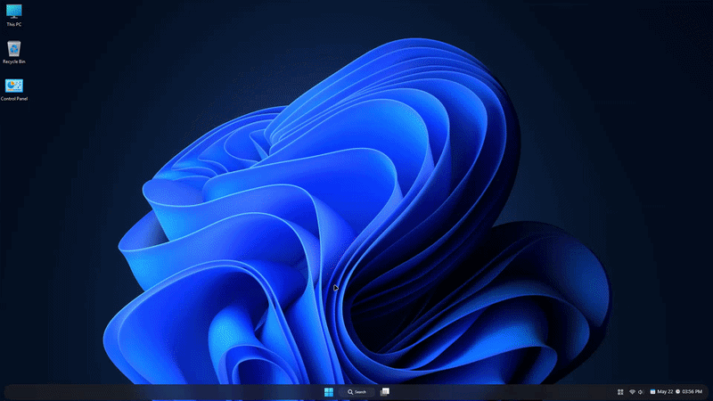

# Command Center theme for Windows 11 Start Menu Styler

Command Center theme inspired by the command centers from various mobile operating systems. It features a completely transparent background to allow for a floating widget styled appearance.

**Author**: [PhantomNimbi](https://github.com/PhantomNimbi)



> [!IMPORTANT]
> This theme is designed for the [redesigned Windows 11 Start menu](https://microsoft.design/articles/start-fresh-redesigning-windows-start-menu/) that is gradually rolling out with the 25H2 update. It is meant to use the categories view and is not built for any other view mode.

## Theme selection

The theme is integrated into the mod and can be selected directly from the mod's
settings:

* Open the Windows 11 Start Menu Styler mod in Windhawk.
* Go to the "Settings" tab.
* Select the theme and save the settings.

## Manual installation

The theme styles can also be imported manually. To do that, follow these steps:

* Open the Windows 11 Start Menu Styler mod in Windhawk.
* Go to the "Advanced" tab.
* Copy the content below to the text box under "Mod settings" and click "Save".

<details>
<summary>Content to import (click to expand)</summary>

```json
{
  "styleConstants[0]": "CornerRadius=20",
  "styleConstants[1]": "Background=<AcrylicBrush TintColor=\"{ThemeResource CardStrokeColorDefaultSolid}\" FallbackColor=\"{ThemeResource CardStrokeColorDefaultSolid}\" TintOpacity=\"0\" TintLuminosityOpacity=\".5\" Opacity=\"1\"/>",
  "styleConstants[2]": "BorderThickness=0.3,1,0.3,1",
  "styleConstants[3]": "BorderBrush=<LinearGradientBrush StartPoint=\"0,0\" EndPoint=\"0,1\"><GradientStop Color=\"#60808080\" Offset=\"0.0\" /><GradientStop Color=\"#50404040\" Offset=\"0.25\" /><GradientStop Color=\"#40808080\" Offset=\"1\" /></LinearGradientBrush>",
  "controlStyles[0].target": "Windows.UI.Xaml.Controls.Grid#RootPanel > Windows.UI.Xaml.Controls.Grid#RootGrid > Windows.UI.Xaml.Controls.Grid#RootContent",
  "controlStyles[0].styles[0]": "Margin=-20,-20,-20,0",
  "controlStyles[1].target": "StartDocked.StartSizingFrame",
  "controlStyles[1].styles[0]": "Width=860",
  "controlStyles[2].target": "Windows.UI.Xaml.Controls.Border#RootGridDropShadow",
  "controlStyles[2].styles[0]": "Visibility=1",
  "controlStyles[3].target": "Windows.UI.Xaml.Controls.Border#RightCompanionDropShadow",
  "controlStyles[3].styles[0]": "Visibility=1",
  "controlStyles[4].target": "Windows.UI.Xaml.Controls.Border#StartDropShadow",
  "controlStyles[4].styles[0]": "Visibility=1",
  "controlStyles[5].target": "Windows.UI.Xaml.Controls.Border#DropShadowDismissTarget",
  "controlStyles[5].styles[0]": "Background:=$Background",
  "controlStyles[5].styles[1]": "BorderBrush:=$BorderBrush",
  "controlStyles[5].styles[2]": "BorderThickness=$BorderThickness",
  "controlStyles[5].styles[3]": "CornerRadius=$CornerRadius",
  "controlStyles[5].styles[4]": "Margin=2",
  "controlStyles[5].styles[5]": "Padding=0",
  "controlStyles[5].styles[6]": "Visibility=1",
  "controlStyles[6].target": "Windows.UI.Xaml.Controls.Grid#RootContent > Windows.UI.Xaml.Controls.Border#AcrylicBorder",
  "controlStyles[6].styles[0]": "Background:=$Background",
  "controlStyles[6].styles[1]": "BorderBrush:=$BorderBrush",
  "controlStyles[6].styles[2]": "BorderThickness=$BorderThickness",
  "controlStyles[6].styles[3]": "CornerRadius=$CornerRadius",
  "controlStyles[6].styles[4]": "Margin=0,60,0,10",
  "controlStyles[6].styles[5]": "Visibility=1",
  "controlStyles[7].target": "Windows.UI.Xaml.Controls.Border#AcrylicOverlay",
  "controlStyles[7].styles[0]": "Visibility=1",
  "controlStyles[8].target": "StartDocked.SearchBoxToggleButton#StartMenuSearchBox",
  "controlStyles[8].styles[0]": "Width=650",
  "controlStyles[8].styles[1]": "Height=50",
  "controlStyles[8].styles[2]": "Margin=0,-15,0,0",
  "controlStyles[9].target": "Windows.UI.Xaml.Controls.Grid#TopLevelSuggestionsRoot",
  "controlStyles[9].styles[0]": "Visibility=1",
  "controlStyles[10].target": "StartDocked.SearchBoxToggleButton#StartMenuSearchBox > Windows.UI.Xaml.Controls.Grid > Windows.UI.Xaml.Controls.Border#BorderElement",
  "controlStyles[10].styles[0]": "Background:=$Background",
  "controlStyles[10].styles[1]": "BorderBrush:=$BorderBrush",
  "controlStyles[10].styles[2]": "BorderThickness=$BorderThickness",
  "controlStyles[10].styles[3]": "CornerRadius=$CornerRadius",
  "controlStyles[11].target": "StartDocked.SearchBoxToggleButton#StartMenuSearchBox > Windows.UI.Xaml.Controls.Grid > Windows.UI.Xaml.Controls.ContentPresenter#ContentPresenter > Windows.UI.Xaml.Controls.TextBlock#PlaceholderText",
  "controlStyles[11].styles[0]": "Text=Search This PC",
  "controlStyles[12].target": "Windows.UI.Xaml.Controls.Grid#TopLevelRoot > Windows.UI.Xaml.Controls.Grid",
  "controlStyles[12].styles[0]": "Visibility=1",
  "controlStyles[13].target": "StartDocked.NavigationPaneView#NavigationPane",
  "controlStyles[13].styles[0]": "Width=550",
  "controlStyles[13].styles[1]": "RenderTransform:=<TranslateTransform X=\"0\" Y=\"10\" />",
  "controlStyles[14].target": "Windows.UI.Xaml.Controls.Button#ShowAllAppsButton",
  "controlStyles[14].styles[0]": "Visibility=1",
  "controlStyles[15].target": "StartMenu.PinnedList#StartMenuPinnedList",
  "controlStyles[15].styles[0]": "Margin=0",
  "controlStyles[15].styles[1]": "Height=280",
  "controlStyles[16].target": "StartMenu.PinnedList#StartMenuPinnedList > Windows.UI.Xaml.Controls.Grid#Root",
  "controlStyles[16].styles[0]": "Background:=$Background",
  "controlStyles[16].styles[1]": "BorderBrush:=$BorderBrush",
  "controlStyles[16].styles[2]": "BorderThickness=$BorderThickness",
  "controlStyles[16].styles[3]": "CornerRadius=$CornerRadius",
  "controlStyles[17].target": "Windows.UI.Xaml.Controls.Grid#UndockedRoot",
  "controlStyles[17].styles[0]": "Visibility=0",
  "controlStyles[17].styles[1]": "Width=650",
  "controlStyles[17].styles[2]": "Margin=0,-130,0,230",
  "controlStyles[17].styles[3]": "Canvas.ZIndex=1",
  "controlStyles[17].styles[4]": "MaxHeight:=340",
  "controlStyles[18].target": "Windows.UI.Xaml.Controls.Grid#AllAppsRoot",
  "controlStyles[18].styles[0]": "Visibility=0",
  "controlStyles[18].styles[1]": "Margin=-1600,190,115,-100",
  "controlStyles[18].styles[2]": "MaxHeight=330",
  "controlStyles[18].styles[3]": "Background:=$Background",
  "controlStyles[18].styles[4]": "CornerRadius=$CornerRadius",
  "controlStyles[18].styles[5]": "Width=650",
  "controlStyles[18].styles[6]": "BorderBrush:=$BorderBrush",
  "controlStyles[18].styles[7]": "BorderThickness=$BorderThickness",
  "controlStyles[19].target": "Windows.UI.Xaml.Controls.Button#CloseAllAppsButton",
  "controlStyles[19].styles[0]": "Visibility=1",
  "controlStyles[20].target": "Windows.UI.Xaml.Controls.Grid > AllListHeading",
  "controlStyles[20].styles[0]": "Visibility=1",
  "controlStyles[21].target": "StartDocked.AllAppsPane#AllAppsPanel",
  "controlStyles[21].styles[0]": "Margin=-20,-20,20,20",
  "controlStyles[22].target": "StartDocked.StartMenuCompanion#RightCompanion > Windows.UI.Xaml.Controls.Grid#CompanionRoot > Windows.UI.Xaml.Controls.Border#AcrylicBorder",
  "controlStyles[22].styles[0]": "Background:=$Background",
  "controlStyles[22].styles[1]": "BorderBrush:=$BorderBrush",
  "controlStyles[22].styles[2]": "BorderThickness=$BorderThickness",
  "controlStyles[22].styles[3]": "CornerRadius:=$CornerRadius",
  "controlStyles[22].styles[4]": "Visibility=1",
  "controlStyles[23].target": "Windows.UI.Xaml.Controls.Grid#CompanionRoot > Windows.UI.Xaml.Controls.Grid#MainContent > Windows.UI.Xaml.Controls.Grid#ActionsBar > Windows.UI.Xaml.Controls.Button#PrimaryActionBarButton > Windows.UI.Xaml.Controls.ContentPresenter#ContentPresenter",
  "controlStyles[23].styles[0]": "Background:=$Background",
  "controlStyles[23].styles[1]": "BorderBrush:=$BorderBrush",
  "controlStyles[23].styles[2]": "BorderThickness=$BorderThickness",
  "controlStyles[23].styles[3]": "CornerRadius=$CornerRadius",
  "controlStyles[23].styles[4]": "Height=40",
  "controlStyles[24].target": "Windows.UI.Xaml.Controls.Grid#ActionsBar > Windows.UI.Xaml.Controls.Button#ActionBarOverflowButton",
  "controlStyles[24].styles[0]": "Background:=$Background",
  "controlStyles[24].styles[1]": "BorderBrush:=$BorderBrush",
  "controlStyles[24].styles[2]": "BorderThickness=$BorderThickness",
  "controlStyles[24].styles[3]": "CornerRadius=$CornerRadius",
  "controlStyles[24].styles[4]": "Height=40",
  "controlStyles[25].target": "StartDocked.StartMenuCompanion#RightCompanion > Windows.UI.Xaml.Controls.Grid#CompanionRoot",
  "controlStyles[25].styles[0]": "Height=730",
  "controlStyles[25].styles[1]": "Margin=0,-10,0,-10",
  "controlStyles[25].styles[2]": "Padding=10,0,-2,0",
  "controlStyles[26].target": "Windows.UI.Xaml.Controls.Border#OverflowFlyoutBackgroundBorder",
  "controlStyles[26].styles[0]": "Background:=$Background",
  "controlStyles[26].styles[1]": "BorderBrush:=$BorderBrush",
  "controlStyles[26].styles[2]": "BorderThickness=$BorderThickness",
  "controlStyles[26].styles[3]": "CornerRadius=$CornerRadius",
  "controlStyles[27].target": "Windows.UI.Xaml.Controls.MenuFlyoutPresenter > Windows.UI.Xaml.Controls.Border",
  "controlStyles[27].styles[0]": "Background:=$Background",
  "controlStyles[27].styles[1]": "BorderBrush:=$BorderBrush",
  "controlStyles[27].styles[2]": "BorderThickness=$BorderThickness",
  "controlStyles[27].styles[3]": "CornerRadius=$CornerRadius",
  "controlStyles[28].target": "Windows.UI.Xaml.Controls.Grid#HoverFlyoutGrid > Windows.UI.Xaml.Controls.Border#HoverFlyoutBackground",
  "controlStyles[28].styles[0]": "Background:=$Background",
  "controlStyles[28].styles[1]": "BorderBrush:=$BorderBrush",
  "controlStyles[28].styles[2]": "BorderThickness=$BorderThickness",
  "controlStyles[28].styles[3]": "CornerRadius=$CornerRadius",
  "controlStyles[29].target": "Cortana.UI.Views.TaskbarSearchPage > Windows.UI.Xaml.Controls.Grid#RootGrid > Windows.UI.Xaml.Controls.Grid#OuterBorderGrid",
  "controlStyles[29].styles[0]": "Background:=$Background",
  "controlStyles[29].styles[1]": "BorderBrush:=$BorderBrush",
  "controlStyles[29].styles[2]": "BorderThickness=$BorderThickness",
  "controlStyles[29].styles[3]": "CornerRadius=$CornerRadius",
  "controlStyles[30].target": "Windows.UI.Xaml.Controls.Border#LayerBorder",
  "controlStyles[30].styles[0]": "Visibility=1",
  "controlStyles[31].target": "Windows.UI.Xaml.Controls.Border#AccentLayerBorder",
  "controlStyles[31].styles[0]": "Visibility=1",
  "controlStyles[32].target": "Windows.UI.Xaml.Controls.Border#DropShadow",
  "controlStyles[32].styles[0]": "Visibility=1",
  "controlStyles[33].target": "Windows.UI.Xaml.Controls.Border#AppBorder",
  "controlStyles[33].styles[0]": "Visibility=1",
  "controlStyles[34].target": "Windows.UI.Xaml.Controls.ToolTip > Windows.UI.Xaml.Controls.ContentPresenter#LayoutRoot",
  "controlStyles[34].styles[0]": "Background:=$Background",
  "controlStyles[34].styles[1]": "BorderBrush:=$BorderBrush",
  "controlStyles[34].styles[2]": "BorderThickness=$BorderThickness",
  "controlStyles[34].styles[3]": "CornerRadius=15",
  "controlStyles[35].target": "Microsoft.UI.Xaml.Controls.PipsPager#PipsPager",
  "controlStyles[35].styles[0]": "Margin=-30,-10,0,10",
  "controlStyles[36].target": "StartMenu.FolderModal#StartFolderModal > Windows.UI.Xaml.Controls.Grid#Root",
  "controlStyles[36].styles[0]": "MaxHeight:=420",
  "controlStyles[36].styles[1]": "MaxWidth:=420",
  "controlStyles[36].styles[2]": "Height=Auto",
  "controlStyles[36].styles[3]": "Width=Auto",
  "controlStyles[37].target": "StartMenu.FolderModal#StartFolderModal > Windows.UI.Xaml.Controls.Grid#Root > Windows.UI.Xaml.Controls.ContentControl#ContentControl > Windows.UI.Xaml.Controls.ContentPresenter > StartMenu.UniversalTileContainer#UniversalTileContainer > Windows.UI.Xaml.Controls.Grid#GridViewContainer",
  "controlStyles[37].styles[0]": "Width=360",
  "controlStyles[37].styles[1]": "Height=400",
  "controlStyles[38].target": "Windows.UI.Xaml.Controls.Grid#Root > Windows.UI.Xaml.Controls.Border",
  "controlStyles[38].styles[0]": "Background:=$Background",
  "controlStyles[38].styles[1]": "BorderBrush:=$BorderBrush",
  "controlStyles[38].styles[2]": "BorderThickness=$BorderThickness",
  "controlStyles[38].styles[3]": "CornerRadius=$CornerRadius",
  "controlStyles[39].target": "StartMenu.ExpandedFolderList",
  "controlStyles[39].styles[0]": "Margin=0,30,0,-120",
  "controlStyles[40].target": "Windows.UI.Xaml.Controls.Grid#MainMenu > Windows.UI.Xaml.Controls.Border#AcrylicBorder",
  "controlStyles[40].styles[0]": "Visibility=1",
  "controlStyles[41].target": "StartMenu.SearchBoxToggleButton#SearchBoxToggleButton",
  "controlStyles[41].styles[0]": "Height=50",
  "controlStyles[41].styles[1]": "Margin=-20,20,-20,-20",
  "controlStyles[41].styles[2]": "Width=340",
  "controlStyles[42].target": "StartMenu.SearchBoxToggleButton#SearchBoxToggleButton > Windows.UI.Xaml.Controls.Grid > Windows.UI.Xaml.Controls.Border#BorderElement",
  "controlStyles[42].styles[0]": "Background:=$Background",
  "controlStyles[42].styles[1]": "BorderBrush:=$BorderBrush",
  "controlStyles[42].styles[2]": "BorderThickness=$BorderThickness",
  "controlStyles[42].styles[3]": "CornerRadius:=$CornerRadius",
  "controlStyles[43].target": "Windows.UI.Xaml.Controls.Primitives.ToggleButton#ShowHideCompanion",
  "controlStyles[43].styles[0]": "Margin=-68,40,0,0",
  "controlStyles[44].target": "Windows.UI.Xaml.Controls.TextBlock#PinnedListHeaderText",
  "controlStyles[44].styles[0]": "Visibility=1",
  "controlStyles[45].target": "Windows.UI.Xaml.Controls.Grid#AllListHeading",
  "controlStyles[45].styles[0]": "Visibility=1",
  "controlStyles[46].target": "StartMenu.CategoryControl > Windows.UI.Xaml.Controls.Grid#RootGrid > Windows.UI.Xaml.Controls.Border",
  "controlStyles[46].styles[0]": "Background:=$Background",
  "controlStyles[46].styles[1]": "BorderBrush:=$BorderBrush",
  "controlStyles[46].styles[2]": "BorderThickness=$BorderThickness",
  "controlStyles[46].styles[3]": "CornerRadius=$CornerRadius",
  "controlStyles[47].target": "Windows.UI.Xaml.Controls.Grid#MainMenu",
  "controlStyles[47].styles[0]": "Width=460",
  "controlStyles[48].target": "StartMenu.PinnedList#StartMenuPinnedList",
  "controlStyles[48].styles[0]": "Width=340",
  "controlStyles[48].styles[1]": "MaxHeight=450",
  "controlStyles[48].styles[2]": "Margin=0,0,0,30",
  "controlStyles[49].target": "Windows.UI.Xaml.Controls.GridView#PinnedList > Border > Windows.UI.Xaml.Controls.ScrollViewer",
  "controlStyles[49].styles[0]": "ScrollViewer.VerticalScrollMode=2",
  "controlStyles[49].styles[1]": "MaxHeight:=336",
  "controlStyles[49].styles[2]": "MinHeight:=100",
  "controlStyles[49].styles[3]": "Width=300",
  "controlStyles[49].styles[4]": "Margin=0,0,60,0",
  "controlStyles[50].target": "StartMenu.StartMenuCompanion#RightCompanion",
  "controlStyles[50].styles[0]": "Height=810",
  "controlStyles[50].styles[1]": "Margin=15,0,30,0",
  "controlStyles[51].target": "Windows.UI.Xaml.Controls.Grid#CompanionRoot > Windows.UI.Xaml.Controls.Border#AcrylicBorder",
  "controlStyles[51].styles[0]": "Background:=$Background",
  "controlStyles[51].styles[1]": "BorderBrush:=$BorderBrush",
  "controlStyles[51].styles[2]": "BorderThickness=$BorderThickness",
  "controlStyles[51].styles[3]": "CornerRadius=$CornerRadius",
  "controlStyles[52].target": "Windows.UI.Xaml.Controls.GridView#AllAppsGrid > Windows.UI.Xaml.Controls.ItemsWrapGrid",
  "controlStyles[52].styles[0]": "Visibility=0",
  "controlStyles[53].target": "Windows.UI.Xaml.Controls.GridView#AllAppsGrid",
  "controlStyles[53].styles[0]": "Margin=0,15,0,0",
  "controlStyles[54].target": "Windows.UI.Xaml.Controls.Grid#TopLevelHeader > Windows.UI.Xaml.Controls.Grid > Windows.UI.Xaml.Controls.Button",
  "controlStyles[54].styles[0]": "Visibility=1",
  "controlStyles[55].target": "Windows.UI.Xaml.Controls.FlyoutPresenter",
  "controlStyles[55].styles[0]": "Background:=$Background",
  "controlStyles[55].styles[1]": "BorderBrush:=$BorderBrush",
  "controlStyles[55].styles[2]": "BorderThickness:=$BorderThickness",
  "controlStyles[55].styles[3]": "CornerRadius:=$CornerRadius",
  "controlStyles[56].target": "Windows.UI.Xaml.Controls.MenuFlyoutPresenter",
  "controlStyles[56].styles[0]": "CornerRadius:=$CornerRadius",
  "controlStyles[57].target": "Windows.UI.Xaml.Controls.Grid#AllListHeading > Microsoft.UI.Xaml.Controls.DropDownButton#ViewSelectionButton > Grid#RootGrid",
  "controlStyles[57].styles[0]": "CornerRadius=$CornerRadius",
  "controlStyles[57].styles[1]": "Margin=-12,0,12,0",
  "controlStyles[58].target": "MenuFlyoutItem",
  "controlStyles[58].styles[0]": "CornerRadius:=$CornerRadius",
  "controlStyles[58].styles[1]": "Margin=4,0,4,0",
  "controlStyles[59].target": "ToggleMenuFlyoutItem",
  "controlStyles[59].styles[0]": "CornerRadius:=$CornerRadius",
  "controlStyles[59].styles[1]": "Margin=4,0,4,0",
  "controlStyles[60].target": "Windows.UI.Xaml.Controls.Primitives.ScrollBar",
  "controlStyles[60].styles[0]": "Visibility=1",
  "controlStyles[61].target": "StartDocked.UserTileView > StartDocked.NavigationPaneButton > Grid@CommonStates > Border",
  "controlStyles[61].styles[0]": "Background:=$Background",
  "controlStyles[61].styles[1]": "BorderBrush:=$BorderBrush",
  "controlStyles[61].styles[2]": "BorderThickness=$BorderThickness",
  "controlStyles[61].styles[3]": "CornerRadius=$CornerRadius",
  "controlStyles[62].target": "StartDocked.PowerOptionsView > StartDocked.NavigationPaneButton > Grid@CommonStates > Border",
  "controlStyles[62].styles[0]": "Background:=$Background",
  "controlStyles[62].styles[1]": "BorderBrush:=$BorderBrush",
  "controlStyles[62].styles[2]": "BorderThickness=$BorderThickness",
  "controlStyles[62].styles[3]": "CornerRadius=$CornerRadius",
  "controlStyles[63].target": "Border@CommonStates > Grid#DroppedFlickerWorkaroundWrapper > ContentPresenter > Grid > Grid#LogoContainer > Image",
  "controlStyles[63].styles[0]": "RenderTransform@Pressed:=<ScaleTransform ScaleX=\"0.8\" ScaleY=\"0.8\" />",
  "controlStyles[63].styles[1]": "RenderTransformOrigin=0.5,0.5",
  "controlStyles[64].target": "Border#ContentBorder@CommonStates > Grid#DroppedFlickerWorkaroundWrapper > ContentPresenter > Grid > Grid#LogoContainer > Grid",
  "controlStyles[64].styles[0]": "RenderTransform@Pressed:=<ScaleTransform ScaleX=\"0.8\" ScaleY=\"0.8\" />",
  "controlStyles[64].styles[1]": "RenderTransformOrigin=0.5,0.5",
  "controlStyles[65].target": "Grid#ContentBorder@CommonStates > Grid#DroppedFlickerWorkaroundWrapper > ContentPresenter > Grid > Grid#LogoContainer > Grid",
  "controlStyles[65].styles[0]": "RenderTransform@Pressed:=<ScaleTransform ScaleX=\"0.8\" ScaleY=\"0.8\" />",
  "controlStyles[65].styles[1]": "RenderTransformOrigin=0.5,0.5",
  "controlStyles[66].target": "ScrollViewer#MenuFlyoutPresenterScrollViewer > Border > Grid > ScrollContentPresenter > ItemsPresenter > StackPanel",
  "controlStyles[66].styles[0]": "ChildrenTransitions:=<TransitionCollection><EntranceThemeTransition IsStaggeringEnabled=\"False\" FromHorizontalOffset=\"-25\" FromVerticalOffset=\"0\" /></TransitionCollection>",
  "controlStyles[67].target": "Border@CommonStates > Grid#DroppedFlickerWorkaroundWrapper > ContentPresenter > Grid > Grid#LogoContainer > Image",
  "controlStyles[67].styles[0]": "RenderTransform@Pressed:=<ScaleTransform ScaleX=\"0.8\" ScaleY=\"0.8\" />",
  "controlStyles[67].styles[1]": "RenderTransformOrigin=0.5,0.5",
  "controlStyles[68].target": "Grid#ContentBorder@CommonStates > ContentPresenter > Grid > Grid#LogoContainer > Grid",
  "controlStyles[68].styles[0]": "RenderTransform@Pressed:=<ScaleTransform ScaleX=\"0.8\" ScaleY=\"0.8\" />",
  "controlStyles[68].styles[1]": "RenderTransformOrigin=0.5,0.5",
  "controlStyles[69].target": "Border#ContentBorder@CommonStates > Grid#DroppedFlickerWorkaroundWrapper > ContentPresenter#ContentPresenter > ContentControl > Grid#RootGrid > Border#LogoBackgroundPlate > Image#AllAppsItemLogo",
  "controlStyles[69].styles[0]": "RenderTransform@Pressed:=<ScaleTransform ScaleX=\"0.8\" ScaleY=\"0.8\" />",
  "controlStyles[69].styles[1]": "RenderTransformOrigin=0.5,0.5",
  "controlStyles[70].target": "Border#BackgroundBorder",
  "controlStyles[70].styles[0]": "BackgroundTransition:=<BrushTransition Duration=\"0:0:0.083\" />",
  "controlStyles[71].target": "Grid#LayoutRoot",
  "controlStyles[71].styles[0]": "BackgroundTransition:=<BrushTransition Duration=\"0:0:0.083\" />",
  "controlStyles[72].target": "StartMenu.CategoryControl > Grid > Border",
  "controlStyles[72].styles[0]": "BackgroundSizing=InnerBorderEdge",
  "controlStyles[73].target": "Windows.UI.Xaml.Controls.Grid > LogosContainer > Windows.UI.Xaml.Controls.ItemsControl > Windows.UI.Xaml.Controls.ItemsPresenter > Windows.UI.Xaml.Controls.ItemsWrapGrid",
  "controlStyles[73].styles[0]": "Background:=$Background",
  "controlStyles[73].styles[1]": "BorderBrush:=$BorderBrush",
  "controlStyles[73].styles[2]": "BorderThickness=$BorderThickness",
  "controlStyles[73].styles[3]": "CornerRadius=$CornerRadius",
  "controlStyles[74].target": "StartDocked.AppListView#NavigationPanePlacesListView > Windows.UI.Xaml.Controls.Border",
  "controlStyles[74].styles[0]": "Background:=$Background",
  "controlStyles[74].styles[1]": "BorderBrush:=$BorderBrush",
  "controlStyles[74].styles[2]": "BorderThickness=$BorderThickness",
  "controlStyles[74].styles[3]": "CornerRadius=$CornerRadius",
  "controlStyles[75].target": "Windows.UI.Xaml.Controls.Button#ZoomOutButton",
  "controlStyles[75].styles[0]": "Visibility=1",
  "controlStyles[76].target": "Windows.UI.Xaml.Controls.Button#ZoomInButton",
  "controlStyles[76].styles[0]": "Visibility=1",
  "controlStyles[77].target": "Windows.UI.Xaml.Controls.Grid#TopLevelSuggestionsListHeader",
  "controlStyles[77].styles[0]": "Visibility=1",
  "controlStyles[78].target": "Windows.UI.Xaml.Controls.Button#SeeAllButton > Windows.UI.Xaml.Controls.Grid > Windows.UI.Xaml.Controls.Border#BackgroundBorder",
  "controlStyles[78].styles[0]": "Background:=$Background",
  "controlStyles[78].styles[1]": "BorderBrush:=$BorderBrush",
  "controlStyles[78].styles[2]": "BorderThickness=$BorderThickness",
  "controlStyles[78].styles[3]": "CornerRadius=12",
  "controlStyles[78].styles[4]": "Margin=18,4",
  "webContentStyles[0].target": "*",
  "webContentStyles[0].styles[0]": "transition: background-color 0.083s ease-in-out !important"
}
```
</details>
