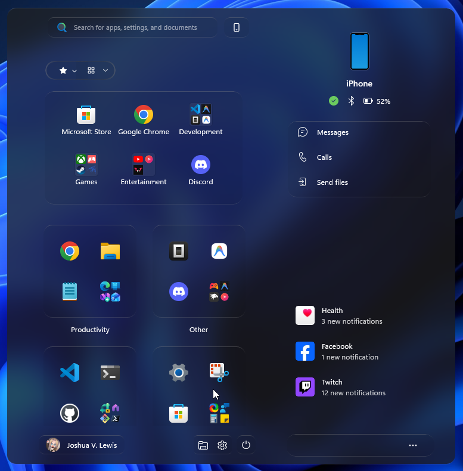
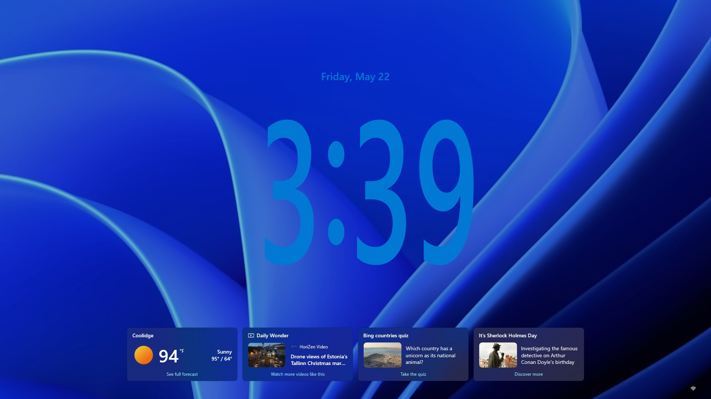

# Command Center theme for Windows 11 Start Menu Styler

Command Center theme inspired by the command centers from various mobile operating systems. It features a completely transparent background to allow for a floating widget styled appearance.

**Author**: [PhantomNimbi](https://github.com/PhantomNimbi)



> [!IMPORTANT]
> This theme is designed for the [redesigned Windows 11 Start menu](https://microsoft.design/articles/start-fresh-redesigning-windows-start-menu/) that is gradually rolling out with the 25H2 update. It is meant to use the categories view and is not built for any other view mode.

## Notes
- This theme consists of the following backgrounds:
  - Translucent
  - Glass
  - Frosted
  - Acrylic

  In order to switch between these backgrounds, set the value `Background=$Translucent`, `Background=$Glass`, `Background=$Frosted` or `Background=$Acrylic` in the "Style constants" section of the mod's settings.

- This theme can style your lock screen as well. 

## Lock Screen



To make it work, you'll need to:
- Add 'LockApp.exe' to the 'Custom process inclusion list' under 'Advanced settings' in the Windows 11 Start Menu Styler mod.
- Install the [Vivo Sans En VF](https://1drv.ms/u/c/67fedd4420ed716d/EXRoW1f5dABJrO2dPj0tbM0Bm1uYiGeoKyAYA7X7er2Zww?e=cLsiJJ) and [Morganite SemiBold](https://1drv.ms/u/c/67fedd4420ed716d/IQCHLlxP7GPITp4p-uPMw9O5AY3s2NJCHLKC-tYZZVWAGiY?e=yQrKQb) fonts.

Credits for this feature go to [Nathaniel4JC](https://github.com/Nathaniel4JC). It was something introduced in their [WindowsGlass](https://github.com/PhantomNimbi/windows-11-start-menu-styling-guide/tree/patch-1/Themes/WindowGlass) theme and I figured would go nice with this one as well.

## Theme selection

The theme is integrated into the mod and can be selected directly from the mod's
settings:

* Open the Windows 11 Start Menu Styler mod in Windhawk.
* Go to the "Settings" tab.
* Select the theme and save the settings.

## Manual installation

The theme styles can also be imported manually. To do that, follow these steps:

* Open the Windows 11 Start Menu Styler mod in Windhawk.
* Go to the "Settings" tab and select "Textual mode".
* Copy the content below to the text box and click "Save settings".

<details>
<summary>Content to import (click to expand)</summary>

```yaml
styleConstants:
  - Translucent=<WindhawkBlur BlurAmount="15" TintColor="#10808080"/>
  - Glass=<WindhawkBlur BlurAmount="5" TintColor="{ThemeResource SystemChromeMediumColor}" TintOpacity="0.7" />
  - Frosted=<WindhawkBlur BlurAmount="20" TintColor="{ThemeResource SystemChromeMediumColor}" TintOpacity="0.7" />
  - Acrylic=<WindhawkBlur BlurAmount="30" TintColor="{ThemeResource SystemChromeMediumColor}" TintOpacity="0.8" />
  - Background=$Frosted
  - BorderBrush=<LinearGradientBrush StartPoint="0,0" EndPoint="0,1"><GradientStop Color="#60808080" Offset="0.0" /><GradientStop Color="#50404040" Offset="0.25" /><GradientStop Color="#40808080" Offset="1" /></LinearGradientBrush>
  - BorderBrush2=<WindhawkBlur BlurAmount="10" TintColor="#909090" TintOpacity="0.3"/>
  - RecommendedBorderBrush=<LinearGradientBrush StartPoint="0,0" EndPoint="1,0"><GradientStop Color="#60808080" Offset="0.0" /><GradientStop Color="#50404040" Offset="0.3" /><GradientStop Color="#30404040" Offset="1" /></LinearGradientBrush>
  - ViewBorderBrush=<LinearGradientBrush StartPoint="0,0" EndPoint="1,0"><GradientStop Color="#30404040" Offset="0.0" /><GradientStop Color="#50404040" Offset="0.7" /><GradientStop Color="#60808080" Offset="1" /></LinearGradientBrush>
  - HighlightBorder=<SolidColorBrush Color="{ThemeResource SystemAccentColor}" Opacity="0.8"/>
  - OverlayColor=<AcrylicBrush TintColor="{ThemeResource SystemAltLowColor}" TintOpacity="1" TintLuminosityOpacity="0.8" FallbackColor="{ThemeResource CardStrokeColorDefaultSolid}" />
  - OverlayColor2=<AcrylicBrush TintColor="{ThemeResource SystemAltLowColor}" TintOpacity="1" TintLuminosityOpacity="0.5" FallbackColor="{ThemeResource CardStrokeColorDefaultSolid}" />
  - AccentColor=<AcrylicBrush TintColor="{ThemeResource SystemAccentColor}" TintOpacity="1" TintLuminosityOpacity="0.5" FallbackColor="{ThemeResource CardStrokeColorDefaultSolid}" />
  - ElementBackground=<SolidColorBrush Color="{ThemeResource SystemAltLowColor}" Opacity="0.25" />
  - ClockBG=<SolidColorBrush Color="{ThemeResource SystemAccentColor}" Opacity="1"/>
  - BorderThickness=0.3,1,0.3,1
  - CornerRadius=35
  - PanelRadius=35
  - CardRadius=15
  - ChipRadius=10
  - SearchBoxRadius=25
controlStyles:
  - target: Border#DropShadowDismissTarget
    styles:
      - Background:=$Background
      - BorderBrush:=$BorderBrush
      - BorderThickness=$BorderThickness
      - CornerRadius=$CardRadius
      - Margin=0
      - Padding=0
  - target: Border#StartDropShadow, Border#RightCompanionDropShadow, Border#RootGridDropShadow, Border#dropshadow
    styles:
      - Visibility=Collapsed
  - target: Border#MainMenuHighContrastBorder, Border#RightCompanionHighContrastBorder
    styles:
      - Visibility=Collapsed
  - target: Border#LayerBorder, Border#AccentLayerBorder, Border#AccentAppBorder
    styles:
      - Visibility=Collapsed
  - target: Border#AcrylicBorder, Grid#MainMenu > Border#AcrylicBorder, Grid#CompanionRoot > Border#AcrylicBorder
    styles:
      - Background:=Transparent
      - BorderBrush:=Transparent
      - BorderThickness=0
  - target: Border#AcrylicOverlay
    styles:
      - Visibility=Collapsed
  - target: Grid#FrameRoot
    styles:
      - MaxHeight=790
  - target: Grid#MainMenu
    styles:
      - MaxWidth=470
  - target: Grid#MainContent
    styles:
      - Grid.Row=0
      - MinHeight=Auto
  - target: Windows.UI.Xaml.Controls.Primitives.ScrollBar
    styles:
      - Visibility=Collapsed
  - target: Grid#NavPanePlaceholder
    styles:
      - MaxHeight=60
  - target: StartDocked.NavigationPaneView > Windows.UI.Xaml.Controls.Grid#RootPanel
    styles:
      - Background:=Transparent
      - BorderBrush:=Transparent
  - target: StartDocked.UserTileView
    styles:
      - Height=32
  - target: StartDocked.NavigationPaneButton#UserTileButton > Grid > Border#BackgroundBorder
    styles:
      - Background:=$ElementBackground
      - BorderBrush:=$BorderBrush
      - BorderThickness=$BorderThickness
      - CornerRadius=$ChipRadius
  - target: Grid#UserTileIcon
    styles:
      - Height=24
      - Width=24
  - target: TextBlock#UserTileNameText
    styles:
      - FontSize=12
  - target: StartDocked.AppListView#NavigationPanePlacesListView
    styles:
      - Height=32
      - VerticalAlignment=Center
      - Margin=0,0,8,0
  - target: StartDocked.AppListView#NavigationPanePlacesListView > Border
    styles:
      - Background:=$ElementBackground
      - BorderBrush:=$BorderBrush
      - BorderThickness=$BorderThickness
      - CornerRadius=6
      - Padding=0
  - target: StartDocked.AppListView#NavigationPanePlacesListView > Border > ScrollViewer > Border > Grid > ScrollContentPresenter > ItemsPresenter > ItemsStackPanel > ListViewItem
    styles:
      - Height=32
      - Width=32
      - Padding=0
  - target: StartDocked.AppListView#NavigationPanePlacesListView > Border > ScrollViewer > Border > Grid > ScrollContentPresenter > ItemsPresenter > ItemsStackPanel > ListViewItem > Grid#ContentBorder > ContentPresenter > FontIcon
    styles:
      - FontSize=14
  - target: StartDocked.PowerOptionsView
    styles:
      - Height=32
  - target: StartDocked.NavigationPaneButton#PowerButton
    styles:
      - Height=32
      - Width=32
      - HorizontalAlignment=Center
      - VerticalAlignment=Center
  - target: StartDocked.NavigationPaneButton#PowerButton > Windows.UI.Xaml.Controls.Grid@CommonStates > Windows.UI.Xaml.Controls.Border#BackgroundBorder
    styles:
      - Background:=$ElementBackground
      - BorderBrush:=$BorderBrush
      - BorderThickness=$BorderThickness
      - CornerRadius=$ChipRadius
  - target: StartDocked.NavigationPaneButton#PowerButton > Grid > ContentPresenter > Grid > FontIcon
    styles:
      - FontSize=14
  - target: StartMenu.SearchBoxToggleButton
    styles:
      - Visibility=Visible
      - Width=285
      - Height=34
      - HorizontalAlignment=Left
      - Margin=35,0,0,0
      - VerticalAlignment=Center
      - Background:=Transparent
      - BorderBrush:=Transparent
      - BorderThickness=0
  - target: StartMenu.SearchBoxToggleButton > Grid@CommonStates > Border#BorderElement, StartMenu.SearchBoxToggleButton > Grid > Border#BorderElement
    styles:
      - Background:=$ElementBackground
      - BorderBrush:=$BorderBrush
      - BorderThickness=$BorderThickness
      - CornerRadius=$ChipRadius
      - BackgroundSizing=InnerBorderEdge
      - Background@PointerOver:=$OverlayColor
      - BorderBrush@PointerOver:=$BorderBrush
  - target: StartMenu.SearchBoxToggleButton > Grid > Grid#UnderlineContainer, StartMenu.SearchBoxToggleButton > Grid > Grid#UnderlineContainer > Border#BorderUnderline
    styles:
      - Visibility=Collapsed
  - target: StartMenu.SearchBoxToggleButton > Grid > FontIcon#SearchGlyph
    styles:
      - FontSize=13
      - Margin=12,0,8,0
      - VerticalAlignment=Center
  - target: StartMenu.SearchBoxToggleButton > Grid > ContentPresenter > TextBlock#PlaceholderText
    styles:
      - FontSize=11
      - VerticalAlignment=Center
  - target: Windows.UI.Xaml.Controls.Primitives.ToggleButton#ShowHideCompanion, ToggleButton#ShowHideCompanion
    styles:
      - Visibility=Visible
      - Height=34
      - Width=42
      - VerticalAlignment=Center
      - HorizontalAlignment=Right
      - Margin=0,0,35,0
      - Background:=Transparent
      - BorderBrush:=Transparent
      - BorderThickness=0
  - target: Windows.UI.Xaml.Controls.Primitives.ToggleButton#ShowHideCompanion > Border, ToggleButton#ShowHideCompanion > Border
    styles:
      - Background:=$ElementBackground
      - BorderBrush:=$BorderBrush
      - BorderThickness=$BorderThickness
      - CornerRadius=$ChipRadius
      - BackgroundSizing=InnerBorderEdge
      - Background@PointerOver:=$OverlayColor
      - BorderBrush@PointerOver:=$BorderBrush
      - Background@Pressed:=$OverlayColor
      - BorderBrush@Pressed:=$BorderBrush
  - target: Windows.UI.Xaml.Controls.Primitives.ToggleButton#ShowHideCompanion > Border > ContentPresenter#ContentPresenter, ToggleButton#ShowHideCompanion > Border > ContentPresenter
    styles:
      - Background:=Transparent
      - BorderBrush:=Transparent
      - BorderThickness=0
  - target: ToggleButton#ShowHideCompanion > Border > ContentPresenter > FontIcon, Windows.UI.Xaml.Controls.Primitives.ToggleButton#ShowHideCompanion > Border > ContentPresenter > FontIcon
    styles:
      - FontSize=14
      - HorizontalAlignment=Center
      - VerticalAlignment=Center
  - target: TextBlock#ZoomedOutHeading
    styles:
      - Visibility=Collapsed
  - target: Windows.UI.Xaml.Controls.Grid#TopLevelSuggestionsListHeader
    styles:
      - Height=0
      - Visibility=>showMoreSuggestionsVisible
  - target: Grid#ShowMoreSuggestions
    styles:
      - Visibility={{showMoreSuggestionsVisible}}
  - target: Button#ShowMoreSuggestionsButton
    styles:
      - Margin=0,-77,335,0
      - Height=32
  - target: Button#ShowMoreSuggestionsButton > Grid > Border#BackgroundBorder
    styles:
      - Visibility=Collapsed
  - target: Windows.UI.Xaml.Controls.Grid#NoTopLevelSuggestionsText
    styles:
      - Height=0
  - target: Button#ShowMoreSuggestionsButton > Grid > ContentPresenter
    styles:
      - VerticalAlignment=Center
  - target: Button#ShowMoreSuggestionsButton > Grid > ContentPresenter > StackPanel
    styles:
      - VerticalAlignment=Center
      - Orientation=Horizontal
      - Margin=10,0,8,0
  - target: Button#ShowMoreSuggestionsButton > Grid > ContentPresenter > StackPanel > TextBlock
    styles:
      - FontFamily=Segoe Fluent Icons, Segoe MDL2 Assets
      - Text=
      - FontSize=12
      - Visibility=Visible
      - VerticalAlignment=Center
      - Margin=0,0,8,0
  - target: Button#ShowMoreSuggestionsButton > Grid > ContentPresenter > StackPanel > FontIcon
    styles:
      - Glyph=
      - FontSize=10
      - VerticalAlignment=Center
  - target: Windows.UI.Xaml.Controls.Button#ShowMoreSuggestionsButton > Windows.UI.Xaml.Controls.Grid@CommonStates, Button#ShowMoreSuggestionsButton > Grid@CommonStates
    styles:
      - BorderBrush:=$RecommendedBorderBrush
      - Background:=$ElementBackground
      - BorderThickness=2,2,0,2
      - CornerRadius=15,0,0,15
      - Height=32
      - Margin=0,0,-2,0
      - BorderBrush@PointerOver:=$RecommendedBorderBrush
      - Background@PointerOver:=$ElementBackground
      - BorderBrush@Pressed:=$RecommendedBorderBrush
      - Background@Pressed:=$ElementBackground
  - target: Windows.UI.Xaml.Controls.Button#ShowMoreSuggestionsButton@CommonStates, Button#ShowMoreSuggestionsButton@CommonStates
    styles:
      - Background@PointerOver:=$ElementBackground
      - BorderBrush@PointerOver:=$RecommendedBorderBrush
      - Background@Pressed:=$OverlayColor
      - BorderBrush@Pressed:=$RecommendedBorderBrush
  - target: TextBlock#MoreSuggestionsListHeaderText, Windows.UI.Xaml.Controls.TextBlock#MoreSuggestionsListHeaderText
    styles:
      - Visibility=Collapsed
  - target: Windows.UI.Xaml.Controls.Button#HideMoreSuggestionsButton, Button#HideMoreSuggestionsButton
    styles:
      - Grid.Column=0
      - HorizontalAlignment=Left
      - VerticalAlignment=Top
      - Margin=33,30,0,0
      - Height=32
      - Width=32
      - Padding=0
      - Background:=Transparent
      - BorderBrush:=Transparent
      - BorderThickness=0
      - CornerRadius=6
  - target: Button#HideMoreSuggestionsButton > Grid > Border#BackgroundBorder
    styles:
      - Background:=$ElementBackground
      - BorderBrush:=$BorderBrush
      - BorderThickness=$BorderThickness
      - CornerRadius=6
      - Background@PointerOver:=$OverlayColor
      - BorderBrush@PointerOver:=$BorderBrush
      - Background@Pressed:=$OverlayColor
      - BorderBrush@Pressed:=$BorderBrush
  - target: Button#HideMoreSuggestionsButton > Grid > ContentPresenter
    styles:
      - HorizontalAlignment=Center
      - VerticalAlignment=Center
  - target: Button#HideMoreSuggestionsButton > Grid > ContentPresenter > StackPanel
    styles:
      - HorizontalAlignment=Center
      - VerticalAlignment=Center
      - Margin=0
  - target: Button#HideMoreSuggestionsButton > Grid > ContentPresenter > StackPanel > TextBlock
    styles:
      - Visibility=Collapsed
  - target: Button#HideMoreSuggestionsButton > Grid > ContentPresenter > StackPanel > FontIcon
    styles:
      - FontSize=12
      - HorizontalAlignment=Center
      - VerticalAlignment=Center
      - Margin=0
  - target: Windows.UI.Xaml.Controls.GridView#RecommendedList
    styles:
      - Visibility=Collapsed
  - target: Grid#TopLevelSuggestionsRoot
    styles:
      - Grid.Row=1
  - target: Microsoft.UI.Xaml.Controls.DropDownButton > Grid@CommonStates
    styles:
      - BorderBrush:=$ViewBorderBrush
      - Background:=$ElementBackground
      - BorderThickness={{showMoreSuggestionsVisible*2}},2,2,2
      - CornerRadius={{showMoreSuggestionsVisible*15}},15,15,{{showMoreSuggestionsVisible*15}}
      - Height=32
      - BorderBrush@PointerOver:=$ViewBorderBrush
      - Background@PointerOver:=$ElementBackground
  - target: Microsoft.UI.Xaml.Controls.DropDownButton
    styles:
      - RenderTransform:=<TranslateTransform X="-235" Y="{{-224 - pinnedListHeight}}" />
      - MaxWidth=100
  - target: Microsoft.UI.Xaml.Controls.DropDownButton > Grid > ContentPresenter > TextBlock
    styles:
      - FontFamily=Segoe Fluent Icons, Segoe MDL2 Assets
      - Text=
      - FontSize=12
      - Margin=8,0,4,0
      - VerticalAlignment=Center
  - target: Grid#TopLevelHeader > Grid > Button[AutomationProperties.Name=Show all] > Grid@CommonStates > Border
    styles:
      - Background@Normal:=$ElementBackground
      - Background@PointerOver:=$ElementBackground
      - Padding=10,7
      - Margin=0,0,-5,0
      - CornerRadius=0,15,15,0
      - BorderThickness=0
      - Width=85
  - target: Grid#TopLevelHeader > Grid > Button
    styles:
      - Margin=-430,0,430,0
      - Height=32
      - CornerRadius=15
      - BorderThickness=0,2,2,2
  - target: Grid#TopLevelHeader > Grid > Button > Grid@CommonStates > Border
    styles:
      - Background:=$ElementBackground
      - BorderBrush:=$BorderBrush
      - Background@PointerOver:=$OverlayColor
      - BorderBrush@PointerOver:=$BorderBrush
      - BorderThickness=$BorderThickness
  - target: Windows.UI.Xaml.Controls.Grid#AllAppsRoot
    styles:
      - Margin=0,0,0,0
  - target: TextBlock#PinnedListHeaderText
    styles:
      - Text=
  - target: TextBlock#AllListHeadingText
    styles:
      - Text=
      - Margin=63,-184,12,0
  - target: StartMenu.PinnedList
    styles:
      - Margin=-23,20,-7,150
      - MaxWidth=410
      - MinHeight=115
      - Height=Auto
      - ActualHeight=>pinnedListHeight
  - target: StartMenu.PinnedList > Grid#Root > GridView#PinnedList > Border, GridView#PinnedList > Border
    styles:
      - Background:=$ElementBackground
      - BorderBrush:=$BorderBrush
      - BorderThickness=$BorderThickness
      - CornerRadius=$CardRadius
      - Padding=22,10,22,10
  - target: GridView#PinnedList, GridView#PinnedList > Border > ScrollViewer
    styles:
      - HorizontalAlignment=Center
  - target: Windows.UI.Xaml.Controls.GridView#AllAppsGrid > Border > Windows.UI.Xaml.Controls.ScrollViewer > Border > Grid > Windows.UI.Xaml.Controls.ScrollContentPresenter > Windows.UI.Xaml.Controls.ItemsPresenter > Windows.UI.Xaml.Controls.ItemsWrapGrid
    styles:
      - Margin=45,-180,45,0
  - target: StartMenu.CategoryControl
    styles:
      - Margin=15,0,-15,0
  - target: StartMenu.CategoryControl > Grid#RootGrid > Border
    styles:
      - Background:=$ElementBackground
      - BorderBrush:=$BorderBrush
      - BorderThickness=$BorderThickness
      - CornerRadius=$CardRadius
  - target: StartDocked.StartMenuCompanion#RightCompanion > Grid#CompanionRoot, StartMenu.StartMenuCompanion#RightCompanion > Grid#CompanionRoot
    styles:
      - CornerRadius=0,35,35,0
      - Margin=-20,0,20,0
      - Padding=0
  - target: StartMenu.StartMenuCompanion#RightCompanion > Grid#CompanionRoot > Grid#MainContent > ContentPresenter#PrimaryCardContainer, StartDocked.StartMenuCompanion#RightCompanion > Grid#CompanionRoot > Grid#MainContent > ContentPresenter#PrimaryCardContainer
    styles:
      - Margin=4,12,8,12
  - target: StartMenu.StartMenuCompanion#RightCompanion > Grid#CompanionRoot > Grid#MainContent > ContentPresenter#PrimaryCardContainer > Grid > Grid > Grid > ScrollViewer > Border#Root > Grid > ScrollContentPresenter#ScrollContentPresenter > AdaptiveCards.Rendering.Uwp.WholeItemsPanel > Border > AdaptiveCards.Rendering.Uwp.WholeItemsPanel > Grid > Border > AdaptiveCards.Rendering.Uwp.WholeItemsPanel > TextBlock, StartDocked.StartMenuCompanion#RightCompanion > Grid#CompanionRoot > Grid#MainContent > ContentPresenter#PrimaryCardContainer > Grid > Grid > Grid > ScrollViewer > Border#Root > Grid > ScrollContentPresenter#ScrollContentPresenter > AdaptiveCards.Rendering.Uwp.WholeItemsPanel > Border > AdaptiveCards.Rendering.Uwp.WholeItemsPanel > Grid > Border > AdaptiveCards.Rendering.Uwp.WholeItemsPanel > TextBlock
    styles:
      - Visibility=1
  - target: ScrollViewer > ScrollContentPresenter > Border > StartMenu.StartBlendedFlexFrame > Grid#FrameRoot > Grid#AnimationRoot > Grid#RightCompanionContainerGrid > StartMenu.StartMenuCompanion#RightCompanion > Grid#CompanionRoot > Grid#MainContent > ContentPresenter#PrimaryCardContainer > Grid > Grid > Grid > ScrollViewer > Border#Root > Grid > ScrollContentPresenter#ScrollContentPresenter > AdaptiveCards.Rendering.Uwp.WholeItemsPanel > Border > AdaptiveCards.Rendering.Uwp.WholeItemsPanel > Grid > Border > AdaptiveCards.Rendering.Uwp.WholeItemsPanel > Grid > ListView > Border, StartDocked.StartMenuCompanion#RightCompanion > Grid#CompanionRoot > Grid#MainContent > ContentPresenter#PrimaryCardContainer > Grid > Grid > Grid > ScrollViewer > Border#Root > Grid > ScrollContentPresenter#ScrollContentPresenter > AdaptiveCards.Rendering.Uwp.WholeItemsPanel > Border > AdaptiveCards.Rendering.Uwp.WholeItemsPanel > Border > AdaptiveCards.Rendering.Uwp.WholeItemsPanel > Border > AdaptiveCards.Rendering.Uwp.WholeItemsPanel > Grid > Border > AdaptiveCards.Rendering.Uwp.WholeItemsPanel > Grid > ListView > Border
    styles:
      - Background:=$ElementBackground
      - BorderBrush:=$BorderBrush
      - BorderThickness=$BorderThickness
      - CornerRadius=$CardRadius
  - target: Windows.UI.Xaml.Controls.Grid#ActionsBar, StartMenu.StartMenuCompanion#RightCompanion > Grid#CompanionRoot > Grid#MainContent > Grid#ActionsBar, StartDocked.StartMenuCompanion#RightCompanion > Grid#CompanionRoot > Grid#MainContent > Grid#ActionsBar
    styles:
      - Height=38
      - VerticalAlignment=Bottom
      - Margin=14,0,14,12
      - Background:=$ElementBackground
      - BorderBrush:=$BorderBrush
      - BorderThickness=$BorderThickness
      - CornerRadius=$CardRadius
  - target: Windows.UI.Xaml.Controls.Grid#ActionsBar > Windows.UI.Xaml.Controls.Button#ActionBarOverflowButton, Windows.UI.Xaml.Controls.Grid#ActionsBar > Windows.UI.Xaml.Controls.Button#PrimaryActionBarButton, Grid#ActionsBar > Button
    styles:
      - Height=32
      - Width=40
      - VerticalAlignment=Center
      - HorizontalAlignment=Right
      - Background:=Transparent
      - BorderThickness=0
      - CornerRadius=$ChipRadius
      - Visibility=Visible
  - target: StartMenu.FolderModal#StartFolderModal > Grid#Root
    styles:
      - MaxHeight:=420
      - MaxWidth:=420
      - Height=Auto
      - Width=Auto
  - target: StartMenu.FolderModal#StartFolderModal > Grid#Root > ContentControl#ContentControl > ContentPresenter > StartMenu.UniversalTileContainer#UniversalTileContainer > Grid#GridViewContainer
    styles:
      - Width=360
      - Height=Auto
  - target: Grid#Root > Border, Border#AppBorder
    styles:
      - Background:=$Background
      - BorderBrush:=$BorderBrush
      - BorderThickness=$BorderThickness
      - CornerRadius=$CardRadius
  - target: StartMenu.ExpandedFolderList
    styles:
      - Margin=0
  - target: FlyoutPresenter > Border#BackgroundElement
    styles:
      - Background:=$Background
      - BorderBrush:=$BorderBrush
      - BorderThickness:=$BorderThickness
      - CornerRadius=$ChipRadius
      - Padding=-1
  - target: MenuFlyoutPresenter > Border#BackgroundElement, MenuFlyoutPresenter > Border
    styles:
      - Background:=$Background
      - BorderBrush:=$BorderBrush
      - BorderThickness=$BorderThickness
      - CornerRadius=$ChipRadius
  - target: MenuFlyoutItem, ToggleMenuFlyoutItem
    styles:
      - CornerRadius=$ChipRadius
      - Margin=4,0,4,0
  - target: Border#OverflowFlyoutBackgroundBorder, Grid#HoverFlyoutGrid > Border#HoverFlyoutBackground
    styles:
      - Background:=$Background
      - BorderBrush:=$BorderBrush
      - BorderThickness=$BorderThickness
      - CornerRadius=$ChipRadius
  - target: ToolTip > ContentPresenter#LayoutRoot
    styles:
      - Background:=$Background
      - BorderBrush:=$BorderBrush
      - BorderThickness=$BorderThickness
      - CornerRadius=$ChipRadius
  - target: Cortana.UI.Views.CortanaRichSearchBox#SearchTextBox
    styles:
      - Height=32
      - MaxHeight=32
      - VerticalAlignment=Center
  - target: Cortana.UI.Views.CortanaRichSearchBox#SearchTextBox > Grid > Border#BorderElement
    styles:
      - Background:=$Background
      - BorderBrush:=$BorderBrush
      - BorderThickness=$BorderThickness
      - CornerRadius=6
      - Height=32
      - VerticalAlignment=Center
  - target: Border#TaskbarSearchBackground
    styles:
      - CornerRadius=$ChipRadius
      - Height=32
      - VerticalAlignment=Center
      - Background:=Transparent
      - BorderBrush:=Transparent
      - BorderThickness=0
  - target: Cortana.UI.Views.TaskbarSearchPage > Grid#RootGrid > Grid#OuterBorderGrid
    styles:
      - Background:=$Background
      - BorderBrush:=$BorderBrush
      - BorderThickness=$BorderThickness
      - CornerRadius=$PanelRadius
  - target: StackPanel#TimeAndDatePanel
    styles:
      - VerticalAlignment=Top
      - HorizontalAlignment=Center
      - RenderTransform:=<TranslateTransform X="0" />
  - target: StackPanel#TimePanel > TextBlock#Time
    styles:
      - HorizontalAlignment:=Center
      - RenderTransform:=<TransformGroup><TranslateTransform X="-50" Y="20" /><ScaleTransform ScaleX="2.3" ScaleY="4" /></TransformGroup>
      - FontFamily=Morganite SemiBold
      - Foreground:=$ClockBG
  - target: StackPanel#TimeAndDatePanel > TextBlock#Date
    styles:
      - HorizontalAlignment=Center
      - RenderTransform:=<TranslateTransform X="0" Y="-110" />
      - FontFamily=vivo Sans EN VF
      - Foreground:=$ClockBG
  - target: Grid#WidgetFrameGrid
    styles:
      - Background:=$Background
      - BorderBrush:=$BorderBrush
      - BorderThickness=$BorderThickness
      - CornerRadius=$CornerRadius
  - target: Grid#WidgetCanvasPanel
    styles:
      - HorizontalAlignment=Center
      - RenderTransform:=<TranslateTransform X="0" Y="50" />
  - target: Grid#MediaTransportControls
    styles:
      - Background:=$Background
      - BorderBrush:=$BorderBrush
      - BorderThickness=$BorderThickness
      - CornerRadius=$CornerRadius
  - target: Grid#MediaControlsContainer
    styles:
      - Visibility=0
      - RenderTransform:=<TranslateTransform X="0" Y="-250" />
      - Margin=0,0,0,0
      - CornerRadius=$CornerRadius
  - target: ListViewItem > Grid@CommonStates > Border#BorderBackground, Border#ContentBorder@CommonStates > Grid > Border#BackgroundBorder, Button > Grid@CommonStates > Border#BackgroundBorder
    styles:
      - BorderThickness=$BorderThickness
      - BorderBrush@PointerOver:=$BorderBrush
      - BorderBrush@Pressed:=$BorderBrush
      - CornerRadius=$CardRadius
      - BackgroundSizing=InnerBorderEdge
  - target: Border#BackgroundBorder, Grid#LayoutRoot
    styles:
      - BackgroundTransition:=<BrushTransition Duration="0:0:0.083" />
webContentStyles:
  - target: '*'
    styles:
      - 'transition: background-color 0.083s ease-in-out !important'
webContentCustomJs: ''

```
</details>
