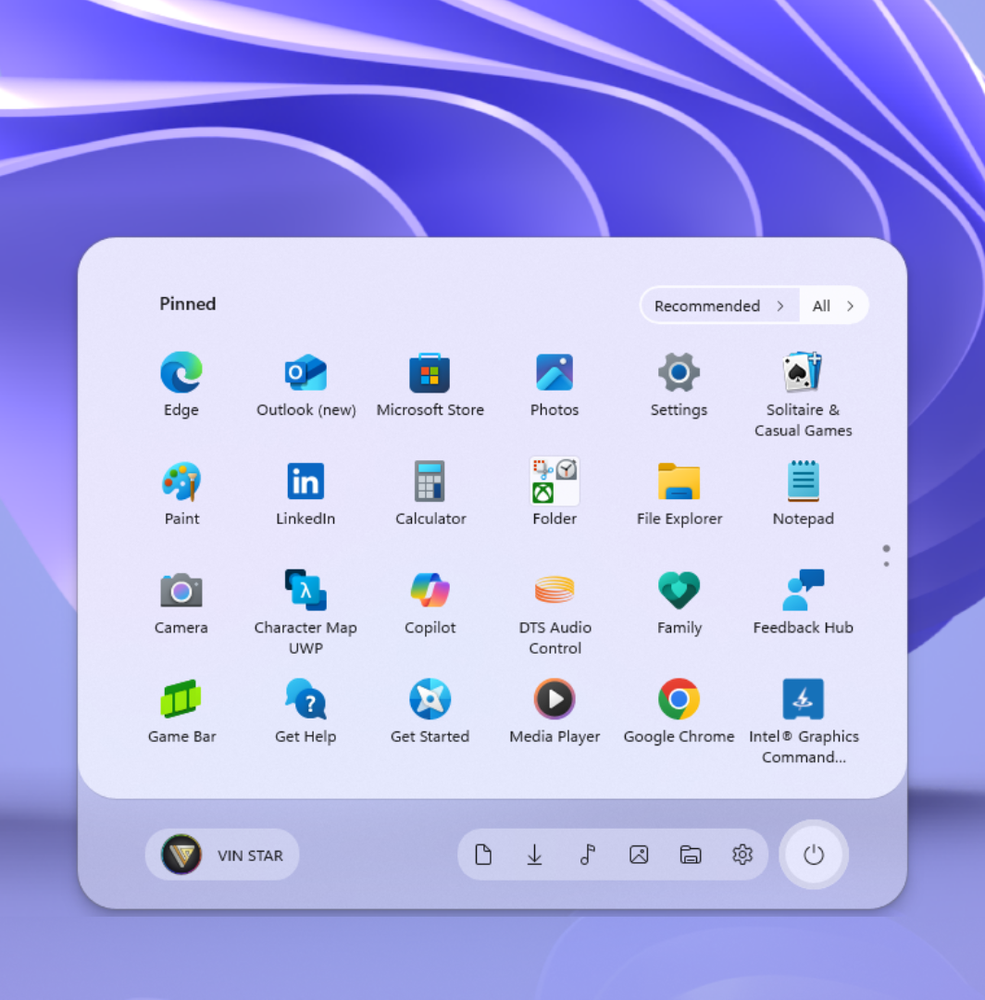

# Down Aero theme for Windows 11 Start Menu Styler

**Author**: [VIN STAR](https://github.com/vinstartheme)



## Theme selection

The theme is integrated into the mod and can be selected directly from the mod's
settings:

* Open the Windows 11 Start Menu Styler mod in Windhawk.
* Go to the "Settings" tab.
* Select the theme and save the settings.

## Manual installation

The theme styles can also be imported manually. To do that, follow these steps:

* Open the Windows 11 Start Menu Styler mod in Windhawk.
* Go to the "Settings" tab and select "Textual mode".
* Copy the content below to the text box and click "Save settings".

### Redesigned Start menu

A variant for the [redesigned Windows 11 Start
menu](https://microsoft.design/articles/start-fresh-redesigning-windows-start-menu/)
that is slowly rolling out in the 25H2 update.

<details>
<summary>Content to import (click to expand)</summary>

```yaml
controlStyles:
  - target: Grid#FrameRoot
    styles:
      - MaxHeight=520
  - target: Windows.UI.Xaml.Controls.Grid#TopLevelSuggestionsListHeader
    styles:
      - Visibility=Collapsed
  - target: Grid#ShowMoreSuggestions
    styles:
      - Visibility=Visible
  - target: Button#ShowMoreSuggestionsButton
    styles:
      - Margin=0,-77,147,0
  - target: Windows.UI.Xaml.Controls.Grid#NoTopLevelSuggestionsText
    styles:
      - Height=0
  - target: Button#ShowMoreSuggestionsButton > Grid > ContentPresenter > StackPanel > TextBlock
    styles:
      - Text=Recommended
      - Visibility=Visible
  - target: Border#StartDropShadow
    styles:
      - CornerRadius=30
  - target: Rectangle
    styles:
      - Visibility=Collapsed
  - target: StartMenu.SearchBoxToggleButton
    styles:
      - Visibility=Collapsed
  - target: Border#AcrylicBorder
    styles:
      - CornerRadius=30
      - Background:=<AcrylicBrush TintColor="{ThemeResource CardStrokeColorDefaultSolid}" FallbackColor="{ThemeResource CardStrokeColorDefaultSolid}" TintOpacity="0" TintLuminosityOpacity=".5" Opacity="1"/>
  - target: Border#AcrylicOverlay
    styles:
      - CornerRadius=30
      - Background:=<AcrylicBrush TintColor="{ThemeResource CardStrokeColorDefaultSolid}" FallbackColor="{ThemeResource CardStrokeColorDefaultSolid}" TintOpacity="0" TintLuminosityOpacity="1" Opacity="1"/>
      - Height=430
      - Margin=0,-65,0,0
  - target: Windows.UI.Xaml.Controls.Grid#AllAppsRoot
    styles:
      - Margin=0,-90,0,90
  - target: Grid#MainContent
    styles:
      - Grid.Row=0
      - VerticalAlignment=0
      - MinHeight=Auto
  - target: StartDocked.AppListView#NavigationPanePlacesListView > Windows.UI.Xaml.Controls.Border
    styles:
      - Background:=<AcrylicBrush TintColor="{ThemeResource CardStrokeColorDefaultSolid}" FallbackColor="{ThemeResource CardStrokeColorDefaultSolid}" TintOpacity="0" TintLuminosityOpacity=".5" Opacity="1"/>
      - CornerRadius=18
      - Margin=0,0,15,0
  - target: StartDocked.NavigationPaneButton#PowerButton > Windows.UI.Xaml.Controls.Grid@CommonStates > Windows.UI.Xaml.Controls.Border#BackgroundBorder
    styles:
      - Background:=<AcrylicBrush TintColor="{ThemeResource CardStrokeColorDefaultSolid}" FallbackColor="{ThemeResource CardStrokeColorDefaultSolid}" TintOpacity="0" TintLuminosityOpacity="1" Opacity="1"/>
      - BorderBrush@Normal:=<AcrylicBrush TintColor="{ThemeResource SurfaceStrokeColorDefault}" FallbackColor="{ThemeResource SurfaceStrokeColorDefault}" TintOpacity="0" TintLuminosityOpacity=".1" Opacity="1"/>
      - CornerRadius=30
      - BorderThickness=5
      - Margin=-7
      - BorderBrush@PointerOver:=<AcrylicBrush TintColor="{ThemeResource SystemAccentColor}" FallbackColor="{ThemeResource SystemAccentColor}" TintOpacity=".8" TintLuminosityOpacity=".5" Opacity="1"/>
  - target: StartDocked.NavigationPaneButton#UserTileButton > Grid > Border#BackgroundBorder
    styles:
      - Background:=<AcrylicBrush TintColor="{ThemeResource CardStrokeColorDefaultSolid}" FallbackColor="{ThemeResource CardStrokeColorDefaultSolid}" TintOpacity="0" TintLuminosityOpacity=".5" Opacity="1"/>
      - CornerRadius=18
  - target: Grid#TopLevelHeader > Grid > Button[AutomationProperties.Name=Show all] > Grid@CommonStates > Border
    styles:
      - Background@Normal:=<SolidColorBrush Color="{ThemeResource SystemChromeAltHighColor}" Opacity=".8"/>
      - Background@PointerOver:=<SolidColorBrush Color="{ThemeResource SystemBaseLowColor}" Opacity="1" />
      - Padding=10,7
      - Margin=0,0,-5,0
      - CornerRadius=0,15,15,0
      - BorderThickness=0
      - Width=85
  - target: Button#ShowMoreSuggestionsButton > Grid@CommonStates > Border
    styles:
      - Background@Normal:=<SolidColorBrush Color="{ThemeResource SystemAltMediumLowColor}" Opacity="0" />
      - BorderBrush@Normal:=<SolidColorBrush Color="{ThemeResource SystemChromeAltHighColor}" Opacity=".8"/>
      - Padding=10,5
      - Margin=0,0,-2,0
      - CornerRadius=15,0,0,15
      - BorderThickness=2,2,0,2
      - Background@PointerOver:=<SolidColorBrush Color="{ThemeResource SystemBaseLowColor}" Opacity=".7" />
      - BorderBrush@PointerOver:=<SolidColorBrush Color="{ThemeResource SystemBaseLowColor}" Opacity="1"/>
  - target: Windows.UI.Xaml.Controls.Button#HideMoreSuggestionsButton
    styles:
      - Background:=<SolidColorBrush Color="{ThemeResource SystemChromeMediumLowColor}" Opacity="1"/>
      - CornerRadius=15
  - target: StartDocked.NavigationPaneView > Windows.UI.Xaml.Controls.Grid#RootPanel
    styles:
      - Grid.Row=2
  - target: Windows.UI.Xaml.Controls.Frame
    styles:
      - Margin=0,-65,0,0
  - target: Grid#MainMenu
    styles:
      - MaxWidth=650
  - target: TextBlock#AllListHeadingText
    styles:
      - Margin=63,-184,12,0
  - target: Windows.UI.Xaml.Controls.GridView#RecommendedList
    styles:
      - Visibility=Collapsed
  - target: Windows.UI.Xaml.Controls.GridView#AllAppsGrid > Border > Windows.UI.Xaml.Controls.ScrollViewer > Border > Grid > Windows.UI.Xaml.Controls.ScrollContentPresenter > Windows.UI.Xaml.Controls.ItemsPresenter > Windows.UI.Xaml.Controls.ItemsWrapGrid
    styles:
      - Margin=45,-180,45,0
  - target: Microsoft.UI.Xaml.Controls.DropDownButton > Grid@CommonStates
    styles:
      - BorderBrush:=<SolidColorBrush Color="{ThemeResource SystemChromeAltHighColor}" Opacity=".8"/>
      - Background:=<SolidColorBrush Color="{ThemeResource SystemAltMediumLowColor}" Opacity="1" />
      - BorderThickness=0,2,2,2
      - CornerRadius=0,15,15,0
      - Height=32
      - BorderBrush@PointerOver:=<SolidColorBrush Color="{ThemeResource SystemBaseLowColor}" Opacity="1"/>
      - Background@PointerOver:=<SolidColorBrush Color="{ThemeResource SystemBaseLowColor}" Opacity=".7" />
  - target: StartMenu.PinnedList
    styles:
      - Margin=0,20,-40,180
  - target: Grid#TopLevelSuggestionsRoot
    styles:
      - Grid.Row=1
  - target: Microsoft.UI.Xaml.Controls.DropDownButton
    styles:
      - Margin=-57,-422.5,57,422
      - MaxWidth=100
  - target: Microsoft.UI.Xaml.Controls.DropDownButton > Grid > ContentPresenter > TextBlock
    styles:
      - Margin=8,0,8,0
      - Text=View
  - target: StartMenu.CategoryControl
    styles:
      - Margin=15,0,-15,0
  - target: Grid#TopLevelHeader > Grid > Button
    styles:
      - Margin=-430,0,430,0
      - Height=32
      - CornerRadius=15
      - BorderThickness=0,2,2,2
  - target: GridView#PinnedList > Border > Windows.UI.Xaml.Controls.ScrollViewer
    styles:
      - ScrollViewer.VerticalScrollMode=2
      - Height=280
  - target: Border#RightCompanionDropShadow
    styles:
      - CornerRadius=30
  - target: Grid#CompanionRoot > Grid#MainContent > Border#AcrylicOverlay
    styles:
      - Margin=0
  - target: Windows.UI.Xaml.Controls.Primitives.ScrollBar
    styles:
      - Visibility=Collapsed
  - target: Grid#TopLevelHeader > Grid > Button > Grid@CommonStates > Border
    styles:
      - Background:=<SolidColorBrush Color="{ThemeResource SystemAltMediumLowColor}" Opacity="1" />
      - BorderBrush:=<SolidColorBrush Color="{ThemeResource SystemChromeAltHighColor}" Opacity=".8"/>
      - Background@PointerOver:=<SolidColorBrush Color="{ThemeResource SystemBaseLowColor}" Opacity=".7" />
      - BorderBrush@PointerOver:=<SolidColorBrush Color="{ThemeResource SystemBaseLowColor}" Opacity="1"/>
      - BorderThickness=2
  - target: Windows.UI.Xaml.Controls.Primitives.ToggleButton
    styles:
      - Margin=12,7,-12,-7
  - target: Grid#MainMenu > Grid#MainContent > Grid
    styles:
      - Canvas.ZIndex=1
```
</details>

### Classic Start menu

<details>
<summary>Content to import (click to expand)</summary>

```yaml
controlStyles:
  - target: StartDocked.StartSizingFrame
    styles:
      - MaxHeight=520
  - target: Windows.UI.Xaml.Controls.Grid#TopLevelSuggestionsListHeader
    styles:
      - Visibility=Collapsed
  - target: StartMenu.PinnedList
    styles:
      - Height=340
  - target: Windows.UI.Xaml.Controls.Grid#ShowMoreSuggestions
    styles:
      - RenderTransform:=<TranslateTransform Y="-408" />
  - target: Windows.UI.Xaml.Controls.Grid#NoTopLevelSuggestionsText
    styles:
      - Height=0
  - target: Windows.UI.Xaml.Controls.Grid#ShowMoreSuggestions > Windows.UI.Xaml.Controls.Button > Windows.UI.Xaml.Controls.ContentPresenter > Windows.UI.Xaml.Controls.StackPanel > Windows.UI.Xaml.Controls.TextBlock
    styles:
      - Text=Recommended
  - target: Windows.UI.Xaml.Controls.Border#DropShadow
    styles:
      - CornerRadius=30
  - target: Windows.UI.Xaml.Controls.Border#StartDropShadow
    styles:
      - CornerRadius=30
  - target: Windows.UI.Xaml.Controls.Border#RootGridDropShadow
    styles:
      - CornerRadius=30
  - target: Windows.UI.Xaml.Controls.Border#RightCompanionDropShadow
    styles:
      - CornerRadius=30
  - target: StartDocked.LauncherFrame > Grid#RootGrid > Grid#RootContent > Grid#MainContent > Grid#InnerContent > Rectangle
    styles:
      - Visibility=Collapsed
  - target: StartDocked.LauncherFrame > Grid#RootPanel > Grid#RootGrid > Grid#RootContent > Grid#MainContent > Grid#InnerContent
    styles:
      - Margin=0
  - target: StartDocked.SearchBoxToggleButton
    styles:
      - Height=0
  - target: StartDocked.LauncherFrame > Grid#RootGrid > Grid#RootContent > Grid#MainContent > Grid#InnerContent > StartDocked.SearchBoxToggleButton
    styles:
      - Visibility=Collapsed
  - target: Border#AcrylicBorder
    styles:
      - CornerRadius=30
      - Background:=<AcrylicBrush TintColor="{ThemeResource CardStrokeColorDefaultSolid}" FallbackColor="{ThemeResource CardStrokeColorDefaultSolid}" TintOpacity="0" TintLuminosityOpacity=".5" Opacity="1"/>
  - target: Border#AcrylicOverlay
    styles:
      - CornerRadius=30
      - Margin=0,0,0,20
      - Background:=<AcrylicBrush TintColor="{ThemeResource CardStrokeColorDefaultSolid}" FallbackColor="{ThemeResource CardStrokeColorDefaultSolid}" TintOpacity="0" TintLuminosityOpacity="1" Opacity="1"/>
  - target: Windows.UI.Xaml.Controls.Grid#AllAppsRoot
    styles:
      - Margin=0,0,0,40
  - target: Windows.UI.Xaml.Controls.Grid#UndockedRoot
    styles:
      - Margin=0,0,0,40
  - target: StartDocked.NavigationPaneView#NavigationPane > Windows.UI.Xaml.Controls.Grid#RootPanel
    styles:
      - Margin=0,-10,0,10
  - target: StartDocked.AppListView#NavigationPanePlacesListView > Windows.UI.Xaml.Controls.Border
    styles:
      - Background:=<AcrylicBrush TintColor="{ThemeResource CardStrokeColorDefaultSolid}" FallbackColor="{ThemeResource CardStrokeColorDefaultSolid}" TintOpacity="0" TintLuminosityOpacity=".5" Opacity="1"/>
      - CornerRadius=18
      - Margin=0,0,15,0
  - target: StartDocked.NavigationPaneButton#PowerButton > Windows.UI.Xaml.Controls.Grid@CommonStates > Windows.UI.Xaml.Controls.Border#BackgroundBorder
    styles:
      - Background:=<AcrylicBrush TintColor="{ThemeResource CardStrokeColorDefaultSolid}" FallbackColor="{ThemeResource CardStrokeColorDefaultSolid}" TintOpacity="0" TintLuminosityOpacity="1" Opacity="1"/>
      - BorderBrush@Normal:=<AcrylicBrush TintColor="{ThemeResource SurfaceStrokeColorDefault}" FallbackColor="{ThemeResource SurfaceStrokeColorDefault}" TintOpacity="0" TintLuminosityOpacity=".1" Opacity="1"/>
      - CornerRadius=30
      - BorderThickness=5
      - Margin=-7
      - BorderBrush@PointerOver:=<AcrylicBrush TintColor="{ThemeResource SystemAccentColor}" FallbackColor="{ThemeResource SystemAccentColor}" TintOpacity=".8" TintLuminosityOpacity=".5" Opacity="1"/>
  - target: StartDocked.NavigationPaneButton#UserTileButton > Grid > Border#BackgroundBorder
    styles:
      - Background:=<AcrylicBrush TintColor="{ThemeResource CardStrokeColorDefaultSolid}" FallbackColor="{ThemeResource CardStrokeColorDefaultSolid}" TintOpacity="0" TintLuminosityOpacity=".5" Opacity="1"/>
      - CornerRadius=18
  - target: Windows.UI.Xaml.Controls.Button#ShowAllAppsButton > Windows.UI.Xaml.Controls.ContentPresenter#ContentPresenter@CommonStates
    styles:
      - Background@Normal:=<SolidColorBrush Color="{ThemeResource SystemChromeAltHighColor}" Opacity=".8"/>
      - Background@PointerOver:=<SolidColorBrush Color="{ThemeResource SystemBaseLowColor}" Opacity="1" />
      - Padding=10,7
      - Margin=0,0,-35,0
      - CornerRadius=0,15,15,0
      - BorderThickness=0
  - target: Windows.UI.Xaml.Controls.Button#ShowMoreSuggestionsButton > Windows.UI.Xaml.Controls.ContentPresenter#ContentPresenter@CommonStates
    styles:
      - Background@Normal:=<SolidColorBrush Color="{ThemeResource SystemAltMediumLowColor}" Opacity="0" />
      - BorderBrush@Normal:=<SolidColorBrush Color="{ThemeResource SystemChromeAltHighColor}" Opacity=".8"/>
      - Padding=10,5
      - Margin=0,0,19,0
      - CornerRadius=15,0,0,15
      - BorderThickness=2,2,0,2
      - Background@PointerOver:=<SolidColorBrush Color="{ThemeResource SystemBaseLowColor}" Opacity=".7" />
      - BorderBrush@PointerOver:=<SolidColorBrush Color="{ThemeResource SystemBaseLowColor}" Opacity="1"/>
  - target: Windows.UI.Xaml.Controls.Button#HideMoreSuggestionsButton > Windows.UI.Xaml.Controls.ContentPresenter#ContentPresenter
    styles:
      - Background:=<SolidColorBrush Color="{ThemeResource SystemChromeMediumLowColor}" Opacity="1"/>
      - Padding=10,6
      - Margin=0,0,-35,0
      - CornerRadius=15
  - target: Windows.UI.Xaml.Controls.Button#CloseAllAppsButton > Windows.UI.Xaml.Controls.ContentPresenter#ContentPresenter
    styles:
      - Background:=<SolidColorBrush Color="{ThemeResource SystemChromeMediumLowColor}" Opacity="1"/>
      - Padding=10,6
      - Margin=0,0,-35,0
      - CornerRadius=15
  - target: StartDocked.StartMenuCompanion#RightCompanion > Grid#CompanionRoot > Grid#MainContent > Grid#AdaptiveCardContent
    styles:
      - MaxHeight=350
```
</details>
