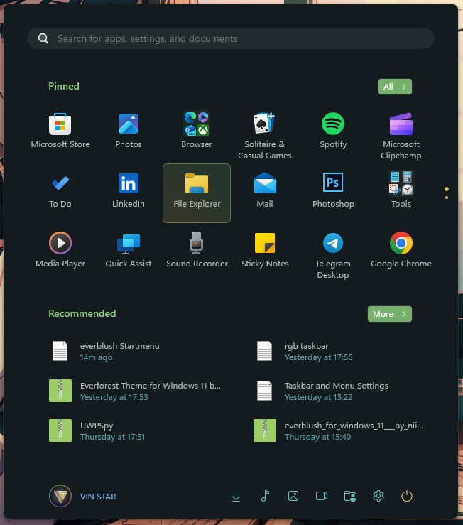

# Everblush theme for Windows 11 Start Menu Styler

The starter is based on the [Everblush](https://github.com/everblush) color scheme. There are no new designs in this menu, you can get the Everblush color with the default menu.

**Author**: [VIN STAR](https://github.com/vinstartheme)



## Theme selection

The theme is integrated into the mod and can be selected directly from the mod's
settings:

* Open the Windows 11 Start Menu Styler mod in Windhawk.
* Go to the "Settings" tab.
* Select the theme and save the settings.

## Manual installation

The theme styles can also be imported manually. To do that, follow these steps:

* Open the Windows 11 Start Menu Styler mod in Windhawk.
* Go to the "Advanced" tab.
* Copy the content below to the text box under "Mod settings" and click "Save".

### Redesigned Start menu

A variant for the [redesigned Windows 11 Start
menu](https://microsoft.design/articles/start-fresh-redesigning-windows-start-menu/)
that is slowly rolling out in the 25H2 update.

<details>
<summary>Content to import (click to expand)</summary>

```yaml
controlStyles:
  - target: Border#AcrylicBorder
    styles:
      - Background=#141b1e
      - BorderBrush=#268ccf7e
  - target: Border#AcrylicOverlay
    styles:
      - Background=#141b1e
  - target: StartMenu.SearchBoxToggleButton > Grid > Border
    styles:
      - Background=#232a2d
      - BorderBrush=transparent
  - target: StartMenu.ExpandedFolderList > Grid > Border
    styles:
      - Background=#232a2d
  - target: TextBlock#PlaceholderText
    styles:
      - Foreground=#80b3b9b8
  - target: Windows.UI.Xaml.Controls.Button > Grid@CommonStates
    styles:
      - Background=#d28ccf7e
      - CornerRadius=4
  - target: StackPanel > Windows.UI.Xaml.Controls.Button
    styles:
      - Background=Transparent
      - BorderBrush=Transparent
  - target: Microsoft.UI.Xaml.Controls.ItemsRepeater > Windows.UI.Xaml.Controls.Button
    styles:
      - Background=Transparent
      - BorderBrush=Transparent
  - target: TextBlock#DisplayName
    styles:
      - Foreground=#b3b9b8
  - target: TextBlock#Title
    styles:
      - Foreground=#b3b9b8
  - target: TextBlock#Subtitle
    styles:
      - Foreground=#6cbfbf
  - target: TextBlock#PinnedListHeaderText
    styles:
      - Foreground=#8ccf7e
  - target: TextBlock#TopLevelSuggestionsListHeaderText
    styles:
      - Foreground=#8ccf7e
  - target: TextBlock#AllAppsHeading
    styles:
      - Foreground=#8ccf7e
  - target: TextBlock#MoreSuggestionsListHeaderText
    styles:
      - Foreground=#8ccf7e
  - target: TextBlock#AppDisplayName
    styles:
      - Foreground=#b3b9b8
  - target: TextBlock#Text
    styles:
      - Foreground=#e5c76b
  - target: TextBlock#FolderGlyph
    styles:
      - Foreground=#e5c76b
  - target: TextBlock#StatusMessage
    styles:
      - Foreground=#8ccf7e
  - target: Windows.UI.Xaml.Controls.Border#ContentBorder > Windows.UI.Xaml.Controls.Grid#DroppedFlickerWorkaroundWrapper > Border@CommonStates
    styles:
      - Background:=<LinearGradientBrush StartPoint="0.5,0" EndPoint="0,0.5"> <GradientStop Color="#268ccf7e" Offset="0" /><GradientStop Color="#26e5c76b" Offset="1" /></LinearGradientBrush>
      - BorderBrush:=<LinearGradientBrush StartPoint="0.5,0" EndPoint="0,0.5"> <GradientStop Color="#828ccf7e" Offset="0" /><GradientStop Color="#82e5c76b" Offset="1" /></LinearGradientBrush>
      - CornerRadius=6
  - target: Windows.UI.Xaml.Controls.Border#ContentBorder > Windows.UI.Xaml.Controls.Grid#DroppedFlickerWorkaroundWrapper > Border#BackgroundBorder
    styles:
      - Background=Transparent
  - target: Border#AppBorder
    styles:
      - Background=#141b1e
  - target: Border#TaskbarSearchBackground
    styles:
      - Background=#232a2d
      - BorderBrush=Transparent
  - target: Grid
    styles:
      - RequestedTheme=2
  - target: TextBlock#UserTileNameText
    styles:
      - Foreground=#67b0e8
  - target: Windows.UI.Xaml.Controls.ContentPresenter > Windows.UI.Xaml.Controls.FontIcon > Windows.UI.Xaml.Controls.Grid > Windows.UI.Xaml.Controls.TextBlock
    styles:
      - Foreground=#6cbfbf
  - target: Windows.UI.Xaml.Controls.Grid > Windows.UI.Xaml.Controls.FontIcon > Windows.UI.Xaml.Controls.Grid > Windows.UI.Xaml.Controls.TextBlock
    styles:
      - Foreground=#e5c76b
  - target: MenuFlyoutPresenter
    styles:
      - Background=#232a2d
  - target: Windows.UI.Xaml.Controls.FontIcon#SearchGlyph > Windows.UI.Xaml.Controls.Grid > Windows.UI.Xaml.Controls.TextBlock
    styles:
      - Foreground=#232a2d
  - target: Microsoft.UI.Xaml.Controls.DropDownButton > Grid
    styles:
      - Background=#d28ccf7e
```
</details>

### Classic Start menu

<details>
<summary>Content to import (click to expand)</summary>

```yaml
controlStyles:
  - target: Border#AcrylicBorder
    styles:
      - Background=#141b1e
      - BorderBrush=#268ccf7e
  - target: Border#AcrylicOverlay
    styles:
      - Background=#141b1e
  - target: StartDocked.SearchBoxToggleButton > Grid > Border
    styles:
      - Background=#232a2d
      - BorderBrush=transparent
  - target: StartMenu.ExpandedFolderList > Grid > Border
    styles:
      - Background=#232a2d
  - target: TextBlock#PlaceholderText
    styles:
      - Foreground=#80b3b9b8
  - target: Windows.UI.Xaml.Controls.Button
    styles:
      - Background=#d28ccf7e
  - target: StackPanel > Windows.UI.Xaml.Controls.Button
    styles:
      - Background=transparent
      - BorderBrush=transparent
  - target: Microsoft.UI.Xaml.Controls.ItemsRepeater > Windows.UI.Xaml.Controls.Button
    styles:
      - Background=transparent
      - BorderBrush=transparent
  - target: TextBlock#DisplayName
    styles:
      - Foreground=#b3b9b8
  - target: TextBlock#Title
    styles:
      - Foreground=#b3b9b8
  - target: TextBlock#Subtitle
    styles:
      - Foreground=#6cbfbf
  - target: TextBlock#PinnedListHeaderText
    styles:
      - Foreground=#8ccf7e
  - target: TextBlock#TopLevelSuggestionsListHeaderText
    styles:
      - Foreground=#8ccf7e
  - target: TextBlock#AllAppsHeading
    styles:
      - Foreground=#8ccf7e
  - target: TextBlock#MoreSuggestionsListHeaderText
    styles:
      - Foreground=#8ccf7e
  - target: TextBlock#AppDisplayName
    styles:
      - Foreground=#b3b9b8
  - target: TextBlock#Text
    styles:
      - Foreground=#e5c76b
  - target: TextBlock#FolderGlyph
    styles:
      - Foreground=#e5c76b
  - target: TextBlock#StatusMessage
    styles:
      - Foreground=#8ccf7e
  - target: Windows.UI.Xaml.Controls.Border#ContentBorder > Windows.UI.Xaml.Controls.Grid#DroppedFlickerWorkaroundWrapper > Border@CommonStates
    styles:
      - Background:=<LinearGradientBrush StartPoint="0.5,0" EndPoint="0,0.5"> <GradientStop Color="#268ccf7e" Offset="0" /><GradientStop Color="#26e5c76b" Offset="1" /></LinearGradientBrush>
      - BorderBrush:=<LinearGradientBrush StartPoint="0.5,0" EndPoint="0,0.5"> <GradientStop Color="#828ccf7e" Offset="0" /><GradientStop Color="#82e5c76b" Offset="1" /></LinearGradientBrush>
      - CornerRadius=6
  - target: Windows.UI.Xaml.Controls.Border#ContentBorder > Windows.UI.Xaml.Controls.Grid#DroppedFlickerWorkaroundWrapper > Border#BackgroundBorder
    styles:
      - Background=transparent
  - target: Border#AppBorder
    styles:
      - Background=#141b1e
  - target: Border#TaskbarSearchBackground
    styles:
      - Background=#232a2d
      - BorderBrush=transparent
  - target: Grid
    styles:
      - RequestedTheme=2
  - target: TextBlock#UserTileNameText
    styles:
      - Foreground=#67b0e8
  - target: Windows.UI.Xaml.Controls.ContentPresenter > Windows.UI.Xaml.Controls.FontIcon > Windows.UI.Xaml.Controls.Grid > Windows.UI.Xaml.Controls.TextBlock
    styles:
      - Foreground=#6cbfbf
  - target: Windows.UI.Xaml.Controls.Grid > Windows.UI.Xaml.Controls.FontIcon > Windows.UI.Xaml.Controls.Grid > Windows.UI.Xaml.Controls.TextBlock
    styles:
      - Foreground=#e5c76b
  - target: MenuFlyoutPresenter
    styles:
      - Background=#232a2d
  - target: Windows.UI.Xaml.Controls.FontIcon#SearchGlyph > Windows.UI.Xaml.Controls.Grid > Windows.UI.Xaml.Controls.TextBlock
    styles:
      - Foreground=#232a2d
```
</details>

## Removing the "Recommended" section

The "Recommended" section can be removed by following these steps:

* Import [the NoRecommendedSection
  theme](https://github.com/ramensoftware/windows-11-start-menu-styling-guide/blob/main/Themes/NoRecommendedSection/README.md)
  using the **Manual installation** instructions.
* Select this theme using the **Theme selection** instructions on this page.
