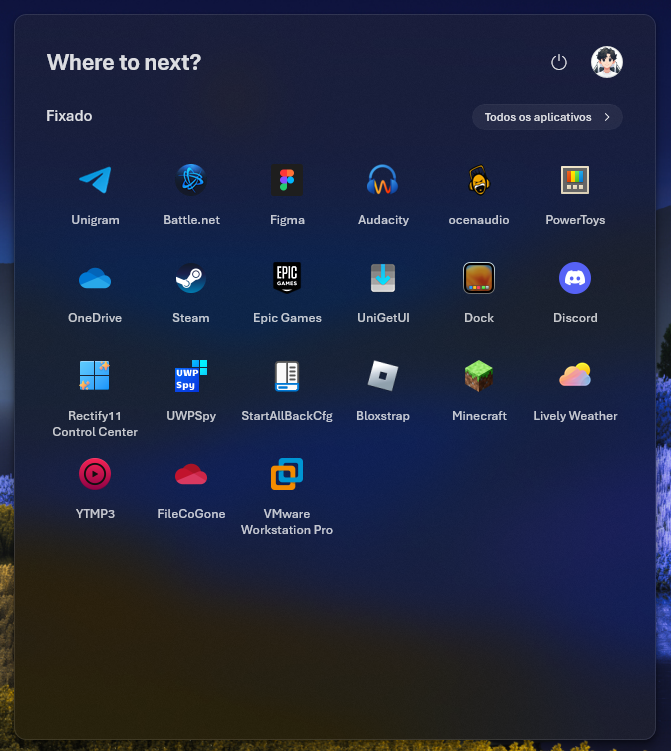

# Fluent2Inspired theme for Windows 11 Start Menu Styler

A theme inspired by [Zee-Al-Eid Ahmad's](https://x.com/zeealeid/) concepts.

**Author**: [Lockframe](https://github.com/Lockframe)



## Installation

The easiest way to install this theme is to import its styles. To do that,
follow these steps:

* Open the Windows 11 Start Menu Styler mod in Windhawk.
* Go to the "Advanced" tab.
* Copy the content below to the text box under "Mod settings" and click "Save".

<details>
<summary>Content to import (click to expand)</summary>

```json
{"controlStyles[0].target":"Button#CloseAllAppsButton","controlStyles[0].styles[0]":"CornerRadius=14","controlStyles[1].target":"Grid#ShowMoreSuggestions","controlStyles[1].styles[0]":"Visibility=1","controlStyles[2].target":"Grid#SuggestionsParentContainer","controlStyles[3].target":"Grid#TopLevelSuggestionsListHeader","controlStyles[3].styles[0]":"Visibility=1","controlStyles[2].styles[0]":"Visibility=1","controlStyles[4].target":"Button#ShowAllAppsButton","controlStyles[4].styles[0]":"CornerRadius=14","controlStyles[5].target":"StartDocked.SearchBoxToggleButton","controlStyles[6].target":"PipsPager#PinnedListPipsPager","controlStyles[6].styles[0]":"Visibility=1","controlStyles[7].target":"Border#AcrylicBorder","controlStyles[7].styles[0]":"Background:=<AcrylicBrush TintColor=\"{ThemeResource CardStrokeColorDefaultSolid}\" TintOpacity=\"0\" TintLuminosityOpacity=\".85\" Opacity=\"1\"/>","controlStyles[7].styles[1]":"CornerRadius=12","controlStyles[8].target":"Grid#MainContent","controlStyles[8].styles[0]":"CornerRadius=11","controlStyles[9].target":"StartMenu.PinnedList","controlStyles[9].styles[0]":"Height=690","controlStyles[10].target":"TextBlock#DisplayName","controlStyles[10].styles[0]":"Margin=0,16,0,-16","controlStyles[5].styles[0]":"Margin=30,0,31,28","controlStyles[7].styles[2]":"BorderBrush:=<AcrylicBrush TintColor=\"{ThemeResource SurfaceStrokeColorDefault}\" TintOpacity=\"0\" TintLuminosityOpacity=\".25\" Opacity=\"1\"/>","controlStyles[11].target":"TextBlock#PinnedListHeaderText","controlStyles[11].styles[0]":"Margin=-32,0,0,0","controlStyles[0].styles[1]":"Margin=0,0,-32,0","controlStyles[12].target":"Border#TaskbarSearchBackground","controlStyles[13].target":"Border#AppBorder","controlStyles[13].styles[0]":"Background:=<AcrylicBrush TintColor=\"{ThemeResource CardStrokeColorDefaultSolid}\" TintOpacity=\"0\" TintLuminosityOpacity=\".85\" Opacity=\"1\"/>","controlStyles[14].target":"Border#dropshadow","controlStyles[13].styles[1]":"BorderBrush:=<AcrylicBrush TintColor=\"{ThemeResource SurfaceStrokeColorDefault}\" TintOpacity=\"0\" TintLuminosityOpacity=\".25\" Opacity=\"1\"/>","controlStyles[15].target":"Cortana.UI.Views.RichSearchBoxControl#SearchBoxControl","controlStyles[15].styles[0]":"Margin=33,33,33,10","theme":"","resourceVariables[0].variableKey":"","resourceVariables[0].value":"","controlStyles[16].target":"TextBlock#UserTileNameText","controlStyles[16].styles[0]":"Visibility=1","controlStyles[17].target":"TextBlock#AllAppsHeading","controlStyles[17].styles[0]":"FontFamily=Aptos","controlStyles[18].target":"Border#ContentBorder","controlStyles[18].styles[0]":"CornerRadius=6","controlStyles[4].styles[1]":"Margin=0,0,32,0","controlStyles[19].target":"GridViewItem > Border#ContentBorder > Grid#DroppedFlickerWorkaroundWrapper > Border#BackgroundBorder","controlStyles[19].styles[0]":"FocusVisualPrimaryThickness=0","controlStyles[10].styles[1]":"TextAlignment=0","controlStyles[7].styles[3]":"BorderThickness=1","controlStyles[12].styles[0]":"Visibility=1","controlStyles[10].styles[2]":"FontSize=13","controlStyles[4].styles[2]":"Width=148","controlStyles[0].styles[2]":"Width=74","controlStyles[20].target":"StartDocked.SearchBoxToggleButton > Grid > ContentPresenter > TextBlock#PlaceholderText","controlStyles[20].styles[0]":"Text=Where to next?","controlStyles[20].styles[1]":"FontWeight=700","controlStyles[20].styles[2]":"FontFamily=Aptos","controlStyles[20].styles[3]":"FontSize=24","controlStyles[21].target":"StartDocked.SearchBoxToggleButton > Grid > Border","controlStyles[21].styles[0]":"Background=transparent","controlStyles[21].styles[1]":"BorderBrush=transparent","controlStyles[22].target":"StartDocked.SearchBoxToggleButton > Grid > FontIcon","controlStyles[22].styles[0]":"Visibility=1","controlStyles[10].styles[3]":"FontFamily=Aptos","controlStyles[11].styles[1]":"FontFamily=Aptos","controlStyles[4].styles[3]":"Height=26","controlStyles[0].styles[3]":"Height=26","controlStyles[17].styles[1]":"Margin=-32,0,0,0","controlStyles[23].target":"Grid#TopLevelRoot","controlStyles[23].styles[0]":"Margin=0,-8,0,0","controlStyles[24].target":"GridViewItem","controlStyles[24].styles[0]":"Height=96","controlStyles[25].target":"StartDocked.UserTileView","controlStyles[25].styles[0]":"Margin=512,-1290,-2000,0","controlStyles[26].target":"StartDocked.UserTileView > StartDocked.NavigationPaneButton > Grid > Border","controlStyles[26].styles[0]":"CornerRadius=99","controlStyles[26].styles[1]":"Margin=8,0,8,0","controlStyles[27].styles[0]":"Margin=-64,-1290,-2000,0","controlStyles[27].target":"StartDocked.PowerOptionsView","controlStyles[27].styles[1]":"CornerRadius=99","controlStyles[28].target":"TextBlock#ShowAllAppsButtonText","controlStyles[28].styles[0]":"FontFamily=Aptos","controlStyles[29].target":"Button#CloseAllAppsButton > ContentPresenter > StackPanel > TextBlock","controlStyles[29].styles[0]":"FontFamily=Aptos","controlStyles[30].target":"Border#AcrylicOverlay","controlStyles[30].styles[0]":"Visibility=1","controlStyles[24].styles[1]":"Margin=0,0,0,2","controlStyles[31].target":"Grid#AllAppsPaneHeader","controlStyles[31].styles[0]":"Margin=64,-8,64,0","controlStyles[32].target":"Grid#InnerContent","controlStyles[32].styles[0]":"Margin=0,31,0,-64","controlStyles[33].target":"TextBlock#AppDisplayName","controlStyles[34].target":"Button#Header > Border > TextBlock","controlStyles[34].styles[0]":"FontFamily=Aptos","controlStyles[34].styles[1]":"FontWeight=600","controlStyles[35].target":"StartDocked.PowerOptionsView > StartDocked.NavigationPaneButton > Grid > Border","controlStyles[35].styles[0]":"CornerRadius=99","controlStyles[35].styles[1]":"Margin=1","controlStyles[33].styles[0]":"FontFamily=Aptos","controlStyles[33].styles[1]":"Opacity=.85","controlStyles[20].styles[4]":"Foreground:=<SolidColorBrush Color=\"{ThemeResource FocusStrokeColorOuter}\" Opacity=\".85\"/>","controlStyles[10].styles[4]":"Opacity=.65","controlStyles[27].styles[2]":"Opacity=.85","controlStyles[28].styles[1]":"Opacity=.85","controlStyles[29].styles[1]":"Opacity=.85","controlStyles[34].styles[2]":"Opacity=.85","controlStyles[36].target":"TileGrid","controlStyles[36].styles[0]":"Background:=<SolidColorBrush Color=\"{ThemeResource ControlFillColorInputActive}\" Opacity=\".7\"/>","controlStyles[36].styles[1]":"CornerRadiusProtected=8","controlStyles[36].styles[2]":"BorderThicknessProtected=1","controlStyles[36].styles[3]":"BorderBrushProtected:=<SolidColorBrush Color=\"{ThemeResource SurfaceStrokeColorDefault}\" Opacity=\".35\"/>","controlStyles[37].target":"ListViewItem","controlStyles[37].styles[0]":"Margin=1,0,-6,0","controlStyles[37].styles[1]":"CornerRadius=4","controlStyles[38].target":"Button#Header","controlStyles[38].styles[0]":"Margin=4,0,-3,0","controlStyles[39].target":"StartDocked.AllAppsPane#AllAppsPanel","controlStyles[39].styles[0]":"Margin=-20,0,-6,0","controlStyles[40].target":"TextBlock#PlaceholderTextContentPresenter","controlStyles[40].styles[0]":"FontFamily=Aptos","controlStyles[40].styles[1]":"FontSize=24","controlStyles[40].styles[2]":"FontWeight=700","controlStyles[40].styles[3]":"Foreground:=<SolidColorBrush Color=\"{ThemeResource FocusStrokeColorOuter}\" Opacity=\".7\"/>","controlStyles[41].target":"Microsoft.UI.Xaml.Controls.AnimatedIcon#SearchIconPlayer","controlStyles[41].styles[0]":"Visibility=1","controlStyles[42].target":"Button#SearchGlyphContainer","controlStyles[42].styles[0]":"FontSize=32","controlStyles[43].target":"Cortana.UI.Views.CortanaRichSearchBox#SearchTextBox","controlStyles[43].styles[0]":"FontSize=24","controlStyles[43].styles[1]":"Foreground:=<SolidColorBrush Color=\"{ThemeResource TextFillColorPrimary}\" Opacity=\".85\"/>","controlStyles[43].styles[2]":"FontFamily=Aptos","controlStyles[43].styles[3]":"Opacity=.85","controlStyles[42].styles[1]":"Visibility=1","controlStyles[43].styles[4]":"FontWeight=ExtraBold","controlStyles[44].target":"Border#LayerBorder","controlStyles[44].styles[0]":"Visibility=1","controlStyles[45].target":"Windows.UI.Xaml.Controls.FontIcon#SearchBoxOnTaskbarSearchGlyph","controlStyles[45].styles[0]":"Visibility=0","controlStyles[13].styles[2]":"CornerRadius=12","controlStyles[45].styles[1]":"Margin=0","controlStyles[46].target":"Cortana.UI.Views.RichSearchBoxControl#SearchBoxControl","controlStyles[46].styles[0]":"Margin=25,32,25,13","controlStyles[45].styles[2]":"FontSize=32","controlStyles[45].styles[3]":"Opacity=.85","controlStyles[11].styles[2]":"Opacity=.85","controlStyles[47].target":"Grid#WebViewGrid > WebView","controlStyles[47].styles[0]":"Margin=-3,0,0,0","controlStyles[48].target":"TextBlock#StatusMessage","controlStyles[48].styles[0]":"Visibility=1","controlStyles[49].target":"Border#LogoBackgroundPlate","controlStyles[49].styles[0]":"Margin=12,0,0,0","controlStyles[33].styles[2]":"Margin=4,0,0,0","controlStyles[11].styles[3]":"FontSize=16","controlStyles[17].styles[2]":"FontSize=16","controlStyles[17].styles[3]":"Opacity=.85","controlStyles[14].styles[0]":"CornerRadius=12","controlStyles[50].target":"Grid#WebViewGrid","controlStyles[50].styles[0]":"CornerRadius=0,0,12,0","controlStyles[51].target":"Border#DropShadow","controlStyles[51].styles[0]":"CornerRadius=12","controlStyles[52].target":"Border#DropShadowDismissTarget","controlStyles[52].styles[0]":"CornerRadius=12"}
```
</details>
