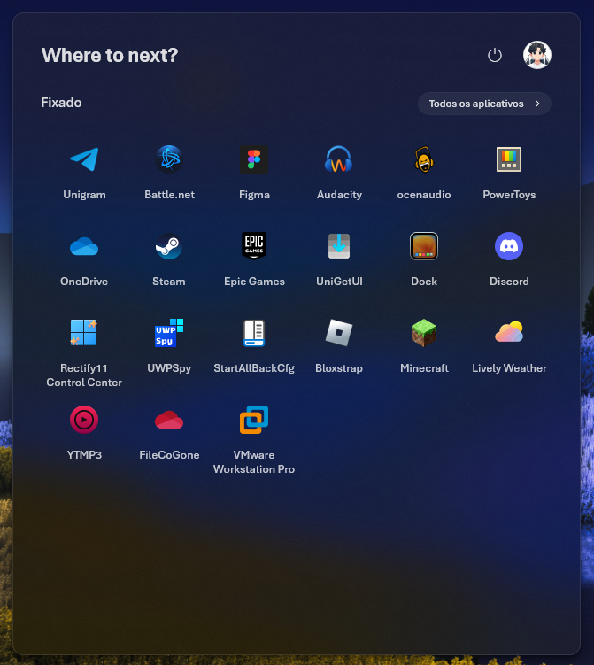

# Fluent2Inspired theme for Windows 11 Start Menu Styler

A theme inspired by [Zee-Al-Eid Ahmad's](https://x.com/zeealeid/status/1764301467014373774) concepts.

**Author**: [Lockframe](https://github.com/Lockframe)



## Theme selection

The theme is integrated into the mod and can be selected directly from the mod's
settings:

* Open the Windows 11 Start Menu Styler mod in Windhawk.
* Go to the "Settings" tab.
* Select the theme and save the settings.

## Manual installation

The theme styles can also be imported manually. To do that, follow these steps:

* Open the Windows 11 Start Menu Styler mod in Windhawk.
* Go to the "Advanced" tab.
* Copy the content below to the text box under "Mod settings" and click "Save".

### Redesigned Start menu

A variant for the [redesigned Windows 11 Start
menu](https://microsoft.design/articles/start-fresh-redesigning-windows-start-menu/)
that is slowly rolling out in the 25H2 update.

<details>
<summary>Content to import (click to expand)</summary>

```yaml
controlStyles:
  - target: Grid#ShowMoreSuggestions
    styles:
      - Visibility=1
  - target: Grid#SuggestionsParentContainer
    styles:
      - Visibility=1
  - target: Grid#TopLevelSuggestionsListHeader
    styles:
      - Visibility=1
  - target: StartMenu.SearchBoxToggleButton
    styles:
      - Margin=5,2,-5,-2
  - target: Border#AcrylicBorder
    styles:
      - Background:=<AcrylicBrush TintColor="{ThemeResource CardStrokeColorDefaultSolid}" FallbackColor="{ThemeResource CardStrokeColorDefaultSolid}" TintOpacity="0.45" TintLuminosityOpacity=".96" Opacity="1"/>
      - CornerRadius=12
      - BorderBrush:=<AcrylicBrush TintColor="{ThemeResource SurfaceStrokeColorDefault}" FallbackColor="{ThemeResource SurfaceStrokeColorDefault}" TintOpacity="0" TintLuminosityOpacity=".25" Opacity="1"/>
  - target: Grid#MainContent
    styles:
      - CornerRadius=12
  - target: StartMenu.PinnedList
    styles:
      - MaxWidth=650
      - Margin=-14,14,4,0
  - target: TextBlock#DisplayName
    styles:
      - Margin=0,8,0,-8
      - FontSize=13
      - FontFamily=Aptos
      - Opacity=.75
      - FontWeight=500
      - Padding=14,0,14,0
  - target: TextBlock#PinnedListHeaderText
    styles:
      - FontFamily=Aptos
      - Opacity=.85
      - FontSize=16
      - Margin=40,0,-40,0
  - target: Border#TaskbarSearchBackground
    styles:
      - Visibility=1
  - target: Border#AppBorder
    styles:
      - Background:=<AcrylicBrush TintColor="{ThemeResource CardStrokeColorDefaultSolid}" FallbackColor="{ThemeResource CardStrokeColorDefaultSolid}" TintOpacity="0.25" TintLuminosityOpacity=".96" Opacity="1"/>
      - BorderBrush:=<AcrylicBrush TintColor="{ThemeResource SurfaceStrokeColorDefault}" FallbackColor="{ThemeResource SurfaceStrokeColorDefault}" TintOpacity="0" TintLuminosityOpacity=".25" Opacity="1"/>
      - CornerRadius=12
  - target: Border#StartDropShadow
    styles:
      - CornerRadius=12
      - Margin=-1
  - target: Cortana.UI.Views.RichSearchBoxControl#SearchBoxControl
    styles:
      - Margin=33,33,33,10
  - target: TextBlock#UserTileNameText
    styles:
      - Visibility=1
  - target: TextBlock#AllListHeadingText
    styles:
      - FontFamily=Aptos
      - Margin=50,5,0,0
      - FontSize=16
      - Opacity=.85
  - target: Border#ContentBorder
    styles:
      - CornerRadius=6
  - target: StartMenu.SearchBoxToggleButton > Grid > ContentPresenter > TextBlock#PlaceholderText
    styles:
      - Text=Where to next?
      - FontWeight=700
      - FontFamily=Aptos
      - FontSize=24
      - Foreground:=<SolidColorBrush Color="{ThemeResource FocusStrokeColorOuter}" Opacity=".85"/>
      - Margin=2,0,0,0
  - target: StartMenu.SearchBoxToggleButton > Grid > Border
    styles:
      - Background=Transparent
      - BorderBrush=Transparent
  - target: StartMenu.SearchBoxToggleButton > Grid > FontIcon
    styles:
      - Transform3D:=<CompositeTransform3D TranslateX="165" TranslateY="-1"/>
      - Foreground:=<SolidColorBrush Color="{ThemeResource FocusStrokeColorOuter}" FallbackColor="{ThemeResource FocusStrokeColorOuter}" Opacity=".85"/>
      - FontSize=24
  - target: Grid#TopLevelRoot
    styles:
      - Margin=0,-8,0,0
  - target: StartDocked.UserTileView
    styles:
      - RenderTransform:=<TranslateTransform X="512" Y="-685" />
  - target: StartDocked.UserTileView > StartDocked.NavigationPaneButton > Grid > Border
    styles:
      - CornerRadius=99
      - Margin=7,0,8,1
  - target: StartDocked.PowerOptionsView
    styles:
      - RenderTransform:=<TranslateTransform X="-14" Y="-685" />
      - CornerRadius=99
      - Opacity=.85
  - target: Border#AcrylicOverlay
    styles:
      - Visibility=1
  - target: TextBlock#AppDisplayName
    styles:
      - FontFamily=Aptos
      - Opacity=.85
      - Margin=4,0,0,4
      - FontWeight=500
  - target: Button#Header > Border > TextBlock
    styles:
      - FontFamily=Aptos
      - FontWeight=600
      - Opacity=.85
  - target: StartDocked.PowerOptionsView > StartDocked.NavigationPaneButton > Grid > Border
    styles:
      - CornerRadius=99
      - Margin=1
  - target: ListViewItem
    styles:
      - Margin=1,5,-5,-5
      - CornerRadius=4
  - target: Button#Header
    styles:
      - Margin=4,0,-3,-5
  - target: TextBlock#PlaceholderTextContentPresenter
    styles:
      - FontFamily=Aptos
      - FontSize=24
      - FontWeight=700
      - Foreground:=<SolidColorBrush Color="{ThemeResource FocusStrokeColorOuter}" Opacity=".7"/>
  - target: Microsoft.UI.Xaml.Controls.AnimatedIcon#SearchIconPlayer
    styles:
      - Visibility=1
  - target: Button#SearchGlyphContainer
    styles:
      - FontSize=32
      - Visibility=1
  - target: Cortana.UI.Views.CortanaRichSearchBox#SearchTextBox
    styles:
      - FontSize=24
      - Foreground:=<SolidColorBrush Color="{ThemeResource TextFillColorPrimary}" Opacity=".85"/>
      - FontFamily=Aptos
      - Opacity=.85
      - FontWeight=ExtraBold
  - target: Border#LayerBorder
    styles:
      - Visibility=1
  - target: Windows.UI.Xaml.Controls.FontIcon#SearchBoxOnTaskbarSearchGlyph
    styles:
      - Visibility=0
      - Margin=0
      - FontSize=32
      - Opacity=.85
  - target: Cortana.UI.Views.RichSearchBoxControl#SearchBoxControl
    styles:
      - Margin=31,31,17,17
  - target: Grid#WebViewGrid
    styles:
      - Margin=-13,0,-10,15
  - target: TextBlock#StatusMessage
    styles:
      - Visibility=1
  - target: Border#StartDropShadow
    styles:
      - CornerRadius=12
      - Margin=-1
  - target: Border#StartDropShadowDismissTarget
    styles:
      - CornerRadius=12
  - target: Windows.UI.Xaml.Controls.FlyoutPresenter[1]
    styles:
      - Margin=-250,50,0,0
  - target: Windows.UI.Xaml.Controls.FlyoutPresenter
    styles:
      - Margin=-250,0,0,0
  - target: StartMenu.SearchBoxToggleButton > Grid > FontIcon#SearchGlyph
    styles:
      - Margin=0,-3,0,0
      - FontSize=25
      - Foreground:=<SolidColorBrush Color="{ThemeResource FocusStrokeColorOuter}" Opacity=".85"/>
  - target: StartMenu.ExpandedFolderList > Grid#Root > Border
    styles:
      - Height=420
  - target: TextBox#ExpandedFolderNameTextBox
    styles:
      - Margin=-15,-15,15,20
  - target: Windows.UI.Xaml.Controls.GridView#FolderList > Border
    styles:
      - Margin=0,0,0,-60
  - target: StartDocked.NavigationPaneView#NavigationPane > Grid > StartDocked.AppListView
    styles:
      - Margin=0,0,-36,0
  - target: Image#SearchIconOn
    styles:
      - Visibility=1
  - target: Grid#TopLevelSuggestionsContainer
    styles:
      - Visibility=1
  - target: Image#SearchIconOff
    styles:
      - Visibility=1
  - target: Grid#ContentBorder > Border#BackgroundBorder
    styles:
      - CornerRadius=99
      - Height=38
      - Width=38
  - target: Grid#ContentBorder > ContentPresenter > FontIcon
    styles:
      - Opacity=.85
  - target: StartDocked.AppListView#NavigationPanePlacesListView
    styles:
      - Padding=2,0,6,0
  - target: StartDocked.AppListView#NavigationPanePlacesListView > Border > ScrollViewer > Border#Root > Grid > ScrollContentPresenter > ItemsPresenter > ItemsStackPanel > ListViewItem
    styles:
      - Margin=-2,0,0,0
  - target: StartDocked.AppListView#NavigationPanePlacesListView
    styles:
      - Margin=0,0,-46,0
  - target: Windows.UI.Xaml.Controls.Primitives.ScrollBar
    styles:
      - Transform3D:=<CompositeTransform3D TranslateX="-10" TranslateY="3"/>
      - Height=615
  - target: Grid#ContentBorder > Border#BorderBackground
    styles:
      - Margin=1,0,-1,0
  - target: StackPanel#RootPanel > Button#Header > Border#Border
    styles:
      - Margin=0,0,-1,0
  - target: Rectangle#TextCaret
    styles:
      - Visibility=Collapsed
  - target: Grid#RootGrid@SearchBoxLocationStates
    styles:
      - Margin@SearchBoxOnBottomWithoutQFMargin=-32,10,32,-10
  - target: Grid#RootGrid@SearchBoxLocationStates > Cortana.UI.Views.CortanaRichSearchBox > Grid > TextBlock#PlaceholderTextContentPresenter
    styles:
      - FontSize=16
  - target: Grid#MainMenu
    styles:
      - Width=630
  - target: Grid#FrameRoot
    styles:
      - MaxHeight=775
  - target: ListView#ZoomedOutListView
    styles:
      - Margin=0,-150,0,0
  - target: GridView#AllAppsGrid > Border > ScrollViewer > Border#Root > Grid > ScrollContentPresenter > ItemsPresenter > ItemsWrapGrid
    styles:
      - RenderTransform:=<TranslateTransform X="-8" />
      - Margin=0
      - Width=540
  - target: StartMenu.CategoryControl
    styles:
      - Margin=0,0,-8,-8
      - RenderTransform:=<TranslateTransform X="14" />
  - target: Microsoft.UI.Xaml.Controls.DropDownButton > Grid > ContentPresenter > TextBlock
    styles:
      - FontFamily=Aptos
      - FontSize=16
  - target: TextBlock#ShowMorePinnedButtonText
    styles:
      - FontFamily=Aptos
      - FontSize=16
  - target: Grid#TopLevelSuggestionsRoot
    styles:
      - Visibility=Collapsed
  - target: Windows.UI.Xaml.Controls.Primitives.ToggleButton
    styles:
      - Margin=-80,0,80,0
```
</details>

### Classic Start menu

<details>
<summary>Content to import (click to expand)</summary>

```yaml
controlStyles:
  - target: Button#CloseAllAppsButton
    styles:
      - CornerRadius=14
      - Margin=0,0,-32,0
      - Padding=10,4,12,5
  - target: Grid#ShowMoreSuggestions
    styles:
      - Visibility=1
  - target: Grid#SuggestionsParentContainer
    styles:
      - Visibility=1
  - target: Grid#TopLevelSuggestionsListHeader
    styles:
      - Visibility=1
  - target: Button#ShowAllAppsButton
    styles:
      - CornerRadius=14
      - Margin=0,0,32,0
      - Padding=12,4,10,5
  - target: StartDocked.SearchBoxToggleButton
    styles:
      - Margin=30,0,120,26
  - target: PipsPager#PinnedListPipsPager
    styles:
      - Visibility=1
  - target: Border#AcrylicBorder
    styles:
      - Background:=<AcrylicBrush TintColor="{ThemeResource CardStrokeColorDefaultSolid}" FallbackColor="{ThemeResource CardStrokeColorDefaultSolid}" TintOpacity="0.45" TintLuminosityOpacity=".96" Opacity="1"/>
      - CornerRadius=12
      - BorderBrush:=<AcrylicBrush TintColor="{ThemeResource SurfaceStrokeColorDefault}" FallbackColor="{ThemeResource SurfaceStrokeColorDefault}" TintOpacity="0" TintLuminosityOpacity=".25" Opacity="1"/>
  - target: Grid#MainContent
    styles:
      - CornerRadius=12
  - target: StartMenu.PinnedList
    styles:
      - MaxWidth=650
      - Height=504
      - Margin=-8,14,8,-14
  - target: TextBlock#DisplayName
    styles:
      - Margin=0,8,0,-8
      - FontSize=13
      - FontFamily=Aptos
      - Opacity=.75
      - FontWeight=500
      - Padding=14,0,14,0
  - target: TextBlock#PinnedListHeaderText
    styles:
      - Margin=-14,0,0,0
      - FontFamily=Aptos
      - Opacity=.85
      - FontSize=16
      - Margin=-32,0,0,0
  - target: Border#TaskbarSearchBackground
    styles:
      - Visibility=1
  - target: Border#AppBorder
    styles:
      - Background:=<AcrylicBrush TintColor="{ThemeResource CardStrokeColorDefaultSolid}" FallbackColor="{ThemeResource CardStrokeColorDefaultSolid}" TintOpacity="0.25" TintLuminosityOpacity=".96" Opacity="1"/>
      - BorderBrush:=<AcrylicBrush TintColor="{ThemeResource SurfaceStrokeColorDefault}" FallbackColor="{ThemeResource SurfaceStrokeColorDefault}" TintOpacity="0" TintLuminosityOpacity=".25" Opacity="1"/>
      - CornerRadius=12
  - target: Border#dropshadow
    styles:
      - CornerRadius=12
      - Margin=-1
  - target: Cortana.UI.Views.RichSearchBoxControl#SearchBoxControl
    styles:
      - Margin=33,33,33,10
  - target: TextBlock#UserTileNameText
    styles:
      - Visibility=1
  - target: TextBlock#AllAppsHeading
    styles:
      - FontFamily=Aptos
      - Margin=-32,0,0,0
      - FontSize=16
      - Opacity=.85
  - target: Border#ContentBorder
    styles:
      - CornerRadius=6
  - target: StartDocked.SearchBoxToggleButton > Grid > ContentPresenter > TextBlock#PlaceholderText
    styles:
      - Text=Where to next?
      - FontWeight=700
      - FontFamily=Aptos
      - FontSize=24
      - Foreground:=<SolidColorBrush Color="{ThemeResource FocusStrokeColorOuter}" Opacity=".85"/>
      - Margin=2,0,0,0
  - target: StartDocked.SearchBoxToggleButton > Grid > Border
    styles:
      - Background=transparent
      - BorderBrush=transparent
  - target: StartDocked.SearchBoxToggleButton > Grid > FontIcon
    styles:
      - Transform3D:=<CompositeTransform3D TranslateX="165" TranslateY="-1"/>
      - Foreground:=<SolidColorBrush Color="{ThemeResource FocusStrokeColorOuter}" FallbackColor="{ThemeResource FocusStrokeColorOuter}" Opacity=".85"/>
      - FontSize=24
  - target: Grid#TopLevelRoot
    styles:
      - Margin=0,-8,0,0
  - target: StartDocked.UserTileView
    styles:
      - Margin=512,-1290,-2000,0
  - target: StartDocked.UserTileView > StartDocked.NavigationPaneButton > Grid > Border
    styles:
      - CornerRadius=99
      - Margin=8,0,8,0
  - target: StartDocked.PowerOptionsView
    styles:
      - Margin=-64,-1290,-2000,0
      - CornerRadius=99
      - Opacity=.85
  - target: TextBlock#ShowAllAppsButtonText
    styles:
      - FontFamily=Aptos
      - Opacity=.85
      - FontWeight=500
  - target: Button#CloseAllAppsButton > ContentPresenter > StackPanel > TextBlock
    styles:
      - FontFamily=Aptos
      - Opacity=.85
      - FontWeight=500
  - target: Border#AcrylicOverlay
    styles:
      - Visibility=1
  - target: Grid#AllAppsPaneHeader
    styles:
      - Margin=64,-8,64,5
  - target: Grid#InnerContent
    styles:
      - Margin=0,31,0,-64
  - target: TextBlock#AppDisplayName
    styles:
      - FontFamily=Aptos
      - Opacity=.85
      - Margin=4,0,0,4
      - FontWeight=500
  - target: Button#Header > Border > TextBlock
    styles:
      - FontFamily=Aptos
      - FontWeight=600
      - Opacity=.85
  - target: StartDocked.PowerOptionsView > StartDocked.NavigationPaneButton > Grid > Border
    styles:
      - CornerRadius=99
      - Margin=1
  - target: TileGrid
    styles:
      - Background:=<SolidColorBrush Color="{ThemeResource TextFillColorInverse}" Opacity=".2"/>
      - CornerRadiusProtected=8
      - BorderThicknessProtected=1
      - BorderBrushProtected:=<SolidColorBrush Color="{ThemeResource SurfaceStrokeColorDefault}" Opacity=".35"/>
  - target: ListViewItem
    styles:
      - Margin=1,0,-6,0
      - CornerRadius=4
      - Padding=0,0,6,0
  - target: Button#Header
    styles:
      - Margin=4,0,-3,0
  - target: StartDocked.AllAppsPane#AllAppsPanel
    styles:
      - Margin=-20,0,-6,0
  - target: TextBlock#PlaceholderTextContentPresenter
    styles:
      - FontFamily=Aptos
      - FontSize=24
      - FontWeight=700
      - Foreground:=<SolidColorBrush Color="{ThemeResource FocusStrokeColorOuter}" Opacity=".7"/>
  - target: Microsoft.UI.Xaml.Controls.AnimatedIcon#SearchIconPlayer
    styles:
      - Visibility=1
  - target: Button#SearchGlyphContainer
    styles:
      - FontSize=32
      - Visibility=1
  - target: Cortana.UI.Views.CortanaRichSearchBox#SearchTextBox
    styles:
      - FontSize=24
      - Foreground:=<SolidColorBrush Color="{ThemeResource TextFillColorPrimary}" Opacity=".85"/>
      - FontFamily=Aptos
      - Opacity=.85
      - FontWeight=ExtraBold
  - target: Border#LayerBorder
    styles:
      - Visibility=1
  - target: Windows.UI.Xaml.Controls.FontIcon#SearchBoxOnTaskbarSearchGlyph
    styles:
      - Visibility=0
      - Margin=0
      - FontSize=32
      - Opacity=.85
  - target: Cortana.UI.Views.RichSearchBoxControl#SearchBoxControl
    styles:
      - Margin=31,31,17,17
  - target: Grid#WebViewGrid
    styles:
      - Margin=-13,0,-10,15
  - target: TextBlock#StatusMessage
    styles:
      - Visibility=1
  - target: Border#LogoBackgroundPlate
    styles:
      - Margin=12,0,0,0
  - target: Border#DropShadow
    styles:
      - CornerRadius=12
      - Margin=-1
  - target: Border#DropShadowDismissTarget
    styles:
      - CornerRadius=12
  - target: Windows.UI.Xaml.Controls.FlyoutPresenter[1]
    styles:
      - Margin=-250,50,0,0
  - target: StartDocked.LauncherFrame > Grid#RootGrid > Grid#RootContent > Grid#MainContent > Grid#InnerContent > Rectangle
    styles:
      - Visibility=1
  - target: Windows.UI.Xaml.Controls.FlyoutPresenter
    styles:
      - Margin=-250,0,0,0
  - target: StartDocked.SearchBoxToggleButton > Grid > FontIcon#SearchGlyph
    styles:
      - Margin=0,-3,0,0
      - FontSize=25
      - Foreground:=<SolidColorBrush Color="{ThemeResource FocusStrokeColorOuter}" Opacity=".85"/>
  - target: StartMenu.ExpandedFolderList > Grid#Root > Border
    styles:
      - Height=420
  - target: TextBox#ExpandedFolderNameTextBox
    styles:
      - Margin=-15,-15,15,20
  - target: Windows.UI.Xaml.Controls.GridView#FolderList > Border
    styles:
      - Margin=0,0,0,-60
  - target: StartDocked.NavigationPaneView#NavigationPane > Grid > StartDocked.AppListView
    styles:
      - Margin=0,0,-36,0
  - target: Image#SearchIconOn
    styles:
      - Visibility=1
  - target: Grid#TopLevelSuggestionsContainer
    styles:
      - Visibility=1
  - target: Image#SearchIconOff
    styles:
      - Visibility=1
  - target: Grid#ContentBorder > Border#BackgroundBorder
    styles:
      - CornerRadius=99
      - Height=38
      - Width=38
  - target: Grid#ContentBorder > ContentPresenter > FontIcon
    styles:
      - Margin=6,0,0,0
      - Opacity=.85
  - target: StartDocked.AppListView#NavigationPanePlacesListView
    styles:
      - Padding=2,0,6,0
  - target: StartDocked.AppListView#NavigationPanePlacesListView > Border > ScrollViewer > Border#Root > Grid > ScrollContentPresenter > ItemsPresenter > ItemsStackPanel > ListViewItem
    styles:
      - Margin=-2,0,0,0
  - target: StartDocked.AppListView#NavigationPanePlacesListView
    styles:
      - Margin=0,0,-46,0
  - target: Windows.UI.Xaml.Controls.GridViewItem
    styles:
      - Height=84
```
</details>
