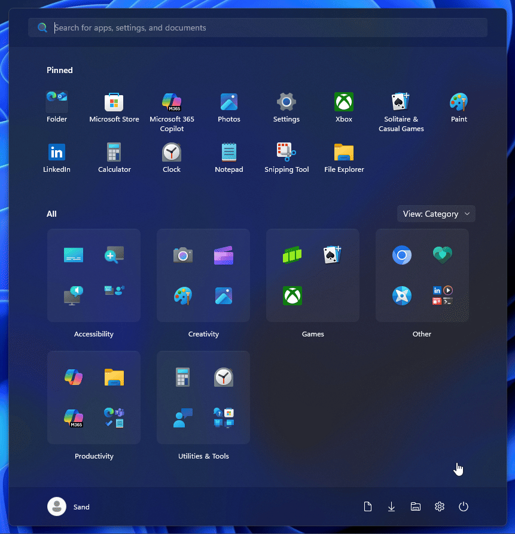

# Fluid theme for Windows 11 Start Menu Styler

This theme intends to subtly take Fluent's design principles more seriously and make them more consistent. Changes include:
* 3D-like borders on most elements.
* Background transitions on elements usually lacking them.
* Context menu slide-in animations.
* Scaling effect on buttons containing images, as seen in the Pinned list.
* Search box restyle.

**Author**: [SandTechStuff](https://github.com/SandTechStuff)



> [!IMPORTANT]
> This theme is made for the [redesigned Windows 11 Start menu](https://microsoft.design/articles/start-fresh-redesigning-windows-start-menu/) that is slowly rolling out in the 25H2 update.

> [!NOTE]
> The default configuration is designed for Dark mode. If you want to use Light mode, add this to the "Style constants" section of the Start Menu Styler settings:

```
borderColor=<LinearGradientBrush x:Key="ShellTaskbarItemGradientStrokeColorSecondaryBrush" MappingMode="Absolute" StartPoint="0,0" EndPoint="0,3"><LinearGradientBrush.RelativeTransform><ScaleTransform ScaleY="-1" CenterY="0.5" /></LinearGradientBrush.RelativeTransform><LinearGradientBrush.GradientStops><GradientStop Offset="0.33" Color="#0F000000" /><GradientStop Offset="1" Color="#05000000" /></LinearGradientBrush.GradientStops></LinearGradientBrush>
```

## Theme selection

The theme is integrated into the mod and can simply be selected from the mod's
settings:

* Open the Windows 11 Start Menu Styler mod in Windhawk.
* Go to the "Settings" tab.
* Select the theme and save the settings.

## Manual installation

The theme styles can also be imported manually. To do that, follow these steps:

* Open the Windows 11 Start Menu Styler mod in Windhawk.
* Go to the "Advanced" tab.
* Copy the content below to the text box under "Mod settings" and click "Save".

<details>
<summary>Content to import (click to expand)</summary>

```json
{
	"controlStyles[0].target": "Border#ContentBorder@CommonStates > Grid > Border#BackgroundBorder",
	"controlStyles[0].styles[0]": "BorderThickness=2",
	"controlStyles[0].styles[1]": "BorderBrush@PointerOver:=$borderColor",
	"controlStyles[0].styles[2]": "BorderBrush@Pressed:=$borderColor",
	"controlStyles[1].target": "Button > Grid@CommonStates > Border#BackgroundBorder",
	"controlStyles[1].styles[0]": "BorderThickness=2",
	"controlStyles[1].styles[1]": "BorderBrush@PointerOver:=$borderColor",
	"controlStyles[1].styles[2]": "BorderBrush@Pressed:=$borderColor",
	"controlStyles[1].styles[3]": "BackgroundSizing=InnerBorderEdge",
	"controlStyles[2].target": "StartMenu.CategoryControl > Grid > Border",
	"controlStyles[2].styles[0]": "BorderThickness=2",
	"controlStyles[2].styles[1]": "BorderBrush:=$borderColor",
	"controlStyles[2].styles[2]": "BackgroundSizing=InnerBorderEdge",
	"controlStyles[2].styles[3]": "Background:=<SolidColorBrush Color=\"{ThemeResource ControlFillColorDefault}\" />",
	"controlStyles[2].styles[4]": "Opacity=0.8",
	"controlStyles[3].target": "Grid#LayoutRoot",
	"controlStyles[3].styles[0]": "BackgroundTransition:=<BrushTransition Duration=\"0:0:0.083\" />",
	"controlStyles[4].target": "Border#BackgroundBorder",
	"controlStyles[4].styles[0]": "BackgroundTransition:=<BrushTransition Duration=\"0:0:0.083\" />",
	"controlStyles[5].target": "Button#Header > Border@CommonStates",
	"controlStyles[5].styles[0]": "BorderThickness=2",
	"controlStyles[5].styles[1]": "BorderBrush@PointerOver:=$borderColor",
	"controlStyles[5].styles[2]": "BorderBrush@Pressed:=$borderColor",
	"controlStyles[5].styles[3]": "BackgroundSizing=InnerBorderEdge",
	"controlStyles[6].target": "ListViewItem > Grid@CommonStates > Border#BorderBackground",
	"controlStyles[6].styles[0]": "BorderThickness=2",
	"controlStyles[6].styles[1]": "BorderBrush@PointerOver:=$borderColor",
	"controlStyles[6].styles[2]": "BorderBrush@Pressed:=$borderColor",
	"controlStyles[6].styles[3]": "BackgroundSizing=InnerBorderEdge",
	"controlStyles[7].target": "StartMenu.SearchBoxToggleButton > Grid@CommonStates > Border#BorderElement",
	"controlStyles[7].styles[0]": "CornerRadius=4",
	"controlStyles[7].styles[1]": "BorderThickness=1",
	"controlStyles[7].styles[2]": "BorderBrush:=$borderColor",
	"controlStyles[7].styles[3]": "Background@Checked:=$backgroundNormal",
	"controlStyles[7].styles[4]": "Background@CheckedPointerOver:=$backgroundHover",
	"controlStyles[7].styles[5]": "Background@CheckedPressed:=$backgroundPressed",
	"controlStyles[7].styles[6]": "BackgroundTransition:=<BrushTransition Duration=\"0:0:0.083\" />",
	"controlStyles[8].target": "Button#HideMoreSuggestionsButton > Grid@CommonStates > Border#BackgroundBorder",
	"controlStyles[8].styles[0]": "Background@Normal:=$backgroundNormal",
	"controlStyles[8].styles[1]": "BorderBrush@Normal:=$borderColor",
	"controlStyles[8].styles[2]": "BorderBrush@PointerOver:=$borderColor",
	"controlStyles[8].styles[3]": "BorderBrush@Pressed:=$borderColor",
	"controlStyles[8].styles[4]": "Background@PointerOver:=$backgroundHover",
	"controlStyles[8].styles[5]": "Background@Pressed:=$backgroundPressed",
	"controlStyles[8].styles[6]": "BorderThickness=1",
	"controlStyles[8].styles[7]": "Margin=2",
	"controlStyles[9].target": "Button#ShowMoreSuggestionsButton > Grid@CommonStates > Border#BackgroundBorder",
	"controlStyles[9].styles[0]": "Background@Normal:=$backgroundNormal",
	"controlStyles[9].styles[1]": "BorderBrush@Normal:=$borderColor",
	"controlStyles[9].styles[2]": "BorderBrush@PointerOver:=$borderColor",
	"controlStyles[9].styles[3]": "BorderBrush@Pressed:=$borderColor",
	"controlStyles[9].styles[4]": "Background@PointerOver:=$backgroundHover",
	"controlStyles[9].styles[5]": "Background@Pressed:=$backgroundPressed",
	"controlStyles[9].styles[6]": "BorderThickness=1",
	"controlStyles[9].styles[7]": "Margin=2",
	"controlStyles[10].target": "StartMenu.FolderModal > Grid#Root > Border",
	"controlStyles[10].styles[0]": "BorderThickness=1",
	"controlStyles[10].styles[1]": "BorderBrush:=$borderColor",
	"controlStyles[11].target": "MenuFlyoutPresenter > Border",
	"controlStyles[11].styles[0]": "BorderThickness=1",
	"controlStyles[11].styles[1]": "BorderBrush:=$borderColor",
	"controlStyles[12].target": "Border#ContentBorder@CommonStates > Grid#DroppedFlickerWorkaroundWrapper > ContentPresenter#ContentPresenter > ContentControl > Grid#RootGrid > Border#LogoBackgroundPlate > Image#AllAppsItemLogo",
	"controlStyles[12].styles[0]": "RenderTransform@Pressed:=<ScaleTransform ScaleX=\"0.8\" ScaleY=\"0.8\" />",
	"controlStyles[12].styles[1]": "RenderTransformOrigin=0.5,0.5",
	"controlStyles[13].target": "StartDocked.NavigationPaneButton > Grid@CommonStates > Border#BackgroundBorder",
	"controlStyles[13].styles[0]": "BorderThickness=1",
	"controlStyles[13].styles[1]": "BorderBrush@PointerOver:=$borderColor",
	"controlStyles[13].styles[2]": "BorderBrush@Pressed:=$borderColor",
	"controlStyles[13].styles[3]": "BackgroundSizing=InnerBorderEdge",
	"controlStyles[14].target": "StartDocked.AppListViewItem > Grid@CommonStates > Border#BackgroundBorder",
	"controlStyles[14].styles[0]": "BorderThickness=1",
	"controlStyles[14].styles[1]": "BorderBrush@PointerOver:=$borderColor",
	"controlStyles[14].styles[2]": "BorderBrush@Pressed:=$borderColor",
	"controlStyles[14].styles[3]": "BackgroundSizing=InnerBorderEdge",
	"controlStyles[15].target": "Microsoft.UI.Xaml.Controls.DropDownButton > Grid@CommonStates",
	"controlStyles[15].styles[0]": "Background@PointerOver:=$backgroundHover",
	"controlStyles[15].styles[1]": "Background@Pressed:=$backgroundPressed",
	"controlStyles[15].styles[2]": "BorderBrush@PointerOver:=$borderColor",
	"controlStyles[15].styles[3]": "BorderBrush@Pressed:=$borderColor",
	"controlStyles[15].styles[4]": "BackgroundSizing=InnerBorderEdge",
	"controlStyles[15].styles[5]": "Background@Normal:=$backgroundNormal",
	"controlStyles[15].styles[6]": "BorderBrush@Normal:=$borderColor",
	"controlStyles[15].styles[7]": "Padding=9,3,7,4",
	"controlStyles[16].target": "Border#ContentBorder@CommonStates > Grid#DroppedFlickerWorkaroundWrapper > ContentPresenter#ContentPresenter > ContentControl > Grid#RootGrid > Grid#LogoContainer > Image#AllAppsTileLogo",
	"controlStyles[16].styles[0]": "RenderTransform@Pressed:=<ScaleTransform ScaleX=\"0.8\" ScaleY=\"0.8\" />",
	"controlStyles[16].styles[1]": "RenderTransformOrigin=0.5,0.5",
	"controlStyles[17].target": "Border#ContentBorder@CommonStates > Grid#DroppedFlickerWorkaroundWrapper > ContentPresenter > Grid > Grid#LogoContainer > Grid",
	"controlStyles[17].styles[0]": "RenderTransform@Pressed:=<ScaleTransform ScaleX=\"0.8\" ScaleY=\"0.8\" />",
	"controlStyles[17].styles[1]": "RenderTransformOrigin=0.5,0.5",
	"controlStyles[18].target": "Grid#ContentBorder@CommonStates > Grid#DroppedFlickerWorkaroundWrapper > ContentPresenter > Grid > Grid#LogoContainer > Grid",
	"controlStyles[18].styles[0]": "RenderTransform@Pressed:=<ScaleTransform ScaleX=\"0.8\" ScaleY=\"0.8\" />",
	"controlStyles[18].styles[1]": "RenderTransformOrigin=0.5,0.5",
	"controlStyles[19].target": "ScrollViewer#MenuFlyoutPresenterScrollViewer > Border > Grid > ScrollContentPresenter > ItemsPresenter > StackPanel",
	"controlStyles[19].styles[0]": "ChildrenTransitions:=<TransitionCollection><EntranceThemeTransition IsStaggeringEnabled=\"False\" FromHorizontalOffset=\"-25\" FromVerticalOffset=\"0\" /></TransitionCollection>",
	"controlStyles[20].target": "FlyoutPresenter > Border > ScrollViewer > Border > Grid > ScrollContentPresenter > ContentPresenter > Border",
	"controlStyles[20].styles[0]": "BorderBrush:=$borderColor",
	"controlStyles[20].styles[1]": "BorderThickness=1",
	"controlStyles[21].target": "Button > ContentPresenter#ContentPresenter@CommonStates",
	"controlStyles[21].styles[0]": "Background@PointerOver:=$backgroundHover",
	"controlStyles[21].styles[1]": "Background@Pressed:=$backgroundPressed",
	"controlStyles[21].styles[2]": "BorderBrush@PointerOver:=$borderColor",
	"controlStyles[21].styles[3]": "BorderBrush@Pressed:=$borderColor",
	"controlStyles[21].styles[4]": "BorderThickness=1",
	"controlStyles[21].styles[5]": "Background@Normal=Transparent",
	"controlStyles[22].target": "Grid@SearchBoxInputStates > Border#TaskbarSearchBackground",
	"controlStyles[22].styles[0]": "CornerRadius=4",
	"controlStyles[22].styles[1]": "Background@ActiveInput:=$backgroundNormal",
	"controlStyles[22].styles[2]": "BorderBrush:=$borderColor",
	"controlStyles[22].styles[3]": "BorderThickness=1",
	"controlStyles[22].styles[4]": "Background@SearchBoxHover:=$backgroundHover",
	"controlStyles[22].styles[5]": "Background@NoFocus:=$backgroundNormal",
	"controlStyles[22].styles[6]": "BackgroundTransition:=<BrushTransition Duration=\"0:0:0.083\" />",
	"controlStyles[23].target": "Border@CommonStates > Grid#DroppedFlickerWorkaroundWrapper > ContentPresenter > Grid > Grid#LogoContainer > Image",
	"controlStyles[23].styles[0]": "RenderTransform@Pressed:=<ScaleTransform ScaleX=\"0.8\" ScaleY=\"0.8\" />",
	"controlStyles[23].styles[1]": "RenderTransformOrigin=0.5,0.5",
	"controlStyles[24].target": "Grid#ContentBorder@CommonStates > ContentPresenter > Grid > Grid#LogoContainer > Grid",
	"controlStyles[24].styles[0]": "RenderTransform@Pressed:=<ScaleTransform ScaleX=\"0.8\" ScaleY=\"0.8\" />",
	"controlStyles[24].styles[1]": "RenderTransformOrigin=0.5,0.5",
	"webContentStyles[0].target": "*",
	"webContentStyles[0].styles[0]": "transition: background-color 0.083s ease-in-out !important",
	"styleConstants[0]": "borderColor=<LinearGradientBrush x:Key=\"ShellTaskbarItemGradientStrokeColorSecondaryBrush\" MappingMode=\"Absolute\" StartPoint=\"0,0\" EndPoint=\"0,3\"><LinearGradientBrush.GradientStops><GradientStop Offset=\"0.33\" Color=\"#1AFFFFFF\" /><GradientStop Offset=\"1\" Color=\"#0FFFFFFF\" /></LinearGradientBrush.GradientStops></LinearGradientBrush>",
	"styleConstants[1]": "backgroundNormal=<SolidColorBrush Color=\"{ThemeResource ControlFillColorDefault}\" />",
	"styleConstants[2]": "backgroundHover=<SolidColorBrush Color=\"{ThemeResource ControlFillColorSecondary}\" />",
	"styleConstants[3]": "backgroundPressed=<SolidColorBrush Color=\"{ThemeResource ControlFillColorTertiary}\" />"
}
```
</details>
