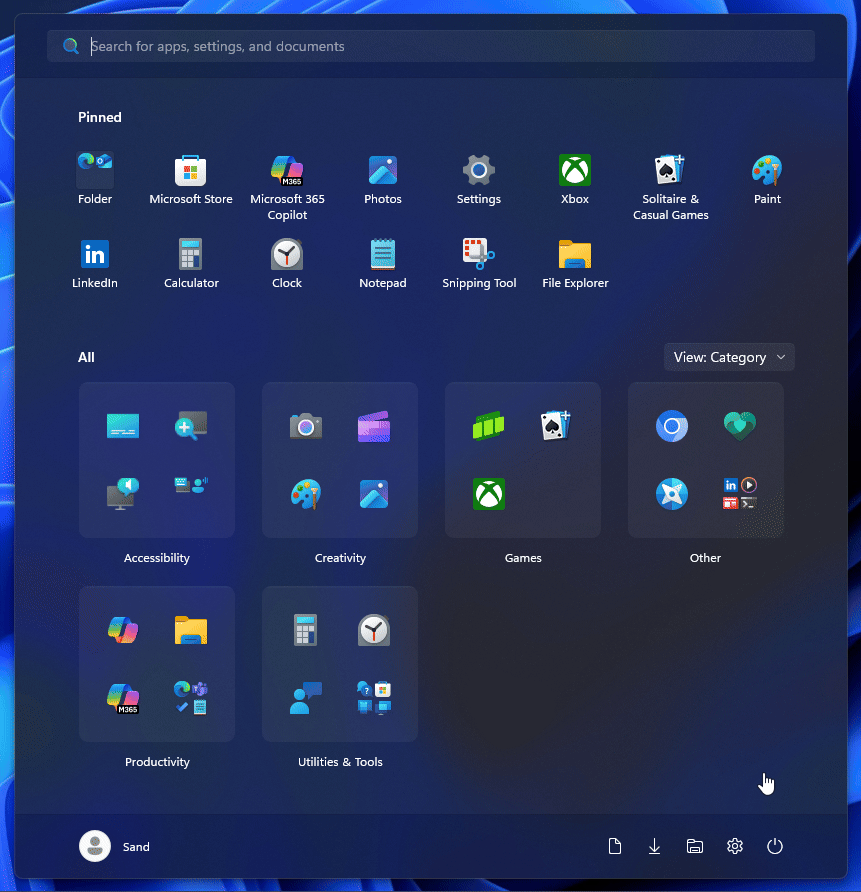

# Fluid theme for Windows 11 Start Menu Styler

This theme intends to subtly take Fluent's design principles more seriously and make them more consistent. Changes include:
* 3D-like borders on most elements.
* Background transitions on elements usually lacking them.
* Context menu slide-in animations.
* Scaling effect on buttons containing images, as seen in the Pinned list.
* Search box restyle.

**Author**: [SandTechStuff](https://github.com/SandTechStuff)



> [!IMPORTANT]
> This theme is designed for the [redesigned Windows 11 Start menu](https://microsoft.design/articles/start-fresh-redesigning-windows-start-menu/) that is gradually rolling out with the 25H2 update.

> [!NOTE]
> The default configuration is designed for Dark mode. If you want to use Light mode, add this to the "Style constants" section of the Start Menu Styler settings:

```
borderColor=<LinearGradientBrush x:Key="ShellTaskbarItemGradientStrokeColorSecondaryBrush" MappingMode="Absolute" StartPoint="0,0" EndPoint="0,3"><LinearGradientBrush.RelativeTransform><ScaleTransform ScaleY="-1" CenterY="0.5" /></LinearGradientBrush.RelativeTransform><LinearGradientBrush.GradientStops><GradientStop Offset="0.33" Color="#0F000000" /><GradientStop Offset="1" Color="#05000000" /></LinearGradientBrush.GradientStops></LinearGradientBrush>
```

## Theme selection

The theme is integrated into the mod and can be selected directly from the mod's
settings:

* Open the Windows 11 Start Menu Styler mod in Windhawk.
* Go to the "Settings" tab.
* Select the theme and save the settings.

## Manual installation

The theme styles can also be imported manually. To do that, follow these steps:

* Open the Windows 11 Start Menu Styler mod in Windhawk.
* Go to the "Settings" tab and select "Textual mode".
* Copy the content below to the text box and click "Save settings".

<details>
<summary>Content to import (click to expand)</summary>

```yaml
styleConstants:
  - borderColor=<LinearGradientBrush x:Key="ShellTaskbarItemGradientStrokeColorSecondaryBrush" MappingMode="Absolute" StartPoint="0,0" EndPoint="0,3"><LinearGradientBrush.GradientStops><GradientStop Offset="0.33" Color="#1AFFFFFF" /><GradientStop Offset="1" Color="#0FFFFFFF" /></LinearGradientBrush.GradientStops></LinearGradientBrush>
  - backgroundNormal=<SolidColorBrush Color="{ThemeResource ControlFillColorDefault}" />
  - backgroundHover=<SolidColorBrush Color="{ThemeResource ControlFillColorSecondary}" />
  - backgroundPressed=<SolidColorBrush Color="{ThemeResource ControlFillColorTertiary}" />
controlStyles:
  - target: Border#ContentBorder@CommonStates > Grid > Border#BackgroundBorder
    styles:
      - BorderThickness=2
      - BorderBrush@PointerOver:=$borderColor
      - BorderBrush@Pressed:=$borderColor
  - target: Button > Grid@CommonStates > Border#BackgroundBorder
    styles:
      - BorderThickness=2
      - BorderBrush@PointerOver:=$borderColor
      - BorderBrush@Pressed:=$borderColor
      - BackgroundSizing=InnerBorderEdge
  - target: StartMenu.CategoryControl > Grid > Border
    styles:
      - BorderThickness=2
      - BorderBrush:=$borderColor
      - BackgroundSizing=InnerBorderEdge
      - Background:=<SolidColorBrush Color="{ThemeResource ControlFillColorDefault}" />
      - Opacity=0.8
  - target: Grid#LayoutRoot
    styles:
      - BackgroundTransition:=<BrushTransition Duration="0:0:0.083" />
  - target: Border#BackgroundBorder
    styles:
      - BackgroundTransition:=<BrushTransition Duration="0:0:0.083" />
  - target: Button#Header > Border@CommonStates
    styles:
      - BorderThickness=2
      - BorderBrush@PointerOver:=$borderColor
      - BorderBrush@Pressed:=$borderColor
      - BackgroundSizing=InnerBorderEdge
  - target: ListViewItem > Grid@CommonStates > Border#BorderBackground
    styles:
      - BorderThickness=2
      - BorderBrush@PointerOver:=$borderColor
      - BorderBrush@Pressed:=$borderColor
      - BackgroundSizing=InnerBorderEdge
  - target: StartMenu.SearchBoxToggleButton > Grid@CommonStates > Border#BorderElement
    styles:
      - CornerRadius=4
      - BorderThickness=1
      - BorderBrush:=$borderColor
      - Background@Checked:=$backgroundNormal
      - Background@CheckedPointerOver:=$backgroundHover
      - Background@CheckedPressed:=$backgroundPressed
      - BackgroundTransition:=<BrushTransition Duration="0:0:0.083" />
  - target: Button#HideMoreSuggestionsButton > Grid@CommonStates > Border#BackgroundBorder
    styles:
      - Background@Normal:=$backgroundNormal
      - BorderBrush@Normal:=$borderColor
      - BorderBrush@PointerOver:=$borderColor
      - BorderBrush@Pressed:=$borderColor
      - Background@PointerOver:=$backgroundHover
      - Background@Pressed:=$backgroundPressed
      - BorderThickness=1
      - Margin=2
  - target: Button#ShowMoreSuggestionsButton > Grid@CommonStates > Border#BackgroundBorder
    styles:
      - Background@Normal:=$backgroundNormal
      - BorderBrush@Normal:=$borderColor
      - BorderBrush@PointerOver:=$borderColor
      - BorderBrush@Pressed:=$borderColor
      - Background@PointerOver:=$backgroundHover
      - Background@Pressed:=$backgroundPressed
      - BorderThickness=1
      - Margin=2
  - target: StartMenu.FolderModal > Grid#Root > Border
    styles:
      - BorderThickness=1
      - BorderBrush:=$borderColor
  - target: MenuFlyoutPresenter > Border
    styles:
      - BorderThickness=1
      - BorderBrush:=$borderColor
  - target: Border#ContentBorder@CommonStates > Grid#DroppedFlickerWorkaroundWrapper > ContentPresenter#ContentPresenter > ContentControl > Grid#RootGrid > Border#LogoBackgroundPlate > Image#AllAppsItemLogo
    styles:
      - RenderTransform@Pressed:=<ScaleTransform ScaleX="0.8" ScaleY="0.8" />
      - RenderTransformOrigin=0.5,0.5
  - target: StartDocked.NavigationPaneButton > Grid@CommonStates > Border#BackgroundBorder
    styles:
      - BorderThickness=1
      - BorderBrush@PointerOver:=$borderColor
      - BorderBrush@Pressed:=$borderColor
      - BackgroundSizing=InnerBorderEdge
  - target: StartDocked.AppListViewItem > Grid@CommonStates > Border#BackgroundBorder
    styles:
      - BorderThickness=1
      - BorderBrush@PointerOver:=$borderColor
      - BorderBrush@Pressed:=$borderColor
      - BackgroundSizing=InnerBorderEdge
  - target: Microsoft.UI.Xaml.Controls.DropDownButton > Grid@CommonStates
    styles:
      - Background@PointerOver:=$backgroundHover
      - Background@Pressed:=$backgroundPressed
      - BorderBrush@PointerOver:=$borderColor
      - BorderBrush@Pressed:=$borderColor
      - BackgroundSizing=InnerBorderEdge
      - Background@Normal:=$backgroundNormal
      - BorderBrush@Normal:=$borderColor
      - Padding=9,3,7,4
  - target: Border#ContentBorder@CommonStates > Grid#DroppedFlickerWorkaroundWrapper > ContentPresenter#ContentPresenter > ContentControl > Grid#RootGrid > Grid#LogoContainer > Image#AllAppsTileLogo
    styles:
      - RenderTransform@Pressed:=<ScaleTransform ScaleX="0.8" ScaleY="0.8" />
      - RenderTransformOrigin=0.5,0.5
  - target: Border#ContentBorder@CommonStates > Grid#DroppedFlickerWorkaroundWrapper > ContentPresenter > Grid > Grid#LogoContainer > Grid
    styles:
      - RenderTransform@Pressed:=<ScaleTransform ScaleX="0.8" ScaleY="0.8" />
      - RenderTransformOrigin=0.5,0.5
  - target: Grid#ContentBorder@CommonStates > Grid#DroppedFlickerWorkaroundWrapper > ContentPresenter > Grid > Grid#LogoContainer > Grid
    styles:
      - RenderTransform@Pressed:=<ScaleTransform ScaleX="0.8" ScaleY="0.8" />
      - RenderTransformOrigin=0.5,0.5
  - target: ScrollViewer#MenuFlyoutPresenterScrollViewer > Border > Grid > ScrollContentPresenter > ItemsPresenter > StackPanel
    styles:
      - ChildrenTransitions:=<TransitionCollection><EntranceThemeTransition IsStaggeringEnabled="False" FromHorizontalOffset="-25" FromVerticalOffset="0" /></TransitionCollection>
  - target: FlyoutPresenter > Border > ScrollViewer > Border > Grid > ScrollContentPresenter > ContentPresenter > Border
    styles:
      - BorderBrush:=$borderColor
      - BorderThickness=1
  - target: Button > ContentPresenter#ContentPresenter@CommonStates
    styles:
      - Background@PointerOver:=$backgroundHover
      - Background@Pressed:=$backgroundPressed
      - BorderBrush@PointerOver:=$borderColor
      - BorderBrush@Pressed:=$borderColor
      - BorderThickness=1
      - Background@Normal=Transparent
  - target: Grid@SearchBoxInputStates > Border#TaskbarSearchBackground
    styles:
      - CornerRadius=4
      - Background@ActiveInput:=$backgroundNormal
      - BorderBrush:=$borderColor
      - BorderThickness=1
      - Background@SearchBoxHover:=$backgroundHover
      - Background@NoFocus:=$backgroundNormal
      - BackgroundTransition:=<BrushTransition Duration="0:0:0.083" />
  - target: Border@CommonStates > Grid#DroppedFlickerWorkaroundWrapper > ContentPresenter > Grid > Grid#LogoContainer > Image
    styles:
      - RenderTransform@Pressed:=<ScaleTransform ScaleX="0.8" ScaleY="0.8" />
      - RenderTransformOrigin=0.5,0.5
  - target: Grid#ContentBorder@CommonStates > ContentPresenter > Grid > Grid#LogoContainer > Grid
    styles:
      - RenderTransform@Pressed:=<ScaleTransform ScaleX="0.8" ScaleY="0.8" />
      - RenderTransformOrigin=0.5,0.5
webContentStyles:
  - target: '*'
    styles:
      - 'transition: background-color 0.083s ease-in-out !important'
```
</details>
