# FlyoutStartMenu for Windows 11 Start Menu Styler

This theme is a part of **Reimagined 11 Themes** that redesigns the Start Menu into a Flyout style menu or a Fullscreen inspired Start Menu,
Here are some other UI tweaks that is in the theme:
* WinUI3 3D-like borders & Background transitions on elements usually lacking them, Inspired by the [Fluid Theme](https://github.com/ramensoftware/windows-11-start-menu-styling-guide/tree/main/Themes/Fluid).
* Context menu element staggerring animations.
* Search restyled to match WinUI3.

**Author**: [TheGamer1445891](https://github.com/TheGamer1445891)

**Dark Mode:**

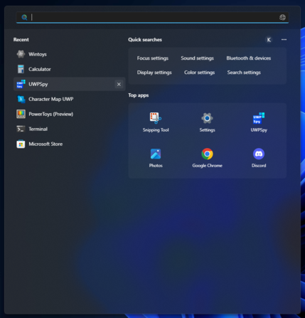 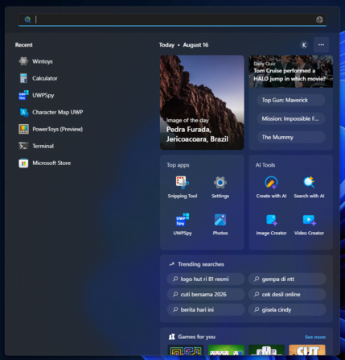
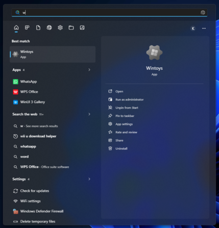 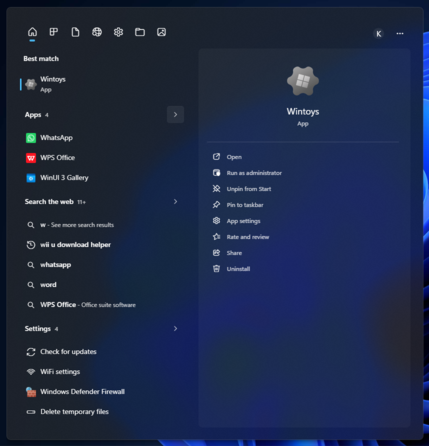
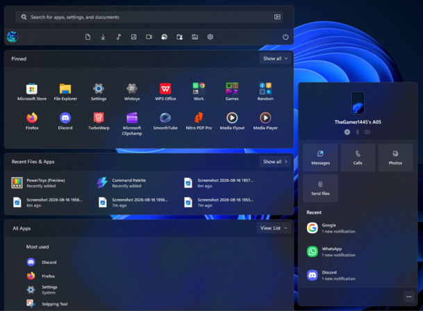 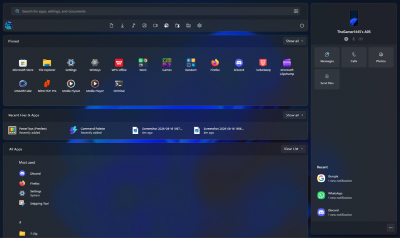
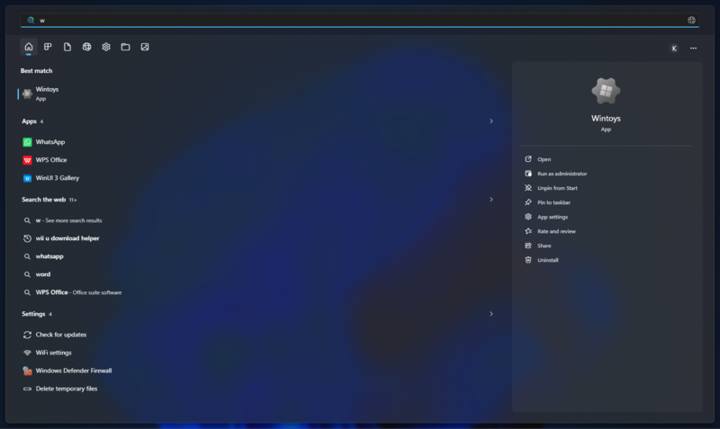

**Light Mode:**

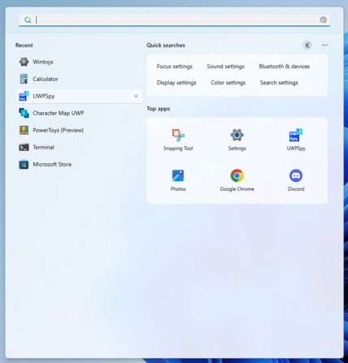 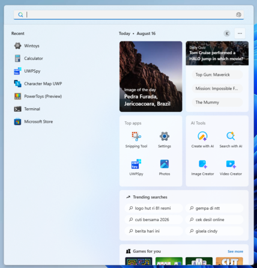
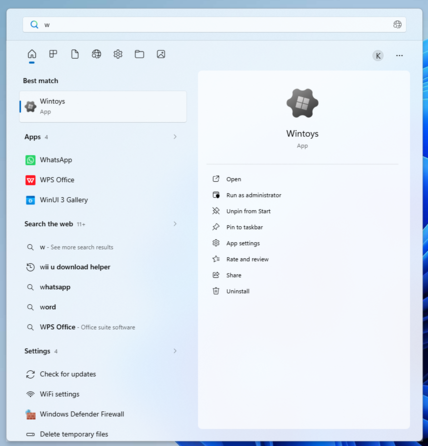 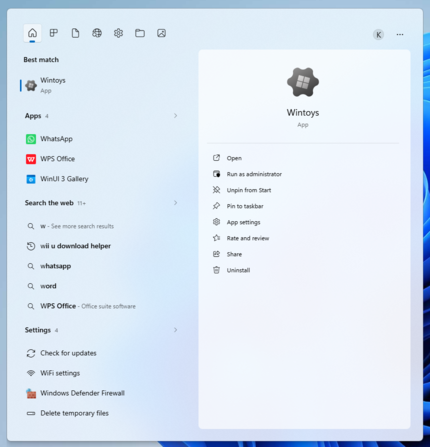
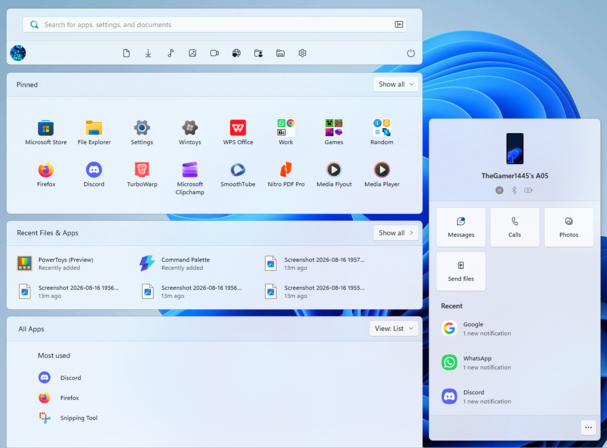 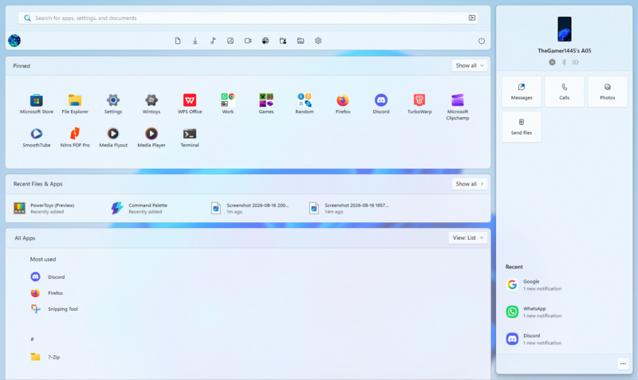
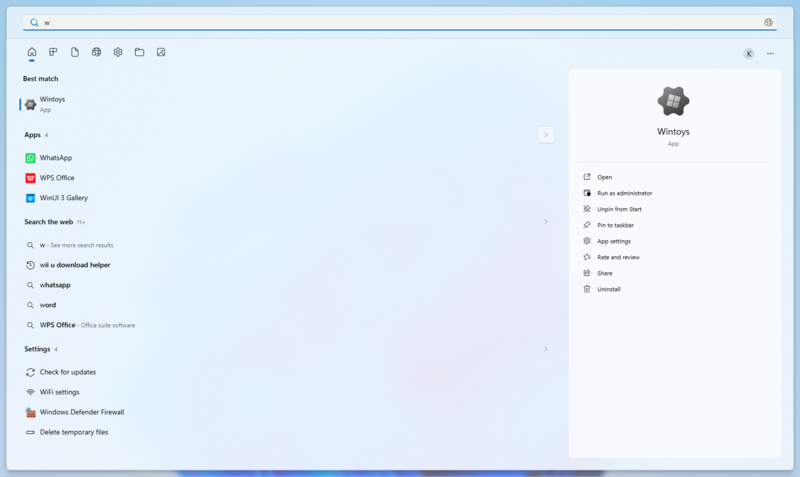

> [!IMPORTANT]
> This theme is designed for the [new Windows 11 Start menu](https://microsoft.design/articles/start-fresh-redesigning-windows-start-menu/) that is available on 24H2-25H2+.

> [!NOTE]
> If the Start Menu gets cutoff/Search Menu becomes broken after switching dark/light themes, restart the Start Menu/Search Menu process in Task Manager atleast 2-3 times.

## Additional Steps for Fullscreen Search Menu:

You need a mod called **Start Menu Size** to change the search menu height and width, and these are the configs:
<details>
<summary>Start Menu Size (Click to expand)</summary>

  ```yaml
  width: 0
  height: 0
  searchWidth: 9999
  searchHeight: 9999
  ```
</details>

## Theme selection

The theme is integrated into the mod and can be selected directly from the mod's
settings:

* Open the Windows 11 Start Menu Styler mod in Windhawk.
* Go to the "Settings" tab.
* Select the theme and save the settings.

## Manual installation

The theme styles can also be imported manually. To do that, follow these steps:

* Open the Windows 11 Start Menu Styler mod in Windhawk.
* Go to the "Settings" tab and select "Textual mode".
* Copy the content below to the text box and click "Save settings".

<details>
<summary>Content to import (click to expand)</summary>

```yaml
theme: ''
disableNewStartMenuLayout: ''
styleConstants:
  - // Backgrounds
  - NativeAcrylic1=<WindhawkBlur BlurAmount="20" TintColor="{ThemeResource SystemChromeAutoColor}"   TintOpacity="{ThemeResource NativeAcrylicOpacity}"   TintLuminosityOpacity="0.93"/>
  - NativeAcrylic2=<AcrylicBrush x:Key="AcrylicBackgroundFillColorBaseBrush"   TintColor="{ThemeResource SystemChromeAutoColor}"   TintOpacity="{ThemeResource NativeAcrylicOpacity}"   TintLuminosityOpacity="0.93"   FallbackColor="{ThemeResource SystemChromeMediumColor}"/>
  - NativeAcrylic3=<AcrylicBrush x:Key="AcrylicBackgroundFillColorBaseBrush"   TintColor="{ThemeResource SystemChromeAutoColor}"   TintOpacity="0"   TintLuminosityOpacity="0.93"   FallbackColor="{ThemeResource SystemChromeMediumColor}"/>
  - TaskbarBorderStroke=<AcrylicBrush x:Key="AcrylicBackgroundFillColorBaseBrush"   TintColor="#434343"   TintOpacity="0"   TintLuminosityOpacity="0.5"   FallbackColor="#AA434343"/>
  - TaskbarBorderStrokeAlt=<WindhawkBlur BlurAmount="20" TintColor="#FFFFFF"  TintOpacity="0.15"   TintLuminosityOpacity="0.5" />
  - FloatBorder=<SolidColorBrush Color="{ThemeResource SurfaceStrokeColorDefault}" />
  - // Buttons
  - ButtonBorder=<LinearGradientBrush x:Key="ShellTaskbarItemGradientStrokeColorSecondaryBrush" MappingMode="Absolute" StartPoint="0,0" EndPoint="0,3"><LinearGradientBrush.GradientStops><GradientStop Offset="0.33" Color="{ThemeResource ControlFillColorSecondary}" /><GradientStop Offset="1" Color="{ThemeResource ControlFillColorTertiary}" /></LinearGradientBrush.GradientStops></LinearGradientBrush>
  - ButtonBorderAlt=<LinearGradientBrush x:Key="ControlElevationBorderBrush" MappingMode="{ThemeResource GradientMappingMode}" StartPoint="0,0" EndPoint="0,3"><GradientStop Offset="{ThemeResource ButtonBorderStopOffset1}" Color="{ThemeResource ControlStrokeColorSecondary}" /><GradientStop Offset="{ThemeResource ButtonBorderStopOffset2}" Color="{ThemeResource ControlStrokeColorDefault}" /></LinearGradientBrush>
  - NormalBtn=<SolidColorBrush Color="{ThemeResource ControlFillColorDefault}" />
  - PointerOverBtn=<SolidColorBrush Color="{ThemeResource ControlFillColorSecondary}" />
  - PressedBtn=<SolidColorBrush Color="{ThemeResource ControlFillColorTertiary}" />
  - NormalBtnAlt=<SolidColorBrush Color="{ThemeResource ControlFillColorDefault}" Opacity="0.75" />
  - PointerOverBtnAlt=<SolidColorBrush Color="{ThemeResource ControlFillColorSecondary}" Opacity="0.75" />
  - PressedBtnAlt=<SolidColorBrush Color="{ThemeResource ControlFillColorTertiary}" Opacity="0.75" />
  - Chrome=<SolidColorBrush Color="{ThemeResource Chrome}" />
  - AccentColor1=<SolidColorBrush Color="{ThemeResource AccentColor1}" />
  - AccentColor2=<SolidColorBrush Color="{ThemeResource AccentColor2}" />
  - AccentColor3=<SolidColorBrush Color="{ThemeResource AccentColor3}" />
  - // Configs
  - EnableFullscreenStartMenu=0
controlStyles:
  - target: ':root > ScrollViewer > ScrollContentPresenter'
    styles:
      - Tag=$EnableFullscreenStartMenu
  - target: ScrollViewer#MenuFlyoutPresenterScrollViewer > Border > Grid > ScrollContentPresenter > ItemsPresenter > StackPanel
    styles:
      - ChildrenTransitions:=<TransitionCollection><EntranceThemeTransition IsStaggeringEnabled="True" FromHorizontalOffset="0" FromVerticalOffset="-50" /></TransitionCollection>
  - target: Cortana.UI.Views.CortanaRichSearchBox#SearchTextBox > Grid@CommonStates > Border#BorderElement
    styles:
      - CornerRadius=4,4,0,0
      - BorderThickness=1
      - Background@Focused:=$Chrome
      - BorderBrush:=transparent
      - BackgroundTransition:=<BrushTransition Duration="0:0:0.083" />
      - BackgroundSizing=InnerBorderEdge
  - target: Cortana.UI.Views.CortanaRichSearchBox#SearchTextBox
    styles:
      - Margin=0
      - Grid.Column=0
      - Grid.ColumnSpan=2
  - target: Cortana.UI.Views.CortanaRichSearchBox#SearchTextBox > Grid@CommonStates
    styles:
      - CornerRadius=2
      - BorderBrush:=<SolidColorBrush Color="{ThemeResource SystemChromeAutoOverlayColor}" />
      - BorderBrush@Focused:=$AccentColor1
      - BorderThickness=0
      - BorderThickness@Focused=0,0,0,2
      - Padding@Focused=0,0,0,-2
  - target: Cortana.UI.Views.RichSearchBoxControl#SearchBoxControl > Grid#RootGrid
    styles:
      - CornerRadius=4
  - target: Cortana.UI.Views.RichSearchBoxControl#SearchBoxControl > Grid#RootGrid > Grid#UnderlineContainer
    styles:
      - Visibility=1
      - CornerRadius=4
      - Margin=0
      - Canvas.ZIndex=99
      - Opacity=1
  - target: Cortana.UI.Views.RichSearchBoxControl#SearchBoxControl > Grid#RootGrid > Grid#UnderlineContainer > Border#GradientUnderlineBorder
    styles:
      - Canvas.ZIndex=99
  - target: Cortana.UI.Views.TaskbarSearchPage > Grid#RootGrid@SearchBoxLocationStates > Border#TaskbarSearchBackground
    styles:
      - CornerRadius=4
      - BorderBrush:=$ButtonBorderAlt
      - Visibility@SearchBoxOnBottomWithoutQFMargin=1
  - target: Cortana.UI.Views.TaskbarSearchPage > Grid#RootGrid > Grid#OuterBorderGrid > Grid#BorderGrid > Border#LayerBorder
    styles:
      - Margin=0,64,0,0
      - CornerRadius=0
      - BorderThickness=0,1,0,0
      - BorderBrush:=#19000000
      - Visibility=0
  - target: Cortana.UI.Views.TaskbarSearchPage > Grid#RootGrid@SearchBoxLocationStates > Grid#OuterBorderGrid > Grid#BorderGrid > Border#LayerBorder
    styles:
      - Visibility@SearchBoxOnBottomWithoutQFMargin=1
  - target: Border#dropshadow
    styles:
      - Canvas.ZIndex=-99
      - Visibility=0
  - target: StartMenu.StartBlendedFlexFrame > Grid#FrameRoot > Grid#AnimationRoot > Grid#RightCompanionContainerGrid
    styles:
      - Visibility=>PhoneLinkPaneVisibility
      - Padding=7,0,0,25
      - Width=356
      - 'Height={{$EnableFullscreenStartMenu == 1 ? `Auto` : 670 }}'
      - VerticalAlignment={{$EnableFullscreenStartMenu + 2}}
  - target: Border#RightCompanionDropShadow
    styles:
      - Visibility=0
  - target: Border#RightCompanionDropShadowDismissTarget
    styles:
      - Visibility=1
  - target: Grid#LeftCompanionContainerGrid
    styles:
      - Visibility=1
      - HorizontalAlignment=3
      - VerticalAlignment=3
      - Width=Auto
      - Height=Auto
      - Background:=$NativeAcrylic2
      - BorderBrush:=$FloatBorder
      - BorderThickness=1
      - CornerRadius=8
      - Grid.Column=1
      - Grid.ColumnSpan=12
  - target: StartMenu.StartBlendedFlexFrame
    styles:
      - ActualWidth=>ScreenWidth
      - ActualHeight=>ScreenHeight
  - target: StartMenu.StartBlendedFlexFrame
    styles:
      - IsTaskbarCenteredProperty=>StartMenuCenter
  - target: ':root > ScrollViewer > ScrollContentPresenter[Tag=1] > Border > StartMenu.StartBlendedFlexFrame'
    styles:
      - IsTaskbarCenteredProperty=False
  - target: StartMenu.StartBlendedFlexFrame > Grid#FrameRoot
    styles:
      - Padding=12,{{$EnableFullscreenStartMenu * 12}},12,0
      - Margin=0,0,0,-12
  - target: ':root > ScrollViewer > ScrollContentPresenter[Tag=1] > Border > StartMenu.StartBlendedFlexFrame > Grid#FrameRoot'
    styles:
      - MaxHeight=Infinity
      - HorizontalAlignment=3
  - target: ':root > ScrollViewer > ScrollContentPresenter[Tag=1] > Border > StartMenu.StartBlendedFlexFrame > Grid#FrameRoot > Grid#AnimationRoot'
    styles:
      - HorizontalAlignment=3
      - Width=Auto
      - Padding=0,0,0,0
      - //ColumnDefinitions:=<ColumnDefinitionCollection><ColumnDefinition Width="Auto"/><ColumnDefinition Width="Auto"/><ColumnDefinition Width="Auto"/><ColumnDefinition Width="Auto"/></ColumnDefinitionCollection>
  - target: ':root > ScrollViewer > ScrollContentPresenter[Tag=1] > Border > StartMenu.StartBlendedFlexFrame > Grid#FrameRoot > Grid#AnimationRoot > Grid#MainMenu'
    styles:
      - HorizontalAlignment=3
      - Width=Auto
      - MaxWidth={{ScreenWidth - 24 - (RightCompanionWidth * ((RightCompanionVisibility - 1) * -1))}}
  - target: Windows.UI.Xaml.Controls.Primitives.ToggleButton#ShowHideCompanion > Border@CommonStates > ContentPresenter#ContentPresenter > FontIcon > Grid > TextBlock
    styles:
      - Tag={{PhoneLinkPaneVisibility}}
      - Text=
      - Text@Checked=
      - Text@CheckedPointerOver=
      - Text@CheckedPressed=
      - Text@CheckedDisabled=
      - VerticalAlignment=Center
      - HorizontalAlignment=Center
  - target: Windows.UI.Xaml.Controls.Primitives.ToggleButton#ShowHideCompanion > Border@CommonStates > ContentPresenter#ContentPresenter
    styles:
      - VerticalAlignment=3
      - HorizontalAlignment=3
      - Height=Auto
      - Width=Auto
      - Background:=$NormalBtn
      - Background@PointerOver:=$PointerOverBtn
      - Background@Pressed:=$PressedBtn
      - Background@Checked:=$NormalBtn
      - Background@CheckedPointerOver:=$PointerOverBtn
      - Background@CheckedPressed:=$PressedBtn
      - BorderBrush:=$ButtonBorderAlt
      - BorderThickness=0,1,1,1
      - BackgroundTransition:=<BrushTransition Duration="0:0:0.083" />
      - BackgroundSizing=InnerBorderEdge
      - CornerRadius=0,4,4,0
  - target: StartMenu.StartBlendedFlexFrame > Grid#FrameRoot > Grid#AnimationRoot > Grid#MainMenu > Grid#MainContent > Grid > Windows.UI.Xaml.Controls.Primitives.ToggleButton#ShowHideCompanion
    styles:
      - Visibility=>PhoneLinkButtonVisibility
      - Margin=0,0,{{3 * ((PhoneLinkButtonVisibility - 1) * -1)}},0
  - target: StartMenu.StartBlendedFlexFrame > Grid#FrameRoot > Grid#AnimationRoot > Grid#MainMenu > Grid#MainContent > Grid > StartMenu.SearchBoxToggleButton#SearchBoxToggleButton
    styles:
      - Margin=0,0,{{4 * PhoneLinkButtonVisibility}},0
  - target: StartMenu.StartBlendedFlexFrame > Grid#FrameRoot > Grid#AnimationRoot > Grid#MainMenu > Grid#MainContent > Grid[1]
    styles:
      - Margin=45,1,41,-1
  - target: StartMenu.SearchBoxToggleButton#SearchBoxToggleButton > Grid@CommonStates > Border#BorderElement
    styles:
      - Opacity=1
      - CornerRadius=4,{{4 * PhoneLinkButtonVisibility}},{{4 * PhoneLinkButtonVisibility}},4
      - // Background
      - Background@Normal:=$NormalBtn
      - Background@PointerOver:=$PointerOverBtn
      - Background@Pressed:=$PressedBtn
      - Background@Disabled:=$NormalBtn
      - Opacity@Disabed=0.6
      - Background@Checked:=$NormalBtn
      - Background@CheckedPointerOver:=$PointerOverBtn
      - Background@CheckedPressed:=$PressedBtn
      - Background@CheckedDisabled:=$NormalBtn
      - Opacity@CheckedDisabed=0.6
      - // Border
      - BorderBrush@Normal:=$ButtonBorderAlt
      - BorderBrush@PointerOver:=$ButtonBorderAlt
      - BorderBrush@Pressed:=$ButtonBorderAlt
      - BorderBrush@Disabled:=$ButtonBorderAlt
      - BorderBrush@Checked:=$ButtonBorderAlt
      - BorderBrush@CheckedPointerOver:=$ButtonBorderAlt
      - BorderBrush@CheckedPressed:=$ButtonBorderAlt
      - BorderBrush@CheckedDisabled:=$ButtonBorderAlt
      - BorderThickness=1,1,{{PhoneLinkButtonVisibility}},1
  - target: Rectangle#TextCaret
    styles:
      - Visibility=1
  - target: MenuFlyoutPresenter > Border
    styles:
      - BorderBrush:=$TaskbarBorderStroke
      - BorderThickness=1
  - target: //Windows.UI.Xaml.Controls.ToolTip > Windows.UI.Xaml.Controls.ContentPresenter#LayoutRoot
    styles:
      - //Background:=$NativeAcrylic1
      - //CornerRadius=8
      - BorderBrush=$TaskbarBorderStrokeAlt
      - BorderThickness=1
  - target: StartMenu.StartBlendedFlexFrame > Grid#FrameRoot > Grid#AnimationRoot > Grid#MainMenu > Border#AcrylicBorder
    styles:
      - VerticalAlignment=Top
      - Height=114
      - CornerRadius=8,8,8,8
      - BorderBrush:=$FloatBorder
      - BorderThickness=1,1,1,1
  - target: Border#AcrylicOverlay
    styles:
      - Visibility=0
      - Canvas.ZIndex=-1
      - BorderThickness=0,1,0,0
      - CornerRadius=0,0,8,8
      - Margin=13,1,13,-1
      - Height=48
      - VerticalAlignment=Top
  - target: Border#StartDropShadow
    styles:
      - VerticalAlignment=Top
      - Height=114
      - Visibility=1
      - Margin=0,0,0,1
  - target: //StartMenu.SearchBoxToggleButton#SearchBoxToggleButton > Grid > ContentPresenter#ContentPresenter > TextBlock#PlaceholderText
    styles:
      - Text=Welcome back, {{Username}}
  - target: GridViewItem > Border#ContentBorder@CommonStates > Grid#DroppedFlickerWorkaroundWrapper > Border#BackgroundBorder
    styles:
      - Margin=0,0
      - BorderThickness=1
      - Style@PointerOver:=<Style TargetType="Border"><Setter Property="BorderBrush" Value="{ThemeResource ControlElevationBorderBrush}"/></Style>
      - Style@Pressed:=<Style TargetType="Border"><Setter Property="BorderBrush" Value="{ThemeResource ControlElevationBorderBrush}"/></Style>
      - BackgroundTransition:=<BrushTransition Duration="0:0:0.083" />
      - BackgroundSizing=InnerBorderEdge
  - target: Button#Header
    styles:
      - Margin=0,0,26,0
  - target: Button#Header > Border#Border@CommonStates
    styles:
      - BorderThickness=1
      - BorderBrush@PointerOver:=$ButtonBorderAlt
      - BorderBrush@Pressed:=$ButtonBorderAlt
      - BackgroundTransition:=<BrushTransition Duration="0:0:0.083" />
      - BackgroundSizing=InnerBorderEdge
      - Opacity=1
  - target: StartMenu.PinnedList#StartMenuPinnedList > Grid#Root > GridView#PinnedList > Border > ScrollViewer#ScrollViewer > Border#Root > Grid > ScrollContentPresenter#ScrollContentPresenter > ItemsPresenter > ItemsWrapGrid > GridViewItem > Border#ContentBorder > Grid#DroppedFlickerWorkaroundWrapper > Border#BackgroundBorder
    styles:
      - Margin=0,0
  - target: StartMenu.StartHome > Grid#PageRoot > SemanticZoom#TopLevelRoot > Grid > ScrollViewer#ScrollViewer > ScrollContentPresenter#ScrollContentPresenter > Grid > ContentPresenter#ZoomedInPresenter > GridView#AllAppsGrid > Border > ScrollViewer#ScrollViewer > Border#Root > Grid > ScrollContentPresenter#ScrollContentPresenter > ItemsPresenter > ContentControl > ContentPresenter > Grid#TopLevelHeader > Grid
    styles:
      - Canvas.ZIndex=-99
      - Background:=$NativeAcrylic2
      - BorderBrush:=$FloatBorder
      - BorderThickness=1
      - CornerRadius=4
  - target: StartMenu.StartHome > Grid#PageRoot > SemanticZoom#TopLevelRoot > Grid > ScrollViewer#ScrollViewer > ScrollContentPresenter#ScrollContentPresenter > Grid > ContentPresenter#ZoomedInPresenter > GridView#AllAppsGrid > Border > ScrollViewer#ScrollViewer > Border#Root > Grid > ScrollContentPresenter#ScrollContentPresenter > ItemsPresenter > ContentControl > ContentPresenter > Grid#TopLevelHeader > Grid#TopLevelSuggestionsRoot
    styles:
      - Padding=-50,-15,-1,8
      - Margin=0,0,0,0
      - CornerRadius=8,8,8,8
  - target: StartMenu.StartHome > Grid#PageRoot > SemanticZoom#TopLevelRoot > Grid > ScrollViewer#ScrollViewer > ScrollContentPresenter#ScrollContentPresenter > Grid > ContentPresenter#ZoomedInPresenter > GridView#AllAppsGrid > Border > ScrollViewer#ScrollViewer > Border#Root > Grid > ScrollContentPresenter#ScrollContentPresenter > ItemsPresenter > ContentControl > ContentPresenter > Grid#TopLevelHeader > Grid#TopLevelSuggestionsRoot > Grid#TopLevelSuggestionsContainerParent > Grid#TopLevelSuggestionsContainer > Border#TopLevelSuggestionsBackground
    styles:
      - Margin=0,0,0,-16
      - Background:=<SolidColorBrush Color="{ThemeResource SystemChromeAutoOverlayColor}" />
      - BorderBrush:=#19000000
      - BorderThickness=0,1,0,0
      - CornerRadius=0,0,0,0
  - target: StartMenu.StartHome > Grid#PageRoot > SemanticZoom#TopLevelRoot > Grid > ScrollViewer#ScrollViewer > ScrollContentPresenter#ScrollContentPresenter > Grid > ContentPresenter#ZoomedInPresenter > GridView#AllAppsGrid > Border > ScrollViewer#ScrollViewer > Border#Root > Grid > ScrollContentPresenter#ScrollContentPresenter > ItemsPresenter > ContentControl > ContentPresenter > Grid#TopLevelHeader > Grid#TopLevelSuggestionsRoot > Grid#TopLevelSuggestionsContainerParent > Grid#TopLevelSuggestionsContainer > ContentControl
    styles:
      - Margin=0,0,0,0
      - Padding=8,8,0,-8
  - target: StartMenu.StartHome > Grid#PageRoot > SemanticZoom#TopLevelRoot > Grid > ScrollViewer#ScrollViewer > ScrollContentPresenter#ScrollContentPresenter > Grid > ContentPresenter#ZoomedInPresenter > GridView#AllAppsGrid > Border > ScrollViewer#ScrollViewer > Border#Root > Grid > ScrollContentPresenter#ScrollContentPresenter > ItemsPresenter > ContentControl > ContentPresenter > Grid#TopLevelHeader > Grid#TopLevelSuggestionsRoot > Grid#TopLevelSuggestionsContainerParent > Grid#TopLevelSuggestionsContainer
    styles:
      - Margin=50,0,0,0
  - target: GridView#RecommendedList > Border > ScrollViewer#ScrollViewer > Border#Root > Grid > ScrollContentPresenter#ScrollContentPresenter > ItemsPresenter > ItemsWrapGrid > GridViewItem
    styles:
      - MinWidth=230
      - MaxWidth=230
  - target: StartMenu.StartHome > Grid#PageRoot > SemanticZoom#TopLevelRoot > Grid > ScrollViewer#ScrollViewer > ScrollContentPresenter#ScrollContentPresenter > Grid > ContentPresenter#ZoomedInPresenter > GridView#AllAppsGrid > Border > ScrollViewer#ScrollViewer > Border#Root > Grid > ScrollContentPresenter#ScrollContentPresenter > ItemsPresenter > ContentControl > ContentPresenter > Grid#TopLevelHeader > Grid[1]
    styles:
      - Margin=0,14,0,12
      - CornerRadius=8,8,8,8
      - BorderThickness=1,1,1,1
      - Grid.ColumnSpan=2
      - Grid.RowSpan=2
      - ActualHeight=>PinnedListHeaderHeight
  - target: StartMenu.StartHome > Grid#PageRoot > SemanticZoom#TopLevelRoot > Grid > ScrollViewer#ScrollViewer > ScrollContentPresenter#ScrollContentPresenter > Grid > ContentPresenter#ZoomedInPresenter > GridView#AllAppsGrid > Border > ScrollViewer#ScrollViewer > Border#Root > Grid > ScrollContentPresenter#ScrollContentPresenter > ItemsPresenter > ContentControl > ContentPresenter > Grid#TopLevelHeader > Grid[1] > TextBlock#PinnedListHeaderText
    styles:
      - Margin=12,14,12,15
      - FontWeight=Normal
  - target: StartMenu.StartHome > Grid#PageRoot > SemanticZoom#TopLevelRoot > Grid > ScrollViewer#ScrollViewer > ScrollContentPresenter#ScrollContentPresenter > Grid > ContentPresenter#ZoomedInPresenter > GridView#AllAppsGrid > Border > ScrollViewer#ScrollViewer > Border#Root > Grid > ScrollContentPresenter#ScrollContentPresenter > ItemsPresenter > ContentControl > ContentPresenter > Grid#TopLevelHeader > Grid[2]
    styles:
      - Visibility=0
      - Margin=0,14,0,0
      - CornerRadius=0
      - BorderThickness=0
      - Background:=transparent
      - BorderBrush:=transparent
  - target: StartMenu.StartHome > Grid#PageRoot > SemanticZoom#TopLevelRoot > Grid > ScrollViewer#ScrollViewer > ScrollContentPresenter#ScrollContentPresenter > Grid > ContentPresenter#ZoomedInPresenter > GridView#AllAppsGrid > Border > ScrollViewer#ScrollViewer > Border#Root > Grid > ScrollContentPresenter#ScrollContentPresenter > ItemsPresenter > ContentControl > ContentPresenter > Grid#TopLevelHeader > Grid[2] > Button
    styles:
      - Margin=8,8,8,8
  - target: Grid#MainMenu > Grid#MainContent
    styles:
      - Margin=0
      - Padding=0
  - target: Grid#MainMenu
    styles:
      - Margin=0
      - Padding=0
      - Grid.ColumnSpan=0
      - ActualWidth=>StartMenuWidth
      - ActualHeight=>StartMenuHeight
  - target: Grid#MainMenu > Grid#MainContent > Grid#NavPanePlaceholder
    styles:
      - Width=Auto
      - HorizontalAlignment=3
      - Canvas.ZIndex=99
      - BorderBrush:=$FloatBorder
      - Padding=4
      - Height=Auto
      - VerticalAlignment=Bottom
      - Margin=12,50,12,-50
      - Grid.Row=0
  - target: Grid#MainMenu > Grid#MainContent > Grid#NavPanePlaceholder > StartDocked.NavigationPaneView#UserControl
    styles:
      - //FlowDirection=1
  - target: StartMenu.StartHome > Grid#PageRoot > Grid#MoreSuggestionsRoot
    styles:
      - Canvas.ZIndex=-99
      - Background:=$NativeAcrylic2
      - BorderBrush:=$FloatBorder
      - BorderThickness=1,1,1,1
      - CornerRadius=8,8,8,8
      - Margin=12,65,12,-40
      - Padding=0,-14,0,0
      - VerticalAlignment=3
      - Height=Auto
  - target: StartMenu.StartHome > Grid#PageRoot > Grid#MoreSuggestionsRoot > Grid#MoreSuggestionsContainer > Border#MoreSuggestionsBackground
    styles:
      - Background:=<SolidColorBrush Color="{ThemeResource SystemChromeAutoOverlayColor}" />
      - BorderBrush:=#19000000
      - BorderThickness=0,1,0,0
      - CornerRadius=0,0,0,0
  - target: StartMenu.StartHome > Grid#PageRoot > Grid#MoreSuggestionsRoot > Grid > TextBlock#MoreSuggestionsListHeaderText
    styles:
      - Margin=22,6,12,7
      - FontWeight=Normal
      - Text=Recent Files & Apps
  - target: StartMenu.StartHome > Grid#PageRoot > Grid#MoreSuggestionsRoot > Button#HideMoreSuggestionsButton
    styles:
      - Margin=0,23,8,0
  - target: StartMenu.PinnedList#StartMenuPinnedList > Grid#Root
    styles:
      - Margin=1,0,1,-67
      - Padding=31,32,-9,31
      - Canvas.ZIndex=-99
      - Background:=<SolidColorBrush Color="{ThemeResource SystemChromeAutoOverlayColor}" />
      - BorderBrush:=#19000000
      - BorderThickness=0,1,0,0
      - CornerRadius=0,0,8,8
  - target: StartMenu.PinnedList#StartMenuPinnedList
    styles:
      - Margin=0,0,0,80
  - target: StartMenu.StartHome > Grid#PageRoot > SemanticZoom#TopLevelRoot > Grid > ScrollViewer#ScrollViewer > ScrollContentPresenter#ScrollContentPresenter > Grid > ContentPresenter#ZoomedInPresenter > GridView#AllAppsGrid > Border > ScrollViewer#ScrollViewer > Border#Root > Grid > ScrollContentPresenter#ScrollContentPresenter > ItemsPresenter > ContentControl > ContentPresenter > Grid#TopLevelHeader > Grid#TopLevelSuggestionsRoot > Grid#ShowMoreSuggestions > Button#ShowMoreSuggestionsButton
    styles:
      - Margin=0,0,8,0
  - target: GridView#RecommendedList > Border > ScrollViewer#ScrollViewer > Border#Root > Grid > ScrollContentPresenter#ScrollContentPresenter > ItemsPresenter > ItemsWrapGrid > GridViewItem
    styles:
      - Margin=0,0,16,0
  - target: ListView#RecommendedList
    styles:
      - Margin=0,0,0,0
      - HorizontalAlignment=1
  - target: ListView#RecommendedList > Border > ScrollViewer#ScrollViewer > Border#Root > Grid > ScrollContentPresenter#ScrollContentPresenter > ItemsPresenter > ItemsStackPanel
    styles:
      - Margin=0,1,0,0
      - Width=Auto
      - HorizontalAlignment=3
  - target: ListView#RecommendedList > Border > ScrollViewer#ScrollViewer > Border#Root > Grid > ScrollContentPresenter#ScrollContentPresenter > ItemsPresenter > ItemsStackPanel > ListViewItem
    styles:
      - Margin=0,8,0,0
      - Width=10
      - HorizontalAlignment=1
  - target: ListView#RecommendedList > Border > ScrollViewer#ScrollViewer > Border#Root > Grid > ScrollContentPresenter#ScrollContentPresenter > ItemsPresenter > ItemsStackPanel > ListViewItem > Grid#ContentBorder@CommonStates > Border#BorderBackground
    styles:
      - BorderThickness=1
      - Background:=transparent
      - Background@PointerOver:=$NormalBtn
      - Background@Pressed:=$PressedBtn
      - BorderBrush:=transparent
      - BorderBrush@PointerOver:=$ButtonBorderAlt
      - BorderBrush@Pressed:=$ButtonBorderAlt
      - BackgroundTransition:=<BrushTransition Duration="0:0:0.083" />
      - BackgroundSizing=InnerBorderEdge
  - target: Grid@CommonStates > Border#BorderBackground
    styles:
      - BorderThickness=1
      - Style@PointerOver:=<Style TargetType="Border"><Setter Property="BorderBrush" Value="{ThemeResource ControlElevationBorderBrush}"/></Style>
      - Style@Pressed:=<Style TargetType="Border"><Setter Property="BorderBrush" Value="{ThemeResource ControlFillColorTertiary}"/></Style>
      - BackgroundTransition:=<BrushTransition Duration="0:0:0.083" />
      - BackgroundSizing=InnerBorderEdge
  - target: StartDocked.UserTileView#UserTile
    styles:
      - Width=40
      - Margin=0
      - Padding=0
      - ActualWidth=>UserTileWidth
      - HorizontalAlignment=Left
  - target: Grid#UserTileIcon > Windows.UI.Xaml.Shapes.Ellipse
    styles:
      - Visibility=0
  - target: Grid#UserTileIcon
    styles:
      - Visibility=0
      - Grid.Column=0
  - target: TextBlock#UserTileNameText
    styles:
      - Grid.Column=0
      - Visibility=1
      - Margin=0,0,0,0
      - FontSize=16
      - FontFamily=Segoe Fluent Icons
      - //Text=
      - Text=>Username
      - Width=32
      - HorizontalAlignment=Center
      - TextAlignment=Center
  - target: StartDocked.NavigationPaneButton#UserTileButton
    styles:
      - Padding=3,0,3,0
  - target: StartMenu.StartHome > Grid#PageRoot > SemanticZoom#TopLevelRoot > Grid > ScrollViewer#ScrollViewer > ScrollContentPresenter#ScrollContentPresenter
    styles:
      - Padding=0,0,0,63
      - Margin=0,50,0,-63
  - target: Grid#RightCompanionContainerGrid > StartMenu.StartMenuCompanion#RightCompanion > Grid#CompanionRoot > Grid#MainContent > Border#AcrylicOverlay
    styles:
      - Margin=0,164,0,0
      - BorderThickness=0,1
      - CornerRadius=0
      - Visibility=0
      - Height=Auto
      - VerticalAlignment=3
  - target: Grid#RightCompanionContainerGrid
    styles:
      - ActualWidth=>RightCompanionWidth
      - Visibility=>RightCompanionVisibility
  - target: Grid#NavPanePlaceholder > StartDocked.NavigationPaneView#UserControl > Grid#RootPanel > StackPanel[Tag=WH_SMB_Container] > Button
    styles:
      - Margin=0,0,0,0
  - target: StartDocked.AppListView#NavigationPanePlacesListView > Border > ScrollViewer#ScrollViewer > Border#Root > Grid > ScrollContentPresenter#ScrollContentPresenter > ItemsPresenter > ItemsStackPanel > ListViewItem
    styles:
      - Margin=0,0,4,0
  - target: StartDocked.AppListView#NavigationPanePlacesListView > Border > ScrollViewer#ScrollViewer > Border#Root > Grid > ScrollContentPresenter#ScrollContentPresenter > ItemsPresenter > ItemsStackPanel
    styles:
      - HorizontalAlignment=1
      - Width=Auto
      - GroupPadding=0,0,-4,0
  - target: StartDocked.AppListView#NavigationPanePlacesListView > Border > ScrollViewer#ScrollViewer > Border#Root > Grid > ScrollContentPresenter#ScrollContentPresenter > ItemsPresenter
    styles:
      - HorizontalAlignment=1
      - Width=Auto
  - target: StartDocked.AppListView#NavigationPanePlacesListView > Border > ScrollViewer#ScrollViewer > Border#Root > Grid > ScrollContentPresenter#ScrollContentPresenter
    styles:
      - HorizontalAlignment=1
      - Width=Auto
  - target: StartDocked.AppListView#NavigationPanePlacesListView > Border > ScrollViewer#ScrollViewer > Border#Root > Grid
    styles:
      - HorizontalAlignment=1
      - Width=Auto
  - target: StartDocked.AppListView#NavigationPanePlacesListView > Border > ScrollViewer#ScrollViewer > Border#Root
    styles:
      - HorizontalAlignment=1
      - Width=Auto
  - target: StartDocked.AppListView#NavigationPanePlacesListView > Border > ScrollViewer#ScrollViewer
    styles:
      - HorizontalAlignment=1
      - Width=Auto
      - ExtentHeight=Infinity
      - ViewportHeight=Infinity
      - ExtentWidth=Infinity
      - ViewportWidth=Infinity
  - target: StartDocked.AppListView#NavigationPanePlacesListView > Border
    styles:
      - HorizontalAlignment=1
      - Width=Auto
  - target: StartDocked.PowerOptionsView#PowerButton > StartDocked.NavigationPaneButton#PowerButton
    styles:
      - Margin=0,0,0,0
  - target: StartDocked.PowerOptionsView#PowerButton
    styles:
      - Visibility=0
  - target: StartDocked.NavigationPaneButton > Grid@CommonStates > Border#BackgroundBorder
    styles:
      - BorderBrush:=$ButtonBorderAlt
      - BorderBrush@Normal:=transparent
      - BorderThickness=1
      - Background:=transparent
      - Background@PointerOver:=$NormalBtn
      - Background@Pressed:=$PressedBtn
      - BackgroundTransition:=<BrushTransition Duration="0:0:0.083" />
      - BackgroundSizing=InnerBorderEdge
      - Opacity=1
  - target: Grid#ContentBorder@CommonStates > Border#BackgroundBorder
    styles:
      - BorderBrush:=$ButtonBorderAlt
      - BorderBrush@Normal:=transparent
      - BorderThickness=1
      - Background:=transparent
      - Background@PointerOver:=$NormalBtn
      - Background@Pressed:=$PressedBtn
      - BackgroundTransition:=<BrushTransition Duration="0:0:0.083" />
      - BackgroundSizing=InnerBorderEdge
      - Opacity=1
  - target: Button > ContentPresenter@CommonStates
    styles:
      - BorderBrush:=$ButtonBorderAlt
      - BorderBrush@Normal:=transparent
      - BorderThickness=1
      - Background:=transparent
      - Background@PointerOver:=$NormalBtn
      - Background@Pressed:=$PressedBtn
      - BackgroundTransition:=<BrushTransition Duration="0:0:0.083" />
      - BackgroundSizing=InnerBorderEdge
      - Opacity=1
  - target: Button > Grid@CommonStates > Border#BackgroundBorder
    styles:
      - Background:=$NormalBtn
      - Background@PointerOver:=$PointerOverBtn
      - Background@Pressed:=$PressedBtn
      - BorderBrush:=$ButtonBorderAlt
      - BorderThickness=1
      - BackgroundTransition:=<BrushTransition Duration="0:0:0.083" />
      - BackgroundSizing=InnerBorderEdge
      - Opacity=1
  - target: StartMenu.StartMenuCompanion#RightCompanion > Grid#CompanionRoot > Grid#MainContent > Grid#ActionsBar > Button
    styles:
      - Margin=12,0,0,0
  - target: StartMenu.StartMenuCompanion#RightCompanion > Grid#CompanionRoot > Grid#MainContent > Grid#ActionsBar
    styles:
      - Padding=12,0
  - target: StartMenu.FolderModal#StartFolderModal > Grid#Root > Border
    styles:
      - Background:=$NativeAcrylic3
      - BorderBrush:=$TaskbarBorderStroke
      - BorderThickness=1
      - CornerRadius=8
  - target: StartMenu.FolderModal#StartFolderModal > Grid#Root > ContentControl#ContentControl > ContentPresenter > StartMenu.UniversalTileContainer#UniversalTileContainer > Grid#GridViewContainer > Grid[2]
    styles:
      - Margin=28,0,0,0
  - target: StartMenu.FolderModal#StartFolderModal > Grid#Root > ContentControl#ContentControl > ContentPresenter > StartMenu.UniversalTileContainer#UniversalTileContainer > Grid#GridViewContainer > Grid#FolderLabels
    styles:
      - Margin=0,-24,0,8
  - target: TextBox > Grid@CommonStates > Border#BorderElement
    styles:
      - Background@PointerOver:=$NormalBtn
      - Background@Pressed:=$PressedBtn
      - BorderBrush@PointerOver:=$ButtonBorderAlt
      - BorderBrush@Pressed:=$ButtonBorderAlt
      - BorderBrush@Normal:=transparent
      - BackgroundTransition:=<BrushTransition Duration="0:0:0.083" />
      - BackgroundSizing=InnerBorderEdge
  - target: TextBlock#TopLevelSuggestionsListHeaderText
    styles:
      - Margin=71,6,12,7
      - FontWeight=Normal
      - Text=Recent Files & Apps
  - target: TextBlock#PinnedListHeaderText
    styles:
      - Margin=20,14,12,15
      - FontWeight=Normal
  - target: Grid#QueryFormulationRoot
    styles:
      - Margin=0,5,0,0
  - target: GridView#AllAppsGrid > Border > ScrollViewer#ScrollViewer > Border#Root > Grid > ScrollContentPresenter#ScrollContentPresenter > ItemsPresenter > ContentControl > ContentPresenter > Grid#TopLevelHeader > Grid#AllListHeading
    styles:
      - Margin=0,12,0,0
  - target: GridView#AllAppsGrid > Border > ScrollViewer#ScrollViewer > Border#Root > Grid > Grid
    styles:
      - Visibility=1
      - Grid.Column=0
      - Padding=0
      - Width=0
      - Height=0
  - target: GridView#AllAppsGrid > Border > ScrollViewer#ScrollViewer > Border#Root > Grid > ScrollContentPresenter#ScrollContentPresenter > ItemsPresenter > ItemsWrapGrid
    styles:
      - Background:=<SolidColorBrush Color="{ThemeResource SystemChromeAutoOverlayColor}" />
      - BorderBrushProtected:=#19000000
      - BorderThicknessProtected=0,1,0,0
      - CornerRadiusProtected=0,0,8,8
      - Margin=1,0,1,1
      - GroupPadding=52,14,26,14
      - VerticalAlignment=Top
      - ActualHeight=>AAGHeight
  - target: GridView#AllAppsGrid > Border > ScrollViewer#ScrollViewer > Border#Root > Grid > ScrollContentPresenter#ScrollContentPresenter > ItemsPresenter > ContentControl > ContentPresenter > Grid#TopLevelHeader > Grid#AllListHeading
    styles:
      - CornerRadius=8,8,8,8
      - BorderBrush:=$FloatBorder
      - BorderThickness=1,1,1,1
      - Background:=$NativeAcrylic2
      - MinHeight=50
      - Grid.RowSpan=40
      - Height={{50 + AAGHeight}}
      - Margin=0,12,0,{{-1* AAGHeight}}
      - Padding=0,0,0,0
  - target: GridView#AllAppsGrid > Border > ScrollViewer#ScrollViewer > Border#Root > Grid > ScrollContentPresenter#ScrollContentPresenter > ItemsPresenter > ItemsWrapGrid
    styles:
      - MaximumRowsOrColumns:=
  - target: TextBlock#AllListHeadingText
    styles:
      - Margin=24,15,0,0
      - VerticalAlignment=Top
      - HorizontalAlignment=3
      - FontWeight=Normal
      - Text=All Apps
  - target: Microsoft.UI.Xaml.Controls.DropDownButton#ViewSelectionButton > Grid@CommonStates
    styles:
      - Background:=$NormalBtn
      - Background@PointerOver:=$PointerOverBtn
      - Background@Pressed:=$PressedBtn
      - BorderBrush:=$ButtonBorderAlt
      - BorderThickness=1
      - BackgroundTransition:=<BrushTransition Duration="0:0:0.083" />
      - BackgroundSizing=InnerBorderEdge
  - target: Microsoft.UI.Xaml.Controls.DropDownButton#ViewSelectionButton
    styles:
      - Margin=0,8,7,0
      - VerticalAlignment=Top
      - HorizontalAlignment=Right
  - target: ContentPresenter > Button > Grid@CommonStates > Border#BackgroundBorder
    styles:
      - Margin=0,0
      - BorderThickness=1
      - Background:=transparent
      - Background@PointerOver:=$NormalBtn
      - Background@Pressed:=$PressedBtn
      - BorderBrush:=transparent
      - BorderBrush@PointerOver:=$ButtonBorderAlt
      - BorderBrush@Pressed:=$ButtonBorderAlt
      - BackgroundTransition:=<BrushTransition Duration="0:0:0.083" />
      - BackgroundSizing=InnerBorderEdge
  - target: Button#SeeAllButton
    styles:
      - Margin=0,8,0,0
  - target: StartMenu.CategoryControl > Grid#RootGrid > Border
    styles:
      - BorderThickness=1
      - BorderBrush:=$ButtonBorderAlt
      - Background:=$NormalBtn
      - CornerRadius=4
  - target: ContentPresenter#ZoomedOutPresenter
    styles:
      - Margin=12,14,12,24
      - Background:=$NativeAcrylic2
      - BorderBrush:=$TaskbarBorderStroke
      - BorderThickness=1
      - CornerRadius=8
      - ContentTransitions:=<TransitionCollection><NavigationThemeTransition /></TransitionCollection>
  - target: TextBlock#ZoomedOutHeading
    styles:
      - Margin=36,79,0,-79
      - FontWeight=Normal
      - Text=All Apps Category
  - target: Button#ZoomInButton
    styles:
      - Margin=0,73,22,-50
  - target: Button#ZoomOutButton
    styles:
      - Margin=0,40,0,0
      - HorizontalAlignment=Center
      - VerticalAlignment=Center
      - Visibility=1
      - Canvas.ZIndex=99
      - Height=32
      - Width=32
      - FontSize=16
      - Opacity=1
      - UseSystemFocusVisuals=0
      - BackgroundSizing=InnerBorderEdge
  - target: ContentPresenter#ZoomedOutPresenter > ListView#ZoomedOutListView > Border > ScrollViewer#ScrollViewer > Border#Root > Grid > ScrollContentPresenter#ScrollContentPresenter > ItemsPresenter > ItemsWrapGrid
    styles:
      - Background:=<SolidColorBrush Color="{ThemeResource SystemChromeAutoOverlayColor}" />
      - BorderBrushProtected:=#19000000
      - BorderThicknessProtected=1,1,1,1
      - CornerRadiusProtected=4,4,4,4
      - GroupPadding=0,0,8,8
  - target: ContentPresenter#ZoomedOutPresenter > ListView#ZoomedOutListView > Border > ScrollViewer#ScrollViewer > Border#Root > Grid > ScrollContentPresenter#ScrollContentPresenter > ItemsPresenter > ItemsWrapGrid > ListViewItem > Grid#ContentBorder@CommonStates > Border#BorderBackground
    styles:
      - BorderBrush:=$ButtonBorderAlt
      - BorderBrush@Normal:=transparent
      - BorderThickness=1
      - Background:=transparent
      - Background@PointerOver:=$NormalBtn
      - Background@Pressed:=$PressedBtn
      - BackgroundTransition:=<BrushTransition Duration="0:0:0.083" />
      - BackgroundSizing=InnerBorderEdge
      - Margin=0,0,0,0
  - target: ContentPresenter#ZoomedOutPresenter > ListView#ZoomedOutListView > Border > ScrollViewer#ScrollViewer > Border#Root > Grid > ScrollContentPresenter#ScrollContentPresenter > ItemsPresenter > ItemsWrapGrid > ListViewItem
    styles:
      - Margin=8,8,0,0
  - target: Cortana.UI.Views.TaskbarSearchPage > Grid#RootGrid@SearchBoxLocationStates
    styles:
      - Tag=0
      - Tag@SearchBoxOnBottom=1
      - Tag@SearchBoxOnBottomWithoutQFMargin=1
      - Tag=>SearchBoxLocation
  - target: Grid#GleamContainer
    styles:
      - Visibility=0
      - Grid.Column=0
      - Grid.ColumnSpan=2
      - HorizontalAlignment=2
      - Height=32
      - Width=32
      - Padding=0
      - CornerRadius=3
  - target: Button#GleamButton
    styles:
      - Visibility=0
      - Height=32
      - Width=32
      - Background:=#09FFFFFF
  - target: Grid#SearchBoxOnTaskbarGleamContainer
    styles:
      - Visibility=1
      - IsHitTestVisible=0
      - Grid.Column=0
      - Grid.ColumnSpan=2
      - HorizontalAlignment=2
      - Canvas.ZIndex=0
  - target: Grid#SearchBoxOnTaskbarGleamImageContainer
    styles:
      - IsHitTestVisible=0
      - Margin=0,0,1,0
      - CornerRadius=0,3,3,0
  - target: Image#SearchBoxOnTaskbarGleamImage
    styles:
      - Height=32
      - ActualWidth=>SearchBoxOnTaskbarGleamImage_ActualWidth
  - target: Grid#GleamContainer > Button#GleamButton > Grid#GleamBackplate > ContentPresenter > Image
    styles:
      - Height=32
      - Width=32
      - Margin=0,0,-4,-4
      - Visibility=1
  - target: Grid#GleamContainer > Button#GleamButton > Grid#GleamBackplate
    styles:
      - Margin=0,4,4,4
      - Height=Max
      - Width=Max
      - Visibility=1
  - target: Grid#GleamContainer > Button#GleamButton > Grid#GleamBackplate@CommonStates > ContentPresenter
    styles:
      - CornerRadius=4
      - BorderBrush:=$ButtonBorderAlt
      - BorderBrush@Normal:=transparent
      - BorderThickness=1
      - Foreground@Normal:=<SolidColorBrush Color="{ThemeResource InactiveFontColor}" />
      - Background:=transparent
      - Background@PointerOver:=$NormalBtn
      - Background@Pressed:=$PressedBtn
      - BackgroundTransition:=<BrushTransition Duration="0:0:0.083" />
      - BackgroundSizing=InnerBorderEdge
      - Visibility=0
      - // Web Search Indicator (cant be automatically hidden for some reason)
      - Content=
      - FontFamily=Segoe Fluent Icons
      - FontSize=16
      - HorizontalContentAlignment=1
      - VerticalContentAlignment=1
      - ToolTipService.ToolTip=Web search is enabled
      - Visibility=>GleamButtonVisbility
      - Tag={{18 * ((GleamButtonVisbility - 1) * -1)}}
      - Tag=>WebSearchEnabled
  - target: Cortana.UI.Views.CortanaRichSearchBox#SearchTextBox > Grid > ScrollViewer#ContentElement > Border#Root > Grid > ScrollContentPresenter#ScrollContentPresenter > Windows.UI.Xaml.Internal.TextBoxView
    styles:
      - Margin=0,0,{{WebSearchEnabled + 0}},0
  - target: SemanticZoom#TopLevelRoot > Grid > ScrollViewer#ScrollViewer > ScrollContentPresenter#ScrollContentPresenter
    styles:
      - Padding=0
  - target: Windows.UI.Xaml.Controls.StackPanel[Tag=PowerButtons_Container]
    styles:
      - //
  - target: StartDocked.AppListView#NavigationPanePlacesListView
    styles:
      - Grid.Column=0
      - HorizontalAlignment=Center
      - Width=Auto
      - Margin=0,0,0,0
      - Grid.ColumnSpan=999
  - target: Grid#NavPanePlaceholder > StartDocked.NavigationPaneView#UserControl > Grid#RootPanel > StackPanel[Tag=WH_SMB_Container]
    styles:
      - //
  - target: Grid#TopLevelHeader > Grid#PinnedListHeaderGrid > ContentControl#CustomInjectedPresenter > Grid > ContentPresenter
    styles:
      - //
      - Content:=<Border x:Name="Shadow" Background="#00FFFFFF" BorderBrush="transparent" BorderThickness="0" CornerRadius="8" BackgroundSizing="InnerBorderEdge" Translation="0,0,32" Shadow="{StaticResource HoverFlyoutBackgroundShadow}" Margin="24,24,24,24"></Border>
  - target: Grid#TopLevelHeader > Grid#PinnedListHeaderGrid > ContentControl#CustomInjectedPresenter
    styles:
      - Canvas.ZIndex=99
  - target: Grid#TopLevelHeader > Grid#ShowMorePinnedGrid > ContentControl#CustomInjectedPresenter > Grid@CommonStates > ContentPresenter
    styles:
      - Background:=$NormalBtn
      - Background@Disabled:=transparent
      - Background@PointerOver:=$PointerOverBtn
      - Background@Pressed:=$PressedBtn
      - BorderBrush:=$ButtonBorderAlt
      - BorderBrush@Disabled:=transparent
      - BorderBrush@PointerOver:=$ButtonBorderAlt
      - BorderBrush@Pressed:=$ButtonBorderAlt
      - BorderThickness=1
      - BackgroundTransition:=<BrushTransition Duration="0:0:0.083" />
      - BackgroundSizing=InnerBorderEdge
      - CornerRadius=4
      - Height=32
      - Width=32
      - HorizontalAlignment=Center
      - VerticalAlignment=Center
      - HorizontalContentAlignment=Center
      - VerticalContentAlignment=Center
      - Content=
      - FontSize=16
      - FontWeight=Normal
      - FontFamily=Segoe Fluent Icons
  - target: Grid#TopLevelHeader > Grid#ShowMorePinnedGrid > ContentControl#CustomInjectedPresenter > Grid
    styles:
      - Height=32
      - Width=32
      - HorizontalAlignment=Center
      - VerticalAlignment=Center
  - target: Grid#TopLevelHeader > Grid#ShowMorePinnedGrid > ContentControl#CustomInjectedPresenter
    styles:
      - Height=32
      - Width=32
      - Grid.Column=1
      - Grid.ColumnSpan=1
      - Canvas.ZIndex=99
      - HorizontalAlignment=Center
      - VerticalAlignment=Center
  - target: Grid#TopLevelHeader > Grid#ShowMorePinnedGrid > Button
    styles:
      - Grid.Column=2
  - target: Grid#TopLevelHeader > Grid#ShowMorePinnedGrid
    styles:
      - ColumnDefinitions:=<ColumnDefinitionCollection><ColumnDefinition Width="Auto"/><ColumnDefinition Width="Auto"/><ColumnDefinition Width="Auto"/><ColumnDefinition Width="Auto"/></ColumnDefinitionCollection>
  - target: Grid#TopLevelHeader > Grid#TopLevelSuggestionsRoot > ContentControl#CustomInjectedPresenter
    styles:
      - Visibility=1
  - target: Grid#TopLevelHeader > Grid#TopLevelSuggestionsRoot > Grid#ShowMoreSuggestions > ContentControl#CustomInjectedPresenter > Grid@CommonStates > ContentPresenter
    styles:
      - Background:=$NormalBtn
      - Background@Disabled:=transparent
      - Background@PointerOver:=$PointerOverBtn
      - Background@Pressed:=$PressedBtn
      - BorderBrush:=$ButtonBorderAlt
      - BorderBrush@Disabled:=transparent
      - BorderBrush@PointerOver:=$ButtonBorderAlt
      - BorderBrush@Pressed:=$ButtonBorderAlt
      - BorderThickness=1
      - BackgroundTransition:=<BrushTransition Duration="0:0:0.083" />
      - BackgroundSizing=InnerBorderEdge
      - CornerRadius=4
      - Height=32
      - Width=32
      - HorizontalAlignment=Center
      - VerticalAlignment=Center
      - HorizontalContentAlignment=Center
      - VerticalContentAlignment=Center
      - Content=
      - FontSize=16
      - FontWeight=Normal
      - FontFamily=Segoe Fluent Icons
  - target: Grid#TopLevelHeader > Grid#TopLevelSuggestionsRoot > Grid#ShowMoreSuggestions > ContentControl#CustomInjectedPresenter > Grid
    styles:
      - Height=Auto
      - Width=Auto
      - HorizontalAlignment=Center
      - VerticalAlignment=Center
  - target: Grid#TopLevelHeader > Grid#TopLevelSuggestionsRoot > Grid#ShowMoreSuggestions > ContentControl#CustomInjectedPresenter
    styles:
      - Height=Auto
      - Width=Auto
      - Grid.Column=1
      - Grid.ColumnSpan=1
      - Canvas.ZIndex=99
      - HorizontalAlignment=Center
      - VerticalAlignment=Center
      - Margin=0,0,8,0
  - target: Grid#TopLevelHeader > Grid#TopLevelSuggestionsRoot > Grid#ShowMoreSuggestions > Button
    styles:
      - Grid.Column=2
  - target: Grid#TopLevelHeader > Grid#TopLevelSuggestionsRoot > Grid#ShowMoreSuggestions
    styles:
      - HorizontalAlignment=Right
      - VerticalAlignment=Center
      - Width=Auto
      - Height=Auto
      - ColumnDefinitions:=<ColumnDefinitionCollection><ColumnDefinition Width="Auto"/><ColumnDefinition Width="Auto"/><ColumnDefinition Width="Auto"/><ColumnDefinition Width="Auto"/></ColumnDefinitionCollection>
  - target: Grid#TopLevelHeader > Grid#AllListHeading > ContentControl#CustomInjectedPresenter > Grid@CommonStates > ContentPresenter
    styles:
      - Background:=transparent
      - Background@Normal:=$NormalBtn
      - Background@PointerOver:=$PointerOverBtn
      - Background@Pressed:=$PressedBtn
      - BorderBrush:=transparent
      - BorderBrush@Normal:=$ButtonBorderAlt
      - BorderBrush@PointerOver:=$ButtonBorderAlt
      - BorderBrush@Pressed:=$ButtonBorderAlt
      - BorderThickness=1
      - BackgroundTransition:=<BrushTransition Duration="0:0:0.083" />
      - BackgroundSizing=InnerBorderEdge
      - CornerRadius=4
      - Height=32
      - Width=32
      - HorizontalAlignment=Center
      - VerticalAlignment=Center
      - HorizontalContentAlignment=Center
      - VerticalContentAlignment=Center
      - Content=
      - FontSize=16
      - FontWeight=Normal
      - FontFamily=Segoe Fluent Icons
  - target: Grid#TopLevelHeader > Grid#AllListHeading > ContentControl#CustomInjectedPresenter > Grid
    styles:
      - Height=32
      - Width=32
      - HorizontalAlignment=Center
      - VerticalAlignment=Center
  - target: Grid#TopLevelHeader > Grid#AllListHeading > ContentControl#CustomInjectedPresenter
    styles:
      - Height=32
      - Width=32
      - Grid.Column=1
      - Grid.ColumnSpan=1
      - Canvas.ZIndex=99
      - HorizontalAlignment=Right
      - VerticalAlignment=Top
      - Margin=0,9,8,0
  - target: Grid#TopLevelHeader > Grid#AllListHeading > Microsoft.UI.Xaml.Controls.DropDownButton
    styles:
      - Grid.Column=2
  - target: Grid#TopLevelHeader > Grid#AllListHeading
    styles:
      - ColumnDefinitions:=<ColumnDefinitionCollection><ColumnDefinition Width="Auto"/><ColumnDefinition Width="*"/><ColumnDefinition Width="Auto"/><ColumnDefinition Width="Auto"/></ColumnDefinitionCollection>
  - target: StartMenu.StartBlendedFlexFrame > Grid#FrameRoot > Grid#AnimationRoot > ContentControl#CustomCompanionPresenter
    styles:
      - Visibility=0
      - HorizontalAlignment=1
      - VerticalAlignment=3
      - Width=Auto
      - Height=Auto
      - Grid.Column=0
      - Grid.ColumnSpan=1
  - target: StartMenu.StartBlendedFlexFrame > Grid#FrameRoot > Grid#AnimationRoot > ContentControl#CustomCompanionPresenter > Grid
    styles:
      - Background:=$NativeAcrylic2
      - BorderBrush:=$FloatBorder
      - BorderThickness=1
      - CornerRadius=8
      - Width=282
      - Margin=12,0,12,24
      - RowDefinitions:=<RowDefinitionCollection><RowDefinition Height="Auto"/><RowDefinition Height="Auto"/><RowDefinition Height="*"/><RowDefinition Height="Auto"/></RowDefinitionCollection>
      - ActualHeight=>CustomCompanionHeight
      - ActualWidth=>CustomCompanionWidth
  - target: StartMenu.StartBlendedFlexFrame > Grid#FrameRoot > Grid#AnimationRoot > ContentControl#CustomCompanionShadowPresenter
    styles:
      - Visibility=0
      - HorizontalAlignment=1
      - VerticalAlignment=3
      - Width=Auto
      - Height=Auto
      - Grid.Column=0
      - Grid.ColumnSpan=1
      - Canvas.ZIndex=-99
      - IsHitTestVisible=0
  - target: StartMenu.StartBlendedFlexFrame > Grid#FrameRoot > Grid#AnimationRoot > ContentControl#CustomCompanionShadowPresenter > Grid
    styles:
      - Width={{CustomCompanionWidth}}
      - //CornerRadius=8
      - Padding=0,0,0,24
  - target: StartMenu.StartBlendedFlexFrame > Grid#FrameRoot > Grid#AnimationRoot > ContentControl#CustomCompanionShadowPresenter > Grid > ContentPresenter
    styles:
      - Content:=<Grid x:Name="Shadow" Margin="0,0,0,0" CornerRadius="8" Translation="0,0,32"><Grid.Shadow><ThemeShadow><ThemeShadow.Receivers><Grid /></ThemeShadow.Receivers></ThemeShadow></Grid.Shadow></Grid>
  - target: StartMenu.StartBlendedFlexFrame > Grid#FrameRoot > Grid#AnimationRoot > ContentControl#CustomCompanionPresenter > Grid > ContentPresenter
    styles:
      - Margin=0,0,0,0
      - Background:=<SolidColorBrush Color="{ThemeResource SystemChromeAutoOverlayColor}" />
      - BorderBrush:=#19000000
      - BorderThickness=0,1,0,0
      - CornerRadius=0
      - Grid.Row=2
      - Grid.RowSpan=1
      - VerticalAlignment=3
      - Height=Auto
      - Content:=<Grid x:Name="BigTilesGrid" Padding="0,0,0,0" Width="Auto" Height="Auto" HorizontalAlignment="3" VerticalAlignment="3" Margin="0,0,0,0"></Grid>
  - target: StartMenu.StartBlendedFlexFrame > Grid#FrameRoot > Grid#AnimationRoot > ContentControl#CustomCompanionPresenter > Grid > ContentControl#BigTilesPresenter
    styles:
      - Grid.Row=1
      - Grid.RowSpan=1
      - Height=272
      - VerticalAlignment=1
  - target: StartMenu.StartBlendedFlexFrame > Grid#FrameRoot > Grid#AnimationRoot > ContentControl#CustomCompanionPresenter > Grid > ContentControl#BigTilesPresenter > Grid > ContentPresenter
    styles:
      - Margin=8
      - Background:=<SolidColorBrush Color="{ThemeResource SystemChromeAutoOverlayColor}" />
      - BorderBrush:=<LinearGradientBrush StartPoint="0.5,0" EndPoint="0.5,1"><GradientStop Offset="0" Color="#04000000"/><GradientStop Offset="1" Color="#19000000"/></LinearGradientBrush>
      - BorderThickness=1,1,1,3
      - CornerRadius=4
      - HorizontalContentAlignment=3
      - VerticalContentAlignment=3
      - Padding=8,8,8,8
      - Content:=<Grid x:Name="BigTilesGrid" Padding="0,0,0,0" Width="Auto" Height="Auto" HorizontalAlignment="3" VerticalAlignment="Top" Margin="0,0,0,0"><FontIcon FontFamily="Segoe Fluent Icons" Glyph="" HorizontalAlignment="Center" VerticalAlignment="Center" FontSize="16" Margin="0,0,0,0" Grid.Column="1" Grid.ColumnSpan="1"/><TextBlock VerticalAlignment="Center" HorizontalAlignment="Center" Margin="0,0,0,0" Grid.Column="2" Grid.ColumnSpan="1">Quick Launch</TextBlock></Grid>
  - target: StartMenu.StartBlendedFlexFrame > Grid#FrameRoot > Grid#AnimationRoot > ContentControl#CustomCompanionPresenter > Grid > ContentControl#BigTilesPresenter > Grid > ContentPresenter > Grid#BigTilesGrid
    styles:
      - ColumnDefinitions:=<ColumnDefinitionCollection><ColumnDefinition Width="Auto"/><ColumnDefinition Width="Auto"/><ColumnDefinition Width="Auto"/><ColumnDefinition Width="*"/></ColumnDefinitionCollection>
      - ColumnSpacing=8
      - Padding=-4,0,0,0
      - Grid.Column=1
      - Grid.ColumnSpan=1
  - target: ContentControl#BigTilesPresenter > Grid > ContentPresenter > Grid#BigTilesGrid > ContentControl#BigTilesButton
    styles:
      - HorizontalAlignment=3
      - VerticalAlignment=Center
      - Width=Auto
      - Height=Auto
      - Grid.Column=3
      - Grid.ColumnSpan=999
  - target: ContentControl#BigTilesPresenter > Grid > ContentPresenter > Grid#BigTilesGrid > ContentControl#BigTilesButton > Grid
    styles:
      - HorizontalAlignment=Right
      - VerticalAlignment=Center
      - Width=Auto
      - Height=Auto
  - target: ContentControl#BigTilesPresenter > Grid > ContentPresenter > Grid#BigTilesGrid > ContentControl#BigTilesButton > Grid@CommonStates > ContentPresenter
    styles:
      - Background:=transparent
      - Background@PointerOver:=$NormalBtn
      - Background@Pressed:=$PressedBtn
      - BorderBrush:=transparent
      - BorderBrush@PointerOver:=$ButtonBorderAlt
      - BorderBrush@Pressed:=$ButtonBorderAlt
      - BorderThickness=1
      - BackgroundTransition:=<BrushTransition Duration="0:0:0.083" />
      - BackgroundSizing=InnerBorderEdge
      - CornerRadius=4
      - Height=24
      - Width=40
      - HorizontalAlignment=Right
      - VerticalAlignment=Center
      - HorizontalContentAlignment=Center
      - VerticalContentAlignment=Center
      - Content=
      - FontSize=24
      - FontWeight=Normal
      - FontFamily=Segoe Fluent Icons
  - target: StartMenu.StartBlendedFlexFrame > Grid#FrameRoot > Grid#AnimationRoot > Grid#MainMenu > Grid#MainContent
    styles:
      - Margin=-12,0
  - target: GridView#AllAppsGrid > Border > ScrollViewer#ScrollViewer > Border#Root > Grid > ScrollContentPresenter#ScrollContentPresenter > ItemsPresenter
    styles:
      - Padding=12,0,12,24
      - Margin=0,0,0,0
      - Canvas.ZIndex=99
  - target: Grid#TopLevelHeader > ContentControl#PinnedListShadowPresenter
    styles:
      - Grid.ColumnSpan=2
      - Grid.Row=0
      - Grid.RowSpan=2
      - Margin=0,12,0,12
      - Canvas.ZIndex=-99
      - IsHitTestVisible=0
  - target: Grid#TopLevelHeader > ContentControl#PinnedListShadowPresenter > Grid > ContentPresenter
    styles:
      - //Content:=<Border x:Name="Shadow" Background="#00FFFFFF" BorderBrush="transparent" BorderThickness="0" CornerRadius="8" BackgroundSizing="InnerBorderEdge" Translation="0,0,32" Shadow="{StaticResource FolderPopupShadow}" Margin="0,0,0,0"></Border>
      - Content:=<Grid x:Name="Shadow" Margin="0,0,0,0" CornerRadius="8" Translation="0,0,32"><Grid.Shadow><ThemeShadow><ThemeShadow.Receivers><Grid /></ThemeShadow.Receivers></ThemeShadow></Grid.Shadow></Grid>
  - target: Grid#TopLevelHeader > ContentControl#RecommendedListShadowPresenter
    styles:
      - Grid.ColumnSpan=2
      - Grid.Row=2
      - Grid.RowSpan=1
      - Canvas.ZIndex=-99
      - IsHitTestVisible=0
  - target: Grid#TopLevelHeader > ContentControl#RecommendedListShadowPresenter > Grid > ContentPresenter
    styles:
      - //Content:=<Border x:Name="Shadow" Background="#00FFFFFF" BorderBrush="transparent" BorderThickness="0" CornerRadius="8" BackgroundSizing="InnerBorderEdge" Translation="0,0,32" Shadow="{StaticResource FolderPopupShadow}" Margin="0,0,0,0"></Border>
      - Content:=<Grid x:Name="Shadow" Margin="0,0,0,0" CornerRadius="8" Translation="0,0,32"><Grid.Shadow><ThemeShadow><ThemeShadow.Receivers><Grid /></ThemeShadow.Receivers></ThemeShadow></Grid.Shadow></Grid>
  - target: Grid#TopLevelHeader > ContentControl#AllAppsListShadowPresenter
    styles:
      - Grid.ColumnSpan=2
      - Grid.Row=3
      - Grid.RowSpan=1
      - Height={{52 + AAGHeight}}
      - Margin=0,12,0,{{-1* AAGHeight}}
      - Canvas.ZIndex=-99
      - IsHitTestVisible=0
  - target: Grid#TopLevelHeader > ContentControl#AllAppsListShadowPresenter > Grid > ContentPresenter
    styles:
      - //Content:=<Border x:Name="Shadow" Background="#00FFFFFF" BorderBrush="transparent" BorderThickness="0" CornerRadius="8" BackgroundSizing="InnerBorderEdge" Translation="0,0,32" Shadow="{StaticResource FolderPopupShadow}" Margin="0,0,0,0"></Border>
      - Content:=<Grid x:Name="Shadow" Margin="0,0,0,0" CornerRadius="8" Translation="0,0,32"><Grid.Shadow><ThemeShadow><ThemeShadow.Receivers><Grid /></ThemeShadow.Receivers></ThemeShadow></Grid.Shadow></Grid>
  - target: Button#CloseButton > ContentPresenter#ContentPresenter@CommonStates
    styles:
      - Background@Normal:=$AccentColor1
      - Background@PointerOver:=$AccentColor3
      - Background@Pressed:=$AccentColor2
      - BorderBrush@Normal:=$AccentColor1
      - BorderBrush@PointerOver:=$AccentColor3
      - BorderBrush@Pressed:=$AccentColor2
  - target: Button#CloseButton > ContentPresenter#ContentPresenter > TextBlock
    styles:
      - Foreground:=<SolidColorBrush Color="{ThemeResource SystemAltHighColor}" />
  - target: Button#PrimaryButton > ContentPresenter#ContentPresenter@CommonStates
    styles:
      - Background@Normal:=$NormalBtn
      - Background@PointerOver:=$PointerOverBtn
      - Background@Pressed:=$PressedBtn
      - BorderBrush:=$ButtonBorderAlt
  - target: Grid#RightCompanionContainerGrid > StartMenu.StartMenuCompanion#RightCompanion > Grid#CompanionRoot > Grid#MainContent
    styles:
      - Padding=0,0,0,-14
  - target: Grid#ActionsBar
    styles:
      - Height=48
      - Padding=8,0,8,0
      - Margin=0
      - RowDefinitions:=<RowDefinitionCollection><RowDefinition Height="Auto"/><RowDefinition Height="Auto"/><RowDefinition Height="Auto"/></RowDefinitionCollection>
  - target: Grid#ActionsBar > Button
    styles:
      - Height=32
      - Width=32
      - Margin=8,0,0,0
  - target: Grid#ActionsBar > Button#PrimaryActionBarButton
    styles:
      - HorizontalAlignment=Left
      - Margin=0
      - Width=Auto
  - target: Grid#ActionsBar > Button#PrimaryActionBarButton > Grid > ContentPresenter
    styles:
      - Width=Auto
      - Content:=<Grid x:Name="CustomLabel" Width="Auto" Height="Auto" HorizontalAlignment="1" VerticalAlignment="1" Padding="8,4,8,4" ><FontIcon FontFamily="Segoe Fluent Icons" Glyph="" HorizontalAlignment="1" VerticalAlignment="1" FontSize="16" Margin="0,0,8,0" Grid.Column="0" /><TextBlock HorizontalAlignment="1" VerticalAlignment="1" Margin="0,0,0,0" Grid.Column="1" FontSize="14" >Send Files</TextBlock></Grid>
  - target: Grid#ActionsBar > Button#PrimaryActionBarButton > Grid > ContentPresenter > Grid
    styles:
      - ColumnDefinitions:=<ColumnDefinitionCollection><ColumnDefinition Width="Auto"/><ColumnDefinition Width="Auto"/></ColumnDefinitionCollection>
      - Padding=7,0
  - target: Grid > ListView[AutomationProperties.Name=Features] > Border > ScrollViewer#ScrollViewer > Border#Root > Grid > ScrollContentPresenter#ScrollContentPresenter > ItemsPresenter > ItemsStackPanel > ListViewItem > Grid#ContentBorder@CommonStates > Border#BorderBackground
    styles:
      - Background:=transparent
      - Background@Normal:=$NormalBtn
      - Background@PointerOver:=$PointerOverBtn
      - Background@Pressed:=$PressedBtn
      - BorderBrush:=transparent
      - BorderBrush@Normal:=$ButtonBorderAlt
      - BorderBrush@PointerOver:=$ButtonBorderAlt
      - BorderBrush@Pressed:=$ButtonBorderAlt
      - BorderThickness=1
      - BackgroundTransition:=<BrushTransition Duration="0:0:0.083" />
      - BackgroundSizing=InnerBorderEdge
      - CornerRadius=4
  - target: Grid > ListView[AutomationProperties.Name=Features] > Border > ScrollViewer#ScrollViewer > Border#Root > Grid > ScrollContentPresenter#ScrollContentPresenter > ItemsPresenter > ItemsStackPanel > ListViewItem
    styles:
      - Height=80
      - Width=100
      - Margin=0
  - target: Grid > ListView[AutomationProperties.Name=Features] > * > ListViewItem[AutomationProperties.Name=Messages, new messages are available in Phone Link. Open Phone Link to view and send text messages]
    styles:
      - Margin=-108,0,108,0
  - target: Grid > ListView[AutomationProperties.Name=Features] > * > ListViewItem[AutomationProperties.Name=Calls. Open Phone Link to view and make calls]
    styles:
      - Margin=0,-80,0,0
  - target: Grid > ListView[AutomationProperties.Name=Features] > * > ListViewItem[AutomationProperties.Name=Photos. Open Phone Link to view photos from your mobile device]
    styles:
      - Margin=108,-80,-108,0
  - target: Grid > ListView[AutomationProperties.Name=Features] > * > ListViewItem[AutomationProperties.Name=Send files. Select files to send to your mobile device]
    styles:
      - Margin=-108,8,108,0
  - target: ListViewItem[AutomationProperties.Name=Messages, new messages are available in Phone Link. Open Phone Link to view and send text messages] > * > Grid > Border
    styles:
      - Grid.Column=0
      - Grid.ColumnSpan=6
      - HorizontalAlignment=1
      - Width=Auto
  - target: ListViewItem[AutomationProperties.Name=Messages, new messages are available in Phone Link. Open Phone Link to view and send text messages] > * > Image
    styles:
      - HorizontalAlignment=1
      - Width=Auto
      - VerticalAlignment=Top
      - Height=Auto
      - Margin=0
      - RenderTransform:=<TranslateTransform X="0" Y="-12" />
  - target: ListViewItem[AutomationProperties.Name=Messages, new messages are available in Phone Link. Open Phone Link to view and send text messages] > * > TextBlock
    styles:
      - HorizontalAlignment=1
      - Width=Auto
      - VerticalAlignment=Bottom
      - Height=Auto
      - Margin=0,20
      - RenderTransform:=<TranslateTransform X="0" Y="14" />
  - target: ListViewItem[AutomationProperties.Name=Messages, new messages are available in Phone Link. Open Phone Link to view and send text messages] > * > Border#BorderBackground
    styles:
      - HorizontalAlignment=3
  - target: ListViewItem[AutomationProperties.Name=Calls. Open Phone Link to view and make calls] > * > Grid > Border
    styles:
      - Grid.Column=0
      - Grid.ColumnSpan=6
      - HorizontalAlignment=1
      - Width=Auto
  - target: ListViewItem[AutomationProperties.Name=Calls. Open Phone Link to view and make calls] > * > Image
    styles:
      - HorizontalAlignment=1
      - Width=Auto
      - VerticalAlignment=Top
      - Height=Auto
      - Margin=0
      - RenderTransform:=<TranslateTransform X="0" Y="-12" />
  - target: ListViewItem[AutomationProperties.Name=Calls. Open Phone Link to view and make calls] > * > TextBlock
    styles:
      - HorizontalAlignment=1
      - Width=Auto
      - VerticalAlignment=Bottom
      - Height=Auto
      - Margin=0,20
      - RenderTransform:=<TranslateTransform X="0" Y="14" />
  - target: ListViewItem[AutomationProperties.Name=Calls. Open Phone Link to view and make calls] > * > Border#BorderBackground
    styles:
      - HorizontalAlignment=3
  - target: ListViewItem[AutomationProperties.Name=Photos. Open Phone Link to view photos from your mobile device] > * > Grid > Border
    styles:
      - Grid.Column=0
      - Grid.ColumnSpan=6
      - HorizontalAlignment=1
      - Width=Auto
  - target: ListViewItem[AutomationProperties.Name=Photos. Open Phone Link to view photos from your mobile device] > * > Image
    styles:
      - HorizontalAlignment=1
      - Width=Auto
      - VerticalAlignment=Top
      - Height=Auto
      - Margin=0
      - RenderTransform:=<TranslateTransform X="0" Y="-12" />
  - target: ListViewItem[AutomationProperties.Name=Photos. Open Phone Link to view photos from your mobile device] > * > TextBlock
    styles:
      - HorizontalAlignment=1
      - Width=Auto
      - VerticalAlignment=Bottom
      - Height=Auto
      - Margin=0,20
      - RenderTransform:=<TranslateTransform X="0" Y="14" />
  - target: ListViewItem[AutomationProperties.Name=Photos. Open Phone Link to view photos from your mobile device] > * > Border#BorderBackground
    styles:
      - HorizontalAlignment=3
  - target: ListViewItem[AutomationProperties.Name=Send files. Select files to send to your mobile device] > * > Grid > Border
    styles:
      - Grid.Column=0
      - Grid.ColumnSpan=6
      - HorizontalAlignment=1
      - Width=Auto
  - target: ListViewItem[AutomationProperties.Name=Send files. Select files to send to your mobile device] > * > Image
    styles:
      - HorizontalAlignment=1
      - Width=Auto
      - VerticalAlignment=Top
      - Height=Auto
      - Margin=0
      - RenderTransform:=<TranslateTransform X="0" Y="-12" />
  - target: ListViewItem[AutomationProperties.Name=Send files. Select files to send to your mobile device] > * > TextBlock
    styles:
      - HorizontalAlignment=1
      - Width=Auto
      - VerticalAlignment=Bottom
      - Height=Auto
      - Margin=0,20
      - RenderTransform:=<TranslateTransform X="0" Y="14" />
  - target: ListViewItem[AutomationProperties.Name=Send files. Select files to send to your mobile device] > * > Border#BorderBackground
    styles:
      - HorizontalAlignment=3
  - target: Grid > ListView[AutomationProperties.Name=Recent] > Border > ScrollViewer#ScrollViewer > Border#Root > Grid > ScrollContentPresenter#ScrollContentPresenter > ItemsPresenter > ItemsStackPanel > ListViewItem > Grid#ContentBorder@CommonStates > Border#BorderBackground
    styles:
      - Background:=transparent
      - Background@PointerOver:=$NormalBtn
      - Background@Pressed:=$PressedBtn
      - BorderBrush:=transparent
      - BorderBrush@PointerOver:=$ButtonBorderAlt
      - BorderBrush@Pressed:=$ButtonBorderAlt
  - target: Grid > ListView[AutomationProperties.Name=Recent]
    styles:
      - Margin=0,-8,0,8
  - target: Grid > ListView[AutomationProperties.Name=Recent] > * > ListViewItem
    styles:
      - Margin=0,8,0,0
  - target: ':root > ScrollViewer > ScrollContentPresenter[Tag=1] > Border'
    styles:
      - Background:=<WindhawkBlur BlurAmount="5" TintColor="{ThemeResource SystemChromeMediumColor}" TintOpacity="0" TintLuminosityOpacity="0.5" FallbackColor="#00FFFFFF" />
themeResourceVariables:
  - GradientMappingMode@Dark=Absolute
  - GradientMappingMode@Light=RelativeToBoundingBox
  - ButtonBorderStartPoint@Dark=0,0
  - ButtonBorderStartPoint@Light=0,0
  - ButtonBorderEndPoint@Dark=0,3
  - ButtonBorderEndPoint@Light=0,3
  - ButtonBorderStopOffset1@Dark=0.33
  - ButtonBorderStopOffset1@Light=0.33
  - ButtonBorderStopOffset2@Dark=1
  - ButtonBorderStopOffset2@Light=0.3
  - ButtonBorderAltTop@Dark=#1DFFFFFF
  - ButtonBorderAltTop@Light=#13000000
  - ButtonBorderAltBottom@Dark=#13FFFFFF
  - ButtonBorderAltBottom@Light=#8E000000
  - AccentColor1@Dark={ThemeResource SystemAccentColorLight2}
  - AccentColor1@Light={ThemeResource SystemAccentColorDark1}
  - AccentColor2@Dark={ThemeResource SystemAccentColorLight1}
  - AccentColor2@Light={ThemeResource SystemAccentColorDark2}
  - AccentColor3@Dark={ThemeResource SystemAccentColorLight3}
  - AccentColor3@Light={ThemeResource SystemAccentColorDark3}
  - Chrome@Dark={ThemeResource SystemChromeMediumColor}
  - Chrome@Light={ThemeResource SystemChromeLowColor}
  - SystemChromeAutoAcrylicOverlayColor@Dark=#262626
  - SystemChromeAutoAcrylicOverlayColor@Light=#F4F4F4
  - SystemChromeAutoColor@Dark={ThemeResource SystemChromeMediumColor}
  - SystemChromeAutoColor@Light={ThemeResource SystemChromeLowColor}
  - //SystemChromeAutoColor@Light=#EEEEEE
  - SystemChromeAutoOverlayColor@Dark=#09FFFFFF
  - SystemChromeAutoOverlayColor@Light=#40FFFFFF
  - NativeAcrylicOpacity@Dark=0.5
  - NativeAcrylicOpacity@Light=0
  - NativeAcrylicLuminosity@Dark=0.96
  - NativeAcrylicLuminosity@Light=0.9
  - OtherButtonBorder@Dark=#20FFFFFF
  - OtherButtonBorder@Light=#30000000
  - InactiveFontColor@Dark=#9FFFFFFF
  - InactiveFontColor@Light=#9F000000
webContentStyles:
  - target: '//#suggestionsList > #groups'
    styles:
      - //
  - target: //#scopesHeader
    styles:
      - 'display: none !important'
  - target: .scope-with-background__backButton
    styles:
      - 'display: none !important'
  - target: .scope-with-background__rightCaret, .scope-with-background__leftCaret
    styles:
      - 'display: none !important'
  - target: '#rewardsBadgeButton'
    styles:
      - 'display: none !important'
  - target: .suggContainer
    styles:
      - 'background-color: #FFFFFF00 !important'
      - 'border: 0px solid transparent !important'
      - 'margin: 1px !important'
      - 'border-radius: 4px !important'
      - 'box-shadow: none !important'
      - 'transition: background-color 83ms ease-in-out !important'
  - target: .suggContainer:hover
    styles:
      - 'background-color: #FDFDFD85 !important'
      - 'box-shadow: 0 0 0 1px rgba(0,0,0,.06), 0 1px 0 rgba(0,0,0,.1) !important'
      - 'transition: background-color 83ms ease-in-out !important'
  - target: .darkTheme .suggContainer:hover
    styles:
      - 'background-color: #FFFFFF10 !important'
      - 'box-shadow: 0 0 0 1px rgba(255,255,255,.07), 0 -1px 0 rgba(255,255,255,.02) !important'
  - target: .suggContainer:active
    styles:
      - 'background-color: #FFFFFFDD !important'
      - 'box-shadow: 0 0 0 1px rgba(0,0,0,.06), 0 1px 0 rgba(0,0,0,.1) !important'
      - 'transition: background-color 83ms ease-in-out !important'
  - target: .darkTheme .suggContainer:active
    styles:
      - 'background-color: #FFFFFF09 !important'
      - 'box-shadow: 0 0 0 1px rgba(255,255,255,.07), 0 -1px 0 rgba(255,255,255,.02) !important'
  - target: .groupHeader
    styles:
      - 'background-color: #FFFFFF00 !important'
  - target: .suggDetailsContainer
    styles:
      - 'background-color: #FFFFFF00 !important'
  - target: .openPreviewPaneBtn
    styles:
      - 'background-color: #FFFFFF00 !important'
      - 'border: none !important'
      - 'border-radius: 0px 4px 4px 0px !important'
      - 'width: 48px !important'
      - 'transition: background-color 83ms ease-in-out !important'
  - target: .openPreviewPaneBtn:hover
    styles:
      - 'background-color: #00000010 !important'
      - 'border: none !important'
  - target: .darkTheme .openPreviewPaneBtn:hover
    styles:
      - 'background-color: #FFFFFF10 !important'
  - target: .openPreviewPaneBtn:active
    styles:
      - 'background-color: #00000009 !important'
      - 'border: none !important'
  - target: .darkTheme .openPreviewPaneBtn:active
    styles:
      - 'background-color: #FFFFFF09 !important'
  - target: '#qfPreviewPane'
    styles:
      - '//display: none !important'
      - 'margin-top: 0px'
      - 'margin-bottom: 24px'
  - target: .previewContainer
    styles:
      - 'border: solid 1px #00000069 !important'
      - 'background-color: #FFFFFFAA !important'
  - target: .darkTheme .previewContainer
    styles:
      - 'border: solid 1px #00000069 !important'
      - 'background-color: #FFFFFF09 !important'
  - target: '#topHitHeader'
    styles:
      - //
  - target: //.groupContainer.leftPaneZIsuggestions
    styles:
      - 'display: none !important'
  - target: //.curatedSettingsGroup
    styles:
      - 'display: none !important'
  - target: //.topItemsGroup
    styles:
      - 'display: none !important'
  - target: '#temporaryMessage:has(> .indexingMessage)'
    styles:
      - 'display: none !important'
  - target: .groupTitleSeeMore
    styles:
      - 'display: none !important'
  - target: .topItemsGroup > .group > .suggsListContainer > .suggsList > .suggestion
    styles:
      - 'border: solid 0px white !important'
      - 'background: #FFFFFF00 !important'
      - 'box-shadow: none !important'
  - target: .topItemsGroup > .group > .suggsListContainer
    styles:
      - 'background: #FFFFFFAA !important'
      - 'border: solid 1px #00000069 !important'
      - 'border-radius: 8px !important'
      - 'padding-top: 8px !important'
      - 'padding-left: 8px !important'
      - 'padding-bottom: 10px !important'
      - 'padding-right: 8px !important'
  - target: .darkTheme .topItemsGroup > .group > .suggsListContainer
    styles:
      - 'background: #FFFFFF09 !important'
      - 'border: solid 1px #00000069 !important'
  - target: .storeAppsGroup
    styles:
      - 'display: none !important'
  - target: '#qfContainer'
    styles:
      - 'padding-right: 14px !important'
      - 'margin-top: 0px !important'
  - target: .suggestion
    styles:
      - 'background-color: #FFFFFF00 !important'
      - 'border: none !important'
      - 'padding-right: 2px !important'
  - target: .suggestion.selectable.pointerCursor
    styles:
      - 'border: none !important'
      - 'border-thickness: 0px !important'
      - 'background-color: #FFFFFF00 !important'
      - 'border-radius: 4px !important'
      - 'box-shadow: none !important'
  - target: .curatedSettingsGroup > .group > .suggsListContainer > .suggsList
    styles:
      - 'border: solid 1px #00000069 !important'
      - 'background-color: #FFFFFFAA !important'
      - 'border-radius: 8px !important'
      - 'box-shadow: none !important'
  - target: .darkTheme .curatedSettingsGroup > .group > .suggsListContainer > .suggsList
    styles:
      - 'border: solid 1px #00000069 !important'
      - 'background-color: #FFFFFF09 !important'
  - target: .resultsContainer
    styles:
      - 'margin-top: 0px !important'
      - 'margin-bottom: 0px !important'
  - target: '#rootContainer'
    styles:
      - 'padding-top: 8px !important'
  - target: //.iconContent.cortanaFontIcon
    styles:
      - 'background: transparent !important'
      - 'border: solid 0px transparent !important'
      - 'border-radius: 4px !important'
      - 'transition: background-color 83ms ease-in-out !important'
  - target: //.iconContent.cortanaFontIcon:hover
    styles:
      - 'border-radius: 4px !important'
      - 'background-color: #FFFFFF10 !important'
      - 'box-shadow: 0 0 0 1px rgba(255,255,255,.07), 0 -1px 0 rgba(255,255,255,.02) !important'
      - 'transition: background-color 83ms ease-in-out !important'
  - target: //.iconContent.cortanaFontIcon:active
    styles:
      - 'border-radius: 4px !important'
      - 'background-color: #FFFFFF09 !important'
      - 'box-shadow: 0 0 0 1px rgba(255,255,255,.07), 0 -1px 0 rgba(255,255,255,.02) !important'
      - 'transition: background-color 83ms ease-in-out !important'
  - target: //
    styles:
      - //
  - target: .scope-tile
    styles:
      - 'margin-left: 0px !important'
      - 'margin-right: 4px !important'
  - target: .scope-tile > div
    styles:
      - 'background: transparent !important'
      - 'border: solid 0px transparent !important'
      - 'border-radius: 4px !important'
      - 'transition: background-color 83ms ease-in-out !important'
      - 'width: 36px !important'
      - 'min-height: 36px !important'
      - 'margin-left: -1px !important'
  - target: .scope-tile > div:hover
    styles:
      - 'background-color: #FDFDFD85 !important'
      - 'box-shadow: 0 0 0 1px rgba(0,0,0,.06), 0 1px 0 rgba(0,0,0,.1) !important'
      - 'transition: background-color 83ms ease-in-out !important'
  - target: .darkTheme .scope-tile > div:hover
    styles:
      - 'background-color: #FFFFFF10 !important'
      - 'box-shadow: 0 0 0 1px rgba(255,255,255,.07), 0 -1px 0 rgba(255,255,255,.02) !important'
  - target: .scope-tile > div:active
    styles:
      - 'background-color: #FFFFFFDD !important'
      - 'box-shadow: 0 0 0 1px rgba(0,0,0,.06), 0 1px 0 rgba(0,0,0,.1) !important'
      - 'transition: background-color 83ms ease-in-out !important'
  - target: .darkTheme .scope-tile > div:active
    styles:
      - 'background-color: #FFFFFF07 !important'
      - 'box-shadow: 0 0 0 1px rgba(255,255,255,.07), 0 -1px 0 rgba(255,255,255,.02) !important'
  - target: .scope-tile > div:nth-child(1)
    styles:
      - 'background: none !important'
      - 'border: none !important'
      - 'box-shadow: none !important'
      - 'margin-left: 0px !important'
      - 'margin-right: -7px !important'
      - 'border-radius: 4px 4px 0px 0px !important'
  - target: .scope-with-background__slider
    styles:
      - 'padding-left: 4px !important'
      - 'padding-right: 4px !important'
      - 'padding-top: 4px !important'
      - 'padding-bottom: 0px !important'
      - 'margin-left: 4px !important'
      - 'margin-right: 4px !important'
      - 'max-height: 38px !important'
  - target: .scope-with-background__slider > ul
    styles:
      - 'margin-top: -7px !important'
      - 'margin-right: -2px !important'
      - 'padding-bottom: -8px !important'
  - target: //
    styles:
      - //
  - target: .bottomPill > div::after
    styles:
      - 'content: '''' !important'
      - 'width: 30% !important'
      - 'height: 4px !important'
      - 'background-color: var(--accent9) !important'
      - 'display: block !important'
      - 'border-radius: 99px !important'
      - 'bottom: 1px !important'
      - 'left: 35% !important'
      - 'position: absolute !important'
      - 'animation: selectorBar 187ms forwards !important'
      - 'transform-origin: center !important'
      - 'margin-left: -1px'
      - 'margin-right: 1px'
  - target: .bottomPill > div
    styles:
      - 'opacity: 1 !important'
      - 'color: black !important'
      - 'font-weight: 400 !important'
  - target: .darkTheme .bottomPill > div
    styles:
      - 'color: white !important'
  - target: .darkTheme .bottomPill > div::after
    styles:
      - 'background-color: var(--accent19) !important'
  - target: //
    styles:
      - //
  - target: .scope-tile__title
    styles:
      - 'font-size: 0px !important'
  - target: '#l1scope0 .scope-tile__title::before'
    styles:
      - 'content: ""'
      - 'font-size: 18px !important'
      - 'visibility: visible'
      - 'display: inline-block'
      - 'margin-top: 4px !important'
      - 'margin-left: -2px !important'
      - 'font-family: "Segoe Fluent Icons" !important'
      - 'vertical-align: middle'
      - 'font-weight: 575 !important'
  - target: '#l1scope1 .scope-tile__title::before'
    styles:
      - 'content: ""'
      - 'font-size: 18px !important'
      - 'visibility: visible'
      - 'display: inline-block'
      - 'margin-top: 4px !important'
      - 'margin-left: -2px !important'
      - 'font-family: "Segoe Fluent Icons" !important'
      - 'vertical-align: middle'
      - 'font-weight: 575 !important'
  - target: '#l1scope8 .scope-tile__title::before'
    styles:
      - 'content: ""'
      - 'font-size: 18px !important'
      - 'visibility: visible'
      - 'display: inline-block'
      - 'margin-top: 4px !important'
      - 'margin-left: -2px !important'
      - 'font-family: "Segoe Fluent Icons" !important'
      - 'vertical-align: middle'
      - 'font-weight: 575 !important'
  - target: '#l1scope6 .scope-tile__title::before'
    styles:
      - 'content: ""'
      - 'font-size: 18px !important'
      - 'visibility: visible'
      - 'display: inline-block'
      - 'margin-top: 4px !important'
      - 'margin-left: -2px !important'
      - 'font-family: "Segoe Fluent Icons" !important'
      - 'vertical-align: middle'
      - 'font-weight: 575 !important'
  - target: '#l1scope2 .scope-tile__title::before'
    styles:
      - 'content: ""'
      - 'font-size: 18px !important'
      - 'visibility: visible'
      - 'display: inline-block'
      - 'margin-top: 4px !important'
      - 'margin-left: -2px !important'
      - 'font-family: "Segoe Fluent Icons" !important'
      - 'vertical-align: middle'
      - 'font-weight: 575 !important'
  - target: '#scope2 .scope-tile__title::before'
    styles:
      - 'content: ""'
      - 'font-size: 18px !important'
      - 'visibility: visible'
      - 'display: inline-block'
      - 'margin-top: 4px !important'
      - 'margin-left: -2px !important'
      - 'vertical-align: middle'
      - 'font-weight: 575 !important'
      - 'font-family: "Segoe Fluent Icons" !important'
  - target: '#scope7 .scope-tile__title::before'
    styles:
      - 'content: ""'
      - 'font-size: 18px !important'
      - 'visibility: visible'
      - 'display: inline-block'
      - 'margin-top: 4px !important'
      - 'margin-left: -2px !important'
      - 'font-family: "Segoe Fluent Icons" !important'
      - 'vertical-align: middle'
      - 'font-weight: 575 !important'
  - target: '#scope3 .scope-tile__title::before'
    styles:
      - 'content: ""'
      - 'font-size: 18px !important'
      - 'visibility: visible'
      - 'display: inline-block'
      - 'margin-top: 4px !important'
      - 'margin-left: -2px !important'
      - 'vertical-align: middle'
      - 'font-weight: 575 !important'
      - 'font-family: "Segoe Fluent Icons" !important'
  - target: //
    styles:
      - //
  - target: '*'
    styles:
      - 'scrollbar-width: none !important'
      - 'cursor: default !important'
  - target: ':root'
    styles:
      - '--webview-winui-menuPadding: 3px'
      - '--webview-winui-menuRadius: 7px'
      - '--webview-winui-menuGap: 2px'
      - '--webview-winui-menuBorder: 1px solid rgba(0,0,0,0.26)'
      - '--webview-winui-menuShadow: 0 9px 16px 0 rgba(0,0,0,0.26)'
      - '--webview-winui-itemPadding: 3px 8px 3px 8px'
      - '--webview-winui-itemRadius: 5px'
      - '--webview-winui-itemHeight: 28px'
  - target: .contextMenu
    styles:
      - 'padding: var(--webview-winui-menuPadding) !important'
      - 'margin: 0 !important'
      - 'background-color: transparent !important'
      - 'border: unset !important'
      - 'box-shadow: unset !important'
      - 'outline: unset !important'
      - 'min-width: unset !important'
      - 'width: unset !important'
      - 'display: flex !important'
      - 'flex-direction: column !important'
      - 'border-radius: var(--webview-winui-menuRadius) !important'
      - 'gap: var(--webview-winui-menuGap)  !important'
      - 'background-image: url("data:image/svg+xml,%3Csvg viewBox=''0 0 250 250'' style=''opacity: 0.08'' xmlns=''http://www.w3.org/2000/svg''%3E%3Cfilter id=''noiseFilter''%3E%3CfeTurbulence type=''fractalNoise'' baseFrequency=''10'' numOctaves=''3'' stitchTiles=''stitch ''/%3E%3C/filter%3E%3Crect width=''100%25'' height=''100%25'' filter=''url(%23noiseFilter)''/%3E%3C/svg%3E") !important'
      - 'background-repeat: repeat !important'
      - 'background-blend-mode: overlay !important'
  - target: .contextMenu::after
    styles:
      - 'content: "" !important'
      - 'width: calc(100%) !important'
      - 'height: calc(100%) !important'
      - 'display: block !important'
      - 'position: absolute !important'
      - 'top: 0px !important'
      - 'left: 0px !important'
      - 'background-color: #fff !important'
      - 'border-radius: var(--webview-winui-menuRadius) !important'
      - 'opacity: 0.5 !important'
      - 'z-index: -2 !important'
  - target: .contextMenu::before
    styles:
      - 'border-radius: var(--webview-winui-menuRadius) !important'
  - target: .darkTheme .contextMenu::after
    styles:
      - 'background-color: #242424 !important'
  - target: .contextMenu .menuItem
    styles:
      - 'margin: 0 !important'
      - 'border: 0 !important'
      - 'padding: var(--webview-winui-itemPadding) !important'
      - 'background-color: transparent !important'
      - 'position: relative !important'
      - 'display: flex !important'
      - 'align-items: center !important'
      - 'border-radius: var(--webview-winui-itemRadius) !important'
      - 'min-height: var(--webview-winui-itemHeight) !important'
  - target: .contextMenu .menuItem:hover::after
    styles:
      - 'content: "" !important'
      - 'width: calc(100%) !important'
      - 'height: calc(100%) !important'
      - 'display: block !important'
      - 'top: 0 !important'
      - 'left: 0 !important'
      - 'position: absolute !important'
      - 'border-radius: var(--webview-winui-itemRadius) !important'
      - 'opacity: 0.1 !important'
      - 'background-color: #000 !important'
  - target: .contextMenu .menuItem:focus::after
    styles:
      - 'opacity: 0.05 !important'
  - target: .darkTheme .contextMenu .menuItem:hover::after
    styles:
      - 'background-color: #fff !important'
  - target: .contextMenu .divider
    styles:
      - 'border-top-color: rgba(0,0,0,.0803) !important'
      - 'margin-left: -3px !important'
      - 'margin-right: -3px !important'
  - target: .darkTheme .contextMenu .divider
    styles:
      - 'border-top-color: rgba(255,255,255,.0837) !important'
  - target: '#menuContainer'
    styles:
      - 'background-color: transparent !important'
      - 'min-width: unset !important'
      - 'width: unset !important'
      - 'opacity: 0 !important'
      - 'transition: opacity 230ms ease, transform 280ms ease, box-shadow 830ms ease !important'
      - 'transform: translateY(-14px) !important'
      - 'box-shadow: unset !important'
      - 'border-radius: var(--webview-winui-menuRadius) !important'
      - 'border: var(--webview-winui-menuBorder) !important'
  - target: '#menuContainer.show'
    styles:
      - 'opacity: 1 !important'
      - 'transform: translateY(0px) !important'
      - 'box-shadow: var(--webview-winui-menuShadow) !important'
  - target: '*:not(.divider):not(#menuContainer)'
    styles:
      - 'border-color: transparent !important'
  - target: //
    styles:
      - //
  - target: .userProfileMenuIcon
    styles:
      - 'background: transparent !important'
      - 'border: solid 0px transparent !important'
      - 'border-radius: 4px !important'
      - 'transition: background-color 83ms ease-in-out !important'
      - 'width: 36px !important'
      - 'min-height: 36px !important'
      - 'margin-left: -1px !important'
  - target: .userProfileMenuIcon:hover
    styles:
      - 'background-color: #FDFDFD85 !important'
      - 'box-shadow: 0 0 0 1px rgba(0,0,0,.06), 0 1px 0 rgba(0,0,0,.1) !important'
      - 'transition: background-color 83ms ease-in-out !important'
  - target: .darkTheme .userProfileMenuIcon:hover
    styles:
      - 'background-color: #FFFFFF10 !important'
      - 'box-shadow: 0 0 0 1px rgba(255,255,255,.07), 0 -1px 0 rgba(255,255,255,.02) !important'
  - target: .userProfileMenuIcon:active
    styles:
      - 'background-color: #FFFFFFDD !important'
      - 'box-shadow: 0 0 0 1px rgba(0,0,0,.06), 0 1px 0 rgba(0,0,0,.1) !important'
      - 'transition: background-color 83ms ease-in-out !important'
  - target: .darkTheme .userProfileMenuIcon:active
    styles:
      - 'background-color: #FFFFFF07 !important'
      - 'box-shadow: 0 0 0 1px rgba(255,255,255,.07), 0 -1px 0 rgba(255,255,255,.02) !important'
  - target: .scope-tile__button
    styles:
      - 'background: transparent !important'
      - 'border: solid 0px transparent !important'
      - 'border-radius: 4px !important'
      - 'transition: background-color 83ms ease-in-out !important'
      - 'width: 36px !important'
      - 'min-height: 36px !important'
      - 'margin-left: -1px !important'
  - target: .scope-tile__button:hover
    styles:
      - 'background-color: #FDFDFD85 !important'
      - 'box-shadow: 0 0 0 1px rgba(0,0,0,.06), 0 1px 0 rgba(0,0,0,.1) !important'
      - 'transition: background-color 83ms ease-in-out !important'
  - target: .darkTheme .scope-tile__button:hover
    styles:
      - 'background-color: #FFFFFF10 !important'
      - 'box-shadow: 0 0 0 1px rgba(255,255,255,.07), 0 -1px 0 rgba(255,255,255,.02) !important'
  - target: .scope-tile__button:active
    styles:
      - 'background-color: #FFFFFFDD !important'
      - 'box-shadow: 0 0 0 1px rgba(0,0,0,.06), 0 1px 0 rgba(0,0,0,.1) !important'
      - 'transition: background-color 83ms ease-in-out !important'
  - target: .darkTheme .scope-tile__button:active
    styles:
      - 'background-color: #FFFFFF07 !important'
      - 'box-shadow: 0 0 0 1px rgba(255,255,255,.07), 0 -1px 0 rgba(255,255,255,.02) !important'
  - target: '#optionsButton > .scope-tile__button > .iconContainer'
    styles:
      - 'margin-top: 2px !important'
      - 'margin-left: 2px !important'
      - 'transition: background-color 83ms ease-in-out !important'
  - target: '#optionsButton'
    styles:
      - 'margin-left: 4px !important'
  - target: .groupTitleSeeMoreAndChevron > .groupTitleChevron
    styles:
      - 'background: transparent !important'
      - 'border: solid 0px transparent !important'
      - 'border-radius: 4px !important'
      - 'transition: background-color 83ms ease-in-out !important'
      - 'width: 32px !important'
      - 'height: 32px !important'
      - 'padding: 8px 4px 4px 6px !important'
      - 'font-size: 16px !important'
  - target: .groupTitleSeeMoreAndChevron > .groupTitleChevron:hover
    styles:
      - 'color: black !important'
      - 'background-color: #FDFDFD85 !important'
      - 'box-shadow: 0 0 0 1px rgba(0,0,0,.06), 0 1px 0 rgba(0,0,0,.1) !important'
      - 'transition: background-color 83ms ease-in-out !important'
  - target: .darkTheme .groupTitleSeeMoreAndChevron > .groupTitleChevron:hover
    styles:
      - 'color: white !important'
      - 'background-color: #FFFFFF10 !important'
      - 'box-shadow: 0 0 0 1px rgba(255,255,255,.07), 0 -1px 0 rgba(255,255,255,.02) !important'
  - target: .groupTitleSeeMoreAndChevron > .groupTitleChevron:active
    styles:
      - 'color: black !important'
      - 'background-color: #FFFFFFDD !important'
      - 'box-shadow: 0 0 0 1px rgba(0,0,0,.06), 0 1px 0 rgba(0,0,0,.1) !important'
      - 'transition: background-color 83ms ease-in-out !important'
  - target: .darkTheme .groupTitleSeeMoreAndChevron > .groupTitleChevron:active
    styles:
      - 'color: white !important'
      - 'background-color: #FFFFFF07 !important'
      - 'box-shadow: 0 0 0 1px rgba(255,255,255,.07), 0 -1px 0 rgba(255,255,255,.02) !important'
  - target: .openPreviewPaneText
    styles:
      - '//border-radius: 0 4px 4px 0 !important'
      - 'border-radius: 4px !important'
      - 'font-size: 0px !important'
      - 'max-width: 24px !important'
      - 'margin-top: 4px !important'
      - 'margin-right: 4px !important'
      - 'margin-bottom: 4px !important'
  - target: .openPreviewPaneText::after
    styles:
      - 'content: ""'
      - 'font-family: Segoe Fluent Icons !important'
      - 'font-size: 16px !important'
      - 'font-weight: normal !important'
  - target: .removeIcon > .iconContainer > .icon
    styles:
      - 'background: transparent !important'
      - 'border: solid 0px transparent !important'
      - 'border-radius: 4px !important'
      - 'transition: background-color 83ms ease-in-out !important'
      - 'width: 24px !important'
      - 'height: 24px !important'
      - 'padding: 4px 3px 2px 6px !important'
      - 'margin: -7px 4px 7px -4px !important'
      - 'font-size: 16px !important'
  - target: .removeIcon > .iconContainer > .icon:hover
    styles:
      - '//background-color: #AA0000 !important'
      - 'background-color: #FDFDFD85 !important'
      - '//box-shadow: 0 0 0 1px rgba(0,0,0,.06), 0 1px 0 rgba(0,0,0,.1) !important'
      - 'transition: background-color 83ms ease-in-out !important'
  - target: .darkTheme .removeIcon > .iconContainer > .icon:hover
    styles:
      - '//background-color: #FA0000 !important'
      - 'background-color: #FFFFFF10 !important'
      - '//box-shadow: 0 0 0 1px rgba(255,255,255,.07), 0 -1px 0 rgba(255,255,255,.02) !important'
  - target: .removeIcon > .iconContainer > .icon:active
    styles:
      - '//background-color: #880000 !important'
      - 'background-color: #FFFFFFDD !important'
      - '//box-shadow: 0 0 0 1px rgba(0,0,0,.06), 0 1px 0 rgba(0,0,0,.1) !important'
      - 'transition: background-color 83ms ease-in-out !important'
  - target: .darkTheme .removeIcon > .iconContainer > .icon:active
    styles:
      - '//background-color: #A90000 !important'
      - 'background-color: #FFFFFF07 !important'
      - '//box-shadow: 0 0 0 1px rgba(255,255,255,.07), 0 -1px 0 rgba(255,255,255,.02) !important'
webContentCustomJs: ''
```
</details>
