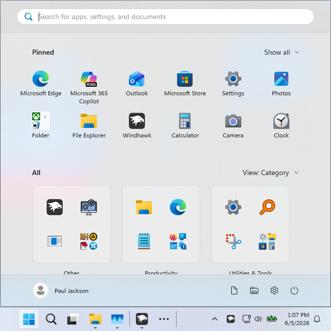

# FullScreen theme for Windows 11 Start Menu Styler

This theme makes the Start menu open in full screen mode.

**Author**: [m417z](https://github.com/m417z)



## Theme selection

The theme is integrated into the mod and can be selected directly from the mod's
settings:

* Open the Windows 11 Start Menu Styler mod in Windhawk.
* Go to the "Settings" tab.
* Select the theme and save the settings.

## Manual installation

The theme styles can also be imported manually. To do that, follow these steps:

* Open the Windows 11 Start Menu Styler mod in Windhawk.
* Go to the "Settings" tab and select "Textual mode".
* Copy the content below to the text box and click "Save settings".

### Redesigned Start menu

A variant for the [redesigned Windows 11 Start
menu](https://microsoft.design/articles/start-fresh-redesigning-windows-start-menu/)
that is slowly rolling out in the 25H2 update.

<details>
<summary>Content to import (click to expand)</summary>

```yaml
controlStyles:
  - target: StartMenu.StartBlendedFlexFrame
    styles:
      - ActualWidth=>frameWidth
      - ActualHeight=>frameHeight
  - target: StartMenu.StartBlendedFlexFrame > Grid#FrameRoot
    styles:
      - MinHeight={{frameHeight}}
      - MaxHeight={{frameHeight}}
      - Margin=0
      - Padding=0
  - target: Grid#MainMenu
    styles:
      - MinWidth={{frameWidth}}
  - target: Border#AcrylicBorder
    styles:
      - CornerRadius=0
  - target: GridView#AllAppsGrid > Border > ScrollViewer#ScrollViewer > Border#Root > Grid > ScrollContentPresenter#ScrollContentPresenter > ItemsPresenter > ItemsWrapGrid
    styles:
      - MaximumRowsOrColumns:=
```
</details>

### Classic Start menu

<details>
<summary>Content to import (click to expand)</summary>

```yaml
controlStyles:
  - target: :root > Canvas
    styles:
      - ActualWidth=>canvasWidth
      - ActualHeight=>canvasHeight
  - target: StartDocked.StartSizingFrame
    styles:
      - Canvas.Top=0
      - Canvas.Left=0
      - MinWidth={{canvasWidth}}
      - MinHeight={{canvasHeight}}
  - target: Grid#RootGrid
    styles:
      - MinWidth={{canvasWidth}}
  - target: Border#AcrylicBorder
    styles:
      - CornerRadius=0
```
</details>
