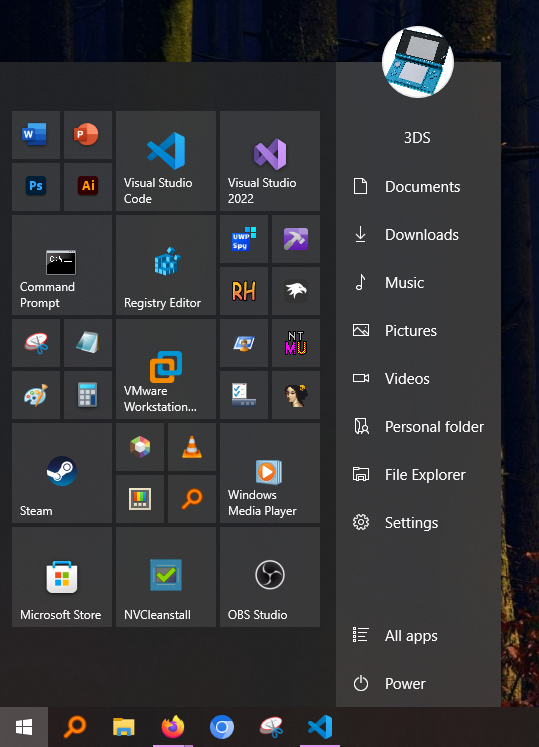

# Hybrid theme for Windows 11 Start Menu Styler (Windows 10 Start menu)

**Author**: [SandTechStuff](https://github.com/SandTechStuff)



## Windows 10 Start menu on Windows 11 installation

If you're already using the Windows 10 Start menu, you can skip this step.

Installation:
* Install [ExplorerPatcher](https://github.com/valinet/ExplorerPatcher).
* Open *"Properties (ExplorerPatcher)"* via the Start menu or right-click the taskbar > *"Properties"*.
* Go to *"Start menu"* > *"Start menu style"* > *"Windows 10"* > *"Restart File Explorer"*.

## Required additional configuration

This theme requires you to supply your own user picture image, separate from the one set in Windows settings.

Once you have imported the theme into the Start Menu Styler, go to the mod's settings and scroll all the way down. You should see a style constant with the content `userPicture=REPLACE ME`, after the "=" put the link to whatever image you want to use as your user picture.

For example: `userPicture=https://raw.githubusercontent.com/SandTechStuff/Stuff/refs/heads/main/Nintendo-3DS-AquaOpen-White.png`

## Manual installation

The theme styles have to be imported manually. To do that, follow these steps:

* Open the Windows 11 Start Menu Styler mod in Windhawk.
* Go to the "Advanced" tab.
* Copy the content below to the text box under "Mod settings" and click "Save".

<details>
<summary>Content to import (click to expand)</summary>

```json
{
	"controlStyles[0].target": "Grid#PaneRoot",
	"controlStyles[0].styles[0]": "Clip:=",
	"controlStyles[0].styles[1]": "FlowDirection=0",
	"controlStyles[0].styles[2]": "RenderTransform:=<TranslateTransform X=\"105\" />",
	"controlStyles[1].target": "Grid#ContentRoot",
	"controlStyles[1].styles[0]": "FlowDirection=0",
	"controlStyles[2].target": "SplitView#RootContent",
	"controlStyles[2].styles[0]": "IsPaneOpen=False",
	"controlStyles[3].target": "SplitView#RootContent > Grid",
	"controlStyles[3].styles[0]": "FlowDirection=1",
	"controlStyles[4].target": "StartUI.NavigationPaneGrid",
	"controlStyles[4].styles[0]": "Width=165",
	"controlStyles[4].styles[1]": "Background:=<SolidColorBrush Color=\"{ThemeResource SystemListLowColor}\" />",
	"controlStyles[5].target": "Windows.UI.Xaml.Shapes.Rectangle#BackgroundElement",
	"controlStyles[5].styles[0]": "Visibility=Collapsed",
	"controlStyles[6].target": "StartUI.StartSizingFrame",
	"controlStyles[6].styles[0]": "MinWidth=501",
	"controlStyles[6].styles[1]": "MaxWidth=501",
	"controlStyles[7].target": "StartUI.ExpandCollapseButton",
	"controlStyles[7].styles[0]": "Visibility=Collapsed",
	"controlStyles[8].target": "StartUI.UserTileView",
	"controlStyles[8].styles[0]": "Grid.Row=1",
	"controlStyles[8].styles[1]": "Margin=0,50,0,0",
	"controlStyles[9].target": "StartUI.AppListView",
	"controlStyles[9].styles[0]": "Grid.Row=2",
	"controlStyles[10].target": "StartUI.NavigationPaneButton#UserTileButton",
	"controlStyles[10].styles[0]": "Height=50",
	"controlStyles[11].target": "TextBlock#UserTileNameText",
	"controlStyles[11].styles[0]": "HorizontalAlignment=Center",
	"controlStyles[11].styles[1]": "RenderTransform:=<TranslateTransform X=\"-25\" />",
	"controlStyles[12].target": "StartUI.NavigationPaneButton#UserTileButton > ContentPresenter > StartUI.NavigationPaneItemPanel > Grid",
	"controlStyles[12].styles[0]": "Width=48",
	"controlStyles[12].styles[1]": "Height=48",
	"controlStyles[12].styles[2]": "IsHitTestVisible=False",
	"controlStyles[12].styles[3]": "RenderTransform:=<TransformGroup><ScaleTransform ScaleX=\"1.5\" ScaleY=\"1.5\" /><TranslateTransform X=\"45\" Y=\"-87\" /></TransformGroup>",
	"controlStyles[13].target": "StartUI.ResizeThumb#HorizontalThumb",
	"controlStyles[13].styles[0]": "Visibility=Collapsed",
	"controlStyles[14].target": "StartUI.NavigationPaneButton#UserTileButton > ContentPresenter > StartUI.NavigationPaneItemPanel > Grid > Windows.UI.Xaml.Shapes.Ellipse",
	"controlStyles[14].styles[0]": "Fill:=<ImageBrush ImageSource=\"$userPicture\" />",
	"controlStyles[15].target": "StartUI.StartSizingFramePanel",
	"controlStyles[15].styles[0]": "Margin=0,50,0,0",
	"controlStyles[16].target": "Image#DropShadow",
	"controlStyles[16].styles[0]": "Canvas.ZIndex=-1",
	"controlStyles[17].target": "StartUI.ViewSelectionListView",
	"controlStyles[17].styles[0]": "Grid.Row=4",
	"controlStyles[18].target": "StartUI.NavigationPaneGrid > Image#DropShadow",
	"controlStyles[18].styles[0]": "Visibility=Collapsed",
	"controlStyles[19].target": "StartUI.AllAppsGridListView",
	"controlStyles[19].styles[0]": "HorizontalAlignment=Left",
	"controlStyles[20].target": "StartUI.AllAppsPane",
	"controlStyles[20].styles[0]": "Width=324",
	"controlStyles[20].styles[1]": "Margin=5,0,0,0",
	"controlStyles[20].styles[2]": "HorizontalAlignment=Left",
	"controlStyles[21].target": "Border#GridPane",
	"controlStyles[21].styles[0]": "Width=334",
	"controlStyles[21].styles[1]": "RenderTransform:=<TranslateTransform X=\"-84\" />",
	"controlStyles[22].target": "Grid#ContentPaneGrid",
	"controlStyles[22].styles[0]": "Width=500",
	"controlStyles[23].target": "StartUI.ViewSelectionListView",
	"controlStyles[23].styles[0]": "Height=48",
	"controlStyles[24].target": "StartUI.ViewSelectionListViewItem > Grid@CommonStates",
	"controlStyles[24].styles[0]": "Visibility@Selected=Collapsed",
	"controlStyles[24].styles[1]": "Visibility@PointerOverSelected=Collapsed",
	"controlStyles[24].styles[2]": "Visibility@PressedOverSelected=Collapsed",
	"controlStyles[25].target": "StartUI.ViewSelectionListViewItem[2]",
	"controlStyles[25].styles[0]": "Margin=0,-48,0,0",
	"controlStyles[26].target": "TextBlock#StatusMessage[Text=System]",
	"controlStyles[26].styles[0]": "Visibility=Collapsed",
	"controlStyles[27].target": "StartUI.TileViewControl > Grid#MainGrid > Rectangle#Background",
	"controlStyles[27].styles[0]": "Fill:=<SolidColorBrush Color=\"{ThemeResource SystemListLowColor}\" />",
	"styleConstants[0]": "userPicture=REPLACE ME"
}
```
</details>
