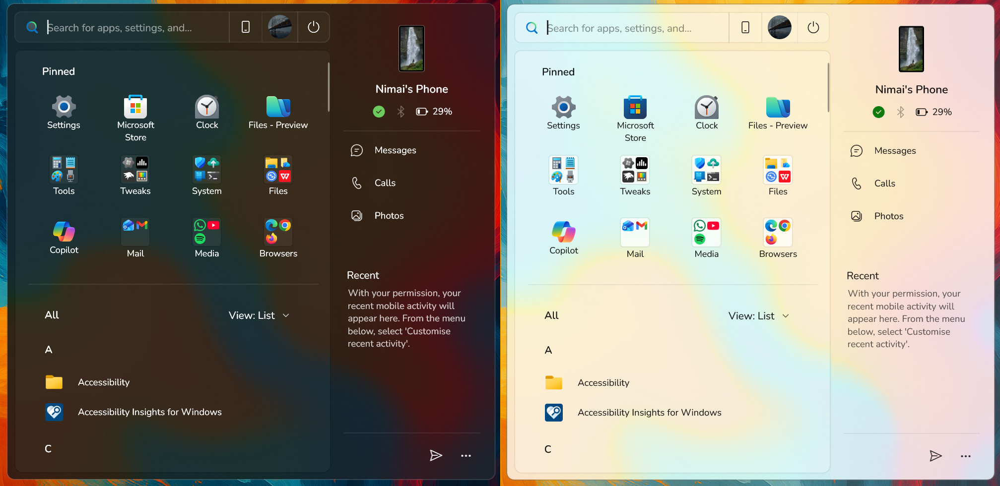
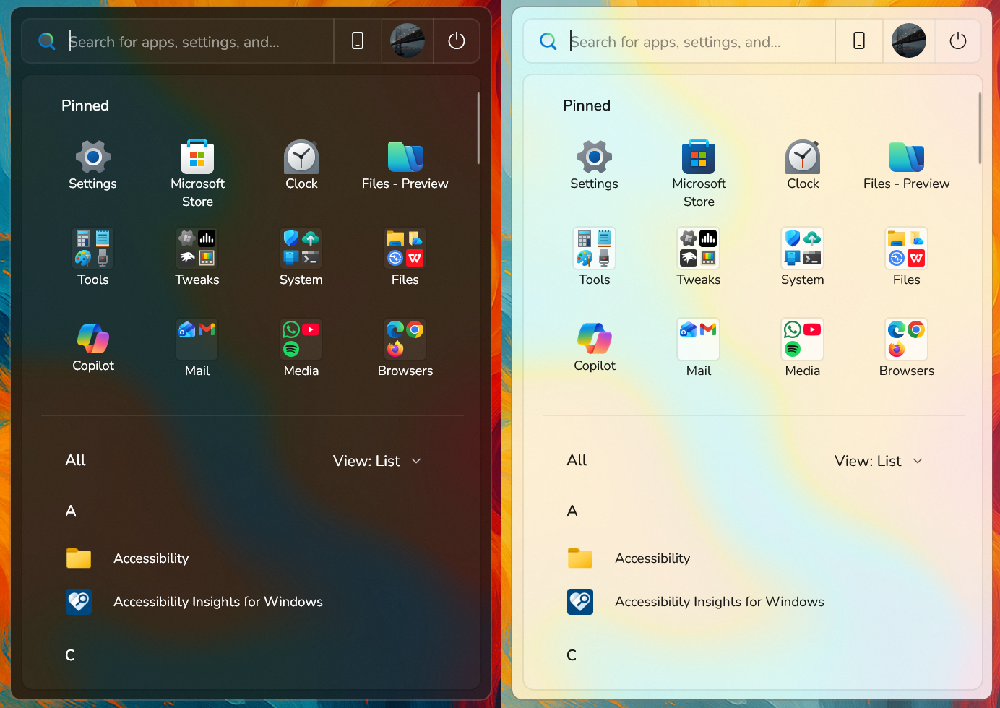
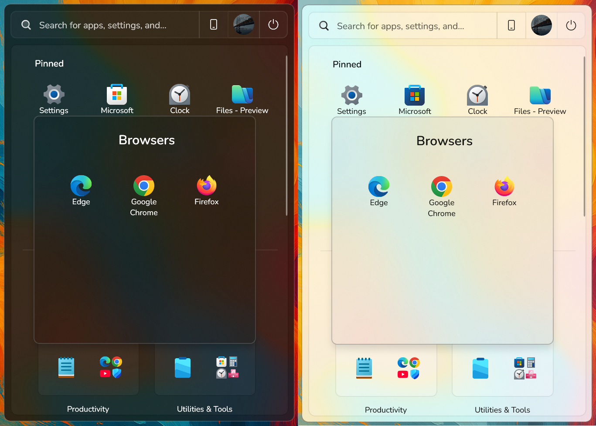

# LayerMicaUI theme for Windows 11 Start Menu Styler

**Author**: [Nimai-HK](https://github.com/Nimai-HK)

LayerMicaUI is a theme with adaptive layouts for the new Windows 11 25H2 Start menu.


<table style="width:100%;">
  <tr>
    <td style="height:20%; text-align:center;"></td>
    <td style="height:20%; text-align:center;"></td>
    <td style="height:20%; text-align:center;"></td>
  </tr>
</table>

> [!IMPORTANT]
> This theme is designed for the [redesigned Windows 11 Start menu](https://microsoft.design/articles/start-fresh-redesigning-windows-start-menu/) that is gradually rolling out with the 25H2 update.

## Notes
- Optimized for Windows 11 **25H2** and later with the new Start menu.
- Integrates the Start menu with the Phone Link panel.
- Supports screen resolutions of **1280×720** and above.
- Start menu aligns with the taskbar position.
- Fully compatible with both light and dark modes.
- Suggestions and recommended sections are hidden.
- Recommended to disable Start menu folders.

---

## Additional customization
<details>
  <summary>Font Customization (Click to expand)</summary>

- Font to be installed: [Nunito](https://fonts.google.com/specimen/Nunito)
- Add these items to the "Style constants" section of the settings page of the Windows 11 Start Menu Styler Mod

  ```
  ThFntWt=Semibold
  ThHdnWt=Bold
  ```
</details>

<details>
  <summary>Taskbar Search Bar (Click to expand)</summary>

- The taskbar search bar in clicked/active state is styled by this theme.
- *If you use the [LayerMicaUI Taskbar Styler Theme](https://github.com/ramensoftware/windows-11-taskbar-styling-guide/tree/main/Themes/LayerMicaUI), this change is recommended.*

    ```yaml
    - target: Border#TaskbarSearchBackground
      styles:
        - CornerRadius=$InnerRadius
        - Background:=$ThemeOverlay
        - BorderThickness=0
        - Height=32
        - Transform3D:=<CompositeTransform3D TranslateY="-2" TranslateX="1"/>

    - target: Cortana.UI.Views.RichSearchBoxControl#SearchBoxControl > Grid#RootGrid
      styles:
        - CornerRadius=$InnerRadius
        - Transform3D:=<CompositeTransform3D TranslateY="-2" TranslateX="1"/>
    ```
</details>

<details>
  <summary>Hide Phone Link Companion Button (Click to expand)</summary>

- To hide the Phone Link Companion button:

  ```yaml
  - target: Windows.UI.Xaml.Controls.Primitives.ToggleButton#ShowHideCompanion
    styles:
      - Visibility=1
  ```
</details>

---
## Some More Information
- Start menu and Phone Link panel use separate surfaces, and on certain backgrounds the seam between them may be visible.
- Start menu and Search window have fixed heights to prevent element displacement.

## Other LayerMicaUI Themes
- [LayerMicaUI Taskbar Theme](https://github.com/ramensoftware/windows-11-taskbar-styling-guide/tree/main/Themes/LayerMicaUI)

- [LayerMicaUI Notification And Control Center Theme](https://github.com/ramensoftware/windows-11-notification-center-styling-guide/tree/main/Themes/LayerMicaUI)

## Theme selection

The theme is integrated into the mod and can be selected directly from the mod's
settings:

* Open the Windows 11 Start Menu Styler mod in Windhawk.
* Go to the "Settings" tab.
* Select the theme and save the settings.

## Manual installation

The theme styles can also be imported manually. To do that, follow these steps:

* Open the Windows 11 Start Menu Styler mod in Windhawk.
* Go to the "Advanced" tab.
* Copy the content below to the text box under "Mod settings" and click "Save".

<details>
<summary>Content to import (click to expand)</summary>

```json
{
  "styleConstants[0]":"ThemeBorder=<SolidColorBrush Color=\"{ThemeResource Border}\" />",
  "styleConstants[1]":"OuterRadius=10",
  "styleConstants[2]":"InnerRadius=8",
  "styleConstants[3]":"ThFnt=Nunito",
  "styleConstants[4]":"ThemeOverlay=<SolidColorBrush Color=\"{ThemeResource Overlay}\" />",
  "styleConstants[5]":"ThFntWt=Normal",
  "styleConstants[6]":"ThHdnWt=Semibold",
  "styleConstants[7]":"ThemeBtn=<SolidColorBrush Color=\"{ThemeResource Btn}\"/>",
  "styleConstants[8]":"ThemeControlBorder=<SolidColorBrush Color=\"{ThemeResource ControlBorder}\" />",
  "styleConstants[9]":"ThemeOutBorder=<SolidColorBrush Color=\"#66757575\"/>",
  "styleConstants[10]":"ThemeFlyout=<AcrylicBrush BackgroundSource=\"Backdrop\" TintColor=\"{ThemeResource SystemChromeMediumColor}\" TintOpacity=\"0.1\" TintLuminosityOpacity=\"0.8\" FallbackColor=\"{ThemeResource SystemChromeMediumColor}\" />",

  "themeResourceVariables[0]":"Overlay@Light=#40FFFFFF",
  "themeResourceVariables[1]":"Overlay@Dark=#09FFFFFF",
  "themeResourceVariables[2]":"Border@Light=#0F000000",
  "themeResourceVariables[3]":"Border@Dark=#19000000",
  "themeResourceVariables[4]":"ControlBorder@Light=#0F000000",
  "themeResourceVariables[5]":"ControlBorder@Dark=#15FFFFFF",
  "themeResourceVariables[6]":"Btn@Light=#90FFFFFF",
  "themeResourceVariables[7]":"Btn@Dark=#20FFFFFF",

  "webContentStyles[0].target":".curatedSettingsGroup, #scopesHeader",
    "webContentStyles[0].styles[0]":"display: none !important",

  "webContentStyles[1].target":"#qfPreviewPane",
    "webContentStyles[1].styles[0]":"margin-right: -10px !important",
    "webContentStyles[1].styles[1]":"border-radius: 8px !important",

  "webContentStyles[2].target":".suggsList, .suggContainer",
    "webContentStyles[2].styles[0]":"margin-right: 5px !important",
    "webContentStyles[2].styles[1]":"margin-left: 0px !important",

  "controlStyles[0].target":"Border#AcrylicBorder",
    "controlStyles[0].styles[0]":"CornerRadius=$OuterRadius",
    "controlStyles[0].styles[1]":"BorderThickness=1",
    "controlStyles[0].styles[2]":"Width=445",
    "controlStyles[0].styles[3]":"// Main Background of the Start Menu",

  "controlStyles[1].target":"Grid#MainMenu > Grid#MainContent > Border#AcrylicOverlay",
    "controlStyles[1].styles[0]":"Margin=9,-3,9,-55",
    "controlStyles[1].styles[1]":"CornerRadius=8,8,10,10",
    "controlStyles[1].styles[2]":"BorderThickness=1",
    "controlStyles[1].styles[3]":"Background:=$ThemeOverlay",
    "controlStyles[1].styles[4]":"// Acrylic Overlay of the Start Menu",

  "controlStyles[2].target":"StartDocked.PowerOptionsView > StartDocked.NavigationPaneButton > Grid@CommonStates > Border",
    "controlStyles[2].styles[0]":"CornerRadius=0,8,8,0",
    "controlStyles[2].styles[1]":"Margin=-2,-1,-2,-1",
    "controlStyles[2].styles[2]":"BorderThickness=1",
    "controlStyles[2].styles[3]":"Background@Normal:=$ThemeOverlay",
    "controlStyles[2].styles[4]":"Background@Pressed:=$ThemeBtn",
    "controlStyles[2].styles[5]":"Background@PointerOver:=$ThemeBtn",
    "controlStyles[2].styles[6]":"Background@Disabled:=$ThemeOverlay",
    "controlStyles[2].styles[7]":"BorderBrush:=$ThemeControlBorder",
    "controlStyles[2].styles[8]":"// Power Button > Background",

  "controlStyles[3].target":"StartDocked.UserTileView > StartDocked.NavigationPaneButton > Grid@CommonStates > Border",
    "controlStyles[3].styles[0]":"Margin=0,-1,0,-1",
    "controlStyles[3].styles[1]":"CornerRadius=0",
    "controlStyles[3].styles[2]":"Background@Pressed:=$ThemeBtn",
    "controlStyles[3].styles[3]":"BorderThickness=0,1,0,1",
    "controlStyles[3].styles[4]":"Width=48",
    "controlStyles[3].styles[5]":"Background@PointerOver:=$ThemeBtn",
    "controlStyles[3].styles[6]":"Background@Normal:=$ThemeOverlay",
    "controlStyles[3].styles[7]":"Background@Disabled:=$ThemeOverlay",
    "controlStyles[3].styles[8]":"Background:=$ThemeOverlay",
    "controlStyles[3].styles[9]":"BorderBrush:=$ThemeControlBorder",
    "controlStyles[3].styles[10]":"// User Profile > Background",

  "controlStyles[4].target":"StartMenu.SearchBoxToggleButton#SearchBoxToggleButton > Grid@CommonStates > Border",
    "controlStyles[4].styles[0]":"Background@Normal:=$ThemeOverlay",
    "controlStyles[4].styles[1]":"CornerRadius=8,0,0,8",
    "controlStyles[4].styles[2]":"BorderBrush:=$ThemeControlBorder",
    "controlStyles[4].styles[3]":"BorderThickness=1",
    "controlStyles[4].styles[4]":"Background@PointerOver:=$ThemeBtn",
    "controlStyles[4].styles[5]":"Background@Pressed:=$ThemeBtn",
    "controlStyles[4].styles[6]":"Background:=$ThemeOverlay",
    "controlStyles[4].styles[7]":"// Start Menu Search Box Background",

  "controlStyles[5].target":"Border#ContentBorder > Grid#DroppedFlickerWorkaroundWrapper > Border@CommonStates",
    "controlStyles[5].styles[0]":"Margin=1",
    "controlStyles[5].styles[1]":"// Fixes something",

  "controlStyles[6].target":"StartMenu.FolderModal#StartFolderModal > Grid#Root > Border",
    "controlStyles[6].styles[0]":"BorderThickness=1",
    "controlStyles[6].styles[1]":"Width=340",
    "controlStyles[6].styles[2]":"Height=350",
    "controlStyles[6].styles[3]":"Margin=5,0,0,0",
    "controlStyles[6].styles[4]":"BorderBrush:=$ThemeOutBorder",
    "controlStyles[6].styles[5]":"Background:=$ThemeFlyout",
    "controlStyles[6].styles[6]":"// Start Menu Open Folder Background",

  "controlStyles[7].target":"Border#StartDropShadow",
    "controlStyles[7].styles[0]":"Width=445",
    "controlStyles[7].styles[1]":"Visibility=1",
    "controlStyles[7].styles[2]":"// Start Menu Shadow",

  "controlStyles[8].target":"StartMenu.StartMenuCompanion#RightCompanion > Grid#CompanionRoot > Border#AcrylicBorder",
    "controlStyles[8].styles[0]":"Width=225",
    "controlStyles[8].styles[1]":"CornerRadius=0,$OuterRadius,$OuterRadius,0",
    "controlStyles[8].styles[2]":"BorderBrush:=$ThemeOutBorder",
    "controlStyles[8].styles[3]":"BorderThickness=0,1,1,1",
    "controlStyles[8].styles[4]":"// Phone Link Companion > Main Background",

  "controlStyles[9].target":"StartMenu.StartMenuCompanion#RightCompanion > Grid#CompanionRoot > Grid#MainContent > Border#AcrylicOverlay",
    "controlStyles[9].styles[0]":"Margin=20,170,20,-2",
    "controlStyles[9].styles[1]":"BorderThickness=0,1,0,1",
    "controlStyles[9].styles[2]":"CornerRadius=0",
    "controlStyles[9].styles[3]":"Background:=Transparent",
    "controlStyles[9].styles[4]":"BorderBrush:=$ThemeControlBorder",
    "controlStyles[9].styles[5]":"// Phone Link Companion > Acrylic Overlay",

  "controlStyles[10].target":"Windows.UI.Xaml.Controls.Primitives.ToggleButton#ShowHideCompanion > Border",
    "controlStyles[10].styles[0]":"Background:=$ThemeOverlay",
    "controlStyles[10].styles[1]":"BorderBrush:=$ThemeControlBorder",
    "controlStyles[10].styles[2]":"BorderThickness=1",
    "controlStyles[10].styles[3]":"Background:=$ThemeOverlay",
    "controlStyles[10].styles[4]":"// Phone Link Panel Show-Hide Button Background",

  "controlStyles[11].target":"Border > ScrollViewer#ScrollViewer > Border#Root > Grid > ScrollContentPresenter#ScrollContentPresenter > ItemsPresenter > ItemsWrapGrid > GridViewItem > Border#ContentBorder > Grid#DroppedFlickerWorkaroundWrapper > Border#BackgroundBorder",
    "controlStyles[11].styles[0]":"CornerRadius=$InnerRadius",
    "controlStyles[11].styles[1]":"// Adds a rounded corner to list view items",

  "controlStyles[12].target":"StartMenu.PinnedList#StartMenuPinnedList > Grid#Root > GridView#PinnedList > Border",
    "controlStyles[12].styles[0]":"Padding=0,5,0,10",
    "controlStyles[12].styles[1]":"BorderThickness=0,0,0,1",
    "controlStyles[12].styles[2]":"BorderBrush:=$ThemeControlBorder",
    "controlStyles[12].styles[3]":"Margin=0,0,0,-25",
    "controlStyles[12].styles[4]":"// Start Menu Pinned List Background",

  "controlStyles[13].target":"ScrollViewer#ScrollViewer > Border#Root > Grid > ScrollContentPresenter#ScrollContentPresenter > ItemsPresenter > ItemsStackPanel > ListViewItem > Grid#ContentBorder > Border#BorderBackground",
    "controlStyles[13].styles[0]":"CornerRadius=$InnerRadius",
    "controlStyles[13].styles[1]":"// Adds a rounded corner to some other list view items",

  "controlStyles[14].target":"GridViewHeaderItem > Border > ContentPresenter#ContentPresenter > Button#Header > Border#Border",
    "controlStyles[14].styles[0]":"CornerRadius=$InnerRadius",
    "controlStyles[14].styles[1]":"// Adds a rounded corner to some other list view items",

  "controlStyles[15].target":"ScrollContentPresenter > Border",
    "controlStyles[15].styles[0]":"MaxHeight=665",
    "controlStyles[15].styles[1]":"VerticalAlignment=Bottom",
    "controlStyles[15].styles[2]":"MinWidth=700",
    "controlStyles[15].styles[3]":"// Start menu and Search Host Sizing, Main root of both.",

  "controlStyles[16].target":"Cortana.UI.Views.TaskbarSearchPage > Grid#RootGrid > Grid#OuterBorderGrid > Grid#BorderGrid > Border#LayerBorder",
    "controlStyles[16].styles[0]":"Visibility=1",
    "controlStyles[16].styles[1]":"// Search page Tinted Overlay",

  "controlStyles[17].target":"Cortana.UI.Views.TaskbarSearchPage > Grid#RootGrid > Grid#OuterBorderGrid > Grid#BorderGrid > Border#AppBorder",
    "controlStyles[17].styles[0]":"BorderBrush:=$ThemeOutBorder",
    "controlStyles[17].styles[1]":"CornerRadius=$OuterRadius",
    "controlStyles[17].styles[2]":"Margin=1",
    "controlStyles[17].styles[3]":"// Search Page Main Background",

  "controlStyles[18].target":"MenuFlyoutPresenter > Border",
    "controlStyles[18].styles[0]":"Background:=$ThemeFlyout",
    "controlStyles[18].styles[1]":"BorderBrush:=$ThemeOutBorder",
    "controlStyles[18].styles[2]":"// Right Click Menu > Background",

  "controlStyles[19].target":"Button#ZoomInButton > Grid > Border#BackgroundBorder",
    "controlStyles[19].styles[0]":"CornerRadius=$InnerRadius",
    "controlStyles[19].styles[1]":"// Zoom into list view button",

  "controlStyles[20].target":"ListView#ZoomedOutListView > Border > ScrollViewer#ScrollViewer > Border#Root > Grid > ScrollContentPresenter#ScrollContentPresenter > ItemsPresenter > ItemsWrapGrid > ListViewItem > Grid#ContentBorder > Border#BorderBackground",
    "controlStyles[20].styles[0]":"CornerRadius=$InnerRadius",
    "controlStyles[20].styles[1]":"BorderBrush:=$ThemeControlBorder",
    "controlStyles[20].styles[2]":"// Adds a rounded corner to some other list view items",

  "controlStyles[21].target":"Border#RightCompanionDropShadowDismissTarget",
    "controlStyles[21].styles[0]":"Visibility=1",
    "controlStyles[21].styles[1]":"// Phone Link Companion Shadow and something",

  "controlStyles[22].target":"Border#RightCompanionDropShadow",
    "controlStyles[22].styles[0]":"Visibility=1",
    "controlStyles[22].styles[1]":"// Phone Link Companion Shadow",

  "controlStyles[23].target":"Border#LeftCompanionDropShadowDismissTarget",
    "controlStyles[23].styles[0]":"Visibility=1",
    "controlStyles[23].styles[1]":"// Start Menu Shadow with Phone Link Companion Active",

  "controlStyles[24].target":"Border#DropShadowDismissTarget",
    "controlStyles[24].styles[0]":"Visibility=1",
    "controlStyles[24].styles[1]":"// Start Menu Normal Shadow",

  "controlStyles[25].target":"Grid#TopLevelHeader > Grid",
    "controlStyles[25].styles[0]":"RenderTransform:=<TranslateTransform X=\"3\" Y=\"-8\" />",
    "controlStyles[25].styles[1]":"Canvas.ZIndex=99",
    "controlStyles[25].styles[2]":"// Pinned List Heading grid",

  "controlStyles[26].target":"StartMenu.StartMenuCompanion#RightCompanion > Grid#CompanionRoot > Grid#MainContent > ContentPresenter#PrimaryCardContainer",
    "controlStyles[26].styles[0]":"Margin=0,0,0,-8",
    "controlStyles[26].styles[1]":"// Phone Link Companion > Actions + Recents Card",

  "controlStyles[27].target":"Grid#CommandSpace > Button#PrimaryButton > ContentPresenter#ContentPresenter",
    "controlStyles[27].styles[0]":"FontFamily=$ThFnt",
    "controlStyles[27].styles[1]":"FontWeight=$ThFntWt",
    "controlStyles[27].styles[2]":"// Not Sure Which Button's font I changed",

  "controlStyles[28].target":"Grid#CommandSpace > Button#SecondaryButton > Button#CloseButton > ContentPresenter#ContentPresenter",
    "controlStyles[28].styles[0]":"FontFamily=$ThFnt",
    "controlStyles[28].styles[1]":"FontWeight=$ThFntWt",
    "controlStyles[28].styles[2]":"// Not Sure Which Button's font I changed",

  "controlStyles[29].target":"Windows.UI.Xaml.Controls.Primitives.ToggleButton#ShowHideCompanion > Border > ContentPresenter#ContentPresenter",
    "controlStyles[29].styles[0]":"Height=42",
    "controlStyles[29].styles[1]":"Width=45",
    "controlStyles[29].styles[2]":"CornerRadius=0",
    "controlStyles[29].styles[3]":"// Phone Link Panel Show-Hide Button Icon",

  "controlStyles[30].target":"Cortana.UI.Views.CortanaRichSearchBox#SearchTextBox",
    "controlStyles[30].styles[0]":"FontFamily=$ThFnt",
    "controlStyles[30].styles[1]":"FontSize=14",
    "controlStyles[30].styles[2]":"FontWeight=$ThFntWt",
    "controlStyles[30].styles[3]":"// Taskbar Search Box Font",

  "controlStyles[31].target":"Frame#StartFrame",
    "controlStyles[31].styles[0]":"Margin=0,-10,0,0",
    "controlStyles[31].styles[1]":"// Start Menu Frame",

  "controlStyles[32].target":"Grid#SuggestionsParentContainer",
    "controlStyles[32].styles[0]":"Visibility=Collapsed",
    "controlStyles[32].styles[1]":"// Suggestions Container",

  "controlStyles[33].target":"Grid#TopLevelSuggestionsListHeader",
    "controlStyles[33].styles[0]":"Visibility=Collapsed",
    "controlStyles[33].styles[1]":"// Suggestions Header",

  "controlStyles[34].target":"Grid#GridViewContainer",
    "controlStyles[34].styles[0]":"Width=360",
    "controlStyles[34].styles[1]":"Margin=5,0,-5,0",
    "controlStyles[34].styles[2]":"// Might be Start Menu Folder Container",

  "controlStyles[35].target":"Grid#FrameRoot",
    "controlStyles[35].styles[0]":"Height=665",
    "controlStyles[35].styles[1]":"// Base Frame Size",

  "controlStyles[36].target":"Grid#MainMenu",
    "controlStyles[36].styles[0]":"Width=445",
    "controlStyles[36].styles[1]":"CornerRadius=$OuterRadius",
    "controlStyles[36].styles[2]":"// Start Menu Main List ( Pinned + All Apps )",

  "controlStyles[37].target":"ScrollViewer > ScrollContentPresenter > Border > StartMenu.StartBlendedFlexFrame > Grid#FrameRoot",
    "controlStyles[37].styles[0]":"Margin=0",
    "controlStyles[37].styles[1]":"// Start Menu Frame Padding",

  "controlStyles[38].target":"Grid#RightCompanionContainerGrid",
    "controlStyles[38].styles[0]":"Width=221",
    "controlStyles[38].styles[1]":"Padding=-10,0,0,0",
    "controlStyles[38].styles[2]":"RenderTransform:=<TranslateTransform X=\"-9\" />",
    "controlStyles[38].styles[3]":"// Phone Link Panel Grid Container",

  "controlStyles[39].target":"Grid#CompanionRoot",
    "controlStyles[39].styles[0]":"Width=225",
    "controlStyles[39].styles[1]":"// Phone Link Panel Base Sizing Grid",

  "controlStyles[40].target":"StartMenu.StartMenuCompanion#RightCompanion > Grid#CompanionRoot > Grid#MainContent > Grid#ActionsBar",
    "controlStyles[40].styles[0]":"Transform3D:=<CompositeTransform3D TranslateX=\"-3\"/>",
    "controlStyles[40].styles[1]":"// Phone Link Panel Send and Three dots Region Bar",

  "controlStyles[41].target":"Grid#AllListHeading > Microsoft.UI.Xaml.Controls.DropDownButton#ViewSelectionButton > Grid#RootGrid",
    "controlStyles[41].styles[0]":"CornerRadius=$InnerRadius",
    "controlStyles[41].styles[1]":"Margin=2,0,0,0",
    "controlStyles[41].styles[2]":"// All Apps Heading Grid > View type button",

  "controlStyles[42].target":"Grid#NavPanePlaceholder",
    "controlStyles[42].styles[0]":"Margin=310,-577,-17,576",
    "controlStyles[42].styles[1]":"Width=96",
    "controlStyles[42].styles[2]":"// Navigation Pane of Start Menu ( Userprofile, Powerbutton, Folder Lists )",

  "controlStyles[43].target":"Grid#AllListHeading",
    "controlStyles[43].styles[0]":"Margin=0,80,-5,0",
    "controlStyles[43].styles[1]":"// All Apps Heading Grid",

  "controlStyles[44].target":"Grid#NoTopLevelSuggestionsText",
    "controlStyles[44].styles[0]":"Height=0",
    "controlStyles[44].styles[1]":"Visibility=1",
    "controlStyles[44].styles[2]":"// Start Menu > Suggested Section Header",

  "controlStyles[45].target":"Grid#ShowMoreSuggestions",
    "controlStyles[45].styles[0]":"Height=0",
    "controlStyles[45].styles[1]":"Visibility=1",
    "controlStyles[45].styles[2]":"// Start Menu > Suggested Section > Show More Button Region",

  "controlStyles[46].target":"Grid#TopLevelSuggestionsRoot > Grid[2]",
    "controlStyles[46].styles[0]":"MinHeight=0",
    "controlStyles[46].styles[1]":"Visibility=1",
    "controlStyles[46].styles[2]":"// Start Menu > Suggestions Grid 2",

  "controlStyles[47].target":"GridView#PinnedList",
    "controlStyles[47].styles[0]":"Margin=9,0,-9,-60",
    "controlStyles[47].styles[1]":"// Start Menu > Pinned List Position Grid",

  "controlStyles[48].target":"GridView#RecommendedList",
    "controlStyles[48].styles[0]":"Visibility=1",
    "controlStyles[48].styles[1]":"// Start menu > Recommended section > List",

  "controlStyles[49].target":"StartMenu.PinnedList#StartMenuPinnedList",
    "controlStyles[49].styles[0]":"Margin=0,-30,0,0",
    "controlStyles[49].styles[1]":"Padding=0",
    "controlStyles[49].styles[2]":"// Start Menu > Pinned List Root",

  "controlStyles[50].target":"Microsoft.UI.Xaml.Controls.PipsPager#PipsPager",
    "controlStyles[50].styles[0]":"Margin=-30,-10,0,10",
    "controlStyles[50].styles[1]":"// Folder Open > Scrolling Dots",

  "controlStyles[51].target":"StartDocked.PowerOptionsView",
    "controlStyles[51].styles[0]":"Margin=-3,0,3,0",
    "controlStyles[51].styles[1]":"// Power Button Root",

  "controlStyles[52].target":"Cortana.UI.Views.TaskbarSearchPage > Grid#RootGrid > Grid#QueryFormulationRoot",
    "controlStyles[52].styles[0]":"Margin=0,-4,0,10",
    "controlStyles[52].styles[1]":"// Search Page > Main Results grid",

  "controlStyles[53].target":"StartMenu.SearchBoxToggleButton#SearchBoxToggleButton",
    "controlStyles[53].styles[0]":"Height=42",
    "controlStyles[53].styles[1]":"Margin=-23,-2,72,0",
    "controlStyles[53].styles[2]":"// Start Menu > Search Box Button Root",

  "controlStyles[54].target":"StartMenu.StartHome",
    "controlStyles[54].styles[0]":"Width=450",
    "controlStyles[54].styles[1]":"Margin=-15,8,5,-53",
    "controlStyles[54].styles[2]":"// Start Menu > Contents Base grid",

  "controlStyles[55].target":"TextBlock#ZoomedOutHeading",
    "controlStyles[55].styles[0]":"Visibility=1",
    "controlStyles[55].styles[1]":"// Start Menu > Zoomed Out list > Heading Text",

  "controlStyles[56].target":"TextBlock#DisplayName",
    "controlStyles[56].styles[0]":"Margin=8,3,8,0",
    "controlStyles[56].styles[1]":"FontFamily=$ThFnt",
    "controlStyles[56].styles[2]":"FontWeight=$ThFntWt",
    "controlStyles[56].styles[3]":"// Pinned List Apps > Name Textblock",

  "controlStyles[57].target":"TextBlock#PinnedListHeaderText",
    "controlStyles[57].styles[0]":"FontFamily=$ThFnt",
    "controlStyles[57].styles[1]":"FontWeight=$ThHdnWt",
    "controlStyles[57].styles[2]":"Margin=62,6,0,-6",
    "controlStyles[57].styles[3]":"// Pinned List title Text",

  "controlStyles[58].target":"TextBlock#AllListHeadingText",
    "controlStyles[58].styles[0]":"FontFamily=$ThFnt",
    "controlStyles[58].styles[1]":"FontWeight=$ThHdnWt",
    "controlStyles[58].styles[2]":"// All Apps List title text",

  "controlStyles[59].target":"TextBlock#UserTileNameText",
    "controlStyles[59].styles[0]":"Visibility=1",
    "controlStyles[59].styles[1]":"// User profile Name TextBlock",

  "controlStyles[60].target":"StartMenu.SearchBoxToggleButton > Grid > ContentPresenter > TextBlock#PlaceholderText",
    "controlStyles[60].styles[0]":"FontFamily=$ThFnt",
    "controlStyles[60].styles[1]":"FontSize=14",
    "controlStyles[60].styles[2]":"FontWeight=$ThFntWt",
    "controlStyles[60].styles[3]":"RenderTransform:=<TranslateTransform Y=\"1\" />",
    "controlStyles[60].styles[4]":"// Start Menu > Search Box Inactive Placeholder Text",

  "controlStyles[61].target":"TextBlock#AppDisplayName",
    "controlStyles[61].styles[0]":"FontFamily=$ThFnt",
    "controlStyles[61].styles[1]":"FontSize=12.5",
    "controlStyles[61].styles[2]":"FontWeight=$ThFntWt",
    "controlStyles[61].styles[3]":"// Apps List > App Names Textblock",

  "controlStyles[62].target":"Button#Header > Border > TextBlock",
    "controlStyles[62].styles[0]":"FontFamily=$ThFnt",
    "controlStyles[62].styles[1]":"FontSize=14",
    "controlStyles[62].styles[2]":"FontWeight=$ThHdnWt",
    "controlStyles[62].styles[3]":"// App List Heading lettering: (#, A, B..) Text",

  "controlStyles[63].target":"TextBlock#PlaceholderTextContentPresenter",
    "controlStyles[63].styles[0]":"FontFamily=$ThFnt",
    "controlStyles[63].styles[1]":"// Idk which Placeholder text this is",

  "controlStyles[64].target":"Microsoft.UI.Xaml.Controls.DropDownButton > Grid > ContentPresenter > TextBlock",
    "controlStyles[64].styles[0]":"FontFamily=$ThFnt",
    "controlStyles[64].styles[1]":"FontSize=14",
    "controlStyles[64].styles[2]":"FontWeight=$ThFntWt",
    "controlStyles[64].styles[3]":"// Right Click Menus > TextBlocks",

  "controlStyles[65].target":"TextBlock#ShowMorePinnedButtonText",
    "controlStyles[65].styles[0]":"FontFamily=$ThFnt",
    "controlStyles[65].styles[1]":"FontWeight=$ThFntWt",
    "controlStyles[65].styles[2]":"// Pinned List > Show More Pinned Apps Text",

  "controlStyles[66].target":"ItemsWrapGrid > GridViewItem > Border#ContentBorder > Grid#DroppedFlickerWorkaroundWrapper > ContentPresenter#ContentPresenter > ContentControl > Grid > TextBlock",
    "controlStyles[66].styles[0]":"FontFamily=$ThFnt",
    "controlStyles[66].styles[1]":"FontSize=12.5",
    "controlStyles[66].styles[2]":"FontWeight=$ThFntWt",
    "controlStyles[66].styles[3]":"// Some List View Item's TextBlock",

  "controlStyles[67].target":"TextBlock[FontSize=12]",
    "controlStyles[67].styles[0]":"FontFamily=$ThFnt",
    "controlStyles[67].styles[1]":"FontWeight=$ThFntWt",
    "controlStyles[67].styles[2]":"FontSize=12.5",
    "controlStyles[67].styles[3]":"// An attempt to Apply Font Styles to all TextBlocks with Font Size 12",

  "controlStyles[68].target":"TextBlock[FontSize=14]",
    "controlStyles[68].styles[0]":"FontFamily=$ThFnt",
    "controlStyles[68].styles[1]":"FontWeight=$ThFntWt",
    "controlStyles[68].styles[2]":"// An attempt to Apply Font Styles to all TextBlocks with Font Size 14",

  "controlStyles[69].target":"TextBlock[FontSize=18]",
    "controlStyles[69].styles[0]":"FontFamily=$ThFnt",
    "controlStyles[69].styles[1]":"FontWeight=$ThHdnWt",
    "controlStyles[69].styles[2]":"// An attempt to Apply Font Styles to all TextBlocks with Font Size 18",

  "controlStyles[70].target":"ToolTip > ContentPresenter > TextBlock",
    "controlStyles[70].styles[0]":"FontFamily=$ThFnt",
    "controlStyles[70].styles[1]":"FontWeight=$ThFntWt",
    "controlStyles[70].styles[2]":"FontSize=13",
    "controlStyles[70].styles[3]":"// Mouse Hover Tooltips > TextBlock",

  "controlStyles[71].target":"ContentPresenter#PrimaryCardContainer > Grid > Grid > TextBlock",
    "controlStyles[71].styles[0]":"FontFamily=$ThFnt",
    "controlStyles[71].styles[1]":"FontWeight=$ThHdnWt",
    "controlStyles[71].styles[2]":"FontSize=15",
    "controlStyles[71].styles[3]":"// An attempt to Apply Font Styles to TextBlocks in Phone Link Panel",

  "controlStyles[72].target":"ContentPresenter > TextBlock#FolderNameTextBlock",
    "controlStyles[72].styles[0]":"FontFamily=$ThFnt",
    "controlStyles[72].styles[1]":"FontWeight=$ThHdnWt",
    "controlStyles[72].styles[2]":"// All Apps List > Folders > Name Textblock",

  "controlStyles[73].target":"MenuFlyoutItem > Grid#LayoutRoot > TextBlock",
    "controlStyles[73].styles[0]":"FontFamily=$ThFnt",
    "controlStyles[73].styles[1]":"FontWeight=$ThFntWt",
    "controlStyles[73].styles[2]":"FontSize=14.5",
    "controlStyles[73].styles[3]":"RenderTransform:=<TranslateTransform X=\"1\" Y=\"0.5\" />",
    "controlStyles[73].styles[4]":"// Right Click Menu items > TextBlock",

  "controlStyles[74].target":"Button#ZoomInButton > Grid > ContentPresenter#ContentPresenter > StackPanel > TextBlock",
    "controlStyles[74].styles[0]":"FontFamily=$ThFnt",
    "controlStyles[74].styles[1]":"// Back button on the Zoomed Out View ( Alphabet Grid )",

  "controlStyles[75].target":"ListView#ZoomedOutListView > Border > ScrollViewer#ScrollViewer > Border#Root > Grid > ScrollContentPresenter#ScrollContentPresenter > ItemsPresenter > ItemsWrapGrid > ListViewItem > Grid#ContentBorder > ContentPresenter#ContentPresenter > Viewbox > Border > TextBlock",
    "controlStyles[75].styles[0]":"FontFamily=$ThFnt",
    "controlStyles[75].styles[1]":"FontWeight=$ThFntWt",
    "controlStyles[75].styles[2]":"// Some List View Item's TextBlock",

  "controlStyles[76].target":"Grid#DroppedFlickerWorkaroundWrapper > ContentPresenter#ContentPresenter > Grid > TextBlock",
    "controlStyles[76].styles[0]":"FontFamily=$ThFnt",
    "controlStyles[76].styles[1]":"FontWeight=$ThFntWt",
    "controlStyles[76].styles[2]":"// Some List View Item's TextBlock",

  "controlStyles[77].target":"TextBlock#SeeAllButtonLabelTextblock",
    "controlStyles[77].styles[0]":"FontFamily=$ThFnt",
    "controlStyles[77].styles[1]":"FontWeight=$ThFntWt",
    "controlStyles[77].styles[2]":"// Not sure which Button textblock",

  "controlStyles[78].target":"TextBlock#FolderNameTextBlock",
    "controlStyles[78].styles[0]":"FontFamily=$ThFnt",
    "controlStyles[78].styles[1]":"FontWeight=$ThHdnWt",
    "controlStyles[78].styles[2]":"// All Apps List > Category View > Folder Open > Heading TextBlock",

  "controlStyles[79].target":"TextBox#MutableFolderNameTextBox",
    "controlStyles[79].styles[0]":"FontFamily=$ThFnt",
    "controlStyles[79].styles[1]":"FontWeight=$ThHdnWt",
    "controlStyles[79].styles[2]":"// Pinned List > Folder Open > Heading TextBlock",

  "controlStyles[80].target":"TextBox#MutableFolderNameTextBox > Grid > ScrollViewer#ContentElement > Border#Root > Grid > ScrollContentPresenter#ScrollContentPresenter > Windows.UI.Xaml.Internal.TextBoxView",
    "controlStyles[80].styles[0]":"FontFamily=$ThFnt",
    "controlStyles[80].styles[1]":"FontWeight=$ThHdnWt",
    "controlStyles[80].styles[2]":"// Pinned List > Folder Open > Heading TextBlock (same-same, but different)",

  "controlStyles[81].target":"Windows.UI.Xaml.Controls.Primitives.ToggleButton#ShowHideCompanion",
    "controlStyles[81].styles[0]":"Margin=-73,-1,73,1",
    "controlStyles[81].styles[1]":"Height=42",
    "controlStyles[81].styles[2]":"Width=45",
    "controlStyles[81].styles[3]":"// Show/Hide Phone Link Panel Button > Button Sizing",

  "controlStyles[82].target":"ToolTip",
    "controlStyles[82].styles[0]":"CornerRadius=$OuterRadius",
    "controlStyles[82].styles[1]":"BorderBrush:=$ThemeOutBorder",
    "controlStyles[82].styles[2]":"Background:=$ThemeFlyout",
    "controlStyles[82].styles[3]":"// Mouse Hover Flyouts > Adjusting Background",

  "controlStyles[83].target":"StartDocked.UserTileView",
    "controlStyles[83].styles[0]":"Margin=0,0,-23,0",
    "controlStyles[83].styles[1]":"// User Profile Root Alignment",

  "controlStyles[84].target":"TextBlock#SubFolderNameTextBlock",
    "controlStyles[84].styles[0]":"FontFamily=$ThFnt",
    "controlStyles[84].styles[1]":"FontWeight=$ThHdnWt",
    "controlStyles[84].styles[2]":"// App List > Category View > Folder > Sub folder Heading TextBlock",

  "controlStyles[85].target":"Grid#TopLevelHeader > Grid > Button > Grid",
    "controlStyles[85].styles[0]":"RenderTransform:=<TranslateTransform X=\"5\" />",
    "controlStyles[85].styles[1]":"CornerRadius=$InnerRadius",
    "controlStyles[85].styles[2]":"// Pinned List Heading grid > Show All Pinned Apps button"
}
```
</details>
