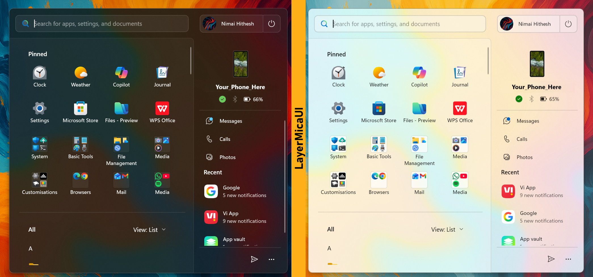

# LayerMicaUI theme for Windows 11 Start Menu Styler
**Author** :  [Nimai-HK](https://github.com/Nimai-HK)

LayerMicaUI is a theme with reimagined layouts for the new Windows 11 25H2 Start Menu.



> [!IMPORTANT]
This theme is designed for the [redesigned Windows 11 Start menu](https://microsoft.design/articles/start-fresh-redesigning-windows-start-menu/) that is gradually rolling out with the 25H2 update.

## Notes
- This theme works best on Windows 11 **25H2** and later.
- Works on devices with a screen resolution of 1280x720 and above.
- Ideal resolution and scale: 1920x1080 at 125%
- This theme works well with displays having an aspect ratio of **16:9** at 125% scale
- This theme places the start menu wherever the taskbar is aligned.
- This theme combines the start menu with the Phone Link panel and will only work on the 'New Windows 11 Start Menu'.
- Compatible with both light and dark modes.

---

## Theme selection

The theme is integrated into the mod and can be selected directly from the mod's
settings:

* Open the Windows 11 Start Menu Styler mod in Windhawk.
* Go to the "Settings" tab.
* Select the theme and save the settings.

## Manual installation

The theme styles can also be imported manually. To do that, follow these steps:

* Open the Windows 11 Start Menu Styler mod in Windhawk.
* Go to the "Advanced" tab.
* Copy the content below to the text box under "Mod settings" and click "Save".

<details>
<summary> Content to import (click to expand)</summary>

```json
{
    "theme":"",
    "disableNewStartMenuLayout":0,
    "controlStyles[0].target":"StartMenu.StartHome",
    "controlStyles[0].styles[0]":"Width=450",
    "controlStyles[0].styles[1]":"Margin=-240,10,0,-45",
    "controlStyles[1].target":"Windows.UI.Xaml.Controls.Grid#SuggestionsParentContainer",
    "controlStyles[1].styles[0]":"Visibility=Collapsed",
    "controlStyles[2].target":"StartDocked.PowerOptionsView",
    "controlStyles[2].styles[0]":"Margin=0,-1255,-35,0",
    "controlStyles[3].target":"Windows.UI.Xaml.Controls.SemanticZoom#ZoomControl",
    "controlStyles[3].styles[0]":"IsZoomOutButtonEnabled=true",
    "controlStyles[4].target":"StartMenu.SearchBoxToggleButton#SearchBoxToggleButton",
    "controlStyles[4].styles[0]":"Height=40",
    "controlStyles[4].styles[1]":"Margin=-18,-3,204,-10",
    "controlStyles[5].target":"StartMenu.PinnedList#StartMenuPinnedList",
    "controlStyles[5].styles[0]":"Margin=10,0,0,0",
    "controlStyles[5].styles[1]":"Height=Auto",
    "controlStyles[5].styles[2]":"MinHeight:=200",
    "controlStyles[5].styles[3]":"MaxHeight:=1000",
    "controlStyles[5].styles[4]":"Width=450",
    "controlStyles[6].target":"Windows.UI.Xaml.Controls.Grid#TopLevelSuggestionsListHeader",
    "controlStyles[6].styles[0]":"Visibility=Collapsed",
    "controlStyles[7].target":"Border#AcrylicBorder",
    "controlStyles[7].styles[0]":"CornerRadius=10",
    "controlStyles[7].styles[1]":"BorderThickness=1",
    "controlStyles[8].target":"Border#AcrylicOverlay",
    "controlStyles[8].styles[0]":"BorderThickness=0,0.5,0.5,0",
    "controlStyles[8].styles[1]":"Margin=0,5,220,-65",
    "controlStyles[8].styles[2]":"CornerRadius=3,8,3,10",
    "controlStyles[8].styles[3]":"BorderBrush:=<AcrylicBrush TintColor=\"{ThemeResource SurfaceStrokeColorDefault}\" FallbackColor=\"{ThemeResource SurfaceStrokeColorDefault}\" TintOpacity=\".2\" TintLuminosityOpacity=\".3\" Opacity=\"1\"/>",
    "controlStyles[9].target":"StartDocked.PowerOptionsView > StartDocked.NavigationPaneButton > Grid > Border",
    "controlStyles[9].styles[0]":"CornerRadius=2,8,8,2",
    "controlStyles[9].styles[1]":"Margin=-1",
    "controlStyles[9].styles[2]":"BorderThickness=1.5",
    "controlStyles[9].styles[3]":"Background:=<SolidColorBrush Color=\"{ThemeResource ControlFillColorSecondary}\" Opacity=\"0.6\"/>",
    "controlStyles[9].styles[4]":"BorderBrush:=<AcrylicBrush TintColor=\"{ThemeResource SurfaceStrokeColorDefault}\" FallbackColor=\"{ThemeResource SurfaceStrokeColorDefault}\" TintOpacity=\".2\" TintLuminosityOpacity=\".3\" Opacity=\"1\"/>",
    "controlStyles[10].target":"StartDocked.UserTileView",
    "controlStyles[10].styles[0]":"Margin=390,-1255,-30,0",
    "controlStyles[11].target":"StartDocked.UserTileView > StartDocked.NavigationPaneButton > Grid > Border",
    "controlStyles[11].styles[0]":"Margin=5,-1,-8,-1",
    "controlStyles[11].styles[1]":"CornerRadius=8,2,2,8",
    "controlStyles[11].styles[2]":"Background:=<SolidColorBrush Color=\"{ThemeResource ControlFillColorSecondary}\" Opacity=\"0.8\"/>",
    "controlStyles[11].styles[3]":"BorderThickness=1",
    "controlStyles[11].styles[4]":"BorderBrush:=<AcrylicBrush TintColor=\"{ThemeResource SurfaceStrokeColorDefault}\" FallbackColor=\"{ThemeResource SurfaceStrokeColorDefault}\" TintOpacity=\".2\" TintLuminosityOpacity=\".3\" Opacity=\"1\"/>",
    "controlStyles[12].target":"StartMenu.SearchBoxToggleButton#SearchBoxToggleButton > Grid > Border",
    "controlStyles[12].styles[0]":"Background:=<SolidColorBrush Color=\"{ThemeResource ControlFillColorSecondary}\" Opacity=\"0.8\"/>",
    "controlStyles[12].styles[1]":"CornerRadius=8",
    "controlStyles[12].styles[2]":"BorderBrush:=<AcrylicBrush TintColor=\"{ThemeResource SurfaceStrokeColorDefault}\" FallbackColor=\"{ThemeResource SurfaceStrokeColorDefault}\" TintOpacity=\".2\" TintLuminosityOpacity=\".3\" Opacity=\"1\"/>",
    "controlStyles[13].target":"Windows.UI.Xaml.Controls.Border#ContentBorder > Windows.UI.Xaml.Controls.Grid#DroppedFlickerWorkaroundWrapper > Border@CommonStates",
    "controlStyles[13].styles[0]":"Margin=1",
    "controlStyles[14].target":"Border#TaskbarSearchBackground",
    "controlStyles[14].styles[0]":"CornerRadius=8",
    "controlStyles[14].styles[1]":"Background:=<SolidColorBrush Color=\"{ThemeResource ControlFillColorSecondary}\" Opacity=\"1\"/>",
    "controlStyles[14].styles[2]":"BorderThickness=1",
    "controlStyles[14].styles[3]":"BorderBrush:=<AcrylicBrush TintColor=\"{ThemeResource SurfaceStrokeColorDefault}\" FallbackColor=\"{ThemeResource SurfaceStrokeColorDefault}\" TintOpacity=\".2\" TintLuminosityOpacity=\".3\" Opacity=\"1\"/>",
    "controlStyles[15].target":"Cortana.UI.Views.RichSearchBoxControl#SearchBoxControl > Grid#RootGrid",
    "controlStyles[15].styles[0]":"CornerRadius=8",
    "controlStyles[16].target":"Windows.UI.Xaml.Controls.Grid#SearchBoxOnTaskbarGleamContainer",
    "controlStyles[16].styles[0]":"CornerRadius=6",
    "controlStyles[17].target":"Windows.UI.Xaml.Controls.Grid#SearchBoxOnTaskbarGleamImageContainer",
    "controlStyles[17].styles[0]":"CornerRadius=6",
    "controlStyles[18].target":"StartMenu.FolderModal#StartFolderModal > Grid#Root > Border",
    "controlStyles[18].styles[0]":"BorderThickness=2",
    "controlStyles[18].styles[1]":"Width=340",
    "controlStyles[18].styles[2]":"Height=350",
    "controlStyles[18].styles[3]":"BorderBrush:=<AcrylicBrush TintColor=\"{ThemeResource SurfaceStrokeColorDefault}\" FallbackColor=\"{ThemeResource SurfaceStrokeColorDefault}\" TintOpacity=\".2\" TintLuminosityOpacity=\".3\" Opacity=\"1\"/>",
    "controlStyles[19].target":"Windows.UI.Xaml.Controls.Grid#GridViewContainer",
    "controlStyles[19].styles[0]":"Width=360",
    "controlStyles[19].styles[1]":"Margin=0,0,-4,0",
    "controlStyles[20].target":"Windows.UI.Xaml.Controls.Grid#RightCompanionContainerGrid",
    "controlStyles[20].styles[0]":"Margin=-228,70,0,0",
    "controlStyles[20].styles[1]":"Width=225",
    "controlStyles[20].styles[2]":"Visibility=0",
    "controlStyles[21].target":"Windows.UI.Xaml.Controls.Primitives.ToggleButton#ShowHideCompanion",
    "controlStyles[21].styles[0]":"Visibility=1",
    "controlStyles[22].target":"Windows.UI.Xaml.Controls.TextBlock#ZoomedOutHeading",
    "controlStyles[22].styles[0]":"Visibility=1",
    "controlStyles[23].target":"Windows.UI.Xaml.Controls.Grid#FrameRoot",
    "controlStyles[23].styles[0]":"Height=auto",
    "controlStyles[23].styles[1]":"MinHeight=520",
    "controlStyles[23].styles[2]":"MaxHeight=720",
    "controlStyles[24].target":"Windows.UI.Xaml.Controls.Border#RightCompanionDropShadow",
    "controlStyles[24].styles[0]":"Visibility=1",
    "controlStyles[25].target":"StartMenu.StartMenuCompanion#RightCompanion > Windows.UI.Xaml.Controls.Grid#CompanionRoot > Windows.UI.Xaml.Controls.Border#AcrylicBorder",
    "controlStyles[25].styles[0]":"Background:=transparent",
    "controlStyles[25].styles[1]":"BorderThickness=0,1,0,1",
    "controlStyles[25].styles[2]":"Margin=15,170,15,60",
    "controlStyles[25].styles[3]":"CornerRadius=0",
    "controlStyles[25].styles[4]":"BorderBrush:=<AcrylicBrush TintColor=\"{ThemeResource SurfaceStrokeColorDefault}\" FallbackColor=\"{ThemeResource SurfaceStrokeColorDefault}\" TintOpacity=\".2\" TintLuminosityOpacity=\".3\" Opacity=\"0.7\"/>",
    "controlStyles[26].target":"Windows.UI.Xaml.Controls.Grid#MainMenu",
    "controlStyles[26].styles[0]":"Width=655",
    "controlStyles[27].target":"Windows.UI.Xaml.Controls.Border#StartDropShadow",
    "controlStyles[27].styles[0]":"Width=655",
    "controlStyles[28].target":"Windows.UI.Xaml.Controls.TextBlock#PinnedListHeaderText",
    "controlStyles[28].styles[0]":"Margin=56,-6,0,10",
    "controlStyles[29].target":"Windows.UI.Xaml.Controls.Grid#TopLevelHeader > Windows.UI.Xaml.Controls.Grid > Windows.UI.Xaml.Controls.Button",
    "controlStyles[29].styles[0]":"Visibility=1",
    "controlStyles[30].target":"Windows.UI.Xaml.Controls.ContentPresenter#ZoomedOutPresenter > Windows.UI.Xaml.Controls.ListView#ZoomedOutListView",
    "controlStyles[30].styles[0]":"Height=300",
    "controlStyles[31].target":"StartMenu.PinnedList#StartMenuPinnedList > Windows.UI.Xaml.Controls.Grid#Root > Windows.UI.Xaml.Controls.GridView#PinnedList > Windows.UI.Xaml.Controls.Border",
    "controlStyles[31].styles[0]":"BorderBrush:=<AcrylicBrush TintColor=\"{ThemeResource SurfaceStrokeColorDefault}\" FallbackColor=\"{ThemeResource SurfaceStrokeColorDefault}\" TintOpacity=\".2\" TintLuminosityOpacity=\".3\" Opacity=\"0.7\"/>",
    "controlStyles[31].styles[1]":"BorderThickness=0,0,0,1",
    "controlStyles[31].styles[2]":"CornerRadius=0",
    "controlStyles[31].styles[3]":"Padding=0,0,0,20",
    "controlStyles[32].target":"Microsoft.UI.Xaml.Controls.PipsPager#PipsPager",
    "controlStyles[32].styles[0]":"Margin=-30,-10,0,10",
    "controlStyles[33].target":"StartMenu.FolderModal#StartFolderModal > Grid",
    "controlStyles[33].styles[0]":"Margin=20,0,0,0",
    "webContentCustomJs": ""
}
```
</details>

---

## Common Issues and Fixes

*Causes:* Some elements of the Start Menu may not appear as intended with certain display settings.


- **Issue-1:** The user tile and power button may be displaced vertically.
-  **Fix:** Modify the margin values for the elements below.

   **Note:** *This also applies to cases where these tiles might not be visible in the menu.*

   <details>
   <summary> Styles to Modify (click to expand)</summary>

    ```json
    { 
      "controlStyles[2].target":"StartDocked.PowerOptionsView",
      "controlStyles[2].styles[0]":"Margin=0,-1255,-35,0",
    
      "controlStyles[10].target":"StartDocked.UserTileView",
      "controlStyles[10].styles[0]":"Margin=390,-1255,-30,0",
    }
    ```
     
   </details>


- **Issue-2:** The Start Menu appears too tall on larger displays.
- **Fix:** Modify the value of `"Height=.."` for a custom setting.

   **Note:** *To mitigate this issue to an extent, MaxHeight has been included in the theme.*
  
   <details>
   <summary> Styles to Modify (click to expand)</summary>

    ```json
    { 
    "controlStyles[23].target":"Windows.UI.Xaml.Controls.Grid#FrameRoot",
      "controlStyles[23].styles[0]":"Height=auto",
      "controlStyles[23].styles[1]":"MinHeight=520",
      "controlStyles[23].styles[2]":"MaxHeight=720",
    }
    ```
     
   </details>
