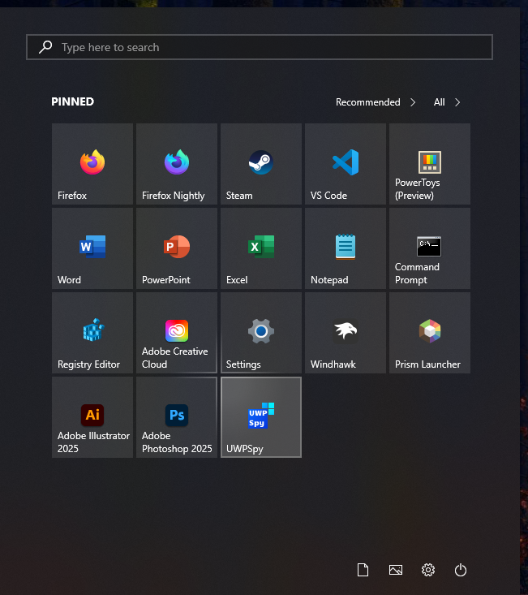

# LegacyFluent theme for Windows 11 Start Menu Styler

A theme that follows the old Fluent design from Windows 10.

**Author**: [SandTechStuff](https://github.com/SandTechStuff)



## Theme selection

The theme is integrated into the mod and can simply be selected from the mod's
settings:

* Open the Windows 11 Start Menu Styler mod in Windhawk.
* Go to the "Settings" tab.
* Select the theme and save the settings.

## Manual installation

The theme styles can also be imported manually. To do that, follow these steps:

* Open the Windows 11 Start Menu Styler mod in Windhawk.
* Go to the "Advanced" tab.
* Copy the content below to the text box under "Mod settings" and click "Save".

<details>
<summary>Content to import (click to expand)</summary>

```json
{
	"controlStyles[0].target": "Windows.UI.Xaml.Controls.GridViewItem > Windows.UI.Xaml.Controls.Border#ContentBorder@CommonStates > Windows.UI.Xaml.Controls.Grid#DroppedFlickerWorkaroundWrapper > Windows.UI.Xaml.Controls.Border#BackgroundBorder",
	"controlStyles[0].styles[0]": "BorderBrush:=<RevealBorderBrush Color=\"{ThemeResource SystemListLowColor}\" TargetTheme=\"1\" Opacity=\"1\" />",
	"controlStyles[0].styles[1]": "BorderThickness=2",
	"controlStyles[0].styles[2]": "CornerRadius=0",
	"controlStyles[0].styles[3]": "Background@PointerOver:=<RevealBorderBrush Color=\"{ThemeResource SystemChromeHighColor}\" TargetTheme=\"1\" Opacity=\"0.5\" FallbackColor=\"{ThemeResource SystemListLowColor}\"/>",
	"controlStyles[0].styles[4]": "Background:=<SolidColorBrush Color=\"{ThemeResource SystemListLowColor}\" Opacity=\"1\"/>",
	"controlStyles[0].styles[5]": "BorderBrush@PointerOver:=<RevealBorderBrush Color=\"{ThemeResource SystemChromeHighColor}\" TargetTheme=\"1\" Opacity=\"1\" />",
	"controlStyles[0].styles[6]": "Background@Pressed:=<RevealBorderBrush Color=\"{ThemeResource SystemChromeHighColor}\" TargetTheme=\"1\" Opacity=\"0.6\" FallbackColor=\"{ThemeResource SystemListLowColor}\"/>",
	"controlStyles[0].styles[7]": "BorderBrush@Pressed:=<RevealBorderBrush Color=\"{ThemeResource SystemChromeHighColor}\" TargetTheme=\"1\" Opacity=\"1\" />",
	"controlStyles[1].target": "Windows.UI.Xaml.Controls.GridViewItem",
	"controlStyles[1].styles[0]": "Width=100",
	"controlStyles[1].styles[2]": "Margin=2",
	"controlStyles[1].styles[1]": "Height=100",
	"controlStyles[2].target": "Windows.UI.Xaml.Controls.ItemsWrapGrid",
	"controlStyles[2].styles[0]": "HorizontalAlignment=Center",
	"controlStyles[3].target": "Windows.UI.Xaml.Controls.Grid#TopLevelSuggestionsListHeader",
	"controlStyles[3].styles[0]": "Visibility=Collapsed",
	"controlStyles[4].target": "Windows.UI.Xaml.Controls.Grid#NoTopLevelSuggestionsText",
	"controlStyles[4].styles[0]": "Height=0",
	"controlStyles[5].target": "Windows.UI.Xaml.Controls.Grid#ShowMoreSuggestions",
	"controlStyles[5].styles[0]": "RenderTransform:=<TranslateTransform Y=\"-586\" X=\"-55\" />",
	"controlStyles[6].target": "StartMenu.PinnedList",
	"controlStyles[6].styles[0]": "Height=518",
	"controlStyles[7].target": "Windows.UI.Xaml.Controls.Grid#ShowMoreSuggestions > Windows.UI.Xaml.Controls.Button > Windows.UI.Xaml.Controls.ContentPresenter > Windows.UI.Xaml.Controls.StackPanel > Windows.UI.Xaml.Controls.TextBlock",
	"controlStyles[7].styles[0]": "Text=Recommended",
	"controlStyles[8].target": "StartMenu.PinnedListTile > Windows.UI.Xaml.Controls.Grid > Windows.UI.Xaml.Controls.Grid#DisplayNameAndDownloadIconContainer > Windows.UI.Xaml.Controls.TextBlock#DisplayName",
	"controlStyles[8].styles[0]": "Margin=4,0,0,2",
	"controlStyles[8].styles[1]": "TextAlignment=1",
	"controlStyles[9].target": "StartMenu.PinnedListTile > Windows.UI.Xaml.Controls.Grid > Windows.UI.Xaml.Controls.Grid#DisplayNameAndDownloadIconContainer",
	"controlStyles[9].styles[0]": "HorizontalAlignment=1",
	"controlStyles[9].styles[1]": "Width=95",
	"controlStyles[9].styles[2]": "Margin=0",
	"controlStyles[9].styles[3]": "VerticalAlignment=2",
	"controlStyles[10].target": "StartMenu.PinnedListTile > Windows.UI.Xaml.Controls.Grid > Windows.UI.Xaml.Controls.Grid#LogoContainer",
	"controlStyles[10].styles[0]": "Margin=0,17,0,0",
	"controlStyles[11].target": "Windows.UI.Xaml.Controls.Grid#DroppedFlickerWorkaroundWrapper > Windows.UI.Xaml.Controls.ContentPresenter#ContentPresenter > Windows.UI.Xaml.Controls.Grid",
	"controlStyles[11].styles[0]": "Height=95",
	"controlStyles[11].styles[1]": "Width=100",
	"controlStyles[12].target": "Windows.UI.Xaml.Controls.TextBlock#PinnedListHeaderText",
	"controlStyles[12].styles[0]": "Text=PINNED",
	"controlStyles[12].styles[1]": "FontWeight=Bold",
	"controlStyles[13].target": "StartDocked.AppListView#NavigationPanePlacesListView > Windows.UI.Xaml.Controls.Border > Windows.UI.Xaml.Controls.ScrollViewer > Windows.UI.Xaml.Controls.Border > Windows.UI.Xaml.Controls.Grid > Windows.UI.Xaml.Controls.ScrollContentPresenter > Windows.UI.Xaml.Controls.ItemsPresenter > Windows.UI.Xaml.Controls.ItemsStackPanel > StartDocked.AppListViewItem > Windows.UI.Xaml.Controls.Grid@CommonStates > Windows.UI.Xaml.Controls.Border",
	"controlStyles[13].styles[0]": "Background@PointerOver:=<RevealBorderBrush Color=\"{ThemeResource SystemChromeHighColor}\" TargetTheme=\"1\" Opacity=\"0.5\" FallbackColor=\"{ThemeResource SystemListLowColor}\"/>",
	"controlStyles[13].styles[1]": "BorderThickness=1",
	"controlStyles[13].styles[2]": "CornerRadius=0",
	"controlStyles[13].styles[3]": "Background@PointerOver:=<RevealBorderBrush Color=\"{ThemeResource SystemListLowColor}\" TargetTheme=\"1\" Opacity=\"0.5\" FallbackColor=\"{ThemeResource SystemListLowColor}\"/>",
	"controlStyles[13].styles[4]": "Background@Pressed:=<RevealBorderBrush Color=\"{ThemeResource SystemChromeHighColor}\" TargetTheme=\"1\" Opacity=\"0.6\" FallbackColor=\"{ThemeResource SystemListLowColor}\"/>",
	"controlStyles[13].styles[5]": "BorderBrush:=<RevealBorderBrush Color=\"Transparent\" TargetTheme=\"1\" Opacity=\"1\" />",
	"controlStyles[14].target": "Windows.UI.Xaml.Controls.Border#AcrylicBorder",
	"controlStyles[14].styles[0]": "CornerRadius=0",
	"controlStyles[14].styles[1]": "BorderThickness=0",
	"controlStyles[15].target": "Windows.UI.Xaml.Controls.Border#AcrylicOverlay",
	"controlStyles[15].styles[0]": "Visibility=Collapsed",
	"controlStyles[16].target": "StartDocked.StartSizingFrame",
	"controlStyles[16].styles[0]": "Margin=-13,13,0,0",
	"controlStyles[17].target": "StartDocked.NavigationPaneButton#PowerButton > Windows.UI.Xaml.Controls.Grid@CommonStates > Windows.UI.Xaml.Controls.Border",
	"controlStyles[17].styles[0]": "Background@PointerOver:=<RevealBorderBrush Color=\"{ThemeResource SystemChromeHighColor}\" TargetTheme=\"1\" Opacity=\"0.5\" FallbackColor=\"{ThemeResource SystemListLowColor}\"/>",
	"controlStyles[17].styles[1]": "BorderThickness=1",
	"controlStyles[17].styles[2]": "CornerRadius=0",
	"controlStyles[17].styles[3]": "Background@PointerOver:=<RevealBorderBrush Color=\"{ThemeResource SystemListLowColor}\" TargetTheme=\"1\" Opacity=\"0.5\" FallbackColor=\"{ThemeResource SystemListLowColor}\"/>",
	"controlStyles[17].styles[4]": "Background@Pressed:=<RevealBorderBrush Color=\"{ThemeResource SystemChromeHighColor}\" TargetTheme=\"1\" Opacity=\"0.6\" FallbackColor=\"{ThemeResource SystemListLowColor}\"/>",
	"controlStyles[17].styles[5]": "BorderBrush:=<RevealBorderBrush Color=\"Transparent\" TargetTheme=\"1\" Opacity=\"1\" />",
	"controlStyles[18].target": "StartDocked.NavigationPaneButton#UserTileButton > Windows.UI.Xaml.Controls.Grid@CommonStates > Windows.UI.Xaml.Controls.Border",
	"controlStyles[18].styles[0]": "Background@PointerOver:=<RevealBorderBrush Color=\"{ThemeResource SystemChromeHighColor}\" TargetTheme=\"1\" Opacity=\"0.5\" FallbackColor=\"{ThemeResource SystemListLowColor}\"/>",
	"controlStyles[18].styles[1]": "BorderThickness=1",
	"controlStyles[18].styles[2]": "CornerRadius=0",
	"controlStyles[18].styles[3]": "Background@PointerOver:=<RevealBorderBrush Color=\"{ThemeResource SystemListLowColor}\" TargetTheme=\"1\" Opacity=\"0.5\" FallbackColor=\"{ThemeResource SystemListLowColor}\"/>",
	"controlStyles[18].styles[4]": "Background@Pressed:=<RevealBorderBrush Color=\"{ThemeResource SystemChromeHighColor}\" TargetTheme=\"1\" Opacity=\"0.6\" FallbackColor=\"{ThemeResource SystemListLowColor}\"/>",
	"controlStyles[18].styles[5]": "BorderBrush:=<RevealBorderBrush Color=\"Transparent\" TargetTheme=\"1\" Opacity=\"1\" />",
	"controlStyles[19].target": "StartDocked.SearchBoxToggleButton > Windows.UI.Xaml.Controls.Grid@CommonStates > Windows.UI.Xaml.Controls.Border",
	"controlStyles[19].styles[0]": "CornerRadius=0",
	"controlStyles[19].styles[1]": "Background:=<SolidColorBrush Color=\"{ThemeResource SystemChromeLowColor}\" Opacity=\"0.5\"/>",
	"controlStyles[19].styles[2]": "BorderThickness=2",
	"controlStyles[19].styles[3]": "BorderBrush:=<SolidColorBrush Color=\"{ThemeResource SystemListMediumColor}\"/>",
	"controlStyles[19].styles[4]": "BorderBrush@PointerOver:=<SolidColorBrush Color=\"{ThemeResource SystemChromeHighColor}\"/>",
	"controlStyles[19].styles[5]": "BorderBrush@CheckedPointerOver:=<SolidColorBrush Color=\"{ThemeResource SystemChromeHighColor}\"/>",
	"controlStyles[20].target": "Windows.UI.Xaml.Controls.Image#SearchIconOn",
	"controlStyles[20].styles[0]": "Visibility=Collapsed",
	"controlStyles[21].target": "Windows.UI.Xaml.Controls.Image#SearchIconOff",
	"controlStyles[21].styles[0]": "Visibility=Collapsed",
	"controlStyles[22].target": "Windows.UI.Xaml.Controls.FontIcon#SearchGlyph",
	"controlStyles[22].styles[0]": "Visibility=Visible",
	"controlStyles[23].target": "Windows.UI.Xaml.Controls.TextBlock#PlaceholderText",
	"controlStyles[23].styles[0]": "Text=Type here to search",
	"controlStyles[24].target": "Windows.UI.Xaml.Controls.Button > Windows.UI.Xaml.Controls.ContentPresenter@CommonStates",
	"controlStyles[24].styles[0]": "Background@PointerOver:=<RevealBorderBrush Color=\"{ThemeResource SystemChromeHighColor}\" TargetTheme=\"1\" Opacity=\"0.5\" FallbackColor=\"{ThemeResource SystemListLowColor}\"/>",
	"controlStyles[24].styles[1]": "BorderThickness=1",
	"controlStyles[24].styles[2]": "CornerRadius=0",
	"controlStyles[24].styles[3]": "Background@PointerOver:=<RevealBorderBrush Color=\"{ThemeResource SystemListLowColor}\" TargetTheme=\"1\" Opacity=\"0.5\" FallbackColor=\"{ThemeResource SystemListLowColor}\"/>",
	"controlStyles[24].styles[4]": "Background@Pressed:=<RevealBorderBrush Color=\"{ThemeResource SystemChromeHighColor}\" TargetTheme=\"1\" Opacity=\"0.6\" FallbackColor=\"{ThemeResource SystemListLowColor}\"/>",
	"controlStyles[24].styles[5]": "BorderBrush:=<RevealBorderBrush Color=\"Transparent\" TargetTheme=\"1\" Opacity=\"1\" />",
	"controlStyles[24].styles[6]": "Background=Transparent",
	"controlStyles[24].styles[7]": "Height=30",
	"controlStyles[25].target": "StartDocked.AllAppsGridListViewItem > Windows.UI.Xaml.Controls.StackPanel > Windows.UI.Xaml.Controls.Button#Header > Windows.UI.Xaml.Controls.Border@CommonStates",
	"controlStyles[25].styles[0]": "Background@PointerOver:=<RevealBorderBrush Color=\"{ThemeResource SystemChromeHighColor}\" TargetTheme=\"1\" Opacity=\"0.5\" FallbackColor=\"{ThemeResource SystemListLowColor}\"/>",
	"controlStyles[25].styles[1]": "BorderThickness=1",
	"controlStyles[25].styles[2]": "CornerRadius=0",
	"controlStyles[25].styles[3]": "Background@PointerOver:=<RevealBorderBrush Color=\"{ThemeResource SystemListLowColor}\" TargetTheme=\"1\" Opacity=\"0.5\" FallbackColor=\"{ThemeResource SystemListLowColor}\"/>",
	"controlStyles[25].styles[4]": "Background@Pressed:=<RevealBorderBrush Color=\"{ThemeResource SystemChromeHighColor}\" TargetTheme=\"1\" Opacity=\"0.6\" FallbackColor=\"{ThemeResource SystemListLowColor}\"/>",
	"controlStyles[25].styles[5]": "BorderBrush@PointerOver:=<RevealBorderBrush Color=\"Transparent\" TargetTheme=\"1\" Opacity=\"1\" />",
	"controlStyles[25].styles[6]": "Background=Transparent",
	"controlStyles[25].styles[7]": "BorderBrush@Pressed:=<RevealBorderBrush Color=\"Transparent\" TargetTheme=\"1\" Opacity=\"1\" />",
	"controlStyles[26].target": "StartDocked.AllAppsGridListViewItem > Windows.UI.Xaml.Controls.Grid@CommonStates > Windows.UI.Xaml.Controls.Border#BorderBackground",
	"controlStyles[26].styles[0]": "BorderThickness=1",
	"controlStyles[26].styles[1]": "CornerRadius=0",
	"controlStyles[26].styles[2]": "Background@PointerOver:=<RevealBorderBrush Color=\"{ThemeResource SystemListLowColor}\" TargetTheme=\"1\" Opacity=\"0.5\" FallbackColor=\"{ThemeResource SystemListLowColor}\"/>",
	"controlStyles[26].styles[3]": "Background@Pressed:=<RevealBorderBrush Color=\"{ThemeResource SystemChromeHighColor}\" TargetTheme=\"1\" Opacity=\"0.6\" FallbackColor=\"{ThemeResource SystemListLowColor}\"/>",
	"controlStyles[26].styles[4]": "BorderBrush@PointerOver:=<RevealBorderBrush Color=\"Transparent\" TargetTheme=\"1\" Opacity=\"1\" />",
	"controlStyles[26].styles[5]": "Background=Transparent",
	"controlStyles[26].styles[6]": "BorderBrush@Pressed:=<RevealBorderBrush Color=\"Transparent\" TargetTheme=\"1\" Opacity=\"1\" />",
	"controlStyles[27].target": "Windows.UI.Xaml.Controls.TextBlock#AllAppsHeading",
	"controlStyles[27].styles[0]": "Text=ALL",
	"controlStyles[27].styles[1]": "FontWeight=Bold",
	"controlStyles[28].target": "Windows.UI.Xaml.Controls.TextBlock#StatusMessage[Text=System]",
	"controlStyles[28].styles[0]": "Visibility=Collapsed",
	"controlStyles[29].target": "Windows.UI.Xaml.Controls.Grid#Root > Windows.UI.Xaml.Controls.Grid#VerticalRoot > Windows.UI.Xaml.Controls.Primitives.Thumb > Windows.UI.Xaml.Shapes.Rectangle#ThumbVisual",
	"controlStyles[29].styles[0]": "RadiusX=0",
	"controlStyles[29].styles[1]": "RadiusY=0",
	"controlStyles[29].styles[2]": "Margin=0,0,0,0",
	"controlStyles[30].target": "Windows.UI.Xaml.Shapes.Rectangle#VerticalTrackRect",
	"controlStyles[30].styles[0]": "RadiusX=0",
	"controlStyles[30].styles[1]": "RadiusY=0",
	"controlStyles[31].target": "Windows.UI.Xaml.Controls.Primitives.RepeatButton#VerticalSmallIncrease > Windows.UI.Xaml.Controls.Grid > Windows.UI.Xaml.Controls.FontIcon#Arrow > Windows.UI.Xaml.Controls.Grid > Windows.UI.Xaml.Controls.TextBlock",
	"controlStyles[31].styles[0]": "Text=",
	"controlStyles[32].target": "Windows.UI.Xaml.Controls.Primitives.RepeatButton#VerticalSmallDecrease > Windows.UI.Xaml.Controls.Grid > Windows.UI.Xaml.Controls.FontIcon#Arrow > Windows.UI.Xaml.Controls.Grid > Windows.UI.Xaml.Controls.TextBlock",
	"controlStyles[32].styles[0]": "Text=",
	"controlStyles[33].target": "StartDocked.AllAppsZoomListViewItem > Windows.UI.Xaml.Controls.Grid#ContentBorder@CommonStates > Windows.UI.Xaml.Controls.Border",
	"controlStyles[33].styles[0]": "Background@PointerOver:=<RevealBorderBrush Color=\"{ThemeResource SystemListLowColor}\" TargetTheme=\"1\" Opacity=\"0.5\" FallbackColor=\"{ThemeResource SystemListLowColor}\"/>",
	"controlStyles[33].styles[1]": "BorderThickness=1",
	"controlStyles[33].styles[2]": "CornerRadius=0",
	"controlStyles[33].styles[3]": "Background@Pressed:=<RevealBorderBrush Color=\"{ThemeResource SystemChromeHighColor}\" TargetTheme=\"1\" Opacity=\"0.6\" FallbackColor=\"{ThemeResource SystemListLowColor}\"/>",
	"controlStyles[33].styles[4]": "BorderBrush@PointerOver:=<RevealBorderBrush Color=\"Transparent\" TargetTheme=\"1\" Opacity=\"1\" />",
	"controlStyles[33].styles[5]": "BorderBrush@Pressed:=<RevealBorderBrush Color=\"Transparent\" TargetTheme=\"1\" Opacity=\"1\" />",
	"controlStyles[33].styles[6]": "Background=Transparent",
	"controlStyles[33].styles[7]": "BorderBrush:=<RevealBorderBrush Color=\"Transparent\" TargetTheme=\"1\" Opacity=\"1\" />",
	"controlStyles[33].styles[8]": "BorderThickness@PointerOver=2",
	"controlStyles[33].styles[9]": "BorderThickness@Pressed=2",
	"controlStyles[34].target": "StartDocked.AllAppsZoomListViewItem > Windows.UI.Xaml.Controls.Grid#ContentBorder@DisabledStates > Windows.UI.Xaml.Controls.Border",
	"controlStyles[34].styles[0]": "RenderTransform@Disabled:=<ScaleTransform ScaleX=\"0\" ScaleY=\"0\" CenterX=\"0.5\" CenterY=\"0.5\" />",
	"controlStyles[35].target": "Windows.UI.Xaml.Controls.Border#LayerBorder",
	"controlStyles[35].styles[0]": "Visibility=Collapsed",
	"controlStyles[36].target": "Cortana.UI.Views.TaskbarSearchPage",
	"controlStyles[36].styles[0]": "RenderTransform:=<TranslateTransform X=\"-13\" Y=\"1\" />",
	"controlStyles[37].target": "Windows.UI.Xaml.Controls.Border#TaskbarMargin",
	"controlStyles[37].styles[0]": "Visibility=Collapsed",
	"controlStyles[38].target": "Windows.UI.Xaml.Controls.Border#AppBorder",
	"controlStyles[38].styles[0]": "CornerRadius=0",
	"controlStyles[38].styles[1]": "BorderThickness=0",
	"controlStyles[39].target": "Windows.UI.Xaml.Controls.Border#dropshadow",
	"controlStyles[39].styles[0]": "CornerRadius=0",
	"controlStyles[40].target": "Windows.UI.Xaml.Controls.Grid#RootGrid@SearchBoxInputStates > Windows.UI.Xaml.Controls.Border#TaskbarSearchBackground",
	"controlStyles[40].styles[0]": "CornerRadius=0",
	"controlStyles[40].styles[1]": "Background:=<SolidColorBrush Color=\"{ThemeResource SystemChromeLowColor}\" Opacity=\"0.5\"/>",
	"controlStyles[40].styles[2]": "BorderThickness=2",
	"controlStyles[40].styles[3]": "BorderBrush:=<SolidColorBrush Color=\"{ThemeResource SystemListMediumColor}\"/>",
	"controlStyles[40].styles[4]": "BorderBrush@SearchBoxHover:=<SolidColorBrush Color=\"{ThemeResource SystemChromeHighColor}\"/>",
	"controlStyles[40].styles[5]": "BorderBrush@FindInStartSearchBoxHover:=<SolidColorBrush Color=\"{ThemeResource SystemChromeHighColor}\"/>",
	"controlStyles[40].styles[6]": "Margin=25,37,21,15",
	"controlStyles[41].target": "Windows.UI.Xaml.Controls.Button#SearchGlyphContainer",
	"controlStyles[41].styles[0]": "Visibility=Visible",
	"controlStyles[42].target": "Microsoft.UI.Xaml.Controls.AnimatedIcon#SearchIconPlayer",
	"controlStyles[42].styles[0]": "Visibility=Collapsed",
	"controlStyles[43].target": "Windows.UI.Xaml.Controls.TextBlock#MoreSuggestionsListHeaderText",
	"controlStyles[43].styles[0]": "Text=RECOMMENDED",
	"controlStyles[43].styles[1]": "FontWeight=Bold",
	"controlStyles[44].target": "Windows.UI.Xaml.Controls.ListView#RecommendedList > Windows.UI.Xaml.Controls.Border > Windows.UI.Xaml.Controls.ScrollViewer > Windows.UI.Xaml.Controls.Border > Windows.UI.Xaml.Controls.Grid > Windows.UI.Xaml.Controls.ScrollContentPresenter > Windows.UI.Xaml.Controls.ItemsPresenter > Windows.UI.Xaml.Controls.ItemsStackPanel > Windows.UI.Xaml.Controls.ListViewItem > Windows.UI.Xaml.Controls.Grid@CommonStates > Windows.UI.Xaml.Controls.Border",
	"controlStyles[44].styles[0]": "BorderThickness=1",
	"controlStyles[44].styles[1]": "CornerRadius=0",
	"controlStyles[44].styles[2]": "Background@PointerOver:=<RevealBorderBrush Color=\"{ThemeResource SystemListLowColor}\" TargetTheme=\"1\" Opacity=\"0.5\" FallbackColor=\"{ThemeResource SystemListLowColor}\"/>",
	"controlStyles[44].styles[3]": "Background@Pressed:=<RevealBorderBrush Color=\"{ThemeResource SystemChromeHighColor}\" TargetTheme=\"1\" Opacity=\"0.6\" FallbackColor=\"{ThemeResource SystemListLowColor}\"/>",
	"controlStyles[44].styles[4]": "BorderBrush@PointerOver:=<RevealBorderBrush Color=\"Transparent\" TargetTheme=\"1\" Opacity=\"1\" />",
	"controlStyles[44].styles[5]": "Background=Transparent",
	"controlStyles[44].styles[6]": "BorderBrush@Pressed:=<RevealBorderBrush Color=\"Transparent\" TargetTheme=\"1\" Opacity=\"1\" />",
	"controlStyles[45].target": "Windows.UI.Xaml.Controls.ToolTip",
	"controlStyles[45].styles[0]": "CornerRadius=0",
	"controlStyles[46].target": "Windows.UI.Xaml.Controls.MenuFlyoutPresenter > Windows.UI.Xaml.Controls.Border",
	"controlStyles[46].styles[0]": "CornerRadius=0",
	"controlStyles[47].target": "Windows.UI.Xaml.Controls.TextBlock",
	"controlStyles[47].styles[0]": "FontFamily=Segoe UI, Segoe MDL2 Assets",
	"controlStyles[48].target": "Windows.UI.Xaml.Controls.FontIcon > Windows.UI.Xaml.Controls.Grid > Windows.UI.Xaml.Controls.TextBlock",
	"controlStyles[48].styles[0]": "FontFamily=Segoe MDL2 Assets, Segoe UI",
	"controlStyles[49].target": "Windows.UI.Xaml.Controls.MenuFlyoutItem",
	"controlStyles[49].styles[0]": "CornerRadius=0",
	"controlStyles[50].target": "Windows.UI.Xaml.Controls.ListViewItem",
	"controlStyles[50].styles[0]": "CornerRadius=0",
	"controlStyles[51].target": "Windows.UI.Xaml.Controls.Button#HideMoreSuggestionsButton > Windows.UI.Xaml.Controls.ContentPresenter#ContentPresenter > Windows.UI.Xaml.Controls.StackPanel > Windows.UI.Xaml.Controls.FontIcon > Windows.UI.Xaml.Controls.Grid > Windows.UI.Xaml.Controls.TextBlock",
	"controlStyles[51].styles[0]": "FontSize=10",
	"webContentStyles[0].target": "#chatButtonRight",
	"webContentStyles[0].styles[0]": "display: none !important",
	"webContentStyles[1].target": ".groupTitle",
	"webContentStyles[1].styles[0]": "text-transform: uppercase !important",
	"webContentStyles[1].styles[1]": "font-weight: bold !important",
	"webContentStyles[2].target": "div, span, h1, h2, h3, h4, h5, p",
	"webContentStyles[2].styles[0]": "font-family: Segoe UI !important",
	"webContentStyles[3].target": ".cortanaFontIcon, .iconContent",
	"webContentStyles[3].styles[0]": "font-family: Segoe MDL2 Assets !important"
}
```
</details>
