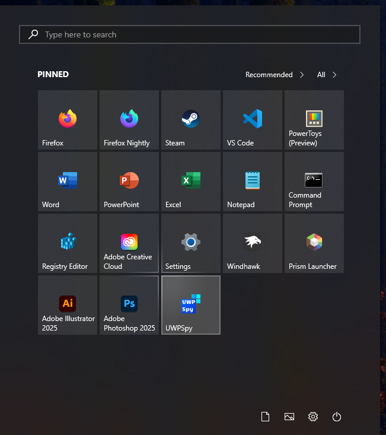

# LegacyFluent theme for Windows 11 Start Menu Styler

A theme that follows the old Fluent design from Windows 10.

**Author**: [SandTechStuff](https://github.com/SandTechStuff)



## Theme selection

The theme is integrated into the mod and can be selected directly from the mod's
settings:

* Open the Windows 11 Start Menu Styler mod in Windhawk.
* Go to the "Settings" tab.
* Select the theme and save the settings.

## Manual installation

The theme styles can also be imported manually. To do that, follow these steps:

* Open the Windows 11 Start Menu Styler mod in Windhawk.
* Go to the "Settings" tab and select "Textual mode".
* Copy the content below to the text box and click "Save settings".

### Redesigned Start menu

A variant for the [redesigned Windows 11 Start
menu](https://microsoft.design/articles/start-fresh-redesigning-windows-start-menu/)
that is slowly rolling out in the 25H2 update.

<details>
<summary>Content to import (click to expand)</summary>

```yaml
controlStyles:
  - target: GridView#PinnedList > Border > ScrollViewer > Border > Grid > Windows.UI.Xaml.Controls.ScrollContentPresenter > ItemsPresenter > ItemsWrapGrid > Windows.UI.Xaml.Controls.GridViewItem > Windows.UI.Xaml.Controls.Border#ContentBorder@CommonStates > Windows.UI.Xaml.Controls.Grid#DroppedFlickerWorkaroundWrapper
    styles:
      - BorderBrush:=<RevealBorderBrush Color="{ThemeResource SystemListLowColor}" TargetTheme="1" Opacity="1" />
      - BorderThickness=1.5
      - CornerRadius=0
      - Background@PointerOver:=<RevealBorderBrush Color="{ThemeResource SystemChromeHighColor}" TargetTheme="1" Opacity="0.5" FallbackColor="{ThemeResource SystemListLowColor}"/>
      - Background:=<SolidColorBrush Color="{ThemeResource SystemListLowColor}" Opacity="1"/>
      - BorderBrush@PointerOver:=<RevealBorderBrush Color="{ThemeResource SystemChromeHighColor}" TargetTheme="1" Opacity="1" />
      - Background@Pressed:=<RevealBorderBrush Color="{ThemeResource SystemChromeHighColor}" TargetTheme="1" Opacity="0.6" FallbackColor="{ThemeResource SystemListLowColor}"/>
      - BorderBrush@Pressed:=<RevealBorderBrush Color="{ThemeResource SystemChromeHighColor}" TargetTheme="1" Opacity="1" />
  - target: Windows.UI.Xaml.Controls.GridView#PinnedList > Border > ScrollViewer > Border > Grid > ScrollContentPresenter > ItemsPresenter > ItemsWrapGrid > Windows.UI.Xaml.Controls.GridViewItem
    styles:
      - Width=100
      - Height=100
      - Margin=2
  - target: Windows.UI.Xaml.Controls.GridView#PinnedList > Border > ScrollViewer > Border > Grid > ScrollContentPresenter > ItemsPresenter > ItemsWrapGrid
    styles:
      - HorizontalAlignment=Center
  - target: Windows.UI.Xaml.Controls.Grid#TopLevelSuggestionsListHeader
    styles:
      - Visibility=Collapsed
  - target: Windows.UI.Xaml.Controls.Grid#NoTopLevelSuggestionsText
    styles:
      - Height=0
  - target: StartMenu.PinnedList
    styles:
      - Height=518
  - target: Windows.UI.Xaml.Controls.Grid#ShowMoreSuggestions > Windows.UI.Xaml.Controls.Button > Windows.UI.Xaml.Controls.ContentPresenter > Windows.UI.Xaml.Controls.StackPanel > Windows.UI.Xaml.Controls.TextBlock
    styles:
      - Text=Recommended
  - target: StartMenu.PinnedListTile > Windows.UI.Xaml.Controls.Grid > Windows.UI.Xaml.Controls.Grid#DisplayNameAndDownloadIconContainer > Windows.UI.Xaml.Controls.TextBlock#DisplayName
    styles:
      - Margin=4,0,0,2
      - TextAlignment=1
  - target: StartMenu.PinnedListTile > Windows.UI.Xaml.Controls.Grid > Windows.UI.Xaml.Controls.Grid#DisplayNameAndDownloadIconContainer
    styles:
      - HorizontalAlignment=1
      - Width=95
      - Margin=0
      - VerticalAlignment=2
  - target: StartMenu.PinnedListTile > Windows.UI.Xaml.Controls.Grid > Windows.UI.Xaml.Controls.Grid#LogoContainer
    styles:
      - Margin=0,17,0,0
  - target: Windows.UI.Xaml.Controls.Grid#DroppedFlickerWorkaroundWrapper > Windows.UI.Xaml.Controls.ContentPresenter#ContentPresenter > Windows.UI.Xaml.Controls.Grid
    styles:
      - Height=95
      - Width=100
  - target: Windows.UI.Xaml.Controls.TextBlock#PinnedListHeaderText
    styles:
      - Text=PINNED
      - FontWeight=Bold
      - Margin=78,-4,0,4
  - target: StartDocked.AppListView#NavigationPanePlacesListView > Windows.UI.Xaml.Controls.Border > Windows.UI.Xaml.Controls.ScrollViewer > Windows.UI.Xaml.Controls.Border > Windows.UI.Xaml.Controls.Grid > Windows.UI.Xaml.Controls.ScrollContentPresenter > Windows.UI.Xaml.Controls.ItemsPresenter > Windows.UI.Xaml.Controls.ItemsStackPanel > StartDocked.AppListViewItem > Windows.UI.Xaml.Controls.Grid@CommonStates > Windows.UI.Xaml.Controls.Border
    styles:
      - Background@PointerOver:=<RevealBorderBrush Color="{ThemeResource SystemChromeHighColor}" TargetTheme="1" Opacity="0.5" FallbackColor="{ThemeResource SystemListLowColor}"/>
      - BorderThickness=1
      - CornerRadius=0
      - Background@PointerOver:=<RevealBorderBrush Color="{ThemeResource SystemListLowColor}" TargetTheme="1" Opacity="0.5" FallbackColor="{ThemeResource SystemListLowColor}"/>
      - Background@Pressed:=<RevealBorderBrush Color="{ThemeResource SystemChromeHighColor}" TargetTheme="1" Opacity="0.6" FallbackColor="{ThemeResource SystemListLowColor}"/>
      - BorderBrush:=<RevealBorderBrush Color="Transparent" TargetTheme="1" Opacity="1" />
  - target: Windows.UI.Xaml.Controls.Border#AcrylicBorder
    styles:
      - CornerRadius=0
      - BorderThickness=0
  - target: Windows.UI.Xaml.Controls.Border#AcrylicOverlay
    styles:
      - Visibility=Collapsed
  - target: Grid#FrameRoot
    styles:
      - Margin=-13,0,0,-13
  - target: StartDocked.NavigationPaneButton#PowerButton > Windows.UI.Xaml.Controls.Grid@CommonStates > Windows.UI.Xaml.Controls.Border
    styles:
      - Background@PointerOver:=<RevealBorderBrush Color="{ThemeResource SystemChromeHighColor}" TargetTheme="1" Opacity="0.5" FallbackColor="{ThemeResource SystemListLowColor}"/>
      - BorderThickness=1
      - CornerRadius=0
      - Background@PointerOver:=<RevealBorderBrush Color="{ThemeResource SystemListLowColor}" TargetTheme="1" Opacity="0.5" FallbackColor="{ThemeResource SystemListLowColor}"/>
      - Background@Pressed:=<RevealBorderBrush Color="{ThemeResource SystemChromeHighColor}" TargetTheme="1" Opacity="0.6" FallbackColor="{ThemeResource SystemListLowColor}"/>
      - BorderBrush:=<RevealBorderBrush Color="Transparent" TargetTheme="1" Opacity="1" />
  - target: StartDocked.NavigationPaneButton#UserTileButton > Windows.UI.Xaml.Controls.Grid@CommonStates > Windows.UI.Xaml.Controls.Border
    styles:
      - Background@PointerOver:=<RevealBorderBrush Color="{ThemeResource SystemChromeHighColor}" TargetTheme="1" Opacity="0.5" FallbackColor="{ThemeResource SystemListLowColor}"/>
      - BorderThickness=1
      - CornerRadius=0
      - Background@PointerOver:=<RevealBorderBrush Color="{ThemeResource SystemListLowColor}" TargetTheme="1" Opacity="0.5" FallbackColor="{ThemeResource SystemListLowColor}"/>
      - Background@Pressed:=<RevealBorderBrush Color="{ThemeResource SystemChromeHighColor}" TargetTheme="1" Opacity="0.6" FallbackColor="{ThemeResource SystemListLowColor}"/>
      - BorderBrush:=<RevealBorderBrush Color="Transparent" TargetTheme="1" Opacity="1" />
  - target: StartMenu.SearchBoxToggleButton > Windows.UI.Xaml.Controls.Grid@CommonStates > Windows.UI.Xaml.Controls.Border
    styles:
      - CornerRadius=0
      - Background:=<SolidColorBrush Color="{ThemeResource SystemChromeLowColor}" Opacity="0.5"/>
      - BorderThickness=2
      - BorderBrush:=<SolidColorBrush Color="{ThemeResource SystemListMediumColor}"/>
      - BorderBrush@PointerOver:=<SolidColorBrush Color="{ThemeResource SystemChromeHighColor}"/>
      - BorderBrush@CheckedPointerOver:=<SolidColorBrush Color="{ThemeResource SystemChromeHighColor}"/>
  - target: Windows.UI.Xaml.Controls.Image#SearchIconOn
    styles:
      - Visibility=Collapsed
  - target: Windows.UI.Xaml.Controls.Image#SearchIconOff
    styles:
      - Visibility=Collapsed
  - target: Windows.UI.Xaml.Controls.FontIcon#SearchGlyph
    styles:
      - Visibility=Visible
  - target: Windows.UI.Xaml.Controls.TextBlock#PlaceholderText
    styles:
      - Text=Type here to search
  - target: Windows.UI.Xaml.Controls.Button > Windows.UI.Xaml.Controls.ContentPresenter@CommonStates
    styles:
      - Background@PointerOver:=<RevealBorderBrush Color="{ThemeResource SystemChromeHighColor}" TargetTheme="1" Opacity="0.5" FallbackColor="{ThemeResource SystemListLowColor}"/>
      - BorderThickness=1
      - CornerRadius=0
      - Background@PointerOver:=<RevealBorderBrush Color="{ThemeResource SystemListLowColor}" TargetTheme="1" Opacity="0.5" FallbackColor="{ThemeResource SystemListLowColor}"/>
      - Background@Pressed:=<RevealBorderBrush Color="{ThemeResource SystemChromeHighColor}" TargetTheme="1" Opacity="0.6" FallbackColor="{ThemeResource SystemListLowColor}"/>
      - BorderBrush:=<RevealBorderBrush Color="Transparent" TargetTheme="1" Opacity="1" />
      - Background=Transparent
      - Height=30
  - target: StartDocked.AllAppsGridListViewItem > Windows.UI.Xaml.Controls.StackPanel > Windows.UI.Xaml.Controls.Button#Header > Windows.UI.Xaml.Controls.Border@CommonStates
    styles:
      - Background@PointerOver:=<RevealBorderBrush Color="{ThemeResource SystemChromeHighColor}" TargetTheme="1" Opacity="0.5" FallbackColor="{ThemeResource SystemListLowColor}"/>
      - BorderThickness=1
      - CornerRadius=0
      - Background@PointerOver:=<RevealBorderBrush Color="{ThemeResource SystemListLowColor}" TargetTheme="1" Opacity="0.5" FallbackColor="{ThemeResource SystemListLowColor}"/>
      - Background@Pressed:=<RevealBorderBrush Color="{ThemeResource SystemChromeHighColor}" TargetTheme="1" Opacity="0.6" FallbackColor="{ThemeResource SystemListLowColor}"/>
      - BorderBrush@PointerOver:=<RevealBorderBrush Color="Transparent" TargetTheme="1" Opacity="1" />
      - Background=Transparent
      - BorderBrush@Pressed:=<RevealBorderBrush Color="Transparent" TargetTheme="1" Opacity="1" />
  - target: StartDocked.AllAppsGridListViewItem > Windows.UI.Xaml.Controls.Grid@CommonStates > Windows.UI.Xaml.Controls.Border#BorderBackground
    styles:
      - BorderThickness=1
      - CornerRadius=0
      - Background@PointerOver:=<RevealBorderBrush Color="{ThemeResource SystemListLowColor}" TargetTheme="1" Opacity="0.5" FallbackColor="{ThemeResource SystemListLowColor}"/>
      - Background@Pressed:=<RevealBorderBrush Color="{ThemeResource SystemChromeHighColor}" TargetTheme="1" Opacity="0.6" FallbackColor="{ThemeResource SystemListLowColor}"/>
      - BorderBrush@PointerOver:=<RevealBorderBrush Color="Transparent" TargetTheme="1" Opacity="1" />
      - Background=Transparent
      - BorderBrush@Pressed:=<RevealBorderBrush Color="Transparent" TargetTheme="1" Opacity="1" />
  - target: Windows.UI.Xaml.Controls.TextBlock#AllAppsHeading
    styles:
      - Text=ALL
      - FontWeight=Bold
  - target: Windows.UI.Xaml.Controls.TextBlock#StatusMessage[Text=System]
    styles:
      - Visibility=Collapsed
  - target: Windows.UI.Xaml.Controls.Grid#Root > Windows.UI.Xaml.Controls.Grid#VerticalRoot > Windows.UI.Xaml.Controls.Primitives.Thumb > Windows.UI.Xaml.Shapes.Rectangle#ThumbVisual
    styles:
      - RadiusX=0
      - RadiusY=0
      - Margin=0,0,0,0
  - target: Windows.UI.Xaml.Shapes.Rectangle#VerticalTrackRect
    styles:
      - RadiusX=0
      - RadiusY=0
  - target: Windows.UI.Xaml.Controls.Primitives.RepeatButton#VerticalSmallIncrease > Windows.UI.Xaml.Controls.Grid > Windows.UI.Xaml.Controls.FontIcon#Arrow > Windows.UI.Xaml.Controls.Grid > Windows.UI.Xaml.Controls.TextBlock
    styles:
      - Text=
  - target: Windows.UI.Xaml.Controls.Primitives.RepeatButton#VerticalSmallDecrease > Windows.UI.Xaml.Controls.Grid > Windows.UI.Xaml.Controls.FontIcon#Arrow > Windows.UI.Xaml.Controls.Grid > Windows.UI.Xaml.Controls.TextBlock
    styles:
      - Text=
  - target: StartDocked.AllAppsZoomListViewItem > Windows.UI.Xaml.Controls.Grid#ContentBorder@CommonStates > Windows.UI.Xaml.Controls.Border
    styles:
      - Background@PointerOver:=<RevealBorderBrush Color="{ThemeResource SystemListLowColor}" TargetTheme="1" Opacity="0.5" FallbackColor="{ThemeResource SystemListLowColor}"/>
      - BorderThickness=1
      - CornerRadius=0
      - Background@Pressed:=<RevealBorderBrush Color="{ThemeResource SystemChromeHighColor}" TargetTheme="1" Opacity="0.6" FallbackColor="{ThemeResource SystemListLowColor}"/>
      - BorderBrush@PointerOver:=<RevealBorderBrush Color="Transparent" TargetTheme="1" Opacity="1" />
      - BorderBrush@Pressed:=<RevealBorderBrush Color="Transparent" TargetTheme="1" Opacity="1" />
      - Background=Transparent
      - BorderBrush:=<RevealBorderBrush Color="Transparent" TargetTheme="1" Opacity="1" />
      - BorderThickness@PointerOver=2
      - BorderThickness@Pressed=2
  - target: StartDocked.AllAppsZoomListViewItem > Windows.UI.Xaml.Controls.Grid#ContentBorder@DisabledStates > Windows.UI.Xaml.Controls.Border
    styles:
      - RenderTransform@Disabled:=<ScaleTransform ScaleX="0" ScaleY="0" CenterX="0.5" CenterY="0.5" />
  - target: Windows.UI.Xaml.Controls.Border#LayerBorder
    styles:
      - Visibility=Collapsed
  - target: Cortana.UI.Views.TaskbarSearchPage
    styles:
      - RenderTransform:=<TranslateTransform X="-13" Y="1" />
  - target: Windows.UI.Xaml.Controls.Border#TaskbarMargin
    styles:
      - Visibility=Collapsed
  - target: Windows.UI.Xaml.Controls.Border#AppBorder
    styles:
      - CornerRadius=0
      - BorderThickness=0
  - target: Windows.UI.Xaml.Controls.Border#StartDropShadow
    styles:
      - CornerRadius=0
  - target: Windows.UI.Xaml.Controls.Grid#RootGrid@SearchBoxInputStates > Windows.UI.Xaml.Controls.Border#TaskbarSearchBackground
    styles:
      - CornerRadius=0
      - Background:=<SolidColorBrush Color="{ThemeResource SystemChromeLowColor}" Opacity="0.5"/>
      - BorderThickness=2
      - BorderBrush:=<SolidColorBrush Color="{ThemeResource SystemListMediumColor}"/>
      - BorderBrush@SearchBoxHover:=<SolidColorBrush Color="{ThemeResource SystemChromeHighColor}"/>
      - BorderBrush@FindInStartSearchBoxHover:=<SolidColorBrush Color="{ThemeResource SystemChromeHighColor}"/>
      - Margin=25,37,21,15
  - target: Windows.UI.Xaml.Controls.Button#SearchGlyphContainer
    styles:
      - Visibility=Visible
  - target: Microsoft.UI.Xaml.Controls.AnimatedIcon#SearchIconPlayer
    styles:
      - Visibility=Collapsed
  - target: Windows.UI.Xaml.Controls.TextBlock#MoreSuggestionsListHeaderText
    styles:
      - Text=RECOMMENDED
      - FontWeight=Bold
  - target: Windows.UI.Xaml.Controls.ListView#RecommendedList > Windows.UI.Xaml.Controls.Border > Windows.UI.Xaml.Controls.ScrollViewer > Windows.UI.Xaml.Controls.Border > Windows.UI.Xaml.Controls.Grid > Windows.UI.Xaml.Controls.ScrollContentPresenter > Windows.UI.Xaml.Controls.ItemsPresenter > Windows.UI.Xaml.Controls.ItemsStackPanel > Windows.UI.Xaml.Controls.ListViewItem > Windows.UI.Xaml.Controls.Grid@CommonStates > Windows.UI.Xaml.Controls.Border
    styles:
      - BorderThickness=1
      - CornerRadius=0
      - Background@PointerOver:=<RevealBorderBrush Color="{ThemeResource SystemListLowColor}" TargetTheme="1" Opacity="0.5" FallbackColor="{ThemeResource SystemListLowColor}"/>
      - Background@Pressed:=<RevealBorderBrush Color="{ThemeResource SystemChromeHighColor}" TargetTheme="1" Opacity="0.6" FallbackColor="{ThemeResource SystemListLowColor}"/>
      - BorderBrush@PointerOver:=<RevealBorderBrush Color="Transparent" TargetTheme="1" Opacity="1" />
      - Background=Transparent
      - BorderBrush@Pressed:=<RevealBorderBrush Color="Transparent" TargetTheme="1" Opacity="1" />
  - target: Windows.UI.Xaml.Controls.ToolTip
    styles:
      - CornerRadius=0
  - target: Windows.UI.Xaml.Controls.MenuFlyoutPresenter > Windows.UI.Xaml.Controls.Border
    styles:
      - //CornerRadius=0
      - Background:=<AcrylicBrush TintColor="#22848484" TintOpacity="0.2" Opacity="1"/>
      - BorderBrush:=<AcrylicBrush TintColor="#22848484" TintOpacity="0.2" Opacity="1"/>
      - BorderThickness=1
  - target: Windows.UI.Xaml.Controls.TextBlock
    styles:
      - FontFamily=Segoe UI, Segoe MDL2 Assets
  - target: Windows.UI.Xaml.Controls.FontIcon > Windows.UI.Xaml.Controls.Grid > Windows.UI.Xaml.Controls.TextBlock
    styles:
      - FontFamily=Segoe MDL2 Assets, Segoe UI
  - target: Windows.UI.Xaml.Controls.MenuFlyoutItem
    styles:
      - CornerRadius=0
  - target: Windows.UI.Xaml.Controls.ListViewItem
    styles:
      - CornerRadius=0
  - target: Windows.UI.Xaml.Controls.Button#HideMoreSuggestionsButton > Windows.UI.Xaml.Controls.ContentPresenter#ContentPresenter > Windows.UI.Xaml.Controls.StackPanel > Windows.UI.Xaml.Controls.FontIcon > Windows.UI.Xaml.Controls.Grid > Windows.UI.Xaml.Controls.TextBlock
    styles:
      - FontSize=10
  - target: Windows.UI.Xaml.Controls.Grid#ShowMoreSuggestions
    styles:
      - RenderTransform:=<TranslateTransform X="-18.5" Y="-586"/>
  - target: Windows.UI.Xaml.Controls.Button#ShowMoreSuggestionsButton > Grid > Windows.UI.Xaml.Controls.ContentPresenter > Windows.UI.Xaml.Controls.StackPanel > Windows.UI.Xaml.Controls.TextBlock
    styles:
      - Text=Recommended
  - target: Grid#TopLevelHeader > Grid > Button
    styles:
      - Visibility=Collapsed
  - target: Border#dropshadow
    styles:
      - CornerRadius=0
  - target: Grid#MainMenu
    styles:
      - Width=650
  - target: Grid#FrameRoot
    styles:
      - Height=750
  - target: Windows.UI.Xaml.Controls.GridViewItem
    styles:
      - Margin=2
  - target: Windows.UI.Xaml.Controls.GridView#RecommendedList
    styles:
      - Visibility=Collapsed
  - target: Grid#TopLevelSuggestionsRoot
    styles:
      - Margin=0,0,0,-190
  - target: Windows.UI.Xaml.Controls.Button#ShowMoreSuggestionsButton
    styles:
      - Style:=<Style x:Key="RevealButtonStyle" TargetType="Button" />
  - target: Button#CloseStartAccessibleButton
    styles:
      - Visibility=Collapsed
  - target: Microsoft.UI.Xaml.Controls.DropDownButton
    styles:
      - Background:=<RevealBorderBrush Color="Transparent" TargetTheme="1" Opacity="0.3"/>
  - target: Microsoft.UI.Xaml.Controls.DropDownButton > Grid#RootGrid
    styles:
      - CornerRadius=0
      - Background:=<RevealBorderBrush Color="Transparent" TargetTheme="1" Opacity="0.6"/>
      - BorderBrush:=<RevealBorderBrush Color="Transparent" TargetTheme="1" Opacity="0.7"/>
  - target: Windows.UI.Xaml.Controls.GridViewItem > Windows.UI.Xaml.Controls.Border#ContentBorder@CommonStates > Windows.UI.Xaml.Controls.Grid#DroppedFlickerWorkaroundWrapper > Windows.UI.Xaml.Controls.Border#BackgroundBorder
    styles:
      - BorderBrush@PointerOver:=<RevealBorderBrush Color="Transparent" TargetTheme="1" Opacity="1"/>
      - BorderThickness=1
      - CornerRadius=0
      - Margin=0
      - Background@PointerOver:=<RevealBorderBrush Color="Transparent" TargetTheme="1" Opacity="0.7"/>
  - target: Button#Header
    styles:
      - Style:=
      - Height=40
  - target: Windows.UI.Xaml.Controls.ListView#ZoomedOutListView
    styles:
      - Margin=0,-150,0,0
  - target: Windows.UI.Xaml.Controls.ListViewItem > Grid#ContentBorder@CommonStates > Border
    styles:
      - Background@PointerOver:=<RevealBorderBrush Color="Transparent" TargetTheme="1" Opacity="0.7"/>
      - BorderBrush@PointerOver:=<RevealBorderBrush Color="Transparent" TargetTheme="1" Opacity="1"/>
      - Background@Pressed:=<RevealBorderBrush Color="Transparent" TargetTheme="1" Opacity="0.7"/>
      - Background@Pressed=<RevealBorderBrush Color="Transparent" TargetTheme="1" Opacity="0.7"/>
webContentStyles:
  - target: '#chatButtonRight'
    styles:
      - 'display: none !important'
  - target: .groupTitle
    styles:
      - 'text-transform: uppercase !important'
      - 'font-weight: bold !important'
  - target: div, span, h1, h2, h3, h4, h5, p
    styles:
      - 'font-family: Segoe UI !important'
  - target: .cortanaFontIcon, .iconContent
    styles:
      - 'font-family: Segoe MDL2 Assets !important'
```
</details>

### Classic Start menu

<details>
<summary>Content to import (click to expand)</summary>

```yaml
controlStyles:
  - target: Windows.UI.Xaml.Controls.GridViewItem > Windows.UI.Xaml.Controls.Border#ContentBorder@CommonStates > Windows.UI.Xaml.Controls.Grid#DroppedFlickerWorkaroundWrapper > Windows.UI.Xaml.Controls.Border#BackgroundBorder
    styles:
      - BorderBrush:=<RevealBorderBrush Color="{ThemeResource SystemListLowColor}" TargetTheme="1" Opacity="1" />
      - BorderThickness=2
      - CornerRadius=0
      - Background@PointerOver:=<RevealBorderBrush Color="{ThemeResource SystemChromeHighColor}" TargetTheme="1" Opacity="0.5" FallbackColor="{ThemeResource SystemListLowColor}"/>
      - Background:=<SolidColorBrush Color="{ThemeResource SystemListLowColor}" Opacity="1"/>
      - BorderBrush@PointerOver:=<RevealBorderBrush Color="{ThemeResource SystemChromeHighColor}" TargetTheme="1" Opacity="1" />
      - Background@Pressed:=<RevealBorderBrush Color="{ThemeResource SystemChromeHighColor}" TargetTheme="1" Opacity="0.6" FallbackColor="{ThemeResource SystemListLowColor}"/>
      - BorderBrush@Pressed:=<RevealBorderBrush Color="{ThemeResource SystemChromeHighColor}" TargetTheme="1" Opacity="1" />
  - target: Windows.UI.Xaml.Controls.GridViewItem
    styles:
      - Width=100
      - Height=100
      - Margin=2
  - target: Windows.UI.Xaml.Controls.ItemsWrapGrid
    styles:
      - HorizontalAlignment=Center
  - target: Windows.UI.Xaml.Controls.Grid#TopLevelSuggestionsListHeader
    styles:
      - Visibility=Collapsed
  - target: Windows.UI.Xaml.Controls.Grid#NoTopLevelSuggestionsText
    styles:
      - Height=0
  - target: Windows.UI.Xaml.Controls.Grid#ShowMoreSuggestions
    styles:
      - RenderTransform:=<TranslateTransform Y="-586" X="-55" />
  - target: StartMenu.PinnedList
    styles:
      - Height=518
  - target: Windows.UI.Xaml.Controls.Grid#ShowMoreSuggestions > Windows.UI.Xaml.Controls.Button > Windows.UI.Xaml.Controls.ContentPresenter > Windows.UI.Xaml.Controls.StackPanel > Windows.UI.Xaml.Controls.TextBlock
    styles:
      - Text=Recommended
  - target: StartMenu.PinnedListTile > Windows.UI.Xaml.Controls.Grid > Windows.UI.Xaml.Controls.Grid#DisplayNameAndDownloadIconContainer > Windows.UI.Xaml.Controls.TextBlock#DisplayName
    styles:
      - Margin=4,0,0,2
      - TextAlignment=1
  - target: StartMenu.PinnedListTile > Windows.UI.Xaml.Controls.Grid > Windows.UI.Xaml.Controls.Grid#DisplayNameAndDownloadIconContainer
    styles:
      - HorizontalAlignment=1
      - Width=95
      - Margin=0
      - VerticalAlignment=2
  - target: StartMenu.PinnedListTile > Windows.UI.Xaml.Controls.Grid > Windows.UI.Xaml.Controls.Grid#LogoContainer
    styles:
      - Margin=0,17,0,0
  - target: Windows.UI.Xaml.Controls.Grid#DroppedFlickerWorkaroundWrapper > Windows.UI.Xaml.Controls.ContentPresenter#ContentPresenter > Windows.UI.Xaml.Controls.Grid
    styles:
      - Height=95
      - Width=100
  - target: Windows.UI.Xaml.Controls.TextBlock#PinnedListHeaderText
    styles:
      - Text=PINNED
      - FontWeight=Bold
  - target: StartDocked.AppListView#NavigationPanePlacesListView > Windows.UI.Xaml.Controls.Border > Windows.UI.Xaml.Controls.ScrollViewer > Windows.UI.Xaml.Controls.Border > Windows.UI.Xaml.Controls.Grid > Windows.UI.Xaml.Controls.ScrollContentPresenter > Windows.UI.Xaml.Controls.ItemsPresenter > Windows.UI.Xaml.Controls.ItemsStackPanel > StartDocked.AppListViewItem > Windows.UI.Xaml.Controls.Grid@CommonStates > Windows.UI.Xaml.Controls.Border
    styles:
      - Background@PointerOver:=<RevealBorderBrush Color="{ThemeResource SystemChromeHighColor}" TargetTheme="1" Opacity="0.5" FallbackColor="{ThemeResource SystemListLowColor}"/>
      - BorderThickness=1
      - CornerRadius=0
      - Background@PointerOver:=<RevealBorderBrush Color="{ThemeResource SystemListLowColor}" TargetTheme="1" Opacity="0.5" FallbackColor="{ThemeResource SystemListLowColor}"/>
      - Background@Pressed:=<RevealBorderBrush Color="{ThemeResource SystemChromeHighColor}" TargetTheme="1" Opacity="0.6" FallbackColor="{ThemeResource SystemListLowColor}"/>
      - BorderBrush:=<RevealBorderBrush Color="Transparent" TargetTheme="1" Opacity="1" />
  - target: Windows.UI.Xaml.Controls.Border#AcrylicBorder
    styles:
      - CornerRadius=0
      - BorderThickness=0
  - target: Windows.UI.Xaml.Controls.Border#AcrylicOverlay
    styles:
      - Visibility=Collapsed
  - target: StartDocked.StartSizingFrame
    styles:
      - Margin=-13,13,0,0
  - target: StartDocked.NavigationPaneButton#PowerButton > Windows.UI.Xaml.Controls.Grid@CommonStates > Windows.UI.Xaml.Controls.Border
    styles:
      - Background@PointerOver:=<RevealBorderBrush Color="{ThemeResource SystemChromeHighColor}" TargetTheme="1" Opacity="0.5" FallbackColor="{ThemeResource SystemListLowColor}"/>
      - BorderThickness=1
      - CornerRadius=0
      - Background@PointerOver:=<RevealBorderBrush Color="{ThemeResource SystemListLowColor}" TargetTheme="1" Opacity="0.5" FallbackColor="{ThemeResource SystemListLowColor}"/>
      - Background@Pressed:=<RevealBorderBrush Color="{ThemeResource SystemChromeHighColor}" TargetTheme="1" Opacity="0.6" FallbackColor="{ThemeResource SystemListLowColor}"/>
      - BorderBrush:=<RevealBorderBrush Color="Transparent" TargetTheme="1" Opacity="1" />
  - target: StartDocked.NavigationPaneButton#UserTileButton > Windows.UI.Xaml.Controls.Grid@CommonStates > Windows.UI.Xaml.Controls.Border
    styles:
      - Background@PointerOver:=<RevealBorderBrush Color="{ThemeResource SystemChromeHighColor}" TargetTheme="1" Opacity="0.5" FallbackColor="{ThemeResource SystemListLowColor}"/>
      - BorderThickness=1
      - CornerRadius=0
      - Background@PointerOver:=<RevealBorderBrush Color="{ThemeResource SystemListLowColor}" TargetTheme="1" Opacity="0.5" FallbackColor="{ThemeResource SystemListLowColor}"/>
      - Background@Pressed:=<RevealBorderBrush Color="{ThemeResource SystemChromeHighColor}" TargetTheme="1" Opacity="0.6" FallbackColor="{ThemeResource SystemListLowColor}"/>
      - BorderBrush:=<RevealBorderBrush Color="Transparent" TargetTheme="1" Opacity="1" />
  - target: StartDocked.SearchBoxToggleButton > Windows.UI.Xaml.Controls.Grid@CommonStates > Windows.UI.Xaml.Controls.Border
    styles:
      - CornerRadius=0
      - Background:=<SolidColorBrush Color="{ThemeResource SystemChromeLowColor}" Opacity="0.5"/>
      - BorderThickness=2
      - BorderBrush:=<SolidColorBrush Color="{ThemeResource SystemListMediumColor}"/>
      - BorderBrush@PointerOver:=<SolidColorBrush Color="{ThemeResource SystemChromeHighColor}"/>
      - BorderBrush@CheckedPointerOver:=<SolidColorBrush Color="{ThemeResource SystemChromeHighColor}"/>
  - target: Windows.UI.Xaml.Controls.Image#SearchIconOn
    styles:
      - Visibility=Collapsed
  - target: Windows.UI.Xaml.Controls.Image#SearchIconOff
    styles:
      - Visibility=Collapsed
  - target: Windows.UI.Xaml.Controls.FontIcon#SearchGlyph
    styles:
      - Visibility=Visible
  - target: Windows.UI.Xaml.Controls.TextBlock#PlaceholderText
    styles:
      - Text=Type here to search
  - target: Windows.UI.Xaml.Controls.Button > Windows.UI.Xaml.Controls.ContentPresenter@CommonStates
    styles:
      - Background@PointerOver:=<RevealBorderBrush Color="{ThemeResource SystemChromeHighColor}" TargetTheme="1" Opacity="0.5" FallbackColor="{ThemeResource SystemListLowColor}"/>
      - BorderThickness=1
      - CornerRadius=0
      - Background@PointerOver:=<RevealBorderBrush Color="{ThemeResource SystemListLowColor}" TargetTheme="1" Opacity="0.5" FallbackColor="{ThemeResource SystemListLowColor}"/>
      - Background@Pressed:=<RevealBorderBrush Color="{ThemeResource SystemChromeHighColor}" TargetTheme="1" Opacity="0.6" FallbackColor="{ThemeResource SystemListLowColor}"/>
      - BorderBrush:=<RevealBorderBrush Color="Transparent" TargetTheme="1" Opacity="1" />
      - Background=Transparent
      - Height=30
  - target: StartDocked.AllAppsGridListViewItem > Windows.UI.Xaml.Controls.StackPanel > Windows.UI.Xaml.Controls.Button#Header > Windows.UI.Xaml.Controls.Border@CommonStates
    styles:
      - Background@PointerOver:=<RevealBorderBrush Color="{ThemeResource SystemChromeHighColor}" TargetTheme="1" Opacity="0.5" FallbackColor="{ThemeResource SystemListLowColor}"/>
      - BorderThickness=1
      - CornerRadius=0
      - Background@PointerOver:=<RevealBorderBrush Color="{ThemeResource SystemListLowColor}" TargetTheme="1" Opacity="0.5" FallbackColor="{ThemeResource SystemListLowColor}"/>
      - Background@Pressed:=<RevealBorderBrush Color="{ThemeResource SystemChromeHighColor}" TargetTheme="1" Opacity="0.6" FallbackColor="{ThemeResource SystemListLowColor}"/>
      - BorderBrush@PointerOver:=<RevealBorderBrush Color="Transparent" TargetTheme="1" Opacity="1" />
      - Background=Transparent
      - BorderBrush@Pressed:=<RevealBorderBrush Color="Transparent" TargetTheme="1" Opacity="1" />
  - target: StartDocked.AllAppsGridListViewItem > Windows.UI.Xaml.Controls.Grid@CommonStates > Windows.UI.Xaml.Controls.Border#BorderBackground
    styles:
      - BorderThickness=1
      - CornerRadius=0
      - Background@PointerOver:=<RevealBorderBrush Color="{ThemeResource SystemListLowColor}" TargetTheme="1" Opacity="0.5" FallbackColor="{ThemeResource SystemListLowColor}"/>
      - Background@Pressed:=<RevealBorderBrush Color="{ThemeResource SystemChromeHighColor}" TargetTheme="1" Opacity="0.6" FallbackColor="{ThemeResource SystemListLowColor}"/>
      - BorderBrush@PointerOver:=<RevealBorderBrush Color="Transparent" TargetTheme="1" Opacity="1" />
      - Background=Transparent
      - BorderBrush@Pressed:=<RevealBorderBrush Color="Transparent" TargetTheme="1" Opacity="1" />
  - target: Windows.UI.Xaml.Controls.TextBlock#AllAppsHeading
    styles:
      - Text=ALL
      - FontWeight=Bold
  - target: Windows.UI.Xaml.Controls.TextBlock#StatusMessage[Text=System]
    styles:
      - Visibility=Collapsed
  - target: Windows.UI.Xaml.Controls.Grid#Root > Windows.UI.Xaml.Controls.Grid#VerticalRoot > Windows.UI.Xaml.Controls.Primitives.Thumb > Windows.UI.Xaml.Shapes.Rectangle#ThumbVisual
    styles:
      - RadiusX=0
      - RadiusY=0
      - Margin=0,0,0,0
  - target: Windows.UI.Xaml.Shapes.Rectangle#VerticalTrackRect
    styles:
      - RadiusX=0
      - RadiusY=0
  - target: Windows.UI.Xaml.Controls.Primitives.RepeatButton#VerticalSmallIncrease > Windows.UI.Xaml.Controls.Grid > Windows.UI.Xaml.Controls.FontIcon#Arrow > Windows.UI.Xaml.Controls.Grid > Windows.UI.Xaml.Controls.TextBlock
    styles:
      - Text=
  - target: Windows.UI.Xaml.Controls.Primitives.RepeatButton#VerticalSmallDecrease > Windows.UI.Xaml.Controls.Grid > Windows.UI.Xaml.Controls.FontIcon#Arrow > Windows.UI.Xaml.Controls.Grid > Windows.UI.Xaml.Controls.TextBlock
    styles:
      - Text=
  - target: StartDocked.AllAppsZoomListViewItem > Windows.UI.Xaml.Controls.Grid#ContentBorder@CommonStates > Windows.UI.Xaml.Controls.Border
    styles:
      - Background@PointerOver:=<RevealBorderBrush Color="{ThemeResource SystemListLowColor}" TargetTheme="1" Opacity="0.5" FallbackColor="{ThemeResource SystemListLowColor}"/>
      - BorderThickness=1
      - CornerRadius=0
      - Background@Pressed:=<RevealBorderBrush Color="{ThemeResource SystemChromeHighColor}" TargetTheme="1" Opacity="0.6" FallbackColor="{ThemeResource SystemListLowColor}"/>
      - BorderBrush@PointerOver:=<RevealBorderBrush Color="Transparent" TargetTheme="1" Opacity="1" />
      - BorderBrush@Pressed:=<RevealBorderBrush Color="Transparent" TargetTheme="1" Opacity="1" />
      - Background=Transparent
      - BorderBrush:=<RevealBorderBrush Color="Transparent" TargetTheme="1" Opacity="1" />
      - BorderThickness@PointerOver=2
      - BorderThickness@Pressed=2
  - target: StartDocked.AllAppsZoomListViewItem > Windows.UI.Xaml.Controls.Grid#ContentBorder@DisabledStates > Windows.UI.Xaml.Controls.Border
    styles:
      - RenderTransform@Disabled:=<ScaleTransform ScaleX="0" ScaleY="0" CenterX="0.5" CenterY="0.5" />
  - target: Windows.UI.Xaml.Controls.Border#LayerBorder
    styles:
      - Visibility=Collapsed
  - target: Cortana.UI.Views.TaskbarSearchPage
    styles:
      - RenderTransform:=<TranslateTransform X="-13" Y="1" />
  - target: Windows.UI.Xaml.Controls.Border#TaskbarMargin
    styles:
      - Visibility=Collapsed
  - target: Windows.UI.Xaml.Controls.Border#AppBorder
    styles:
      - CornerRadius=0
      - BorderThickness=0
  - target: Windows.UI.Xaml.Controls.Border#dropshadow
    styles:
      - CornerRadius=0
  - target: Windows.UI.Xaml.Controls.Grid#RootGrid@SearchBoxInputStates > Windows.UI.Xaml.Controls.Border#TaskbarSearchBackground
    styles:
      - CornerRadius=0
      - Background:=<SolidColorBrush Color="{ThemeResource SystemChromeLowColor}" Opacity="0.5"/>
      - BorderThickness=2
      - BorderBrush:=<SolidColorBrush Color="{ThemeResource SystemListMediumColor}"/>
      - BorderBrush@SearchBoxHover:=<SolidColorBrush Color="{ThemeResource SystemChromeHighColor}"/>
      - BorderBrush@FindInStartSearchBoxHover:=<SolidColorBrush Color="{ThemeResource SystemChromeHighColor}"/>
      - Margin=25,37,21,15
  - target: Windows.UI.Xaml.Controls.Button#SearchGlyphContainer
    styles:
      - Visibility=Visible
  - target: Microsoft.UI.Xaml.Controls.AnimatedIcon#SearchIconPlayer
    styles:
      - Visibility=Collapsed
  - target: Windows.UI.Xaml.Controls.TextBlock#MoreSuggestionsListHeaderText
    styles:
      - Text=RECOMMENDED
      - FontWeight=Bold
  - target: Windows.UI.Xaml.Controls.ListView#RecommendedList > Windows.UI.Xaml.Controls.Border > Windows.UI.Xaml.Controls.ScrollViewer > Windows.UI.Xaml.Controls.Border > Windows.UI.Xaml.Controls.Grid > Windows.UI.Xaml.Controls.ScrollContentPresenter > Windows.UI.Xaml.Controls.ItemsPresenter > Windows.UI.Xaml.Controls.ItemsStackPanel > Windows.UI.Xaml.Controls.ListViewItem > Windows.UI.Xaml.Controls.Grid@CommonStates > Windows.UI.Xaml.Controls.Border
    styles:
      - BorderThickness=1
      - CornerRadius=0
      - Background@PointerOver:=<RevealBorderBrush Color="{ThemeResource SystemListLowColor}" TargetTheme="1" Opacity="0.5" FallbackColor="{ThemeResource SystemListLowColor}"/>
      - Background@Pressed:=<RevealBorderBrush Color="{ThemeResource SystemChromeHighColor}" TargetTheme="1" Opacity="0.6" FallbackColor="{ThemeResource SystemListLowColor}"/>
      - BorderBrush@PointerOver:=<RevealBorderBrush Color="Transparent" TargetTheme="1" Opacity="1" />
      - Background=Transparent
      - BorderBrush@Pressed:=<RevealBorderBrush Color="Transparent" TargetTheme="1" Opacity="1" />
  - target: Windows.UI.Xaml.Controls.ToolTip
    styles:
      - CornerRadius=0
  - target: Windows.UI.Xaml.Controls.MenuFlyoutPresenter > Windows.UI.Xaml.Controls.Border
    styles:
      - CornerRadius=0
  - target: Windows.UI.Xaml.Controls.TextBlock
    styles:
      - FontFamily=Segoe UI, Segoe MDL2 Assets
  - target: Windows.UI.Xaml.Controls.FontIcon > Windows.UI.Xaml.Controls.Grid > Windows.UI.Xaml.Controls.TextBlock
    styles:
      - FontFamily=Segoe MDL2 Assets, Segoe UI
  - target: Windows.UI.Xaml.Controls.MenuFlyoutItem
    styles:
      - CornerRadius=0
  - target: Windows.UI.Xaml.Controls.ListViewItem
    styles:
      - CornerRadius=0
  - target: Windows.UI.Xaml.Controls.Button#HideMoreSuggestionsButton > Windows.UI.Xaml.Controls.ContentPresenter#ContentPresenter > Windows.UI.Xaml.Controls.StackPanel > Windows.UI.Xaml.Controls.FontIcon > Windows.UI.Xaml.Controls.Grid > Windows.UI.Xaml.Controls.TextBlock
    styles:
      - FontSize=10
webContentStyles:
  - target: '#chatButtonRight'
    styles:
      - 'display: none !important'
  - target: .groupTitle
    styles:
      - 'text-transform: uppercase !important'
      - 'font-weight: bold !important'
  - target: div, span, h1, h2, h3, h4, h5, p
    styles:
      - 'font-family: Segoe UI !important'
  - target: .cortanaFontIcon, .iconContent
    styles:
      - 'font-family: Segoe MDL2 Assets !important'
```
</details>
