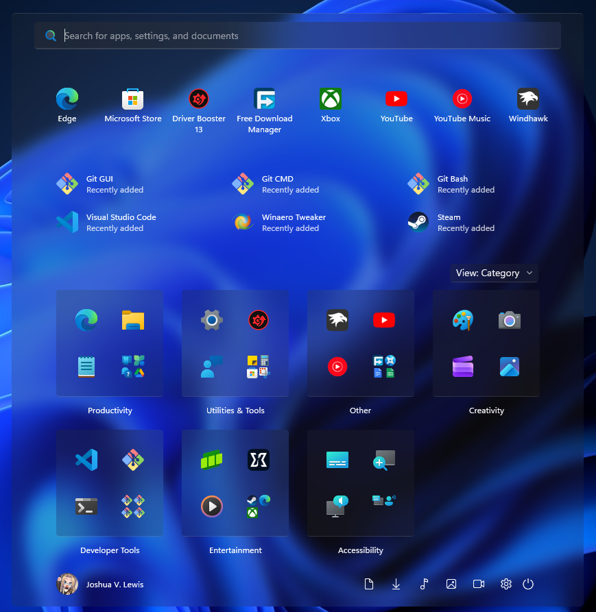
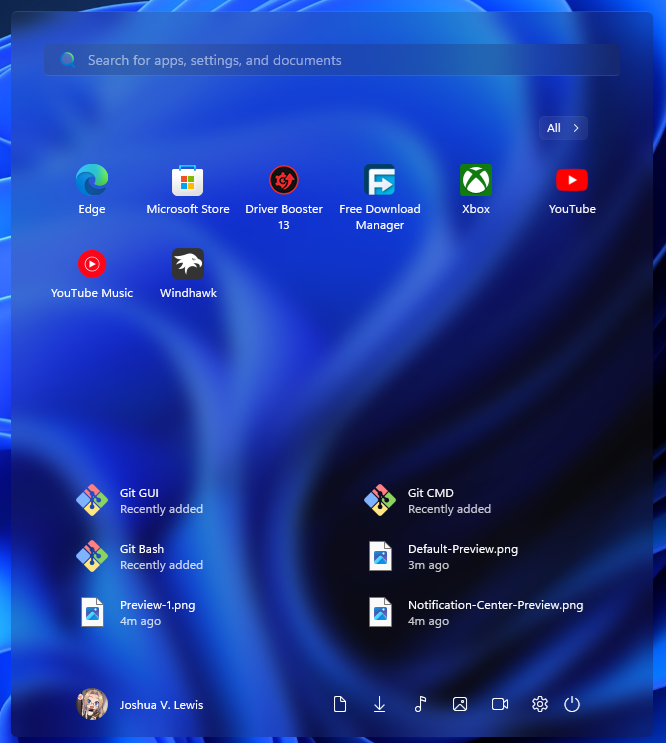

# Start Menu

## Installation
Follow the instructions listed below to install and setup the Windows Glass Start Menu theme on your system.

### Requirements

* **Windhawk Mods**:  
  * [Windows 11 Start Menu Styler](https://windhawk.net/mods/windows-11-start-menu-styler)

* **Fonts**: 
  * [vivo Sans Clock Stencil Regular](/vivoSansClockStencil.ttf)
  * [vivo Sans EN VF](/vivoSansENVF.ttf)

---


<div align="center">
 
</div>

> [!NOTE]
> This theme supports both the new and old start menu layouts and features a clean glass UI with the Phone Link widget disabled to improve appearance and privacy.

## Theme selection

The theme is integrated into the mod and can simply be selected from the mod's
settings:

* Download and install the fonts listed in the requirements above.
* Open the Windows 11 Start Menu Styler mod in Windhawk.
* Go to the "Settings" tab.
* Select the theme and save the settings.

## Manual installation

The theme styles can also be imported manually. To do that, follow these steps:

* Download and install the fonts listed in the requirements above.
* Open the Windows 11 Start Menu Styler mod in Windhawk.
* Go to the "Advanced" tab.
* Copy the content below to the text box under "Mod settings" and click "Save".

<details>
<summary>Content to import (click to expand)</summary>

```json
{
  "theme": "",
  "disableNewStartMenuLayout": 0,
  "controlStyles[0].target": "Border#AcrylicOverlay",
  "controlStyles[0].styles[0]": "Visibility=1",
  "controlStyles[1].target": "Border#AcrylicBorder",
  "controlStyles[1].styles[0]": "Background:=$Background",
  "controlStyles[1].styles[1]": "BorderThickness=$BorderThickness",
  "controlStyles[1].styles[2]": "BorderBrush:=$BorderBrush",
  "controlStyles[1].styles[3]": "CornerRadius=$CornerRadius",
  "controlStyles[2].target": "Border#AccentAppBorder",
  "controlStyles[2].styles[0]": "Background:=$Background",
  "controlStyles[2].styles[1]": "BorderThickness=$BorderThickness",
  "controlStyles[2].styles[2]": "BorderBrush:=$BorderBrush",
  "controlStyles[2].styles[3]": "CornerRadius=$CornerRadius",
  "controlStyles[3].target": "Border#AppBorder",
  "controlStyles[3].styles[0]": "Background:=$Background",
  "controlStyles[3].styles[1]": "BorderBrush:=$BorderBrush",
  "controlStyles[3].styles[2]": "BorderThickness=$BorderThickness",
  "controlStyles[3].styles[3]": "CornerRadius=$CornerRadius",
  "controlStyles[4].target": "Border#DropShadow",
  "controlStyles[4].styles[0]": "Visibility=1",
  "controlStyles[5].target": "Border#StartDropShadow",
  "controlStyles[5].styles[0]": "Visibility=1",
  "controlStyles[6].target": "StartMenu.SearchBoxToggleButton#SearchBoxToggleButton",
  "controlStyles[6].styles[0]": "Height=40",
  "controlStyles[6].styles[1]": "HorizontalAlignment=Stretch",
  "controlStyles[7].target": "Cortana.UI.Views.RichSearchBoxControl#SearchBoxControl",
  "controlStyles[7].styles[0]": "HorizontalAlignment=Stretch",
  "controlStyles[8].target": "Border#BorderElement",
  "controlStyles[8].styles[0]": "Background:=$ElementBG",
  "controlStyles[8].styles[1]": "BorderBrush:=$ElementBorderBrush",
  "controlStyles[8].styles[2]": "BorderThickness=$ElementBorderThickness",
  "controlStyles[8].styles[3]": "CornerRadius=$ElementCornerRadius",
  "controlStyles[9].target": "StartMenu.CategoryControl > Grid#RootGrid > Border ",
  "controlStyles[9].styles[0]": "BorderThickness=$ElementBorderThickness",
  "controlStyles[9].styles[1]": "BorderBrush:=$ElementBorderBrush",
  "controlStyles[9].styles[2]": "Background:=$ElementBG",
  "controlStyles[9].styles[3]": "CornerRadius=$ElementCornerRadius",
  "controlStyles[10].target": "Border#BorderUnderline",
  "controlStyles[10].styles[0]": "Visibility=0",
  "controlStyles[11].target": "StackPanel#TimeAndDatePanel",
  "controlStyles[11].styles[0]": "VerticalAlignment=Top",
  "controlStyles[11].styles[1]": "HorizontalAlignment=Center",
  "controlStyles[11].styles[2]": "RenderTransform:=<TranslateTransform X=\"0\" />",
  "controlStyles[12].target": "StackPanel#TimePanel > TextBlock#Time",
  "controlStyles[12].styles[0]": "HorizontalAlignment=Center",
  "controlStyles[12].styles[1]": "RenderTransform:=<TranslateTransform X=\"0\" Y=\"50\" />",
  "controlStyles[12].styles[2]": "FontFamily=vivo Sans Clock Stencil Regular",
  "controlStyles[12].styles[3]": "Foreground:=$ClockBG",
  "controlStyles[13].target": "StackPanel#TimeAndDatePanel > TextBlock#Date",
  "controlStyles[13].styles[0]": "HorizontalAlignment=Center",
  "controlStyles[13].styles[1]": "RenderTransform:=<TranslateTransform X=\"0\" Y=\"-150\" />",
  "controlStyles[13].styles[2]": "FontFamily=vivo Sans EN VF",
  "controlStyles[13].styles[3]": "Foreground:=$ClockBG",
  "controlStyles[14].target": "Grid#WidgetFrameGrid",
  "controlStyles[14].styles[0]": "Background:=$Background",
  "controlStyles[14].styles[1]": "BorderBrush:=$BorderBrush",
  "controlStyles[14].styles[2]": "BorderThickness=$BorderThickness",
  "controlStyles[14].styles[3]": "CornerRadius=$CornerRadius",
  "controlStyles[15].target": "Grid#WidgetCanvasPanel",
  "controlStyles[15].styles[0]": "HorizontalAlignment=Center",
  "controlStyles[15].styles[1]": "RenderTransform:=<TranslateTransform X=\"0\" Y=\"50\" />",
  "controlStyles[16].target": "Grid#MediaTransportControls",
  "controlStyles[16].styles[0]": "Background:=$Background",
  "controlStyles[16].styles[1]": "BorderBrush:=$BorderBrush",
  "controlStyles[16].styles[2]": "BorderThickness=$BorderThickness",
  "controlStyles[16].styles[3]": "CornerRadius=$CornerRadius",
  "controlStyles[17].target": "Grid#MediaControlsContainer",
  "controlStyles[17].styles[0]": "Visibility=0",
  "controlStyles[17].styles[1]": "RenderTransform:=<TranslateTransform X=\"0\" Y=\"-200\" />",
  "controlStyles[17].styles[2]": "Margin=0,0,0,0",
  "controlStyles[18].target": "Windows.UI.Xaml.Controls.Primitives.ToggleButton#ShowHideCompanion",
  "controlStyles[18].styles[0]": "Visibility=1",
  "controlStyles[19].target": "Border#RightCompanionDropShadow",
  "controlStyles[19].styles[0]": "Visibility=1",
  "controlStyles[20].target": "Grid#RightCompanionContainerGrid",
  "controlStyles[20].styles[0]": "Visibility=1",
  "controlStyles[21].target": "TextBlock#PinnedListHeaderText",
  "controlStyles[21].styles[0]": "Visibility=1",
  "controlStyles[22].target": "Windows.UI.Xaml.Controls.Primitives.ScrollBar#VerticalScrollBar",
  "controlStyles[22].styles[0]": "Visibility=1",
  "controlStyles[23].target": "Grid#TopLevelHeader > Grid > Button",
  "controlStyles[23].styles[0]": "Visibility=1",
  "controlStyles[24].target": "MenuFlyoutPresenter > Border",
  "controlStyles[24].styles[0]": "BorderBrush:=$BorderBrush",
  "controlStyles[24].styles[1]": "Background:=$Background",
  "controlStyles[24].styles[2]": "BorderThickness=$BorderThickness",
  "controlStyles[24].styles[3]": "CornerRadius=$CornerRadius",
  "controlStyles[25].target": "ToolTip > ContentPresenter#LayoutRoot",
  "controlStyles[25].styles[0]": "Background:=$Background",
  "controlStyles[25].styles[1]": "BorderBrush:=$BorderBrush",
  "controlStyles[25].styles[2]": "BorderThickness=$BorderThickness",
  "controlStyles[25].styles[3]": "CornerRadius=$CornerRadius",
  "controlStyles[26].target": "Button#AddButton",
  "controlStyles[26].styles[0]": "Background:=$ElementBG",
  "controlStyles[26].styles[1]": "BorderBrush:=$ElementBorderBrush",
  "controlStyles[26].styles[2]": "BorderThickness=$ElementBorderThickness",
  "controlStyles[26].styles[3]": "CornerRadius=$ElementCornerRadius",
  "controlStyles[27].target": "GridViewHeaderItem > Border > ContentPresenter#ContentPresenter > Button#Header > Border#Border",
  "controlStyles[27].styles[0]": "Background:=Transparent",
  "controlStyles[27].styles[1]": "BorderBrush:=Transparent",
  "controlStyles[28].target": "StartMenu.SearchBoxToggleButton#SearchBoxToggleButton > Grid",
  "controlStyles[28].styles[0]": "Background:=$ElementBG",
  "controlStyles[28].styles[1]": "BorderBrush:=$ElementBorderBrush",
  "controlStyles[28].styles[2]": "BorderThickness=$ElementBorderThickness",
  "controlStyles[28].styles[3]": "CornerRadius=$ElementCornerRadius",
  "controlStyles[29].target": "Microsoft.UI.Xaml.Controls.DropDownButton",
  "controlStyles[29].styles[0]": "Margin=63,0",
  "controlStyles[30].target": "Border#ContentBorder@CommonStates > Grid#DroppedFlickerWorkaroundWrapper > Border#BackgroundBorder",
  "controlStyles[30].styles[0]": "Background@PointerOver:=$Background",
  "controlStyles[30].styles[1]": "BorderBrush@PointerOver:=$BorderBrush",
  "controlStyles[30].styles[2]": "BorderThickness@PointerOver=$BorderThickness",
  "controlStyles[30].styles[3]": "Background@Pressed:=$Background",
  "controlStyles[30].styles[4]": "BorderBrush@Pressed:=$BorderBrush",
  "controlStyles[30].styles[5]": "BorderThickness@Pressed=$BorderThickness",
  "controlStyles[30].styles[6]": "Background@Selected:=$Background",
  "controlStyles[30].styles[7]": "BorderBrush@Selected:=$BorderBrush",
  "controlStyles[30].styles[8]": "BorderThickness@Selected=$BorderThickness",
  "controlStyles[30].styles[9]": "Background@Normal:=Transparent",
  "controlStyles[30].styles[10]": "BorderBrush@Normal:=Transparent",
  "controlStyles[30].styles[11]": "BorderThickness@Normal=Transparent",
  "controlStyles[30].styles[12]": "CornerRadius=$ElementCornerRadius",
  "controlStyles[31].target": "StartMenu.SearchBoxToggleButton > Grid > Border#BorderElement",
  "controlStyles[31].styles[0]": "BorderBrush:=$ElementBorderBrush",
  "controlStyles[31].styles[1]": "BorderThickness=$ElementBorderThickness",
  "controlStyles[31].styles[2]": "CornerRadius=$ElementCornerRadius",
  "controlStyles[32].target": "StartDocked.NavigationPaneButton#UserTileButton > Grid@CommonStates > Border",
  "controlStyles[32].styles[0]": "BorderBrush@PointerOver:=$ElementBorderBrush",
  "controlStyles[33].target": "StartDocked.AppListViewItem > Grid@CommonStates > Border",
  "controlStyles[33].styles[0]": "BorderBrush@PointerOver:=$ElementBorderBrush",
  "controlStyles[33].styles[1]": "Background@PointerOver:=$ElementBG",
  "controlStyles[33].styles[2]": "BorderThickness@PointerOver=$ElementBorderThickness",
  "controlStyles[33].styles[3]": "Background:=Transparent",
  "controlStyles[33].styles[4]": "BorderBrush:=Transparent",
  "controlStyles[34].target": "StartDocked.NavigationPaneButton#PowerButton > Grid@CommonStates > Border",
  "controlStyles[34].styles[0]": "BorderBrush@PointerOver:=$ElementBorderBrush",
  "controlStyles[34].styles[1]": "Background@PointerOver:=$ElementBG",
  "controlStyles[34].styles[2]": "BorderThickness@PointerOver=$ElementBorderThickness",
  "controlStyles[35].target": "Microsoft.UI.Xaml.Controls.DropDownButton > Grid#RootGrid",
  "controlStyles[35].styles[0]": "Background:=$ElementBG",
  "controlStyles[35].styles[1]": "BorderBrush:=$ElementBorderBrush",
  "controlStyles[35].styles[2]": "BorderThickness=$ElementBorderThickness",
  "controlStyles[35].styles[3]": "CornerRadius=$ElementCornerRadius",
  "controlStyles[36].target": "Button > Grid@CommonStates > Border",
  "controlStyles[36].styles[0]": "BorderBrush:=Transparent",
  "controlStyles[36].styles[1]": "Background:=Transparent",
  "controlStyles[36].styles[2]": "BorderBrush@PointerOver:=$BorderBrush",
  "controlStyles[36].styles[3]": "Background@PointerOver:=$Background",
  "controlStyles[36].styles[4]": "BorderThickness@PointerOver=$BorderThickness",
  "controlStyles[36].styles[5]": "CornerRadius=$ElementCornerRadius",
  "controlStyles[37].target": "ListViewItem > Grid#ContentBorder@CommonStates",
  "controlStyles[37].styles[0]": "BorderBrush:=Transparent",
  "controlStyles[37].styles[1]": "Background:=Transparent",
  "controlStyles[37].styles[2]": "BorderBrush@PointerOver:=$BorderBrush",
  "controlStyles[37].styles[3]": "Background@PointerOver:=$Background",
  "controlStyles[37].styles[4]": "BorderThickness@PointerOver=$BorderThickness",
  "controlStyles[37].styles[5]": "CornerRadius=$ElementCornerRadius",
  "controlStyles[38].target": "Grid#TopLevelSuggestionsListHeader",
  "controlStyles[38].styles[0]": "Visibility=1",
  "controlStyles[39].target": "TextBlock#AllListHeadingText",
  "controlStyles[39].styles[0]": "Visibility=1",
  "controlStyles[40].target": "Button#ShowMoreSuggestionsButton > Grid@CommonStates > Border",
  "controlStyles[40].styles[0]": "Background:=$ElementBG",
  "controlStyles[41].target": "Border > AdaptiveCards.Rendering.Uwp.WholeItemsPanel > Border > AdaptiveCards.Rendering.Uwp.WholeItemsPanel > Border",
  "controlStyles[41].styles[0]": "Visibility=1",
  "controlStyles[42].target": "Border#Root > Grid > ScrollContentPresenter > AdaptiveCards.Rendering.Uwp.WholeItemsPanel > Border > AdaptiveCards.Rendering.Uwp.WholeItemsPanel > Grid > Border > AdaptiveCards.Rendering.Uwp.WholeItemsPanel > TextBlock",
  "controlStyles[42].styles[0]": "Visibility=1",
  "controlStyles[43].target": "Grid@SearchBoxInputStates > Border#TaskbarSearchBackground",
  "controlStyles[43].styles[0]": "Visibility=1",
  "controlStyles[44].target": "Grid#LayoutRoot",
  "controlStyles[44].styles[0]": "BackgroundTransition:=<BrushTransition Duration=\"0:0:0.083\" />",
  "controlStyles[45].target": "Border#BackgroundBorder",
  "controlStyles[45].styles[0]": "BackgroundTransition:=<BrushTransition Duration=\"0:0:0.083\" />",
  "controlStyles[46].target": "Microsoft.UI.Xaml.Controls.DropDownButton > Grid@CommonStates",
  "controlStyles[46].styles[0]": "Background@Normal:=$ElementBG",
  "controlStyles[46].styles[1]": "BorderBrush@Normal:=$ElementBorderBrush",
  "controlStyles[46].styles[2]": "BorderBrush@PointerOver:=$ElementBorderBrush",
  "controlStyles[46].styles[3]": "BorderBrush@Pressed:=$ElementBorderBrush",
  "controlStyles[46].styles[4]": "Background@PointerOver:=$ElementBG",
  "controlStyles[46].styles[5]": "Background@Pressed:=$ElementBG",
  "controlStyles[46].styles[6]": "BorderThickness=$ElementBorderThickness",
  "controlStyles[46].styles[7]": "Margin=2",
  "controlStyles[46].styles[8]": "CornerRadius=$ElementCornerRadius",
  "controlStyles[46].styles[9]": "Padding=9,3,7,4",
  "controlStyles[47].target": "StartDocked.NavigationPaneButton#PowerButton",
  "controlStyles[47].styles[0]": "RenderTransform:=<TranslateTransform X=\"-8\" />",
  "webContentStyles[0].target": "#qfPreviewPane",
  "webContentStyles[0].styles[0]": "min-width: 300px !important",
  "webContentStyles[1].target": "*",
  "webContentStyles[1].styles[0]": "transition: background-color 0.083s ease-in-out !important",
  "webContentCustomJs": "",
  "styleConstants[0]": "Background=<WindhawkBlur BlurAmount=\"10\" TintColor=\"#25323232\" TintOpacity=\"0.2\" />",
  "styleConstants[1]": "BorderBrush2=<LinearGradientBrush StartPoint=\"0,0\" EndPoint=\"0,1\"><GradientStop Color=\"{ThemeResource SystemChromeHighColor}\" Offset=\"0.0\" /><GradientStop Color=\"{ThemeResource SystemChromeAltHighColor}\" Offset=\"0.25\" /><GradientStop Color=\"{ThemeResource SystemChromeHighColor}\" Offset=\"1\" /></LinearGradientBrush>",
  "styleConstants[2]": "BorderThickness=0.3,1,0.3,0.3",
  "styleConstants[3]": "ClockBG=<WindhawkBlur BlurAmount=\"20\" TintColor=\"{ThemeResource SystemAccentColorLight2}\" TintOpacity=\"0.3\" />",
  "styleConstants[4]": "Background2=<AcrylicBrush TintColor=\"{ThemeResource SystemChromeAltHighColor}\" TintOpacity=\"0.3\" FallbackColor=\"{ThemeResource SystemChromeAltHighColor}\" />",
  "styleConstants[5]": "ElementBG=<WindhawkBlur BlurAmount=\"20\" TintColor=\"#25323232\" TintOpacity=\"0.2\" />",
  "styleConstants[6]": "ElementBorderThickness=0.3,0.3,0.3,1",
  "styleConstants[7]": "ElementBorderBrush=<LinearGradientBrush StartPoint=\"0,0\" EndPoint=\"0,1\"><GradientStop Color=\"#50808080\" Offset=\"1\" /><GradientStop Color=\"#50606060\" Offset=\"0.15\" /></LinearGradientBrush>",
  "styleConstants[8]": "BorderBrush=<LinearGradientBrush StartPoint=\"0,0\" EndPoint=\"0,1\"><GradientStop Color=\"#50808080\" Offset=\"0.0\" /><GradientStop Color=\"#50404040\" Offset=\"0.25\" /><GradientStop Color=\"#50808080\" Offset=\"1\" /></LinearGradientBrush>",
  "styleConstants[9]": "CornerRadius=6",
  "styleConstants[10]": "ElementCornerRadius=4",
  "resourceVariables[0].variableKey": "",
  "resourceVariables[0].value": "",
  "controlStyles[6].styles[2]": "Width=Auto",
  "controlStyles[6].styles[3]": "MaxWidth=900",
  "controlStyles[33].styles[5]": "Height=36",
  "controlStyles[33].styles[6]": "Width=36",
  "controlStyles[34].styles[3]": "Background:=Transparent",
  "controlStyles[34].styles[4]": "BorderBrush:=Transparent",
  "controlStyles[34].styles[5]": "Height=36",
  "controlStyles[34].styles[6]": "Width=36",
  "controlStyles[32].styles[1]": "Background@PointerOver:=$ElementBG",
  "controlStyles[32].styles[2]": "BorderThickness@PointerOver=$ElementBorderThickness",
  "controlStyles[32].styles[3]": "Background:=Transparent",
  "controlStyles[32].styles[4]": "BorderBrush:=Transparent",
  "controlStyles[34].styles[7]": "CornerRadius=$ElementCornerRadius",
  "controlStyles[33].styles[7]": "CornerRadius=$ElementCornerRadius",
  "controlStyles[32].styles[5]": "CornerRadius=$ElementCornerRadius",
  "controlStyles[40].styles[1]": "BorderBrush:=$ElementBorderBrush",
  "controlStyles[40].styles[2]": "BorderThickness=$ElementBorderThickness",
  "controlStyles[40].styles[3]": "CornerRadius=$ElementCornerRadius"
}
```

</details>
