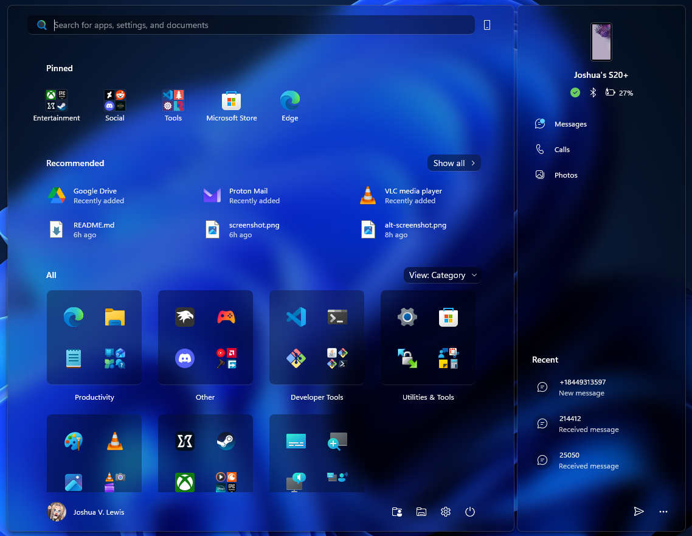

# LiquidGlass theme for Windows 11 Start Menu Styler

**Author**: [PhantomNimbi](https://github.com/PhantomNimbi)



> [!IMPORTANT]
> This theme is designed for the [redesigned Windows 11 Start menu](https://microsoft.design/articles/start-fresh-redesigning-windows-start-menu/) that is gradually rolling out with the 25H2 update.

## Theme selection

The theme is integrated into the mod and can be selected directly from the mod's
settings:

* Open the Windows 11 Start Menu Styler mod in Windhawk.
* Go to the "Settings" tab.
* Select the theme and save the settings.

## Manual installation

The theme styles can also be imported manually. To do that, follow these steps:

* Open the Windows 11 Start Menu Styler mod in Windhawk.
* Go to the "Advanced" tab.
* Copy the content below to the text box under "Mod settings" and click "Save".

<details>
<summary>Content to import (click to expand)</summary>

```json
{
  "controlStyles[0].target": "Border#AcrylicOverlay",
  "controlStyles[0].styles[0]": "Visibility=1",
  "controlStyles[1].target": "Border#AcrylicBorder",
  "controlStyles[1].styles[0]": "Background:=$Background",
  "controlStyles[1].styles[1]": "BorderBrush:=$BorderBrush",
  "controlStyles[1].styles[2]": "BorderThickness=$BorderThickness",
  "controlStyles[2].target": "Border#AppBorder",
  "controlStyles[2].styles[0]": "Background:=$Background",
  "controlStyles[2].styles[1]": "BorderBrush:=$BorderBrush",
  "controlStyles[2].styles[2]": "BorderThickness=$BorderThickness",
  "controlStyles[3].target": "Border#ContentBorder@CommonStates > Grid > Border#BackgroundBorder",
  "controlStyles[3].styles[0]": "BorderThickness=$ElementBorderThickness",
  "controlStyles[3].styles[1]": "BorderBrush@PointerOver:=$ElementBorderBrush",
  "controlStyles[3].styles[2]": "BorderBrush@Pressed:=$ElementBorderBrush",
  "controlStyles[4].target": "Button > Grid@CommonStates > Border#BackgroundBorder",
  "controlStyles[4].styles[0]": "BorderThickness=$ElementBorderThickness",
  "controlStyles[4].styles[1]": "BorderBrush@PointerOver:=$ElementBorderBrush",
  "controlStyles[4].styles[2]": "BorderBrush@Pressed:=$ElementBorderBrush",
  "controlStyles[4].styles[3]": "BackgroundSizing=InnerBorderEdge",
  "controlStyles[5].target": "StartMenu.CategoryControl > Grid > Border",
  "controlStyles[5].styles[0]": "BorderThickness=$ElementBorderThickness",
  "controlStyles[5].styles[1]": "BorderBrush:=$ElementBorderBrush",
  "controlStyles[5].styles[2]": "BackgroundSizing=InnerBorderEdge",
  "controlStyles[5].styles[3]": "Background:=$ElementBackground",
  "controlStyles[5].styles[4]": "Opacity=0.8",
  "controlStyles[6].target": "Grid#LayoutRoot",
  "controlStyles[6].styles[0]": "BackgroundTransition:=<BrushTransition Duration=\"0:0:0.083\" />",
  "controlStyles[7].target": "Border#BackgroundBorder",
  "controlStyles[7].styles[0]": "BackgroundTransition:=<BrushTransition Duration=\"0:0:0.083\" />",
  "controlStyles[8].target": "Button#Header > Border@CommonStates",
  "controlStyles[8].styles[0]": "BorderThickness=$ElementBorderThickness",
  "controlStyles[8].styles[1]": "BorderBrush@PointerOver:=$ElementBorderBrush",
  "controlStyles[8].styles[2]": "BorderBrush@Pressed:=$ElementBorderBrush",
  "controlStyles[8].styles[3]": "BackgroundSizing=InnerBorderEdge",
  "controlStyles[9].target": "ListViewItem > Grid@CommonStates > Border#BorderBackground",
  "controlStyles[9].styles[0]": "BorderThickness=$ElementBorderThickness",
  "controlStyles[9].styles[1]": "BorderBrush@PointerOver:=$ElementBorderBrush",
  "controlStyles[9].styles[2]": "BorderBrush@Pressed:=$ElementBorderBrush",
  "controlStyles[9].styles[3]": "BackgroundSizing=InnerBorderEdge",
  "controlStyles[10].target": "StartMenu.SearchBoxToggleButton > Grid@CommonStates > Border#BorderElement",
  "controlStyles[10].styles[0]": "CornerRadius=$ElementCornerRadius",
  "controlStyles[10].styles[1]": "BorderThickness=$ElementBorderThickness",
  "controlStyles[10].styles[2]": "BorderBrush:=$ElementBorderBrush",
  "controlStyles[10].styles[3]": "Background@Checked:=$ElementBackground",
  "controlStyles[10].styles[4]": "Background@CheckedPointerOver:=$AccentBackground",
  "controlStyles[10].styles[5]": "Background@CheckedPressed:=$ElementBackground2",
  "controlStyles[10].styles[6]": "BackgroundTransition:=<BrushTransition Duration=\"0:0:0.083\" />",
  "controlStyles[11].target": "Button#HideMoreSuggestionsButton > Grid@CommonStates > Border#BackgroundBorder",
  "controlStyles[11].styles[0]": "Background@Normal:=$ElementBackground",
  "controlStyles[11].styles[1]": "BorderBrush@Normal:=$ElementBorderBrush",
  "controlStyles[11].styles[2]": "BorderBrush@PointerOver:=$ElementBorderBrush",
  "controlStyles[11].styles[3]": "BorderBrush@Pressed:=$ElementBorderBrush",
  "controlStyles[11].styles[4]": "Background@PointerOver:=$AccentBackground",
  "controlStyles[11].styles[5]": "Background@Pressed:=$ElementBackground2",
  "controlStyles[11].styles[6]": "BorderThickness=$ElementBorderThickness",
  "controlStyles[11].styles[7]": "Margin=2",
  "controlStyles[12].target": "Button#ShowMoreSuggestionsButton > Grid@CommonStates > Border#BackgroundBorder",
  "controlStyles[12].styles[0]": "Background@Normal:=$ElementBackground",
  "controlStyles[12].styles[1]": "BorderBrush@Normal:=$ElementBorderBrush",
  "controlStyles[12].styles[2]": "BorderBrush@PointerOver:=$ElementBorderBrush",
  "controlStyles[12].styles[3]": "BorderBrush@Pressed:=$ElementBorderBrush",
  "controlStyles[12].styles[4]": "Background@PointerOver:=$AccentBackground",
  "controlStyles[12].styles[5]": "Background@Pressed:=$ElementBackground2",
  "controlStyles[12].styles[6]": "BorderThickness=$ElementBorderThickness",
  "controlStyles[12].styles[7]": "Margin=2",
  "controlStyles[13].target": "StartMenu.FolderModal > Grid#Root > Border",
  "controlStyles[13].styles[0]": "BorderThickness=$BorderThickness",
  "controlStyles[13].styles[1]": "BorderBrush:=$BorderBrush",
  "controlStyles[14].target": "MenuFlyoutPresenter > Border",
  "controlStyles[14].styles[0]": "BorderThickness=$BorderThickness",
  "controlStyles[14].styles[1]": "BorderBrush:=$BorderBrush",
  "controlStyles[15].target": "Border#ContentBorder@CommonStates > Grid#DroppedFlickerWorkaroundWrapper > ContentPresenter#ContentPresenter > ContentControl > Grid#RootGrid > Border#LogoBackgroundPlate > Image#AllAppsItemLogo",
  "controlStyles[15].styles[0]": "RenderTransform@Pressed:=<ScaleTransform ScaleX=\"0.8\" ScaleY=\"0.8\" />",
  "controlStyles[15].styles[1]": "RenderTransformOrigin=0.5,0.5",
  "controlStyles[16].target": "StartDocked.NavigationPaneButton > Grid@CommonStates > Border#BackgroundBorder",
  "controlStyles[16].styles[0]": "BorderThickness=$ElementBorderThickness",
  "controlStyles[16].styles[1]": "BorderBrush@PointerOver:=$ElementBorderBrush",
  "controlStyles[16].styles[2]": "BorderBrush@Pressed:=$ElementBorderBrush",
  "controlStyles[16].styles[3]": "BackgroundSizing=InnerBorderEdge",
  "controlStyles[17].target": "StartDocked.AppListViewItem > Grid@CommonStates > Border#BackgroundBorder",
  "controlStyles[17].styles[0]": "BorderThickness=$BorderThickness",
  "controlStyles[17].styles[1]": "BorderBrush@PointerOver:=$BorderBrush",
  "controlStyles[17].styles[2]": "BorderBrush@Pressed:=$BorderBrush",
  "controlStyles[17].styles[3]": "BackgroundSizing=InnerBorderEdge",
  "controlStyles[18].target": "Microsoft.UI.Xaml.Controls.DropDownButton > Grid@CommonStates",
  "controlStyles[18].styles[0]": "Background@PointerOver:=$AccentBackground",
  "controlStyles[18].styles[1]": "Background@Pressed:=$ElementBackground2",
  "controlStyles[18].styles[2]": "BorderBrush@PointerOver:=$ElementBorderBrush",
  "controlStyles[18].styles[3]": "BorderBrush@Pressed:=$ElementBorderBrush",
  "controlStyles[18].styles[4]": "BackgroundSizing=InnerBorderEdge",
  "controlStyles[18].styles[5]": "Background@Normal:=$ElementBackground",
  "controlStyles[18].styles[6]": "BorderBrush@Normal:=$ElementBorderBrush",
  "controlStyles[18].styles[7]": "Padding=9,3,7,4",
  "controlStyles[19].target": "Border#ContentBorder@CommonStates > Grid#DroppedFlickerWorkaroundWrapper > ContentPresenter#ContentPresenter > ContentControl > Grid#RootGrid > Grid#LogoContainer > Image#AllAppsTileLogo",
  "controlStyles[19].styles[0]": "RenderTransform@Pressed:=<ScaleTransform ScaleX=\"0.8\" ScaleY=\"0.8\" />",
  "controlStyles[19].styles[1]": "RenderTransformOrigin=0.5,0.5",
  "controlStyles[20].target": "Border#ContentBorder@CommonStates > Grid#DroppedFlickerWorkaroundWrapper > ContentPresenter > Grid > Grid#LogoContainer > Grid",
  "controlStyles[20].styles[0]": "RenderTransform@Pressed:=<ScaleTransform ScaleX=\"0.8\" ScaleY=\"0.8\" />",
  "controlStyles[20].styles[1]": "RenderTransformOrigin=0.5,0.5",
  "controlStyles[21].target": "Grid#ContentBorder@CommonStates > Grid#DroppedFlickerWorkaroundWrapper > ContentPresenter > Grid > Grid#LogoContainer > Grid",
  "controlStyles[21].styles[0]": "RenderTransform@Pressed:=<ScaleTransform ScaleX=\"0.8\" ScaleY=\"0.8\" />",
  "controlStyles[21].styles[1]": "RenderTransformOrigin=0.5,0.5",
  "controlStyles[22].target": "ScrollViewer#MenuFlyoutPresenterScrollViewer > Border > Grid > ScrollContentPresenter > ItemsPresenter > StackPanel",
  "controlStyles[22].styles[0]": "ChildrenTransitions:=<TransitionCollection><EntranceThemeTransition IsStaggeringEnabled=\"False\" FromHorizontalOffset=\"-25\" FromVerticalOffset=\"0\" /></TransitionCollection>",
  "controlStyles[23].target": "FlyoutPresenter > Border > ScrollViewer > Border > Grid > ScrollContentPresenter > ContentPresenter > Border",
  "controlStyles[23].styles[0]": "BorderBrush:=$BorderBrush",
  "controlStyles[23].styles[1]": "BorderThickness=$BorderThickness",
  "controlStyles[24].target": "Button > ContentPresenter#ContentPresenter@CommonStates",
  "controlStyles[24].styles[0]": "Background@PointerOver:=$AccentBackground",
  "controlStyles[24].styles[1]": "Background@Pressed:=$ElementBackground2",
  "controlStyles[24].styles[2]": "BorderBrush@PointerOver:=$ElementBorderBrush",
  "controlStyles[24].styles[3]": "BorderBrush@Pressed:=$ElementBorderBrush",
  "controlStyles[24].styles[4]": "BorderThickness=$ElementBorderThickness",
  "controlStyles[24].styles[5]": "Background@Normal=$ElementBackground",
  "controlStyles[25].target": "Grid@SearchBoxInputStates > Border#TaskbarSearchBackground",
  "controlStyles[25].styles[0]": "CornerRadius=$ElementCornerRadius",
  "controlStyles[25].styles[1]": "Background@ActiveInput:=$ElementBackground2",
  "controlStyles[25].styles[2]": "BorderBrush:=$ElementBorderBrush",
  "controlStyles[25].styles[3]": "BorderThickness=$ElementBorderThickness",
  "controlStyles[25].styles[4]": "Background@SearchBoxHover:=$AccentBackground",
  "controlStyles[25].styles[5]": "Background@NoFocus:=$ElementBackground",
  "controlStyles[25].styles[6]": "BackgroundTransition:=<BrushTransition Duration=\"0:0:0.083\" />",
  "controlStyles[26].target": "Border@CommonStates > Grid#DroppedFlickerWorkaroundWrapper > ContentPresenter > Grid > Grid#LogoContainer > Image",
  "controlStyles[26].styles[0]": "RenderTransform@Pressed:=<ScaleTransform ScaleX=\"0.8\" ScaleY=\"0.8\" />",
  "controlStyles[26].styles[1]": "RenderTransformOrigin=0.5,0.5",
  "controlStyles[27].target": "Grid#ContentBorder@CommonStates > ContentPresenter > Grid > Grid#LogoContainer > Grid",
  "controlStyles[27].styles[0]": "RenderTransform@Pressed:=<ScaleTransform ScaleX=\"0.8\" ScaleY=\"0.8\" />",
  "controlStyles[27].styles[1]": "RenderTransformOrigin=0.5,0.5",
  "webContentStyles[0].target": "*",
  "webContentStyles[0].styles[0]": "transition: background-color 0.083s ease-in-out !important",
  "styleConstants[0]": "BorderThickness=0.3,1,0.3,0.3",
  "styleConstants[1]": "ElementBorderThickness=0.3,0.3,0.3,1",
  "styleConstants[2]": "CornerRadius=12",
  "styleConstants[3]": "ElementCornerRadius=8",
  "controlStyles[1].styles[3]": "CornerRadius=$CornerRadius",
  "controlStyles[2].styles[3]": "CornerRadius=$CornerRadius",
  "controlStyles[3].styles[3]": "CornerRadius=$ElementCornerRadius",
  "controlStyles[4].styles[4]": "CornerRadius=$ElementCornerRadius",
  "controlStyles[5].styles[5]": "CornerRadius=$ElementCornerRadius",
  "controlStyles[8].styles[4]": "CornerRadius=$ElementCornerRadius",
  "controlStyles[9].styles[4]": "CornerRadius=$ElementCornerRadius",
  "controlStyles[11].styles[8]": "CornerRadius=$ElementCornerRadius",
  "controlStyles[12].styles[8]": "CornerRadius=$ElementCornerRadius",
  "controlStyles[13].styles[2]": "CornerRadius=$CornerRadius",
  "controlStyles[14].styles[2]": "CornerRadius=$CornerRadius",
  "controlStyles[15].styles[2]": "CornerRadius=$ElementCornerRadius",
  "controlStyles[16].styles[4]": "CornerRadius=$ElementCornerRadius",
  "controlStyles[17].styles[4]": "CornerRadius=$ElementCornerRadius",
  "controlStyles[18].styles[8]": "CornerRadius=$ElementCornerRadius",
  "controlStyles[19].styles[2]": "CornerRadius=$ElementCornerRadius",
  "controlStyles[20].styles[2]": "CornerRadius=$ElementCornerRadius",
  "controlStyles[21].styles[2]": "CornerRadius=$ElementCornerRadius",
  "controlStyles[23].styles[2]": "CornerRadius=$CornerRadius",
  "controlStyles[24].styles[6]": "CornerRadius=$ElementCornerRadius",
  "controlStyles[18].styles[9]": "BorderThickness@Normal=$ElementBorderThickness",
  "controlStyles[18].styles[10]": "BorderThickness@PointerOver=$ElementBorderThickness",
  "controlStyles[18].styles[11]": "BorderThickness@Pressed=$ElementBorderThickness",
  "disableNewStartMenuLayout": "forceNewLayout",
  "styleConstants[4]": "Background=<WindhawkBlur BlurAmount=\"15\" TintColor=\"{ThemeResource SystemAltLowColor}\" TintOpacity=\"0.2\" />",
  "styleConstants[5]": "ElementBackground=<WindhawkBlur BlurAmount=\"15\" TintColor=\"{ThemeResource SystemAltLowColor}\" TintOpacity=\"0.4\" />",
  "styleConstants[6]": "ElementBackground2 = <WindhawkBlur BlurAmount=\"15\" TintColor=\"{ThemeResource SystemAltLowColor}\" TintOpacity=\"0.2\"  />",
  "styleConstants[7]": "AccentBackground=<WindhawkBlur BlurAmount=\"15\" TintColor=\"{ThemeResource SystemAccentColorLight1}\" TintOpacity=\"0.2\"  />",
  "styleConstants[8]": "BorderBrush=<LinearGradientBrush StartPoint=\"0,0\" EndPoint=\"0,1\"><GradientStop Color=\"#50808080\" Offset=\"0.0\" /><GradientStop Color=\"#50404040\" Offset=\"0.25\" /><GradientStop Color=\"#50808080\" Offset=\"1\" /></LinearGradientBrush>\"",
  "styleConstants[9]": "ElementBorderBrush=<LinearGradientBrush StartPoint=\"0,0\" EndPoint=\"0,1\"><GradientStop Color=\"#50808080\" Offset=\"1\" /><GradientStop Color=\"#50606060\" Offset=\"0.15\" /></LinearGradientBrush>"
}
```

</details>
