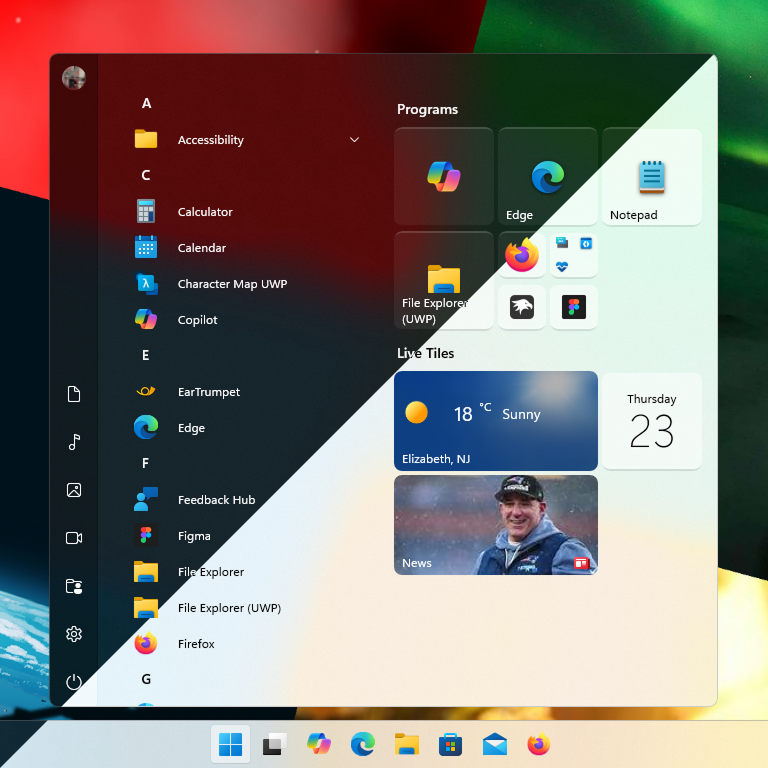
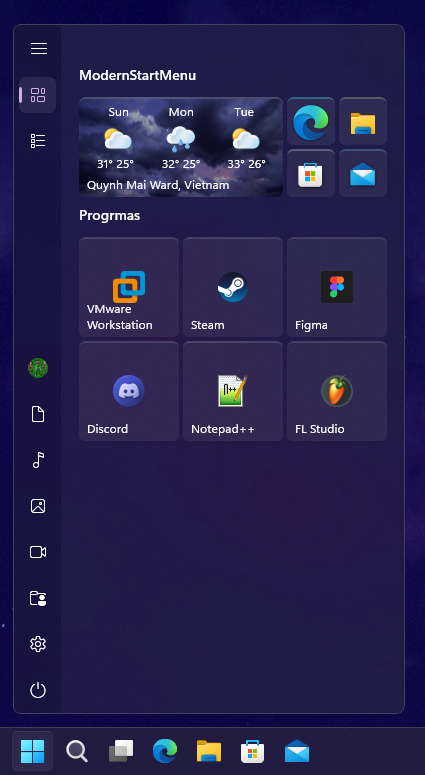

# ModernStartMenu theme for Windows 11 Start Menu Styler (Windows 10 Start Menu)

A recreation of the Sun Valley start menu for the Windows 10 Start Menu running on Windows 11.

**Author**: [ndrew6075](https://github.com/ndrew6075)




## Windows 10 Start menu on Windows 11 installation

If you're already using the Windows 10 Start menu, you can skip this step.

(You need to set *"Corner preference"* to *"Not rounded"* as the theme automatically rounds the start menu and makes it float)

Installation:
* Install [ExplorerPatcher](https://github.com/valinet/ExplorerPatcher).
* Open *"Properties (ExplorerPatcher)"* via the start menu or right-click the taskbar > *"Properties"*.
* Go to *"Start menu"* > *"Start menu style"* > *"Windows 10"* > *"Restart File Explorer"*.

## Bugs
* Group name text will appear as black on a black textbox when editing, causing readability issues.
* Folder name textbox is not styled.
* Holding the X button in the group name textbox will show a fake X icon.
* Reveal effect might flicker around the start menu, and the 3D push effect is still present.
* Items may not be aligned/centered correctly on higher DPIs.
* User flyout can only show 4 users (5 or more will cause clipping).
* *"Pinned tiles"* and *"All apps"* buttons will stick to the right side of the pane for a split second after the pane is dismissed.
* When downloading an app from the Microsoft Store, the placeholder square of the downloading app is stretched.

## Unsupported configurations/settings
* Windows 10 (any versions).
* Light mode.
* *"Show accent color on Start and taskbar"* enabled.
* Fullscreen start menu.
* Languages other than en-US/UK.

## Manual installation

The theme styles can be imported manually. To do that, follow these steps:

* Open the Windows 11 Start Menu Styler mod in Windhawk.
* Go to the "Advanced" tab.
* Copy the content below to the text box under "Mod settings" and click "Save".

<details>
<summary>Content to import (click to expand)</summary>

```json
{
    "theme": "",
    "controlStyles[0].target": "Border#AcrylicBorder",
    "controlStyles[0].styles[0]": "Background:=<AcrylicBrush TintColor=\"{ThemeResource SystemChromeMediumColor}\" TintOpacity=\"0.25\" TintLuminosityOpacity=\"0.96\" FallbackColor=\"{ThemeResource SystemChromeMediumColor}\" />",
    "controlStyles[1].target": "Border#NameTextBlockHost > TextBlock",
    "controlStyles[1].styles[0]": "FontWeight=SemiBold",
    "controlStyles[2].target": "StartUI.AllAppsPane#AllAppsPanel",
    "controlStyles[2].styles[0]": "Margin=12,0,0,0",
    "controlStyles[2].styles[1]": "FontWeight=Semibold",
    "controlStyles[3].target": "Button#Header > Border > TextBlock",
    "controlStyles[3].styles[0]": "FontSize=14",
    "controlStyles[1].styles[1]": "FontSize=14",
    "controlStyles[4].target": "Grid#ContentPaneGrid",
    "controlStyles[4].styles[0]": "Margin=0,24,0,0",
    "controlStyles[5].target": "TextBlock#AppDisplayName",
    "controlStyles[5].styles[0]": "FontSize=12",
    "controlStyles[6].target": "TextBlock#DisplayName",
    "controlStyles[6].styles[0]": "FontSize=12",
    "webContentCustomJs": "",
    "controlStyles[3].styles[1]": "FontWeight=SemiBold",
    "controlStyles[7].target": "Windows.UI.Xaml.Controls.Primitives.ListViewItemPresenter#Root@CommonStates",
    "controlStyles[8].target": "StartUI.NavigationPaneGrid#RootPanel@BackgroundStates",
    "controlStyles[8].styles[0]": "CornerRadius=6,0,0,6",
    "controlStyles[8].styles[1]": "Background@ClosedBackground:=<AcrylicBrush TintColor=\"{ThemeResource SystemChromeLowColor}\" TintOpacity=\"0\" TintLuminosityOpacity=\"0.96\" FallbackColor=\"{ThemeResource SystemChromeLowColor}\" />",
    "controlStyles[9].target": "Grid#VerticalRoot",
    "controlStyles[9].styles[0]": "CornerRadius=6",
    "controlStyles[10].target": "Windows.UI.Xaml.Controls.Primitives.RepeatButton#VerticalSmallDecrease > Grid#Root > FontIcon#Arrow > Grid > TextBlock",
    "controlStyles[10].styles[0]": "Text=",
    "controlStyles[11].target": "Windows.UI.Xaml.Controls.Primitives.RepeatButton#VerticalSmallIncrease > Grid#Root > FontIcon#Arrow > Grid > TextBlock",
    "controlStyles[11].styles[0]": "Text=",
    "controlStyles[12].target": "StartUI.GroupHeaderControl#header",
    "controlStyles[12].styles[0]": "CornerRadius=6",
    "controlStyles[13].target": "Border#NameTextBoxHost > TextBox > Grid > Border#BackgroundElement",
    "controlStyles[13].styles[0]": "Background:=<AcrylicBrush TintColor=\"{ThemeResource SystemChromeLowColor}\" TintOpacity=\"1\" TintLuminosityOpacity=\"1\" FallbackColor=\"{ThemeResource SystemChromeLowColor}\" />",
    "controlStyles[13].styles[1]": "CornerRadius=4",
    "controlStyles[13].styles[2]": "BorderThickness=0.5,0.5,0.5,0",
    "controlStyles[13].styles[3]": "BorderBrush:=<AcrylicBrush TintColor=\"{ThemeResource SystemChromeHighColor}\" TintOpacity=\"0\" TintLuminosityOpacity=\"0.4\" FallbackColor=\"{ThemeResource SystemChromeMediumHighColor}\" />",
    "controlStyles[14].target": "Grid#MainGrid@InteractionStates > Rectangle#BackgroundElement",
    "controlStyles[14].styles[0]": "Fill@InteractionState_Edit:=",
    "controlStyles[15].target": "Rectangle#ThumbVisual",
    "controlStyles[15].styles[0]": "Width=6",
    "webContentStyles[0].target": "",
    "webContentStyles[0].styles[0]": "",
    "resourceVariables[0].variableKey": "",
    "resourceVariables[0].value": "",
    "controlStyles[0].styles[1]": "BorderBrush:=<AcrylicBrush TintColor=\"{ThemeResource SystemChromeHighColor}\" TintOpacity=\"0.4\" TintLuminosityOpacity=\"0.4\" FallbackColor=\"#424242\" />",
    "controlStyles[0].styles[2]": "BorderThickness=1",
    "controlStyles[0].styles[3]": "CornerRadius=8",
    "controlStyles[16].target": "MenuFlyoutItem > Grid > TextBlock",
    "controlStyles[16].styles[0]": "FontSize=14",
    "controlStyles[17].target": "Grid#GridForContextMenuInvoke_MustHave_No_Columns_Or_Rows > Grid > TextBlock",
    "controlStyles[17].styles[0]": "FontSize=14",
    "controlStyles[18].target": "StartUI.TileFolderNameTextBox#FolderNameTextBox",
    "controlStyles[18].styles[0]": "FontSize=14",
    "controlStyles[18].styles[1]": "FontWeight=SemiBold",
    "controlStyles[19].target": "ToggleMenuFlyoutItem > Grid#LayoutRoot > Grid#AnimationRoot > FontIcon#CheckGlyph > Grid > TextBlock",
    "controlStyles[19].styles[0]": "FontFamily=Segoe Fluent Icons",
    "controlStyles[20].target": "Border#UninstallFlyoutPresenterBorder",
    "controlStyles[20].styles[0]": "Width=376",
    "controlStyles[20].styles[1]": "Height=149",
    "controlStyles[20].styles[2]": "Background:=<AcrylicBrush TintColor=\"{ThemeResource SystemChromeMediumColor}\" TintOpacity=\"0.25\" TintLuminosityOpacity=\"0.96\" FallbackColor=\"{ThemeResource SystemChromeMediumColor}\" />",
    "controlStyles[20].styles[3]": "BorderBrush:=<AcrylicBrush TintColor=\"{ThemeResource SystemChromeHighColor}\" TintOpacity=\"0.4\" TintLuminosityOpacity=\"0.4\" FallbackColor=\"#424242\" />",
    "controlStyles[21].target": "StartUI.UninstallFlyoutControl > StackPanel > TextBlock",
    "controlStyles[21].styles[0]": "FontSize=14",
    "controlStyles[21].styles[1]": "FontFamily=Segoe UI Variable",
    "controlStyles[21].styles[2]": "Text=This app and its related information will be removed.",
    "controlStyles[21].styles[3]": "Margin=9,8,0,0",
    "controlStyles[22].target": "StartUI.UninstallFlyoutControl > StackPanel > Button#UninstallButton > Grid@CommonStates",
    "controlStyles[22].styles[0]": "Width=159",
    "controlStyles[22].styles[1]": "Height=32",
    "controlStyles[22].styles[2]": "CornerRadius=4",
    "controlStyles[22].styles[3]": "Background@Normal:=<AcrylicBrush TintColor=\"{ThemeResource SystemAccentColorLight2}\" TintOpacity=\"1\" TintLuminosityOpacity=\"1\" FallbackColor=\"{ThemeResource SystemAccentColorLight2}\" />",
    "controlStyles[23].target": "StartUI.UninstallFlyoutControl > StackPanel > Button#UninstallButton > Grid > ContentPresenter > TextBlock",
    "controlStyles[23].styles[0]": "FontFamily=Segoe UI Variable",
    "controlStyles[23].styles[1]": "FontWeight=Normal",
    "controlStyles[24].target": "TextBlock#StatusMessage",
    "controlStyles[24].styles[0]": "Margin=20,0,0,0",
    "controlStyles[24].styles[1]": "FontFamily=Segoe UI Variable",
    "controlStyles[2].styles[2]": "Width=253",
    "controlStyles[25].target": "Rectangle#SelectionRectangle",
    "controlStyles[25].styles[0]": "RadiusX=2",
    "controlStyles[25].styles[1]": "RadiusY=2",
    "controlStyles[25].styles[2]": "Height=32",
    "controlStyles[7].styles[0]": "RevealBackground@PointerOver:=<AcrylicBrush TintColor=\"{ThemeResource SystemChromeMediumLowColor}\" TintOpacity=\"0\" TintLuminosityOpacity=\"0.96\" FallbackColor=\"{ThemeResource SystemChromeMediumLowColor}\" />",
    "controlStyles[7].styles[1]": "RevealBackground@Pressed:=",
    "controlStyles[26].target": "Border#Border@CommonStates",
    "controlStyles[26].styles[0]": "Background@PointerOver:=<AcrylicBrush TintColor=\"{ThemeResource SystemChromeMediumLowColor}\" TintOpacity=\"0\" TintLuminosityOpacity=\"0.96\" FallbackColor=\"{ThemeResource SystemChromeMediumLowColor}\" />",
    "controlStyles[26].styles[1]": "Background@Pressed:=<AcrylicBrush TintColor=\"{ThemeResource SystemChromeMediumLowColor}\" TintOpacity=\"0\" TintLuminosityOpacity=\"0.75\" FallbackColor=\"{ThemeResource SystemChromeMediumLowColor}\" />",
    "controlStyles[27].target": "StartUI.NavigationPaneButton#PowerButton > ContentPresenter#LayoutRoot@CommonStates",
    "controlStyles[27].styles[0]": "Background@PointerOver:=<AcrylicBrush TintColor=\"{ThemeResource SystemChromeMediumLowColor}\" TintOpacity=\"0\" TintLuminosityOpacity=\"0.96\" FallbackColor=\"{ThemeResource SystemChromeMediumHighColor}\" />",
    "controlStyles[27].styles[1]": "Background@Pressed:=<AcrylicBrush TintColor=\"{ThemeResource SystemChromeMediumLowColor}\" TintOpacity=\"0\" TintLuminosityOpacity=\"0.75\" FallbackColor=\"{ThemeResource SystemChromeMediumHighColor}\" />",
    "controlStyles[27].styles[2]": "BorderBrush:=",
    "controlStyles[27].styles[3]": "CornerRadius=6",
    "controlStyles[28].target": "StartUI.NavigationPaneButton#UserTileButton > ContentPresenter#LayoutRoot@CommonStates",
    "controlStyles[28].styles[0]": "Background@PointerOver:=<AcrylicBrush TintColor=\"{ThemeResource SystemChromeMediumLowColor}\" TintOpacity=\"0\" TintLuminosityOpacity=\"0.96\" FallbackColor=\"{ThemeResource SystemChromeMediumHighColor}\" />",
    "controlStyles[28].styles[1]": "Background@Pressed:=<AcrylicBrush TintColor=\"{ThemeResource SystemChromeMediumLowColor}\" TintOpacity=\"0\" TintLuminosityOpacity=\"0.75\" FallbackColor=\"{ThemeResource SystemChromeMediumHighColor}\" />",
    "controlStyles[28].styles[2]": "BorderBrush:=",
    "controlStyles[28].styles[3]": "CornerRadius=6",
    "controlStyles[29].target": "Grid#RootPanel@CommonStates > ContentPresenter",
    "controlStyles[30].target": "StartUI.ExpandCollapseButton#NavigationPaneHamburgerButton > ContentPresenter#LayoutRoot@CommonStates",
    "controlStyles[30].styles[0]": "CornerRadius=6",
    "controlStyles[30].styles[1]": "BorderBrush:=",
    "controlStyles[30].styles[2]": "Background@PointerOver:=<AcrylicBrush TintColor=\"{ThemeResource SystemChromeMediumLowColor}\" TintOpacity=\"0\" TintLuminosityOpacity=\"0.96\" FallbackColor=\"{ThemeResource SystemChromeMediumHighColor}\" />",
    "controlStyles[30].styles[3]": "Background@Pressed:=<AcrylicBrush TintColor=\"{ThemeResource SystemChromeMediumLowColor}\" TintOpacity=\"0\" TintLuminosityOpacity=\"0.75\" FallbackColor=\"{ThemeResource SystemChromeMediumHighColor}\" />",
    "controlStyles[31].target": "StartUI.AllAppsGridListViewItem",
    "controlStyles[31].styles[0]": "CornerRadius=6",
    "controlStyles[32].target": "Button#Header",
    "controlStyles[32].styles[0]": "CornerRadius=6",
    "controlStyles[33].target": "Grid#RootPanel",
    "controlStyles[33].styles[0]": "CornerRadius=6",
    "controlStyles[5].styles[1]": "Margin=20,0,0,0",
    "controlStyles[5].styles[2]": "FontFamily=Segoe UI Variable",
    "controlStyles[26].styles[2]": "CornerRadius=6",
    "controlStyles[26].styles[3]": "BorderBrush=Transparent",
    "disableNewStartMenuLayout": 0,
    "styleConstants[0]": "",
    "controlStyles[23].styles[2]": "RequestedTheme=1",
    "controlStyles[22].styles[4]": "Background@PointerOver:=<AcrylicBrush TintColor=\"{ThemeResource SystemAccentColorLight2}\" TintOpacity=\"0.96\" TintLuminosityOpacity=\"0.96\"  FallbackColor=\"{ThemeResource SystemAccentColorLight2}\" />",
    "controlStyles[34].target": "Button#PinButton > Grid@CommonStates",
    "controlStyles[35].target": "ContentPresenter#ContentPresenter",
    "controlStyles[35].styles[0]": "CornerRadius=6",
    "controlStyles[35].styles[1]": "BorderThickness=0",
    "controlStyles[29].styles[0]": "BorderBrush:=",
    "controlStyles[29].styles[1]": "Background@PointerOver:=<AcrylicBrush TintColor=\"{ThemeResource SystemChromeMediumLowColor}\" TintOpacity=\"0\" TintLuminosityOpacity=\"0.96\" FallbackColor=\"{ThemeResource SystemChromeMediumHighColor}\" />",
    "controlStyles[29].styles[2]": "Background@Pressed:=<AcrylicBrush TintColor=\"{ThemeResource SystemChromeMediumLowColor}\" TintOpacity=\"0\" TintLuminosityOpacity=\"0.75\" FallbackColor=\"{ThemeResource SystemChromeMediumHighColor}\" />",
    "controlStyles[29].styles[3]": "Background@PressedSelected:=<AcrylicBrush TintColor=\"{ThemeResource SystemChromeMediumLowColor}\" TintOpacity=\"0\" TintLuminosityOpacity=\"0.75\" FallbackColor=\"{ThemeResource SystemChromeMediumHighColor}\" />",
    "controlStyles[29].styles[4]": "Background@PointerOverSelected:=<AcrylicBrush TintColor=\"{ThemeResource SystemChromeMediumLowColor}\" TintOpacity=\"0\" TintLuminosityOpacity=\"0.96\" FallbackColor=\"{ThemeResource SystemChromeMediumHighColor}\" />",
    "controlStyles[22].styles[5]": "Background@Pressed:=<AcrylicBrush TintColor=\"{ThemeResource SystemAccentColorLight2}\" TintOpacity=\"0.84\" TintLuminosityOpacity=\"0.84\"  FallbackColor=\"{ThemeResource SystemAccentColorLight2}\" />",
    "controlStyles[34].styles[0]": "Background@PointerOver:=<AcrylicBrush TintColor=\"{ThemeResource SystemChromeMediumHighColor}\" TintOpacity=\"0\" TintLuminosityOpacity=\"0.96\" FallbackColor=\"{ThemeResource SystemChromeMediumHighColor}\" />",
    "controlStyles[34].styles[1]": "Background@Pressed:=<AcrylicBrush TintColor=\"{ThemeResource SystemChromeHighColor}\" TintOpacity=\"0\" TintLuminosityOpacity=\"0.75\" FallbackColor=\"{ThemeResource SystemChromeHighColor}\" />",
    "controlStyles[36].target": "MenuFlyoutPresenter",
    "controlStyles[37].target": "JumpViewUI.ItemNotFoundFlyoutControl > StackPanel > TextBlock",
    "controlStyles[37].styles[0]": "FontFamily=Segoe UI Variable",
    "controlStyles[38].target": "StackPanel > Button#DeleteButton > Grid@CommonStates",
    "controlStyles[38].styles[0]": "Width=150",
    "controlStyles[38].styles[1]": "Background@Normal:=<AcrylicBrush TintColor=\"{ThemeResource SystemChromeMediumLowColor}\" TintOpacity=\"0\" TintLuminosityOpacity=\"0.96\" FallbackColor=\"{ThemeResource SystemChromeMediumLowColor}\" />",
    "controlStyles[38].styles[2]": "Background@PointerOver:=<AcrylicBrush TintColor=\"{ThemeResource SystemChromeHighColor}\" TintOpacity=\"0\" TintLuminosityOpacity=\"0.25\" FallbackColor=\"{ThemeResource SystemChromeMediumHighColor}\" />",
    "controlStyles[38].styles[3]": "Background@Pressed:=<AcrylicBrush TintColor=\"{ThemeResource SystemChromeMediumLowColor}\" TintOpacity=\"0\" TintLuminosityOpacity=\"0.48\" FallbackColor=\"{ThemeResource SystemChromeMediumLowColor}\" />",
    "controlStyles[39].target": "StackPanel > Button#DeleteButton > Grid > ContentPresenter > TextBlock",
    "controlStyles[39].styles[0]": "FontFamily=Segoe UI Variable",
    "controlStyles[39].styles[1]": "FontSize=14",
    "controlStyles[37].styles[1]": "FontSize=15",
    "controlStyles[40].target": "StackPanel > Button#CancelButton > Grid#RootGrid@CommonStates",
    "controlStyles[40].styles[0]": "Width=150",
    "controlStyles[40].styles[1]": "Background@Normal:=<AcrylicBrush TintColor=\"{ThemeResource SystemAccentColorLight2}\" TintOpacity=\"1\" TintLuminosityOpacity=\"1\" FallbackColor=\"{ThemeResource SystemAccentColorLight2}\" />",
    "controlStyles[40].styles[2]": "Background@PointerOver:=<AcrylicBrush TintColor=\"{ThemeResource SystemAccentColorLight2}\" TintOpacity=\"0.96\" TintLuminosityOpacity=\"0.96\" FallbackColor=\"{ThemeResource SystemAccentColorLight2}\" />",
    "controlStyles[40].styles[3]": "Background@Pressed:=<AcrylicBrush TintColor=\"{ThemeResource SystemAccentColorLight2}\" TintOpacity=\"0.84\" TintLuminosityOpacity=\"0.84\"  FallbackColor=\"{ThemeResource SystemAccentColorLight2}\" />",
    "controlStyles[41].target": "StackPanel > Button#CancelButton > Grid > ContentPresenter > TextBlock",
    "controlStyles[41].styles[0]": "FontFamily=Segoe UI Variable",
    "controlStyles[41].styles[1]": "FontSize=14",
    "controlStyles[41].styles[2]": "RequestedTheme=1",
    "controlStyles[40].styles[4]": "Height=32",
    "controlStyles[38].styles[4]": "Height=32",
    "controlStyles[20].styles[4]": "CornerRadius=6",
    "controlStyles[22].styles[6]": "BorderThickness=0,0,0,1",
    "controlStyles[22].styles[7]": "BorderBrush:=<AcrylicBrush TintColor=\"{ThemeResource SystemAccentColorLight1}\" TintOpacity=\"0.4\" TintLuminosityOpacity=\"0.25\"  FallbackColor=\"{ThemeResource SystemAccentColorLight1}\" />",
    "controlStyles[40].styles[5]": "BorderThickness=0,0,0,1",
    "controlStyles[40].styles[6]": "BorderBrush:=<AcrylicBrush TintColor=\"{ThemeResource SystemAccentColorLight1}\" TintOpacity=\"0.4\" TintLuminosityOpacity=\"0.25\" FallbackColor=\"{ThemeResource SystemAccentColorLight1}\" />",
    "controlStyles[38].styles[5]": "BorderThickness=1",
    "controlStyles[38].styles[6]": "BorderBrush:=<AcrylicBrush TintColor=\"{ThemeResource SystemChromeMediumHighColor}\" TintOpacity=\"0\" TintLuminosityOpacity=\"0.96\" FallbackColor=\"{ThemeResource SystemChromeMediumHighColor}\" />",
    "controlStyles[42].target": "MenuFlyoutItem > Grid#LayoutRoot > Grid#InnerRoot > Windows.UI.Xaml.Shapes.Ellipse#UserTileImage",
    "controlStyles[42].styles[0]": "Width=32",
    "controlStyles[42].styles[1]": "Height=32",
    "controlStyles[43].target": "MenuFlyoutItem > Grid#LayoutRoot > Grid#InnerRoot > StackPanel > TextBlock#TextBlock",
    "controlStyles[43].styles[0]": "FontSize=14",
    "controlStyles[44].target": "MenuFlyoutItem",
    "controlStyles[44].styles[0]": "CornerRadius=4",
    "controlStyles[45].target": "MenuFlyoutSubItem",
    "controlStyles[46].target": "ToggleMenuFlyoutItem",
    "controlStyles[45].styles[0]": "CornerRadius=4",
    "controlStyles[46].styles[0]": "CornerRadius=4",
    "controlStyles[47].target": "Button#DeleteButton",
    "controlStyles[48].target": "Button#CancelButton",
    "controlStyles[48].styles[0]": "CornerRadius=4",
    "controlStyles[47].styles[0]": "CornerRadius=4",
    "controlStyles[49].target": "StartUI.NavigationPaneBadgeView#Badge > Grid",
    "controlStyles[49].styles[0]": "CornerRadius=9",
    "controlStyles[49].styles[1]": "Background:=<AcrylicBrush TintColor=\"{ThemeResource SystemAccentColorLight2}\" TintOpacity=\"1\" TintLuminosityOpacity=\"1\" FallbackColor=\"{ThemeResource SystemAccentColorLight2}\" />",
    "controlStyles[50].target": "StartUI.NavigationPaneBadgeView#Badge > Grid > Rectangle#Rect",
    "controlStyles[50].styles[0]": "Opacity=0",
    "controlStyles[51].target": "StartUI.NavigationPaneBadgeView#Badge > Grid > TextBlock",
    "controlStyles[51].styles[0]": "RequestedTheme=1",
    "controlStyles[34].styles[2]": "Height=28",
    "controlStyles[52].target": "ItemsStackPanel > StartUI.ViewSelectionListViewItem > Grid#RootPanel@CommonStates",
    "controlStyles[53].target": "Button#PinButton > Grid@CommonStates > Border",
    "controlStyles[53].styles[0]": "Background=Transparent",
    "controlStyles[54].target": "JumpViewUI.JumpListListViewItem",
    "controlStyles[55].target": "Windows.UI.Xaml.Controls.Primitives.ListViewItemPresenter@CommonStates > StartUI.TileViewControl",
    "controlStyles[56].target": "TileGridNestedPanel > StartUI.TileListViewItem > Windows.UI.Xaml.Controls.Primitives.ListViewItemPresenter",
    "controlStyles[56].styles[0]": "RevealBackground:=",
    "controlStyles[57].target": "ToolTip > ContentPresenter",
    "controlStyles[57].styles[0]": "CornerRadius=4",
    "controlStyles[57].styles[1]": "Background:=<AcrylicBrush TintColor=\"{ThemeResource SystemChromeMediumLowColor}\" TintOpacity=\"0\" TintLuminosityOpacity=\"0.96\" FallbackColor=\"{ThemeResource SystemChromeMediumLowColor}\" />",
    "controlStyles[57].styles[2]": "BorderThickness=0",
    "controlStyles[54].styles[0]": "CornerRadius=4",
    "controlStyles[58].target": "Button#UninstallButton",
    "controlStyles[58].styles[0]": "Margin=0,15,9,0",
    "controlStyles[59].target": "Windows.UI.Xaml.Controls.Primitives.ListViewItemPresenter > Grid > ProgressBar",
    "controlStyles[59].styles[0]": "Width=175",
    "controlStyles[59].styles[1]": "CornerRadius=1",
    "controlStyles[60].target": "StartUI.StartSizingFramePanel",
    "controlStyles[60].styles[0]": "Margin=13",
    "controlStyles[60].styles[1]": "CornerRadius=8",
    "controlStyles[45].styles[1]": "FontSize=14",
    "controlStyles[46].styles[1]": "FontSize=14",
    "controlStyles[53].styles[1]": "Height=16",
    "controlStyles[53].styles[2]": "BorderBrush:=<AcrylicBrush TintColor=\"{ThemeResource SystemChromeHighColor}\" TintOpacity=\"0\" TintLuminosityOpacity=\"0.25\" FallbackColor=\"#424242\" />",
    "controlStyles[53].styles[3]": "BorderThickness=0.5,0,0,0",
    "controlStyles[53].styles[4]": "CornerRadius=0",
    "controlStyles[61].target": "Image#AppListItemLogo",
    "controlStyles[61].styles[0]": "Margin=8,0,0,0",
    "controlStyles[55].styles[0]": "CornerRadius=6",
    "controlStyles[62].target": "MenuFlyoutItem > Grid@CommonStates",
    "controlStyles[62].styles[0]": "Padding=12,0,0,0",
    "controlStyles[63].target": "ToggleMenuFlyoutItem > Grid@CommonStates",
    "controlStyles[63].styles[0]": "Padding=12,0,0,0",
    "controlStyles[64].target": "FontIcon > Grid > TextBlock",
    "controlStyles[64].styles[0]": "FontFamily=Segoe Fluent Icons",
    "controlStyles[44].styles[1]": "Margin=3,-1,3,0",
    "controlStyles[45].styles[2]": "Margin=3,0,3,0",
    "controlStyles[46].styles[2]": "Margin=3,0,3,0",
    "controlStyles[65].target": "TextBlock#ShutdownConfirmationTextBlock",
    "controlStyles[66].target": "Button#ShutdownConfirmationButton",
    "controlStyles[66].styles[0]": "Margin=0,17,0,0",
    "controlStyles[66].styles[1]": "Width=150",
    "controlStyles[66].styles[2]": "Height=32",
    "controlStyles[66].styles[3]": "CornerRadius=4",
    "controlStyles[67].target": "Button#ShutdownConfirmationButton > ContentPresenter@CommonStates",
    "controlStyles[67].styles[0]": "Background@Normal:=<AcrylicBrush TintColor=\"{ThemeResource SystemChromeMediumLowColor}\" TintOpacity=\"0\" TintLuminosityOpacity=\"0.96\" FallbackColor=\"{ThemeResource SystemChromeMediumLowColor}\" />",
    "controlStyles[67].styles[1]": "Background@PointerOver:=<AcrylicBrush TintColor=\"{ThemeResource SystemChromeHighColor}\" TintOpacity=\"0\" TintLuminosityOpacity=\"0.25\" FallbackColor=\"{ThemeResource SystemChromeMediumHighColor}\" />",
    "controlStyles[67].styles[2]": "Background@Pressed:=<AcrylicBrush TintColor=\"{ThemeResource SystemChromeMediumLowColor}\" TintOpacity=\"0\" TintLuminosityOpacity=\"0.48\" FallbackColor=\"{ThemeResource SystemChromeMediumLowColor}\" />",
    "controlStyles[67].styles[3]": "BorderThickness=1",
    "controlStyles[67].styles[4]": "BorderBrush:=<AcrylicBrush TintColor=\"{ThemeResource SystemChromeMediumHighColor}\" TintOpacity=\"0\" TintLuminosityOpacity=\"0.96\" FallbackColor=\"{ThemeResource SystemChromeMediumHighColor}\" />",
    "controlStyles[3].styles[2]": "Margin=0,0,-16,0",
    "controlStyles[68].target": "Border#NameTextBoxHost > TextBox > Grid > Button#DeleteButton > Grid@CommonStates",
    "controlStyles[68].styles[0]": "Background@PointerOver:=<AcrylicBrush TintColor=\"{ThemeResource SystemChromeHighColor}\" TintOpacity=\"0\" TintLuminosityOpacity=\"0.25\" FallbackColor=\"{ThemeResource SystemChromeMediumHighColor}\" />",
    "controlStyles[68].styles[1]": "CornerRadius=4",
    "controlStyles[68].styles[2]": "Height=20",
    "controlStyles[68].styles[3]": "Width=28",
    "controlStyles[68].styles[4]": "Margin=-10,0,0,0",
    "controlStyles[69].target": "Border#NameTextBoxHost > TextBox > Grid > Border#BorderElement",
    "controlStyles[69].styles[0]": "BorderThickness=0,0,0,1.5",
    "controlStyles[69].styles[1]": "CornerRadius=4",
    "controlStyles[69].styles[2]": "Width=256",
    "controlStyles[69].styles[3]": "Height=28",
    "controlStyles[69].styles[4]": "BorderBrush:=<SolidColorBrush Color=\"{ThemeResource SystemAccentColorLight2}\" />",
    "controlStyles[70].target": "Border#NameTextBoxHost > TextBox",
    "controlStyles[70].styles[0]": "FontWeight=Semibold",
    "controlStyles[70].styles[1]": "FontSize=14",
    "controlStyles[70].styles[2]": "RequestedTheme=2",
    "controlStyles[56].styles[1]": "CornerRadius=6",
    "controlStyles[55].styles[1]": "Background@PointerOver:=<AcrylicBrush TintColor=\"{ThemeResource SystemChromeMediumHighColor}\" TintOpacity=\"0\" TintLuminosityOpacity=\"0.96\" FallbackColor=\"{ThemeResource SystemChromeMediumHighColor}\" />",
    "controlStyles[55].styles[2]": "Background@Normal:=<AcrylicBrush TintColor=\"{ThemeResource SystemChromeLowColor}\" TintOpacity=\"0\" TintLuminosityOpacity=\"0.96\" FallbackColor=\"{ThemeResource SystemChromeLowColor}\" />",
    "controlStyles[55].styles[3]": "BorderBrush:=<AcrylicBrush TintColor=\"{ThemeResource SystemChromeHighColor}\" TintOpacity=\"0\" TintLuminosityOpacity=\"0.25\" FallbackColor=\"#424242\" />",
    "controlStyles[55].styles[4]": "BorderThickness=0,1.5,0,0",
    "controlStyles[59].styles[2]": "Margin=9,0,0,0",
    "controlStyles[71].target": "Grid#InnerRoot",
    "controlStyles[71].styles[0]": "Height=46",
    "controlStyles[72].target": "MenuFlyoutItem[5] > Grid",
    "controlStyles[72].styles[0]": "Height=46",
    "controlStyles[42].styles[2]": "Margin=1,0,0,2",
    "controlStyles[43].styles[1]": "Margin=8,-1,0,1",
    "controlStyles[73].target": "TextBlock#SignedInStatus",
    "controlStyles[73].styles[0]": "FontSize=12",
    "controlStyles[73].styles[1]": "Margin=8,-1,0,3",
    "controlStyles[74].target": "MenuFlyoutSeparator > Rectangle",
    "controlStyles[74].styles[0]": "Fill:=<AcrylicBrush TintColor=\"{ThemeResource SystemChromeMediumHighColor}\" TintOpacity=\"0\" TintLuminosityOpacity=\"0.96\" FallbackColor=\"{ThemeResource SystemChromeMediumHighColor}\"/>",
    "controlStyles[75].target": "TextBlock#ExpandCollapseButtonText",
    "controlStyles[75].styles[0]": "Margin=20,0,0,0",
    "controlStyles[74].styles[1]": "Margin=0,4,0,3",
    "controlStyles[14].styles[1]": "Fill@InteractionState_Pressed:=",
    "controlStyles[14].styles[2]": "Fill@InteractionState_Drag:=",
    "controlStyles[14].styles[3]": "StrokeThickness=0",
    "controlStyles[76].target": "MenuFlyoutItem[AutomationProperties.AutomationId=Review] > Grid",
    "controlStyles[76].styles[0]": "Height=28",
    "controlStyles[77].target": "Rectangle",
    "controlStyles[77].styles[0]": "RadiusX=4",
    "controlStyles[77].styles[1]": "RadiusY=4",
    "controlStyles[52].styles[0]": "Background@Selected:=<AcrylicBrush TintColor=\"{ThemeResource SystemChromeMediumLowColor}\" TintOpacity=\"0\" TintLuminosityOpacity=\"0.96\" FallbackColor=\"{ThemeResource SystemChromeMediumLowColor}\" />",
    "controlStyles[78].target": "Grid#RootPanel@CommonStates > Rectangle",
    "controlStyles[78].styles[0]": "Fill@Selected:=<SolidColorBrush Color=\"{ThemeResource SystemAccentColorLight2}\" />",
    "controlStyles[78].styles[1]": "Height=16",
    "controlStyles[78].styles[2]": "Width=3",
    "controlStyles[78].styles[3]": "RadiusX=2",
    "controlStyles[8].styles[2]": "Background@OpenBackground:=<AcrylicBrush TintColor=\"{ThemeResource SystemChromeLowColor}\" TintOpacity=\"0\" TintLuminosityOpacity=\"0.96\" FallbackColor=\"{ThemeResource SystemChromeLowColor}\" />",
    "controlStyles[8].styles[3]": "BorderBrush:=<AcrylicBrush TintColor=\"{ThemeResource SystemChromeHighColor}\" TintOpacity=\"0.4\" TintLuminosityOpacity=\"0.4\" FallbackColor=\"#424242\" />",
    "controlStyles[8].styles[4]": "BorderThickness=1,1,0,1",
    "controlStyles[79].target": "StartUI.NavigationPaneGrid#RootPanel > StartUI.ExpandCollapseButton",
    "controlStyles[79].styles[0]": "Margin=5,5,4,4",
    "controlStyles[79].styles[1]": "Height=38",
    "controlStyles[80].target": "StartUI.NavigationPaneGrid#RootPanel > StartUI.UserTileView > StartUI.NavigationPaneButton#UserTileButton ",
    "controlStyles[80].styles[0]": "Margin=5",
    "controlStyles[80].styles[1]": "Height=36",
    "controlStyles[81].target": "StartUI.NavigationPaneGrid#RootPanel > StartUI.PowerOptionsView > StartUI.NavigationPaneButton#PowerButton ",
    "controlStyles[81].styles[0]": "Margin=5",
    "controlStyles[81].styles[1]": "Height=36",
    "controlStyles[82].target": "StartUI.ViewSelectionListViewItem",
    "controlStyles[82].styles[0]": "Margin=5",
    "controlStyles[82].styles[1]": "Height=36",
    "controlStyles[83].target": "StartUI.AppListViewItem",
    "controlStyles[83].styles[0]": "Margin=5",
    "controlStyles[83].styles[1]": "Height=36",
    "controlStyles[84].target": "StartUI.NavigationPaneItemPanel > FontIcon",
    "controlStyles[84].styles[0]": "Margin=-10,0,0,0",
    "controlStyles[85].target": "StartUI.NavigationPaneItemPanel > Grid > FontIcon",
    "controlStyles[85].styles[0]": "Margin=-12,0,0,0",
    "controlStyles[86].target": "StartUI.NavigationPaneButton#UserTileButton > ContentPresenter > StartUI.NavigationPaneItemPanel > Grid",
    "controlStyles[86].styles[0]": "Margin=-12,0,0,0",
    "controlStyles[83].styles[2]": "CornerRadius=6",
    "controlStyles[82].styles[2]": "CornerRadius=6",
    "controlStyles[81].styles[2]": "CornerRadius=6",
    "controlStyles[80].styles[2]": "CornerRadius=6",
    "controlStyles[79].styles[2]": "CornerRadius=6",
    "controlStyles[87].target": "StartUI.ExpandCollapseButton > ContentPresenter > StartUI.NavigationPaneItemPanel > TextBlock",
    "controlStyles[87].styles[0]": "Text=ModernStartMenu",
    "controlStyles[87].styles[1]": "FontWeight=SemiBold",
    "controlStyles[88].target": "StartUI.NavigationPaneItemPanel > TextBlock",
    "controlStyles[88].styles[0]": "Margin=-5,0,0,0",
    "controlStyles[87].styles[2]": "Padding=0,0,0,2",
    "controlStyles[89].target": "Grid#MainGrid@FocusStates > Rectangle#BackgroundElement",
    "controlStyles[89].styles[0]": "Fill@FocusState_Hover:=<AcrylicBrush TintColor=\"{ThemeResource SystemChromeMediumLowColor}\" TintOpacity=\"0\" TintLuminosityOpacity=\"0.96\" FallbackColor=\"{ThemeResource SystemChromeMediumLowColor}\" />",
    "controlStyles[89].styles[1]": "Fill@FocusState_None=Transparent",
    "controlStyles[89].styles[2]": "StrokeThickness=0",
    "controlStyles[49].styles[2]": "Margin=-8,0,0,0",
    "controlStyles[90].target": "JumpViewUI.ItemNotFoundFlyoutControl > StackPanel > StackPanel > TextBlock",
    "controlStyles[90].styles[0]": "FontFamily=Segoe UI Variable",
    "controlStyles[91].target": "JumpViewUI.JumpListCategoryHeaderControl > Grid > TextBlock#HeadingTextBlock",
    "controlStyles[91].styles[0]": "Margin=15,9,0,5",
    "controlStyles[92].target": "MenuFlyoutSubItem > Grid@CommonStates",
    "controlStyles[92].styles[0]": "Background@SubMenuOpened:=<AcrylicBrush TintColor=\"{ThemeResource SystemChromeMediumLowColor}\" TintOpacity=\"0\" TintLuminosityOpacity=\"0.96\" FallbackColor=\"{ThemeResource SystemChromeMediumLowColor}\" />",
    "controlStyles[91].styles[1]": "FontFamily=Segoe UI Variable",
    "controlStyles[36].styles[0]": "MinWidth=214",
    "controlStyles[78].styles[4]": "RadiusY=2",
    "controlStyles[92].styles[1]": "Background@PointerOver:=<AcrylicBrush TintColor=\"{ThemeResource SystemChromeMediumLowColor}\" TintOpacity=\"0\" TintLuminosityOpacity=\"0.96\" FallbackColor=\"{ThemeResource SystemChromeMediumLowColor}\" />",
    "controlStyles[93].target": "Viewbox > Border > TextBlock",
    "controlStyles[93].styles[0]": "FontWeight=SemiBold",
    "controlStyles[36].styles[1]": "CornerRadius=8",
    "controlStyles[36].styles[2]": "Background:=<AcrylicBrush TintColor=\"{ThemeResource SystemChromeMediumColor}\" TintOpacity=\"0\" TintLuminosityOpacity=\"0.96\" FallbackColor=\"{ThemeResource SystemChromeMediumColor}\" />",
    "controlStyles[94].target": "StartUI.AllAppsZoomListViewItem",
    "controlStyles[94].styles[0]": "CornerRadius=6",
    "controlStyles[95].target": "MenuFlyoutItem[6] > Grid",
    "controlStyles[96].target": "MenuFlyoutItem[7] > Grid",
    "controlStyles[97].target": "MenuFlyoutItem[8] > Grid",
    "controlStyles[98].target": "MenuFlyoutItem[AutomationProperties.AutomationId=disconnectNetworkDrive] > Grid",
    "controlStyles[95].styles[0]": "Height=46",
    "controlStyles[96].styles[0]": "Height=46",
    "controlStyles[97].styles[0]": "Height=46",
    "controlStyles[98].styles[0]": "Height=28",
    "controlStyles[56].styles[2]": "PointerOverBackground:=",
    "controlStyles[56].styles[3]": "PressedBackground:=",
    "controlStyles[7].styles[2]": "CornerRadius=9",
    "controlStyles[7].styles[3]": "PointerOverBackground:=",
    "controlStyles[7].styles[4]": "PressedBackground:=<AcrylicBrush TintColor=\"{ThemeResource SystemChromeMediumLowColor}\" TintOpacity=\"0\" TintLuminosityOpacity=\"0.75\" FallbackColor=\"{ThemeResource SystemChromeMediumLowColor}\" />",
    "controlStyles[6].styles[1]": "Margin=0,0,0,7",
    "controlStyles[93].styles[1]": "Margin=0,0,0,4",
    "controlStyles[99].target": "TextBlock#FolderDisplayName",
    "controlStyles[99].styles[0]": "Margin=9,0,0,7",
    "controlStyles[99].styles[1]": "FontFamily=Segoe UI Variable",
    "controlStyles[1].styles[2]": "FontFamily=Segoe UI Variable",
    "controlStyles[3].styles[3]": "FontFamily=Segoe UI Variable",
    "controlStyles[6].styles[2]": "FontFamily=Segoe UI Variable",
    "controlStyles[7].styles[5]": "SelectedBackground:=",
    "controlStyles[16].styles[1]": "FontFamily=Segoe UI Variable",
    "controlStyles[17].styles[1]": "FontFamily=Segoe UI Variable",
    "controlStyles[18].styles[2]": "FontFamily=Segoe UI Variable",
    "controlStyles[43].styles[2]": "FontFamily=Segoe UI Variable",
    "controlStyles[45].styles[3]": "FontFamily=Segoe UI Variable",
    "controlStyles[46].styles[3]": "FontFamily=Segoe UI Variable",
    "controlStyles[51].styles[1]": "FontFamily=Segoe UI Variable",
    "controlStyles[65].styles[0]": "FontFamily=Segoe UI Variable",
    "controlStyles[70].styles[3]": "FontFamily=Segoe UI Variable",
    "controlStyles[73].styles[2]": "FontFamily=Segoe UI Variable",
    "controlStyles[75].styles[1]": "FontFamily=Segoe UI Variable",
    "controlStyles[87].styles[3]": "FontFamily=Segoe UI Variable",
    "controlStyles[88].styles[1]": "FontFamily=Segoe UI Variable",
    "controlStyles[93].styles[2]": "FontFamily=Segoe UI Variable",
    "controlStyles[7].styles[6]": "RevealBorderBrush:=",
    "controlStyles[54].styles[1]": "Height=30",
    "controlStyles[34].styles[3]": "CornerRadius=0,4,4,0",
    "controlStyles[45].styles[4]": "Height=28",
    "controlStyles[46].styles[4]": "Height=28",
    "controlStyles[62].styles[1]": "Height=28",
    "controlStyles[62].styles[2]": "Background@PointerOver:=<AcrylicBrush TintColor=\"{ThemeResource SystemChromeMediumLowColor}\" TintOpacity=\"0\" TintLuminosityOpacity=\"0.96\" FallbackColor=\"{ThemeResource SystemChromeMediumLowColor}\" />",
    "controlStyles[63].styles[1]": "Height=28",
    "controlStyles[92].styles[2]": "Height=28",
    "controlStyles[92].styles[3]": "Padding=12,0,0,0",
    "controlStyles[63].styles[2]": "Background@PointerOver:=<AcrylicBrush TintColor=\"{ThemeResource SystemChromeMediumLowColor}\" TintOpacity=\"0\" TintLuminosityOpacity=\"0.96\" FallbackColor=\"{ThemeResource SystemChromeMediumLowColor}\" />",
    "controlStyles[100].target": "JumpViewUI.JumpListListViewItem > Grid@CommonStates",
    "controlStyles[100].styles[0]": "Background@PointerOver:=<AcrylicBrush TintColor=\"{ThemeResource SystemChromeMediumLowColor}\" TintOpacity=\"0\" TintLuminosityOpacity=\"0.96\" FallbackColor=\"{ThemeResource SystemChromeMediumLowColor}\" />",
    "controlStyles[101].target": "Button#PinButton",
    "controlStyles[101].styles[0]": "Width=44",
    "controlStyles[102].target": "Button#PinButton > Grid > Border > ContentPresenter > TextBlock",
    "controlStyles[102].styles[0]": "Margin=3,0,0,0",
    "controlStyles[103].target": "FontIcon#SubItemChevron",
    "controlStyles[103].styles[0]": "Margin=-30,0,0,0",
    "controlStyles[104].target": "MenuFlyoutItem[AutomationProperties.AutomationId=Share] > Grid",
    "controlStyles[104].styles[0]": "Height=28",
    "controlStyles[92].styles[4]": "BorderBrush:=",
    "controlStyles[62].styles[3]": "Background@Pressed:=<AcrylicBrush TintColor=\"{ThemeResource SystemChromeMediumLowColor}\" TintOpacity=\"0\" TintLuminosityOpacity=\"0.96\" FallbackColor=\"{ThemeResource SystemChromeMediumLowColor}\" />",
    "controlStyles[7].styles[7]": "CornerRadius@Pressed=6",
    "controlStyles[105].target": "Border#SmallLogo",
    "controlStyles[105].styles[0]": "Margin=0,0,0,7",
    "controlStyles[106].styles[0]": "ChildTransitions:=<TransitionCollection><EntranceThemeTransition IsStaggeringEnabled=\"True\" FromHorizontalOffset=\"0\" FromVerticalOffset=\"75\" /></TransitionCollection>",
    "controlStyles[106].target": "MenuFlyoutPresenter > Grid > ScrollViewer > Border",
    "controlStyles[107].target": "MenuFlyoutItem[Text=Properties] > Grid",
    "controlStyles[107].styles[0]": "Height=28",
    "controlStyles[108].target": "ToolTip > ContentPresenter#LayoutRoot > TextBlock",
    "controlStyles[108].styles[0]": "FontFamily=Segoe UI Variable",
    "controlStyles[109].target": "MenuFlyoutItem[Text=Remove from this list] > Grid",
    "controlStyles[109].styles[0]": "Height=28",
    "controlStyles[110].styles[0]": "Height=28",
    "controlStyles[110].target": "MenuFlyoutItem[Text=Restart] > Grid",
    "controlStyles[111].target": "StartUI.AllAppsGridListViewItem[AutomationProperties.AutomationId=RecentList] > StackPanel > Button > Border > TextBlock",
    "controlStyles[111].styles[0]": "Margin=15,0,0,0",
    "controlStyles[112].target": "MenuFlyoutItem[AutomationProperties.AutomationId=ClearList] > Grid",
    "controlStyles[112].styles[0]": "Height=28",
    "controlStyles[53].styles[5]": "ChildTransitions:=<TransitionCollection><EntranceThemeTransition IsStaggeringEnabled=\"True\" FromHorizontalOffset=\"0\" FromVerticalOffset=\"37.5\" /></TransitionCollection>",
    "controlStyles[1].styles[3]": "Margin=1,0,0,-2",
    "controlStyles[100].styles[1]": "Background@Pressed:=<AcrylicBrush TintColor=\"{ThemeResource SystemChromeMediumLowColor}\" TintOpacity=\"0\" TintLuminosityOpacity=\"0.96\" FallbackColor=\"{ThemeResource SystemChromeMediumLowColor}\" />",
    "controlStyles[63].styles[3]": "Background@Pressed:=<AcrylicBrush TintColor=\"{ThemeResource SystemChromeMediumLowColor}\" TintOpacity=\"0\" TintLuminosityOpacity=\"0.96\" FallbackColor=\"{ThemeResource SystemChromeMediumLowColor}\" />",
    "controlStyles[62].styles[4]": "BorderBrush:=",
    "controlStyles[113].target": "Button#ShutdownReasonButton",
    "controlStyles[113].styles[0]": "Width=150",
    "controlStyles[113].styles[1]": "Height=32",
    "controlStyles[113].styles[2]": "CornerRadius=4",
    "controlStyles[114].target": "Button#ShutdownReasonButton > ContentPresenter#ContentPresenter@CommonStates",
    "controlStyles[114].styles[0]": "Background@Normal:=<AcrylicBrush TintColor=\"{ThemeResource SystemChromeMediumLowColor}\" TintOpacity=\"0\" TintLuminosityOpacity=\"0.96\" FallbackColor=\"{ThemeResource SystemChromeMediumLowColor}\" />",
    "controlStyles[114].styles[1]": "Background@PointerOver:=<AcrylicBrush TintColor=\"{ThemeResource SystemChromeHighColor}\" TintOpacity=\"0\" TintLuminosityOpacity=\"0.25\" FallbackColor=\"{ThemeResource SystemChromeMediumHighColor}\" />",
    "controlStyles[114].styles[2]": "Background@Pressed:=<AcrylicBrush TintColor=\"{ThemeResource SystemChromeMediumLowColor}\" TintOpacity=\"0\" TintLuminosityOpacity=\"0.48\" FallbackColor=\"{ThemeResource SystemChromeMediumLowColor}\" />",
    "controlStyles[114].styles[3]": "BorderThickness=1",
    "controlStyles[114].styles[4]": "BorderBrush:=<AcrylicBrush TintColor=\"{ThemeResource SystemChromeMediumHighColor}\" TintOpacity=\"0\" TintLuminosityOpacity=\"0.96\" FallbackColor=\"{ThemeResource SystemChromeMediumHighColor}\" />",
    "controlStyles[115].target": "ComboBox#ShutdownReasonComboBox",
    "controlStyles[115].styles[0]": "CornerRadius=4",
    "controlStyles[116].target": "ComboBox > Grid@CommonStates > Border#Background",
    "controlStyles[116].styles[0]": "Background@Normal:=<AcrylicBrush TintColor=\"{ThemeResource SystemChromeMediumLowColor}\" TintOpacity=\"0\" TintLuminosityOpacity=\"0.96\" FallbackColor=\"{ThemeResource SystemChromeMediumLowColor}\" />",
    "controlStyles[116].styles[1]": "CornerRadius=4",
    "controlStyles[116].styles[2]": "BorderThickness=1",
    "controlStyles[116].styles[3]": "BorderBrush:=<AcrylicBrush TintColor=\"{ThemeResource SystemChromeMediumHighColor}\" TintOpacity=\"0\" TintLuminosityOpacity=\"0.96\" FallbackColor=\"{ThemeResource SystemChromeMediumHighColor}\" />",
    "controlStyles[116].styles[4]": "Background@PointerOver:=<AcrylicBrush TintColor=\"{ThemeResource SystemChromeHighColor}\" TintOpacity=\"0\" TintLuminosityOpacity=\"0.25\" FallbackColor=\"{ThemeResource SystemChromeHighColor}\" />",
    "controlStyles[116].styles[5]": "Background@Pressed:=<AcrylicBrush TintColor=\"{ThemeResource SystemChromeLowColor}\" TintOpacity=\"0\" TintLuminosityOpacity=\"0.96\" FallbackColor=\"{ThemeResource SystemChromeLowColor}\" />",
    "controlStyles[117].target": "ComboBoxItem",
    "controlStyles[117].styles[0]": "CornerRadius=4",
    "controlStyles[117].styles[1]": "Margin=3,0,3,0",
    "controlStyles[118].target": "ComboBoxItem > Grid@CommonStates",
    "controlStyles[118].styles[0]": "Background@PointerOver:=<AcrylicBrush TintColor=\"{ThemeResource SystemChromeMediumLowColor}\" TintOpacity=\"0\" TintLuminosityOpacity=\"0.96\" FallbackColor=\"{ThemeResource SystemChromeMediumLowColor}\" />",
    "controlStyles[118].styles[1]": "Background@Pressed:=<AcrylicBrush TintColor=\"{ThemeResource SystemChromeMediumLowColor}\" TintOpacity=\"0\" TintLuminosityOpacity=\"0.96\" FallbackColor=\"{ThemeResource SystemChromeMediumLowColor}\" />",
    "controlStyles[118].styles[2]": "Background@Selected:=<AcrylicBrush TintColor=\"{ThemeResource SystemChromeMediumLowColor}\" TintOpacity=\"0\" TintLuminosityOpacity=\"0.96\" FallbackColor=\"{ThemeResource SystemChromeMediumLowColor}\" />",
    "controlStyles[118].styles[3]": "Background@SelectedPressed:=<AcrylicBrush TintColor=\"{ThemeResource SystemChromeMediumLowColor}\" TintOpacity=\"0\" TintLuminosityOpacity=\"0.96\" FallbackColor=\"{ThemeResource SystemChromeMediumLowColor}\" />",
    "controlStyles[118].styles[4]": "Background@SelectedUnfocused:=<AcrylicBrush TintColor=\"{ThemeResource SystemChromeMediumLowColor}\" TintOpacity=\"0\" TintLuminosityOpacity=\"0.96\" FallbackColor=\"{ThemeResource SystemChromeMediumLowColor}\" />",
    "controlStyles[118].styles[5]": "Background@SelectedDisabled:=<AcrylicBrush TintColor=\"{ThemeResource SystemChromeMediumLowColor}\" TintOpacity=\"0\" TintLuminosityOpacity=\"0.96\" FallbackColor=\"{ThemeResource SystemChromeMediumLowColor}\" />",
    "controlStyles[118].styles[6]": "Background@SelectedPointerOver:=<AcrylicBrush TintColor=\"{ThemeResource SystemChromeMediumLowColor}\" TintOpacity=\"0\" TintLuminosityOpacity=\"0.48\" FallbackColor=\"{ThemeResource SystemChromeMediumLowColor}\" />",
    "controlStyles[119].target": "Border#PopupBorder",
    "controlStyles[119].styles[0]": "Background:=<AcrylicBrush TintColor=\"{ThemeResource SystemChromeMediumColor}\" TintOpacity=\"0.25\" TintLuminosityOpacity=\"0.96\" FallbackColor=\"{ThemeResource SystemChromeMediumColor}\" />",
    "controlStyles[119].styles[1]": "CornerRadius=6",
    "controlStyles[120].target": "Border#HostedMenuFlyoutPresenterBorder",
    "controlStyles[120].styles[0]": "Background:=<AcrylicBrush TintColor=\"{ThemeResource SystemChromeMediumColor}\" TintOpacity=\"0.25\" TintLuminosityOpacity=\"0.96\" FallbackColor=\"{ThemeResource SystemChromeMediumColor}\" />",
    "controlStyles[120].styles[1]": "BorderBrush:=<AcrylicBrush TintColor=\"{ThemeResource SystemChromeHighColor}\" TintOpacity=\"0.4\" TintLuminosityOpacity=\"0.4\" FallbackColor=\"#424242\" />",
    "controlStyles[121].target": "FlyoutPresenter",
    "controlStyles[121].styles[0]": "CornerRadius=6",
    "controlStyles[121].styles[1]": "Background:=<AcrylicBrush TintColor=\"{ThemeResource SystemChromeMediumColor}\" TintOpacity=\"0.25\" TintLuminosityOpacity=\"0.96\" FallbackColor=\"{ThemeResource SystemChromeMediumColor}\" />",
    "controlStyles[121].styles[2]": "BorderBrush:=<AcrylicBrush TintColor=\"{ThemeResource SystemChromeHighColor}\" TintOpacity=\"0.4\" TintLuminosityOpacity=\"0.4\" FallbackColor=\"#424242\" />",
    "controlStyles[121].styles[3]": "Padding=16",
    "controlStyles[122].target": "StackPanel#ShutdownConfirmationFlyoutPanel",
    "controlStyles[122].styles[0]": "Margin=0,-1.5,0,0",
    "controlStyles[115].styles[1]": "MinWidth=166",
    "controlStyles[123].target": "StackPanel#ShutdownReasonFlyoutPanel",
    "controlStyles[123].styles[0]": "Margin=0,-3,0,0"
}
```
</details>
