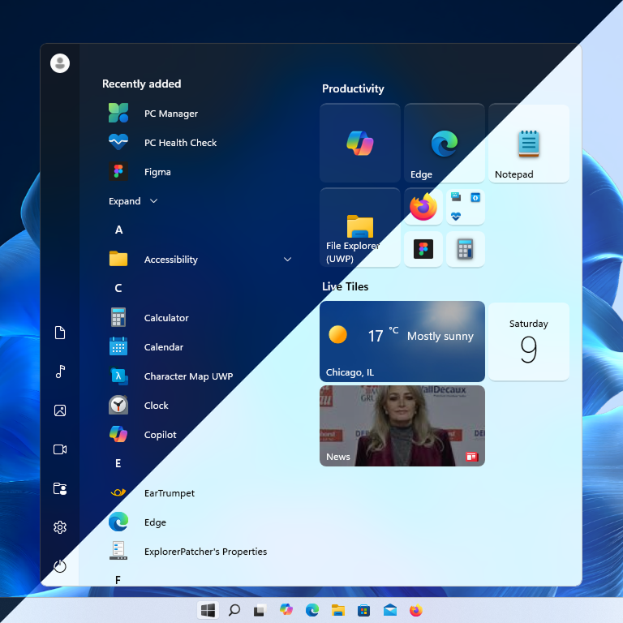
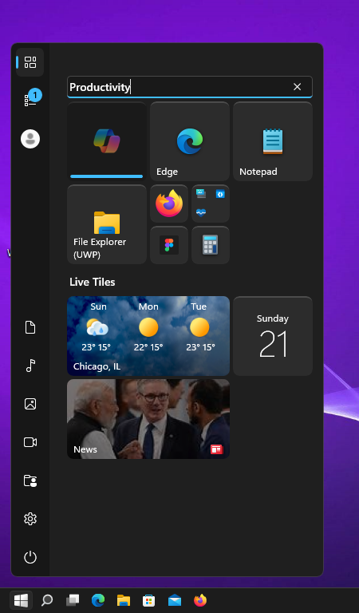
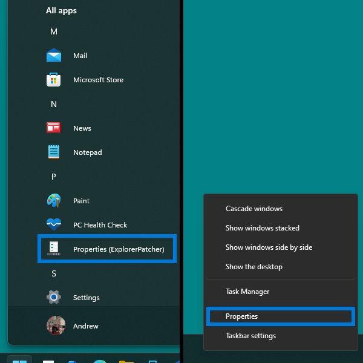
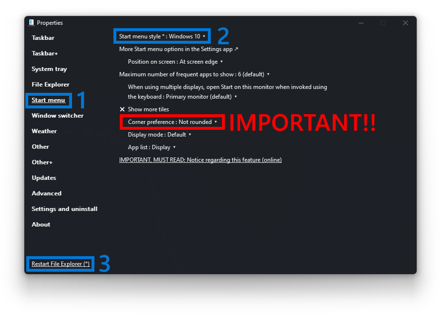

# ModernStartMenu theme for Windows 11 Start Menu Styler (Windows 10 Start menu)

A Fluent start menu theme for Windows 10 Start menu on Windows 11.

**Author**: [ndrew6075](https://github.com/ndrew6075)




## Windows 10 Start menu on Windows 11 installation

If you're already using the Windows 10 Start menu, you can skip this step.

**Installation:**
* Install [ExplorerPatcher](https://github.com/valinet/ExplorerPatcher) (Under the *"Releases"* page).
* Once installed, open *"Properties (ExplorerPatcher)"* via the Start menu or right-click the taskbar > *"Properties"*.
* Enable Windows 10 start menu by going to *"Start menu"* > *"Start menu style"* > *"Windows 10"* > *"Restart File Explorer"*.




> [!IMPORTANT]
> You may see *"Corner preference"* on the same page, keep it as *"Not rounded"*, as ModernStartMenu rounds the Start menu and makes it float instead of ExplorerPatcher.

## Bugs
* Legacy Windows 10 effects (Reveal, and 3D push) are still present.
* Items may not align/center correctly on higher DPIs.
* Tiles background are broken when dragged from applist.
* Right-click menus in textbox are not styled correctly.

## Unsupported configurations/settings
* Windows 10 (Partially supported) ([Segoe Fluent Icons](https://aka.ms/SegoeFluentIcons) required).
* Light mode (Support coming soon).
* *"Show accent color on Start and taskbar"* enabled.
* *"Show more tiles on Start"* enabled (ExplorerPatcher).
* Fullscreen Start menu (ExplorerPatcher).

## Manual installation

The theme styles have to be imported manually. To do that, follow these steps:

* Open the Windows 11 Start Menu Styler mod in Windhawk.
* Go to the "Advanced" tab.
* Copy the content below to the text box under "Mod settings" and click "Save".

<details>
<summary>Content to import (click to expand)</summary>

```yaml
styleConstants:
  - accentButtonNormal=<SolidColorBrush Color="{ThemeResource SystemAccentColorLight2}" />
  - accentButtonPointerOver=<SolidColorBrush Color="{ThemeResource SystemAccentColorLight2}" Opacity="0.9"/>
  - accentButtonPressed=<SolidColorBrush Color="{ThemeResource SystemAccentColorLight2}" Opacity="0.8"/>
  - buttonNormal=<AcrylicBrush TintColor="{ThemeResource SystemChromeMediumLowColor}" TintOpacity="0" TintLuminosityOpacity="0.96" FallbackColor="{ThemeResource SystemChromeMediumLowColor}" />
  - buttonPointerOver=<AcrylicBrush TintColor="{ThemeResource SystemChromeHighColor}" TintOpacity="0" TintLuminosityOpacity="0.25" FallbackColor="{ThemeResource SystemChromeMediumHighColor}" />
  - buttonPressed=<AcrylicBrush TintColor="{ThemeResource SystemChromeMediumLowColor}" TintOpacity="0" TintLuminosityOpacity="0.12" FallbackColor="#272727" />
  - background=<AcrylicBrush TintColor="{ThemeResource SystemChromeMediumColor}" TintOpacity="0" TintLuminosityOpacity="0.96" FallbackColor="{ThemeResource SystemChromeMediumColor}" />
  - borderBrush=<AcrylicBrush TintColor="{ThemeResource SystemChromeHighColor}" TintOpacity="0" TintLuminosityOpacity="0.48" FallbackColor="#424242" />
  - fontFamily=Segoe UI Variable
  - buttonBorderBrush=<AcrylicBrush TintColor="{ThemeResource SystemChromeMediumHighColor}" TintOpacity="0" TintLuminosityOpacity="0.96" FallbackColor="{ThemeResource SystemChromeMediumHighColor}" />
  - accentButtonBorderBrush=<AcrylicBrush TintColor="{ThemeResource SystemAccentColorLight1}" TintOpacity="0.25" TintLuminosityOpacity="0.25" FallbackColor="{ThemeResource SystemAccentColorLight1}"/>
controlStyles:
  - target: Border#AcrylicBorder
    styles:
      - Background:=<AcrylicBrush TintColor="{ThemeResource SystemChromeMediumColor}" TintOpacity="0.24" TintLuminosityOpacity="0.96" FallbackColor="{ThemeResource SystemChromeMediumColor}" />
      - BorderBrush:=$borderBrush
      - BorderThickness=1
      - CornerRadius=8
  - target: Border#NameTextBlockHost > TextBlock
    styles:
      - FontWeight=SemiBold
      - FontSize=14
      - FontFamily=$fontFamily
      - Margin=3,0,0,-6
  - target: StartUI.AllAppsPane
    styles:
      - Margin=12,0,0,0
      - FontWeight=Semibold
      - Width=253
  - target: Button#Header > Border > TextBlock
    styles:
      - FontSize=14
      - FontWeight=SemiBold
      - Margin=0,0,-16,2
      - FontFamily=$fontFamily
  - target: Grid#ContentPaneGrid
    styles:
      - Margin=0,24,0,0
  - target: TextBlock#AppDisplayName
    styles:
      - FontSize=12
      - Margin=20,0,0,0
      - FontFamily=$fontFamily
  - target: TextBlock#DisplayName
    styles:
      - FontSize=12
      - Margin=0,0,0,5
      - FontFamily=$fontFamily
  - target: Windows.UI.Xaml.Controls.Primitives.ListViewItemPresenter#Root@CommonStates
    styles:
      - RevealBackground@PointerOver:=$buttonNormal
      - RevealBackground@Pressed:=<AcrylicBrush TintColor="{ThemeResource SystemChromeMediumLowColor}" TintOpacity="0" TintLuminosityOpacity="0.64" FallbackColor="{ThemeResource SystemChromeMediumLowColor}" />
      - CornerRadius=9
      - PointerOverBackground:=
      - PressedBackground:=
      - SelectedBackground:=
      - RevealBorderBrush:=
      - RevealBackground@Normal:=
  - target: StartUI.NavigationPaneGrid
    styles:
      - CornerRadius=8,0,0,8
      - Background:=<AcrylicBrush TintColor="{ThemeResource SystemChromeLowColor}" TintOpacity="0.16" TintLuminosityOpacity="0.96" FallbackColor="{ThemeResource SystemChromeLowColor}" />
      - BorderBrush:=$borderBrush
      - BorderThickness=1,1,0,1
  - target: Grid#VerticalRoot
    styles:
      - CornerRadius=6
  - target: Windows.UI.Xaml.Controls.Primitives.RepeatButton#VerticalSmallDecrease > Grid@CommonStates > FontIcon > Grid > TextBlock
    styles:
      - Text=
      - Foreground@Normal:=<SolidColorBrush Color="{ThemeResource SystemBaseHighColor}" Opacity="0.5" />
      - Foreground@PointerOver:=<SolidColorBrush Color="{ThemeResource SystemBaseHighColor}" Opacity="0.75" />
      - Foreground@Pressed:=<SolidColorBrush Color="{ThemeResource SystemBaseHighColor}" Opacity="0.75" />
      - FontSize@Pressed=6
  - target: Windows.UI.Xaml.Controls.Primitives.RepeatButton#VerticalSmallIncrease > Grid@CommonStates > FontIcon > Grid > TextBlock
    styles:
      - Text=
      - Foreground@Normal:=<SolidColorBrush Color="{ThemeResource SystemBaseHighColor}" Opacity="0.5" />
      - Foreground@PointerOver:=<SolidColorBrush Color="{ThemeResource SystemBaseHighColor}" Opacity="0.75" />
      - Foreground@Pressed:=<SolidColorBrush Color="{ThemeResource SystemBaseHighColor}" Opacity="0.75" />
      - FontSize@Pressed=6
  - target: StartUI.GroupHeaderControl
    styles:
      - CornerRadius=6
  - target: Rectangle#ThumbVisual
    styles:
      - Width=6
      - Fill:=<SolidColorBrush Color="{ThemeResource SystemBaseHighColor}" Opacity="0.5" />
      - RadiusX=4
      - RadiusY=4
  - target: MenuFlyoutItem > Grid > TextBlock
    styles:
      - FontSize=14
      - FontFamily=$fontFamily
  - target: Grid#GridForContextMenuInvoke_MustHave_No_Columns_Or_Rows > Grid > TextBlock
    styles:
      - FontSize=14
      - FontFamily=$fontFamily
  - target: StartUI.TileFolderNameTextBox
    styles:
      - FontSize=14
      - FontWeight=SemiBold
      - FontFamily=$fontFamily
  - target: ToggleMenuFlyoutItem > Grid > Grid > FontIcon
    styles:
      - Glyph:=&#xE73E;
  - target: Border#UninstallFlyoutPresenterBorder
    styles:
      - Width=376
      - Height=149
      - Background:=$background
      - BorderBrush:=$borderBrush
      - CornerRadius=8
  - target: StartUI.UninstallFlyoutControl > StackPanel > TextBlock
    styles:
      - FontSize=14
      - FontFamily=$fontFamily
      - Text=This app and its related information will be removed.
      - Margin=9,8,0,0
  - target: Button#UninstallButton > Grid@CommonStates > ContentPresenter
    styles:
      - Background@Normal:=$accentButtonNormal
      - Background@PointerOver:=$accentButtonPointerOver
      - Background@Pressed:=$accentButtonPressed
      - BorderThickness=0,0,0,1
      - BorderBrush:=$accentButtonBorderBrush
  - target: Button#UninstallButton > Grid@CommonStates > ContentPresenter > TextBlock
    styles:
      - FontFamily=$fontFamily
      - FontWeight=Normal
      - Foreground=Black
      - Opacity@Pressed=0.64
  - target: TextBlock#StatusMessage
    styles:
      - Margin=20,0,0,0
      - FontFamily=$fontFamily
  - target: Rectangle#SelectionRectangle
    styles:
      - RadiusX=2
      - RadiusY=2
      - Height=32
  - target: Border#Border@CommonStates
    styles:
      - Background@PointerOver:=$buttonNormal
      - Background@Pressed:=<AcrylicBrush TintColor="{ThemeResource SystemChromeMediumLowColor}" TintOpacity="0" TintLuminosityOpacity="0.64" FallbackColor="{ThemeResource SystemChromeMediumLowColor}" />
      - CornerRadius=6
      - BorderBrush=Transparent
  - target: StartUI.NavigationPaneButton#PowerButton > ContentPresenter@CommonStates
    styles:
      - Background@PointerOver:=$buttonNormal
      - Background@Pressed:=<AcrylicBrush TintColor="{ThemeResource SystemChromeMediumLowColor}" TintOpacity="0" TintLuminosityOpacity="0.64" FallbackColor="{ThemeResource SystemChromeMediumHighColor}" />
      - BorderBrush:=
      - CornerRadius=6
      - Margin=-1,0,-1,0
  - target: StartUI.NavigationPaneButton#UserTileButton > ContentPresenter@CommonStates
    styles:
      - Background@PointerOver:=$buttonNormal
      - Background@Pressed:=<AcrylicBrush TintColor="{ThemeResource SystemChromeMediumLowColor}" TintOpacity="0" TintLuminosityOpacity="0.64" FallbackColor="{ThemeResource SystemChromeMediumHighColor}" />
      - BorderBrush:=
      - CornerRadius=6
      - Margin=-1,0,-1,0
  - target: Grid#RootPanel@CommonStates > ContentPresenter
    styles:
      - BorderBrush:=
      - Background@PointerOver:=$buttonNormal
      - Background@Pressed:=<AcrylicBrush TintColor="{ThemeResource SystemChromeMediumLowColor}" TintOpacity="0" TintLuminosityOpacity="0.64" FallbackColor="{ThemeResource SystemChromeMediumHighColor}" />
      - Background@PressedSelected:=<AcrylicBrush TintColor="{ThemeResource SystemChromeMediumLowColor}" TintOpacity="0" TintLuminosityOpacity="0.64" FallbackColor="{ThemeResource SystemChromeMediumHighColor}" />
      - Background@PointerOverSelected:=<AcrylicBrush TintColor="{ThemeResource SystemChromeMediumLowColor}" TintOpacity="0" TintLuminosityOpacity="0.48" FallbackColor="{ThemeResource SystemChromeMediumHighColor}" />
      - CornerRadius=6
      - BorderThickness=0
  - target: StartUI.AllAppsGridListViewItem
    styles:
      - CornerRadius=6
  - target: Button#Header
    styles:
      - CornerRadius=6
  - target: Grid#RootPanel
    styles:
      - CornerRadius=6
  - target: Button#PinButton > Grid@CommonStates
    styles:
      - Background@PointerOver:=<AcrylicBrush TintColor="{ThemeResource SystemChromeHighColor}" TintOpacity="0" TintLuminosityOpacity="0.25" FallbackColor="#424242" />
      - Background@Pressed:=<AcrylicBrush TintColor="{ThemeResource SystemChromeMediumHighColor}" TintOpacity="0" TintLuminosityOpacity="0.96" FallbackColor="{ThemeResource SystemChromeMediumHighColor}" />
      - CornerRadius=0,4,4,0
  - target: MenuFlyoutPresenter
    styles:
      - MinWidth=165
      - CornerRadius=8
      - Background:=<AcrylicBrush TintColor="{ThemeResource SystemChromeMediumColor}" TintOpacity="0" TintLuminosityOpacity="0.96" FallbackColor="{ThemeResource SystemChromeMediumColor}" />
  - target: JumpViewUI.ItemNotFoundFlyoutControl > StackPanel > TextBlock
    styles:
      - FontFamily=$fontFamily
      - FontSize=15
  - target: StackPanel > Button#DeleteButton > Grid@CommonStates
    styles:
      - Background@Normal:=$buttonNormal
      - Background@PointerOver:=$buttonPointerOver
      - Background@Pressed:=$buttonPressed
      - BorderThickness=1
      - BorderBrush:=$buttonBorderBrush
  - target: StackPanel > Button#DeleteButton > Grid@CommonStates > ContentPresenter > TextBlock
    styles:
      - FontFamily=$fontFamily
      - FontSize=14
      - Opacity@Pressed=0.84
      - Margin=0,-1,0,0
  - target: Button#CancelButton > Grid@CommonStates > ContentPresenter
    styles:
      - Background@Normal:=$accentButtonNormal
      - Background@PointerOver:=$accentButtonPointerOver
      - Background@Pressed:=$accentButtonPressed
      - BorderThickness=0,0,0,1
      - BorderBrush:=$accentButtonBorderBrush
  - target: Button#CancelButton > Grid@CommonStates > ContentPresenter > TextBlock
    styles:
      - FontFamily=$fontFamily
      - FontSize=14
      - Foreground=Black
      - Opacity@Pressed=0.64
  - target: MenuFlyoutItem > Grid#LayoutRoot > Grid#InnerRoot > Ellipse
    styles:
      - Width=32
      - Height=32
      - Margin=1,0,0,2
  - target: MenuFlyoutItem > Grid#LayoutRoot > Grid#InnerRoot > StackPanel > TextBlock#TextBlock
    styles:
      - FontSize=14
      - Margin=8,-1,0,1
      - FontFamily=$fontFamily
  - target: MenuFlyoutItem
    styles:
      - CornerRadius=4
      - Margin=3,-1,3,0
  - target: MenuFlyoutSubItem
    styles:
      - CornerRadius=4
      - FontSize=14
      - Margin=3,0,3,0
      - FontFamily=$fontFamily
      - MinHeight=30
  - target: ToggleMenuFlyoutItem
    styles:
      - CornerRadius=4
      - FontSize=14
      - Margin=3,0,3,0
      - FontFamily=$fontFamily
      - MinHeight=30
  - target: StackPanel > Button#DeleteButton
    styles:
      - CornerRadius=4
      - MinWidth=150
      - Height=32
  - target: Button#CancelButton
    styles:
      - CornerRadius=4
      - MinWidth=150
      - Height=32
  - target: StartUI.NavigationPaneBadgeView > Grid
    styles:
      - Margin=-16,-23,0,7
  - target: StartUI.NavigationPaneBadgeView > Grid > Windows.UI.Xaml.Shapes.Rectangle
    styles:
      - Fill:=<SolidColorBrush Color="{ThemeResource SystemAccentColorLight2}" />
  - target: StartUI.NavigationPaneBadgeView#Badge > Grid > TextBlock
    styles:
      - Foreground=Black
      - FontFamily=$fontFamily
  - target: ItemsStackPanel > StartUI.ViewSelectionListViewItem > Grid@CommonStates
    styles:
      - Background@Selected:=$buttonNormal
  - target: Button#PinButton > Grid@CommonStates > Border
    styles:
      - Background=Transparent
      - Height=16
      - BorderBrush:=$borderBrush
      - BorderThickness=0.5,0,0,0
      - CornerRadius=0
      - ChildTransitions:=<TransitionCollection><EntranceThemeTransition IsStaggeringEnabled="True" FromHorizontalOffset="0" FromVerticalOffset="37.5" /></TransitionCollection>
  - target: JumpViewUI.JumpListListViewItem
    styles:
      - CornerRadius=4
      - Height=30
  - target: Windows.UI.Xaml.Controls.Primitives.ListViewItemPresenter@CommonStates > StartUI.TileViewControl > Grid > Border#Background
    styles:
      - Background@PointerOver:=<AcrylicBrush TintColor="{ThemeResource SystemChromeHighColor}" TintOpacity="0" TintLuminosityOpacity="0.24" FallbackColor="#424242" />
      - Background@Normal:=<AcrylicBrush TintColor="{ThemeResource SystemChromeMediumLowColor}" TintOpacity="0" TintLuminosityOpacity="0.72" FallbackColor="{ThemeResource SystemChromeMediumLowColor}" />
      - BorderThickness=0,1.5,0,0
      - CornerRadius=8
      - BorderBrush:=<AcrylicBrush TintColor="{ThemeResource SystemChromeHighColor}" TintOpacity="0" TintLuminosityOpacity="0.48" FallbackColor="#5B5B5B" />
  - target: TileGridNestedPanel > StartUI.TileListViewItem > Windows.UI.Xaml.Controls.Primitives.ListViewItemPresenter
    styles:
      - RevealBackground:=
      - PointerOverBackground:=
      - PressedBackground:=
      - CornerRadius=8
  - target: ToolTip > ContentPresenter
    styles:
      - CornerRadius=4
      - Background:=<AcrylicBrush TintColor="{ThemeResource SystemChromeMediumLowColor}" TintOpacity="0" TintLuminosityOpacity="0.96" FallbackColor="{ThemeResource SystemChromeMediumLowColor}" />
      - BorderThickness=0
  - target: Button#UninstallButton
    styles:
      - Margin=0,15,9,0
      - MinWidth=159
      - Height=32
      - CornerRadius=4
  - target: StartUI.StartSizingFramePanel
    styles:
      - Margin=13
      - CornerRadius=8
  - target: Border#LogoBackgroundPlate
    styles:
      - Margin=12,6,0,6
  - target: MenuFlyoutItem > Grid@CommonStates
    styles:
      - Padding=12,0,0,0
      - MinHeight=30
      - Background@PointerOver:=$buttonNormal
      - Background@Pressed:=<AcrylicBrush TintColor="{ThemeResource SystemChromeMediumLowColor}" TintOpacity="0" TintLuminosityOpacity="0.64" FallbackColor="{ThemeResource SystemChromeMediumHighColor}" />
      - BorderBrush:=
      - MinWidth=208
  - target: ToggleMenuFlyoutItem > Grid@CommonStates
    styles:
      - Padding=12,0,0,0
      - Height=28
      - Background@PointerOver:=$buttonNormal
      - Background@Pressed:=<AcrylicBrush TintColor="{ThemeResource SystemChromeMediumLowColor}" TintOpacity="0" TintLuminosityOpacity="0.64" FallbackColor="{ThemeResource SystemChromeMediumHighColor}" />
      - BorderBrush:=
  - target: TextBlock#ShutdownConfirmationTextBlock
    styles:
      - FontFamily=$fontFamily
  - target: Button#ShutdownConfirmationButton
    styles:
      - Margin=0,17,0,0
      - MinWidth=150
      - Height=32
      - CornerRadius=4
  - target: Button#ShutdownConfirmationButton > ContentPresenter@CommonStates
    styles:
      - Background@Normal:=$buttonNormal
      - Background@PointerOver:=$buttonPointerOver
      - Background@Pressed:=$buttonPressed
      - BorderThickness=1
      - BorderBrush:=<AcrylicBrush TintColor="{ThemeResource SystemChromeMediumHighColor}" TintOpacity="0" TintLuminosityOpacity="0.96" FallbackColor="{ThemeResource SystemChromeMediumHighColor}" />
  - target: Border#NameTextBoxHost > TextBox > Grid > Button#DeleteButton > Grid@CommonStates
    styles:
      - Background@PointerOver:=<AcrylicBrush TintColor="{ThemeResource SystemChromeHighColor}" TintOpacity="0" TintLuminosityOpacity="0.25" FallbackColor="{ThemeResource SystemChromeMediumHighColor}" />
      - CornerRadius=4
      - Height=20
      - Width=28
      - Margin=-12,0,0,0
      - Background@Pressed:=<AcrylicBrush TintColor="{ThemeResource SystemChromeMediumHighColor}" TintOpacity="0" TintLuminosityOpacity="0.48" FallbackColor="{ThemeResource SystemChromeMediumColor}" />
  - target: Border#NameTextBoxHost > TextBox
    styles:
      - FontWeight=Semibold
      - FontSize=14
      - FontFamily=$fontFamily
  - target: Grid#InnerRoot
    styles:
      - Height=46
  - target: TextBlock#SignedInStatus
    styles:
      - FontSize=12
      - Margin=8,-1,0,3
      - FontFamily=$fontFamily
  - target: MenuFlyoutSeparator > Rectangle
    styles:
      - Fill:=<AcrylicBrush TintColor="{ThemeResource SystemChromeMediumHighColor}" TintOpacity="0" TintLuminosityOpacity="0.96" FallbackColor="{ThemeResource SystemChromeMediumHighColor}"/>
      - Margin=0,4,0,3
  - target: TextBlock#ExpandCollapseButtonText
    styles:
      - Margin=12,0,0,0
      - FontFamily=$fontFamily
  - target: Grid#RootPanel@CommonStates > Rectangle
    styles:
      - Fill@Selected:=$accentButtonNormal
      - Height=16
      - Width=3
      - RadiusX=2
      - RadiusY=2
      - Canvas.ZIndex=1
      - Fill@PointerOverSelected:=$accentButtonNormal
  - target: 'StartUI.NavigationPaneGrid > StartUI.UserTileView > StartUI.NavigationPaneButton#UserTileButton '
    styles:
      - Margin=6
      - Height=36
      - CornerRadius=6
  - target: 'StartUI.NavigationPaneGrid > StartUI.PowerOptionsView > StartUI.NavigationPaneButton#PowerButton '
    styles:
      - Margin=6
      - Height=36
      - CornerRadius=6
  - target: StartUI.ViewSelectionListViewItem
    styles:
      - Margin=6
      - Height=36
      - CornerRadius=6
  - target: StartUI.AppListViewItem
    styles:
      - Margin=6
      - Height=36
      - CornerRadius=6
  - target: StartUI.AppListViewItem > Grid#RootPanel@CommonStates > ContentPresenter > StartUI.NavigationPaneItemPanel > FontIcon
    styles:
      - Margin=-12,0,0,0
      - Opacity@Pressed=0.84
  - target: StartUI.NavigationPaneButton#PowerButton > ContentPresenter@CommonStates > StartUI.NavigationPaneItemPanel > Grid > FontIcon
    styles:
      - Margin=-12,0,0,0
      - Opacity@Pressed=0.84
  - target: StartUI.NavigationPaneButton#UserTileButton > ContentPresenter@CommonStates > StartUI.NavigationPaneItemPanel > Grid
    styles:
      - Margin=-12,0,0,0
      - Opacity@Pressed=0.84
  - target: JumpViewUI.ItemNotFoundFlyoutControl > StackPanel > StackPanel > TextBlock
    styles:
      - FontFamily=$fontFamily
  - target: JumpViewUI.JumpListCategoryHeaderControl > Grid > TextBlock#HeadingTextBlock
    styles:
      - Margin=15,9,0,5
      - FontFamily=$fontFamily
  - target: MenuFlyoutSubItem > Grid@CommonStates
    styles:
      - Background@SubMenuOpened:=<AcrylicBrush TintColor="{ThemeResource SystemChromeMediumLowColor}" TintOpacity="0" TintLuminosityOpacity="0.96" FallbackColor="{ThemeResource SystemChromeMediumLowColor}" />
      - Background@PointerOver:=<AcrylicBrush TintColor="{ThemeResource SystemChromeMediumLowColor}" TintOpacity="0" TintLuminosityOpacity="0.96" FallbackColor="{ThemeResource SystemChromeMediumLowColor}" />
      - Padding=12,0,0,0
      - BorderBrush:=
  - target: Viewbox > Border > TextBlock
    styles:
      - FontWeight=SemiBold
      - Margin=0,0,0,4
      - FontFamily=$fontFamily
  - target: StartUI.AllAppsZoomListViewItem
    styles:
      - CornerRadius=6
  - target: TextBlock#FolderDisplayName
    styles:
      - Margin=9,0,0,5
      - FontFamily=$fontFamily
  - target: JumpViewUI.JumpListListViewItem > Grid@CommonStates
    styles:
      - Background@PointerOver:=$buttonNormal
      - Background@Pressed:=<AcrylicBrush TintColor="{ThemeResource SystemChromeMediumLowColor}" TintOpacity="0" TintLuminosityOpacity="0.64" FallbackColor="{ThemeResource SystemChromeMediumHighColor}" />
      - BorderBrush:=
  - target: Button#PinButton
    styles:
      - MinWidth=44
  - target: Button#PinButton > Grid@CommonStates > Border > ContentPresenter > TextBlock
    styles:
      - Margin=3,0,0,0
      - Opacity@Pressed=0.84
  - target: FontIcon#SubItemChevron
    styles:
      - Margin=-30,0,0,0
      - Glyph:=&#xE76C;
  - target: Border#SmallLogo
    styles:
      - Margin=0,0,0,4
  - target: MenuFlyoutPresenter > Grid > ScrollViewer > Border
    styles:
      - ChildTransitions:=<TransitionCollection><EntranceThemeTransition IsStaggeringEnabled="True" FromHorizontalOffset="-37.5" FromVerticalOffset="0" /></TransitionCollection>
  - target: ToolTip > ContentPresenter#LayoutRoot > TextBlock
    styles:
      - FontFamily=$fontFamily
  - target: StartUI.AllAppsGridListViewItem[AutomationProperties.AutomationId=RecentList] > StackPanel > Button > Border > TextBlock
    styles:
      - Margin=7,0,0,2
  - target: Button#ShutdownReasonButton
    styles:
      - MinWidth=150
      - Height=32
      - CornerRadius=4
  - target: Button#ShutdownReasonButton > ContentPresenter@CommonStates
    styles:
      - Background@Normal:=$buttonNormal
      - Background@PointerOver:=$buttonPointerOver
      - Background@Pressed:=$buttonPressed
      - BorderThickness=1
      - BorderBrush:=$buttonBorderBrush
  - target: ComboBox#ShutdownReasonComboBox
    styles:
      - CornerRadius=4
      - MinWidth=166
      - FontFamily=$fontFamily
  - target: ComboBox > Grid@CommonStates > Border#Background
    styles:
      - Background@Normal:=$buttonNormal
      - CornerRadius=4
      - BorderThickness=1
      - BorderBrush:=$buttonBorderBrush
      - Background@PointerOver:=$buttonPointerOver
      - Background@Pressed:=$buttonPressed
      - Background@Selected=Red
      - Background@SelectedPointerOver=Yellow
  - target: ComboBoxItem
    styles:
      - CornerRadius=4
      - Margin=3,0,3,0
  - target: ComboBoxItem > Grid@CommonStates
    styles:
      - Background@PointerOver:=$buttonNormal
      - Background@Pressed:=$buttonNormal
      - Background@Selected:=$buttonNormal
      - Background@SelectedPressed:=$buttonNormal
      - Background@SelectedUnfocused:=$buttonNormal
      - Background@SelectedDisabled:=$buttonNormal
      - Background@SelectedPointerOver:=<AcrylicBrush TintColor="{ThemeResource SystemChromeMediumLowColor}" TintOpacity="0" TintLuminosityOpacity="0.48" FallbackColor="{ThemeResource SystemChromeMediumLowColor}" />
      - BorderBrush:=
  - target: Border#PopupBorder
    styles:
      - Background:=$background
      - CornerRadius=8
  - target: FlyoutPresenter
    styles:
      - CornerRadius=8
      - Background:=$background
      - BorderBrush:=$borderBrush
      - Padding=16
  - target: StackPanel#ShutdownConfirmationFlyoutPanel
    styles:
      - Margin=0,-1.5,0,0
  - target: StackPanel#ShutdownReasonFlyoutPanel
    styles:
      - Margin=0,-3,0,0
  - target: Button#ShutdownConfirmationButton > ContentPresenter@CommonStates > TextBlock
    styles:
      - FontFamily=$fontFamily
      - FontSize=14
      - Opacity@Pressed=0.84
      - Foreground=White
  - target: Button#ShutdownReasonButton > ContentPresenter@CommonStates > TextBlock
    styles:
      - FontFamily=$fontFamily
      - FontSize=14
      - Opacity@Pressed=0.84
      - Foreground=White
  - target: ComboBox > Grid@CommonStates > ContentPresenter > TextBlock
    styles:
      - FontFamily=$fontFamily
      - FontSize=14
      - Opacity@Pressed=0.84
      - Foreground=White
  - target: ComboBoxItem > Grid@CommonStates > ContentPresenter > TextBlock
    styles:
      - FontFamily=$fontFamily
      - FontSize=14
      - Opacity@Pressed=0.84
      - Foreground=White
      - Margin=0,1,0,-1
  - target: StartUI.AllAppsGridListViewItem[AutomationProperties.AutomationId=FrequentList] > StackPanel > Button > Border > TextBlock
    styles:
      - Margin=7,0,0,2
  - target: TextBlock#FolderGlyph
    styles:
      - FontSize=9
      - FontWeight=Light
  - target: ItemsWrapGrid > StartUI.AllAppsZoomListViewItem > Windows.UI.Xaml.Controls.Primitives.ListViewItemPresenter > Border > TextBlock
    styles:
      - FontWeight=Light
      - FontFamily=Segoe Fluent Icons
  - target: Grid#MainGrid@InteractionStates > Rectangle#BackgroundElement
    styles:
      - Fill@InteractionState_Edit:=
      - Fill@InteractionState_Rest:=
      - Fill@InteractionState_Pressed:=
      - Fill@InteractionState_Drag:=
      - StrokeThickness=0
      - RadiusX=4
      - RadiusY=4
  - target: Border#NameTextBoxHost > TextBox > Grid > Border#BackgroundElement
    styles:
      - Background:=<AcrylicBrush TintColor="{ThemeResource SystemChromeLowColor}" TintOpacity="0.72" TintLuminosityOpacity="0.96" FallbackColor="{ThemeResource SystemChromeLowColor}" />
      - CornerRadius=4
      - BorderThickness=0.5,0.5,0.5,0
      - BorderBrush:=<AcrylicBrush TintColor="{ThemeResource SystemChromeHighColor}" TintOpacity="0" TintLuminosityOpacity="0.4" FallbackColor="{ThemeResource SystemChromeMediumHighColor}" />
  - target: Border#NameTextBoxHost > TextBox > Grid > Border#BorderElement
    styles:
      - BorderThickness=0,0,0,1.5
      - CornerRadius=4
      - Height=28
      - BorderBrush:=$accentButtonNormal
      - Width=258
  - target: Grid#MainGrid@FocusStates > Rectangle#BackgroundElement
    styles:
      - Fill@FocusState_Hover:=$buttonNormal
      - Fill@FocusState_None=Transparent
      - Fill@FocusState_HoverPlaceholder:=$buttonNormal
      - StrokeThickness=0
      - Margin=0,0,50,0
      - Width=258
      - Height=28
      - RadiusX=4
      - RadiusY=4
  - target: Grid#MainGrid@FocusStates > Grid > Border#NameTextBlockHost
    styles:
      - BorderThickness=0,0,0,1.5
      - BorderBrush@FocusState_Hover:=<AcrylicBrush TintColor="{ThemeResource SystemChromeHighColor}" TintOpacity="0" TintLuminosityOpacity="0.96" FallbackColor="#5B5B5B" />
      - CornerRadius=4
      - Height=28
      - BorderBrush@FocusState_HoverPlaceholder:=<AcrylicBrush TintColor="{ThemeResource SystemChromeHighColor}" TintOpacity="0" TintLuminosityOpacity="0.96" FallbackColor="#5B5B5B" />
      - Width=258
      - Margin=0,0,2,0
  - target: StackPanel > Button#DeleteButton > Grid > ContentPresenter
    styles:
      - BorderBrush:=
  - target: FontIcon
    styles:
      - FontFamily=Segoe Fluent Icons
      - Foreground=White
  - target: Grid#ContentRoot
    styles:
      - BorderThickness=1,0,0,0
      - BorderBrush:=<AcrylicBrush TintColor="{ThemeResource SystemColorButtonTextColor}" TintOpacity="0" TintLuminosityOpacity="0.4" FallbackColor="#141414" />
      - Margin=0,1,0,1
  - target: Border#NameTextBoxHost > TextBox
    styles:
      - Margin=-2,0,0,0
  - target: SplitView#RootContent
    styles:
      - IsPaneOpen=False
      - OpenPaneLength=48
  - target: StartUI.NavigationPaneGrid > Border
    styles:
      - Background:=<AcrylicBrush TintColor="{ThemeResource SystemChromeLowColor}" TintOpacity="0.25" TintLuminosityOpacity="0.96" FallbackColor="{ThemeResource SystemChromeLowColor}" />
      - Width=48
  - target: StartUI.ExpandCollapseButton
    styles:
      - Visibility=Collapsed
  - target: Windows.UI.Xaml.Controls.Primitives.ListViewItemPresenter > Grid > ProgressBar
    styles:
      - CornerRadius=2
      - Margin=20,0,4,4
  - target: Windows.UI.Xaml.Controls.Primitives.ListViewItemPresenter > Grid > ProgressBar > Grid > Border > Rectangle
    styles:
      - Fill:=$accentButtonNormal
      - Margin=-1,-2,0,-2
      - RadiusX=4
      - RadiusY=4
  - target: Border#NameTextBoxHost > TextBox > Grid > Button#DeleteButton > Grid@CommonStates > Border > TextBlock#GlyphElement
    styles:
      - Foreground=White
      - Opacity@Pressed=0.84
  - target: ScrollViewer#ContentElement
    styles:
      - Foreground=White
      - Margin=5,0,0,1
      - FontFamily=Segoe UI Variable Small
  - target: Windows.UI.Xaml.Controls.Primitives.ListViewItemPresenter > Grid > ProgressBar > Grid > Border
    styles:
      - BorderThickness=1
      - Background:=<SolidColorBrush Color="{ThemeResource SystemChromeHighColor}" Opacity="0.5" />
  - target: TextBlock#Badge
    styles:
      - FontFamily=$fontFamily
  - target: StartUI.UserTileView
    styles:
      - Grid.Row=1
  - target: StartUI.ViewSelectionListView
    styles:
      - Grid.Row=0
  - target: Border#HighlightBackground
    styles:
      - Background:=<AcrylicBrush TintColor="{ThemeResource SystemChromeHighColor}" TintOpacity="0" TintLuminosityOpacity="0.14" FallbackColor="{ThemeResource SystemChromeMediumHighColor}" />
      - Margin=-2
      - CornerRadius=6
      - BorderBrush=White
  - target: Button#DeleteButton > Grid > Border
    styles:
      - Background=Transparent
  - target: StartUI.TileFolderNameTextBox > Grid@CommonStates > Border#BorderElement
    styles:
      - Background@PointerOver:=$buttonNormal
      - Background@Focused:=<AcrylicBrush TintColor="{ThemeResource SystemChromeLowColor}" TintOpacity="0.72" TintLuminosityOpacity="0.96" FallbackColor="{ThemeResource SystemChromeLowColor}" />
      - CornerRadius=4
      - ' BorderThickness=0.5,0.5,0.5,0'
      - BorderBrush@Focused:=<AcrylicBrush TintColor="{ThemeResource SystemChromeHighColor}" TintOpacity="0" TintLuminosityOpacity="0.4" FallbackColor="{ThemeResource SystemChromeMediumHighColor}" />
      - Height=28
      - Margin@PointerOver=-1
      - Margin@Focused=0
  - target: StartUI.TileFolderNameTextBox > Grid@CommonStates
    styles:
      - BorderThickness=0,0,0,1.5
      - BorderBrush@PointerOver:=<AcrylicBrush TintColor="{ThemeResource SystemChromeHighColor}" TintOpacity="0" TintLuminosityOpacity="0.96" FallbackColor="#5B5B5B" />
      - BorderBrush@Focused:=$accentButtonNormal
      - CornerRadius=4
      - Height=28
  - target: StartUI.TileFolderNameTextBox > Grid@CommonStates > Border > ScrollViewer
    styles:
      - Margin=3,-4,0,0
  - target: Border#DeleteButtonWrapper > Button#DeleteButton > Grid@CommonStates
    styles:
      - Background@PointerOver:=<AcrylicBrush TintColor="{ThemeResource SystemChromeHighColor}" TintOpacity="0" TintLuminosityOpacity="0.25" FallbackColor="{ThemeResource SystemChromeMediumHighColor}" />
      - Background@Pressed:=<AcrylicBrush TintColor="{ThemeResource SystemChromeMediumHighColor}" TintOpacity="0" TintLuminosityOpacity="0.48" FallbackColor="{ThemeResource SystemChromeMediumColor}" />
      - CornerRadius=4
      - Width=28
      - Height=20
      - Margin=-10,1,0,0
  - target: Border#DeleteButtonWrapper > Button#DeleteButton > Grid@CommonStates > Border > TextBlock#GlyphElement
    styles:
      - Foreground=White
      - Opacity@Pressed=0.84
  - target: Windows.UI.Xaml.Controls.Primitives.RepeatButton#VerticalSmallIncrease > Grid
    styles:
      - Background=Transparent
  - target: Windows.UI.Xaml.Controls.Primitives.RepeatButton#VerticalSmallDecrease > Grid
    styles:
      - Background=Transparent
  - target: StartUI.TileFolderNameTextBox > Grid@CommonStates > Border > TextBlock#PlaceholderTextContentPresenter
    styles:
      - Margin=2,-4,0,0
      - Opacity@Normal=0
      - Opacity@PointerOver=1
      - Opacity@Focused=0
  - target: Windows.UI.Xaml.Controls.Primitives.ScrollBar > Grid > Grid > Rectangle
    styles:
      - Fill:=<AcrylicBrush TintColor="{ThemeResource SystemChromeMediumHighColor}" TintOpacity="0" TintLuminosityOpacity="0.8" FallbackColor="{ThemeResource SystemChromeMediumLowColor}" />
      - RadiusX=4
      - RadiusY=4
  - target: Rectangle#Overlay
    styles:
      - Opacity=0.5
  - target: Border#OverlayBorder
    styles:
      - Opacity=0.5
  - target: StartUI.TileViewControl > Grid#MainGrid > Grid > ProgressBar
    styles:
      - CornerRadius=2
      - Margin=4
  - target: StartUI.TileViewControl > Grid#MainGrid > Grid > ProgressBar > Grid > Border > Rectangle
    styles:
      - Margin=-1,-2,0,-2
      - Fill:=$accentButtonNormal
      - RadiusX=4
      - RadiusY=4
  - target: StartUI.TileViewControl > Grid#MainGrid > Grid > ProgressBar > Grid > Border
    styles:
      - BorderThickness=1
      - Background:=<SolidColorBrush Color="{ThemeResource SystemChromeHighColor}" Opacity="0.5" />
  - target: StartUI.ViewSelectionListViewItem > Grid#RootPanel@CommonStates > ContentPresenter > StartUI.NavigationPaneItemPanel > FontIcon
    styles:
      - Margin=-12,0,0,0
      - Opacity@Pressed=0.84
      - Opacity@PressedSelected=0.84
```
</details>
