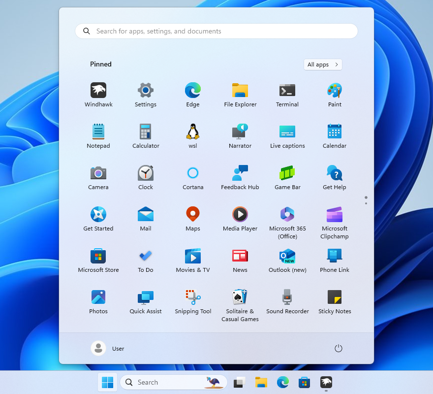
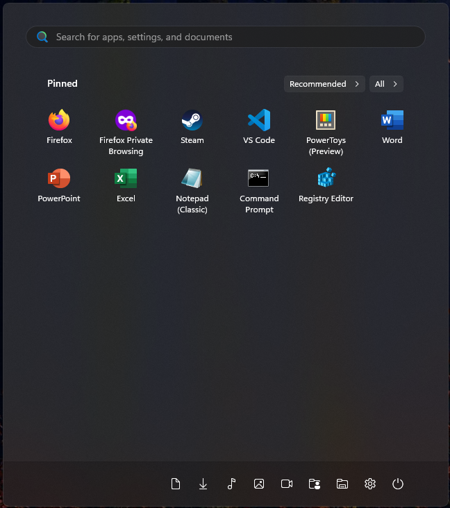

# NoRecommendedSection theme for Windows 11 Start Menu Styler

A simple theme which just removes the "Recommended" section from the Start menu.

**Author**: [m417z](https://github.com/m417z)



## Theme selection

The theme is integrated into the mod and can simply be selected from the mod's
settings:

* Open the Windows 11 Start Menu Styler mod in Windhawk.
* Go to the "Settings" tab.
* Select the theme and save the settings.

## Manual installation

The theme styles can also be imported manually. To do that, follow these steps:

* Open the Windows 11 Start Menu Styler mod in Windhawk.
* Go to the "Advanced" tab.
* Copy the content below to the text box under "Mod settings" and click "Save".

### Redesigned Start menu

A variant for the [redesigned Windows 11 Start
menu](https://microsoft.design/articles/start-fresh-redesigning-windows-start-menu/)
that is slowly rolling out in the 25H2 update.

*This variant is missing for the redesigned Start menu, but you can find a
variant that keeps the Recommended button below.*

> [!NOTE]
> The redesigned Start menu [provides an
> option](https://www.windowslatest.com/2025/06/15/remove-turn-off-windows-11-start-menu-recommended-section-version-24h2/)
> to disable the Recommended section natively.

### Classic Start menu

<details>
<summary>Content to import (click to expand)</summary>

```json
{
  "controlStyles[0].target": "Windows.UI.Xaml.Controls.Grid#TopLevelSuggestionsListHeader",
  "controlStyles[0].styles[0]": "Visibility=Collapsed",
  "controlStyles[1].target": "Windows.UI.Xaml.Controls.Grid#NoTopLevelSuggestionsText",
  "controlStyles[1].styles[0]": "Visibility=Collapsed",
  "controlStyles[2].target": "Windows.UI.Xaml.Controls.Grid#TopLevelSuggestionsContainer",
  "controlStyles[2].styles[0]": "Visibility=Collapsed",
  "controlStyles[3].target": "Windows.UI.Xaml.Controls.Grid#ShowMoreSuggestions",
  "controlStyles[3].styles[0]": "Visibility=Collapsed",
  "controlStyles[4].target": "StartMenu.PinnedList",
  "controlStyles[4].styles[0]": "Height=504"
}
```
</details>

## Keep Recommended button

A modification of NoRecommendedSection that moves the "Recommended" button next
to the "All" button. This way the "Recommended" list is still accessible without
taking up space.

**Note**: The button will only appear after a few entries are added to the
Recommended list, so you may need to open a few files and restart explorer to
see any difference.



### Redesigned Start menu

A variant for the [redesigned Windows 11 Start
menu](https://microsoft.design/articles/start-fresh-redesigning-windows-start-menu/)
that is slowly rolling out in the 25H2 update.

<details>
<summary>Content to import (click to expand)</summary>

```json
{
  "controlStyles[0].target": "Windows.UI.Xaml.Controls.Grid#TopLevelSuggestionsListHeader",
  "controlStyles[0].styles[0]": "Visibility=Collapsed",
  "controlStyles[1].target": "Windows.UI.Xaml.Controls.Grid#NoTopLevelSuggestionsText",
  "controlStyles[1].styles[0]": "Height=0",
  "controlStyles[2].target": "Windows.UI.Xaml.Controls.Grid#ShowMoreSuggestions",
  "controlStyles[2].styles[0]": "RenderTransform:=<TranslateTransform Y=\"8\"/>",
  "controlStyles[3].target": "Windows.UI.Xaml.Controls.Button#ShowMoreSuggestionsButton > Grid > Windows.UI.Xaml.Controls.ContentPresenter > Windows.UI.Xaml.Controls.StackPanel > Windows.UI.Xaml.Controls.TextBlock",
  "controlStyles[3].styles[0]": "Text=Recommended",
  "controlStyles[4].target": "Grid#TopLevelSuggestionsRoot > Grid[2] ",
  "controlStyles[4].styles[0]": "MinHeight=0",
  "controlStyles[5].target": "Grid#TopLevelSuggestionsRoot",
  "controlStyles[5].styles[0]": "Grid.Row=0",
  "controlStyles[6].target": "Windows.UI.Xaml.Controls.GridView#RecommendedList",
  "controlStyles[6].styles[0]": "Visibility=Collapsed",
  "controlStyles[7].target": "TextBlock#PinnedListHeaderText",
  "controlStyles[7].styles[0]": "RenderTransform:=<TranslateTransform Y=\"8\"/>",
  "controlStyles[8].target": "GridView",
  "controlStyles[8].styles[0]": "Margin=0,-8,0,0",
  "controlStyles[9].target": "Microsoft.UI.Xaml.Controls.DropDownButton",
  "controlStyles[9].styles[0]": "RenderTransform:=<TranslateTransform Y=\"-5\" />",
  "controlStyles[10].target": "Grid#TopLevelHeader > Grid[2] > Button",
  "controlStyles[10].styles[0]": "RenderTransform:=<TranslateTransform X=\"-135\" />"
}
```
</details>

### Classic Start menu

<details>
<summary>Content to import (click to expand)</summary>

```json
{
  "controlStyles[0].target": "Windows.UI.Xaml.Controls.Grid#TopLevelSuggestionsListHeader",
  "controlStyles[0].styles[0]": "Visibility=Collapsed",
  "controlStyles[1].target": "Windows.UI.Xaml.Controls.Grid#NoTopLevelSuggestionsText",
  "controlStyles[1].styles[0]": "Height=0",
  "controlStyles[2].target": "Windows.UI.Xaml.Controls.Grid#TopLevelSuggestionsContainer",
  "controlStyles[2].styles[0]": "Height=0",
  "controlStyles[3].target": "Windows.UI.Xaml.Controls.Grid#ShowMoreSuggestions",
  "controlStyles[3].styles[0]": "RenderTransform:=<TranslateTransform Y=\"-572\" X=\"-55\" />",
  "controlStyles[4].target": "StartMenu.PinnedList",
  "controlStyles[4].styles[0]": "Height=504",
  "controlStyles[5].target": "Windows.UI.Xaml.Controls.Grid#ShowMoreSuggestions > Windows.UI.Xaml.Controls.Button > Windows.UI.Xaml.Controls.ContentPresenter > Windows.UI.Xaml.Controls.StackPanel > Windows.UI.Xaml.Controls.TextBlock",
  "controlStyles[5].styles[0]": "Text=Recommended"
}
```
</details>
