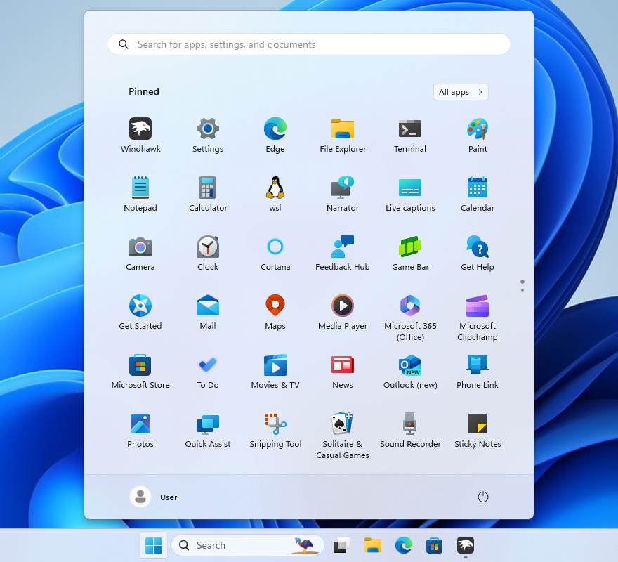
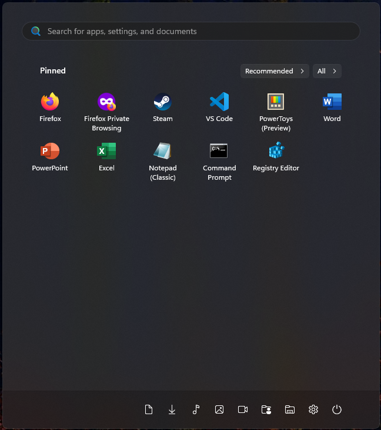

# NoRecommendedSection theme for Windows 11 Start Menu Styler

A simple theme which just removes the "Recommended" section from the Start menu.

**Author**: [m417z](https://github.com/m417z)



## Theme selection

The theme is integrated into the mod and can be selected directly from the mod's
settings:

* Open the Windows 11 Start Menu Styler mod in Windhawk.
* Go to the "Settings" tab.
* Select the theme and save the settings.

## Manual installation

The theme styles can also be imported manually. To do that, follow these steps:

* Open the Windows 11 Start Menu Styler mod in Windhawk.
* Go to the "Settings" tab and select "Textual mode".
* Copy the content below to the text box and click "Save settings".

### Redesigned Start menu

A variant for the [redesigned Windows 11 Start
menu](https://microsoft.design/articles/start-fresh-redesigning-windows-start-menu/)
that is slowly rolling out in the 25H2 update.

*This variant is missing for the redesigned Start menu, but you can find a
variant that keeps the Recommended button below.*

> [!NOTE]
> The redesigned Start menu [provides an
> option](https://www.windowslatest.com/2025/06/15/remove-turn-off-windows-11-start-menu-recommended-section-version-24h2/)
> to disable the Recommended section natively.

### Classic Start menu

<details>
<summary>Content to import (click to expand)</summary>

```yaml
controlStyles:
  - target: Windows.UI.Xaml.Controls.Grid#TopLevelSuggestionsListHeader
    styles:
      - Visibility=Collapsed
  - target: Windows.UI.Xaml.Controls.Grid#NoTopLevelSuggestionsText
    styles:
      - Visibility=Collapsed
  - target: Windows.UI.Xaml.Controls.Grid#TopLevelSuggestionsContainer
    styles:
      - Height=0
  - target: Windows.UI.Xaml.Controls.GridView#RecommendedList
    styles:
      - Visibility=Collapsed
  - target: Windows.UI.Xaml.Controls.Grid#ShowMoreSuggestions
    styles:
      - Visibility=Collapsed
  - target: StartMenu.PinnedList
    styles:
      - Height=504
```
</details>

## Keep Recommended button

A modification of NoRecommendedSection that moves the "Recommended" button next
to the "All" button. This way the "Recommended" list is still accessible without
taking up space.

**Note**: The button will only appear after a few entries are added to the
Recommended list, so you may need to open a few files and restart explorer to
see any difference.



### Redesigned Start menu

A variant for the [redesigned Windows 11 Start
menu](https://microsoft.design/articles/start-fresh-redesigning-windows-start-menu/)
that is slowly rolling out in the 25H2 update.

<details>
<summary>Content to import (click to expand)</summary>

```yaml
controlStyles:
  - target: Windows.UI.Xaml.Controls.Grid#TopLevelSuggestionsListHeader
    styles:
      - Visibility=Collapsed
  - target: Windows.UI.Xaml.Controls.Grid#NoTopLevelSuggestionsText
    styles:
      - Height=0
  - target: Windows.UI.Xaml.Controls.Grid#ShowMoreSuggestions
    styles:
      - RenderTransform:=<TranslateTransform Y="8"/>
  - target: Windows.UI.Xaml.Controls.Button#ShowMoreSuggestionsButton > Grid > Windows.UI.Xaml.Controls.ContentPresenter > Windows.UI.Xaml.Controls.StackPanel > Windows.UI.Xaml.Controls.TextBlock
    styles:
      - Text=Recommended
  - target: Grid#TopLevelSuggestionsRoot > Grid[2]
    styles:
      - MinHeight=0
  - target: Grid#TopLevelSuggestionsRoot
    styles:
      - Grid.Row=0
  - target: Windows.UI.Xaml.Controls.GridView#RecommendedList
    styles:
      - Visibility=Collapsed
  - target: TextBlock#PinnedListHeaderText
    styles:
      - RenderTransform:=<TranslateTransform Y="8"/>
  - target: GridView
    styles:
      - Margin=0,-8,0,0
  - target: Microsoft.UI.Xaml.Controls.DropDownButton
    styles:
      - RenderTransform:=<TranslateTransform Y="-5" />
  - target: Grid#TopLevelHeader > Grid[2] > Button
    styles:
      - RenderTransform:=<TranslateTransform X="-135" />
```
</details>

### Classic Start menu

<details>
<summary>Content to import (click to expand)</summary>

```yaml
controlStyles:
  - target: Windows.UI.Xaml.Controls.Grid#TopLevelSuggestionsListHeader
    styles:
      - Visibility=Collapsed
  - target: Windows.UI.Xaml.Controls.Grid#NoTopLevelSuggestionsText
    styles:
      - Height=0
  - target: Windows.UI.Xaml.Controls.Grid#TopLevelSuggestionsContainer
    styles:
      - Height=0
  - target: Windows.UI.Xaml.Controls.Grid#ShowMoreSuggestions
    styles:
      - RenderTransform:=<TranslateTransform Y="-572" X="-55" />
  - target: StartMenu.PinnedList
    styles:
      - Height=504
  - target: Windows.UI.Xaml.Controls.Grid#ShowMoreSuggestions > Windows.UI.Xaml.Controls.Button > Windows.UI.Xaml.Controls.ContentPresenter > Windows.UI.Xaml.Controls.StackPanel > Windows.UI.Xaml.Controls.TextBlock
    styles:
      - Text=Recommended
```
</details>
