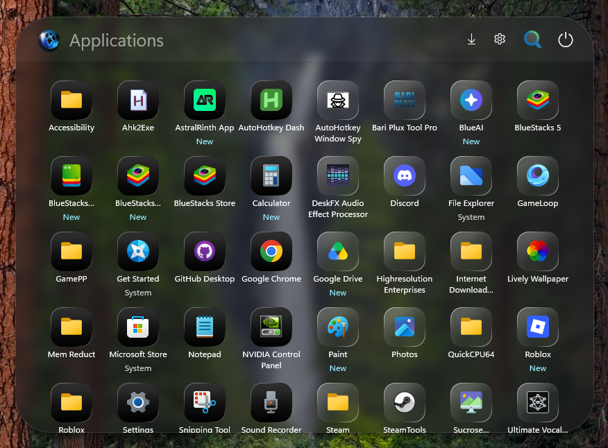
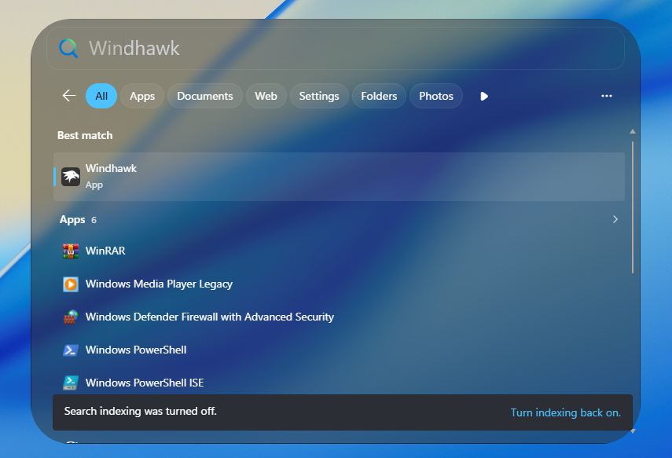

# Translucent Settings11 theme for Windows 11 Settings Styler

This theme makes the Windows 11 Start Menu look like MacOS App Launcher! It comes in 2 styles(Clear and Dark) and 2 Alignments(Center and Bottom). Suggestions, and Contributions are Welcome.

**Author**: [WasiXGamer](https://github.com/wasixgamer)





## Manual Installation

To import the theme styles:

* Open the Windows 11 Start Menu Styler mod in Windhawk.
* Go to the "Settings" tab and select "Textual mode".
* Copy the content below to the text box and click "Save settings".

# Variants:

## OS26 Tahoe Dark

### Center Alignment

<details>
<summary>Content to import (click to expand)</summary>

```yaml

disableNewStartMenuLayout: forceNewLayout
styleConstants:
  - IconBackground=<LinearGradientBrush StartPoint="0.47,-0.29" EndPoint="0.50,1.29"><GradientStop Offset="0.18" Color="#2F2F2F"/><GradientStop Offset="0.3" Color="#292929"/><GradientStop Offset="0.5" Color="#141414"/><GradientStop Offset="0.68" Color="#080808"/><GradientStop Offset="0.81" Color="#000000"/></LinearGradientBrush>
  - IconBorder=<LinearGradientBrush StartPoint="0.04,-0.14" EndPoint="1.22,1.10"><GradientStop Offset="0.18" Color="#4FFFFFFF"/><GradientStop Offset="0.34" Color="#661D1D1D"/><GradientStop Offset="0.63" Color="#00000000"/><GradientStop Offset="0.71" Color="#662D2D2D"/><GradientStop Offset="0.77" Color="#4FFFFFFF"/></LinearGradientBrush>
controlStyles:
  - target: StartMenu.StartBlendedFlexFrame > Grid#FrameRoot > Grid#AnimationRoot > Grid#MainMenu > Border#AcrylicBorder
    styles:
      - Background:=<WindhawkBlur BlurAmount="8" TintColor="#761E1E1E" />
      - Height=600
      - CornerRadius=50
      - VerticalAlignment=Center
  - target: StartMenu.StartBlendedFlexFrame > Grid#FrameRoot > Grid#AnimationRoot > Border#StartDropShadow
    styles:
      - Height=600
      - CornerRadius=50
      - VerticalAlignment=Center
  - target: ScrollViewer > ScrollContentPresenter > Border > StartMenu.StartBlendedFlexFrame > Grid#FrameRoot > Grid#AnimationRoot > Grid#MainMenu > Grid#MainContent
    styles:
      - Height=600
      - VerticalAlignment=Center
  - target: Border#AcrylicOverlay
    styles:
      - CornerRadius=50,50,0,0
      - Margin=0,-65,0,470
  - target: StartMenu.StartBlendedFlexFrame > Grid#FrameRoot > Grid#AnimationRoot > Grid#MainMenu > Grid#MainContent > Frame#StartFrame > ContentPresenter > StartMenu.StartHome > Grid#PageRoot > SemanticZoom#TopLevelRoot > Grid > ScrollViewer#ScrollViewer > ScrollContentPresenter#ScrollContentPresenter > Grid > ContentPresenter#ZoomedInPresenter > GridView#AllAppsGrid > Border > ScrollViewer#ScrollViewer > Border#Root > Grid > Grid > Windows.UI.Xaml.Controls.Primitives.ScrollBar#VerticalScrollBar > Grid#Root > Grid#VerticalRoot
    styles:
      - Margin=0,-50,0,40
      - Height=500  
  - target: ScrollViewer > ScrollContentPresenter > Border > StartMenu.StartBlendedFlexFrame > Grid#FrameRoot > Grid#AnimationRoot > Grid#MainMenu > Grid#MainContent > Frame#StartFrame > ContentPresenter > StartMenu.StartHome > Grid#PageRoot > SemanticZoom#TopLevelRoot > Grid > ScrollViewer#ScrollViewer > ScrollContentPresenter#ScrollContentPresenter > Grid > ContentPresenter#ZoomedInPresenter > GridView#AllAppsGrid > Border > ScrollViewer#ScrollViewer > Border#Root > Grid > Grid > Windows.UI.Xaml.Controls.Primitives.ScrollBar#VerticalScrollBar > Grid#Root > Grid#VerticalRoot > Rectangle#VerticalTrackRect
    styles:
      - Height=500  
  - target: StartMenu.StartHome
    styles:
      - Margin=0,5,0,-120    
  - target: StartMenu.SearchBoxToggleButton#SearchBoxToggleButton > Grid > Border#BorderElement
    styles:
      - BorderBrush=transparent
      - Background:=transparent
      - Height=55
  - target: ScrollViewer > ScrollContentPresenter > Border > StartMenu.StartBlendedFlexFrame > Grid#FrameRoot > Grid#AnimationRoot > Grid#MainMenu > Grid#MainContent > Grid > StartMenu.SearchBoxToggleButton#SearchBoxToggleButton > Grid
    styles:
      - Margin=10,0,-10,0
      - Height=55
  - target: ScrollViewer > ScrollContentPresenter > Border > StartMenu.StartBlendedFlexFrame > Grid#FrameRoot > Grid#AnimationRoot > Grid#MainMenu > Grid#MainContent > Grid > StartMenu.SearchBoxToggleButton#SearchBoxToggleButton
    styles:
      - Margin=10,0,-10,0
      - Height=55
  - target:  StartMenu.SearchBoxToggleButton#SearchBoxToggleButton > Grid > Image#SearchIconOff
    styles:
      - Margin=680,0,-680,0
      - Height=25
      - Width=25
  - target: StartMenu.SearchBoxToggleButton#SearchBoxToggleButton > Grid > Image#SearchIconOn
    styles:
      - Margin=680,0,-680,0 
      - Height=25
      - Width=25
  - target: StartMenu.StartBlendedFlexFrame > Grid#FrameRoot > Grid#AnimationRoot > Grid#MainMenu > Grid#MainContent > Grid > StartMenu.SearchBoxToggleButton#SearchBoxToggleButton > Grid > ContentPresenter#ContentPresenter > TextBlock#PlaceholderText
    styles:
      - Text:=Applications
      - FontSize=25
  - target: StartDocked.NavigationPaneView#UserControl > Grid#RootPanel > StartDocked.UserTileView#UserTile
    styles:
      - Height=45
      - Width=55
      - HorizontalAlignment=left
  - target: StartDocked.NavigationPaneButton#UserTileButton > Grid > ContentPresenter#ContentPresenter > Grid > Grid#UserTileIcon
    styles:
      - Width=32
      - Height=32
  - target: StartDocked.NavigationPaneButton#PowerButton > Grid > ContentPresenter#ContentPresenter > Grid > FontIcon > Grid > TextBlock
    styles:
      - Margin=0,1,0,-1
      - FontSize=22      
  - target: ScrollViewer > ScrollContentPresenter > Border > StartMenu.StartBlendedFlexFrame > Grid#FrameRoot > Grid#AnimationRoot > Grid#MainMenu > Grid#MainContent > Frame#StartFrame > ContentPresenter > StartMenu.StartHome > Grid#PageRoot > SemanticZoom#TopLevelRoot > Grid > ScrollViewer#ScrollViewer > ScrollContentPresenter#ScrollContentPresenter > Grid > ContentPresenter#ZoomedInPresenter > GridView#AllAppsGrid > Border > ScrollViewer#ScrollViewer > Border#Root > Grid > ScrollContentPresenter#ScrollContentPresenter > ItemsPresenter > ContentControl > ContentPresenter > Grid#TopLevelHeader > StartMenu.PinnedList#StartMenuPinnedList > Grid#Root > GridView#PinnedList > Border > ScrollViewer#ScrollViewer > Border#Root > Grid > ScrollContentPresenter#ScrollContentPresenter > ItemsPresenter > ItemsWrapGrid > GridViewItem > Border#ContentBorder > Grid#DroppedFlickerWorkaroundWrapper > Border#BackgroundBorder
    styles:
      - BackgroundSizing=1
      - Background:=$IconBackground
      - BorderBrush:=$IconBorder
      - BorderThickness=1.3
      - CornerRadius=16
      - Margin=18,0,18,27
  - target: ScrollViewer > ScrollContentPresenter > Border > StartMenu.StartBlendedFlexFrame > Grid#FrameRoot > Grid#AnimationRoot > Grid#MainMenu > Grid#MainContent > Frame#StartFrame > ContentPresenter > StartMenu.StartHome > Grid#PageRoot > SemanticZoom#TopLevelRoot > Grid > ScrollViewer#ScrollViewer > ScrollContentPresenter#ScrollContentPresenter > Grid > ContentPresenter#ZoomedInPresenter > GridView#AllAppsGrid > Border > ScrollViewer#ScrollViewer > Border#Root > Grid > ScrollContentPresenter#ScrollContentPresenter > ItemsPresenter > ContentControl > ContentPresenter > Grid#TopLevelHeader > StartMenu.PinnedList#StartMenuPinnedList > Grid#Root > GridView#PinnedList > Border > ScrollViewer#ScrollViewer > Border#Root > Grid > ScrollContentPresenter#ScrollContentPresenter > ItemsPresenter > ItemsWrapGrid > GridViewItem > Border#ContentBorder > Grid#DroppedFlickerWorkaroundWrapper > ContentPresenter#ContentPresenter > Grid > StartMenu.PinnedListTile > Grid#Root > Grid#DisplayNameAndDownloadIconContainer > TextBlock#DisplayName
    styles:
      - Margin=0,15,0,-15
  - target: ScrollViewer > ScrollContentPresenter > Border > StartMenu.StartBlendedFlexFrame > Grid#FrameRoot > Grid#AnimationRoot > Grid#MainMenu > Grid#MainContent > Frame#StartFrame > ContentPresenter > StartMenu.StartHome > Grid#PageRoot > SemanticZoom#TopLevelRoot > Grid > ScrollViewer#ScrollViewer > ScrollContentPresenter#ScrollContentPresenter > Grid > ContentPresenter#ZoomedInPresenter > GridView#AllAppsGrid > Border > ScrollViewer#ScrollViewer > Border#Root > Grid > ScrollContentPresenter#ScrollContentPresenter > ItemsPresenter > ItemsWrapGrid > GridViewItem > Border#ContentBorder > Grid#DroppedFlickerWorkaroundWrapper > Border#BackgroundBorder
    styles:
      - BackgroundSizing=1
      - Background:=$IconBackground
      - BorderBrush:=$IconBorder
      - BorderThickness=1.3
      - CornerRadius=16
      - Margin=18,0,18,27
  - target: ScrollViewer > ScrollContentPresenter > Border > StartMenu.StartBlendedFlexFrame > Grid#FrameRoot > Grid#AnimationRoot > Grid#MainMenu > Grid#MainContent > Frame#StartFrame > ContentPresenter > StartMenu.StartHome > Grid#PageRoot > SemanticZoom#TopLevelRoot > Grid > ScrollViewer#ScrollViewer > ScrollContentPresenter#ScrollContentPresenter > Grid > ContentPresenter#ZoomedInPresenter > GridView#AllAppsGrid > Border > ScrollViewer#ScrollViewer > Border#Root > Grid > ScrollContentPresenter#ScrollContentPresenter > ItemsPresenter > ItemsWrapGrid > GridViewItem > Border#ContentBorder > Grid#DroppedFlickerWorkaroundWrapper > ContentPresenter#ContentPresenter > Grid > TextBlock
    styles:
      - Margin=0,15,0,-15
  - target: ScrollViewer > ScrollContentPresenter > Border > StartMenu.StartBlendedFlexFrame > Grid#FrameRoot > Grid#AnimationRoot > Grid#MainMenu > Grid#MainContent > Frame#StartFrame > ContentPresenter > StartMenu.StartHome > Grid#PageRoot > SemanticZoom#TopLevelRoot > Grid > ScrollViewer#ScrollViewer > ScrollContentPresenter#ScrollContentPresenter > Grid > ContentPresenter#ZoomedInPresenter > GridView#AllAppsGrid > Border > ScrollViewer#ScrollViewer > Border#Root > Grid > ScrollContentPresenter#ScrollContentPresenter > ItemsPresenter > ItemsWrapGrid > GridViewItem > Grid#RootGrid > ContentPresenter#ContentPresenter > StartMenu.CategoryControl > Grid#RootGrid > Border
    styles:
      - BorderBrush:=$IconBorder
      - BorderThickness=1.3
      - CornerRadius=25
  - target: ScrollViewer > ScrollContentPresenter > Border > StartMenu.StartBlendedFlexFrame > Grid#FrameRoot > Grid#AnimationRoot > Grid#MainMenu > Grid#MainContent > Frame#StartFrame > ContentPresenter > StartMenu.StartHome > Grid#PageRoot > SemanticZoom#TopLevelRoot > Grid > ScrollViewer#ScrollViewer > ScrollContentPresenter#ScrollContentPresenter > Grid > ContentPresenter#ZoomedInPresenter > GridView#AllAppsGrid > Border > ScrollViewer#ScrollViewer > Border#Root > Grid > ScrollContentPresenter#ScrollContentPresenter > ItemsPresenter > ItemsWrapGrid > GridViewItem > Grid#RootGrid > ContentPresenter#ContentPresenter > StartMenu.CategoryControl > Grid#RootGrid > ScrollViewer#ScrollViewer > Border#Root > Grid > ScrollContentPresenter#ScrollContentPresenter > ItemsPresenter#ItemsPresenter > ItemsWrapGrid > ContentPresenter > Button#LogoContainer > Grid > Border#BackgroundBorder
    styles:
      - Background:=$IconBackground
      - BorderBrush:=$IconBorder
      - BorderThickness=1.3
      - CornerRadius=16
      - Margin=7
  - target: StartMenu.StartBlendedFlexFrame > Grid#FrameRoot > Grid#AnimationRoot > Grid#MainMenu > Grid#MainContent > Frame#StartFrame > ContentPresenter > StartMenu.StartHome > Grid#PageRoot > SemanticZoom#TopLevelRoot > Grid > ScrollViewer#ScrollViewer > ScrollContentPresenter#ScrollContentPresenter > Grid > ContentPresenter#ZoomedInPresenter > GridView#AllAppsGrid > Border > ScrollViewer#ScrollViewer > Border#Root > Grid > ScrollContentPresenter#ScrollContentPresenter > ItemsPresenter > ContentControl > ContentPresenter > Grid#TopLevelHeader > Grid#TopLevelSuggestionsRoot
    styles:
      - Visibility=1
  - target: ScrollViewer > ScrollContentPresenter > Border > Cortana.UI.Views.TaskbarSearchPage > Grid#RootGrid > Grid#OuterBorderGrid
    styles:
      - Height=541
      - CornerRadius=50
  - target: ScrollViewer > ScrollContentPresenter > Border > Cortana.UI.Views.TaskbarSearchPage > Grid#RootGrid
    styles:
      - Margin=0,-200,0,0
      - CornerRadius=50
      - VerticalAlignment=Center
  - target: ScrollViewer > ScrollContentPresenter > Border > Cortana.UI.Views.TaskbarSearchPage > Grid#RootGrid > Grid#OuterBorderGrid > Grid#BorderGrid > Border#AppBorder
    styles:
      - Background:=<WindhawkBlur BlurAmount="8" TintColor="#761E1E1E"/>
      - BorderBrush=Gray
      - CornerRadius=50
      - BorderThickness=0
  - target: ScrollViewer > ScrollContentPresenter > Border > Cortana.UI.Views.TaskbarSearchPage > Grid#RootGrid > Border#TaskbarSearchBackground
    styles:
      - Background=transparent
      - Margin=20,10,20,10
      - Height=55
  - target: ScrollViewer > ScrollContentPresenter > Border > Cortana.UI.Views.TaskbarSearchPage > Grid#RootGrid > Cortana.UI.Views.RichSearchBoxControl#SearchBoxControl
    styles:
      - Margin=20,0,20,0
  - target: ScrollViewer > ScrollContentPresenter > Border > Cortana.UI.Views.TaskbarSearchPage > Grid#RootGrid > Cortana.UI.Views.RichSearchBoxControl#SearchBoxControl > Grid#RootGrid > Microsoft.UI.Xaml.Controls.AnimatedIcon#SearchIconPlayer
    styles:
      - Height=25
      - Width=25
  - target: ScrollViewer > ScrollContentPresenter > Border > Cortana.UI.Views.TaskbarSearchPage > Grid#RootGrid > Cortana.UI.Views.RichSearchBoxControl#SearchBoxControl > Grid#RootGrid > Cortana.UI.Views.CortanaRichSearchBox#SearchTextBox
    styles:
      - FontSize=25
      - Margin=10,-1,10,1
      - Foreground=#BFBDB7
  - target: ScrollViewer > ScrollContentPresenter > Border > StartMenu.StartBlendedFlexFrame > Grid#FrameRoot > Grid#AnimationRoot > Grid#MainMenu > Grid#MainContent > Frame#StartFrame > ContentPresenter > StartMenu.StartHome > Grid#PageRoot > StartMenu.FolderModal#StartFolderModal > Grid#Root > Border
    styles:
      - Background:=<WindhawkBlur BlurAmount="8" TintColor="#761E1E1E"/>
      - CornerRadius=50
      - BorderBrush:=$IconBorder
      - BorderThickness=1.3
  - target: ScrollViewer > ScrollContentPresenter > Border > StartMenu.StartBlendedFlexFrame > Grid#FrameRoot > Grid#AnimationRoot > Grid#MainMenu > Grid#MainContent > Frame#StartFrame > ContentPresenter > StartMenu.StartHome > Grid#PageRoot > StartMenu.FolderModal#StartFolderModal > Grid#Root > ContentControl#ContentControl > ContentPresenter > StartMenu.UniversalTileContainer#UniversalTileContainer > Grid#GridViewContainer > Grid > GridView#LevelOneGridView > Border > ScrollViewer#ScrollViewer > Border#Root > Grid > ScrollContentPresenter#ScrollContentPresenter > ItemsPresenter > ItemsWrapGrid > GridViewItem > Border#ContentBorder > Grid#DroppedFlickerWorkaroundWrapper > Border#BackgroundBorder
    styles:
      - Background:=$IconBackground
      - BorderBrush:=$IconBorder
      - BorderThickness=1.3
      - CornerRadius=16
      - Margin=30,20,30,43
      - Height=60
      - Width=60
  - target: StartMenu.StartBlendedFlexFrame > Grid#FrameRoot > Grid#AnimationRoot > Grid#MainMenu > Grid#MainContent > Frame#StartFrame > ContentPresenter > StartMenu.StartHome > Grid#PageRoot > StartMenu.FolderModal#StartFolderModal > Grid#Root > ContentControl#ContentControl > ContentPresenter > StartMenu.UniversalTileContainer#UniversalTileContainer > Grid#GridViewContainer > Grid > GridView#LevelOneGridView > Border > ScrollViewer#ScrollViewer > Border#Root > Grid > ScrollContentPresenter#ScrollContentPresenter > ItemsPresenter > ItemsWrapGrid > GridViewItem > Border#ContentBorder > Grid#DroppedFlickerWorkaroundWrapper > ContentPresenter#ContentPresenter > Grid > TextBlock
    styles:
      - Margin=0,15,0,-15
  - target: Grid#NavPanePlaceholder
    styles:
      - Grid.Row=0
      - Margin=20,0,20,0
  - target: ScrollViewer > ScrollContentPresenter > Border > StartMenu.StartBlendedFlexFrame > Grid#FrameRoot > Grid#AnimationRoot > Grid#MainMenu > Grid#MainContent > Frame#StartFrame > ContentPresenter > StartMenu.StartHome > Grid#PageRoot > StartMenu.FolderModal#StartFolderModal > Grid#Root > Border
    styles:
      - Height=350
  - target: ScrollViewer > ScrollContentPresenter > Border > StartMenu.StartBlendedFlexFrame > Grid#FrameRoot > Grid#AnimationRoot > Grid#MainMenu > Grid#MainContent > Frame#StartFrame > ContentPresenter > StartMenu.StartHome > Grid#PageRoot > StartMenu.FolderModal#StartFolderModal > Grid#Root > ContentControl#ContentControl
    styles:
      - Height=350    
  - target: ScrollViewer > ScrollContentPresenter > Border > StartMenu.StartBlendedFlexFrame > Grid#FrameRoot > Grid#AnimationRoot > Grid#MainMenu > Grid#MainContent > Frame#StartFrame > ContentPresenter > StartMenu.StartHome > Grid#PageRoot > StartMenu.FolderModal#StartFolderModal > Grid#Root > ContentControl#ContentControl > ContentPresenter > StartMenu.UniversalTileContainer#UniversalTileContainer > Grid#GridViewContainer > Grid > Microsoft.UI.Xaml.Controls.PipsPager#PipsPager > StackPanel#RootPanel > ScrollViewer#PipsPagerScrollViewer > Border#Root > Grid > ScrollContentPresenter#ScrollContentPresenter
    styles:
      - Margin=0,-100,0,100
  - target: ScrollViewer > ScrollContentPresenter > Border > StartMenu.StartBlendedFlexFrame > Grid#FrameRoot > Grid#AnimationRoot > Grid#MainMenu > Grid#MainContent > Frame#StartFrame > ContentPresenter > StartMenu.StartHome > Grid#PageRoot > SemanticZoom#TopLevelRoot > Grid > ScrollViewer#ScrollViewer > ScrollContentPresenter#ScrollContentPresenter > Grid > ContentPresenter#ZoomedInPresenter > GridView#AllAppsGrid > Border > ScrollViewer#ScrollViewer > Border#Root > Grid > ScrollContentPresenter#ScrollContentPresenter > ItemsPresenter > ItemsWrapGrid > GridViewItem > Border#ContentBorder > Grid#DroppedFlickerWorkaroundWrapper
    styles:
      - Padding=0,0,0,25
  - target: StartDocked.AppListView#NavigationPanePlacesListView
    styles:
      - MaxWidth=120
      - Margin=-55,0,55,0    
themeResourceVariables:
  - ''
webContentStyles:
  - target: '#qfPreviewPane, .previewContainer, .preview-content-container'
    styles:
      - 'display: none !important'
  - target: '.suggsListContainer, #qfSuggsList, .results-container, .left-pane'
    styles:
      - 'width: 100% !important'
      - 'max-width: 100% !important'
      - 'flex: 1 1 100% !important'
  - target: '.main-content-container, .search-results-grid, #searchPane'
    styles:
      - 'grid-template-columns: 100% !important'
      - 'display: block !important'
      - 'width: 100% !important'
  - target: .suggContainer, .groupContainer, .card
    styles:
      - 'width: 100% !important'
      - 'box-sizing: border-box !important'
webContentCustomJs: ''

```
</details>

### Bottom Alignment

<details>
<summary>Content to import (click to expand)</summary>

```yaml

disableNewStartMenuLayout: forceNewLayout
styleConstants:
  - IconBackground=<LinearGradientBrush StartPoint="0.47,-0.29" EndPoint="0.50,1.29"><GradientStop Offset="0.18" Color="#2F2F2F"/><GradientStop Offset="0.3" Color="#292929"/><GradientStop Offset="0.5" Color="#141414"/><GradientStop Offset="0.68" Color="#080808"/><GradientStop Offset="0.81" Color="#000000"/></LinearGradientBrush>
  - IconBorder=<LinearGradientBrush StartPoint="0.04,-0.14" EndPoint="1.22,1.10"><GradientStop Offset="0.18" Color="#4FFFFFFF"/><GradientStop Offset="0.34" Color="#661D1D1D"/><GradientStop Offset="0.63" Color="#00000000"/><GradientStop Offset="0.71" Color="#662D2D2D"/><GradientStop Offset="0.77" Color="#4FFFFFFF"/></LinearGradientBrush>
controlStyles:
  - target: StartMenu.StartBlendedFlexFrame > Grid#FrameRoot > Grid#AnimationRoot > Grid#MainMenu > Border#AcrylicBorder
    styles:
      - Background:=<WindhawkBlur BlurAmount="8" TintColor="#761E1E1E" />
      - Height=600
      - CornerRadius=50
      - VerticalAlignment=Bottom
  - target: StartMenu.StartBlendedFlexFrame > Grid#FrameRoot > Grid#AnimationRoot > Border#StartDropShadow
    styles:
      - Height=600
      - CornerRadius=50
      - VerticalAlignment=Bottom
  - target: ScrollViewer > ScrollContentPresenter > Border > StartMenu.StartBlendedFlexFrame > Grid#FrameRoot > Grid#AnimationRoot > Grid#MainMenu > Grid#MainContent
    styles:
      - Height=600
      - VerticalAlignment=Bottom
  - target: Border#AcrylicOverlay
    styles:
      - CornerRadius=50,50,0,0
      - Margin=0,-65,0,470
  - target: StartMenu.StartBlendedFlexFrame > Grid#FrameRoot > Grid#AnimationRoot > Grid#MainMenu > Grid#MainContent > Frame#StartFrame > ContentPresenter > StartMenu.StartHome > Grid#PageRoot > SemanticZoom#TopLevelRoot > Grid > ScrollViewer#ScrollViewer > ScrollContentPresenter#ScrollContentPresenter > Grid > ContentPresenter#ZoomedInPresenter > GridView#AllAppsGrid > Border > ScrollViewer#ScrollViewer > Border#Root > Grid > Grid > Windows.UI.Xaml.Controls.Primitives.ScrollBar#VerticalScrollBar > Grid#Root > Grid#VerticalRoot
    styles:
      - Margin=0,-50,0,40
      - Height=500  
  - target: ScrollViewer > ScrollContentPresenter > Border > StartMenu.StartBlendedFlexFrame > Grid#FrameRoot > Grid#AnimationRoot > Grid#MainMenu > Grid#MainContent > Frame#StartFrame > ContentPresenter > StartMenu.StartHome > Grid#PageRoot > SemanticZoom#TopLevelRoot > Grid > ScrollViewer#ScrollViewer > ScrollContentPresenter#ScrollContentPresenter > Grid > ContentPresenter#ZoomedInPresenter > GridView#AllAppsGrid > Border > ScrollViewer#ScrollViewer > Border#Root > Grid > Grid > Windows.UI.Xaml.Controls.Primitives.ScrollBar#VerticalScrollBar > Grid#Root > Grid#VerticalRoot > Rectangle#VerticalTrackRect
    styles:
      - Height=500  
  - target: StartMenu.StartHome
    styles:
      - Margin=0,5,0,-120    
  - target: StartMenu.SearchBoxToggleButton#SearchBoxToggleButton > Grid > Border#BorderElement
    styles:
      - BorderBrush=transparent
      - Background:=transparent
      - Height=55
  - target: ScrollViewer > ScrollContentPresenter > Border > StartMenu.StartBlendedFlexFrame > Grid#FrameRoot > Grid#AnimationRoot > Grid#MainMenu > Grid#MainContent > Grid > StartMenu.SearchBoxToggleButton#SearchBoxToggleButton > Grid
    styles:
      - Margin=10,0,-10,0
      - Height=55
  - target: ScrollViewer > ScrollContentPresenter > Border > StartMenu.StartBlendedFlexFrame > Grid#FrameRoot > Grid#AnimationRoot > Grid#MainMenu > Grid#MainContent > Grid > StartMenu.SearchBoxToggleButton#SearchBoxToggleButton
    styles:
      - Margin=10,0,-10,0
      - Height=55
  - target:  StartMenu.SearchBoxToggleButton#SearchBoxToggleButton > Grid > Image#SearchIconOff
    styles:
      - Margin=680,0,-680,0
      - Height=25
      - Width=25
  - target: StartMenu.SearchBoxToggleButton#SearchBoxToggleButton > Grid > Image#SearchIconOn
    styles:
      - Margin=680,0,-680,0 
      - Height=25
      - Width=25
  - target: StartMenu.StartBlendedFlexFrame > Grid#FrameRoot > Grid#AnimationRoot > Grid#MainMenu > Grid#MainContent > Grid > StartMenu.SearchBoxToggleButton#SearchBoxToggleButton > Grid > ContentPresenter#ContentPresenter > TextBlock#PlaceholderText
    styles:
      - Text:=Applications
      - FontSize=25
  - target: StartDocked.NavigationPaneView#UserControl > Grid#RootPanel > StartDocked.UserTileView#UserTile
    styles:
      - Height=45
      - Width=55
      - HorizontalAlignment=left
  - target: StartDocked.NavigationPaneButton#UserTileButton > Grid > ContentPresenter#ContentPresenter > Grid > Grid#UserTileIcon
    styles:
      - Width=32
      - Height=32
  - target: StartDocked.NavigationPaneButton#PowerButton > Grid > ContentPresenter#ContentPresenter > Grid > FontIcon > Grid > TextBlock
    styles:
      - Margin=0,1,0,-1
      - FontSize=22      
  - target: ScrollViewer > ScrollContentPresenter > Border > StartMenu.StartBlendedFlexFrame > Grid#FrameRoot > Grid#AnimationRoot > Grid#MainMenu > Grid#MainContent > Frame#StartFrame > ContentPresenter > StartMenu.StartHome > Grid#PageRoot > SemanticZoom#TopLevelRoot > Grid > ScrollViewer#ScrollViewer > ScrollContentPresenter#ScrollContentPresenter > Grid > ContentPresenter#ZoomedInPresenter > GridView#AllAppsGrid > Border > ScrollViewer#ScrollViewer > Border#Root > Grid > ScrollContentPresenter#ScrollContentPresenter > ItemsPresenter > ContentControl > ContentPresenter > Grid#TopLevelHeader > StartMenu.PinnedList#StartMenuPinnedList > Grid#Root > GridView#PinnedList > Border > ScrollViewer#ScrollViewer > Border#Root > Grid > ScrollContentPresenter#ScrollContentPresenter > ItemsPresenter > ItemsWrapGrid > GridViewItem > Border#ContentBorder > Grid#DroppedFlickerWorkaroundWrapper > Border#BackgroundBorder
    styles:
      - BackgroundSizing=1
      - Background:=$IconBackground
      - BorderBrush:=$IconBorder
      - BorderThickness=1.3
      - CornerRadius=16
      - Margin=18,0,18,27
  - target: ScrollViewer > ScrollContentPresenter > Border > StartMenu.StartBlendedFlexFrame > Grid#FrameRoot > Grid#AnimationRoot > Grid#MainMenu > Grid#MainContent > Frame#StartFrame > ContentPresenter > StartMenu.StartHome > Grid#PageRoot > SemanticZoom#TopLevelRoot > Grid > ScrollViewer#ScrollViewer > ScrollContentPresenter#ScrollContentPresenter > Grid > ContentPresenter#ZoomedInPresenter > GridView#AllAppsGrid > Border > ScrollViewer#ScrollViewer > Border#Root > Grid > ScrollContentPresenter#ScrollContentPresenter > ItemsPresenter > ContentControl > ContentPresenter > Grid#TopLevelHeader > StartMenu.PinnedList#StartMenuPinnedList > Grid#Root > GridView#PinnedList > Border > ScrollViewer#ScrollViewer > Border#Root > Grid > ScrollContentPresenter#ScrollContentPresenter > ItemsPresenter > ItemsWrapGrid > GridViewItem > Border#ContentBorder > Grid#DroppedFlickerWorkaroundWrapper > ContentPresenter#ContentPresenter > Grid > StartMenu.PinnedListTile > Grid#Root > Grid#DisplayNameAndDownloadIconContainer > TextBlock#DisplayName
    styles:
      - Margin=0,15,0,-15
  - target: ScrollViewer > ScrollContentPresenter > Border > StartMenu.StartBlendedFlexFrame > Grid#FrameRoot > Grid#AnimationRoot > Grid#MainMenu > Grid#MainContent > Frame#StartFrame > ContentPresenter > StartMenu.StartHome > Grid#PageRoot > SemanticZoom#TopLevelRoot > Grid > ScrollViewer#ScrollViewer > ScrollContentPresenter#ScrollContentPresenter > Grid > ContentPresenter#ZoomedInPresenter > GridView#AllAppsGrid > Border > ScrollViewer#ScrollViewer > Border#Root > Grid > ScrollContentPresenter#ScrollContentPresenter > ItemsPresenter > ItemsWrapGrid > GridViewItem > Border#ContentBorder > Grid#DroppedFlickerWorkaroundWrapper > Border#BackgroundBorder
    styles:
      - BackgroundSizing=1
      - Background:=$IconBackground
      - BorderBrush:=$IconBorder
      - BorderThickness=1.3
      - CornerRadius=16
      - Margin=18,0,18,27
  - target: ScrollViewer > ScrollContentPresenter > Border > StartMenu.StartBlendedFlexFrame > Grid#FrameRoot > Grid#AnimationRoot > Grid#MainMenu > Grid#MainContent > Frame#StartFrame > ContentPresenter > StartMenu.StartHome > Grid#PageRoot > SemanticZoom#TopLevelRoot > Grid > ScrollViewer#ScrollViewer > ScrollContentPresenter#ScrollContentPresenter > Grid > ContentPresenter#ZoomedInPresenter > GridView#AllAppsGrid > Border > ScrollViewer#ScrollViewer > Border#Root > Grid > ScrollContentPresenter#ScrollContentPresenter > ItemsPresenter > ItemsWrapGrid > GridViewItem > Border#ContentBorder > Grid#DroppedFlickerWorkaroundWrapper > ContentPresenter#ContentPresenter > Grid > TextBlock
    styles:
      - Margin=0,15,0,-15
  - target: ScrollViewer > ScrollContentPresenter > Border > StartMenu.StartBlendedFlexFrame > Grid#FrameRoot > Grid#AnimationRoot > Grid#MainMenu > Grid#MainContent > Frame#StartFrame > ContentPresenter > StartMenu.StartHome > Grid#PageRoot > SemanticZoom#TopLevelRoot > Grid > ScrollViewer#ScrollViewer > ScrollContentPresenter#ScrollContentPresenter > Grid > ContentPresenter#ZoomedInPresenter > GridView#AllAppsGrid > Border > ScrollViewer#ScrollViewer > Border#Root > Grid > ScrollContentPresenter#ScrollContentPresenter > ItemsPresenter > ItemsWrapGrid > GridViewItem > Grid#RootGrid > ContentPresenter#ContentPresenter > StartMenu.CategoryControl > Grid#RootGrid > Border
    styles:
      - BorderBrush:=$IconBorder
      - BorderThickness=1.3
      - CornerRadius=25
  - target: ScrollViewer > ScrollContentPresenter > Border > StartMenu.StartBlendedFlexFrame > Grid#FrameRoot > Grid#AnimationRoot > Grid#MainMenu > Grid#MainContent > Frame#StartFrame > ContentPresenter > StartMenu.StartHome > Grid#PageRoot > SemanticZoom#TopLevelRoot > Grid > ScrollViewer#ScrollViewer > ScrollContentPresenter#ScrollContentPresenter > Grid > ContentPresenter#ZoomedInPresenter > GridView#AllAppsGrid > Border > ScrollViewer#ScrollViewer > Border#Root > Grid > ScrollContentPresenter#ScrollContentPresenter > ItemsPresenter > ItemsWrapGrid > GridViewItem > Grid#RootGrid > ContentPresenter#ContentPresenter > StartMenu.CategoryControl > Grid#RootGrid > ScrollViewer#ScrollViewer > Border#Root > Grid > ScrollContentPresenter#ScrollContentPresenter > ItemsPresenter#ItemsPresenter > ItemsWrapGrid > ContentPresenter > Button#LogoContainer > Grid > Border#BackgroundBorder
    styles:
      - Background:=$IconBackground
      - BorderBrush:=$IconBorder
      - BorderThickness=1.3
      - CornerRadius=16
      - Margin=7
  - target: StartMenu.StartBlendedFlexFrame > Grid#FrameRoot > Grid#AnimationRoot > Grid#MainMenu > Grid#MainContent > Frame#StartFrame > ContentPresenter > StartMenu.StartHome > Grid#PageRoot > SemanticZoom#TopLevelRoot > Grid > ScrollViewer#ScrollViewer > ScrollContentPresenter#ScrollContentPresenter > Grid > ContentPresenter#ZoomedInPresenter > GridView#AllAppsGrid > Border > ScrollViewer#ScrollViewer > Border#Root > Grid > ScrollContentPresenter#ScrollContentPresenter > ItemsPresenter > ContentControl > ContentPresenter > Grid#TopLevelHeader > Grid#TopLevelSuggestionsRoot
    styles:
      - Visibility=1
  - target: ScrollViewer > ScrollContentPresenter > Border > Cortana.UI.Views.TaskbarSearchPage > Grid#RootGrid > Grid#OuterBorderGrid
    styles:
      - Height=541
      - CornerRadius=50
  - target: ScrollViewer > ScrollContentPresenter > Border > Cortana.UI.Views.TaskbarSearchPage > Grid#RootGrid
    styles:
      - Margin=0,-200,0,0
      - CornerRadius=50
      - VerticalAlignment=Bottom
  - target: ScrollViewer > ScrollContentPresenter > Border > Cortana.UI.Views.TaskbarSearchPage > Grid#RootGrid > Grid#OuterBorderGrid > Grid#BorderGrid > Border#AppBorder
    styles:
      - Background:=<WindhawkBlur BlurAmount="8" TintColor="#761E1E1E"/>
      - BorderBrush=Gray
      - CornerRadius=50
      - BorderThickness=0
  - target: ScrollViewer > ScrollContentPresenter > Border > Cortana.UI.Views.TaskbarSearchPage > Grid#RootGrid > Border#TaskbarSearchBackground
    styles:
      - Background=transparent
      - Margin=20,10,20,10
      - Height=55
  - target: ScrollViewer > ScrollContentPresenter > Border > Cortana.UI.Views.TaskbarSearchPage > Grid#RootGrid > Cortana.UI.Views.RichSearchBoxControl#SearchBoxControl
    styles:
      - Margin=20,0,20,0
  - target: ScrollViewer > ScrollContentPresenter > Border > Cortana.UI.Views.TaskbarSearchPage > Grid#RootGrid > Cortana.UI.Views.RichSearchBoxControl#SearchBoxControl > Grid#RootGrid > Microsoft.UI.Xaml.Controls.AnimatedIcon#SearchIconPlayer
    styles:
      - Height=25
      - Width=25
  - target: ScrollViewer > ScrollContentPresenter > Border > Cortana.UI.Views.TaskbarSearchPage > Grid#RootGrid > Cortana.UI.Views.RichSearchBoxControl#SearchBoxControl > Grid#RootGrid > Cortana.UI.Views.CortanaRichSearchBox#SearchTextBox
    styles:
      - FontSize=25
      - Margin=10,-1,10,1
      - Foreground=#BFBDB7
  - target: ScrollViewer > ScrollContentPresenter > Border > StartMenu.StartBlendedFlexFrame > Grid#FrameRoot > Grid#AnimationRoot > Grid#MainMenu > Grid#MainContent > Frame#StartFrame > ContentPresenter > StartMenu.StartHome > Grid#PageRoot > StartMenu.FolderModal#StartFolderModal > Grid#Root > Border
    styles:
      - Background:=<WindhawkBlur BlurAmount="8" TintColor="#761E1E1E"/>
      - CornerRadius=50
      - BorderBrush:=$IconBorder
      - BorderThickness=1.3
  - target: ScrollViewer > ScrollContentPresenter > Border > StartMenu.StartBlendedFlexFrame > Grid#FrameRoot > Grid#AnimationRoot > Grid#MainMenu > Grid#MainContent > Frame#StartFrame > ContentPresenter > StartMenu.StartHome > Grid#PageRoot > StartMenu.FolderModal#StartFolderModal > Grid#Root > ContentControl#ContentControl > ContentPresenter > StartMenu.UniversalTileContainer#UniversalTileContainer > Grid#GridViewContainer > Grid > GridView#LevelOneGridView > Border > ScrollViewer#ScrollViewer > Border#Root > Grid > ScrollContentPresenter#ScrollContentPresenter > ItemsPresenter > ItemsWrapGrid > GridViewItem > Border#ContentBorder > Grid#DroppedFlickerWorkaroundWrapper > Border#BackgroundBorder
    styles:
      - Background:=$IconBackground
      - BorderBrush:=$IconBorder
      - BorderThickness=1.3
      - CornerRadius=16
      - Margin=30,20,30,43
      - Height=60
      - Width=60
  - target: StartMenu.StartBlendedFlexFrame > Grid#FrameRoot > Grid#AnimationRoot > Grid#MainMenu > Grid#MainContent > Frame#StartFrame > ContentPresenter > StartMenu.StartHome > Grid#PageRoot > StartMenu.FolderModal#StartFolderModal > Grid#Root > ContentControl#ContentControl > ContentPresenter > StartMenu.UniversalTileContainer#UniversalTileContainer > Grid#GridViewContainer > Grid > GridView#LevelOneGridView > Border > ScrollViewer#ScrollViewer > Border#Root > Grid > ScrollContentPresenter#ScrollContentPresenter > ItemsPresenter > ItemsWrapGrid > GridViewItem > Border#ContentBorder > Grid#DroppedFlickerWorkaroundWrapper > ContentPresenter#ContentPresenter > Grid > TextBlock
    styles:
      - Margin=0,15,0,-15
  - target: Grid#NavPanePlaceholder
    styles:
      - Grid.Row=0
      - Margin=20,0,20,0
  - target: ScrollViewer > ScrollContentPresenter > Border > StartMenu.StartBlendedFlexFrame > Grid#FrameRoot > Grid#AnimationRoot > Grid#MainMenu > Grid#MainContent > Frame#StartFrame > ContentPresenter > StartMenu.StartHome > Grid#PageRoot > StartMenu.FolderModal#StartFolderModal > Grid#Root > Border
    styles:
      - Height=350
  - target: ScrollViewer > ScrollContentPresenter > Border > StartMenu.StartBlendedFlexFrame > Grid#FrameRoot > Grid#AnimationRoot > Grid#MainMenu > Grid#MainContent > Frame#StartFrame > ContentPresenter > StartMenu.StartHome > Grid#PageRoot > StartMenu.FolderModal#StartFolderModal > Grid#Root > ContentControl#ContentControl
    styles:
      - Height=350    
  - target: ScrollViewer > ScrollContentPresenter > Border > StartMenu.StartBlendedFlexFrame > Grid#FrameRoot > Grid#AnimationRoot > Grid#MainMenu > Grid#MainContent > Frame#StartFrame > ContentPresenter > StartMenu.StartHome > Grid#PageRoot > StartMenu.FolderModal#StartFolderModal > Grid#Root > ContentControl#ContentControl > ContentPresenter > StartMenu.UniversalTileContainer#UniversalTileContainer > Grid#GridViewContainer > Grid > Microsoft.UI.Xaml.Controls.PipsPager#PipsPager > StackPanel#RootPanel > ScrollViewer#PipsPagerScrollViewer > Border#Root > Grid > ScrollContentPresenter#ScrollContentPresenter
    styles:
      - Margin=0,-100,0,100
  - target: ScrollViewer > ScrollContentPresenter > Border > StartMenu.StartBlendedFlexFrame > Grid#FrameRoot > Grid#AnimationRoot > Grid#MainMenu > Grid#MainContent > Frame#StartFrame > ContentPresenter > StartMenu.StartHome > Grid#PageRoot > SemanticZoom#TopLevelRoot > Grid > ScrollViewer#ScrollViewer > ScrollContentPresenter#ScrollContentPresenter > Grid > ContentPresenter#ZoomedInPresenter > GridView#AllAppsGrid > Border > ScrollViewer#ScrollViewer > Border#Root > Grid > ScrollContentPresenter#ScrollContentPresenter > ItemsPresenter > ItemsWrapGrid > GridViewItem > Border#ContentBorder > Grid#DroppedFlickerWorkaroundWrapper
    styles:
      - Padding=0,0,0,25
  - target: StartDocked.AppListView#NavigationPanePlacesListView
    styles:
      - MaxWidth=120
      - Margin=-55,0,55,0    
themeResourceVariables:
  - ''
webContentStyles:
  - target: '#qfPreviewPane, .previewContainer, .preview-content-container'
    styles:
      - 'display: none !important'
  - target: '.suggsListContainer, #qfSuggsList, .results-container, .left-pane'
    styles:
      - 'width: 100% !important'
      - 'max-width: 100% !important'
      - 'flex: 1 1 100% !important'
  - target: '.main-content-container, .search-results-grid, #searchPane'
    styles:
      - 'grid-template-columns: 100% !important'
      - 'display: block !important'
      - 'width: 100% !important'
  - target: .suggContainer, .groupContainer, .card
    styles:
      - 'width: 100% !important'
      - 'box-sizing: border-box !important'
webContentCustomJs: ''

```
</details>


## OS26 Tahoe Clear

### Center Alignment

<details>
<summary>Content to import (click to expand)</summary>

```yaml

disableNewStartMenuLayout: forceNewLayout
styleConstants:
  - IconBackground=<ImageBrush ImageSource="https://raw.githubusercontent.com/ramensoftware/windows-11-start-menu-styling-guide/refs/heads/main/Themes/OS26%20Tahoe%20App%20Launcher/Assets/tahoeappbg.png" Stretch="UniformtoFill"/>
  - IconBorder=<LinearGradientBrush StartPoint="0.03,-0.15" EndPoint="1.18,1.23"><GradientStop Offset="0.07" Color="#D6D7D7"/><GradientStop Offset="0.3" Color="#05D6D7D7"/><GradientStop Offset="0.62" Color="#00D6D7D7"/><GradientStop Offset="0.84" Color="#D6D7D7"/></LinearGradientBrush>
controlStyles:
  - target: StartMenu.StartBlendedFlexFrame > Grid#FrameRoot > Grid#AnimationRoot > Grid#MainMenu > Border#AcrylicBorder
    styles:
      - Background:=<WindhawkBlur BlurAmount="8" TintColor="#761E1E1E" />
      - Height=600
      - CornerRadius=50
      - VerticalAlignment=Center
  - target: StartMenu.StartBlendedFlexFrame > Grid#FrameRoot > Grid#AnimationRoot > Border#StartDropShadow
    styles:
      - Height=600
      - CornerRadius=50
      - VerticalAlignment=Center
  - target: ScrollViewer > ScrollContentPresenter > Border > StartMenu.StartBlendedFlexFrame > Grid#FrameRoot > Grid#AnimationRoot > Grid#MainMenu > Grid#MainContent
    styles:
      - Height=600
      - VerticalAlignment=Center
  - target: Border#AcrylicOverlay
    styles:
      - CornerRadius=50,50,0,0
      - Margin=0,-65,0,470
  - target: StartMenu.StartBlendedFlexFrame > Grid#FrameRoot > Grid#AnimationRoot > Grid#MainMenu > Grid#MainContent > Frame#StartFrame > ContentPresenter > StartMenu.StartHome > Grid#PageRoot > SemanticZoom#TopLevelRoot > Grid > ScrollViewer#ScrollViewer > ScrollContentPresenter#ScrollContentPresenter > Grid > ContentPresenter#ZoomedInPresenter > GridView#AllAppsGrid > Border > ScrollViewer#ScrollViewer > Border#Root > Grid > Grid > Windows.UI.Xaml.Controls.Primitives.ScrollBar#VerticalScrollBar > Grid#Root > Grid#VerticalRoot
    styles:
      - Margin=0,-50,0,40
      - Height=500  
  - target: ScrollViewer > ScrollContentPresenter > Border > StartMenu.StartBlendedFlexFrame > Grid#FrameRoot > Grid#AnimationRoot > Grid#MainMenu > Grid#MainContent > Frame#StartFrame > ContentPresenter > StartMenu.StartHome > Grid#PageRoot > SemanticZoom#TopLevelRoot > Grid > ScrollViewer#ScrollViewer > ScrollContentPresenter#ScrollContentPresenter > Grid > ContentPresenter#ZoomedInPresenter > GridView#AllAppsGrid > Border > ScrollViewer#ScrollViewer > Border#Root > Grid > Grid > Windows.UI.Xaml.Controls.Primitives.ScrollBar#VerticalScrollBar > Grid#Root > Grid#VerticalRoot > Rectangle#VerticalTrackRect
    styles:
      - Height=500  
  - target: StartMenu.StartHome
    styles:
      - Margin=0,5,0,-120    
  - target: StartMenu.SearchBoxToggleButton#SearchBoxToggleButton > Grid > Border#BorderElement
    styles:
      - BorderBrush=transparent
      - Background:=transparent
      - Height=55
  - target: ScrollViewer > ScrollContentPresenter > Border > StartMenu.StartBlendedFlexFrame > Grid#FrameRoot > Grid#AnimationRoot > Grid#MainMenu > Grid#MainContent > Grid > StartMenu.SearchBoxToggleButton#SearchBoxToggleButton > Grid
    styles:
      - Margin=10,0,-10,0
      - Height=55
  - target: ScrollViewer > ScrollContentPresenter > Border > StartMenu.StartBlendedFlexFrame > Grid#FrameRoot > Grid#AnimationRoot > Grid#MainMenu > Grid#MainContent > Grid > StartMenu.SearchBoxToggleButton#SearchBoxToggleButton
    styles:
      - Margin=10,0,-10,0
      - Height=55
  - target:  StartMenu.SearchBoxToggleButton#SearchBoxToggleButton > Grid > Image#SearchIconOff
    styles:
      - Margin=680,0,-680,0
      - Height=25
      - Width=25
  - target: StartMenu.SearchBoxToggleButton#SearchBoxToggleButton > Grid > Image#SearchIconOn
    styles:
      - Margin=680,0,-680,0 
      - Height=25
      - Width=25
  - target: StartMenu.StartBlendedFlexFrame > Grid#FrameRoot > Grid#AnimationRoot > Grid#MainMenu > Grid#MainContent > Grid > StartMenu.SearchBoxToggleButton#SearchBoxToggleButton > Grid > ContentPresenter#ContentPresenter > TextBlock#PlaceholderText
    styles:
      - Text:=Applications
      - FontSize=25
  - target: StartDocked.NavigationPaneView#UserControl > Grid#RootPanel > StartDocked.UserTileView#UserTile
    styles:
      - Height=45
      - Width=55
      - HorizontalAlignment=left
  - target: StartDocked.NavigationPaneButton#UserTileButton > Grid > ContentPresenter#ContentPresenter > Grid > Grid#UserTileIcon
    styles:
      - Width=32
      - Height=32
  - target: StartDocked.NavigationPaneButton#PowerButton > Grid > ContentPresenter#ContentPresenter > Grid > FontIcon > Grid > TextBlock
    styles:
      - Margin=0,1,0,-1
      - FontSize=22      
  - target: ScrollViewer > ScrollContentPresenter > Border > StartMenu.StartBlendedFlexFrame > Grid#FrameRoot > Grid#AnimationRoot > Grid#MainMenu > Grid#MainContent > Frame#StartFrame > ContentPresenter > StartMenu.StartHome > Grid#PageRoot > SemanticZoom#TopLevelRoot > Grid > ScrollViewer#ScrollViewer > ScrollContentPresenter#ScrollContentPresenter > Grid > ContentPresenter#ZoomedInPresenter > GridView#AllAppsGrid > Border > ScrollViewer#ScrollViewer > Border#Root > Grid > ScrollContentPresenter#ScrollContentPresenter > ItemsPresenter > ContentControl > ContentPresenter > Grid#TopLevelHeader > StartMenu.PinnedList#StartMenuPinnedList > Grid#Root > GridView#PinnedList > Border > ScrollViewer#ScrollViewer > Border#Root > Grid > ScrollContentPresenter#ScrollContentPresenter > ItemsPresenter > ItemsWrapGrid > GridViewItem > Border#ContentBorder > Grid#DroppedFlickerWorkaroundWrapper > Border#BackgroundBorder
    styles:
      - BackgroundSizing=1
      - Background:=$IconBackground
      - BorderBrush:=$IconBorder
      - BorderThickness=1.3
      - CornerRadius=16
      - Margin=18,0,18,27
  - target: ScrollViewer > ScrollContentPresenter > Border > StartMenu.StartBlendedFlexFrame > Grid#FrameRoot > Grid#AnimationRoot > Grid#MainMenu > Grid#MainContent > Frame#StartFrame > ContentPresenter > StartMenu.StartHome > Grid#PageRoot > SemanticZoom#TopLevelRoot > Grid > ScrollViewer#ScrollViewer > ScrollContentPresenter#ScrollContentPresenter > Grid > ContentPresenter#ZoomedInPresenter > GridView#AllAppsGrid > Border > ScrollViewer#ScrollViewer > Border#Root > Grid > ScrollContentPresenter#ScrollContentPresenter > ItemsPresenter > ContentControl > ContentPresenter > Grid#TopLevelHeader > StartMenu.PinnedList#StartMenuPinnedList > Grid#Root > GridView#PinnedList > Border > ScrollViewer#ScrollViewer > Border#Root > Grid > ScrollContentPresenter#ScrollContentPresenter > ItemsPresenter > ItemsWrapGrid > GridViewItem > Border#ContentBorder > Grid#DroppedFlickerWorkaroundWrapper > ContentPresenter#ContentPresenter > Grid > StartMenu.PinnedListTile > Grid#Root > Grid#DisplayNameAndDownloadIconContainer > TextBlock#DisplayName
    styles:
      - Margin=0,15,0,-15
  - target: ScrollViewer > ScrollContentPresenter > Border > StartMenu.StartBlendedFlexFrame > Grid#FrameRoot > Grid#AnimationRoot > Grid#MainMenu > Grid#MainContent > Frame#StartFrame > ContentPresenter > StartMenu.StartHome > Grid#PageRoot > SemanticZoom#TopLevelRoot > Grid > ScrollViewer#ScrollViewer > ScrollContentPresenter#ScrollContentPresenter > Grid > ContentPresenter#ZoomedInPresenter > GridView#AllAppsGrid > Border > ScrollViewer#ScrollViewer > Border#Root > Grid > ScrollContentPresenter#ScrollContentPresenter > ItemsPresenter > ItemsWrapGrid > GridViewItem > Border#ContentBorder > Grid#DroppedFlickerWorkaroundWrapper > Border#BackgroundBorder
    styles:
      - BackgroundSizing=1
      - Background:=$IconBackground
      - BorderBrush:=$IconBorder
      - BorderThickness=1.3
      - CornerRadius=16
      - Margin=18,0,18,27
  - target: ScrollViewer > ScrollContentPresenter > Border > StartMenu.StartBlendedFlexFrame > Grid#FrameRoot > Grid#AnimationRoot > Grid#MainMenu > Grid#MainContent > Frame#StartFrame > ContentPresenter > StartMenu.StartHome > Grid#PageRoot > SemanticZoom#TopLevelRoot > Grid > ScrollViewer#ScrollViewer > ScrollContentPresenter#ScrollContentPresenter > Grid > ContentPresenter#ZoomedInPresenter > GridView#AllAppsGrid > Border > ScrollViewer#ScrollViewer > Border#Root > Grid > ScrollContentPresenter#ScrollContentPresenter > ItemsPresenter > ItemsWrapGrid > GridViewItem > Border#ContentBorder > Grid#DroppedFlickerWorkaroundWrapper > ContentPresenter#ContentPresenter > Grid > TextBlock
    styles:
      - Margin=0,15,0,-15
  - target: ScrollViewer > ScrollContentPresenter > Border > StartMenu.StartBlendedFlexFrame > Grid#FrameRoot > Grid#AnimationRoot > Grid#MainMenu > Grid#MainContent > Frame#StartFrame > ContentPresenter > StartMenu.StartHome > Grid#PageRoot > SemanticZoom#TopLevelRoot > Grid > ScrollViewer#ScrollViewer > ScrollContentPresenter#ScrollContentPresenter > Grid > ContentPresenter#ZoomedInPresenter > GridView#AllAppsGrid > Border > ScrollViewer#ScrollViewer > Border#Root > Grid > ScrollContentPresenter#ScrollContentPresenter > ItemsPresenter > ItemsWrapGrid > GridViewItem > Grid#RootGrid > ContentPresenter#ContentPresenter > StartMenu.CategoryControl > Grid#RootGrid > Border
    styles:
      - BorderBrush:=$IconBorder
      - BorderThickness=1.3
      - CornerRadius=25
  - target: ScrollViewer > ScrollContentPresenter > Border > StartMenu.StartBlendedFlexFrame > Grid#FrameRoot > Grid#AnimationRoot > Grid#MainMenu > Grid#MainContent > Frame#StartFrame > ContentPresenter > StartMenu.StartHome > Grid#PageRoot > SemanticZoom#TopLevelRoot > Grid > ScrollViewer#ScrollViewer > ScrollContentPresenter#ScrollContentPresenter > Grid > ContentPresenter#ZoomedInPresenter > GridView#AllAppsGrid > Border > ScrollViewer#ScrollViewer > Border#Root > Grid > ScrollContentPresenter#ScrollContentPresenter > ItemsPresenter > ItemsWrapGrid > GridViewItem > Grid#RootGrid > ContentPresenter#ContentPresenter > StartMenu.CategoryControl > Grid#RootGrid > ScrollViewer#ScrollViewer > Border#Root > Grid > ScrollContentPresenter#ScrollContentPresenter > ItemsPresenter#ItemsPresenter > ItemsWrapGrid > ContentPresenter > Button#LogoContainer > Grid > Border#BackgroundBorder
    styles:
      - Background:=$IconBackground
      - BorderBrush:=$IconBorder
      - BorderThickness=1.3
      - CornerRadius=16
      - Margin=7
  - target: StartMenu.StartBlendedFlexFrame > Grid#FrameRoot > Grid#AnimationRoot > Grid#MainMenu > Grid#MainContent > Frame#StartFrame > ContentPresenter > StartMenu.StartHome > Grid#PageRoot > SemanticZoom#TopLevelRoot > Grid > ScrollViewer#ScrollViewer > ScrollContentPresenter#ScrollContentPresenter > Grid > ContentPresenter#ZoomedInPresenter > GridView#AllAppsGrid > Border > ScrollViewer#ScrollViewer > Border#Root > Grid > ScrollContentPresenter#ScrollContentPresenter > ItemsPresenter > ContentControl > ContentPresenter > Grid#TopLevelHeader > Grid#TopLevelSuggestionsRoot
    styles:
      - Visibility=1
  - target: ScrollViewer > ScrollContentPresenter > Border > Cortana.UI.Views.TaskbarSearchPage > Grid#RootGrid > Grid#OuterBorderGrid
    styles:
      - Height=541
      - CornerRadius=50
  - target: ScrollViewer > ScrollContentPresenter > Border > Cortana.UI.Views.TaskbarSearchPage > Grid#RootGrid
    styles:
      - Margin=0,-200,0,0
      - CornerRadius=50
      - VerticalAlignment=Center
  - target: ScrollViewer > ScrollContentPresenter > Border > Cortana.UI.Views.TaskbarSearchPage > Grid#RootGrid > Grid#OuterBorderGrid > Grid#BorderGrid > Border#AppBorder
    styles:
      - Background:=<WindhawkBlur BlurAmount="8" TintColor="#761E1E1E"/>
      - BorderBrush=Gray
      - CornerRadius=50
      - BorderThickness=0
  - target: ScrollViewer > ScrollContentPresenter > Border > Cortana.UI.Views.TaskbarSearchPage > Grid#RootGrid > Border#TaskbarSearchBackground
    styles:
      - Background=transparent
      - Margin=20,10,20,10
      - Height=55
  - target: ScrollViewer > ScrollContentPresenter > Border > Cortana.UI.Views.TaskbarSearchPage > Grid#RootGrid > Cortana.UI.Views.RichSearchBoxControl#SearchBoxControl
    styles:
      - Margin=20,0,20,0
  - target: ScrollViewer > ScrollContentPresenter > Border > Cortana.UI.Views.TaskbarSearchPage > Grid#RootGrid > Cortana.UI.Views.RichSearchBoxControl#SearchBoxControl > Grid#RootGrid > Microsoft.UI.Xaml.Controls.AnimatedIcon#SearchIconPlayer
    styles:
      - Height=25
      - Width=25
  - target: ScrollViewer > ScrollContentPresenter > Border > Cortana.UI.Views.TaskbarSearchPage > Grid#RootGrid > Cortana.UI.Views.RichSearchBoxControl#SearchBoxControl > Grid#RootGrid > Cortana.UI.Views.CortanaRichSearchBox#SearchTextBox
    styles:
      - FontSize=25
      - Margin=10,-1,10,1
      - Foreground=#BFBDB7
  - target: ScrollViewer > ScrollContentPresenter > Border > StartMenu.StartBlendedFlexFrame > Grid#FrameRoot > Grid#AnimationRoot > Grid#MainMenu > Grid#MainContent > Frame#StartFrame > ContentPresenter > StartMenu.StartHome > Grid#PageRoot > StartMenu.FolderModal#StartFolderModal > Grid#Root > Border
    styles:
      - Background:=<WindhawkBlur BlurAmount="8" TintColor="#761E1E1E"/>
      - CornerRadius=50
      - BorderBrush:=$IconBorder
      - BorderThickness=1.3
  - target: ScrollViewer > ScrollContentPresenter > Border > StartMenu.StartBlendedFlexFrame > Grid#FrameRoot > Grid#AnimationRoot > Grid#MainMenu > Grid#MainContent > Frame#StartFrame > ContentPresenter > StartMenu.StartHome > Grid#PageRoot > StartMenu.FolderModal#StartFolderModal > Grid#Root > ContentControl#ContentControl > ContentPresenter > StartMenu.UniversalTileContainer#UniversalTileContainer > Grid#GridViewContainer > Grid > GridView#LevelOneGridView > Border > ScrollViewer#ScrollViewer > Border#Root > Grid > ScrollContentPresenter#ScrollContentPresenter > ItemsPresenter > ItemsWrapGrid > GridViewItem > Border#ContentBorder > Grid#DroppedFlickerWorkaroundWrapper > Border#BackgroundBorder
    styles:
      - Background:=$IconBackground
      - BorderBrush:=$IconBorder
      - BorderThickness=1.3
      - CornerRadius=16
      - Margin=30,20,30,43
      - Height=60
      - Width=60
  - target: StartMenu.StartBlendedFlexFrame > Grid#FrameRoot > Grid#AnimationRoot > Grid#MainMenu > Grid#MainContent > Frame#StartFrame > ContentPresenter > StartMenu.StartHome > Grid#PageRoot > StartMenu.FolderModal#StartFolderModal > Grid#Root > ContentControl#ContentControl > ContentPresenter > StartMenu.UniversalTileContainer#UniversalTileContainer > Grid#GridViewContainer > Grid > GridView#LevelOneGridView > Border > ScrollViewer#ScrollViewer > Border#Root > Grid > ScrollContentPresenter#ScrollContentPresenter > ItemsPresenter > ItemsWrapGrid > GridViewItem > Border#ContentBorder > Grid#DroppedFlickerWorkaroundWrapper > ContentPresenter#ContentPresenter > Grid > TextBlock
    styles:
      - Margin=0,15,0,-15
  - target: Grid#NavPanePlaceholder
    styles:
      - Grid.Row=0
      - Margin=20,0,20,0
  - target: ScrollViewer > ScrollContentPresenter > Border > StartMenu.StartBlendedFlexFrame > Grid#FrameRoot > Grid#AnimationRoot > Grid#MainMenu > Grid#MainContent > Frame#StartFrame > ContentPresenter > StartMenu.StartHome > Grid#PageRoot > StartMenu.FolderModal#StartFolderModal > Grid#Root > Border
    styles:
      - Height=350
  - target: ScrollViewer > ScrollContentPresenter > Border > StartMenu.StartBlendedFlexFrame > Grid#FrameRoot > Grid#AnimationRoot > Grid#MainMenu > Grid#MainContent > Frame#StartFrame > ContentPresenter > StartMenu.StartHome > Grid#PageRoot > StartMenu.FolderModal#StartFolderModal > Grid#Root > ContentControl#ContentControl
    styles:
      - Height=350    
  - target: ScrollViewer > ScrollContentPresenter > Border > StartMenu.StartBlendedFlexFrame > Grid#FrameRoot > Grid#AnimationRoot > Grid#MainMenu > Grid#MainContent > Frame#StartFrame > ContentPresenter > StartMenu.StartHome > Grid#PageRoot > StartMenu.FolderModal#StartFolderModal > Grid#Root > ContentControl#ContentControl > ContentPresenter > StartMenu.UniversalTileContainer#UniversalTileContainer > Grid#GridViewContainer > Grid > Microsoft.UI.Xaml.Controls.PipsPager#PipsPager > StackPanel#RootPanel > ScrollViewer#PipsPagerScrollViewer > Border#Root > Grid > ScrollContentPresenter#ScrollContentPresenter
    styles:
      - Margin=0,-100,0,100
  - target: ScrollViewer > ScrollContentPresenter > Border > StartMenu.StartBlendedFlexFrame > Grid#FrameRoot > Grid#AnimationRoot > Grid#MainMenu > Grid#MainContent > Frame#StartFrame > ContentPresenter > StartMenu.StartHome > Grid#PageRoot > SemanticZoom#TopLevelRoot > Grid > ScrollViewer#ScrollViewer > ScrollContentPresenter#ScrollContentPresenter > Grid > ContentPresenter#ZoomedInPresenter > GridView#AllAppsGrid > Border > ScrollViewer#ScrollViewer > Border#Root > Grid > ScrollContentPresenter#ScrollContentPresenter > ItemsPresenter > ItemsWrapGrid > GridViewItem > Border#ContentBorder > Grid#DroppedFlickerWorkaroundWrapper
    styles:
      - Padding=0,0,0,25
  - target: StartDocked.AppListView#NavigationPanePlacesListView
    styles:
      - MaxWidth=120
      - Margin=-55,0,55,0    
themeResourceVariables:
  - ''
webContentStyles:
  - target: '#qfPreviewPane, .previewContainer, .preview-content-container'
    styles:
      - 'display: none !important'
  - target: '.suggsListContainer, #qfSuggsList, .results-container, .left-pane'
    styles:
      - 'width: 100% !important'
      - 'max-width: 100% !important'
      - 'flex: 1 1 100% !important'
  - target: '.main-content-container, .search-results-grid, #searchPane'
    styles:
      - 'grid-template-columns: 100% !important'
      - 'display: block !important'
      - 'width: 100% !important'
  - target: .suggContainer, .groupContainer, .card
    styles:
      - 'width: 100% !important'
      - 'box-sizing: border-box !important'
webContentCustomJs: ''

```
</details>

### Bottom Alignment

<details>
<summary>Content to import (click to expand)</summary>

```yaml

disableNewStartMenuLayout: forceNewLayout
styleConstants:
  - IconBackground=<ImageBrush ImageSource="https://raw.githubusercontent.com/ramensoftware/windows-11-start-menu-styling-guide/refs/heads/main/Themes/OS26%20Tahoe%20App%20Launcher/Assets/tahoeappbg.png" Stretch="UniformtoFill"/>
  - IconBorder=<LinearGradientBrush StartPoint="0.03,-0.15" EndPoint="1.18,1.23"><GradientStop Offset="0.07" Color="#D6D7D7"/><GradientStop Offset="0.3" Color="#05D6D7D7"/><GradientStop Offset="0.62" Color="#00D6D7D7"/><GradientStop Offset="0.84" Color="#D6D7D7"/></LinearGradientBrush>
controlStyles:
  - target: StartMenu.StartBlendedFlexFrame > Grid#FrameRoot > Grid#AnimationRoot > Grid#MainMenu > Border#AcrylicBorder
    styles:
      - Background:=<WindhawkBlur BlurAmount="8" TintColor="#761E1E1E" />
      - Height=600
      - CornerRadius=50
      - VerticalAlignment=Bottom
  - target: StartMenu.StartBlendedFlexFrame > Grid#FrameRoot > Grid#AnimationRoot > Border#StartDropShadow
    styles:
      - Height=600
      - CornerRadius=50
      - VerticalAlignment=Bottom
  - target: ScrollViewer > ScrollContentPresenter > Border > StartMenu.StartBlendedFlexFrame > Grid#FrameRoot > Grid#AnimationRoot > Grid#MainMenu > Grid#MainContent
    styles:
      - Height=600
      - VerticalAlignment=Bottom
  - target: Border#AcrylicOverlay
    styles:
      - CornerRadius=50,50,0,0
      - Margin=0,-65,0,470
  - target: StartMenu.StartBlendedFlexFrame > Grid#FrameRoot > Grid#AnimationRoot > Grid#MainMenu > Grid#MainContent > Frame#StartFrame > ContentPresenter > StartMenu.StartHome > Grid#PageRoot > SemanticZoom#TopLevelRoot > Grid > ScrollViewer#ScrollViewer > ScrollContentPresenter#ScrollContentPresenter > Grid > ContentPresenter#ZoomedInPresenter > GridView#AllAppsGrid > Border > ScrollViewer#ScrollViewer > Border#Root > Grid > Grid > Windows.UI.Xaml.Controls.Primitives.ScrollBar#VerticalScrollBar > Grid#Root > Grid#VerticalRoot
    styles:
      - Margin=0,-50,0,40
      - Height=500  
  - target: ScrollViewer > ScrollContentPresenter > Border > StartMenu.StartBlendedFlexFrame > Grid#FrameRoot > Grid#AnimationRoot > Grid#MainMenu > Grid#MainContent > Frame#StartFrame > ContentPresenter > StartMenu.StartHome > Grid#PageRoot > SemanticZoom#TopLevelRoot > Grid > ScrollViewer#ScrollViewer > ScrollContentPresenter#ScrollContentPresenter > Grid > ContentPresenter#ZoomedInPresenter > GridView#AllAppsGrid > Border > ScrollViewer#ScrollViewer > Border#Root > Grid > Grid > Windows.UI.Xaml.Controls.Primitives.ScrollBar#VerticalScrollBar > Grid#Root > Grid#VerticalRoot > Rectangle#VerticalTrackRect
    styles:
      - Height=500  
  - target: StartMenu.StartHome
    styles:
      - Margin=0,5,0,-120    
  - target: StartMenu.SearchBoxToggleButton#SearchBoxToggleButton > Grid > Border#BorderElement
    styles:
      - BorderBrush=transparent
      - Background:=transparent
      - Height=55
  - target: ScrollViewer > ScrollContentPresenter > Border > StartMenu.StartBlendedFlexFrame > Grid#FrameRoot > Grid#AnimationRoot > Grid#MainMenu > Grid#MainContent > Grid > StartMenu.SearchBoxToggleButton#SearchBoxToggleButton > Grid
    styles:
      - Margin=10,0,-10,0
      - Height=55
  - target: ScrollViewer > ScrollContentPresenter > Border > StartMenu.StartBlendedFlexFrame > Grid#FrameRoot > Grid#AnimationRoot > Grid#MainMenu > Grid#MainContent > Grid > StartMenu.SearchBoxToggleButton#SearchBoxToggleButton
    styles:
      - Margin=10,0,-10,0
      - Height=55
  - target:  StartMenu.SearchBoxToggleButton#SearchBoxToggleButton > Grid > Image#SearchIconOff
    styles:
      - Margin=680,0,-680,0
      - Height=25
      - Width=25
  - target: StartMenu.SearchBoxToggleButton#SearchBoxToggleButton > Grid > Image#SearchIconOn
    styles:
      - Margin=680,0,-680,0 
      - Height=25
      - Width=25
  - target: StartMenu.StartBlendedFlexFrame > Grid#FrameRoot > Grid#AnimationRoot > Grid#MainMenu > Grid#MainContent > Grid > StartMenu.SearchBoxToggleButton#SearchBoxToggleButton > Grid > ContentPresenter#ContentPresenter > TextBlock#PlaceholderText
    styles:
      - Text:=Applications
      - FontSize=25
  - target: StartDocked.NavigationPaneView#UserControl > Grid#RootPanel > StartDocked.UserTileView#UserTile
    styles:
      - Height=45
      - Width=55
      - HorizontalAlignment=left
  - target: StartDocked.NavigationPaneButton#UserTileButton > Grid > ContentPresenter#ContentPresenter > Grid > Grid#UserTileIcon
    styles:
      - Width=32
      - Height=32
  - target: StartDocked.NavigationPaneButton#PowerButton > Grid > ContentPresenter#ContentPresenter > Grid > FontIcon > Grid > TextBlock
    styles:
      - Margin=0,1,0,-1
      - FontSize=22      
  - target: ScrollViewer > ScrollContentPresenter > Border > StartMenu.StartBlendedFlexFrame > Grid#FrameRoot > Grid#AnimationRoot > Grid#MainMenu > Grid#MainContent > Frame#StartFrame > ContentPresenter > StartMenu.StartHome > Grid#PageRoot > SemanticZoom#TopLevelRoot > Grid > ScrollViewer#ScrollViewer > ScrollContentPresenter#ScrollContentPresenter > Grid > ContentPresenter#ZoomedInPresenter > GridView#AllAppsGrid > Border > ScrollViewer#ScrollViewer > Border#Root > Grid > ScrollContentPresenter#ScrollContentPresenter > ItemsPresenter > ContentControl > ContentPresenter > Grid#TopLevelHeader > StartMenu.PinnedList#StartMenuPinnedList > Grid#Root > GridView#PinnedList > Border > ScrollViewer#ScrollViewer > Border#Root > Grid > ScrollContentPresenter#ScrollContentPresenter > ItemsPresenter > ItemsWrapGrid > GridViewItem > Border#ContentBorder > Grid#DroppedFlickerWorkaroundWrapper > Border#BackgroundBorder
    styles:
      - BackgroundSizing=1
      - Background:=$IconBackground
      - BorderBrush:=$IconBorder
      - BorderThickness=1.3
      - CornerRadius=16
      - Margin=18,0,18,27
  - target: ScrollViewer > ScrollContentPresenter > Border > StartMenu.StartBlendedFlexFrame > Grid#FrameRoot > Grid#AnimationRoot > Grid#MainMenu > Grid#MainContent > Frame#StartFrame > ContentPresenter > StartMenu.StartHome > Grid#PageRoot > SemanticZoom#TopLevelRoot > Grid > ScrollViewer#ScrollViewer > ScrollContentPresenter#ScrollContentPresenter > Grid > ContentPresenter#ZoomedInPresenter > GridView#AllAppsGrid > Border > ScrollViewer#ScrollViewer > Border#Root > Grid > ScrollContentPresenter#ScrollContentPresenter > ItemsPresenter > ContentControl > ContentPresenter > Grid#TopLevelHeader > StartMenu.PinnedList#StartMenuPinnedList > Grid#Root > GridView#PinnedList > Border > ScrollViewer#ScrollViewer > Border#Root > Grid > ScrollContentPresenter#ScrollContentPresenter > ItemsPresenter > ItemsWrapGrid > GridViewItem > Border#ContentBorder > Grid#DroppedFlickerWorkaroundWrapper > ContentPresenter#ContentPresenter > Grid > StartMenu.PinnedListTile > Grid#Root > Grid#DisplayNameAndDownloadIconContainer > TextBlock#DisplayName
    styles:
      - Margin=0,15,0,-15
  - target: ScrollViewer > ScrollContentPresenter > Border > StartMenu.StartBlendedFlexFrame > Grid#FrameRoot > Grid#AnimationRoot > Grid#MainMenu > Grid#MainContent > Frame#StartFrame > ContentPresenter > StartMenu.StartHome > Grid#PageRoot > SemanticZoom#TopLevelRoot > Grid > ScrollViewer#ScrollViewer > ScrollContentPresenter#ScrollContentPresenter > Grid > ContentPresenter#ZoomedInPresenter > GridView#AllAppsGrid > Border > ScrollViewer#ScrollViewer > Border#Root > Grid > ScrollContentPresenter#ScrollContentPresenter > ItemsPresenter > ItemsWrapGrid > GridViewItem > Border#ContentBorder > Grid#DroppedFlickerWorkaroundWrapper > Border#BackgroundBorder
    styles:
      - BackgroundSizing=1
      - Background:=$IconBackground
      - BorderBrush:=$IconBorder
      - BorderThickness=1.3
      - CornerRadius=16
      - Margin=18,0,18,27
  - target: ScrollViewer > ScrollContentPresenter > Border > StartMenu.StartBlendedFlexFrame > Grid#FrameRoot > Grid#AnimationRoot > Grid#MainMenu > Grid#MainContent > Frame#StartFrame > ContentPresenter > StartMenu.StartHome > Grid#PageRoot > SemanticZoom#TopLevelRoot > Grid > ScrollViewer#ScrollViewer > ScrollContentPresenter#ScrollContentPresenter > Grid > ContentPresenter#ZoomedInPresenter > GridView#AllAppsGrid > Border > ScrollViewer#ScrollViewer > Border#Root > Grid > ScrollContentPresenter#ScrollContentPresenter > ItemsPresenter > ItemsWrapGrid > GridViewItem > Border#ContentBorder > Grid#DroppedFlickerWorkaroundWrapper > ContentPresenter#ContentPresenter > Grid > TextBlock
    styles:
      - Margin=0,15,0,-15
  - target: ScrollViewer > ScrollContentPresenter > Border > StartMenu.StartBlendedFlexFrame > Grid#FrameRoot > Grid#AnimationRoot > Grid#MainMenu > Grid#MainContent > Frame#StartFrame > ContentPresenter > StartMenu.StartHome > Grid#PageRoot > SemanticZoom#TopLevelRoot > Grid > ScrollViewer#ScrollViewer > ScrollContentPresenter#ScrollContentPresenter > Grid > ContentPresenter#ZoomedInPresenter > GridView#AllAppsGrid > Border > ScrollViewer#ScrollViewer > Border#Root > Grid > ScrollContentPresenter#ScrollContentPresenter > ItemsPresenter > ItemsWrapGrid > GridViewItem > Grid#RootGrid > ContentPresenter#ContentPresenter > StartMenu.CategoryControl > Grid#RootGrid > Border
    styles:
      - BorderBrush:=$IconBorder
      - BorderThickness=1.3
      - CornerRadius=25
  - target: ScrollViewer > ScrollContentPresenter > Border > StartMenu.StartBlendedFlexFrame > Grid#FrameRoot > Grid#AnimationRoot > Grid#MainMenu > Grid#MainContent > Frame#StartFrame > ContentPresenter > StartMenu.StartHome > Grid#PageRoot > SemanticZoom#TopLevelRoot > Grid > ScrollViewer#ScrollViewer > ScrollContentPresenter#ScrollContentPresenter > Grid > ContentPresenter#ZoomedInPresenter > GridView#AllAppsGrid > Border > ScrollViewer#ScrollViewer > Border#Root > Grid > ScrollContentPresenter#ScrollContentPresenter > ItemsPresenter > ItemsWrapGrid > GridViewItem > Grid#RootGrid > ContentPresenter#ContentPresenter > StartMenu.CategoryControl > Grid#RootGrid > ScrollViewer#ScrollViewer > Border#Root > Grid > ScrollContentPresenter#ScrollContentPresenter > ItemsPresenter#ItemsPresenter > ItemsWrapGrid > ContentPresenter > Button#LogoContainer > Grid > Border#BackgroundBorder
    styles:
      - Background:=$IconBackground
      - BorderBrush:=$IconBorder
      - BorderThickness=1.3
      - CornerRadius=16
      - Margin=7
  - target: StartMenu.StartBlendedFlexFrame > Grid#FrameRoot > Grid#AnimationRoot > Grid#MainMenu > Grid#MainContent > Frame#StartFrame > ContentPresenter > StartMenu.StartHome > Grid#PageRoot > SemanticZoom#TopLevelRoot > Grid > ScrollViewer#ScrollViewer > ScrollContentPresenter#ScrollContentPresenter > Grid > ContentPresenter#ZoomedInPresenter > GridView#AllAppsGrid > Border > ScrollViewer#ScrollViewer > Border#Root > Grid > ScrollContentPresenter#ScrollContentPresenter > ItemsPresenter > ContentControl > ContentPresenter > Grid#TopLevelHeader > Grid#TopLevelSuggestionsRoot
    styles:
      - Visibility=1
  - target: ScrollViewer > ScrollContentPresenter > Border > Cortana.UI.Views.TaskbarSearchPage > Grid#RootGrid > Grid#OuterBorderGrid
    styles:
      - Height=541
      - CornerRadius=50
  - target: ScrollViewer > ScrollContentPresenter > Border > Cortana.UI.Views.TaskbarSearchPage > Grid#RootGrid
    styles:
      - Margin=0,-200,0,0
      - CornerRadius=50
      - VerticalAlignment=Bottom
  - target: ScrollViewer > ScrollContentPresenter > Border > Cortana.UI.Views.TaskbarSearchPage > Grid#RootGrid > Grid#OuterBorderGrid > Grid#BorderGrid > Border#AppBorder
    styles:
      - Background:=<WindhawkBlur BlurAmount="8" TintColor="#761E1E1E"/>
      - BorderBrush=Gray
      - CornerRadius=50
      - BorderThickness=0
  - target: ScrollViewer > ScrollContentPresenter > Border > Cortana.UI.Views.TaskbarSearchPage > Grid#RootGrid > Border#TaskbarSearchBackground
    styles:
      - Background=transparent
      - Margin=20,10,20,10
      - Height=55
  - target: ScrollViewer > ScrollContentPresenter > Border > Cortana.UI.Views.TaskbarSearchPage > Grid#RootGrid > Cortana.UI.Views.RichSearchBoxControl#SearchBoxControl
    styles:
      - Margin=20,0,20,0
  - target: ScrollViewer > ScrollContentPresenter > Border > Cortana.UI.Views.TaskbarSearchPage > Grid#RootGrid > Cortana.UI.Views.RichSearchBoxControl#SearchBoxControl > Grid#RootGrid > Microsoft.UI.Xaml.Controls.AnimatedIcon#SearchIconPlayer
    styles:
      - Height=25
      - Width=25
  - target: ScrollViewer > ScrollContentPresenter > Border > Cortana.UI.Views.TaskbarSearchPage > Grid#RootGrid > Cortana.UI.Views.RichSearchBoxControl#SearchBoxControl > Grid#RootGrid > Cortana.UI.Views.CortanaRichSearchBox#SearchTextBox
    styles:
      - FontSize=25
      - Margin=10,-1,10,1
      - Foreground=#BFBDB7
  - target: ScrollViewer > ScrollContentPresenter > Border > StartMenu.StartBlendedFlexFrame > Grid#FrameRoot > Grid#AnimationRoot > Grid#MainMenu > Grid#MainContent > Frame#StartFrame > ContentPresenter > StartMenu.StartHome > Grid#PageRoot > StartMenu.FolderModal#StartFolderModal > Grid#Root > Border
    styles:
      - Background:=<WindhawkBlur BlurAmount="8" TintColor="#761E1E1E"/>
      - CornerRadius=50
      - BorderBrush:=$IconBorder
      - BorderThickness=1.3
  - target: ScrollViewer > ScrollContentPresenter > Border > StartMenu.StartBlendedFlexFrame > Grid#FrameRoot > Grid#AnimationRoot > Grid#MainMenu > Grid#MainContent > Frame#StartFrame > ContentPresenter > StartMenu.StartHome > Grid#PageRoot > StartMenu.FolderModal#StartFolderModal > Grid#Root > ContentControl#ContentControl > ContentPresenter > StartMenu.UniversalTileContainer#UniversalTileContainer > Grid#GridViewContainer > Grid > GridView#LevelOneGridView > Border > ScrollViewer#ScrollViewer > Border#Root > Grid > ScrollContentPresenter#ScrollContentPresenter > ItemsPresenter > ItemsWrapGrid > GridViewItem > Border#ContentBorder > Grid#DroppedFlickerWorkaroundWrapper > Border#BackgroundBorder
    styles:
      - Background:=$IconBackground
      - BorderBrush:=$IconBorder
      - BorderThickness=1.3
      - CornerRadius=16
      - Margin=30,20,30,43
      - Height=60
      - Width=60
  - target: StartMenu.StartBlendedFlexFrame > Grid#FrameRoot > Grid#AnimationRoot > Grid#MainMenu > Grid#MainContent > Frame#StartFrame > ContentPresenter > StartMenu.StartHome > Grid#PageRoot > StartMenu.FolderModal#StartFolderModal > Grid#Root > ContentControl#ContentControl > ContentPresenter > StartMenu.UniversalTileContainer#UniversalTileContainer > Grid#GridViewContainer > Grid > GridView#LevelOneGridView > Border > ScrollViewer#ScrollViewer > Border#Root > Grid > ScrollContentPresenter#ScrollContentPresenter > ItemsPresenter > ItemsWrapGrid > GridViewItem > Border#ContentBorder > Grid#DroppedFlickerWorkaroundWrapper > ContentPresenter#ContentPresenter > Grid > TextBlock
    styles:
      - Margin=0,15,0,-15
  - target: Grid#NavPanePlaceholder
    styles:
      - Grid.Row=0
      - Margin=20,0,20,0
  - target: ScrollViewer > ScrollContentPresenter > Border > StartMenu.StartBlendedFlexFrame > Grid#FrameRoot > Grid#AnimationRoot > Grid#MainMenu > Grid#MainContent > Frame#StartFrame > ContentPresenter > StartMenu.StartHome > Grid#PageRoot > StartMenu.FolderModal#StartFolderModal > Grid#Root > Border
    styles:
      - Height=350
  - target: ScrollViewer > ScrollContentPresenter > Border > StartMenu.StartBlendedFlexFrame > Grid#FrameRoot > Grid#AnimationRoot > Grid#MainMenu > Grid#MainContent > Frame#StartFrame > ContentPresenter > StartMenu.StartHome > Grid#PageRoot > StartMenu.FolderModal#StartFolderModal > Grid#Root > ContentControl#ContentControl
    styles:
      - Height=350    
  - target: ScrollViewer > ScrollContentPresenter > Border > StartMenu.StartBlendedFlexFrame > Grid#FrameRoot > Grid#AnimationRoot > Grid#MainMenu > Grid#MainContent > Frame#StartFrame > ContentPresenter > StartMenu.StartHome > Grid#PageRoot > StartMenu.FolderModal#StartFolderModal > Grid#Root > ContentControl#ContentControl > ContentPresenter > StartMenu.UniversalTileContainer#UniversalTileContainer > Grid#GridViewContainer > Grid > Microsoft.UI.Xaml.Controls.PipsPager#PipsPager > StackPanel#RootPanel > ScrollViewer#PipsPagerScrollViewer > Border#Root > Grid > ScrollContentPresenter#ScrollContentPresenter
    styles:
      - Margin=0,-100,0,100
  - target: ScrollViewer > ScrollContentPresenter > Border > StartMenu.StartBlendedFlexFrame > Grid#FrameRoot > Grid#AnimationRoot > Grid#MainMenu > Grid#MainContent > Frame#StartFrame > ContentPresenter > StartMenu.StartHome > Grid#PageRoot > SemanticZoom#TopLevelRoot > Grid > ScrollViewer#ScrollViewer > ScrollContentPresenter#ScrollContentPresenter > Grid > ContentPresenter#ZoomedInPresenter > GridView#AllAppsGrid > Border > ScrollViewer#ScrollViewer > Border#Root > Grid > ScrollContentPresenter#ScrollContentPresenter > ItemsPresenter > ItemsWrapGrid > GridViewItem > Border#ContentBorder > Grid#DroppedFlickerWorkaroundWrapper
    styles:
      - Padding=0,0,0,25
  - target: StartDocked.AppListView#NavigationPanePlacesListView
    styles:
      - MaxWidth=120
      - Margin=-55,0,55,0    
themeResourceVariables:
  - ''
webContentStyles:
  - target: '#qfPreviewPane, .previewContainer, .preview-content-container'
    styles:
      - 'display: none !important'
  - target: '.suggsListContainer, #qfSuggsList, .results-container, .left-pane'
    styles:
      - 'width: 100% !important'
      - 'max-width: 100% !important'
      - 'flex: 1 1 100% !important'
  - target: '.main-content-container, .search-results-grid, #searchPane'
    styles:
      - 'grid-template-columns: 100% !important'
      - 'display: block !important'
      - 'width: 100% !important'
  - target: .suggContainer, .groupContainer, .card
    styles:
      - 'width: 100% !important'
      - 'box-sizing: border-box !important'
webContentCustomJs: ''

```
</details>