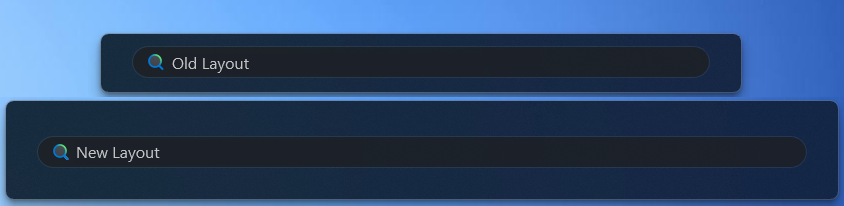

# Literal Only Search theme for Windows 11 Start Menu Styler

A theme for the start menu that eliminates every UI element except for the search bar, much like a MacOS Spotlight without the animations, works with both the old and the new layout.

**Author**: [Ali Cool](https://github.com/AliCool412)



## Manual installation

The theme styles can also be imported manually. To do that, follow these steps:

* Open the Windows 11 Start Menu Styler mod in Windhawk.
* Go to the "Settings" tab and select "Textual mode".
* Copy the content below to the text box and click "Save settings".

<details>
<summary>Content to import (click to expand)</summary>

```yaml
controlStyles:
  - target: Frame#StartFrame
    styles:
      - Visibility=Collapsed
  - target: Grid#MainContent > Grid
    styles:
      - Grid.Row=3
      - VerticalAlignment=Top
  - target: Grid#AnimationRoot
    styles:
      - Height=100
      - VerticalAlignment=Bottom
  - target: Windows.UI.Xaml.Shapes.Rectangle#MaxHeightEnforcer
    styles:
      - Visibility=Collapsed
  - target: Grid#MainContent
    styles:
      - Margin=0,-60,0,0
  - target: Grid#NavPanePlaceholder
    styles:
      - Visibility=Collapsed
  - target: StartDocked.NavigationPaneView#NavigationPane
    styles:
      - Visibility=Collapsed
  - target: Grid#UndockedRoot
    styles:
      - Visibility=Collapsed
  - target: Grid#InnerContent
    styles:
      - Margin=0,16,0,0
  - target: StartDocked.StartSizingFrame
    styles:
      - MaxHeight=60
      - MinHeight=60
  - target: Border#AcrylicOverlay
    styles:
      - Visibility=Collapsed
  - target: StartMenu.SearchBoxToggleButton#SearchBoxToggleButton
    styles:
      - Margin=0,-2,0,2
```
</details>
