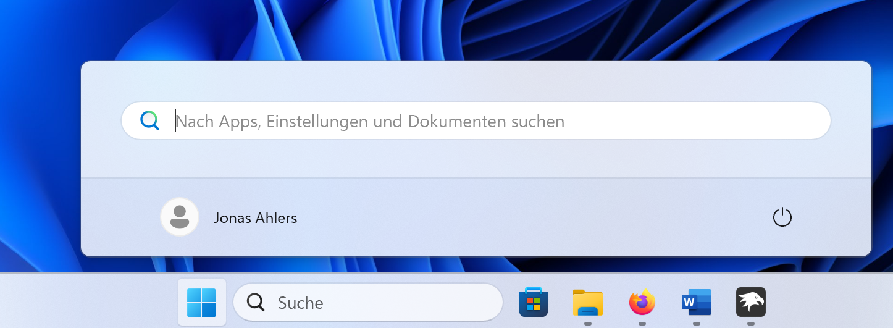

# OnlySearch theme for Windows 11 Start Menu Styler

This theme removes the recommended app section as well as the newly added ones,
including the list. It basically leaves you with a clean look.

**Author**: [jonas-usx](https://github.com/jonas-usx)


<!--
## Theme selection

The theme is integrated into the mod, and can be simply selected from the mod's
settings:

* Open the Windows 11 Start Menu Styler mod in Windhawk.
* Go to the "Settings" tab.
* Select the theme and save the settings.
-->
## Manual installation

<!-- The theme styles can also be imported manually. To do that, follow these steps: -->
To import the theme manually, follow these steps:

* Open the Windows 11 Start Menu Styler mod in Windhawk.
* Go to the "Advanced" tab.
* Copy the content below to the text box under "Mod settings" and click "Save".

<details>
<summary>Content to import (click to expand)</summary>

```json
{
  "controlStyles[0].target": "StartDocked.StartSizingFrame",
  "controlStyles[0].styles[0]": "MaxHeight=160",
  "controlStyles[1].target": "StartDocked.StartSizingFrame",
  "controlStyles[1].styles[0]": "MinHeight=100",
  "controlStyles[2].target": "Windows.UI.Xaml.Controls.Grid#UndockedRoot",
  "controlStyles[2].styles[0]": "Visibility=Collapsed"
}
```
</details>
