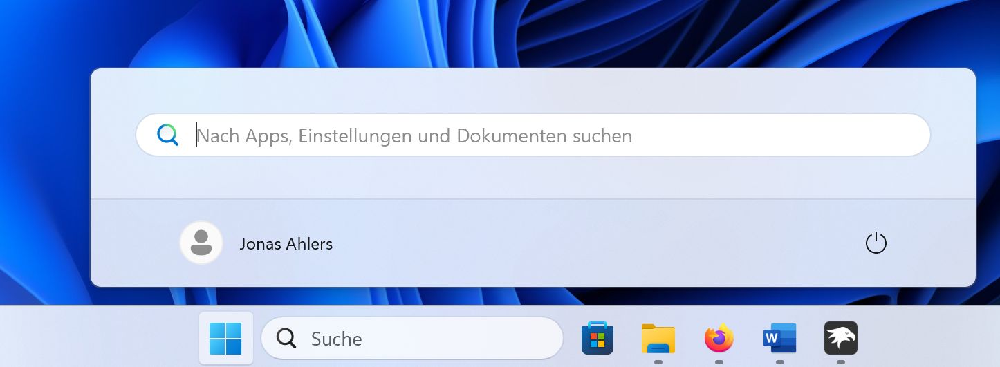

# OnlySearch theme for Windows 11 Start Menu Styler

This theme removes all buttons and sections except the search bar, and navigation buttons. It basically leaves you with a clean look.

**Author**: [jonas-usx](https://github.com/jonas-usx)



## Theme selection

The theme is integrated into the mod and can be selected directly from the mod's
settings:

* Open the Windows 11 Start Menu Styler mod in Windhawk.
* Go to the "Settings" tab.
* Select the theme and save the settings.

## Manual installation

The theme styles can also be imported manually. To do that, follow these steps:

* Open the Windows 11 Start Menu Styler mod in Windhawk.
* Go to the "Settings" tab and select "Textual mode".
* Copy the content below to the text box and click "Save settings".

### Redesigned Start menu

A variant for the [redesigned Windows 11 Start
menu](https://microsoft.design/articles/start-fresh-redesigning-windows-start-menu/)
that is slowly rolling out in the 25H2 update.

<details>
<summary>Content to import (click to expand)</summary>

```yaml
controlStyles:
  - target: Grid#FrameRoot
    styles:
      - MaxHeight=160
      - MinHeight=100
  - target: Border#AcrylicOverlay
    styles:
      - Height=3
  - target: Windows.UI.Xaml.Controls.Primitives.ToggleButton#ShowHideCompanion
    styles:
      - Visibility=Collapsed
  - target: Grid#RightCompanionContainerGrid
    styles:
      - Visibility=Collapsed
```
</details>

### Classic Start menu

<details>
<summary>Content to import (click to expand)</summary>

```yaml
controlStyles:
  - target: StartDocked.StartSizingFrame
    styles:
      - MaxHeight=160
  - target: StartDocked.StartSizingFrame
    styles:
      - MinHeight=100
  - target: Windows.UI.Xaml.Controls.Grid#UndockedRoot
    styles:
      - Visibility=Collapsed
```
</details>
