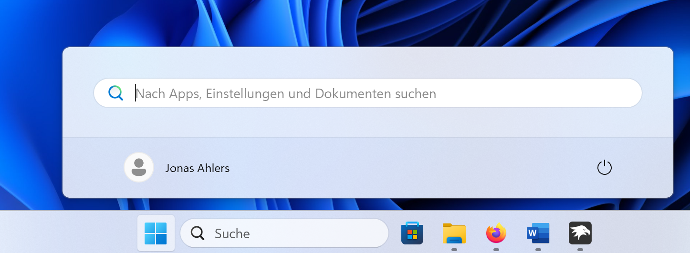
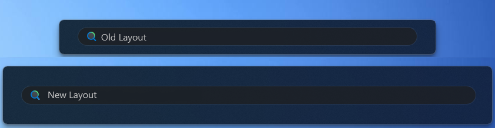

# OnlySearch theme for Windows 11 Start Menu Styler

This theme removes all buttons and sections except the search bar, and navigation buttons. It basically leaves you with a clean look.

**Author**: [jonas-usx](https://github.com/jonas-usx)



## Theme selection

The theme is integrated into the mod and can be selected directly from the mod's
settings:

* Open the Windows 11 Start Menu Styler mod in Windhawk.
* Go to the "Settings" tab.
* Select the theme and save the settings.

## Manual installation

The theme styles can also be imported manually. To do that, follow these steps:

* Open the Windows 11 Start Menu Styler mod in Windhawk.
* Go to the "Settings" tab and select "Textual mode".
* Copy the content below to the text box and click "Save settings".

### Redesigned Start menu

A variant for the [redesigned Windows 11 Start
menu](https://microsoft.design/articles/start-fresh-redesigning-windows-start-menu/)
that is slowly rolling out in the 25H2 update.

<details>
<summary>Content to import (click to expand)</summary>

```yaml
controlStyles:
  - target: Grid#FrameRoot
    styles:
      - MaxHeight=160
      - MinHeight=100
  - target: Border#AcrylicOverlay
    styles:
      - Height=3
  - target: Windows.UI.Xaml.Controls.Primitives.ToggleButton#ShowHideCompanion
    styles:
      - Visibility=Collapsed
  - target: Grid#RightCompanionContainerGrid
    styles:
      - Visibility=Collapsed
```
</details>

### Classic Start menu

<details>
<summary>Content to import (click to expand)</summary>

```yaml
controlStyles:
  - target: StartDocked.StartSizingFrame
    styles:
      - MinHeight=100
      - MaxHeight=160
  - target: Windows.UI.Xaml.Controls.Grid#UndockedRoot
    styles:
      - Visibility=Collapsed
```
</details>

### Literal OnlySearch

This variant of the theme removes even the bottom navigation section, keeping the start menu down to only a search bar remaining.

**Author**: [Ali Cool](https://github.com/AliCool412)



<details>
<summary>Content to import (click to expand)</summary>

```yaml
controlStyles:
  - target: Frame#StartFrame
    styles:
      - Visibility=Collapsed
  - target: Grid#MainContent > Grid
    styles:
      - Grid.Row=3
      - VerticalAlignment=Top
  - target: Grid#AnimationRoot
    styles:
      - Height=100
      - VerticalAlignment=Bottom
  - target: Windows.UI.Xaml.Shapes.Rectangle#MaxHeightEnforcer
    styles:
      - Visibility=Collapsed
  - target: Grid#MainContent
    styles:
      - Margin=0,-60,0,0
  - target: Grid#NavPanePlaceholder
    styles:
      - Visibility=Collapsed
  - target: StartDocked.NavigationPaneView#NavigationPane
    styles:
      - Visibility=Collapsed
  - target: Grid#UndockedRoot
    styles:
      - Visibility=Collapsed
  - target: Grid#InnerContent
    styles:
      - Margin=0,16,0,0
  - target: StartDocked.StartSizingFrame
    styles:
      - MaxHeight=60
      - MinHeight=60
  - target: Border#AcrylicOverlay
    styles:
      - Visibility=Collapsed
  - target: StartMenu.SearchBoxToggleButton#SearchBoxToggleButton
    styles:
      - Margin=0,-2,0,2
```
</details>

