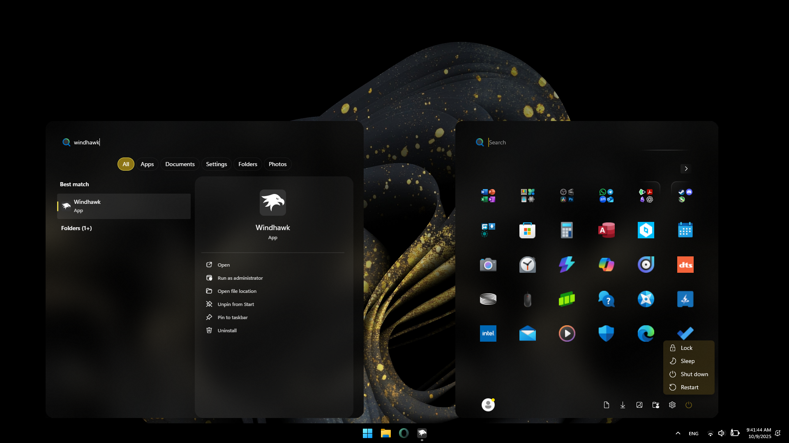

# "Oversimplified & Accentuated" Theme for "Windows 11 Start Menu Styler"

A cleaner, more refined Windows Start Menu (& Search Menu) theme - removing unnecessary elements and offering better **Accent Color** integration.

> ⚠️ **Note:** This theme is optimized for Windows in **Dark Mode** and may not display correctly in **Light Mode**.

> ⚠️ **Note:** This theme was created and tested with **Windows 11 24H2**, compatability with **Windows 11 25H2** is not guranteed.

### ✨ Features
- Removed unnecessary text and lines
- Enlarged icons  
- Enhanced Accent Color Presence (Automatically Updates with Windows Accent Color)  
- Improved Transparency Effects
- Added Subtle, Neat Border Reveal Effects
- Took Fallback Colors (Colors in Battery Mode) into consideration

**Author:** [OsamaJT](https://github.com/OsamaHJT)



---

## 🎨 Elements Modified
- Start Menu
  - Folder Widnow
  - Pinned Apps & Folders
  - All Apps Page
- Search Menu
- Context Menu
- ToolTip Popup
  
---

## 🧩 Installation

1. Download **[Windhawk](https://windhawk.net/)**.  
2. Install the **“[Windows 11 Start Menu Styler](https://windhawk.net/mods/windows-11-start-menu-styler)”** plugin.  
3. Choose the **“Oversimplified & Accentuated”** theme from the integrated themes list.  
   **OR**  
   Copy the JSON code below and go to:  
   **Windows 11 Taskbar Styler → Details → Advanced → Mod Settings**  
   Paste the code into the "**Mod settings**" box and click **Save**.


---

## 🛠️ Modification Notes

I added an extra comment line at the end of each style group to indicate the target object with common language.  
The aim is to make it easier to modify or debug the theme in the future.


<details>
<summary>Content to import (click to expand)</summary>

```json
{
    "controlStyles[0].target": "MenuFlyoutPresenter",
    "controlStyles[0].styles[0]": "Background:=$DarkAccent",
    "controlStyles[0].styles[1]": "BorderBrush=Transparent",
    "controlStyles[0].styles[2]": "//Target= Context Menu",

    "controlStyles[1].target": "ToolTip > ContentPresenter#LayoutRoot",
    "controlStyles[1].styles[0]": "Background:=$DarkAccent",
    "controlStyles[1].styles[1]": "BorderBrush:=$Reveal",
    "controlStyles[1].styles[2]": "Shadow:=",
    "controlStyles[1].styles[3]": "//Target= Tooltip Popup",

    "controlStyles[2].target": "Border#AcrylicBorder",
    "controlStyles[2].styles[0]": "Background:=$Alt",
    "controlStyles[2].styles[1]": "BorderBrush=Transparent",
    "controlStyles[2].styles[2]": "CornerRadius=20",
    "controlStyles[2].styles[3]": "//Target= Start Menu's Body",

    "controlStyles[3].target": "Border#AcrylicOverlay",
    "controlStyles[3].styles[0]": "Visibility=Collapsed",
    "controlStyles[3].styles[1]": "//Target= Start Menu > Acrylic Overlay Layer",

    "controlStyles[4].target": "Border#DropShadow",
    "controlStyles[4].styles[0]": "Visibility=Collapsed",
    "controlStyles[4].styles[1]": "//Target= Start Menu > Drop Shadow (Before 24H2)",

    "controlStyles[5].target": "Border#RootGridDropShadow",
    "controlStyles[5].styles[0]": "Visibility=Collapsed",
    "controlStyles[5].styles[1]": "//Target= Start Menu > Drop Shadow",

    "controlStyles[6].target": "Border#RightCompanionDropShadow",
    "controlStyles[6].styles[0]": "Visibility=Collapsed",
    "controlStyles[6].styles[1]": "//Target= Start Menu > Drop Shadow of \"Phone Link\" Menu",

    "controlStyles[7].target": "Border#BorderElement",
    "controlStyles[7].styles[0]": "Opacity=0",
    "controlStyles[7].styles[1]": "//Target= Start Menu > Search Box Overlay",

    "controlStyles[8].target": "StartDocked.SearchBoxToggleButton#StartMenuSearchBox > Grid",
    "controlStyles[8].styles[0]": "BorderBrush:=$Reveal",
    "controlStyles[8].styles[1]": "BorderThickness=2",
    "controlStyles[8].styles[2]": "CornerRadius=20",
    "controlStyles[8].styles[3]": "Margin=0,0,0,-8",
    "controlStyles[8].styles[4]": "//Target= Start Menu > Seach Box",

    "controlStyles[9].target": "Grid > Image#SearchIconOn",
    "controlStyles[9].styles[0]": "Width=20",
    "controlStyles[9].styles[1]": "//Target= Start Menu > Search icon",

    "controlStyles[10].target": "TextBlock#PlaceholderText",
    "controlStyles[10].styles[0]": "Text=Search",
    "controlStyles[10].styles[1]": "//Target= Start Menu > Search Box Placerholder Text",

    "controlStyles[11].target": "Grid#InnerContent > Rectangle",
    "controlStyles[11].styles[0]": "Fill:=$SolidAccent",
    "controlStyles[11].styles[1]": "MinHeight=22",
    "controlStyles[11].styles[2]": "MinWidth=2",
    "controlStyles[11].styles[3]": "Margin=80,8,0,31",
    "controlStyles[11].styles[4]": "Opacity=1",
    "controlStyles[11].styles[5]": "//Target= Start Menu > Search Box > Fake Carret",

    "controlStyles[12].target": "StartMenu.PinnedList#StartMenuPinnedList",
    "controlStyles[12].styles[0]": "Height=421",
    "controlStyles[12].styles[1]": "//Target= Start Menu > Pinned Apps Section Container",

    "controlStyles[13].target": "Microsoft.UI.Xaml.Controls.PipsPager#PinnedListPipsPager",
    "controlStyles[13].styles[0]": "Visibility=Collapsed",
    "controlStyles[13].styles[1]": "//Target= Start Menu > Page Count Indicator",

    "controlStyles[14].target": "TextBlock#PinnedListHeaderText",
    "controlStyles[14].styles[0]": "Visibility=Collapsed",
    "controlStyles[14].styles[1]": "//Target= Start Menu > \"Pinned\" Text",

    "controlStyles[15].target": "Border#ContentBorder@CommonStates > Grid#DroppedFlickerWorkaroundWrapper > Border#BackgroundBorder",
    "controlStyles[15].styles[0]": "Background@Normal:=<SolidColorBrush Color=\"Transparent\" Opacity=\"0.8\"/>",
    "controlStyles[15].styles[1]": "Background@PointerOver:=<SolidColorBrush Color=\"{ThemeResource ControlFillColorSecondary}\" Opacity=\"0.8\"/>",
    "controlStyles[15].styles[2]": "Background@Pressed:=<RevealBorderBrush Color=\"Transparent\" TargetTheme=\"1\" Opacity=\"0.3\" />",
    "controlStyles[15].styles[3]": "BackgroundTransition:=<BrushTransition Duration=\"0:0:0.2\" />",
    "controlStyles[15].styles[4]": "BorderBrush:=$Reveal",
    "controlStyles[15].styles[5]": "BorderThickness=2",
    "controlStyles[15].styles[6]": "CornerRadius=12",
    "controlStyles[15].styles[7]": "Height=70",
    "controlStyles[15].styles[8]": "Width=70",
    "controlStyles[15].styles[9]": "//Target= Start Menu > Hover-Over Box For Pinned items (Apps & Folders)",

    "controlStyles[16].target": "Grid#LogoContainer",
    "controlStyles[16].styles[0]": "Height=60",
    "controlStyles[16].styles[1]": "Width=60",
    "controlStyles[16].styles[2]": "//Target= Start Menu > Pinned App icon Container",

    "controlStyles[17].target": "Border#ContentBorder@CommonStates > Grid#DroppedFlickerWorkaroundWrapper > ContentPresenter#ContentPresenter > Grid > StartMenu.PinnedListTile > Grid#Root > Grid#LogoContainer > Image#Logo",
    "controlStyles[17].styles[0]": "Height=40",
    "controlStyles[17].styles[1]": "Width=40",
    "controlStyles[17].styles[2]": "Height@Pressed=36",
    "controlStyles[17].styles[3]": "Width@Pressed=36",
    "controlStyles[17].styles[4]": "//Target= Start Menu > Pinned App Icon",

    "controlStyles[18].target": "Border#FolderPlate",
    "controlStyles[18].styles[0]": "Background=Transparent",
    "controlStyles[18].styles[1]": "BorderBrush=Transparent",
    "controlStyles[18].styles[2]": "Height=56",
    "controlStyles[18].styles[3]": "Width=56",
    "controlStyles[18].styles[4]": "//Target= Start Menu > Folder Container",

    "controlStyles[19].target": "Grid#LogosContainer",
    "controlStyles[19].styles[0]": "Height=68",
    "controlStyles[19].styles[1]": "Width=68",
    "controlStyles[19].styles[2]": "//Target= Start Menu > Folder's Content icons",

    "controlStyles[20].target": "Grid#Root > Border",
    "controlStyles[20].styles[0]": "Background:=$DarkAccent",
    "controlStyles[20].styles[1]": "BorderBrush:=Transparent",
    "controlStyles[20].styles[2]": "CornerRadius=20",
    "controlStyles[20].styles[3]": "//Target= Start Menu > Folder > Body",

    "controlStyles[21].target": "TextBlock#TruncationTextBlock",
    "controlStyles[21].styles[0]": "FontSize=30",
    "controlStyles[21].styles[1]": "//Target= Start Menu > Folder > Title Text",

    "controlStyles[22].target": "TextBlock#DisplayName",
    "controlStyles[22].styles[0]": "Visibility=Collapsed",
    "controlStyles[22].styles[1]": "//Target= Start Menu > Name of Pinned Apps & Folders",

    "controlStyles[23].target": "Grid#SuggestionsParentContainer",
    "controlStyles[23].styles[0]": "Visibility=Collapsed",
    "controlStyles[23].styles[1]": "//Target= Start Menu > Suggestions Section",

    "controlStyles[24].target": "Grid#TopLevelSuggestionsListHeader",
    "controlStyles[24].styles[0]": "Visibility=Collapsed",
    "controlStyles[24].styles[1]": "//Target= Start Menu > Suggestions Text \"Recomended\"",

    "controlStyles[25].target": "Grid#ShowMoreSuggestions",
    "controlStyles[25].styles[0]": "Visibility=Collapsed",
    "controlStyles[25].styles[1]": "//Target= Start Menu > Show More Suggestions Button",

    "controlStyles[26].target": "Grid#TopLevelSuggestionsContainer",
    "controlStyles[26].styles[0]": "Visibility=Collapsed",
    "controlStyles[26].styles[1]": "//Target= Start Menu > Suggestions Entries",

    "controlStyles[27].target": "StartDocked.NavigationPaneButton#PowerButton > Grid",
    "controlStyles[27].styles[0]": "BorderBrush:=$Reveal",
    "controlStyles[27].styles[1]": "BorderThickness=2",
    "controlStyles[27].styles[2]": "CornerRadius=12",
    "controlStyles[27].styles[3]": "//Target= Start Menu > Power Button",

    "controlStyles[28].target": "StartDocked.NavigationPaneButton#PowerButton > Grid > ContentPresenter > Grid > FontIcon",
    "controlStyles[28].styles[0]": "Foreground:=$SolidAccent",
    "controlStyles[28].styles[1]": "//Target= Start Menu > Power Button icon",

    "controlStyles[29].target": "FontIcon#WindowsUpdatePendingReminder",
    "controlStyles[29].styles[0]": "Foreground:=<SolidColorBrush Color="{ThemeResource SystemAccentColorLight2}" Opacity="1"/>",
    "controlStyles[29].styles[1]": "//Target= Start Menu > Power Button > Update Reminder (Default:#ff9900)",

    "controlStyles[30].target": "FontIcon#IconOverlay",
    "controlStyles[30].styles[0]": "Foreground:=$SolidAccent",
    "controlStyles[30].styles[1]": "//Target= Start Menu > Power Button > Context Menu > Update Reminder (Default:#ff9900)",

    "controlStyles[31].target": "Border#BackgroundBorder",
    "controlStyles[31].styles[0]": "CornerRadius=12",
    "controlStyles[31].styles[1]": "//Target= Start Menu > Hover-Over Box For Buttons (Power Button, Libraries & User Button)",

    "controlStyles[32].target": "Button#ShowAllAppsButton > ContentPresenter",
    "controlStyles[32].styles[0]": "Background:=<RevealBorderBrush Color=\"Transparent\" TargetTheme=\"1\" Opacity=\"0.5\" />",
    "controlStyles[32].styles[1]": "BorderBrush=Transparent",
    "controlStyles[32].styles[2]": "Height=25",
    "controlStyles[32].styles[3]": "//Target= Start Menu > \"All >\" Button",

    "controlStyles[33].target": "Button#CloseAllAppsButton > ContentPresenter",
    "controlStyles[33].styles[0]": "Background:=<RevealBorderBrush Color=\"Transparent\" TargetTheme=\"1\" Opacity=\"0.5\" />",
    "controlStyles[33].styles[1]": "BorderBrush=Transparent",
    "controlStyles[33].styles[2]": "Height=25",
    "controlStyles[33].styles[3]": "//Target= Start Menu > All Apps Page > \"< Back\" Button",

    "controlStyles[34].target": "Button > ContentPresenter > StackPanel > TextBlock",
    "controlStyles[34].styles[0]": "Visibility=Collapsed",
    "controlStyles[34].styles[1]": "//Target= Start Menu > \"All >\" & \"< Back\" Buttons Text",

    "controlStyles[35].target": "StackPanel > FontIcon > Grid > TextBlock",
    "controlStyles[35].styles[0]": "FontSize=14 //(Default=10)",
    "controlStyles[35].styles[1]": "//Target= Start Menu > \"All >\" & \"< Back\" Buttons Arrows Text",

    "controlStyles[36].target": "Windows.UI.Xaml.Controls.TextBlock#AllAppsHeading",
    "controlStyles[36].styles[0]": "Visibility=Collapsed",
    "controlStyles[36].styles[1]": "//Target= Start Menu > All Apps Page > \"All\" Text",

    "controlStyles[37].target": "StartDocked.AllAppsZoomListViewItem > Grid#ContentBorder@DisabledStates > Border#BorderBackground",
    "controlStyles[37].styles[0]": "BorderBrush@Enabled:=$Reveal",
    "controlStyles[37].styles[1]": "//Target= Start Menu > All Apps Page > Alphabet Zoomed-Out Buttons",

    "controlStyles[38].target": "Border#Border",
    "controlStyles[38].styles[0]": "BorderBrush:=$Reveal",
    "controlStyles[38].styles[1]": "BorderThickness=2",
    "controlStyles[38].styles[2]": "CornerRadius=12",
    "controlStyles[38].styles[3]": "//Target= Start Menu > All Apps Page > Hover-Over Box for Alphabet",

    "controlStyles[39].target": "Border#BorderBackground",
    "controlStyles[39].styles[0]": "CornerRadius=12",
    "controlStyles[39].styles[1]": "//Target= Start Menu > All Apps Page > Hover-Over Box for Apps & Folders",

    "controlStyles[40].target": "Border#AppBorder",
    "controlStyles[40].styles[0]": "Background:=$Alt",
    "controlStyles[40].styles[1]": "BorderBrush=Transparent",
    "controlStyles[40].styles[2]": "CornerRadius=20",
    "controlStyles[40].styles[3]": "//Target= Search Menu's Body",

    "controlStyles[41].target": "Border#LayerBorder",
    "controlStyles[41].styles[0]": "Visibility=Collapsed",
    "controlStyles[41].styles[1]": "//Target= Search Menu > Acrylic Overlay Layer for Search Menu",

    "controlStyles[42].target": "Border#dropshadow",
    "controlStyles[42].styles[0]": "Visibility=Collapsed",
    "controlStyles[42].styles[1]": "//Target= Search Menu > Drop Shadow",

    "controlStyles[43].target": "Border#TaskbarSearchBackground",
    "controlStyles[43].styles[0]": "Background=Transparent",
    "controlStyles[43].styles[1]": "BorderBrush=Transparent",
    "controlStyles[43].styles[2]": "//Target= Search Menu > Search Box Overlay",

    "controlStyles[44].target": "Cortana.UI.Views.RichSearchBoxControl#SearchBoxControl > Grid#RootGrid",
    "controlStyles[44].styles[0]": "BorderBrush:=$Reveal",
    "controlStyles[44].styles[1]": "BorderThickness=2",
    "controlStyles[44].styles[2]": "CornerRadius=20",
    "controlStyles[44].styles[3]": "//Target= Search Menu > Seach Box",

    "controlStyles[45].target": "Microsoft.UI.Xaml.Controls.AnimatedIcon#SearchIconPlayer",
    "controlStyles[45].styles[0]": "Width=20",
    "controlStyles[45].styles[1]": "//Target= Search Menu > Search icon",

    "webContentStyles[0].target": "li.rightHeaderButtons.itemTooltip.MouseHoverTooltip",
    "webContentStyles[0].styles[0]": "display: none",
    "webContentStyles[0].styles[1]": "//Target= Account & Options Buttons",

    "webContentStyles[1].target": ".scope-with-background__backButton",
    "webContentStyles[1].styles[0]": "display: none !important",
    "webContentStyles[1].styles[1]": "//Target= Back Button",

    "webContentStyles[2].target": ".scope-with-background__rightCaret,.scope-with-background__leftCaret",
    "webContentStyles[2].styles[0]": "display: none !important",
    "webContentStyles[2].styles[1]": "//Target= left and right arrows",

    "webContentStyles[3].target": ".previewContainer",
    "webContentStyles[3].styles[0]": "border-radius: 20px !important",
    "webContentStyles[3].styles[1]": "//Target= Preview Container",

    "webContentStyles[4].target": ".scopes-list",
    "webContentStyles[4].styles[0]": "justify-content: center",
    "webContentStyles[4].styles[1]": "//Target= Filter Buttons Group",

    "webContentStyles[5].target": ".scope-with-background.darkTheme .scope-tile--selected .scope-tile__title,.scope-with-background .scope-tile--selected .scope-tile__title",
    "webContentStyles[5].styles[0]": "Background: var(--accent0) !important",
    "webContentStyles[5].styles[1]": "color: white !important",
    "webContentStyles[5].styles[2]": "//Target= Active Filter Button (Dark&Light)",

    "webContentStyles[6].target": ".scope-tile > div",
    "webContentStyles[6].styles[0]": "background-color: Transparent !important",
    "webContentStyles[6].styles[1]": "//Target= Inactive Filter Buttons",

    "webContentStyles[7].target": ".darkTheme #menuContainer",
    "webContentStyles[7].styles[0]": "background: black",
    "webContentStyles[7].styles[1]": "border: 1px solid #404040",
    "webContentStyles[7].styles[2]": "border-radius: 20px",
    "webContentStyles[7].styles[3]": "box-shadow: none",
    "webContentStyles[7].styles[4]": "//Target= Dark Theme Context Menu Container",

    "webContentStyles[8].target": "#root.darkTheme:not(.fileExplorer) .contextMenu",
    "webContentStyles[8].styles[0]": "background: black !important",
    "webContentStyles[8].styles[1]": "border-radius: 20px !important",
    "webContentStyles[8].styles[2]": "//Target= Dark Theme Context Menu",

    "webContentStyles[9].target": ".lightTheme #menuContainer",
    "webContentStyles[9].styles[0]": "background: white !important",
    "webContentStyles[9].styles[1]": "border: 1px solid #404040",
    "webContentStyles[9].styles[2]": "border-radius: 20px !important",
    "webContentStyles[9].styles[3]": "box-shadow: none",
    "webContentStyles[9].styles[4]": "//Target= Light Theme Context Menu Container",

    "webContentStyles[10].target": "#root:not(.fileExplorer) .contextMenu",
    "webContentStyles[10].styles[0]": "background: white !important",
    "webContentStyles[10].styles[1]": "border-radius: 20px !important",
    "webContentStyles[10].styles[2]": "//Target= Light Theme Context Menu",

    "webContentStyles[11].target": "ul.contextMenu::before",
    "webContentStyles[11].styles[0]": "display: none !important",
    "webContentStyles[11].styles[1]": "//Target= Extra Context Menu Elements (Dark&Light)",

    "styleConstants[0]": "Alt=<AcrylicBrush TintColor=\"{ThemeResource SystemAltHighColor}\" TintOpacity=\"0.6\" TintLuminosityOpacity=\"0.6\" FallbackColor=\"{ThemeResource SystemAltHighColor}\" />",
    "styleConstants[1]": "Accent=<AcrylicBrush TintColor=\"{ThemeResource SystemAccentColor}\" TintOpacity=\"0.6\" TintLuminosityOpacity=\"0.6\" FallbackColor=\"{ThemeResource SystemAccentColor}\" />",
    "styleConstants[2]": "DarkAccent=<AcrylicBrush TintColor=\"{ThemeResource SystemAccentColorDark1}\" TintOpacity=\"0.6\" TintLuminosityOpacity=\"0.3\" FallbackColor=\"{ThemeResource SystemAccentColorDark1}\" />",
    "styleConstants[3]": "SolidAccent=<SolidColorBrush Color=\"{ThemeResource SystemAccentColor}\" Opacity=\"1\"/>",
    "styleConstants[4]": "Reveal=<RevealBorderBrush Color=\"Transparent\" TargetTheme=\"1\" Opacity=\"1\" />"
}
```
