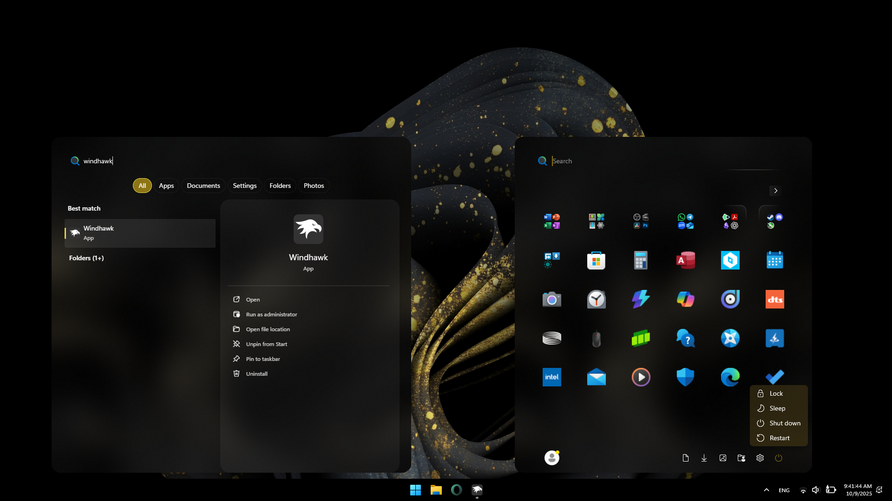

# Oversimplified&Accentuated theme for Windows 11 Start Menu Styler

A cleaner, more refined Windows Start menu (and search menu) theme - removing unnecessary elements and offering better **accent color** integration.

> [!NOTE]
> This theme does not have a variant for the [redesigned Windows 11 Start menu](https://microsoft.design/articles/start-fresh-redesigning-windows-start-menu/) that is slowly rolling out in the 25H2 update.

> [!NOTE]
> This theme is optimized for Windows in **Dark Mode** and may not display correctly in **Light Mode**.

### ✨ Features
- Removed unnecessary text and lines
- Enlarged icons
- Enhanced accent color presence (automatically updates with Windows accent color)
- Improved transparency effects
- Added subtle, neat border reveal effects
- Took fallback colors (colors in battery mode) into consideration

**Author:** [OsamaJT](https://github.com/OsamaHJT)



---

## 🎨 Elements modified
- Start menu
  - Folder window
  - Pinned apps & folders
  - All Apps page
- Search menu
- Context menu
- Tooltip popup

---

## Theme selection

The theme is integrated into the mod and can be selected directly from the mod's
settings:

* Open the Windows 11 Start Menu Styler mod in Windhawk.
* Go to the "Settings" tab.
* Select the theme and save the settings.

## Manual installation

The theme styles can also be imported manually. To do that, follow these steps:

* Open the Windows 11 Start Menu Styler mod in Windhawk.
* Go to the "Settings" tab and select "Textual mode".
* Copy the content below to the text box and click "Save settings".

<details>
<summary>Content to import (click to expand)</summary>

```yaml
styleConstants:
  - Alt=<AcrylicBrush TintColor="{ThemeResource SystemAltHighColor}" TintOpacity="0.6" TintLuminosityOpacity="0.6" FallbackColor="{ThemeResource SystemAltHighColor}" />
  - Accent=<AcrylicBrush TintColor="{ThemeResource SystemAccentColor}" TintOpacity="0.6" TintLuminosityOpacity="0.6" FallbackColor="{ThemeResource SystemAccentColor}" />
  - DarkAccent=<AcrylicBrush TintColor="{ThemeResource SystemAccentColorDark1}" TintOpacity="0.6" TintLuminosityOpacity="0.3" FallbackColor="{ThemeResource SystemAccentColorDark1}" />
  - SolidAccent=<SolidColorBrush Color="{ThemeResource SystemAccentColor}" Opacity="1"/>
  - Reveal=<RevealBorderBrush Color="Transparent" TargetTheme="1" Opacity="1" />
controlStyles:
  - target: MenuFlyoutPresenter
    styles:
      - Background:=$DarkAccent
      - BorderBrush=Transparent
      - Shadow:=
      - //Target= Context Menu
  - target: ToolTip > ContentPresenter#LayoutRoot
    styles:
      - Background:=$DarkAccent
      - BorderBrush:=$Reveal
      - Shadow:=
      - //Target= Tooltip Popup
  - target: Border#AcrylicBorder
    styles:
      - Background:=$Alt
      - BorderBrush=Transparent
      - CornerRadius=20
      - //Target= Start Menu's Body
  - target: Border#AcrylicOverlay
    styles:
      - Visibility=Collapsed
      - //Target= Start Menu > Acrylic Overlay Layer
  - target: Border#DropShadow
    styles:
      - Visibility=Collapsed
      - //Target= Start Menu > Drop Shadow (Before 24H2)
  - target: Border#RootGridDropShadow
    styles:
      - Visibility=Collapsed
      - //Target= Start Menu > Drop Shadow
  - target: Border#RightCompanionDropShadow
    styles:
      - Visibility=Collapsed
      - //Target= Start Menu > Drop Shadow of "Phone Link" Menu
  - target: Border#BorderElement
    styles:
      - Opacity=0
      - //Target= Start Menu > Search Box Overlay
  - target: StartDocked.SearchBoxToggleButton#StartMenuSearchBox > Grid
    styles:
      - BorderBrush:=$Reveal
      - BorderThickness=2
      - CornerRadius=20
      - Margin=0,0,0,-8
      - //Target= Start Menu > Search Box
  - target: Grid > Image#SearchIconOn
    styles:
      - Width=20
      - //Target= Start Menu > Search icon
  - target: TextBlock#PlaceholderText
    styles:
      - Text=Search
      - //Target= Start Menu > Search Box Placeholder Text
  - target: Grid#InnerContent > Rectangle
    styles:
      - Fill:=$SolidAccent
      - MinHeight=22
      - MinWidth=2
      - Margin=80,8,0,31
      - Opacity=1
      - //Target= Start Menu > Search Box > Fake Caret
  - target: StartMenu.PinnedList#StartMenuPinnedList
    styles:
      - Height=421
      - //Target= Start Menu > Pinned Apps Section Container
  - target: Microsoft.UI.Xaml.Controls.PipsPager#PinnedListPipsPager
    styles:
      - Visibility=Collapsed
      - //Target= Start Menu > Page Count Indicator
  - target: TextBlock#PinnedListHeaderText
    styles:
      - Visibility=Collapsed
      - //Target= Start Menu > "Pinned" Text
  - target: Border#ContentBorder@CommonStates > Grid#DroppedFlickerWorkaroundWrapper > Border#BackgroundBorder
    styles:
      - Background@Normal:=<SolidColorBrush Color="Transparent" Opacity="0.8"/>
      - Background@PointerOver:=<SolidColorBrush Color="{ThemeResource ControlFillColorSecondary}" Opacity="0.8"/>
      - Background@Pressed:=<RevealBorderBrush Color="Transparent" TargetTheme="1" Opacity="0.3" />
      - BackgroundTransition:=<BrushTransition Duration="0:0:0.2" />
      - BorderBrush:=$Reveal
      - BorderThickness=2
      - CornerRadius=12
      - Height=70
      - Width=70
      - //Target= Start Menu > Hover-Over Box For Pinned items (Apps & Folders)
  - target: Grid#LogoContainer
    styles:
      - Height=60
      - Width=60
      - //Target= Start Menu > Pinned App icon Container
  - target: Border#ContentBorder@CommonStates > Grid#DroppedFlickerWorkaroundWrapper > ContentPresenter#ContentPresenter > Grid > StartMenu.PinnedListTile > Grid#Root > Grid#LogoContainer > Image#Logo
    styles:
      - Height=40
      - Width=40
      - Height@Pressed=36
      - Width@Pressed=36
      - //Target= Start Menu > Pinned App Icon
  - target: Border#FolderPlate
    styles:
      - Background=Transparent
      - BorderBrush=Transparent
      - Height=56
      - Width=56
      - //Target= Start Menu > Folder Container
  - target: Grid#LogosContainer
    styles:
      - Height=68
      - Width=68
      - //Target= Start Menu > Folder's Content icons
  - target: ItemsControl#LogosItemsControl
    styles:
      - Height=50
      - Width=50
      - //Target= Start Menu > Folder Thumbnail-Preview Container
  - target: ItemsControl#LogosItemsControl > ItemsPresenter > ItemsWrapGrid > ContentPresenter > Windows.UI.Xaml.Controls.Grid
    styles:
      - Height=22
      - Width=22
      - //Target= Start Menu > Folder Thumbnail-Preview Icons
  - target: Grid#Root > Border
    styles:
      - Background:=$DarkAccent
      - BorderBrush:=Transparent
      - CornerRadius=20
      - //Target= Start Menu > Folder > Body
  - target: TextBlock#TruncationTextBlock
    styles:
      - FontSize=30
      - //Target= Start Menu > Folder > Title Text
  - target: TextBlock#DisplayName
    styles:
      - Visibility=Collapsed
      - //Target= Start Menu > Name of Pinned Apps & Folders
  - target: Grid#SuggestionsParentContainer
    styles:
      - Visibility=Collapsed
      - //Target= Start Menu > Suggestions Section
  - target: Grid#TopLevelSuggestionsListHeader
    styles:
      - Visibility=Collapsed
      - //Target= Start Menu > Suggestions Text "Recommended"
  - target: Grid#ShowMoreSuggestions
    styles:
      - Visibility=Collapsed
      - //Target= Start Menu > Show More Suggestions Button
  - target: Grid#TopLevelSuggestionsContainer
    styles:
      - Visibility=Collapsed
      - //Target= Start Menu > Suggestions Entries
  - target: StartDocked.NavigationPaneButton#PowerButton > Grid
    styles:
      - BorderBrush:=$Reveal
      - BorderThickness=2
      - CornerRadius=12
      - //Target= Start Menu > Power Button
  - target: StartDocked.NavigationPaneButton#PowerButton > Grid > ContentPresenter > Grid > FontIcon
    styles:
      - Foreground:=$SolidAccent
      - //Target= Start Menu > Power Button icon
  - target: FontIcon#WindowsUpdatePendingReminder
    styles:
      - Foreground:=<SolidColorBrush Color="{ThemeResource SystemAccentColorLight2}" Opacity="1" />
      - //Target= Start Menu > Power Button > Update Reminder (Default:#ff9900)
  - target: FontIcon#IconOverlay
    styles:
      - Foreground:=$SolidAccent
      - //Target= Start Menu > Power Button > Power Menu > Update Reminder (Default:#ff9900)
  - target: Grid#AccountBadgePlaceholder > StartDocked.IconBadgeView > Grid#IconBadgeRoot > Grid > Windows.UI.Xaml.Shapes.Ellipse
    styles:
      - Fill:=<SolidColorBrush Color="{ThemeResource SystemAccentColorLight2}" Opacity="1" />
      - //Target= Start Menu > Account Button > Account Notification Reminder
  - target: Border#BackgroundBorder
    styles:
      - CornerRadius=12
      - //Target= Start Menu > Hover-Over Box For Buttons (Power Button, Libraries & User Button)
  - target: Button#ShowAllAppsButton > ContentPresenter
    styles:
      - Background:=<RevealBorderBrush Color="Transparent" TargetTheme="1" Opacity="0.5" />
      - BorderBrush=Transparent
      - Height=25
      - //Target= Start Menu > "All >" Button
  - target: Button#CloseAllAppsButton > ContentPresenter
    styles:
      - Background:=<RevealBorderBrush Color="Transparent" TargetTheme="1" Opacity="0.5" />
      - BorderBrush=Transparent
      - Height=25
      - //Target= Start Menu > All Apps Page > "< Back" Button
  - target: Button > ContentPresenter > StackPanel > TextBlock
    styles:
      - Visibility=Collapsed
      - //Target= Start Menu > "All >" & "< Back" Buttons Text
  - target: StackPanel > FontIcon > Grid > TextBlock
    styles:
      - FontSize=14 //(Default=10)
      - //Target= Start Menu > "All >" & "< Back" Buttons Arrows Text
  - target: Windows.UI.Xaml.Controls.TextBlock#AllAppsHeading
    styles:
      - Visibility=Collapsed
      - //Target= Start Menu > All Apps Page > "All" Text
  - target: StartDocked.AllAppsZoomListViewItem > Grid#ContentBorder@DisabledStates > Border#BorderBackground
    styles:
      - BorderBrush@Enabled:=$Reveal
      - //Target= Start Menu > All Apps Page > Alphabet Zoomed-Out Buttons
  - target: Border#Border
    styles:
      - BorderBrush:=$Reveal
      - BorderThickness=2
      - CornerRadius=12
      - //Target= Start Menu > All Apps Page > Hover-Over Box for Alphabet
  - target: Border#BorderBackground
    styles:
      - CornerRadius=12
      - //Target= Start Menu > All Apps Page > Hover-Over Box for Apps & Folders
  - target: Border#AppBorder
    styles:
      - Background:=$Alt
      - BorderBrush=Transparent
      - CornerRadius=20
      - //Target= Search Menu's Body
  - target: Border#LayerBorder
    styles:
      - Visibility=Collapsed
      - //Target= Search Menu > Acrylic Overlay Layer for Search Menu
  - target: Border#dropshadow
    styles:
      - Visibility=Collapsed
      - //Target= Search Menu > Drop Shadow
  - target: Border#TaskbarSearchBackground
    styles:
      - Background=Transparent
      - BorderBrush=Transparent
      - //Target= Search Menu > Search Box Overlay
  - target: Cortana.UI.Views.RichSearchBoxControl#SearchBoxControl > Grid#RootGrid
    styles:
      - BorderBrush:=$Reveal
      - BorderThickness=2
      - CornerRadius=20
      - //Target= Search Menu > Search Box
  - target: Microsoft.UI.Xaml.Controls.AnimatedIcon#SearchIconPlayer
    styles:
      - Width=20
      - //Target= Search Menu > Search icon
webContentStyles:
  - target: li.rightHeaderButtons.itemTooltip.MouseHoverTooltip
    styles:
      - 'display: none'
      - //Target= Account & Options Buttons
  - target: .scope-with-background__backButton
    styles:
      - 'display: none !important'
      - //Target= Back Button
  - target: .scope-with-background__rightCaret,.scope-with-background__leftCaret
    styles:
      - 'display: none !important'
      - //Target= left and right arrows
  - target: .previewContainer
    styles:
      - 'border-radius: 20px !important'
      - //Target= Preview Container
  - target: .scopes-list
    styles:
      - 'justify-content: center'
      - //Target= Filter Buttons Group
  - target: .scope-with-background.darkTheme .scope-tile--selected .scope-tile__title,.scope-with-background .scope-tile--selected .scope-tile__title
    styles:
      - 'Background: var(--accent0) !important'
      - 'color: white !important'
      - //Target= Active Filter Button (Dark&Light)
  - target: .scope-tile > div
    styles:
      - 'background-color: Transparent !important'
      - //Target= Inactive Filter Buttons
  - target: '.darkTheme #menuContainer'
    styles:
      - 'background: black'
      - 'border: 1px solid #404040'
      - 'border-radius: 20px'
      - 'box-shadow: none'
      - //Target= Dark Theme Context Menu Container
  - target: '#root.darkTheme:not(.fileExplorer) .contextMenu'
    styles:
      - 'background: black !important'
      - 'border-radius: 20px !important'
      - //Target= Dark Theme Context Menu
  - target: '.lightTheme #menuContainer'
    styles:
      - 'background: white !important'
      - 'border: 1px solid #404040'
      - 'border-radius: 20px !important'
      - 'box-shadow: none'
      - //Target= Light Theme Context Menu Container
  - target: '#root:not(.fileExplorer) .contextMenu'
    styles:
      - 'background: white !important'
      - 'border-radius: 20px !important'
      - //Target= Light Theme Context Menu
  - target: ul.contextMenu::before
    styles:
      - 'display: none !important'
      - //Target= Extra Context Menu Elements (Dark&Light)
```
</details>

### Modification notes

I added an extra comment line at the end of each style group to indicate the target object with common language.  
The aim is to make it easier to modify or debug the theme in the future.
