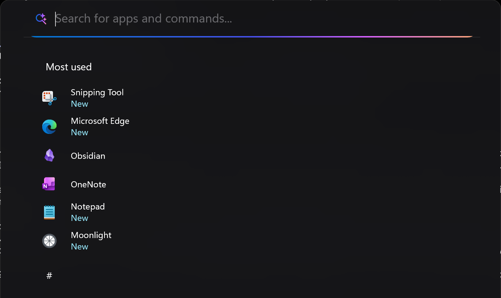

# Raycast theme for Windows 11 Start Menu Styler

This theme turns the Start menu into a floating command palette in the style of
launcher apps like Raycast: a centred, blurred panel with a single search field
above one flat list of apps. The pinned grid, the recommended feed, the Bing
image-of-the-day and the Copilot card are all removed.

**Author**: [Maws7140](https://github.com/Maws7140)



## Theme selection

The theme is integrated into the mod and can be selected directly from the mod's
settings:

* Open the Windows 11 Start Menu Styler mod in Windhawk.
* Go to the "Settings" tab.
* Select the theme and save the settings.

## Manual installation

The theme styles can also be imported manually. To do that, follow these steps:

* Open the Windows 11 Start Menu Styler mod in Windhawk.
* Go to the "Settings" tab and select "Textual mode".
* Copy the content below to the text box and click "Save settings".

### Redesigned Start menu

A variant for the [redesigned Windows 11 Start
menu](https://microsoft.design/articles/start-fresh-redesigning-windows-start-menu/)
that is rolling out in the 25H2 update.

<details>
<summary>Content to import (click to expand)</summary>

```yaml
# Raycast-style Start menu for Windhawk "Windows 11 Start Menu Styler" v1.7
# Target: Windows 11 25H2 build 26200 (redesigned / "blended" Start menu)
# Display assumption: 1440x960 logical DIPs (2880x1920 @ 200%)
#
# Reference metrics taken from the Raycast dark launcher:
#   window 750x475pt, search row 56, list row 40, icon 20, row radius 8
#   scaled to this screen  ->  700x460, search 52, row 38, icon 20
#
# theme is deliberately "" (None). The built-in OnlySearch theme clamps
# Grid#FrameRoot to MaxHeight=160, which fights every size set below.

theme: ""
disableNewStartMenuLayout: forceNewLayout

styleConstants:
  # --- Geometry -------------------------------------------------------------
  - PaletteWidth=700
  - PaletteHeight=460
  # Lift off the taskbar so the palette floats near screen centre, Raycast-style.
  # Negative = up. Safe range on a 960-DIP-tall screen: 0 to -240.
  - PaletteOffsetY=-140
  # The search/results view is a different XAML page in the same window, so it
  # gets its own lift and width. Keep both equal to the palette values unless a
  # measurement says otherwise - they exist so view 2 can be nudged without
  # disturbing the base view that already looks right.
  - SearchOffsetY=-140
  - SearchWidth=700
  - PaletteRadius=12
  - EdgePadding=10
  - SearchHeight=52
  - SearchTextSize=17
  - SearchGlyphBox=32
  - RowHeight=38
  - RowRadius=8
  - RowInset=8
  - IconSize=20
  - IconRadius=4
  - IconMargin=6,0,12,0
  - MenuItemRadius=6
  - MenuItemMargin=4,0,4,0
  - BodyTextSize=14
  - CaptionTextSize=11.5
  - SectionTextWeight=600
  - ShadowMargin=-26
  - ShadowOpacity=0.5
  - ScrollbarWidth=4
  - ScrollbarOpacity=0.22
  - WebPaletteRadius=12px
  - WebEdgePadding=10px
  - WebRowHeight=38px
  - WebRowRadius=8px
  - WebRowMargin=1px 8px
  - WebSectionMargin=10px 8px 4px
  - WebIconSize=20px
  - WebIconTextSize=18px
  - WebIconGap=12px
  - WebBodyTextSize=14px
  - WebCaptionTextSize=11.5px
  # Apps run from directly under the search field to the bottom of the palette.
  #   460 palette - 52 search - 8 bottom breathing room = 400
  - AppsListHeight=400

  # --- Surfaces -------------------------------------------------------------
  - PaletteBackground=<WindhawkBlur BlurAmount="40" TintColor="#17171A" TintOpacity="0.84" TintSaturation="1.10" NoiseOpacity="0.010" FallbackColor="#E617171A" />
  - SearchPaletteBackground=<WindhawkBlur BlurAmount="40" TintColor="#17171A" TintOpacity="0.86" TintSaturation="1.10" NoiseOpacity="0.010" FallbackColor="#EA17171A" />
  - FlyoutBackground=#F017171A
  - PaletteBorder=#26FFFFFF
  - DividerBrush=#14FFFFFF
  - Transparent=#00000000

  # --- Row states -----------------------------------------------------------
  - RowHover=#0DFFFFFF
  - RowSelected=#17FFFFFF
  - RowPressed=#22FFFFFF
  - WebRowHover=rgba(255,255,255,0.05)
  - WebRowSelected=rgba(255,255,255,0.09)
  - WebScrollbar=rgba(255,255,255,.16)

  # --- Type -----------------------------------------------------------------
  - TextPrimary=#EDEDEF
  - TextSecondary=#8E8E93
  - TextMuted=#7C7C82
  - TextIcon=#D8D8DA
  - UIFont=Segoe UI Variable Text
  - WebUIFont='Segoe UI Variable Text', 'Segoe UI', sans-serif

  # --- Resource colors ------------------------------------------------------
  - AccentColor=#8A8A92
  - AccentColorLight=#A0A0A7
  - AccentColorDark=#6E6E75

controlStyles:
  # =========================================================================
  # 1. Frame - the floating palette itself
  # =========================================================================
  - target: StartMenu.StartBlendedFlexFrame
    styles:
      - HorizontalAlignment=Center
      - RenderTransform:=<TranslateTransform Y="$PaletteOffsetY" />
      - CornerRadius=$PaletteRadius
  - target: StartMenu.StartBlendedFlexFrame > Grid#FrameRoot
    styles:
      - Width=$PaletteWidth
      - MinWidth=$PaletteWidth
      - MaxWidth=$PaletteWidth
      - Height=$PaletteHeight
      - MinHeight=$PaletteHeight
      - MaxHeight=$PaletteHeight
      - Margin=0
      - Padding=0
  - target: Grid#MainMenu
    styles:
      - Width=$PaletteWidth
      - MaxWidth=$PaletteWidth
      - Height=$PaletteHeight
      - MaxHeight=$PaletteHeight
      - HorizontalAlignment=Center
      - VerticalAlignment=Top
      - Background=Transparent
  - target: Border#AcrylicBorder
    styles:
      - Background:=$PaletteBackground
      - BorderBrush=$PaletteBorder
      - BorderThickness=1
      - CornerRadius=$PaletteRadius
      - Margin=0
  - target: Border#AcrylicOverlay
    styles:
      - Visibility=Collapsed
  - target: Border#StartDropShadow
    styles:
      - CornerRadius=$PaletteRadius
      - Margin=$ShadowMargin
      - Opacity=$ShadowOpacity
  - target: Border#RootGridDropShadow
    styles:
      - CornerRadius=$PaletteRadius
      - Margin=$ShadowMargin
      - Opacity=$ShadowOpacity

  # =========================================================================
  # 2. Search row - flush text field with a hairline divider underneath
  # =========================================================================
  - target: StartMenu.SearchBoxToggleButton#SearchBoxToggleButton
    styles:
      - Height=$SearchHeight
      - MinHeight=$SearchHeight
      - MaxHeight=$SearchHeight
      - Margin=0
      - Padding=0
      - Background=Transparent
      - BorderThickness=0
      - HorizontalAlignment=Stretch
      - VerticalAlignment=Top
  - target: StartMenu.SearchBoxToggleButton#SearchBoxToggleButton > Grid@CommonStates > Border#BorderElement
    styles:
      - Background@Normal=$Transparent
      - Background@PointerOver=$Transparent
      - Background@Pressed=$Transparent
      - Background@Checked=$Transparent
      - Background@CheckedPointerOver=$Transparent
      - Background@CheckedPressed=$Transparent
      - BorderBrush=$DividerBrush
      - BorderThickness=0,0,0,1
      - CornerRadius=$PaletteRadius,$PaletteRadius,0,0
      - Margin=0
  - target: StartMenu.SearchBoxToggleButton#SearchBoxToggleButton > Grid > ContentPresenter > TextBlock#PlaceholderText
    styles:
      - Text=Search for apps and commands...
      - Foreground=$TextSecondary
      - FontFamily=$UIFont
      - FontSize=$SearchTextSize
      - FontWeight=400
      - Opacity=0.70
      - VerticalAlignment=Center
  - target: StartMenu.SearchBoxToggleButton > Grid > FontIcon#SearchGlyph
    styles:
      - Foreground=$TextSecondary
      - FontSize=$SearchTextSize
      - Width=$SearchGlyphBox
      - Height=$SearchGlyphBox
      - Margin=$EdgePadding,0,4,0
  - target: StartMenu.SearchBoxToggleButton > Grid > Rectangle#TextCaret
    styles:
      - Visibility=Visible

  # =========================================================================
  # 3. Strip the dashboard - no pinned grid, no recommended, no companion
  # =========================================================================
  - target: StartMenu.PinnedList#StartMenuPinnedList
    styles:
      - Visibility=Collapsed
      - MaxHeight=0
      - Height=0
  - target: GridView#PinnedList
    styles:
      - Visibility=Collapsed
      - MaxHeight=0
  - target: TextBlock#PinnedListHeaderText
    styles:
      - Visibility=Collapsed
  # Safe to collapse again now that the view selector is hidden deliberately.
  # Left visible it renders as an empty band at the top of the palette.
  - target: Grid#TopLevelHeader
    styles:
      - Visibility=Collapsed
      - MaxHeight=0
      - MinHeight=0
      - Margin=0
  # Other empty bands the blended layout leaves behind once pinned is gone.
  - target: Grid#NavPanePlaceholder
    styles:
      - Visibility=Collapsed
      - MaxHeight=0
  - target: Grid#AllAppsPaneHeader
    styles:
      - Visibility=Collapsed
      - MaxHeight=0
  # NOTE: deliberately not touching Grid#SideBySidePinnedWrapper. In the
  # blended layout it is the two-column wrapper holding the apps content as
  # well as pinned, so constraining its height also kills the apps list.
  - target: Grid#SuggestionsParentContainer
    styles:
      - Visibility=Collapsed
  - target: Grid#TopLevelSuggestionsRoot
    styles:
      - Visibility=Collapsed
      - MaxHeight=0
  - target: Grid#TopLevelSuggestionsContainer
    styles:
      - Visibility=Collapsed
  - target: Grid#TopLevelSuggestionsListHeader
    styles:
      - Visibility=Collapsed
  # Every "Show more" / "Show less" affordance the blended layout can draw.
  - target: Grid#ShowMoreSuggestions
    styles:
      - Visibility=Collapsed
      - MaxHeight=0
  - target: Grid#ShowMorePinnedGrid
    styles:
      - Visibility=Collapsed
      - MaxHeight=0
  - target: TextBlock#ShowMorePinnedButtonText
    styles:
      - Visibility=Collapsed
  - target: Button#ShowMoreSuggestionsButton
    styles:
      - Visibility=Collapsed
  - target: Button#HideMoreSuggestionsButton
    styles:
      - Visibility=Collapsed
  - target: Grid#MoreSuggestionsRoot
    styles:
      - Visibility=Collapsed
      - MaxHeight=0
  - target: Grid#MoreSuggestionsContainer
    styles:
      - Visibility=Collapsed
  - target: TextBlock#MoreSuggestionsListHeaderText
    styles:
      - Visibility=Collapsed
  - target: TextBlock#ShowAllAppsButtonText
    styles:
      - Visibility=Collapsed
  - target: TextBlock#SeeAllButtonLabelTextblock
    styles:
      - Visibility=Collapsed
  - target: GridView#RecommendedList
    styles:
      - Visibility=Collapsed
      - MaxHeight=0
  - target: Microsoft.UI.Xaml.Controls.PipsPager#PinnedListPipsPager
    styles:
      - Visibility=Collapsed
  - target: Button#ShowAllAppsButton
    styles:
      - Visibility=Collapsed
  - target: Button#SeeAllButton
    styles:
      - Visibility=Collapsed
  - target: Windows.UI.Xaml.Controls.Primitives.ToggleButton#ShowHideCompanion
    styles:
      - Visibility=Collapsed
  - target: Grid#RightCompanionContainerGrid
    styles:
      - Visibility=Collapsed
  - target: StartDocked.StartMenuCompanion#RightCompanion
    styles:
      - Visibility=Collapsed
  - target: StartMenu.StartMenuCompanion#RightCompanion
    styles:
      - Visibility=Collapsed
  - target: StartDocked.UserTileView
    styles:
      - Visibility=Collapsed
  - target: StartDocked.PowerOptionsView
    styles:
      - Visibility=Collapsed
  - target: StartDocked.NavigationPaneView#NavigationPane
    styles:
      - Visibility=Collapsed
  - target: Grid#AccountBadgePlaceholder
    styles:
      - Visibility=Collapsed

  # =========================================================================
  # 4. The apps list - this is the Raycast list view
  #    List mode uses StartDocked.AllAppsGridListView#AppsList with
  #    StartDocked.AllAppsGridListViewItem rows. (Grid mode uses
  #    GridView#AllAppsGrid > ItemsWrapGrid, which we leave alone because
  #    AllAppsGrid is also the container for the whole scroll surface.)
  # =========================================================================
  # The "All" heading row is removed outright rather than repositioned.
  # It lives INSIDE the scrolling surface, so a RenderTransform does not pin it
  # to the palette - it scrolls with the content and drifts back into view.
  # There is no styling-only way to reparent it into a fixed footer, and the
  # view mode (List) is a persisted user setting that does not need changing.
  #
  # To get the switcher back: toggle-start-menu-styler.ps1 -Action disable,
  # change the view in the stock menu, then -Action enable.
  - target: Grid#AllListHeading
    styles:
      - Visibility=Collapsed
      - MaxHeight=0
      - MinHeight=0
      - Height=0
      - Margin=0
  - target: TextBlock#AllListHeadingText
    styles:
      - Visibility=Collapsed
  - target: Microsoft.UI.Xaml.Controls.DropDownButton#ViewSelectionButton
    styles:
      - Visibility=Collapsed
      - MaxHeight=0

  - target: StartDocked.AllAppsGridListView#AppsList
    styles:
      - MaxHeight=$AppsListHeight
      - Padding=0,0,0,4
      - Margin=$EdgePadding,0,$EdgePadding,0
      - Background=Transparent
      - BorderThickness=0

  - target: StartDocked.AllAppsGridListViewItem
    styles:
      - Height=$RowHeight
      - MinHeight=$RowHeight
      - MaxHeight=$RowHeight
      - Margin=0
      - Padding=0
      - FontFamily=$UIFont
      - HorizontalContentAlignment=Stretch
  - target: StartDocked.AllAppsGridListViewItem > Grid@CommonStates > Border
    styles:
      - Background@Normal=$Transparent
      - Background@PointerOver=$RowHover
      - Background@Pressed=$RowPressed
      - Background@Selected=$RowSelected
      - Background@SelectedPointerOver=$RowSelected
      - Background@SelectedPressed=$RowPressed
      - BorderThickness=0
      - CornerRadius=$RowRadius
      - Margin=$RowInset,1
  - target: StartDocked.AllAppsGridListViewItem > Grid@CommonStates > Border#BackgroundBorder
    styles:
      - Background@Normal=$Transparent
      - Background@PointerOver=$RowHover
      - Background@Pressed=$RowPressed
      - Background@Selected=$RowSelected
      - BorderThickness=0
      - CornerRadius=$RowRadius
      - Margin=$RowInset,1
  - target: StartDocked.AllAppsGridListViewItem > Grid#ContentBorder@CommonStates
    styles:
      - Background@Normal=$Transparent
      - Background@PointerOver=$RowHover
      - Background@Pressed=$RowPressed
      - Background@Selected=$RowSelected
      - CornerRadius=$RowRadius

  # Classic-layout rows, kept so the theme degrades sanely if the old
  # Start menu ever renders.
  - target: StartDocked.AppListViewItem
    styles:
      - Height=$RowHeight
      - MinHeight=$RowHeight
      - FontFamily=$UIFont
  - target: StartDocked.AppListViewItem > Grid@CommonStates > Border#BackgroundBorder
    styles:
      - Background@Normal=$Transparent
      - Background@PointerOver=$RowHover
      - Background@Pressed=$RowPressed
      - Background@Selected=$RowSelected
      - BorderThickness=0
      - CornerRadius=$RowRadius
      - Margin=$RowInset,1

  # Row contents: 20px icon, 12px gap, single-line title.
  - target: Border#LogoBackgroundPlate
    styles:
      - Width=$IconSize
      - Height=$IconSize
      - MinWidth=$IconSize
      - Background=Transparent
      - CornerRadius=$IconRadius
      - Margin=$IconMargin
      - VerticalAlignment=Center
  - target: Image#AllAppsItemLogo
    styles:
      - Width=$IconSize
      - Height=$IconSize
  - target: TextBlock#DisplayName
    styles:
      - Foreground=$TextPrimary
      - FontFamily=$UIFont
      - FontSize=$BodyTextSize
      - FontWeight=400
      - TextTrimming=CharacterEllipsis
      - TextWrapping=NoWrap
      - VerticalAlignment=Center
      - Margin=0

  # A-Z group headers inside the list read as Raycast section labels.
  - target: TextBlock#AllAppsHeading
    styles:
      - Foreground=$TextMuted
      - FontFamily=$UIFont
      - FontSize=$CaptionTextSize
      - FontWeight=$SectionTextWeight
      - Margin=$RowInset,10,0,4
  - target: StartDocked.AllAppsZoomListViewItem > Grid@CommonStates > Border
    styles:
      - Background@Normal=$Transparent
      - Background@PointerOver=$RowHover
      - CornerRadius=$RowRadius
      - BorderThickness=0

  - target: Windows.UI.Xaml.Controls.Primitives.ScrollBar
    styles:
      - Opacity=$ScrollbarOpacity
      - Width=$ScrollbarWidth
      - MinWidth=$ScrollbarWidth

  # =========================================================================
  # 5. Search results - a different XAML page in the SearchHost window, so it
  #    has to be given the identical palette geometry AND the identical anchor
  #    edge, or the panel jumps the moment you click into the search field.
  #
  #    ANCHOR EDGE is the whole story behind "view 2 sits higher". In XAML an
  #    explicit Height on a VerticalAlignment=Stretch element behaves as Center.
  #    The Start frame hugs the bottom of the window (measured: its bottom sat
  #    142 DIP off the window bottom, i.e. exactly the 140 lift), while this
  #    page - forced to Height=460 with no alignment - centred itself and came
  #    out ~133 DIP high. Every layer down to Border#AppBorder is therefore
  #    pinned to Bottom so both views grow up from the same edge before the lift,
  #    and to MinHeight so neither can collapse short of $PaletteHeight.
  # =========================================================================
  - target: Cortana.UI.Views.TaskbarSearchPage
    styles:
      - Width=$SearchWidth
      - MinWidth=$SearchWidth
      - MaxWidth=$SearchWidth
      - Height=$PaletteHeight
      - MinHeight=$PaletteHeight
      - MaxHeight=$PaletteHeight
      - HorizontalAlignment=Center
      - VerticalAlignment=Bottom
      - RenderTransform:=<TranslateTransform Y="$SearchOffsetY" />
      - Margin=0
  - target: Cortana.UI.Views.TaskbarSearchPage > Grid#RootGrid
    styles:
      - Width=$SearchWidth
      - MinWidth=$SearchWidth
      - MaxWidth=$SearchWidth
      - Height=$PaletteHeight
      - MinHeight=$PaletteHeight
      - MaxHeight=$PaletteHeight
      - HorizontalAlignment=Center
      - VerticalAlignment=Bottom
      - RequestedTheme=2
      - CornerRadius=$PaletteRadius
      # THIS is the palette surface for view 2, not Border#AppBorder.
      # Border#AppBorder does not exist on build 26200 - an outline probe put a
      # 3px green border on it and nothing rendered, while this Grid outlined as
      # a clean rounded 700x460 in exactly the same screen rect as the Start
      # frame. With Background=Transparent (what this rule used to say) nothing
      # painted the frame at all: the desktop showed through a ~15 DIP gutter and
      # the only visible surface was the inset, square-cornered inner content -
      # which is what read as "narrower, and only the top-left is rounded".
      - Background:=$SearchPaletteBackground
      - BorderBrush=$PaletteBorder
      - BorderThickness=1
      - Margin=0
  - target: Cortana.UI.Views.TaskbarSearchPage > Grid#RootGrid > Grid#OuterBorderGrid
    styles:
      - Width=$SearchWidth
      - MinWidth=$SearchWidth
      - MaxWidth=$SearchWidth
      - Height=$PaletteHeight
      - MinHeight=$PaletteHeight
      - MaxHeight=$PaletteHeight
      - HorizontalAlignment=Center
      - VerticalAlignment=Bottom
      - Background=Transparent
      - CornerRadius=$PaletteRadius
      - Margin=0
  # The frame must be exactly as wide as the body below it. If it is wider, its
  # top-right rounded corner sits outside the visible edge and reads as a square
  # cut, which is what "only the top-left is rounded" actually was. Height and
  # anchor are pinned here too so the acrylic cannot end up a different size or
  # a different height off the bottom than the page it fills.
  - target: Border#AppBorder
    styles:
      - Background:=$SearchPaletteBackground
      - BorderBrush=$PaletteBorder
      - BorderThickness=1
      - CornerRadius=$PaletteRadius
      - Width=$SearchWidth
      - MinWidth=$SearchWidth
      - MaxWidth=$SearchWidth
      - Height=$PaletteHeight
      - MinHeight=$PaletteHeight
      - MaxHeight=$PaletteHeight
      - HorizontalAlignment=Center
      - VerticalAlignment=Bottom
      - Margin=0
  - target: Border#AccentAppBorder
    styles:
      - Background=Transparent
      - BorderThickness=0
      - CornerRadius=$PaletteRadius
  # These carry the rounded backdrop for the search surface. Collapsing them
  # (as this theme previously did) is what squared off the corners - so keep
  # them, just make them carry our radius and no visible fill of their own.
  - target: Border#LayerBorder
    styles:
      - Background=Transparent
      - BorderThickness=0
      - CornerRadius=$PaletteRadius
  - target: Border#AccentLayerBorder
    styles:
      - Background=Transparent
      - BorderThickness=0
      - CornerRadius=$PaletteRadius
  - target: Border#dropshadow
    styles:
      - CornerRadius=$PaletteRadius
  - target: Border#TaskbarMargin
    styles:
      - Visibility=Collapsed
  - target: Grid@SearchBoxInputStates > Border#TaskbarSearchBackground
    styles:
      - Height=$SearchHeight
      - Margin=0
      - VerticalAlignment=Top
      - Background@NoFocus=$Transparent
      - Background@ActiveInput=$Transparent
      - Background@SearchBoxHover=$Transparent
      - BorderBrush=$DividerBrush
      - BorderThickness=0,0,0,1
      - CornerRadius=$PaletteRadius,$PaletteRadius,0,0
  - target: Cortana.UI.Views.RichSearchBoxControl#SearchBoxControl
    styles:
      - Margin=$EdgePadding,0,$EdgePadding,0
      - Height=$SearchHeight
      - VerticalAlignment=Top
      - FontFamily=$UIFont
      - FontSize=$SearchTextSize
  - target: Cortana.UI.Views.RichSearchBoxControl#SearchBoxControl > Grid#RootGrid
    styles:
      - Background=Transparent
      - BorderThickness=0
      - CornerRadius=0
  # Host of the results WebView2. A WebView2 is its own visual and does not get
  # clipped by an ancestor's CornerRadius, so the bottom corners have to be
  # rounded from inside the page as well - see the border-radius rules in
  # webContentStyles below.
  # A WebView2 is its own visual: it is NOT clipped by an ancestor's
  # CornerRadius, so anything it covers ends up square. Rather than fight that,
  # hold it off the bottom corners by exactly the radius and let Border#AppBorder
  # draw them. The 1px side inset keeps it off the frame's border stroke.
  - target: Grid#WebViewGrid
    styles:
      - Background=Transparent
      # No explicit Width: Stretch + the 1px side margins yields exactly
      # PaletteWidth-2 inside the frame. Setting Width as well would overflow it.
      - HorizontalAlignment=Stretch
      - VerticalAlignment=Stretch
      - Margin=1,0,1,$PaletteRadius
      - CornerRadius=0,0,$PaletteRadius,$PaletteRadius
  - target: WebView2Standalone.Controls.WebView2
    styles:
      - HorizontalAlignment=Stretch
      - VerticalAlignment=Stretch
      - Margin=0
      - CornerRadius=0,0,$PaletteRadius,$PaletteRadius

  # Native (non-web) result rows, if any are drawn in XAML.
  - target: ListViewItem
    styles:
      - MinHeight=$RowHeight
      - FontFamily=$UIFont
  - target: ListViewItem > Grid@CommonStates > Border#BackgroundBorder
    styles:
      - Background@Normal=$Transparent
      - Background@PointerOver=$RowHover
      - Background@Pressed=$RowPressed
      - Background@Selected=$RowSelected
      - BorderThickness=0
      - CornerRadius=$RowRadius
      - Margin=$RowInset,1
  - target: TextBlock#Title
    styles:
      - Foreground=$TextPrimary
      - FontFamily=$UIFont
      - FontSize=$BodyTextSize
      - FontWeight=400
      - TextTrimming=CharacterEllipsis
  - target: TextBlock#Subtitle
    styles:
      - Foreground=$TextSecondary
      - FontFamily=$UIFont
      - FontSize=$CaptionTextSize
      - FontWeight=400
      - TextTrimming=CharacterEllipsis

  # =========================================================================
  # 6. Flyouts
  # =========================================================================
  - target: ToolTip > ContentPresenter#LayoutRoot
    styles:
      - Background=$FlyoutBackground
      - BorderBrush=$PaletteBorder
      - BorderThickness=1
      - CornerRadius=$RowRadius
  - target: FlyoutPresenter
    styles:
      - Background=$FlyoutBackground
      - BorderBrush=$PaletteBorder
      - BorderThickness=1
      - CornerRadius=$EdgePadding
  - target: MenuFlyoutPresenter
    styles:
      - Background=$FlyoutBackground
      - BorderBrush=$PaletteBorder
      - BorderThickness=1
      - CornerRadius=$EdgePadding
  - target: MenuFlyoutItem
    styles:
      - CornerRadius=$MenuItemRadius
      - Margin=$MenuItemMargin

themeResourceVariables:
  - SystemAccentColor=$AccentColor
  - SystemAccentColorLight1=$AccentColorLight
  - SystemAccentColorDark1=$AccentColorDark

# ===========================================================================
# 7. Search results WebView. These styles use the same constants as the native
#    XAML rules above so the two search surfaces stay in sync.
# ===========================================================================
webContentStyles:
  # Real container names, read off a DOM probe painted into the WebView:
  #   div#rootContainer > div#root.wideByDefault.win11.twoColumns... > div.scr
  - target: 'html, body, #rootContainer, #root, .scr'
    styles:
      - background: transparent !important
      - background-color: transparent !important
      - color: $TextPrimary !important
      - font-family: $WebUIFont !important
      - overflow-x: hidden !important
      - letter-spacing: 0 !important
  # The WebView2 paints over the host's rounded corners, so the page has to
  # round its own bottom edge or the panel reads as a square-cornered box.
  - target: 'html, body'
    styles:
      - border-bottom-left-radius: $WebPaletteRadius !important
      - border-bottom-right-radius: $WebPaletteRadius !important
      - overflow: hidden !important
  - target: '#rootContainer, #root'
    styles:
      - border-bottom-left-radius: $WebPaletteRadius !important
      - border-bottom-right-radius: $WebPaletteRadius !important
      - overflow-x: hidden !important
  # twoColumns is what makes the results read as a different, wider layout
  # than the zero-query view.
  - target: '#root.twoColumns'
    styles:
      - display: block !important
      - width: 100% !important
      - max-width: 100% !important
  - target: '#scopesHeader, #scopesHeader *, #chatButtonRight, #topHitHeader, #qfPreviewPane, #qfPreviewPane *, .previewContainer, .scope-with-background__backButton, .scope-with-background__rightCaret, .scope-with-background__leftCaret, .curatedSettingsGroup, .userProfileMenuIcon, .openPreviewPaneBtn, .scope-tile__button'
    styles:
      - display: none !important
      - visibility: hidden !important
  - target: '.leftPill::before'
    styles:
      - display: none !important
  - target: '#qfContainer, .leftPane, .leftPaneZIsuggestions, .suggsListContainer, .searchResults, .topResults, .groupContainer'
    styles:
      - width: 100% !important
      - max-width: none !important
      - box-sizing: border-box !important
      - background: transparent !important
  - target: '.suggsList, .groupContainer'
    styles:
      - padding-left: $WebEdgePadding !important
      - padding-right: $WebEdgePadding !important
      - box-sizing: border-box !important
  - target: '.groupTitle, .groupHeader'
    styles:
      - color: $TextMuted !important
      - font-family: $WebUIFont !important
      - font-size: $WebCaptionTextSize !important
      - font-weight: $SectionTextWeight !important
      - margin: $WebSectionMargin !important
      - background: transparent !important
  - target: '.suggContainer, .suggestion:not(.groupHeader)'
    styles:
      - min-height: $WebRowHeight !important
      - height: $WebRowHeight !important
      - margin: $WebRowMargin !important
      - padding: 0 $WebEdgePadding !important
      - border-radius: $WebRowRadius !important
      - background-color: transparent !important
      - border: none !important
      - box-shadow: none !important
      - box-sizing: border-box !important
      - display: flex !important
      - align-items: center !important
      - transition: background-color 100ms ease !important
  - target: '.suggContainer:hover, .suggestion:not(.groupHeader):hover'
    styles:
      - background-color: $WebRowHover !important
  - target: '.suggContainer:focus-within, .suggContainer[aria-selected="true"], .suggContainer.selected, .suggContainer.active, .suggestion[aria-selected="true"]'
    styles:
      - background-color: $WebRowSelected !important
  - target: 'h1, h2, h3, h4, .title, .primaryText, .suggContainer, .menu-item_details'
    styles:
      - color: $TextPrimary !important
      - font-family: $WebUIFont !important
      - font-size: $WebBodyTextSize !important
      - font-weight: 400 !important
      - white-space: nowrap !important
      - overflow: hidden !important
      - text-overflow: ellipsis !important
      - letter-spacing: 0 !important
  - target: '.secondaryText, .details, .metadata, .caption, .subtitle'
    styles:
      - color: $TextSecondary !important
      - font-family: $WebUIFont !important
      - font-size: $WebCaptionTextSize !important
      - font-weight: 400 !important
      - white-space: nowrap !important
      - overflow: hidden !important
      - text-overflow: ellipsis !important
  - target: '.cortanaFontIcon, .iconContent, .suggIcon, .iconContainer'
    styles:
      - width: $WebIconSize !important
      - height: $WebIconSize !important
      - font-size: $WebIconTextSize !important
      - margin-right: $WebIconGap !important
      - color: $TextIcon !important
  - target: '*'
    styles:
      - letter-spacing: 0 !important
      - scrollbar-width: thin !important
      - scrollbar-color: $WebScrollbar transparent !important
  - target: '[id*="iotd" i], [class*="iotd" i], [id*="imageOfTheDay" i], [class*="imageOfTheDay" i], [class*="image-of-the-day" i], [id*="heroImage" i], [class*="heroImage" i], [class*="dailyImage" i], [class*="bingImage" i], [class*="wallpaperCard" i], div[data-region="TopApps"], div[data-region="News"], div[data-region="Trending"]'
    styles:
      - display: none !important

webContentCustomJs: "(function(){var KILL=/iotd|imageoftheday|image-of-the-day|heroimage|dailyimage|bingimage|wallpapercard|copilot|chatbutton/i;function sig(el){var c=(typeof el.className==='string')?el.className:'';return (el.id||'')+' '+c+' '+(el.getAttribute('data-region')||'');}function clean(){try{var all=document.querySelectorAll('[id],[class],[data-region]');for(var i=0;i<all.length;i++){if(KILL.test(sig(all[i])))all[i].style.setProperty('display','none','important');}}catch(e){}}clean();try{new MutationObserver(clean).observe(document.documentElement,{childList:true,subtree:true});}catch(e){}})();"
```
</details>

## Notes

Authored and verified on **Windows 11 build 26200** (25H2, redesigned Start
menu) at a logical resolution of 1440x960 DIP (2880x1920 at 200% scale).

Sizes are in logical DIP so they travel between scale factors, but
`PaletteOffsetY` is an absolute lift within the Start host window, and that
window's own geometry is chosen by Windows based on screen size. On a screen of
a different logical height the panel will sit too high or too low. Adjust
`PaletteOffsetY` in `styleConstants` until it looks centred; negative is up, and
0 to -240 is the useful range on a 960-DIP-tall screen.

The classic (non-redesigned) Start menu is not supported. Its element tree is
entirely different and this theme has not been built against it.

Requires Windows 11 Start Menu Styler v1.7 or later. The theme uses style
constants in both native XAML styles and Search WebView styles.
