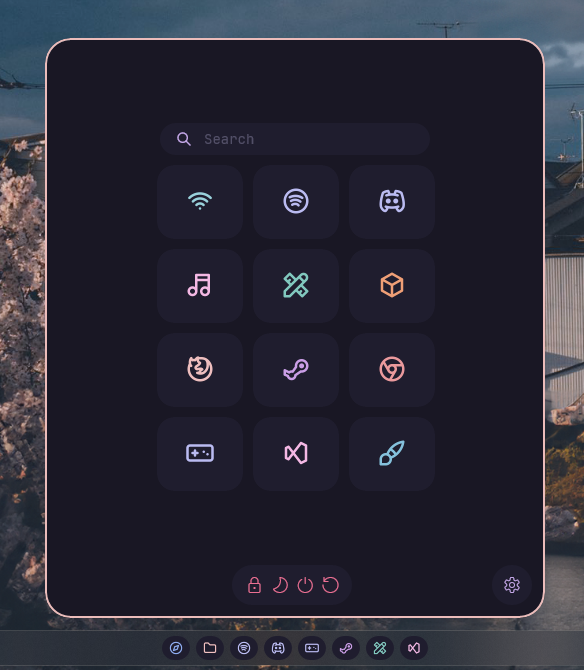

# RosePine theme for Windows 11 Start Menu Styler

A theme using the [RosePine](https://rosepinetheme.com/) color scheme while
keeping the Start menu minimal.

**Author**: [asev](https://github.com/lunar-os)



## Note

Please turn off all user shortcuts (Documents, Downloads, Pictures, etc) except
for settings.

## Theme selection

The theme is integrated into the mod, and can be simply selected from the mod's
settings:

* Open the Windows 11 Start Menu Styler mod in Windhawk.
* Go to the "Settings" tab.
* Select the theme and save the settings.

## Manual installation

The theme styles can also be imported manually. To do that, follow these steps:

* Open the Windows 11 Start Menu Styler mod in Windhawk.
* Go to the "Advanced" tab.
* Copy the content below to the text box under "Mod settings" and click "Save".

<details>
<summary>Content to import (click to expand)</summary>

```json
{
  "controlStyles[0].target": "Windows.UI.Xaml.Controls.Grid#UndockedRoot",
  "controlStyles[0].styles[0]": "Width=350",
  "controlStyles[0].styles[1]": "Margin=0,-40,0,0",
  "controlStyles[1].target": "Windows.UI.Xaml.Controls.Grid#AllAppsRoot",
  "controlStyles[1].styles[0]": "Width=320",
  "controlStyles[1].styles[1]": "Transform3D:=<CompositeTransform3D TranslateX=\"-800\" />",
  "controlStyles[1].styles[2]": "Margin=-30,-60,0,0",
  "controlStyles[2].target": "Windows.UI.Xaml.Controls.Grid#ShowMoreSuggestions",
  "controlStyles[2].styles[0]": "Visibility=Collapsed",
  "controlStyles[3].target": "Windows.UI.Xaml.Controls.Grid#SuggestionsParentContainer",
  "controlStyles[3].styles[0]": "Visibility=Collapsed",
  "controlStyles[4].target": "Windows.UI.Xaml.Controls.Grid#TopLevelSuggestionsListHeader",
  "controlStyles[4].styles[0]": "Visibility=Collapsed",
  "controlStyles[5].target": "StartDocked.SearchBoxToggleButton",
  "controlStyles[5].styles[0]": "Margin=114,53,114,0",
  "controlStyles[5].styles[1]": "Background=#1f1d2e",
  "controlStyles[5].styles[2]": "BorderThickness=0",
  "controlStyles[6].target": "Windows.UI.Xaml.Controls.Grid#TopLevelRoot > Windows.UI.Xaml.Controls.Border",
  "controlStyles[6].styles[0]": "Visibility=Collapsed",
  "controlStyles[7].target": "Windows.UI.Xaml.Controls.Button#CloseAllAppsButton",
  "controlStyles[7].styles[0]": "Visibility=Collapsed",
  "controlStyles[8].target": "StartMenu.PinnedList",
  "controlStyles[8].styles[0]": "Height=340",
  "controlStyles[9].target": "StartDocked.NavigationPaneView#Margin",
  "controlStyles[9].styles[0]": "Margin=210,0,210,0",
  "controlStyles[10].target": "Windows.UI.Xaml.Controls.Border#AcrylicBorder",
  "controlStyles[10].styles[0]": "BorderThickness=1.5",
  "controlStyles[10].styles[1]": "CornerRadius=25",
  "controlStyles[10].styles[2]": "BorderBrush=#ebbcba",
  "controlStyles[10].styles[3]": "Background=#191724",
  "controlStyles[11].target": "StartDocked.StartSizingFramePanel",
  "controlStyles[11].styles[0]": "CornerRadius=25",
  "controlStyles[12].target": "Windows.UI.Xaml.Controls.FontIcon > Windows.UI.Xaml.Controls.Grid > Windows.UI.Xaml.Controls.TextBlock",
  "controlStyles[12].styles[0]": "Foreground=#eb6f92",
  "controlStyles[13].target": "Windows.UI.Xaml.Controls.TextBlock#AppDisplayName",
  "controlStyles[13].styles[0]": "Foreground=#e0def4",
  "controlStyles[14].target": "Windows.UI.Xaml.Controls.TextBlock#DisplayName",
  "controlStyles[14].styles[0]": "Visibility=Collapsed",
  "controlStyles[15].target": "Windows.UI.Xaml.Controls.TextBlock#PinnedListHeaderText",
  "controlStyles[15].styles[0]": "Visibility=Collapsed",
  "controlStyles[16].target": "Windows.UI.Xaml.Controls.TextBlock#AllAppsHeading",
  "controlStyles[16].styles[0]": "Visibility=Collapsed",
  "controlStyles[17].target": "StartDocked.StartSizingFrame",
  "controlStyles[17].styles[0]": "MaxHeight=580",
  "controlStyles[18].target": "Windows.UI.Xaml.Controls.Grid#UserTileIcon",
  "controlStyles[18].styles[0]": "Visibility=Collapsed",
  "controlStyles[19].target": "Windows.UI.Xaml.Controls.Border#AcrylicOverlay",
  "controlStyles[19].styles[0]": "Opacity=0",
  "controlStyles[20].target": "StartMenu.PinnedListTile > Windows.UI.Xaml.Controls.Grid#Root",
  "controlStyles[20].styles[0]": "Padding=0,25,0,0",
  "controlStyles[21].target": "Windows.UI.Xaml.Controls.Grid#DroppedFlickerWorkaroundWrapper > Windows.UI.Xaml.Controls.Border#BackgroundBorder",
  "controlStyles[21].styles[0]": "BorderBrush=#191724",
  "controlStyles[21].styles[1]": "BorderThickness=5",
  "controlStyles[21].styles[2]": "Background=#1f1d2e",
  "controlStyles[21].styles[3]": "CornerRadius=20",
  "controlStyles[22].target": "StartDocked.PowerOptionsView",
  "controlStyles[22].styles[0]": "Margin=-260,0,0,0",
  "controlStyles[23].target": "StartDocked.NavigationPaneButton#PowerButton > Windows.UI.Xaml.Controls.Grid > Windows.UI.Xaml.Controls.Border#BackgroundBorder",
  "controlStyles[23].styles[0]": "Background=#1f1d2e",
  "controlStyles[23].styles[1]": "CornerRadius=20",
  "controlStyles[24].target": "Windows.UI.Xaml.Controls.TextBlock[Text=]",
  "controlStyles[24].styles[0]": "Text=      ",
  "controlStyles[25].target": "StartDocked.NavigationPaneButton#PowerButton",
  "controlStyles[25].styles[0]": "Width=120",
  "controlStyles[26].target": "Windows.UI.Xaml.Controls.Grid#InnerContent > Windows.UI.Xaml.Shapes.Rectangle",
  "controlStyles[26].styles[0]": "Margin=150,53,134,0",
  "controlStyles[27].target": "Windows.UI.Xaml.Controls.TextBlock#PlaceholderText",
  "controlStyles[27].styles[0]": "Text=Search",
  "controlStyles[27].styles[1]": "Foreground=#524f67",
  "controlStyles[27].styles[2]": "FontFamily=JetBrainsMono NF",
  "controlStyles[28].target": "Windows.UI.Xaml.Controls.TextBlock[Text=]",
  "controlStyles[28].styles[0]": "Foreground=#c4a7e7",
  "controlStyles[29].target": "StartDocked.UserTileView",
  "controlStyles[29].styles[0]": "Visibility=Collapsed",
  "controlStyles[30].target": "Windows.UI.Xaml.Controls.Grid#ContentBorder > Windows.UI.Xaml.Controls.Border#BackgroundBorder",
  "controlStyles[30].styles[0]": "Background=#1f1d2e",
  "controlStyles[30].styles[1]": "CornerRadius=20",
  "controlStyles[31].target": "Windows.UI.Xaml.Controls.TextBlock[Text=]",
  "controlStyles[31].styles[0]": "Foreground=#c4a7e7",
  "controlStyles[32].target": "StartDocked.AppListView#NavigationPanePlacesListView",
  "controlStyles[32].styles[0]": "Margin=0,0,-38,0",
  "controlStyles[33].target": "Windows.UI.Xaml.Controls.Border#AppBorder",
  "controlStyles[33].styles[0]": "Background=#191724",
  "controlStyles[33].styles[1]": "BorderThickness=1.5",
  "controlStyles[33].styles[2]": "BorderBrush=#ebbcba",
  "controlStyles[33].styles[3]": "CornerRadius=25",
  "controlStyles[34].target": "Windows.UI.Xaml.Controls.Grid#OuterBorderGrid",
  "controlStyles[34].styles[0]": "CornerRadius=25",
  "controlStyles[35].target": "Windows.UI.Xaml.Controls.Border#TaskbarSearchBackground",
  "controlStyles[35].styles[0]": "BorderThickness=1.5",
  "controlStyles[35].styles[1]": "BorderBrush=#ebbcba",
  "controlStyles[36].target": "StartDocked.LauncherFrame > Grid#RootGrid > Grid#RootContent",
  "controlStyles[36].styles[0]": "MaxWidth=500",
  "controlStyles[36].styles[1]": "Width=500",
  "controlStyles[36].styles[2]": "MinWidth=500",
  "controlStyles[37].target": "StartDocked.StartSizingFramePanel",
  "controlStyles[37].styles[0]": "MaxWidth=500",
  "controlStyles[37].styles[1]": "Width=500",
  "controlStyles[37].styles[2]": "MinWidth=500",
  "controlStyles[38].target": "StartDocked.LauncherFrame > Grid#RootGrid > Grid#RootContent",
  "controlStyles[38].styles[0]": "MaxWidth=500",
  "controlStyles[38].styles[1]": "Width=500",
  "controlStyles[38].styles[2]": "MinWidth=500",
  "controlStyles[39].target": "StartDocked.StartSizingFrame",
  "controlStyles[39].styles[0]": "MinWidth=500",
  "controlStyles[39].styles[1]": "Width=500",
  "controlStyles[39].styles[2]": "MaxWidth=500",
  "controlStyles[40].target": "StartMenu:ExpandedFolderList",
  "controlStyles[40].styles[0]": "Margin=-50,0,-50,0"
}
```
</details>

## Search menu support

This section is only relevant for older versions of Windows 11 Start Menu
Styler. Versions 1.2 and newer automatically apply the styles to the search
menu.

<details>
<summary>Expand</summary>

To add this feature go to Start Menu Styler > **Advanced** > **Custom process
inclusion list**, add `SearchHost.exe` to the process list and click save.


</details>
