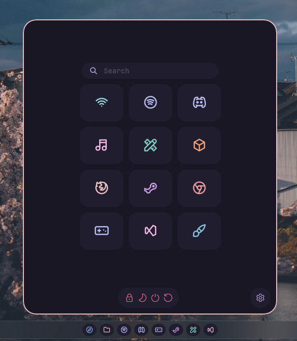
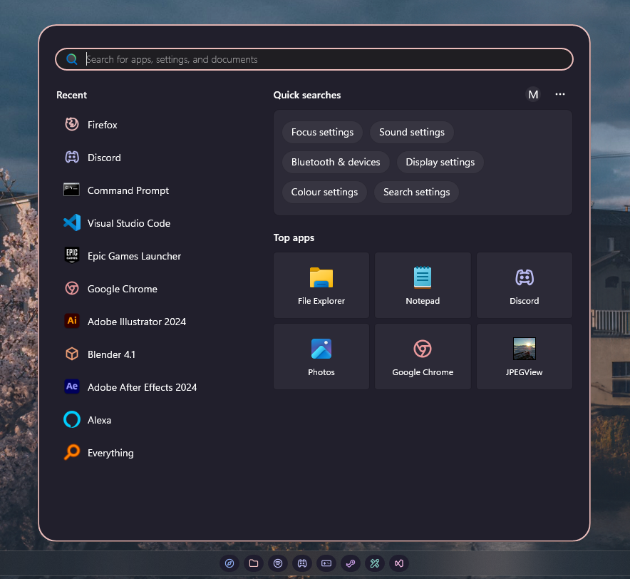

# RosePine theme for Windows 11 Start Menu Styler

A theme using the [RosePine](https://rosepinetheme.com/) color scheme while
keeping the Start menu minimal.

**Author**: [asev](https://github.com/lunar-os)

 \


## Note

Please turn off all user shortcuts (Documents, Downloads, Pictures, etc.) except
for settings.

## Theme selection

The theme is integrated into the mod and can be selected directly from the mod's
settings:

* Open the Windows 11 Start Menu Styler mod in Windhawk.
* Go to the "Settings" tab.
* Select the theme and save the settings.

## Manual installation

The theme styles can also be imported manually. To do that, follow these steps:

* Open the Windows 11 Start Menu Styler mod in Windhawk.
* Go to the "Advanced" tab.
* Copy the content below to the text box under "Mod settings" and click "Save".

### Redesigned Start menu

A variant for the [redesigned Windows 11 Start
menu](https://microsoft.design/articles/start-fresh-redesigning-windows-start-menu/)
that is slowly rolling out in the 25H2 update.

<details>
<summary>Content to import (click to expand)</summary>

```yaml
controlStyles:
  - target: Windows.UI.Xaml.Controls.Grid#ShowMoreSuggestions
    styles:
      - Visibility=Collapsed
  - target: Windows.UI.Xaml.Controls.Grid#TopLevelSuggestionsListHeader
    styles:
      - Visibility=Collapsed
  - target: StartMenu.SearchBoxToggleButton
    styles:
      - Background=#1f1d2e
      - BorderThickness=0
  - target: StartMenu.PinnedList
    styles:
      - Height=340
      - Width=342
  - target: StartDocked.NavigationPaneView#Margin
    styles:
      - Margin=210,0,210,0
  - target: Windows.UI.Xaml.Controls.Border#AcrylicBorder
    styles:
      - BorderThickness=1.5
      - CornerRadius=25
      - BorderBrush=#ebbcba
      - Background=#191724
  - target: StartMenu.StartBlendedFlexFrame
    styles:
      - CornerRadius=25
  - target: Windows.UI.Xaml.Controls.FontIcon > Windows.UI.Xaml.Controls.Grid > Windows.UI.Xaml.Controls.TextBlock
    styles:
      - Foreground=#eb6f92
  - target: Windows.UI.Xaml.Controls.TextBlock#AppDisplayName
    styles:
      - Foreground=#e0def4
  - target: Windows.UI.Xaml.Controls.TextBlock#DisplayName
    styles:
      - Visibility=Collapsed
  - target: Windows.UI.Xaml.Controls.TextBlock#PinnedListHeaderText
    styles:
      - Visibility=Collapsed
  - target: Grid#TopLevelSuggestionsContainer
    styles:
      - Visibility=Collapsed
  - target: Windows.UI.Xaml.Controls.Grid#UserTileIcon
    styles:
      - Visibility=Collapsed
  - target: Windows.UI.Xaml.Controls.Border#AcrylicOverlay
    styles:
      - Opacity=0
  - target: StartMenu.PinnedListTile > Windows.UI.Xaml.Controls.Grid#Root
    styles:
      - Padding=0,25,0,0
  - target: Windows.UI.Xaml.Controls.Grid#DroppedFlickerWorkaroundWrapper > Windows.UI.Xaml.Controls.Border#BackgroundBorder
    styles:
      - BorderBrush=#191724
      - BorderThickness=5
      - Background=#1f1d2e
      - CornerRadius=20
  - target: StartDocked.PowerOptionsView
    styles:
      - Margin=-260,0,0,0
  - target: StartDocked.NavigationPaneButton#PowerButton > Windows.UI.Xaml.Controls.Grid > Windows.UI.Xaml.Controls.Border#BackgroundBorder
    styles:
      - Background=#1f1d2e
      - CornerRadius=20
  - target: Windows.UI.Xaml.Controls.TextBlock[Text=]
    styles:
      - Text=      
  - target: StartDocked.NavigationPaneButton#PowerButton
    styles:
      - Width=120
  - target: Windows.UI.Xaml.Controls.TextBlock#PlaceholderText
    styles:
      - Text=Search
      - Foreground=#524f67
      - FontFamily=JetBrainsMono NF
  - target: Windows.UI.Xaml.Controls.TextBlock[Text=]
    styles:
      - Foreground=#c4a7e7
  - target: StartDocked.UserTileView
    styles:
      - Visibility=Collapsed
  - target: Windows.UI.Xaml.Controls.Grid#ContentBorder > Windows.UI.Xaml.Controls.Border#BackgroundBorder
    styles:
      - Background=#1f1d2e
      - CornerRadius=20
  - target: Windows.UI.Xaml.Controls.TextBlock[Text=]
    styles:
      - Foreground=#c4a7e7
  - target: StartDocked.AppListView#NavigationPanePlacesListView
    styles:
      - Margin=0,0,-38,0
  - target: Windows.UI.Xaml.Controls.Border#AppBorder
    styles:
      - Background=#191724
      - BorderThickness=1.5
      - BorderBrush=#ebbcba
      - CornerRadius=25
  - target: Windows.UI.Xaml.Controls.Grid#OuterBorderGrid
    styles:
      - CornerRadius=25
  - target: Windows.UI.Xaml.Controls.Border#TaskbarSearchBackground
    styles:
      - BorderThickness=1.5
      - BorderBrush=#ebbcba
  - target: StartMenu:ExpandedFolderList
    styles:
      - Margin=-50,0,-50,0
  - target: Windows.UI.Xaml.Controls.GridView#AllAppsGrid > Border > Windows.UI.Xaml.Controls.ScrollViewer > Border > Grid > Windows.UI.Xaml.Controls.ScrollContentPresenter > Windows.UI.Xaml.Controls.ItemsPresenter > Windows.UI.Xaml.Controls.ItemsWrapGrid
    styles:
      - Visibility=Collapsed
  - target: Grid#FrameRoot
    styles:
      - MaxHeight=550
  - target: Grid#MainMenu
    styles:
      - Width=515
  - target: Border#StartDropShadow
    styles:
      - CornerRadius=20
  - target: Grid#TopLevelSuggestionsRoot
    styles:
      - Visibility=Collapsed
  - target: Grid#AllListHeading
    styles:
      - Visibility=Collapsed
  - target: ScrollViewer
    styles:
      - ScrollViewer.VerticalScrollMode=2
  - target: Grid#TopLevelHeader > Grid[2]
    styles:
      - Visibility=Collapsed
  - target: Border#RightCompanionDropShadow
    styles:
      - CornerRadius=25
```
</details>

### Classic Start menu

<details>
<summary>Content to import (click to expand)</summary>

```yaml
controlStyles:
  - target: Windows.UI.Xaml.Controls.Grid#UndockedRoot
    styles:
      - Width=350
      - Margin=0,-40,0,0
  - target: Windows.UI.Xaml.Controls.Grid#AllAppsRoot
    styles:
      - Width=320
      - Transform3D:=<CompositeTransform3D TranslateX="-800" />
      - Margin=-30,-60,0,0
  - target: Windows.UI.Xaml.Controls.Grid#ShowMoreSuggestions
    styles:
      - Visibility=Collapsed
  - target: Windows.UI.Xaml.Controls.Grid#SuggestionsParentContainer
    styles:
      - Visibility=Collapsed
  - target: Windows.UI.Xaml.Controls.Grid#TopLevelSuggestionsListHeader
    styles:
      - Visibility=Collapsed
  - target: StartDocked.SearchBoxToggleButton
    styles:
      - Margin=114,53,114,0
      - Background=#1f1d2e
      - BorderThickness=0
  - target: Windows.UI.Xaml.Controls.Grid#TopLevelRoot > Windows.UI.Xaml.Controls.Border
    styles:
      - Visibility=Collapsed
  - target: Windows.UI.Xaml.Controls.Button#CloseAllAppsButton
    styles:
      - Visibility=Collapsed
  - target: StartMenu.PinnedList
    styles:
      - Height=340
  - target: StartDocked.NavigationPaneView#Margin
    styles:
      - Margin=210,0,210,0
  - target: Windows.UI.Xaml.Controls.Border#AcrylicBorder
    styles:
      - BorderThickness=1.5
      - CornerRadius=25
      - BorderBrush=#ebbcba
      - Background=#191724
  - target: StartDocked.StartSizingFramePanel
    styles:
      - CornerRadius=25
  - target: Windows.UI.Xaml.Controls.FontIcon > Windows.UI.Xaml.Controls.Grid > Windows.UI.Xaml.Controls.TextBlock
    styles:
      - Foreground=#eb6f92
  - target: Windows.UI.Xaml.Controls.TextBlock#AppDisplayName
    styles:
      - Foreground=#e0def4
  - target: Windows.UI.Xaml.Controls.TextBlock#DisplayName
    styles:
      - Visibility=Collapsed
  - target: Windows.UI.Xaml.Controls.TextBlock#PinnedListHeaderText
    styles:
      - Visibility=Collapsed
  - target: Windows.UI.Xaml.Controls.TextBlock#AllAppsHeading
    styles:
      - Visibility=Collapsed
  - target: StartDocked.StartSizingFrame
    styles:
      - MaxHeight=580
  - target: Windows.UI.Xaml.Controls.Grid#UserTileIcon
    styles:
      - Visibility=Collapsed
  - target: Windows.UI.Xaml.Controls.Border#AcrylicOverlay
    styles:
      - Opacity=0
  - target: StartMenu.PinnedListTile > Windows.UI.Xaml.Controls.Grid#Root
    styles:
      - Padding=0,25,0,0
  - target: Windows.UI.Xaml.Controls.Grid#DroppedFlickerWorkaroundWrapper > Windows.UI.Xaml.Controls.Border#BackgroundBorder
    styles:
      - BorderBrush=#191724
      - BorderThickness=5
      - Background=#1f1d2e
      - CornerRadius=20
  - target: StartDocked.PowerOptionsView
    styles:
      - Margin=-260,0,0,0
  - target: StartDocked.NavigationPaneButton#PowerButton > Windows.UI.Xaml.Controls.Grid > Windows.UI.Xaml.Controls.Border#BackgroundBorder
    styles:
      - Background=#1f1d2e
      - CornerRadius=20
  - target: Windows.UI.Xaml.Controls.TextBlock[Text=]
    styles:
      - Text=      
  - target: StartDocked.NavigationPaneButton#PowerButton
    styles:
      - Width=120
  - target: Windows.UI.Xaml.Controls.Grid#InnerContent > Windows.UI.Xaml.Shapes.Rectangle
    styles:
      - Margin=150,53,134,0
  - target: Windows.UI.Xaml.Controls.TextBlock#PlaceholderText
    styles:
      - Text=Search
      - Foreground=#524f67
      - FontFamily=JetBrainsMono NF
  - target: Windows.UI.Xaml.Controls.TextBlock[Text=]
    styles:
      - Foreground=#c4a7e7
  - target: StartDocked.UserTileView
    styles:
      - Visibility=Collapsed
  - target: Windows.UI.Xaml.Controls.Grid#ContentBorder > Windows.UI.Xaml.Controls.Border#BackgroundBorder
    styles:
      - Background=#1f1d2e
      - CornerRadius=20
  - target: Windows.UI.Xaml.Controls.TextBlock[Text=]
    styles:
      - Foreground=#c4a7e7
  - target: StartDocked.AppListView#NavigationPanePlacesListView
    styles:
      - Margin=0,0,-38,0
  - target: Windows.UI.Xaml.Controls.Border#AppBorder
    styles:
      - Background=#191724
      - BorderThickness=1.5
      - BorderBrush=#ebbcba
      - CornerRadius=25
  - target: Windows.UI.Xaml.Controls.Grid#OuterBorderGrid
    styles:
      - CornerRadius=25
  - target: Windows.UI.Xaml.Controls.Border#TaskbarSearchBackground
    styles:
      - BorderThickness=1.5
      - BorderBrush=#ebbcba
  - target: StartDocked.LauncherFrame > Grid#RootGrid > Grid#RootContent
    styles:
      - MaxWidth=500
      - Width=500
      - MinWidth=500
  - target: StartDocked.StartSizingFramePanel
    styles:
      - MaxWidth=500
      - Width=500
      - MinWidth=500
  - target: StartDocked.LauncherFrame > Grid#RootGrid > Grid#RootContent
    styles:
      - MaxWidth=500
      - Width=500
      - MinWidth=500
  - target: StartDocked.StartSizingFrame
    styles:
      - MinWidth=500
      - Width=500
      - MaxWidth=500
  - target: StartMenu:ExpandedFolderList
    styles:
      - Margin=-50,0,-50,0
```
</details>
