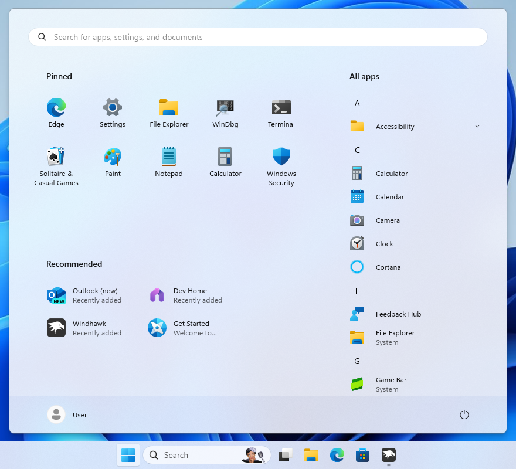

# SideBySide theme for Windows 11 Start Menu Styler

**Author**: kaoshipaws ([https://k4oshi.top/](https://k4oshi.top/))



## Theme selection

The theme is integrated into the mod, and can be simply selected from the mod's
settings:

* Open the Windows 11 Start Menu Styler mod in Windhawk.
* Go to the "Settings" tab.
* Select the theme and save the settings.

## Manual installation

The theme styles can also be imported manually. To do that, follow these steps:

* Open the Windows 11 Start Menu Styler mod in Windhawk.
* Go to the "Advanced" tab.
* Copy the content below to the text box under "Mod settings" and click "Save".

<details>
<summary>Content to import (click to expand)</summary>

```json
{
  "theme": "",
  "controlStyles[0].target": "Grid#UndockedRoot",
  "controlStyles[0].styles[0]": "Visibility=Visible",
  "resourceVariables[0].variableKey": "",
  "resourceVariables[0].value": "",
  "controlStyles[0].styles[1]": "MaxWidth=700",
  "controlStyles[0].styles[2]": "Margin=0,0,300,0",
  "controlStyles[1].target": "Grid#AllAppsRoot",
  "controlStyles[1].styles[0]": "Visibility=Visible",
  "controlStyles[1].styles[1]": "Width=420",
  "controlStyles[1].styles[2]": "Transform3D:=<CompositeTransform3D TranslateX=\"-515\" />",
  "controlStyles[2].target": "Windows.UI.Xaml.Controls.Button#CloseAllAppsButton",
  "controlStyles[2].styles[0]": "Visibility=Collapsed",
  "controlStyles[3].target": "StartDocked.StartSizingFrame",
  "controlStyles[3].styles[0]": "MinWidth=850",
  "controlStyles[3].styles[1]": "MaxWidth=850",
  "controlStyles[4].target": "Windows.UI.Xaml.Controls.Grid#ShowMoreSuggestions",
  "controlStyles[4].styles[0]": "Visibility=Collapsed",
  "controlStyles[5].target": "Windows.UI.Xaml.Controls.Button#ShowAllAppsButton",
  "controlStyles[5].styles[0]": "Visibility=Collapsed",
  "controlStyles[6].target": "Windows.UI.Xaml.Controls.ContentControl",
  "controlStyles[6].styles[0]": "Transform3D:=<CompositeTransform3D TranslateX=\"-32\" />",
  "controlStyles[7].target": "StartDocked.AllAppsGridListView > ScrollViewer > Border > Grid > ScrollContentPresenter > ItemsPresenter > TileGrid",
  "controlStyles[7].styles[0]": "Margin=-20,0,20,0",
  "controlStyles[8].target": "Grid#AllAppsPaneHeader",
  "controlStyles[8].styles[0]": "Transform3D:=<CompositeTransform3D TranslateX=\"-20\" />",
  "controlStyles[9].target": "StartMenu.PinnedList#StartMenuPinnedList",
  "controlStyles[10].target": "Windows.UI.Xaml.Controls.TextBlock#PinnedListHeaderText",
  "controlStyles[10].styles[0]": "Transform3D:=<CompositeTransform3D TranslateX=\"-22\" />",
  "controlStyles[11].target": "Grid#TopLevelSuggestionsListHeader",
  "controlStyles[11].styles[0]": "Transform3D:=<CompositeTransform3D TranslateX=\"-25\" />",
  "controlStyles[6].styles[1]": "Background=Transparent",
  "controlStyles[12].target": "Windows.UI.Xaml.Controls.Primitives.ScrollBar",
  "controlStyles[12].styles[0]": "Margin=0,0,40,0",
  "controlStyles[9].styles[0]": "Margin=-5,0,5,0",
  "controlStyles[13].target": "Windows.UI.Xaml.Controls.Grid#RootGrid",
  "controlStyles[13].styles[0]": "MinWidth=850",
  "controlStyles[13].styles[1]": "MaxWidth=850"
}
```
</details>
