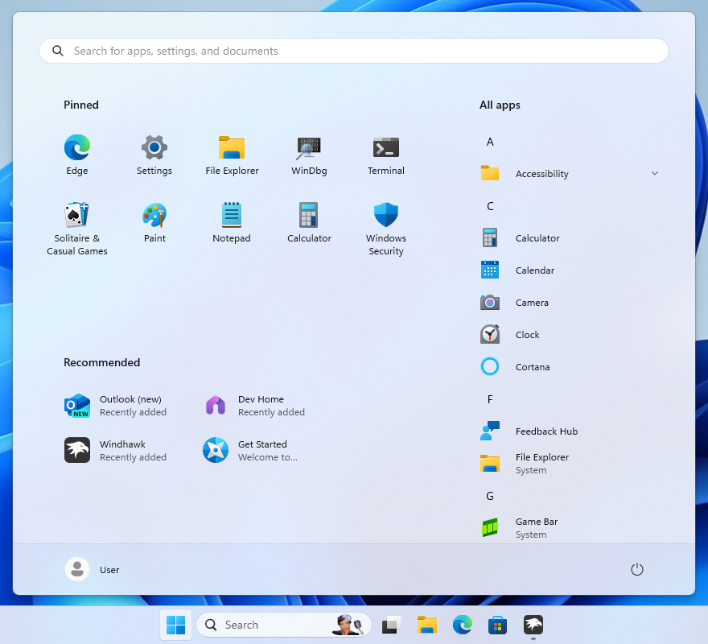

# SideBySide theme for Windows 11 Start Menu Styler

**Author**: [kaoshipaws](https://k4oshi.top/)



## Theme selection

The theme is integrated into the mod and can be selected directly from the mod's
settings:

* Open the Windows 11 Start Menu Styler mod in Windhawk.
* Go to the "Settings" tab.
* Select the theme and save the settings.

## Manual installation

The theme styles can also be imported manually. To do that, follow these steps:

* Open the Windows 11 Start Menu Styler mod in Windhawk.
* Go to the "Advanced" tab.
* Copy the content below to the text box under "Mod settings" and click "Save".

### Redesigned Start menu

A variant for the [redesigned Windows 11 Start
menu](https://microsoft.design/articles/start-fresh-redesigning-windows-start-menu/)
that is slowly rolling out in the 25H2 update.

<details>
<summary>Content to import (click to expand)</summary>

```yaml
controlStyles:
  - target: StartMenu.PinnedList
    styles:
      - MinHeight=420
      - MaxHeight=420
  - target: StartMenu.ExpandedFolderList > Grid > Border
    styles:
      - Margin=-40,0,40,0
      - Width=325
  - target: StartMenu.ExpandedFolderList > Grid > Grid
    styles:
      - CornerRadius=8
      - Margin=-85,0,0,0
      - Width=350
  - target: StartMenu.ExpandedFolderList > Grid > Grid > Microsoft.UI.Xaml.Controls.PipsPager#PinnedListPipsPager
    styles:
      - Margin=-15,0,0,0
  - target: Grid#MainMenu
    styles:
      - Width=825
  - target: Grid#FrameRoot
    styles:
      - Height=825
  - target: Border#AcrylicOverlay
    styles:
      - Margin=0,-70,0,0
  - target: GridView#PinnedList
    styles:
      - MaxWidth=480
      - RenderTransform:=<TranslateTransform X="-145" Y="790"/>
      - MinHeight=420
      - MaxHeight=420
  - target: GridView#AllAppsGrid > Border > ScrollViewer > Border > Grid > ScrollContentPresenter > ItemsPresenter > ItemsWrapGrid
    styles:
      - Width=280
      - Margin=55,12,-55,0
  - target: GridView#AllAppsGrid > Border > ScrollViewer > Border > Grid > ScrollContentPresenter > ItemsPresenter
    styles:
      - RenderTransform:=<TranslateTransform Y="-795"/>
  - target: Microsoft.UI.Xaml.Controls.DropDownButton
    styles:
      - Margin=-60,170,60,-170
      - FontWeight=SemiBold
      - Height=32
      - Width=200
      - Style:=
  - target: Windows.UI.Xaml.Controls.ListView#ZoomedOutListView
    styles:
      - Margin=0,-35,0,35
  - target: TextBlock#PinnedListHeaderText
    styles:
      - Visibility=Visible
      - RenderTransform:=<TranslateTransform X="-4" Y="788.5"/>
      - FontWeight=SemiBold
  - target: StartMenu.StartHome
    styles:
      - RenderTransform:=<TranslateTransform Y="-1"/>
  - target: Windows.UI.Xaml.Controls.Frame > Windows.UI.Xaml.Controls.ContentPresenter
    styles:
      - Margin=0,-15,0,0
  - target: DropDownButton > Grid > ContentPresenter > TextBlock
    styles:
      - MaxLines=2
      - TextLineBounds=0
      - HorizontalAlignment=1
  - target: Grid#TopLevelSuggestionsRoot
    styles:
      - RenderTransform:=<TranslateTransform X="-160" Y="800"/>
      - Width=450
      - MinHeight=129
      - BorderThickness=0,1,0,0
      - BorderBrush=#22BBBBBB
  - target: TextBlock#TopLevelSuggestionsListHeaderText
    styles:
      - RenderTransform:=<TranslateTransform X="-50" />
  - target: Button#ShowMoreSuggestionsButton
    styles:
      - RenderTransform:=<TranslateTransform X="50" />
  - target: GridView#AllAppsGrid > Border > ScrollViewer > Border > Grid > ScrollContentPresenter > ItemsPresenter > ItemsWrapGrid
    styles:
      - Margin=485,175,0,0
  - target: GridView#RecommendedList > Border > ScrollViewer > Border > Grid > ScrollContentPresenter > ItemsPresenter > ItemsWrapGrid > GridViewItem > Border
    styles:
      - MaxWidth=185
      - HorizontalAlignment=2
  - target: Grid#TopLevelSuggestionsContainer
    styles:
      - Width=630
      - Margin=-50,0,0,0
  - target: GridView#RecommendedList > Border > ScrollViewer > Border > Grid > ScrollContentPresenter > ItemsPresenter > ItemsWrapGrid > GridViewItem
    styles:
      - Margin=-25,0,-25,0
  - target: Windows.UI.Xaml.Controls.Primitives.ScrollBar
    styles:
      - Height=650
      - RenderTransform:=<TranslateTransform Y="-50" />
  - target: Grid#MainMenu > Grid#MainContent > Grid
    styles:
      - Canvas.ZIndex=1
  - target: Windows.UI.Xaml.Controls.GridView#PinnedList > Border > Windows.UI.Xaml.Controls.ScrollViewer
    styles:
      - ScrollViewer.VerticalScrollMode=2
```
</details>

### Classic Start menu

<details>
<summary>Content to import (click to expand)</summary>

```yaml
controlStyles:
  - target: Grid#UndockedRoot
    styles:
      - MaxWidth=700
      - Margin=0,0,300,0
  - target: Grid#AllAppsRoot
    styles:
      - Visibility=Visible
      - MinWidth=390
      - Padding=-40,0,110,0
      - Background:=<AcrylicBrush TintColor="{ThemeResource CardStrokeColorDefaultSolid}" FallbackColor="{ThemeResource CardStrokeColorDefaultSolid}" TintOpacity="0" TintLuminosityOpacity="1" Opacity="1"/>
      - Margin=-300,0,745,1
  - target: StartDocked.LauncherFrame > Grid#RootPanel > Grid#RootGrid > Grid#RootContent > Grid#MainContent > Grid#InnerContent > Grid#AllAppsRoot
    styles:
      - Margin=-516,0,745,1
  - target: Windows.UI.Xaml.Controls.Button#CloseAllAppsButton
    styles:
      - Visibility=Collapsed
  - target: StartDocked.StartSizingFrame
    styles:
      - MaxWidth=860
      - Width=860
  - target: StartDocked.LauncherFrame > Grid#RootPanel > Grid#RootGrid
    styles:
      - Width=644
  - target: Windows.UI.Xaml.Controls.Button#ShowAllAppsButton
    styles:
      - Visibility=Collapsed
  - target: Windows.UI.Xaml.Controls.TextBlock#PinnedListHeaderText
    styles:
      - Margin=-22,-5,0,0
  - target: Grid#TopLevelSuggestionsListHeader
    styles:
      - Margin=45,-15,0,0
  - target: StartDocked.AllAppsGridListView > Windows.UI.Xaml.Controls.ScrollViewer > Border > Grid > Windows.UI.Xaml.Controls.Primitives.ScrollBar
    styles:
      - Margin=-8,0,8,2
  - target: Microsoft.UI.Xaml.Controls.PipsPager#PinnedListPipsPager
    styles:
      - Margin=-8,0,8,0
  - target: Windows.UI.Xaml.Controls.ItemsWrapGrid > Windows.UI.Xaml.Controls.GridViewItem
    styles:
      - MaxWidth=185
      - MinWidth=85
  - target: StartMenu.PinnedList#StartMenuPinnedList
    styles:
      - Margin=-15,0,5,0
  - target: Grid#ShowMoreSuggestions
    styles:
      - Margin=0,20,0,-20
  - target: Grid#MoreSuggestionsRoot
    styles:
      - Margin=-1,0,-4,-30
  - target: Windows.UI.Xaml.Controls.TextBlock#MoreSuggestionsListHeaderText
    styles:
      - Margin=-40,0,0,0
  - target: Button#ShowMoreSuggestionsButton
    styles:
      - Margin=0,-58,25,0
  - target: Grid#TopLevelSuggestionsContainer
    styles:
      - Margin=30,-10,30,-60
  - target: Windows.UI.Xaml.Controls.GridViewItem
    styles:
      - Margin=0
  - target: Border#AcrylicOverlay
    styles:
      - Background:=<AcrylicBrush TintColor="{ThemeResource CardStrokeColorDefaultSolid}" FallbackColor="{ThemeResource CardStrokeColorDefaultSolid}" TintOpacity="0.1" TintLuminosityOpacity="1" Opacity="1"/>
  - target: Windows.UI.Xaml.Controls.SemanticZoom#ZoomControl
    styles:
      - IsZoomOutButtonEnabled=true
  - target: Windows.UI.Xaml.Controls.Button#ZoomOutButton > Windows.UI.Xaml.Controls.ContentPresenter#ContentPresenter > Windows.UI.Xaml.Controls.TextBlock
    styles:
      - Text=
  - target: Windows.UI.Xaml.Controls.Button#ZoomOutButton
    styles:
      - Width=24
      - Height=24
      - FontSize=14
      - CornerRadius=4
      - VerticalAlignment=0
      - Margin=-8,-35,8,0
  - target: Border#LayerBorder
    styles:
      - Background:=<AcrylicBrush TintColor="{ThemeResource CardStrokeColorDefaultSolid}" FallbackColor="{ThemeResource CardStrokeColorDefaultSolid}" TintOpacity="0.1" TintLuminosityOpacity="1" Opacity="1"/>
```
</details>

## Removing the "Recommended" section

The "Recommended" section can be removed by following these steps:

* Import [the NoRecommendedSection
  theme](https://github.com/ramensoftware/windows-11-start-menu-styling-guide/blob/main/Themes/NoRecommendedSection/README.md)
  using the **Manual installation** instructions.
* Select this theme using the **Theme selection** instructions on this page.
