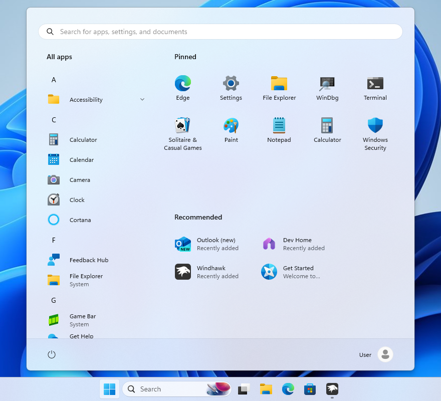

# SideBySide2 theme for Windows 11 Start Menu Styler

**Author**: [Pyxisynth](https://github.com/dreamsynth)



## Theme selection

The theme is integrated into the mod, and can be simply selected from the mod's
settings:

* Open the Windows 11 Start Menu Styler mod in Windhawk.
* Go to the "Settings" tab.
* Select the theme and save the settings.

## Manual installation

The theme styles can also be imported manually. To do that, follow these steps:

* Open the Windows 11 Start Menu Styler mod in Windhawk.
* Go to the "Advanced" tab.
* Copy the content below to the text box under "Mod settings" and click "Save".

<details>
<summary>Content to import (click to expand)</summary>

```json
{
  "resourceVariables[0].variableKey": "",
  "resourceVariables[0].value": "",
  "controlStyles[0].target": "Windows.UI.Xaml.Controls.Grid#UndockedRoot",
  "controlStyles[0].styles[0]": "Visibility=Visible",
  "controlStyles[0].styles[1]": "Width=510",
  "controlStyles[0].styles[2]": "MinHeight=585",
  "controlStyles[0].styles[3]": "Margin=264,0,0,0",
  "controlStyles[1].target": "Windows.UI.Xaml.Controls.Grid#AllAppsRoot",
  "controlStyles[1].styles[0]": "Visibility=Visible",
  "controlStyles[1].styles[1]": "Width=320",
  "controlStyles[1].styles[2]": "Transform3D:=<CompositeTransform3D TranslateX=\"-1060\" />",
  "controlStyles[2].target": "Windows.UI.Xaml.Controls.Button#CloseAllAppsButton",
  "controlStyles[2].styles[0]": "Visibility=1",
  "controlStyles[3].target": "StartDocked.StartSizingFrame",
  "controlStyles[3].styles[0]": "MinWidth=776",
  "controlStyles[3].styles[1]": "MaxWidth=776",
  "controlStyles[4].target": "Windows.UI.Xaml.Controls.Grid#ShowMoreSuggestions",
  "controlStyles[4].styles[0]": "Visibility=0",
  "controlStyles[5].target": "Windows.UI.Xaml.Controls.Button#ShowAllAppsButton",
  "controlStyles[5].styles[0]": "Visibility=1",
  "controlStyles[6].target": "Windows.UI.Xaml.Controls.GridView#RecommendedList > Windows.UI.Xaml.Controls.Border > Windows.UI.Xaml.Controls.ScrollViewer#ScrollViewer > Windows.UI.Xaml.Controls.Border#Root > Windows.UI.Xaml.Controls.Grid > Windows.UI.Xaml.Controls.ScrollContentPresenter#ScrollContentPresenter > Windows.UI.Xaml.Controls.ItemsPresenter > Windows.UI.Xaml.Controls.ItemsWrapGrid > Windows.UI.Xaml.Controls.GridViewItem",
  "controlStyles[6].styles[0]": "MaxWidth=220",
  "controlStyles[6].styles[1]": "MinWidth=220",
  "controlStyles[7].target": "StartDocked.AllAppsGridListView#AppsList",
  "controlStyles[7].styles[0]": "Padding=48,3,-36,16",
  "controlStyles[8].target": "Windows.UI.Xaml.Controls.Grid#AllAppsPaneHeader",
  "controlStyles[8].styles[0]": "Margin=97,0,0,0",
  "controlStyles[9].target": "Windows.UI.Xaml.Controls.Grid#TopLevelSuggestionsContainer",
  "controlStyles[9].styles[0]": "Height=302",
  "controlStyles[10].target": "StartDocked.NavigationPaneView#NavigationPane",
  "controlStyles[10].styles[0]": "FlowDirection=1",
  "controlStyles[10].styles[1]": "Margin=30,0,30,0",
  "controlStyles[11].target": "StartDocked.PowerOptionsView#PowerButton",
  "controlStyles[11].styles[0]": "FlowDirection=0",
  "controlStyles[12].target": "Windows.UI.Xaml.Controls.ItemsStackPanel > Windows.UI.Xaml.Controls.ListViewItem",
  "controlStyles[12].styles[0]": "FlowDirection=0",
  "controlStyles[13].target": "StartDocked.SearchBoxToggleButton#StartMenuSearchBox",
  "controlStyles[13].styles[0]": "Margin=23,1,23,14",
  "controlStyles[14].target": "Windows.UI.Xaml.Controls.TextBlock#NoSuggestionsWithoutSettingsLink",
  "controlStyles[14].styles[0]": "Margin=11,0,48,0",
  "controlStyles[15].target": "StartDocked.LauncherFrame > Windows.UI.Xaml.Controls.Grid#RootGrid > Windows.UI.Xaml.Controls.Grid#RootContent > Windows.UI.Xaml.Controls.Grid#MainContent > Windows.UI.Xaml.Controls.Grid#InnerContent > Windows.UI.Xaml.Shapes.Rectangle",
  "controlStyles[15].styles[0]": "Margin=67,7,0,21",
  "controlStyles[16].target": "Windows.UI.Xaml.Controls.SemanticZoom#ZoomControl",
  "controlStyles[16].styles[0]": "IsZoomOutButtonEnabled=true",
  "controlStyles[17].target": "Windows.UI.Xaml.Controls.Button#ZoomOutButton > Windows.UI.Xaml.Controls.ContentPresenter#ContentPresenter > Windows.UI.Xaml.Controls.TextBlock",
  "controlStyles[17].styles[0]": "Text=",
  "controlStyles[18].target": "Windows.UI.Xaml.Controls.Button#ZoomOutButton",
  "controlStyles[18].styles[0]": "Width=24",
  "controlStyles[18].styles[1]": "Height=24",
  "controlStyles[18].styles[2]": "Margin=0,0,0,0",
  "controlStyles[18].styles[3]": "FontSize=14",
  "controlStyles[18].styles[4]": "CornerRadius=4",
  "controlStyles[19].target": "Windows.UI.Xaml.Controls.ListView#ZoomAppsList",
  "controlStyles[19].styles[0]": "Padding=86,0,25,0",
  "controlStyles[18].styles[5]": "VerticalAlignment=0",
  "controlStyles[18].styles[6]": "Transform3D:=<CompositeTransform3D TranslateX=\"-1\" TranslateY=\"-34\"/>",
  "controlStyles[20].target": "StartMenu.PinnedList#StartMenuPinnedList > Windows.UI.Xaml.Controls.Grid#Root",
  "controlStyles[20].styles[0]": "Padding=0,0,4,0",
  "controlStyles[21].target": "Windows.UI.Xaml.Controls.TextBlock#PinnedListHeaderText",
  "controlStyles[21].styles[0]": "Margin=-32,0,32,0",
  "controlStyles[22].target": "Windows.UI.Xaml.Controls.Grid#TopLevelSuggestionsListHeader",
  "controlStyles[22].styles[0]": "Margin=31,-3,12,0",
  "controlStyles[23].target": "Windows.UI.Xaml.Controls.Grid#NoTopLevelSuggestionsText",
  "controlStyles[23].styles[0]": "Margin=31,0,63,0",
  "controlStyles[24].target": "Windows.UI.Xaml.Controls.Grid#TopLevelSuggestionsContainer",
  "controlStyles[24].styles[0]": "Margin=20,0,0,0",
  "controlStyles[25].target": "Windows.UI.Xaml.Controls.ListView#RecommendedList",
  "controlStyles[25].styles[0]": "Width=490",
  "controlStyles[26].target": "Windows.UI.Xaml.Controls.Button#ShowMoreSuggestionsButton",
  "controlStyles[26].styles[0]": "Margin=0,0,36,2",
  "controlStyles[26].styles[1]": "Height=24",
  "controlStyles[27].target": "Windows.UI.Xaml.Controls.Button#HideMoreSuggestionsButton",
  "controlStyles[27].styles[0]": "Margin=0,0,36,2",
  "controlStyles[27].styles[1]": "Height=24",
  "controlStyles[28].target": "Windows.UI.Xaml.Controls.Grid#MoreSuggestionsRoot > Windows.UI.Xaml.Controls.Grid",
  "controlStyles[28].styles[0]": "Margin=31,-3,0,0",
  "controlStyles[29].target": "Windows.UI.Xaml.Controls.Grid#MoreSuggestionsContainer",
  "controlStyles[29].styles[0]": "Margin=20,0,0,0",
  "controlStyles[30].target": "Windows.UI.Xaml.Controls.ItemsStackPanel > Windows.UI.Xaml.Controls.ListViewItem[MaxHeight=5000]",
  "controlStyles[30].styles[0]": "MaxWidth=460",
  "controlStyles[30].styles[1]": "MinWidth=460",
  "controlStyles[30].styles[2]": "Margin=0,0,16,0",
  "controlStyles[30].styles[3]": "Padding=10,0,14,0",
  "controlStyles[31].target": "Windows.UI.Xaml.Controls.Button#ShowMoreSuggestionsButton > Windows.UI.Xaml.Controls.ContentPresenter#ContentPresenter > Windows.UI.Xaml.Controls.StackPanel > Windows.UI.Xaml.Controls.TextBlock",
  "controlStyles[31].styles[0]": "Margin=0,0,2,0",
  "controlStyles[32].target": "Windows.UI.Xaml.Controls.Button#ShowMoreSuggestionsButton > Windows.UI.Xaml.Controls.ContentPresenter#ContentPresenter > Windows.UI.Xaml.Controls.StackPanel > Windows.UI.Xaml.Controls.FontIcon",
  "controlStyles[32].styles[0]": "FontSize=12",
  "controlStyles[33].target": "Windows.UI.Xaml.Controls.Button#HideMoreSuggestionsButton > Windows.UI.Xaml.Controls.ContentPresenter#ContentPresenter > Windows.UI.Xaml.Controls.StackPanel > Windows.UI.Xaml.Controls.TextBlock",
  "controlStyles[33].styles[0]": "Margin=2,0,0,0",
  "controlStyles[34].target": "Windows.UI.Xaml.Controls.Button#HideMoreSuggestionsButton > Windows.UI.Xaml.Controls.ContentPresenter#ContentPresenter > Windows.UI.Xaml.Controls.StackPanel > Windows.UI.Xaml.Controls.FontIcon",
  "controlStyles[34].styles[0]": "FontSize=12",
  "controlStyles[35].target": "Windows.UI.Xaml.Controls.FlyoutPresenter[1]",
  "controlStyles[35].styles[0]": "Margin=-268,0,0,0",
  "controlStyles[36].target": "Windows.UI.Xaml.Controls.FlyoutPresenter[1] > Grid",
  "controlStyles[36].styles[0]": "Margin=-543,0,543,0",
  "controlStyles[37].target": "Windows.UI.Xaml.Controls.FlyoutPresenter",
  "controlStyles[37].styles[0]": "Margin=-245,-12,0,0"
}
```
</details>
