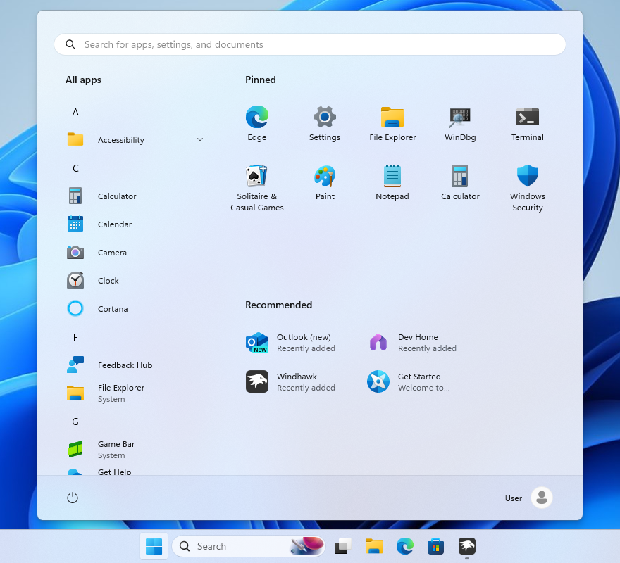

# SideBySide2 theme for Windows 11 Start Menu Styler

**Author**: [Pyxisynth](https://github.com/dreamsynth)



## Theme selection

The theme is integrated into the mod and can be selected directly from the mod's
settings:

* Open the Windows 11 Start Menu Styler mod in Windhawk.
* Go to the "Settings" tab.
* Select the theme and save the settings.

## Manual installation

The theme styles can also be imported manually. To do that, follow these steps:

* Open the Windows 11 Start Menu Styler mod in Windhawk.
* Go to the "Settings" tab and select "Textual mode".
* Copy the content below to the text box and click "Save settings".

### Redesigned Start menu

A variant for the [redesigned Windows 11 Start
menu](https://microsoft.design/articles/start-fresh-redesigning-windows-start-menu/)
that is slowly rolling out in the 25H2 update.

<details>
<summary>Content to import (click to expand)</summary>

```yaml
controlStyles:
  - target: StartDocked.NavigationPaneView#UserControl > Grid#RootPanel
    styles:
      - FlowDirection=1
  - target: StartMenu.PinnedList
    styles:
      - MinHeight=420
      - MaxHeight=420
  - target: StartMenu.ExpandedFolderList > Grid > Border
    styles:
      - Margin=-40,0,40,0
      - Width=325
  - target: StartMenu.ExpandedFolderList > Grid > Grid
    styles:
      - CornerRadius=8
      - Margin=-85,0,0,0
      - Width=350
  - target: StartMenu.ExpandedFolderList > Grid > Grid > Microsoft.UI.Xaml.Controls.PipsPager#PinnedListPipsPager
    styles:
      - Margin=-15,0,0,0
  - target: Grid#MainMenu
    styles:
      - Width=825
  - target: Grid#FrameRoot
    styles:
      - Height=825
  - target: Border#AcrylicOverlay
    styles:
      - Margin=0,-70,0,0
  - target: GridView#PinnedList
    styles:
      - MaxWidth=480
      - RenderTransform:=<TranslateTransform X="345" Y="752"/>
      - MinHeight=420
      - MaxHeight=420
  - target: GridView#AllAppsGrid > Border > ScrollViewer > Border > Grid > ScrollContentPresenter > ItemsPresenter > ItemsWrapGrid
    styles:
      - Width=280
      - Margin=-55,12,55,0
      - //RenderTransform:=<TranslateTransform X="0" Y="740"/>
  - target: GridView#AllAppsGrid > Border > ScrollViewer > Border > Grid > ScrollContentPresenter > ItemsPresenter
    styles:
      - RenderTransform:=<TranslateTransform X="-200" Y="-760"/>
  - target: Microsoft.UI.Xaml.Controls.DropDownButton
    styles:
      - Margin=-390,132,390,-132
      - FontWeight=SemiBold
      - Height=32
      - Width=200
  - target: Windows.UI.Xaml.Controls.ListView#ZoomedOutListView
    styles:
      - Margin=0,-35,0,35
  - target: TextBlock#PinnedListHeaderText
    styles:
      - Visibility=Visible
      - RenderTransform:=<TranslateTransform X="485" Y="753"/>
      - FontWeight=SemiBold
  - target: StartMenu.StartHome
    styles:
      - RenderTransform:=<TranslateTransform Y="-1"/>
  - target: Windows.UI.Xaml.Controls.Frame > Windows.UI.Xaml.Controls.ContentPresenter
    styles:
      - Margin=0,-15,0,0
  - target: DropDownButton > Grid > ContentPresenter > TextBlock
    styles:
      - MaxLines=2
      - TextLineBounds=0
      - HorizontalAlignment=1
  - target: Grid#TopLevelSuggestionsRoot
    styles:
      - RenderTransform:=<TranslateTransform X="360" Y="784"/>
      - Width=450
      - MinHeight=129
      - BorderThickness=0,1,0,0
      - BorderBrush=#22BBBBBB
  - target: TextBlock#TopLevelSuggestionsListHeaderText
    styles:
      - RenderTransform:=<TranslateTransform X="-50" />
  - target: Button#ShowMoreSuggestionsButton
    styles:
      - RenderTransform:=<TranslateTransform X="50" />
  - target: //Grid#TopLevelHeader > Grid[2]
    styles:
      - RenderTransform:=<TranslateTransform X="220" Y="581" />
  - target: GridView#AllAppsGrid > Border > ScrollViewer > Border > Grid > ScrollContentPresenter > ItemsPresenter > ItemsWrapGrid
    styles:
      - RenderTransform:=<TranslateTransform X="-40" />
      - Margin=0,134,0,0
  - target: ScrollViewer
    styles:
      - ScrollViewer.VerticalScrollMode=2
  - target: Windows.UI.Xaml.Controls.ItemsWrapGrid
    styles:
      - MaximumRowsOrColumns=5
  - target: GridView#RecommendedList > Border > ScrollViewer > Border > Grid > ScrollContentPresenter > ItemsPresenter > ItemsWrapGrid > GridViewItem > Border
    styles:
      - MaxWidth=185
      - HorizontalAlignment=2
  - target: Grid#TopLevelSuggestionsContainer
    styles:
      - Width=630
      - Margin=-50,0,0,0
  - target: GridView#RecommendedList > Border > ScrollViewer > Border > Grid > ScrollContentPresenter > ItemsPresenter > ItemsWrapGrid > GridViewItem
    styles:
      - Margin=-25,0,-25,0
  - target: Grid#MainMenu > Grid#MainContent > Grid
    styles:
      - Canvas.ZIndex=1
  - target: Windows.UI.Xaml.Controls.Primitives.ScrollBar
    styles:
      - Height=650
      - RenderTransform:=<TranslateTransform Y="-50" />
```
</details>

### Classic Start menu

<details>
<summary>Content to import (click to expand)</summary>

```yaml
controlStyles:
  - target: Windows.UI.Xaml.Controls.Grid#UndockedRoot
    styles:
      - Visibility=Visible
      - Width=510
      - MinHeight=585
      - Margin=264,0,0,0
  - target: StartDocked.LauncherFrame > Grid#RootPanel > Grid#RootGrid > Grid#RootContent > Grid#MainContent > Grid#InnerContent > Grid#UndockedRoot
    styles:
      - Width=320
  - target: Windows.UI.Xaml.Controls.Grid#AllAppsRoot
    styles:
      - Visibility=Visible
      - Width=320
      - Transform3D:=<CompositeTransform3D TranslateX="-1060" />
  - target: StartDocked.LauncherFrame > Grid#RootPanel > Grid#RootGrid > Grid#RootContent > Grid#MainContent > Grid#InnerContent > Grid#AllAppsRoot
    styles:
      - Transform3D:=<CompositeTransform3D TranslateX="-833" />
      - HorizontalAlignment=Left
  - target: Windows.UI.Xaml.Controls.Button#CloseAllAppsButton
    styles:
      - Visibility=1
  - target: StartDocked.StartSizingFrame
    styles:
      - MinWidth=776
      - MaxWidth=776
  - target: StartDocked.LauncherFrame > Grid#RootPanel > Grid#RootGrid
    styles:
      - Width=560
  - target: StartDocked.LauncherFrame > Grid#RootPanel > Grid#RootGrid > Grid#RootContent
    styles:
      - MinWidth=560
  - target: Windows.UI.Xaml.Controls.Grid#ShowMoreSuggestions
    styles:
      - Visibility=0
  - target: Windows.UI.Xaml.Controls.Button#ShowAllAppsButton
    styles:
      - Visibility=1
  - target: Windows.UI.Xaml.Controls.GridView#RecommendedList > Windows.UI.Xaml.Controls.Border > Windows.UI.Xaml.Controls.ScrollViewer#ScrollViewer > Windows.UI.Xaml.Controls.Border#Root > Windows.UI.Xaml.Controls.Grid > Windows.UI.Xaml.Controls.ScrollContentPresenter#ScrollContentPresenter > Windows.UI.Xaml.Controls.ItemsPresenter > Windows.UI.Xaml.Controls.ItemsWrapGrid > Windows.UI.Xaml.Controls.GridViewItem
    styles:
      - MaxWidth=220
      - MinWidth=220
  - target: StartDocked.AllAppsGridListView#AppsList
    styles:
      - Padding=48,3,-36,16
  - target: Windows.UI.Xaml.Controls.Grid#AllAppsPaneHeader
    styles:
      - Margin=97,0,0,0
  - target: Windows.UI.Xaml.Controls.Grid#TopLevelSuggestionsContainer
    styles:
      - Height=302
  - target: StartDocked.NavigationPaneView#NavigationPane
    styles:
      - FlowDirection=1
      - Margin=30,0,30,0
  - target: StartDocked.PowerOptionsView#PowerButton
    styles:
      - FlowDirection=0
  - target: Windows.UI.Xaml.Controls.ItemsStackPanel > Windows.UI.Xaml.Controls.ListViewItem
    styles:
      - FlowDirection=0
  - target: StartDocked.LauncherFrame > Grid#RootGrid > Grid#RootContent > Grid#MainContent > Grid#InnerContent > StartDocked.SearchBoxToggleButton#StartMenuSearchBox
    styles:
      - Margin=23,1,23,14
  - target: Windows.UI.Xaml.Controls.TextBlock#NoSuggestionsWithoutSettingsLink
    styles:
      - Margin=11,0,48,0
  - target: StartDocked.LauncherFrame > Windows.UI.Xaml.Controls.Grid#RootGrid > Windows.UI.Xaml.Controls.Grid#RootContent > Windows.UI.Xaml.Controls.Grid#MainContent > Windows.UI.Xaml.Controls.Grid#InnerContent > Windows.UI.Xaml.Shapes.Rectangle
    styles:
      - Margin=67,7,0,21
  - target: Windows.UI.Xaml.Controls.SemanticZoom#ZoomControl
    styles:
      - IsZoomOutButtonEnabled=true
  - target: Windows.UI.Xaml.Controls.Button#ZoomOutButton > Windows.UI.Xaml.Controls.ContentPresenter#ContentPresenter > Windows.UI.Xaml.Controls.TextBlock
    styles:
      - Text=
  - target: Windows.UI.Xaml.Controls.Button#ZoomOutButton
    styles:
      - Width=24
      - Height=24
      - Margin=0,0,0,0
      - FontSize=14
      - CornerRadius=4
      - VerticalAlignment=0
      - Transform3D:=<CompositeTransform3D TranslateX="-1" TranslateY="-34"/>
  - target: Windows.UI.Xaml.Controls.ListView#ZoomAppsList
    styles:
      - Padding=86,0,25,0
  - target: StartMenu.PinnedList#StartMenuPinnedList > Windows.UI.Xaml.Controls.Grid#Root
    styles:
      - Padding=0,0,4,0
  - target: Windows.UI.Xaml.Controls.TextBlock#PinnedListHeaderText
    styles:
      - Margin=-32,0,32,0
  - target: Windows.UI.Xaml.Controls.Grid#TopLevelSuggestionsListHeader
    styles:
      - Margin=31,-3,12,0
  - target: Windows.UI.Xaml.Controls.Grid#NoTopLevelSuggestionsText
    styles:
      - Margin=31,0,63,0
  - target: Windows.UI.Xaml.Controls.Grid#TopLevelSuggestionsContainer
    styles:
      - Margin=20,0,0,0
  - target: Windows.UI.Xaml.Controls.ListView#RecommendedList
    styles:
      - Width=490
  - target: Windows.UI.Xaml.Controls.Button#ShowMoreSuggestionsButton
    styles:
      - Margin=0,0,36,2
      - Height=24
  - target: Windows.UI.Xaml.Controls.Button#HideMoreSuggestionsButton
    styles:
      - Margin=0,0,36,2
      - Height=24
  - target: Windows.UI.Xaml.Controls.Grid#MoreSuggestionsRoot > Windows.UI.Xaml.Controls.Grid
    styles:
      - Margin=31,-3,0,0
  - target: Windows.UI.Xaml.Controls.Grid#MoreSuggestionsContainer
    styles:
      - Margin=20,0,0,0
  - target: Windows.UI.Xaml.Controls.ItemsStackPanel > Windows.UI.Xaml.Controls.ListViewItem[MaxHeight=5000]
    styles:
      - MaxWidth=460
      - MinWidth=460
      - Margin=0,0,16,0
      - Padding=10,0,14,0
  - target: Windows.UI.Xaml.Controls.Button#ShowMoreSuggestionsButton > Windows.UI.Xaml.Controls.ContentPresenter#ContentPresenter > Windows.UI.Xaml.Controls.StackPanel > Windows.UI.Xaml.Controls.TextBlock
    styles:
      - Margin=0,0,2,0
  - target: Windows.UI.Xaml.Controls.Button#ShowMoreSuggestionsButton > Windows.UI.Xaml.Controls.ContentPresenter#ContentPresenter > Windows.UI.Xaml.Controls.StackPanel > Windows.UI.Xaml.Controls.FontIcon
    styles:
      - FontSize=12
  - target: Windows.UI.Xaml.Controls.Button#HideMoreSuggestionsButton > Windows.UI.Xaml.Controls.ContentPresenter#ContentPresenter > Windows.UI.Xaml.Controls.StackPanel > Windows.UI.Xaml.Controls.TextBlock
    styles:
      - Margin=2,0,0,0
  - target: Windows.UI.Xaml.Controls.Button#HideMoreSuggestionsButton > Windows.UI.Xaml.Controls.ContentPresenter#ContentPresenter > Windows.UI.Xaml.Controls.StackPanel > Windows.UI.Xaml.Controls.FontIcon
    styles:
      - FontSize=12
  - target: Windows.UI.Xaml.Controls.FlyoutPresenter[1]
    styles:
      - Margin=-268,0,0,0
  - target: Windows.UI.Xaml.Controls.FlyoutPresenter[1] > Grid
    styles:
      - Margin=-543,0,543,0
  - target: Windows.UI.Xaml.Controls.FlyoutPresenter
    styles:
      - Margin=-245,-12,0,0
```
</details>

## Removing the "Recommended" section

The "Recommended" section can be removed by following these steps:

* Import [the NoRecommendedSection
  theme](https://github.com/ramensoftware/windows-11-start-menu-styling-guide/blob/main/Themes/NoRecommendedSection/README.md)
  using the **Manual installation** instructions.
* Select this theme using the **Theme selection** instructions on this page.
