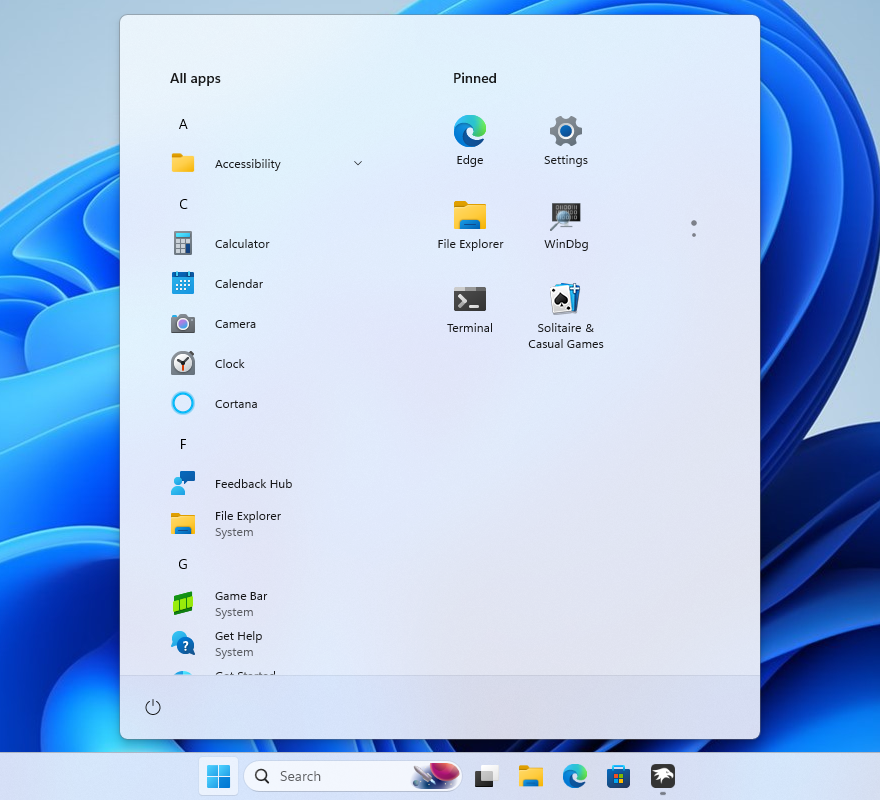

# SideBySideMinimal theme for Windows 11 Start Menu Styler

**Author**: [Olivia](https://github.com/OliviaIsTyping)



## Theme selection

The theme is integrated into the mod and can simply be selected from the mod's
settings:

* Open the Windows 11 Start Menu Styler mod in Windhawk.
* Go to the "Settings" tab.
* Select the theme and save the settings.

## Manual installation

The theme styles can also be imported manually. To do that, follow these steps:

* Open the Windows 11 Start Menu Styler mod in Windhawk.
* Go to the "Advanced" tab.
* Copy the content below to the text box under "Mod settings" and click "Save".

### Redesigned Start menu

A variant for the [redesigned Windows 11 Start menu](https://microsoft.design/articles/start-fresh-redesigning-windows-start-menu/) that is slowly rolling out in the 25H2 update.

<details>
<summary>Content to import (click to expand)</summary>

```json
{
  "controlStyles[0].target": "Windows.UI.Xaml.Controls.Grid#ShowMoreSuggestions",
  "controlStyles[0].styles[0]": "Visibility=Collapsed",
  "controlStyles[1].target": "Windows.UI.Xaml.Controls.Grid#SuggestionsParentContainer",
  "controlStyles[1].styles[0]": "Visibility=Collapsed",
  "controlStyles[2].target": "Windows.UI.Xaml.Controls.Grid#TopLevelSuggestionsListHeader",
  "controlStyles[2].styles[0]": "Visibility=Collapsed",
  "controlStyles[3].target": "StartMenu.SearchBoxToggleButton",
  "controlStyles[3].styles[0]": "Height=0",
  "controlStyles[3].styles[1]": "Width=0",
  "controlStyles[4].target": "StartDocked.PowerOptionsView",
  "controlStyles[4].styles[0]": "Margin=-528,2,0,0",
  "controlStyles[5].target": "StartDocked.UserTileView",
  "controlStyles[5].styles[0]": "Visibility=Collapsed",
  "controlStyles[6].target": "StartMenu.PinnedList",
  "controlStyles[6].styles[0]": "MinHeight=504",
  "controlStyles[7].target": "StartMenu.ExpandedFolderList > Grid > Border",
  "controlStyles[7].styles[0]": "Margin=-40,0,40,0",
  "controlStyles[7].styles[1]": "Width=325",
  "controlStyles[8].target": "StartMenu.ExpandedFolderList > Grid > Grid",
  "controlStyles[8].styles[0]": "CornerRadius=8",
  "controlStyles[8].styles[1]": "Margin=-85,0,0,0",
  "controlStyles[8].styles[2]": "Width=350",
  "controlStyles[9].target": "StartMenu.ExpandedFolderList > Grid > Grid > Microsoft.UI.Xaml.Controls.PipsPager#PinnedListPipsPager",
  "controlStyles[9].styles[0]": "Margin=-15,0,0,0",
  "controlStyles[10].target": "Grid#TopLevelSuggestionsContainer",
  "controlStyles[10].styles[0]": "Visibility=Collapsed",
  "controlStyles[11].target": "Grid#MainMenu",
  "controlStyles[11].styles[0]": "Width=600",
  "controlStyles[12].target": "Grid#FrameRoot",
  "controlStyles[12].styles[0]": "Height=710",
  "controlStyles[13].target": "Border#AcrylicOverlay",
  "controlStyles[13].styles[0]": "Margin=0,-70,0,0",
  "controlStyles[14].target": "GridView#PinnedList",
  "controlStyles[14].styles[0]": "Margin=16,0,-16,0",
  "controlStyles[14].styles[1]": "Width=300",
  "controlStyles[14].styles[2]": "MinHeight=504",
  "controlStyles[15].target": "GridView#AllAppsGrid > Border > ScrollViewer > Border > Grid > ScrollContentPresenter > ItemsPresenter > ItemsWrapGrid",
  "controlStyles[14].styles[3]": "RenderTransform:=<TranslateTransform X=\"270\" Y=\"585\"/>",
  "controlStyles[15].styles[0]": "Width=250",
  "controlStyles[16].styles[0]": "RenderTransform:=<TranslateTransform X=\"-150\" Y=\"-600\"/>",
  "controlStyles[16].target": "GridView#AllAppsGrid > Border > ScrollViewer > Border > Grid > ScrollContentPresenter > ItemsPresenter",
  "controlStyles[17].target": "Microsoft.UI.Xaml.Controls.DropDownButton",
  "controlStyles[17].styles[0]": "Margin=-174,4,174,0",
  "controlStyles[17].styles[1]": "FontWeight=SemiBold",
  "controlStyles[17].styles[2]": "Height=32",
  "controlStyles[17].styles[3]": "Width=250",
  "controlStyles[18].target": "Windows.UI.Xaml.Controls.ListView#ZoomedOutListView",
  "controlStyles[18].styles[0]": "Margin=0,-50,0,50",
  "controlStyles[19].target": "TextBlock#PinnedListHeaderText",
  "controlStyles[19].styles[0]": "Visibility=Visible",
  "controlStyles[19].styles[1]": "RenderTransform:=<TranslateTransform X=\"400\" Y=\"580.5\"/>",
  "controlStyles[19].styles[2]": "FontWeight=SemiBold",
  "controlStyles[20].target": "StartMenu.StartHome",
  "controlStyles[20].styles[0]": "RenderTransform:=<TranslateTransform Y=\"-1\"/>",
  "controlStyles[21].target": "Windows.UI.Xaml.Controls.Frame > Windows.UI.Xaml.Controls.ContentPresenter",
  "controlStyles[21].styles[0]": "Margin=0,-35,0,0",
  "controlStyles[22].target": "DropDownButton > Grid > ContentPresenter > TextBlock",
  "controlStyles[22].styles[0]": "MaxLines=2",
  "controlStyles[22].styles[1]": "TextLineBounds=0",
  "controlStyles[22].styles[2]": "HorizontalAlignment=1",
  "controlStyles[23].target": "Grid#TopLevelSuggestionsRoot",
  "controlStyles[23].styles[0]": "Visibility=Collapsed",
  "controlStyles[17].styles[4]": "Style:=",
  "controlStyles[24].target": "StartMenu.CategoryControl",
  "controlStyles[24].styles[0]": "Margin=20,20,-20,-20"
}
```
</details>

### Classic start menu

<details>
<summary>Content to import (click to expand)</summary>

```json
{
  "controlStyles[0].target": "Windows.UI.Xaml.Controls.Grid#UndockedRoot",
  "controlStyles[0].styles[0]": "Visibility=Visible",
  "controlStyles[0].styles[1]": "Width=348",
  "controlStyles[0].styles[2]": "Margin=132,-42,-132,0",
  "controlStyles[1].target": "Windows.UI.Xaml.Controls.Grid#AllAppsRoot",
  "controlStyles[1].styles[0]": "Visibility=Visible",
  "controlStyles[1].styles[1]": "Width=320",
  "controlStyles[1].styles[2]": "Margin=-830,-42,830,0",
  "controlStyles[2].target": "Windows.UI.Xaml.Controls.Grid#ShowMoreSuggestions",
  "controlStyles[2].styles[0]": "Visibility=Collapsed",
  "controlStyles[3].target": "Windows.UI.Xaml.Controls.Grid#SuggestionsParentContainer",
  "controlStyles[3].styles[0]": "Visibility=Collapsed",
  "controlStyles[4].target": "Windows.UI.Xaml.Controls.Grid#TopLevelSuggestionsListHeader",
  "controlStyles[4].styles[0]": "Visibility=Collapsed",
  "controlStyles[5].target": "StartDocked.SearchBoxToggleButton",
  "controlStyles[5].styles[0]": "Height=0",
  "controlStyles[5].styles[1]": "Width=0",
  "controlStyles[6].target": "Windows.UI.Xaml.Controls.Grid#TopLevelRoot > Windows.UI.Xaml.Controls.Border",
  "controlStyles[6].styles[0]": "Visibility=Collapsed",
  "controlStyles[7].target": "Windows.UI.Xaml.Controls.Button#CloseAllAppsButton",
  "controlStyles[7].styles[0]": "Visibility=Collapsed",
  "controlStyles[8].target": "StartDocked.PowerOptionsView",
  "controlStyles[8].styles[0]": "Margin=-575,0,0,0",
  "controlStyles[9].target": "StartDocked.UserTileView",
  "controlStyles[9].styles[0]": "Visibility=Collapsed",
  "controlStyles[10].target": "StartMenu.PinnedList",
  "controlStyles[10].styles[0]": "Height=504",
  "controlStyles[11].target": "StartMenu.ExpandedFolderList > Grid > Border",
  "controlStyles[11].styles[0]": "Margin=-40,0,40,0",
  "controlStyles[11].styles[1]": "Width=325",
  "controlStyles[12].target": "StartMenu.ExpandedFolderList > Grid > Grid",
  "controlStyles[12].styles[0]": "CornerRadius=8",
  "controlStyles[12].styles[1]": "Margin=-85,0,0,0",
  "controlStyles[12].styles[2]": "Width=350",
  "controlStyles[13].target": "StartMenu.ExpandedFolderList > Grid > Grid > Microsoft.UI.Xaml.Controls.PipsPager#PinnedListPipsPager",
  "controlStyles[13].styles[0]": "Margin=-15,0,0,0",
  "controlStyles[14].target": "Rectangle[4]",
  "controlStyles[14].styles[0]": "Margin=0,-20,0,0",
  "controlStyles[15].target": "Grid#TopLevelSuggestionsContainer",
  "controlStyles[15].styles[0]": "Visibility=Collapsed",
  "controlStyles[16].target": "StartDocked.AppListView",
  "controlStyles[16].styles[0]": "Margin=38,0,-38,0"
}
```
</details>
