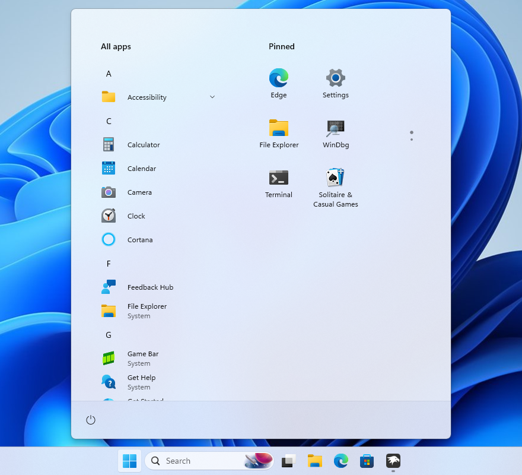

# SideBySideMinimal theme for Windows 11 Start Menu Styler

**Author**: [Olivia](https://github.com/OliviaIsTyping)



## Theme selection

The theme is integrated into the mod and can be selected directly from the mod's
settings:

* Open the Windows 11 Start Menu Styler mod in Windhawk.
* Go to the "Settings" tab.
* Select the theme and save the settings.

## Manual installation

The theme styles can also be imported manually. To do that, follow these steps:

* Open the Windows 11 Start Menu Styler mod in Windhawk.
* Go to the "Settings" tab and select "Textual mode".
* Copy the content below to the text box and click "Save settings".

### Redesigned Start menu

A variant for the [redesigned Windows 11 Start
menu](https://microsoft.design/articles/start-fresh-redesigning-windows-start-menu/)
that is slowly rolling out in the 25H2 update.

<details>
<summary>Content to import (click to expand)</summary>

```yaml
controlStyles:
  - target: Windows.UI.Xaml.Controls.Grid#ShowMoreSuggestions
    styles:
      - Visibility=Collapsed
  - target: Windows.UI.Xaml.Controls.Grid#SuggestionsParentContainer
    styles:
      - Visibility=Collapsed
  - target: Windows.UI.Xaml.Controls.Grid#TopLevelSuggestionsListHeader
    styles:
      - Visibility=Collapsed
  - target: StartMenu.SearchBoxToggleButton
    styles:
      - Height=0
      - Width=0
  - target: StartDocked.PowerOptionsView
    styles:
      - Margin=-528,2,0,0
  - target: StartDocked.UserTileView
    styles:
      - Visibility=Collapsed
  - target: StartMenu.PinnedList
    styles:
      - MinHeight=504
      - MaxHeight=504
  - target: StartMenu.ExpandedFolderList > Grid > Border
    styles:
      - Margin=-40,0,40,0
      - Width=325
  - target: StartMenu.ExpandedFolderList > Grid > Grid
    styles:
      - CornerRadius=8
      - Margin=-85,0,0,0
      - Width=350
  - target: StartMenu.ExpandedFolderList > Grid > Grid > Microsoft.UI.Xaml.Controls.PipsPager#PinnedListPipsPager
    styles:
      - Margin=-15,0,0,0
  - target: Grid#TopLevelSuggestionsContainer
    styles:
      - Visibility=Collapsed
  - target: Grid#MainMenu
    styles:
      - Width=600
  - target: Grid#FrameRoot
    styles:
      - Height=710
  - target: Border#AcrylicOverlay
    styles:
      - Margin=0,-70,0,0
  - target: GridView#PinnedList
    styles:
      - Margin=16,0,-16,0
      - Width=300
      - MinHeight=504
      - RenderTransform:=<TranslateTransform X="270" Y="585"/>
  - target: GridView#AllAppsGrid > Border > ScrollViewer > Border > Grid > ScrollContentPresenter > ItemsPresenter > ItemsWrapGrid
    styles:
      - Width=250
  - target: GridView#AllAppsGrid > Border > ScrollViewer > Border > Grid > ScrollContentPresenter > ItemsPresenter
    styles:
      - RenderTransform:=<TranslateTransform X="-150" Y="-600"/>
  - target: Microsoft.UI.Xaml.Controls.DropDownButton
    styles:
      - Margin=-174,4,174,0
      - FontWeight=SemiBold
      - Height=32
      - Width=250
      - Style:=
  - target: Windows.UI.Xaml.Controls.ListView#ZoomedOutListView
    styles:
      - Margin=0,-50,0,50
  - target: TextBlock#PinnedListHeaderText
    styles:
      - Visibility=Visible
      - RenderTransform:=<TranslateTransform X="400" Y="580.5"/>
      - FontWeight=SemiBold
  - target: StartMenu.StartHome
    styles:
      - RenderTransform:=<TranslateTransform Y="-1"/>
  - target: Windows.UI.Xaml.Controls.Frame > Windows.UI.Xaml.Controls.ContentPresenter
    styles:
      - Margin=0,-35,0,0
  - target: DropDownButton > Grid > ContentPresenter > TextBlock
    styles:
      - MaxLines=2
      - TextLineBounds=0
      - HorizontalAlignment=1
  - target: Grid#TopLevelSuggestionsRoot
    styles:
      - Visibility=Collapsed
  - target: StartMenu.CategoryControl
    styles:
      - Margin=20,20,-20,-20
  - target: Grid#MainMenu > Grid#MainContent > Grid
    styles:
      - Canvas.ZIndex=1
  - target: StartDocked.AppListView
    styles:
      - Margin=25,0,-25,0
```
</details>

### Classic Start menu

<details>
<summary>Content to import (click to expand)</summary>

```yaml
controlStyles:
  - target: Windows.UI.Xaml.Controls.Grid#UndockedRoot
    styles:
      - Visibility=Visible
      - Width=348
      - Margin=132,-42,-132,0
  - target: Windows.UI.Xaml.Controls.Grid#AllAppsRoot
    styles:
      - Visibility=Visible
      - Width=320
      - Margin=-830,-42,830,0
  - target: StartDocked.LauncherFrame > Grid#RootPanel > Grid#RootGrid > Grid#RootContent > Grid#MainContent > Grid#InnerContent > Grid#AllAppsRoot
    styles:
      - Margin=-1046,-42,1046,0
  - target: Windows.UI.Xaml.Controls.Grid#ShowMoreSuggestions
    styles:
      - Visibility=Collapsed
  - target: Windows.UI.Xaml.Controls.Grid#SuggestionsParentContainer
    styles:
      - Visibility=Collapsed
  - target: Windows.UI.Xaml.Controls.Grid#TopLevelSuggestionsListHeader
    styles:
      - Visibility=Collapsed
  - target: StartDocked.SearchBoxToggleButton
    styles:
      - Height=0
      - Width=0
  - target: Windows.UI.Xaml.Controls.Grid#TopLevelRoot > Windows.UI.Xaml.Controls.Border
    styles:
      - Visibility=Collapsed
  - target: Windows.UI.Xaml.Controls.Button#CloseAllAppsButton
    styles:
      - Visibility=Collapsed
  - target: StartDocked.PowerOptionsView
    styles:
      - Margin=-575,0,0,0
  - target: StartDocked.UserTileView
    styles:
      - Visibility=Collapsed
  - target: StartMenu.PinnedList
    styles:
      - Height=504
  - target: StartMenu.ExpandedFolderList > Grid > Border
    styles:
      - Margin=-40,0,40,0
      - Width=325
  - target: StartMenu.ExpandedFolderList > Grid > Grid
    styles:
      - CornerRadius=8
      - Margin=-85,0,0,0
      - Width=350
  - target: StartMenu.ExpandedFolderList > Grid > Grid > Microsoft.UI.Xaml.Controls.PipsPager#PinnedListPipsPager
    styles:
      - Margin=-15,0,0,0
  - target: Rectangle[4]
    styles:
      - Margin=0,-20,0,0
  - target: Grid#TopLevelSuggestionsContainer
    styles:
      - Visibility=Collapsed
  - target: StartDocked.AppListView
    styles:
      - Margin=38,0,-38,0
```
</details>
