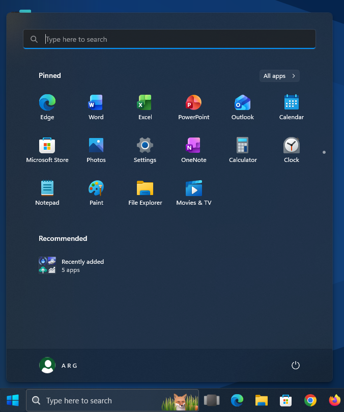
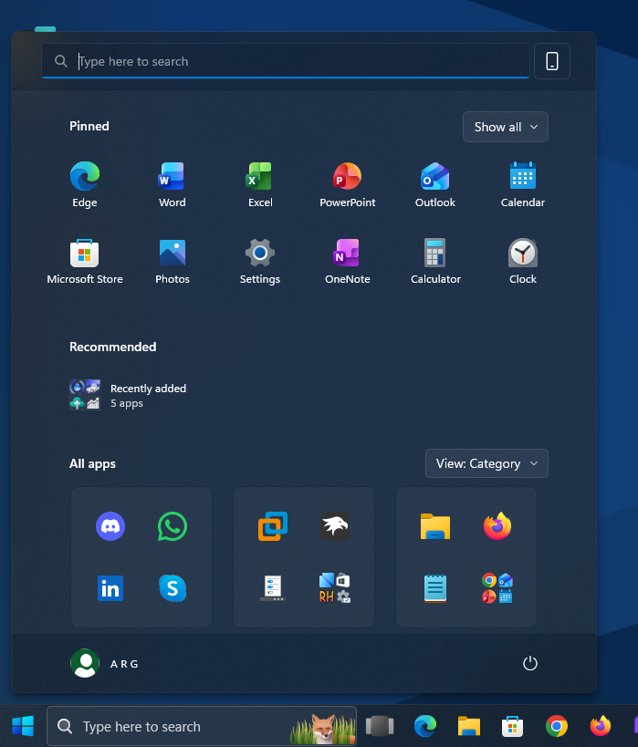

# Sun Valley Start & Search theme for Windows 11 Start Menu Styler

This theme tries to recreate the design that the Windows 11 Start menu and search menu had on early Windows 11 builds,
which included:
* 22000.51's searchbox
* Changed 'All' to 'All apps' as it was on older Windows 11 builds
* 21370-22000.9-like Acrylic
* Accent color & light/dark mode support
* New Windows 11 Start Menu support

**Author**: [Tails](https://github.com/milestprower92)

## Old Windows 11 Start Menu:

## New Windows 11 Start Menu

## Search Menu


## Theme selection

The theme is integrated into the mod and can simply be selected from the mod's
settings:

* Open the Windows 11 Start Menu Styler mod in Windhawk.
* Go to the "Settings" tab.
* Select the theme and save the settings.

## Manual installation

The theme styles can also be imported manually. To do that, follow these steps:

* Open the Windows 11 Start Menu Styler mod in Windhawk.
* Go to the "Advanced" tab.
* Copy the content below to the text box under "Mod settings" and click "Save".

<details>
<summary>Content to import (click to expand)</summary>

```json
{
"controlStyles[0].target":"Border#TaskbarSearchBackground",
"controlStyles[0].styles[0]":"CornerRadius=4",
"controlStyles[0].styles[1]":"BorderThickness=1",
"controlStyles[0].styles[2]":"BorderBrush:=<AcrylicBrush TintColor=\"{ThemeResource SystemChromeHighColor}\" FallbackColor=\"{ThemeResource SystemChromeMediumHighColor}\" TintOpacity=\"0\" />",
"controlStyles[1].target":"StartDocked.SearchBoxToggleButton > Grid > ContentPresenter > TextBlock#PlaceholderText",
"controlStyles[1].styles[0]":"Margin=28,0,0,0",
"controlStyles[1].styles[1]":"Text=Type here to search",
"controlStyles[2].target":"StartDocked.SearchBoxToggleButton#StartMenuSearchBox > Grid > Border#BorderElement",
"controlStyles[2].styles[0]":"BorderThickness=0,0,0,2",
"controlStyles[2].styles[1]":"BorderBrush:=<SolidColorBrush Color=\"{ThemeResource SystemAccentColorLight1}\" />",
"controlStyles[3].target":"FontIcon#SearchGlyph",
"controlStyles[3].styles[0]":"Foreground:=<SolidColorBrush Color=\"{ThemeResource SystemBaseMediumLowColor}\" />",
"controlStyles[3].styles[1]":"Margin=13,0,-13,1",
"controlStyles[3].styles[2]":"Visibility=Visible",
"controlStyles[4].target":"Microsoft.UI.Xaml.Controls.AnimatedIcon#SearchIconPlayer",
"controlStyles[4].styles[0]":"Visibility=1",
"controlStyles[4].styles[1]":"FlowDirection=1",
"controlStyles[5].target":"FontIcon#SearchBoxOnTaskbarSearchGlyph",
"controlStyles[5].styles[0]":"Visibility=0",
"controlStyles[5].styles[1]":"Foreground:=<SolidColorBrush Color=\"{ThemeResource SystemBaseMediumLowColor}\" />",
"controlStyles[5].styles[2]":"FlowDirection=1",
"controlStyles[5].styles[3]":"FontFamily=Segoe Fluent Icons",
"controlStyles[5].styles[4]":"FontSize=17",
"controlStyles[5].styles[5]":"Transform3D:=<CompositeTransform3D TranslateX=\"5\"  TranslateY=\"1\" />",
"controlStyles[6].target":"StartDocked.SearchBoxToggleButton#StartMenuSearchBox > Grid",
"controlStyles[6].styles[0]":"BorderBrush:=<AcrylicBrush TintColor=\"{ThemeResource SystemChromeHighColor}\" FallbackColor=\"{ThemeResource SystemChromeMediumHighColor}\" TintOpacity=\"0\" />",
"controlStyles[6].styles[1]":"CornerRadius=4",
"controlStyles[6].styles[2]":"BorderThickness=1",
"controlStyles[7].target":"Cortana.UI.Views.RichSearchBoxControl#SearchBoxControl > Grid#RootGrid",
"controlStyles[7].styles[0]":"CornerRadius=4",
"controlStyles[7].styles[1]":"BorderBrush:=<SolidColorBrush Color=\"{ThemeResource SystemAccentColorLight1}\" />",
"controlStyles[7].styles[2]":"BorderThickness=0,0,0,2",
"controlStyles[7].styles[3]":"Margin=0,0,0,0",
"controlStyles[7].styles[4]":"Transform3D:=<CompositeTransform3D TranslateY=\"2\" />",
"controlStyles[8].target":"StartDocked.SearchBoxToggleButton",
"controlStyles[8].styles[0]":"CornerRadius=4",
"controlStyles[8].styles[1]":"Height=40",
"controlStyles[9].target":"Windows.UI.Xaml.Controls.Grid#SearchBoxOnTaskbarGleamContainer",
"controlStyles[9].styles[0]":"CornerRadius=4",
"controlStyles[10].target":"Windows.UI.Xaml.Controls.Grid#SearchBoxOnTaskbarGleamImageContainer",
"controlStyles[10].styles[0]":"CornerRadius=4",
"controlStyles[10].styles[1]":"Transform3D:=<CompositeTransform3D TranslateY=\"0\" />",
"controlStyles[11].target":"Windows.UI.Xaml.Controls.Button#ShowAllAppsButton > Windows.UI.Xaml.Controls.ContentPresenter#ContentPresenter > Windows.UI.Xaml.Controls.StackPanel > Windows.UI.Xaml.Controls.TextBlock#ShowAllAppsButtonText",
"controlStyles[11].styles[0]":"Text=All apps",
"controlStyles[12].target":"Windows.UI.Xaml.Controls.TextBlock#AllAppsHeading",
"controlStyles[12].styles[0]":"Text=All apps",
"controlStyles[13].target":"Cortana.UI.Views.HostedWebViewControl#QueryFormulationHostedWebView",
"controlStyles[13].styles[0]":"Background:=<AcrylicBrush TintColor=\"{ThemeResource SystemChromeMediumColor}\" TintOpacity=\"0.76\" TintLuminosityOpacity=\"0.76\" FallbackColor=\"{ThemeResource SystemChromeLowColor}\" />",
"controlStyles[14].target":"Windows.UI.Xaml.Controls.Grid#QueryFormulationRoot",
"controlStyles[14].styles[0]":"CornerRadius=10",
"controlStyles[15].target":"Windows.UI.Xaml.Controls.Border#AcrylicBorder",
"controlStyles[15].styles[0]":"Opacity=0.5",
"controlStyles[16].target":"Windows.UI.Xaml.Controls.Grid#MainContent",
"controlStyles[16].styles[0]":"Background:=<AcrylicBrush TintColor=\"{ThemeResource SystemChromeMediumColor}\" TintOpacity=\"0\" TintLuminosityOpacity=\"0.5\" FallbackColor=\"{ThemeResource SystemChromeLowColor}\" />",
"controlStyles[16].styles[1]":"CornerRadius=7",
"controlStyles[17].target":"Windows.UI.Xaml.Controls.Border#AppBorder",
"controlStyles[17].styles[0]":"Background:=<AcrylicBrush TintColor=\"{ThemeResource SystemChromeMediumColor}\" TintOpacity=\"0\" TintLuminosityOpacity=\"0.7\" FallbackColor=\"{ThemeResource SystemChromeLowColor}\" />",
"controlStyles[18].target":"Border#FullBleedBackground",
"controlStyles[18].styles[0]":"Background:=<AcrylicBrush TintColor=\"{ThemeResource SystemChromeMediumColor}\" TintOpacity=\"0.76\" TintLuminosityOpacity=\"0.77\" FallbackColor=\"{ThemeResource SystemChromeLowColor}\" />",
"controlStyles[19].target":"Image#SearchIconOn",
"controlStyles[19].styles[0]":"Visibility=Collapsed",
"controlStyles[20].target":"Image#SearchIconOff",
"controlStyles[20].styles[0]":"Visibility=Collapsed",
"controlStyles[21].target":"StartMenu.SearchBoxToggleButton#SearchBoxToggleButton > Grid > Border",
"controlStyles[21].styles[0]":"CornerRadius=4",
"controlStyles[21].styles[1]":"BorderThickness=0,0,0,2",
"controlStyles[21].styles[2]":"BorderBrush:=<SolidColorBrush Color=\"{ThemeResource SystemAccentColor}\"/>",
"controlStyles[21].styles[3]":"Background:=<AcrylicBrush TintColor=\"{ThemeResource SystemChromeMediumColor}\" TintOpacity=\"0\" TintLuminosityOpacity=\"0.7\" FallbackColor=\"{ThemeResource SystemChromeMediumColor}\" />",
"controlStyles[22].target":"Windows.UI.Xaml.Controls.TextBlock#AllListHeadingText",
"controlStyles[22].styles[0]":"Text=All apps",
"controlStyles[23].target":"Microsoft.UI.Xaml.Controls.DropDownButton > Grid@CommonStates",
"controlStyles[23].styles[0]":"Background@Normal:=<AcrylicBrush TintColor=\"{ThemeResource SystemChromeMediumHighColor}\" FallbackColor=\"{ThemeResource SystemChromeMediumHighColor}\" TintOpacity=\"0\" TintLuminosityOpacity=\"1\" />",
"controlStyles[23].styles[1]":"BorderBrush:=<AcrylicBrush TintColor=\"{ThemeResource SystemChromeHighColor}\" FallbackColor=\"{ThemeResource SystemChromeMediumHighColor}\" TintOpacity=\"0\" />",
"controlStyles[23].styles[2]":"BorderThickness=1",
"controlStyles[24].target":"StartMenu.SearchBoxToggleButton > Grid > ContentPresenter > TextBlock#PlaceholderText",
"controlStyles[24].styles[0]":"Text=Type here to search",
"controlStyles[24].styles[1]":"Margin=24,0,0,0",
"controlStyles[25].target":"StartMenu.SearchBoxToggleButton#SearchBoxToggleButton",
"controlStyles[25].styles[0]":"Height=40",
"controlStyles[26].target":"StartMenu.SearchBoxToggleButton > Grid > Rectangle#TextCaret",
"controlStyles[26].styles[0]":"Margin=24,0,0,0",
"controlStyles[27].target":"Cortana.UI.Views.CortanaRichSearchBox > Grid > Windows.UI.Xaml.Controls.TextBlock#PlaceholderTextContentPresenter",
"controlStyles[27].styles[0]":"Text=Type here to search",
"controlStyles[27].styles[1]":"Width=750",
"controlStyles[27].styles[2]":"TextAlignment=Left",
"controlStyles[27].styles[3]":"Transform3D:=<CompositeTransform3D TranslateY=\"0\" />",
"controlStyles[28].styles[0]":"Transform3D:=<CompositeTransform3D TranslateY=\"3\" />",
"controlStyles[28].target":"Border#TaskbarSearchBackground",
"controlStyles[29].target":"StartMenu.SearchBoxToggleButton > Grid",
"controlStyles[29].styles[0]":"BorderThickness=1",
"controlStyles[29].styles[1]":"BorderBrush:=<AcrylicBrush TintColor=\"{ThemeResource SystemChromeHighColor}\" FallbackColor=\"{ThemeResource SystemChromeMediumHighColor}\" TintOpacity=\"0\" />",
"controlStyles[29].styles[2]":"CornerRadius=4",
"controlStyles[30].target":"Grid#TopLevelHeader > Grid > Button > Grid@CommonStates",
"controlStyles[30].styles[0]":"Background@Normal:=<AcrylicBrush TintColor=\"{ThemeResource SystemChromeMediumHighColor}\" FallbackColor=\"{ThemeResource SystemChromeMediumHighColor}\" TintOpacity=\"0\" TintLuminosityOpacity=\"1\" />",
"controlStyles[30].styles[1]":"BorderBrush:=<AcrylicBrush TintColor=\"{ThemeResource SystemChromeHighColor}\" FallbackColor=\"{ThemeResource SystemChromeMediumHighColor}\" TintOpacity=\"0\" />",
"controlStyles[30].styles[2]":"BorderThickness=1",
"controlStyles[30].styles[3]":"CornerRadius=5",
"controlStyles[31].target":"Windows.UI.Xaml.Controls.Primitives.ToggleButton#ShowHideCompanion > Border",
"controlStyles[31].styles[0]":"BorderBrush:=<AcrylicBrush TintColor=\"{ThemeResource SystemChromeHighColor}\" FallbackColor=\"{ThemeResource SystemChromeMediumHighColor}\" TintOpacity=\"0\" />",
"controlStyles[31].styles[1]":"BorderThickness=1",
"controlStyles[31].styles[2]":"CornerRadius=5",
"controlStyles[32].target":"Windows.UI.Xaml.Controls.Primitives.ToggleButton#ShowHideCompanion > Border > ContentPresenter",
"controlStyles[32].styles[0]":"Height=40",
"controlStyles[32].styles[1]":"Width=40",
"controlStyles[33].target":"Windows.UI.Xaml.Controls.Primitives.ToggleButton#ShowHideCompanion",
"controlStyles[33].styles[0]":"Height=40",
"controlStyles[33].styles[1]":"Width=40",
"controlStyles[34].target":"Windows.UI.Xaml.Controls.Primitives.ToggleButton#ShowHideCompanion > Border > ContentPresenter > FontIcon > Grid > TextBlock",
"controlStyles[34].styles[0]":"FontSize=20",
"controlStyles[35].target":"Cortana.UI.Views.HostedWebView2Control#QueryFormulationHostedWebView2 > Grid",
"controlStyles[35].styles[0]":"Background:=<AcrylicBrush TintColor=\"{ThemeResource SystemChromeMediumColor}\" TintOpacity=\"0.46\" TintLuminosityOpacity=\"0.46\" FallbackColor=\"{ThemeResource SystemChromeLowColor}\" />"
}
```
</details>
