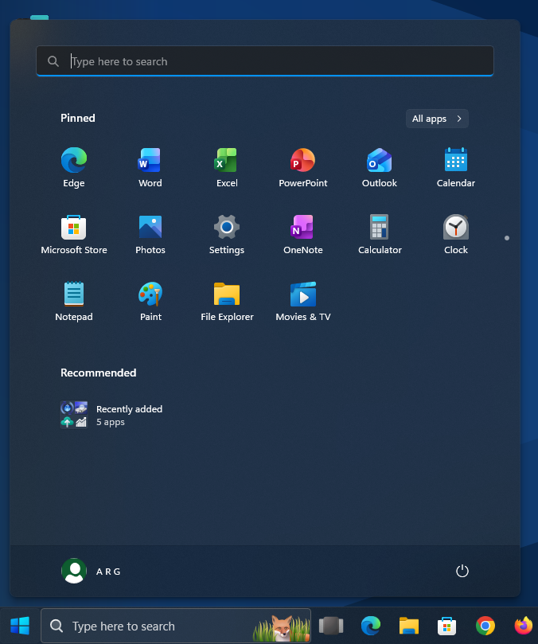
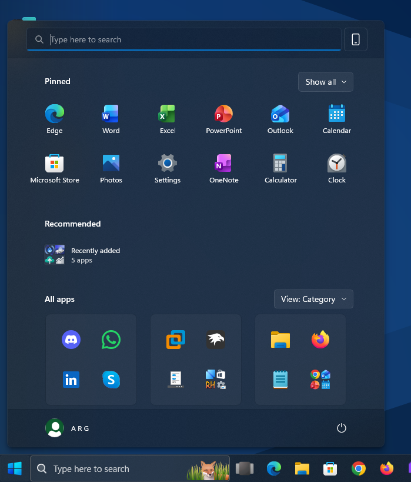
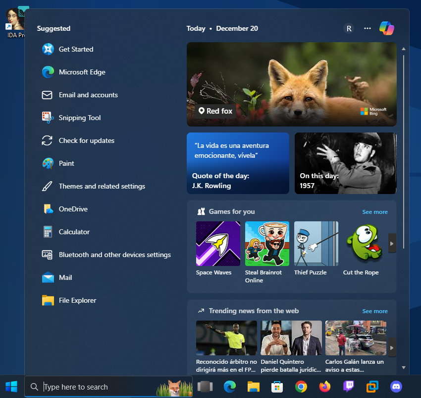
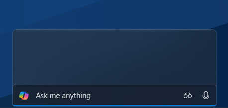

# SunValley theme for Windows 11 Start Menu Styler

This theme tries to recreate the design that the Windows 11 Start menu and search menu had on early Windows 11 builds,
which included:
* 22000.51's searchbox
* Changed 'All' to 'All apps' as it was on older Windows 11 builds
* Custom Acrylic + Accent color & light/dark mode support
* New Windows 11 Start Menu support
* Windows 10-like search menu (to adapt to the [SunValley Taskbar theme](https://github.com/ramensoftware/windows-11-taskbar-styling-guide/blob/main/Themes/SunValley/README.md))
* Support for the new Copilot Search Menu

**Author**: [Tails](https://github.com/milestprower92)

## Screenshots
### Old Windows 11 Start Menu:

### New Windows 11 Start Menu

### Search Menu

### Copilot Search Menu


## Theme selection

The theme is integrated into the mod and can be selected directly from the mod's
settings:

* Open the Windows 11 Start Menu Styler mod in Windhawk.
* Go to the "Settings" tab.
* Select the theme and save the settings.

## Manual installation

The theme styles can also be imported manually. To do that, follow these steps:

* Open the Windows 11 Start Menu Styler mod in Windhawk.
* Go to the "Settings" tab and select "Textual mode".
* Copy the content below to the text box and click "Save settings".

<details>
<summary>Content to import (click to expand)</summary>

```yaml
controlStyles:
  - target: Cortana.UI.Views.TaskbarSearchPage
    styles:
      - Margin=-2,0,0,0
  - target: Border#TaskbarMargin
    styles:
      - Visibility=1
  - target: Border#TaskbarSearchBackground
    styles:
      - Grid.Row=3
      - Margin=0,0,0,2
      - Background:=<AcrylicBrush TintColor="{ThemeResource SystemChromeAltHighColor}" TintOpacity="0.6" TintLuminosityOpacity="0.6" FallbackColor="{ThemeResource SystemChromeMediumColor}" />
      - Height=44
      - VerticalAlignment=2
      - CornerRadius=0,0,7,7
      - BorderThickness=0,0,1,1
  - target: Cortana.UI.Views.RichSearchBoxControl#SearchBoxControl
    styles:
      - Margin=0,0,0,2
      - Grid.Row=3
      - Height=44
      - VerticalAlignment=2
      - HorizontalAlignment=0
      - Width=340
  - target: ScrollViewer > ScrollContentPresenter > Border
    styles:
      - Margin=0,0,0,0
  - target: Cortana.UI.Views.RichSearchBoxControl#SearchBoxControl > Grid@SearchBoxStates
    styles:
      - Background:=<AcrylicBrush TintColor="{ThemeResource SystemChromeMediumHighColor}" TintOpacity="0" TintLuminosityOpacity="1" FallbackColor="{ThemeResource SystemChromeMediumColor}" />
      - BorderThickness=1
      - BorderBrush:=<SolidColorBrush Color="{ThemeResource SystemBaseHighColor}" Opacity="0.2" />
      - CornerRadius=4
  - target: Microsoft.UI.Xaml.Controls.AnimatedIcon#SearchIconPlayer
    styles:
      - Visibility=Collapsed
  - target: Button#SearchGlyphContainer
    styles:
      - Visibility=Visible
      - Width=35
      - Margin=2,0,-11,0
  - target: Button#SearchGlyphContainer > Grid > ContentPresenter > FontIcon
    styles:
      - FontFamily=Segoe Fluent Icons
      - FontSize=17
      - Foreground:=<SolidColorBrush Color="{ThemeResource SystemBaseHighColor}" Opacity="0.8" />
  - target: Cortana.UI.Views.CortanaRichSearchBox#SearchTextBox > Grid > TextBlock#PlaceholderTextContentPresenter
    styles:
      - Text=Type here to search
      - FontFamily=Segoe UI
      - FontSize=15
      - Padding=39,0,0,0
      - Foreground:=<SolidColorBrush Color="{ThemeResource SystemBaseHighColor}" Opacity="0.8" />
  - target: Cortana.UI.Views.CortanaRichSearchBox#SearchTextBox > Grid > ScrollViewer > Border > Grid > ScrollContentPresenter
    styles:
      - Margin=38,0,0,0
      - FontSize=15
  - target: Grid#SearchBoxOnTaskbarGleamContainer > Grid
    styles:
      - Margin=0,0,-3,0
      - CornerRadius=4
  - target: Cortana.UI.Views.TaskbarSearchPage > Grid#RootGrid > Grid#OuterBorderGrid > Grid#BorderGrid > Border
    styles:
      - CornerRadius=7,7,0,0
  - target: Cortana.UI.Views.TaskbarSearchPage > Grid#RootGrid > Grid#OuterBorderGrid > Grid#BorderGrid > Border#AppBorder
    styles:
      - Background:=<AcrylicBrush TintColor="{ThemeResource SystemChromeAltHighColor}" TintOpacity="0.4" TintLuminosityOpacity="0.4" FallbackColor="{ThemeResource SystemChromeMediumColor}" />
      - Visibility=Visible
      - BorderThickness=1,1,1,0
  - target: Cortana.UI.Views.TaskbarSearchPage > Grid#RootGrid > Grid#OuterBorderGrid > Grid#BorderGrid > Border#dropshadow
    styles:
      - Opacity=0
  - target: Cortana.UI.Views.RichSearchBoxControl#SearchBoxControl > Grid > Grid#UnderlineContainer
    styles:
      - Visibility=0
      - BorderBrush:=<SolidColorBrush Color="{ThemeResource SystemAccentColor}" />
      - BorderThickness=0,0,0,2
      - CornerRadius=5
      - Margin=-3,0,-3,0
  - target: StartDocked.SearchBoxToggleButton > Grid > ContentPresenter > TextBlock#PlaceholderText
    styles:
      - Margin=28,0,0,0
      - Text=Type here to search
  - target: StartDocked.SearchBoxToggleButton#StartMenuSearchBox > Grid > Border#BorderElement
    styles:
      - BorderThickness=0,0,0,2
      - BorderBrush:=<SolidColorBrush Color="{ThemeResource SystemAccentColorLight1}" />
  - target: StartDocked.SearchBoxToggleButton#StartMenuSearchBox > Grid > FontIcon#SearchGlyph
    styles:
      - Foreground:=<SolidColorBrush Color="{ThemeResource SystemBaseHighColor}" Opacity="0.5" />
      - Margin=13,0,-13,1
      - Visibility=Visible
  - target: StartDocked.SearchBoxToggleButton#StartMenuSearchBox > Grid
    styles:
      - BorderBrush:=<SolidColorBrush Color="{ThemeResource SystemBaseHighColor}" Opacity="0.1" />
      - CornerRadius=4
      - BorderThickness=1
  - target: StartDocked.SearchBoxToggleButton
    styles:
      - CornerRadius=4
      - Height=40
  - target: Windows.UI.Xaml.Controls.Button#ShowAllAppsButton > Windows.UI.Xaml.Controls.ContentPresenter#ContentPresenter > Windows.UI.Xaml.Controls.StackPanel > Windows.UI.Xaml.Controls.TextBlock#ShowAllAppsButtonText
    styles:
      - Text=All apps
  - target: Windows.UI.Xaml.Controls.TextBlock#AllAppsHeading
    styles:
      - Text=All apps
  - target: Image#SearchIconOn
    styles:
      - Visibility=Collapsed
  - target: Image#SearchIconOff
    styles:
      - Visibility=Collapsed
  - target: StartMenu.SearchBoxToggleButton#SearchBoxToggleButton > Grid > Border
    styles:
      - CornerRadius=0
      - BorderThickness=0,0,0,2
      - BorderBrush:=<SolidColorBrush Color="{ThemeResource SystemAccentColor}"/>
      - Background:=<AcrylicBrush TintColor="{ThemeResource SystemChromeMediumColor}" TintOpacity="0" TintLuminosityOpacity="0.7" FallbackColor="{ThemeResource SystemChromeMediumColor}" />
  - target: Windows.UI.Xaml.Controls.TextBlock#AllListHeadingText
    styles:
      - Text=All apps
  - target: Microsoft.UI.Xaml.Controls.DropDownButton > Grid@CommonStates
    styles:
      - Background@Normal:=<SolidColorBrush Color="{ThemeResource ControlFillColorDefault}" />
      - Background@PointerOver:=<SolidColorBrush Color="{ThemeResource ControlFillColorSecondary}" />
      - Background@Pressed:=<SolidColorBrush Color="{ThemeResource ControlFillColorTertiary}" />
      - BorderBrush:=<AcrylicBrush TintColor="{ThemeResource SystemChromeHighColor}" FallbackColor="{ThemeResource SystemChromeMediumHighColor}" TintOpacity="0" />
      - BorderThickness=1
  - target: StartMenu.SearchBoxToggleButton > Grid > ContentPresenter > TextBlock#PlaceholderText
    styles:
      - Text=Type here to search
      - Margin=24,0,0,0
      - Foreground:=<SolidColorBrush Color="{ThemeResource SystemBaseHighColor}" Opacity="0.5" />
  - target: StartMenu.SearchBoxToggleButton#SearchBoxToggleButton
    styles:
      - Height=40
  - target: StartMenu.SearchBoxToggleButton > Grid > Rectangle#TextCaret
    styles:
      - Margin=24,0,0,0
  - target: StartMenu.SearchBoxToggleButton > Grid
    styles:
      - BorderThickness=1
      - BorderBrush:=<AcrylicBrush TintColor="{ThemeResource SystemChromeHighColor}" FallbackColor="{ThemeResource SystemChromeMediumHighColor}" TintOpacity="0" />
      - CornerRadius=4
  - target: Grid#TopLevelHeader > Grid > Button > Grid@CommonStates
    styles:
      - BorderBrush:=<AcrylicBrush TintColor="{ThemeResource SystemChromeHighColor}" FallbackColor="{ThemeResource SystemChromeMediumHighColor}" TintOpacity="0" />
      - BorderThickness=1
      - CornerRadius=5
  - target: Windows.UI.Xaml.Controls.Primitives.ToggleButton#ShowHideCompanion > Border
    styles:
      - BorderBrush:=<AcrylicBrush TintColor="{ThemeResource SystemChromeHighColor}" FallbackColor="{ThemeResource SystemChromeMediumHighColor}" TintOpacity="0" />
      - BorderThickness=1
      - CornerRadius=5
  - target: Windows.UI.Xaml.Controls.Primitives.ToggleButton#ShowHideCompanion > Border > ContentPresenter
    styles:
      - Height=40
      - Width=40
  - target: Windows.UI.Xaml.Controls.Primitives.ToggleButton#ShowHideCompanion
    styles:
      - Height=40
      - Width=40
  - target: Windows.UI.Xaml.Controls.Primitives.ToggleButton#ShowHideCompanion > Border > ContentPresenter > FontIcon > Grid > TextBlock
    styles:
      - FontSize=20
  - target: Grid#TopLevelHeader > Grid > Button > Grid@CommonStates > Border#BackgroundBorder
    styles:
      - Background@Normal:=<SolidColorBrush Color="{ThemeResource ControlFillColorDefault}" />
      - Background@PointerOver:=<SolidColorBrush Color="{ThemeResource ControlFillColorSecondary}" />
      - Background@Pressed:=<SolidColorBrush Color="{ThemeResource ControlFillColorTertiary}" />
  - target: StartMenu.SearchBoxToggleButton > Grid > FontIcon#SearchGlyph
    styles:
      - Visibility=Visible
      - Foreground:=<SolidColorBrush Color="{ThemeResource SystemBaseHighColor}" Opacity="0.5" />
      - Margin=13,0,-13,1
  - target: Grid#AnimationRoot > Grid#MainMenu > Windows.UI.Xaml.Controls.Border#AcrylicBorder
    styles:
      - Opacity=0.5
  - target: Windows.UI.Xaml.Controls.Grid#MainContent
    styles:
      - Background:=<AcrylicBrush TintColor="{ThemeResource SystemChromeAltHighColor}" TintOpacity="0.4" TintLuminosityOpacity="0.4" FallbackColor="{ThemeResource SystemChromeMediumColor}" />
      - CornerRadius=7
  - target: Button#ShowMoreSuggestionsButton > Grid@CommonStates
    styles:
      - BorderBrush:=<AcrylicBrush TintColor="{ThemeResource SystemChromeHighColor}" FallbackColor="{ThemeResource SystemChromeMediumHighColor}" TintOpacity="0" />
      - BorderThickness=1
      - CornerRadius=5
  - target: Button#ShowMoreSuggestionsButton > Grid@CommonStates > Border#BackgroundBorder
    styles:
      - Background@Normal:=<SolidColorBrush Color="{ThemeResource ControlFillColorDefault}" />
      - Background@PointerOver:=<SolidColorBrush Color="{ThemeResource ControlFillColorSecondary}" />
      - Background@Pressed:=<SolidColorBrush Color="{ThemeResource ControlFillColorTertiary}" />
  - target: Button#HideMoreSuggestionsButton > Grid@CommonStates
    styles:
      - BorderBrush:=<AcrylicBrush TintColor="{ThemeResource SystemChromeHighColor}" FallbackColor="{ThemeResource SystemChromeMediumHighColor}" TintOpacity="0" />
      - BorderThickness=1
      - CornerRadius=5
  - target: Button#HideMoreSuggestionsButton > Grid@CommonStates > Border#BackgroundBorder
    styles:
      - Background@Normal:=<SolidColorBrush Color="{ThemeResource ControlFillColorDefault}" />
      - Background@PointerOver:=<SolidColorBrush Color="{ThemeResource ControlFillColorSecondary}" />
      - Background@Pressed:=<SolidColorBrush Color="{ThemeResource ControlFillColorTertiary}" />
  - target: Cortana.UI.Views.RichComposerBoxControl > Grid > Cortana.UI.Views.CortanaRichSearchBox
    styles:
      - CornerRadius=4
      - Grid.Row=3
      - Margin=-1,0,-1,0
  - target: Cortana.UI.Views.RichComposerBoxControl > Grid
    styles:
      - Transform3D:=<CompositeTransform3D TranslateY="60" />
      - Background:=<AcrylicBrush TintColor="{ThemeResource SystemChromeMediumColor}" TintOpacity="0" TintLuminosityOpacity="0.7" FallbackColor="{ThemeResource SystemChromeMediumColor}" />
      - BorderThickness=1
      - BorderBrush:=<SolidColorBrush Color="{ThemeResource SystemBaseHighColor}" Opacity="0.2" />
      - Height=44
      - CornerRadius=4
  - target: Grid#SearchBoxOnTaskbarGleamContainer > Grid > Image
    styles:
      - Height=40
  - target: Cortana.UI.Views.RichComposerBoxControl
    styles:
      - Margin=-4,22,-4,0
  - target: Cortana.UI.Views.RichComposerBoxControl > Grid > Grid#ComposerBoxOnTaskbarGleamContainer
    styles:
      - Padding=12,6,6,6
  - target: Cortana.UI.Views.RichComposerBoxControl > Grid > Cortana.UI.Views.CortanaRichSearchBox > Grid
    styles:
      - BorderThickness=0,0,0,2
      - BorderBrush:=<SolidColorBrush Color="{ThemeResource SystemAccentColor}" />
      - CornerRadius=4
  - target: Cortana.UI.Views.RichComposerBoxControl > Grid > Cortana.UI.Views.CortanaRichSearchBox > Grid > ScrollViewer
    styles:
      - Margin=8,0,8,0
  - target: Cortana.UI.Views.RichComposerBoxControl > Grid > Cortana.UI.Views.CortanaRichSearchBox > Grid > TextBlock
    styles:
      - Margin=8,0,0,1
      - Text=Ask me anything
  - target: Cortana.UI.Views.RichComposerBoxControl > Grid > StackPanel
    styles:
      - Margin=0,0,5,0
  - target: Cortana.UI.Views.RichComposerBoxControl > Grid > StackPanel > Grid > Button > ContentPresenter
    styles:
      - CornerRadius=6
  - target: StartDocked.LauncherFrame > Grid#RootGrid > Grid#RootContent > Border#AcrylicBorder
    styles:
      - Opacity=0.5
```
</details>
