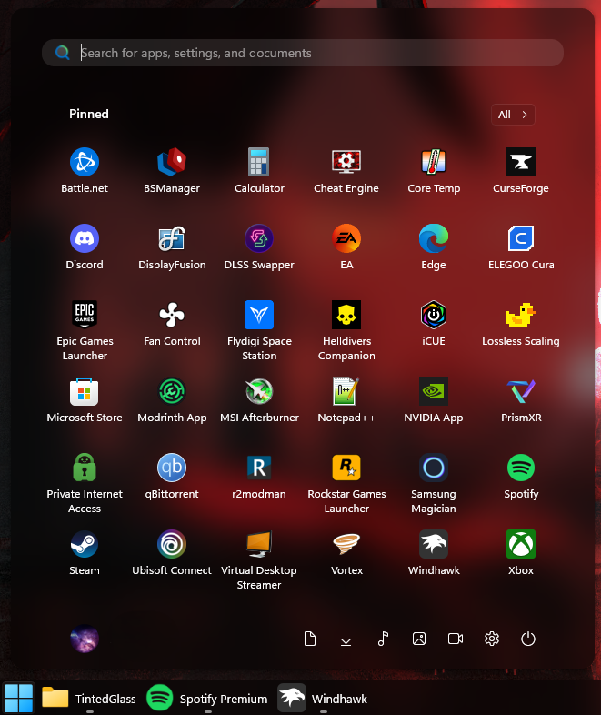

# TintedGlass theme for Windows 11 Start Menu Styler

**Author**: [TheRealCisWhiteMale](https://github.com/TheRealCisWhiteMale)



## Notes
* This taskbar theme is designed to be used in dark mode.

## Suggested Windhawk mods for full theme continuity
To achieve the full look, install and configure the following Windhawk mods in addition to Windows 11 Start Menu Styler:

- Windows 11 Taskbar Styler

[TintedGlass theme for Windows 11 Taskbar Styler](https://github.com/ramensoftware/windows-11-taskbar-styling-guide/blob/main/Themes/TintedGlass/README.md).

---

- Taskbar Clock Customization – for styling the clock. You will need to add your weather location if you have the desire to use that function and may need to change date formatting if you wish.

<details>
<summary>Click to expand mod settings</summary>

```yaml
ShowSeconds: 1
TimeFormat: HH':'mm':'ss
DateFormat: ddd',' dd MMM yyyy
WeekdayFormat: custom
WeekdayFormatCustom: Mon, Tue, Wed, Thu, Fri, Sat, Sun
TopLine: '%time%'
BottomLine: '%date%'
MiddleLine: '%weekday%'
TooltipLine: '%weather%'
TooltipLineMode: append
Width: 180
Height: 60
MaxWidth: 0
TextSpacing: -4
DataCollection:
  NetworkMetricsFormat: mbs
  NetworkMetricsFixedDecimals: -1
  PercentageFormat: spacePaddingAndSymbol
  UpdateInterval: 1
  NetworkAdapterName: ''
  GpuAdapterName: ''
MediaPlayer:
  IgnoredPlayers:
    - ''
  MaxLength: 28
  NoMediaText: No media
  RemoveBrackets: 0
WebContentWeatherLocation: ''
WebContentWeatherFormat: '%c 🌡️%t 🌬️%w'
WebContentWeatherUnits: autoDetect
WebContentsItems:
  - Url: https://rss.nytimes.com/services/xml/rss/nyt/World.xml
    BlockStart: <item>
    Start: <title>
    End: </title>
    ContentMode: xmlHtml
    SearchReplace:
      - Search: ''
        Replace: ''
    MaxLength: 28
WebContentsUpdateInterval: 10
TimeZones:
  - GMT Standard Time
TimeStyle:
  Hidden: 0
  TextColor: ''
  TextAlignment: Right
  FontSize: 16
  FontFamily: ''
  FontWeight: Medium
  FontStyle: ''
  FontStretch: ''
  CharacterSpacing: 70
DateStyle:
  Hidden: 0
  TextColor: ''
  TextAlignment: Right
  FontSize: 12
  FontFamily: ''
  FontWeight: ''
  FontStyle: ''
  FontStretch: ''
  CharacterSpacing: 0
oldTaskbarOnWin11: 0
DataCollectionUpdateInterval: 1
```
</details>

---

- Taskbar Height and Icon Size

<details>
<summary>Click to expand mod settings</summary>

```yaml
TaskbarHeight: 40
IconSize: 32
TaskbarButtonWidth: 40
IconSizeSmall: 16
TaskbarButtonWidthSmall: 32
```
</details>

---

- Taskbar Labels for Windows 11

<details>
<summary>Click to expand mod settings</summary>

```yaml
mode: labelsWithoutCombining
taskbarItemWidth: 0
runningIndicatorStyle: centerFixed
progressIndicatorStyle: sameAsRunningIndicatorStyle
excludedPrograms:
  - excluded1.exe
minimumTaskbarItemWidth: 43
maximumTaskbarItemWidth: 300
fontSize: 13
fontFamily: ''
textTrimming: clip
leftAndRightPaddingSize: 6
spaceBetweenIconAndLabel: 6
runningIndicatorHeight: 0
runningIndicatorVerticalOffset: 0
alwaysShowThumbnailLabels: 0
labelForSingleItem: '%name%'
labelForMultipleItems: '[%amount%] %name%'
```
</details>

---

- Windows 11 Notification Center Styler

[TintedGlass theme for Windows 11 Notification Center Styler](https://github.com/ramensoftware/windows-11-notification-center-styling-guide/blob/main/Themes/TintedGlass/README.md).

---

- Windows 11 File Explorer Styler

[TintedGlass theme for Windows 11 File Explorer Styler](https://github.com/ramensoftware/windows-11-file-explorer-styling-guide/blob/main/Themes/TintedGlass/README.md).

---

- Translucent Windows

<details>
<summary>Click to expand mod settings</summary>

```yaml
RenderingMod:
  ThemeBackground: 1
  SysColors: 1
  AccentColorControls: 1
  TextAlphaBlend: 1
type: acrylicblur
AccentBlurBehind: '80000000'
FlyoutsEffects: 1
ImmersiveDarkTitle: 1
ExtendFrame: 1
CornerOption: smallround
RainbowSpeed: 1
TitlebarColor:
  ColorTitlebar: 0
  RainbowTitlebar: 0
  titlerbarstyles_active: '0'
  titlerbarstyles_inactive: '0'
TitlebarTextColor:
  ColorTitlebarText: 0
  RainbowTextColor: 0
  titlerbarcolorstyles_active: FFFFFF
  titlerbarcolorstyles_inactive: FFFFFF
BorderColor:
  ColorBorder: 1
  RainbowBorder: 0
  borderstyles_active: '0'
  borderstyles_inactive: '0'
  MenuBorderColor: 1
RuledPrograms:
  - target: notepad.exe
    RenderingMod:
      ThemeBackground: 0
      AccentColorControls: 0
    type: acrylicsystem
    AccentBlurBehind: '80000000'
    ImmersiveDarkTitle: 1
    ExtendFrame: 0
    CornerOption: smallround
    RainbowSpeed: 1
    TitlebarColor:
      ColorTitlebar: 0
      RainbowTitlebar: 0
      titlerbarstyles_active: FF0000
      titlerbarstyles_inactive: 00FFFF
    TitlebarTextColor:
      ColorTitlebarText: 0
      RainbowTextColor: 0
      titlerbarcolorstyles_active: FFFFFF
      titlerbarcolorstyles_inactive: FFFFFF
    BorderColor:
      ColorBorder: 1
      RainbowBorder: 0
      borderstyles_active: '0'
      borderstyles_inactive: '0'
  - target: notepad++.exe
    RenderingMod:
      ThemeBackground: 0
      AccentColorControls: 0
    type: acrylicsystem
    AccentBlurBehind: '80000000'
    ImmersiveDarkTitle: 1
    ExtendFrame: 0
    CornerOption: smallround
    RainbowSpeed: 1
    TitlebarColor:
      ColorTitlebar: 0
      RainbowTitlebar: 0
      titlerbarstyles_active: FF0000
      titlerbarstyles_inactive: 00FFFF
    TitlebarTextColor:
      ColorTitlebarText: 0
      RainbowTextColor: 0
      titlerbarcolorstyles_active: FFFFFF
      titlerbarcolorstyles_inactive: FFFFFF
    BorderColor:
      ColorBorder: 1
      RainbowBorder: 0
      borderstyles_active: '0'
      borderstyles_inactive: '0'
```
</details>

---

- Taskbar Background Helper

<details>
<summary>Click to expand mod settings</summary>

```yaml
backgroundStyle: blur
color:
  red: 255
  green: 127
  blue: 39
  accentColor: 0
  transparency: 128
onlyWhenMaximized: 1
excludedPrograms:
  - ''
styleForDarkMode:
  use: 0
  backgroundStyle: blur
  color:
    red: 255
    green: 127
    blue: 39
    accentColor: 0
    transparency: 128
```
</details>

---

## Theme selection

The theme is integrated into the mod and can be selected directly from the mod's
settings:

* Open the Windows 11 Start Menu Styler mod in Windhawk.
* Go to the "Settings" tab.
* Select the theme and save the settings.

## Manual installation

The theme styles can also be imported manually. To do that, follow these steps:

* Open the Windows 11 Start Menu Styler mod in Windhawk.
* Go to the "Settings" tab and select "Textual mode".
* Copy the content below to the text box and click "Save settings".

### Redesigned Start menu

A variant for the [redesigned Windows 11 Start
menu](https://microsoft.design/articles/start-fresh-redesigning-windows-start-menu/)
that is slowly rolling out in the 25H2 update.

<details>
<summary>Content to import (click to expand)</summary>

```yaml
styleConstants:
  - CommonBgBrush=<WindhawkBlur BlurAmount="18" TintColor="#80000000"/>
controlStyles:
  - target: Border#AcrylicBorder
    styles:
      - Background:=$CommonBgBrush
      - BorderThickness=0
      - CornerRadius=14
  - target: Border#AcrylicOverlay
    styles:
      - Visibility=Collapsed
  - target: Border#BorderElement
    styles:
      - Background:=<WindhawkBlur BlurAmount="18" TintColor="#1AFFFFFF"/>
      - BorderThickness=0
      - CornerRadius=14
  - target: MenuFlyoutPresenter > Border
    styles:
      - Background:=<WindhawkBlur BlurAmount="25" TintColor="#22000000"/>
      - BorderThickness=1
  - target: Border#AppBorder
    styles:
      - Background:=$CommonBgBrush
      - BorderThickness=0
      - CornerRadius=14
  - target: Border#AccentAppBorder
    styles:
      - Background:=$CommonBgBrush
      - BorderThickness=0
      - CornerRadius=14
  - target: Border#LayerBorder
    styles:
      - Visibility=Collapsed
  - target: Border#TaskbarSearchBackground
    styles:
      - Background:=<WindhawkBlur BlurAmount="25" TintColor="#15000000"/>
      - BorderThickness=0
      - CornerRadius=14
  - target: Border#ContentBorder@CommonStates > Grid#DroppedFlickerWorkaroundWrapper > Border
    styles:
      - Background@Normal:=<RevealBorderBrush Color="Transparent" TargetTheme="1" Opacity="0.2"/>
      - Background@PointerOver:=<RevealBorderBrush Color="Transparent" TargetTheme="1" Opacity="0.3"/>
      - BorderBrush@PointerOver:=<RevealBorderBrush Color="Transparent" TargetTheme="1" Opacity="1"/>
      - Background@Pressed:=<RevealBorderBrush Color="Transparent" TargetTheme="1" Opacity="0.3"/>
      - BorderBrush@Pressed:=<RevealBorderBrush Color="Transparent" TargetTheme="1" Opacity="1"/>
  - target: Button#ShowAllAppsButton > ContentPresenter@CommonStates
    styles:
      - Background@Normal:=<WindhawkBlur BlurAmount="25" TintColor="#15C0C0C0"/>
      - Background@PointerOver:=<RevealBorderBrush Color="Transparent" TargetTheme="1" Opacity="0.5"/>
      - BorderBrush@PointerOver:=<RevealBorderBrush Color="Transparent" TargetTheme="1" Opacity="1"/>
      - BorderThickness=1
  - target: StartMenu.SearchBoxToggleButton > Grid > Border#BorderElement
    styles:
      - BorderBrush:=<RevealBorderBrush Color="Transparent" TargetTheme="1" Opacity="1"/>
      - BorderThickness=1
  - target: StartDocked.NavigationPaneButton#UserTileButton > Grid@CommonStates > Border
    styles:
      - Background@Normal:=<RevealBorderBrush Color="Transparent" TargetTheme="1" Opacity="0.2"/>
      - Background@PointerOver:=<RevealBorderBrush Color="Transparent" TargetTheme="1" Opacity="0.5"/>
      - BorderBrush@PointerOver:=<RevealBorderBrush Color="Transparent" TargetTheme="1" Opacity="0.8"/>
      - BorderThickness=1
  - target: StartDocked.AppListViewItem > Grid@CommonStates > Border
    styles:
      - Background:=<RevealBorderBrush Color="Transparent" TargetTheme="1" Opacity="0.45"/>
      - BorderBrush:=<RevealBorderBrush Color="Transparent" TargetTheme="1" Opacity="0.7"/>
      - BorderThickness=1
      - Margin@Normal=4
  - target: StartDocked.NavigationPaneButton#PowerButton > Grid@CommonStates > Border
    styles:
      - Background:=<RevealBorderBrush Color="Transparent" TargetTheme="1" Opacity="0.45"/>
      - BorderBrush:=<RevealBorderBrush Color="Transparent" TargetTheme="1" Opacity="0.7"/>
      - BorderThickness=1
      - Margin@Normal=4
  - target: ToolTip > ContentPresenter#LayoutRoot
    styles:
      - Background:=<WindhawkBlur BlurAmount="25" TintColor="#22000000"/>
  - target: Border#dropshadow
    styles:
      - CornerRadius=14
      - Margin=-1
  - target: Border#StartDropShadow
    styles:
      - CornerRadius=14
      - Margin=-1
  - target: Grid#TopLevelSuggestionsRoot
    styles:
      - Visibility=Collapsed
  - target: TextBlock#Text
    styles:
      - Foreground=White
  - target: Microsoft.UI.Xaml.Controls.DropDownButton > Grid#RootGrid
    styles:
      - Background:=<RevealBorderBrush Color="Transparent" TargetTheme="1" Opacity="0.3"/>
      - BorderBrush:=<RevealBorderBrush Color="Transparent" TargetTheme="1" Opacity="0.6"/>
      - BorderThickness=1
  - target: Button > Grid@CommonStates > Border
    styles:
      - Background@Normal:=<RevealBorderBrush Color="Transparent" TargetTheme="1" Opacity="0.2"/>
      - Background@PointerOver:=<RevealBorderBrush Color="Transparent" TargetTheme="1" Opacity="0.3"/>
      - BorderBrush@PointerOver:=<RevealBorderBrush Color="Transparent" TargetTheme="1" Opacity="0.6"/>
      - BorderThickness=1
  - target: DropDownButton
    styles:
      - Background:=<RevealBorderBrush Color="Transparent" TargetTheme="1" Opacity="0.2"/>
  - target: Button#Header > Border#Border@CommonStates
    styles:
      - Background:=<RevealBorderBrush Color="Transparent" TargetTheme="1" Opacity="0"/>
      - BorderBrush@PointerOver:=<RevealBorderBrush Color="Transparent" TargetTheme="1" Opacity="0.6"/>
      - Background@PointerOver:=<RevealBorderBrush Color="Transparent" TargetTheme="1" Opacity="0.8"/>
  - target: StartMenu.FolderModal > Grid > Border
    styles:
      - Background:=$CommonBgBrush
      - BorderBrush:=<RevealBorderBrush Color="Transparent" TargetTheme="1" Opacity="0.8"/>
      - BorderThickness=1
  - target: ListViewItem > Grid#ContentBorder@CommonStates
    styles:
      - BorderBrush:=<RevealBorderBrush Color="Transparent" TargetTheme="1" Opacity="0.8"/>
      - BorderBrush@PointerOver:=<RevealBorderBrush Color="Transparent" TargetTheme="1" Opacity="1"/>
      - Background:=<RevealBorderBrush Color="Transparent" TargetTheme="1" Opacity="0"/>
      - Background@PointerOver:=<RevealBorderBrush Color="Transparent" TargetTheme="1" Opacity="0.9"/>
      - BorderThickness=1
      - CornerRadius=5
```
</details>

### Classic Start menu

<details>
<summary>Content to import (click to expand)</summary>

```yaml
styleConstants:
  - CommonBgBrush=<WindhawkBlur BlurAmount="18" TintColor="#80000000"/>
controlStyles:
  - target: Border#AcrylicBorder
    styles:
      - Background:=$CommonBgBrush
      - BorderThickness=0
      - CornerRadius=14
  - target: Border#AcrylicOverlay
    styles:
      - Visibility=Collapsed
  - target: Border#BorderElement
    styles:
      - Background:=<WindhawkBlur BlurAmount="18" TintColor="#1AFFFFFF"/>
      - BorderThickness=0
      - CornerRadius=14
  - target: Grid#ShowMoreSuggestions
    styles:
      - Visibility=Collapsed
  - target: Grid#SuggestionsParentContainer
    styles:
      - Visibility=Collapsed
  - target: Grid#TopLevelSuggestionsListHeader
    styles:
      - Visibility=Collapsed
  - target: StartMenu.PinnedList
    styles:
      - Height=504
  - target: MenuFlyoutPresenter > Border
    styles:
      - Background:=<WindhawkBlur BlurAmount="25" TintColor="#00000000"/>
      - BorderThickness=0
  - target: Border#AppBorder
    styles:
      - Background:=$CommonBgBrush
      - BorderThickness=0
      - CornerRadius=14
  - target: Border#AccentAppBorder
    styles:
      - Background:=$CommonBgBrush
      - BorderThickness=0
      - CornerRadius=14
  - target: Border#TaskbarSearchBackground
    styles:
      - Background:=<WindhawkBlur BlurAmount="25" TintColor="#15000000"/>
      - BorderThickness=0
      - CornerRadius=14
  - target: Border#ContentBorder@CommonStates > Grid#DroppedFlickerWorkaroundWrapper > Border
    styles:
      - Background@Normal:=<RevealBorderBrush Color="Transparent" TargetTheme="0" Opacity="0.2"/>
      - Background@PointerOver:=<RevealBorderBrush Color="Transparent" TargetTheme="1" Opacity="0.3"/>
      - BorderBrush@PointerOver:=<RevealBorderBrush Color="Transparent" TargetTheme="1" Opacity="1"/>
      - Margin=1
      - Background@Pressed:=<RevealBorderBrush Color="Transparent" TargetTheme="1" Opacity="0.3"/>
      - BorderBrush@Pressed:=<RevealBorderBrush Color="Transparent" TargetTheme="1" Opacity="1"/>
  - target: Button#ShowAllAppsButton > ContentPresenter@CommonStates
    styles:
      - Background@Normal:=<WindhawkBlur BlurAmount="25" TintColor="#15000000"/>
      - Background@PointerOver:=<RevealBorderBrush Color="Transparent" TargetTheme="1" Opacity="0.5"/>
      - BorderBrush@PointerOver:=<RevealBorderBrush Color="Transparent" TargetTheme="1" Opacity="1"/>
      - BorderThickness=1
  - target: StartDocked.SearchBoxToggleButton#StartMenuSearchBox > Grid > Border#BorderElement
    styles:
      - BorderBrush:=<RevealBorderBrush Color="Transparent" TargetTheme="1" Opacity="1"/>
      - BorderThickness=1
  - target: StartDocked.NavigationPaneButton#UserTileButton > Grid@CommonStates > Border
    styles:
      - Background@Normal:=<RevealBorderBrush Color="Transparent" TargetTheme="0" Opacity="0.2"/>
      - Background@PointerOver:=<RevealBorderBrush Color="Transparent" TargetTheme="1" Opacity="0.5"/>
      - BorderBrush@PointerOver:=<RevealBorderBrush Color="Transparent" TargetTheme="1" Opacity="0.8"/>
      - BorderThickness=1
  - target: StartDocked.AppListViewItem > Grid@CommonStates > Border
    styles:
      - Background:=<RevealBorderBrush Color="Transparent" TargetTheme="1" Opacity="0.45"/>
      - BorderBrush:=<RevealBorderBrush Color="Transparent" TargetTheme="1" Opacity="0.7"/>
      - BorderThickness=1
      - Margin@Normal=4
  - target: StartDocked.NavigationPaneButton#PowerButton > Grid@CommonStates > Border
    styles:
      - Background:=<RevealBorderBrush Color="Transparent" TargetTheme="1" Opacity="0.45"/>
      - BorderBrush:=<RevealBorderBrush Color="Transparent" TargetTheme="1" Opacity="0.7"/>
      - BorderThickness=1
      - Margin@Normal=4
  - target: ToolTip > ContentPresenter#LayoutRoot
    styles:
      - Background:=<WindhawkBlur BlurAmount="25" TintColor="#15000000"/>
  - target: StartDocked.AllAppsGridListViewItem > Grid@CommonStates > Border
    styles:
      - BorderBrush@PointerOver:=<RevealBorderBrush Color="Transparent" TargetTheme="1" Opacity="0.8"/>
      - Background@PointerOver:=<RevealBorderBrush Color="Transparent" TargetTheme="1" Opacity="0.55"/>
      - BorderThickness=1
  - target: Button#CloseAllAppsButton > ContentPresenter@CommonStates
    styles:
      - Background@Normal:=<WindhawkBlur BlurAmount="25" TintColor="#15000000"/>
      - Background@PointerOver:=<RevealBorderBrush Color="Transparent" TargetTheme="1" Opacity="0.5"/>
      - BorderBrush@PointerOver:=<RevealBorderBrush Color="Transparent" TargetTheme="1" Opacity="1"/>
      - BorderThickness=1
  - target: StartDocked.AllAppsZoomListViewItem > Grid@CommonStates > Border
    styles:
      - Background@Normal:=<RevealBorderBrush Color="Transparent" TargetTheme="0" Opacity="0.2"/>
      - Background@PointerOver:=<RevealBorderBrush Color="Transparent" TargetTheme="1" Opacity="0.3"/>
      - BorderBrush@PointerOver:=<RevealBorderBrush Color="Transparent" TargetTheme="1" Opacity="0.6"/>
  - target: Border#dropshadow
    styles:
      - CornerRadius=14
      - Margin=-1
  - target: Border#DropShadow
    styles:
      - CornerRadius=14
  - target: Border#StartDropShadow
    styles:
      - CornerRadius=14
  - target: Border#RootGridDropShadow
    styles:
      - CornerRadius=14
  - target: Border#RightCompanionDropShadow
    styles:
      - CornerRadius=14
  - target: StartDocked.AllAppsGridListViewItem > Grid#ContentBorder@CommonStates
    styles:
      - Background@PointerOver:=<WindhawkBlur BlurAmount="25" TintColor="#15C0C0C0"/>
      - CornerRadius=14
```
</details>
