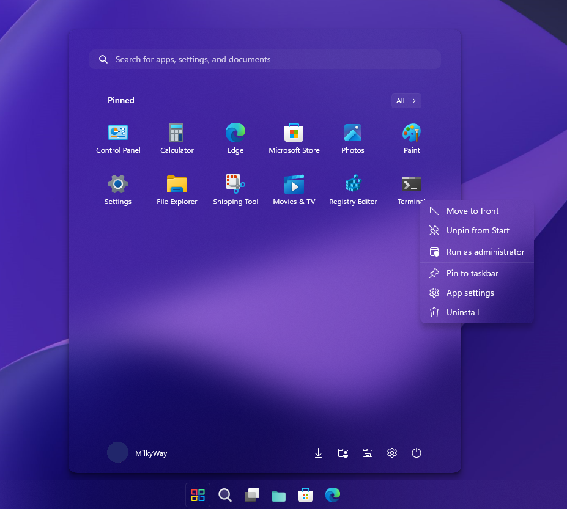

# TranslucentStartMenu theme for Windows 11 Start Menu Styler

A theme with a clear view of the Start menu acrylic background.

**Author**: [Undisputed00x](https://github.com/Undisputed00x)



## Theme selection

The theme is integrated into the mod and can be selected directly from the mod's
settings:

* Open the Windows 11 Start Menu Styler mod in Windhawk.
* Go to the "Settings" tab.
* Select the theme and save the settings.

## Manual installation

The theme styles can also be imported manually. To do that, follow these steps:

* Open the Windows 11 Start Menu Styler mod in Windhawk.
* Go to the "Advanced" tab.
* Copy the content below to the text box under "Mod settings" and click "Save".

### Redesigned Start menu

A variant for the [redesigned Windows 11 Start
menu](https://microsoft.design/articles/start-fresh-redesigning-windows-start-menu/)
that is slowly rolling out in the 25H2 update.

<details>
<summary>Content to import (click to expand)</summary>

```yaml
styleConstants:
  - CommonBgBrush=<WindhawkBlur BlurAmount="25" TintColor="#25323232"/>
controlStyles:
  - target: Border#AcrylicBorder
    styles:
      - Background:=$CommonBgBrush
      - BorderThickness=0
      - CornerRadius=15
  - target: Border#AcrylicOverlay
    styles:
      - Visibility=Collapsed
  - target: Border#BorderElement
    styles:
      - Background:=<WindhawkBlur BlurAmount="25" TintColor="#15000000"/>
      - BorderThickness=0
      - CornerRadius=10
  - target: MenuFlyoutPresenter > Border
    styles:
      - Background:=<WindhawkBlur BlurAmount="25" TintColor="#22000000"/>
      - BorderThickness=1
  - target: Border#AppBorder
    styles:
      - Background:=$CommonBgBrush
      - BorderThickness=0
      - CornerRadius=15
  - target: Border#AccentAppBorder
    styles:
      - Background:=$CommonBgBrush
      - BorderThickness=0
      - CornerRadius=15
  - target: Border#LayerBorder
    styles:
      - Visibility=Collapsed
  - target: Border#TaskbarSearchBackground
    styles:
      - Background:=<WindhawkBlur BlurAmount="25" TintColor="#15000000"/>
      - BorderThickness=0
      - CornerRadius=10
  - target: Border#ContentBorder@CommonStates > Grid#DroppedFlickerWorkaroundWrapper > Border
    styles:
      - Background@Normal:=<RevealBorderBrush Color="Transparent" TargetTheme="1" Opacity="0.2"/>
      - Background@PointerOver:=<RevealBorderBrush Color="Transparent" TargetTheme="1" Opacity="0.3"/>
      - BorderBrush@PointerOver:=<RevealBorderBrush Color="Transparent" TargetTheme="1" Opacity="1"/>
      - Background@Pressed:=<RevealBorderBrush Color="Transparent" TargetTheme="1" Opacity="0.3"/>
      - BorderBrush@Pressed:=<RevealBorderBrush Color="Transparent" TargetTheme="1" Opacity="1"/>
  - target: Button#ShowAllAppsButton > ContentPresenter@CommonStates
    styles:
      - Background@Normal:=<WindhawkBlur BlurAmount="25" TintColor="#15C0C0C0"/>
      - Background@PointerOver:=<RevealBorderBrush Color="Transparent" TargetTheme="1" Opacity="0.5"/>
      - BorderBrush@PointerOver:=<RevealBorderBrush Color="Transparent" TargetTheme="1" Opacity="1"/>
      - BorderThickness=1
  - target: StartMenu.SearchBoxToggleButton > Grid > Border#BorderElement
    styles:
      - BorderBrush:=<RevealBorderBrush Color="Transparent" TargetTheme="1" Opacity="1"/>
      - BorderThickness=1
  - target: StartDocked.NavigationPaneButton#UserTileButton > Grid@CommonStates > Border
    styles:
      - Background@Normal:=<RevealBorderBrush Color="Transparent" TargetTheme="1" Opacity="0.2"/>
      - Background@PointerOver:=<RevealBorderBrush Color="Transparent" TargetTheme="1" Opacity="0.5"/>
      - BorderBrush@PointerOver:=<RevealBorderBrush Color="Transparent" TargetTheme="1" Opacity="0.8"/>
      - BorderThickness=1
  - target: StartDocked.AppListViewItem > Grid@CommonStates > Border
    styles:
      - Background:=<RevealBorderBrush Color="Transparent" TargetTheme="1" Opacity="0.45"/>
      - BorderBrush:=<RevealBorderBrush Color="Transparent" TargetTheme="1" Opacity="0.7"/>
      - BorderThickness=1
      - Margin@Normal=4
  - target: StartDocked.NavigationPaneButton#PowerButton > Grid@CommonStates > Border
    styles:
      - Background:=<RevealBorderBrush Color="Transparent" TargetTheme="1" Opacity="0.45"/>
      - BorderBrush:=<RevealBorderBrush Color="Transparent" TargetTheme="1" Opacity="0.7"/>
      - BorderThickness=1
      - Margin@Normal=4
  - target: ToolTip > ContentPresenter#LayoutRoot
    styles:
      - Background:=<WindhawkBlur BlurAmount="25" TintColor="#22000000"/>
  - target: Border#dropshadow
    styles:
      - CornerRadius=16
      - Margin=-1
  - target: Border#StartDropShadow
    styles:
      - CornerRadius=15
      - Margin=-1
  - target: Grid#TopLevelSuggestionsRoot
    styles:
      - Visibility=Collapsed
  - target: TextBlock#Text
    styles:
      - Foreground=White
  - target: Microsoft.UI.Xaml.Controls.DropDownButton > Grid#RootGrid
    styles:
      - Background:=<RevealBorderBrush Color="Transparent" TargetTheme="1" Opacity="0.3"/>
      - BorderBrush:=<RevealBorderBrush Color="Transparent" TargetTheme="1" Opacity="0.6"/>
      - BorderThickness=1
  - target: Button > Grid@CommonStates > Border
    styles:
      - Background@Normal:=<RevealBorderBrush Color="Transparent" TargetTheme="1" Opacity="0.2"/>
      - Background@PointerOver:=<RevealBorderBrush Color="Transparent" TargetTheme="1" Opacity="0.3"/>
      - BorderBrush@PointerOver:=<RevealBorderBrush Color="Transparent" TargetTheme="1" Opacity="0.6"/>
      - BorderThickness=1
  - target: DropDownButton
    styles:
      - Background:=<RevealBorderBrush Color="Transparent" TargetTheme="1" Opacity="0.2"/>
  - target: Button#Header > Border#Border@CommonStates
    styles:
      - Background:=<RevealBorderBrush Color="Transparent" TargetTheme="1" Opacity="0"/>
      - BorderBrush@PointerOver:=<RevealBorderBrush Color="Transparent" TargetTheme="1" Opacity="0.6"/>
      - Background@PointerOver:=<RevealBorderBrush Color="Transparent" TargetTheme="1" Opacity="0.8"/>
  - target: StartMenu.FolderModal > Grid > Border
    styles:
      - Background:=$CommonBgBrush
      - BorderBrush:=<RevealBorderBrush Color="Transparent" TargetTheme="1" Opacity="0.8"/>
      - BorderThickness=1
  - target: ListViewItem > Grid#ContentBorder@CommonStates
    styles:
      - BorderBrush:=<RevealBorderBrush Color="Transparent" TargetTheme="1" Opacity="0.8"/>
      - BorderBrush@PointerOver:=<RevealBorderBrush Color="Transparent" TargetTheme="1" Opacity="1"/>
      - Background:=<RevealBorderBrush Color="Transparent" TargetTheme="1" Opacity="0"/>
      - Background@PointerOver:=<RevealBorderBrush Color="Transparent" TargetTheme="1" Opacity="0.9"/>
      - BorderThickness=1
      - CornerRadius=5
```
</details>

### Classic Start menu

<details>
<summary>Content to import (click to expand)</summary>

```yaml
styleConstants:
  - CommonBgBrush=<WindhawkBlur BlurAmount="25" TintColor="#25323232"/>
controlStyles:
  - target: Border#AcrylicBorder
    styles:
      - Background:=$CommonBgBrush
      - BorderThickness=0
      - CornerRadius=15
  - target: Border#AcrylicOverlay
    styles:
      - Visibility=Collapsed
  - target: Border#BorderElement
    styles:
      - Background:=<WindhawkBlur BlurAmount="25" TintColor="#15000000"/>
      - BorderThickness=0
      - CornerRadius=10
  - target: Grid#ShowMoreSuggestions
    styles:
      - Visibility=Collapsed
  - target: Grid#SuggestionsParentContainer
    styles:
      - Visibility=Collapsed
  - target: Grid#TopLevelSuggestionsListHeader
    styles:
      - Visibility=Collapsed
  - target: StartMenu.PinnedList
    styles:
      - Height=504
  - target: MenuFlyoutPresenter > Border
    styles:
      - Background:=<WindhawkBlur BlurAmount="25" TintColor="#00000000"/>
      - BorderThickness=0
  - target: Border#AppBorder
    styles:
      - Background:=$CommonBgBrush
      - BorderThickness=0
      - CornerRadius=15
  - target: Border#AccentAppBorder
    styles:
      - Background:=$CommonBgBrush
      - BorderThickness=0
      - CornerRadius=15
  - target: Border#LayerBorder
    styles:
      - Visibility=Collapsed
  - target: Border#TaskbarSearchBackground
    styles:
      - Background:=<WindhawkBlur BlurAmount="25" TintColor="#15000000"/>
      - BorderThickness=0
      - CornerRadius=10
  - target: Border#ContentBorder@CommonStates > Grid#DroppedFlickerWorkaroundWrapper > Border
    styles:
      - Background@Normal:=<RevealBorderBrush Color="Transparent" TargetTheme="0" Opacity="0.2"/>
      - Background@PointerOver:=<RevealBorderBrush Color="Transparent" TargetTheme="1" Opacity="0.3"/>
      - BorderBrush@PointerOver:=<RevealBorderBrush Color="Transparent" TargetTheme="1" Opacity="1"/>
      - Margin=1
      - Background@Pressed:=<RevealBorderBrush Color="Transparent" TargetTheme="1" Opacity="0.3"/>
      - BorderBrush@Pressed:=<RevealBorderBrush Color="Transparent" TargetTheme="1" Opacity="1"/>
  - target: Button#ShowAllAppsButton > ContentPresenter@CommonStates
    styles:
      - Background@Normal:=<WindhawkBlur BlurAmount="25" TintColor="#15C0C0C0"/>
      - Background@PointerOver:=<RevealBorderBrush Color="Transparent" TargetTheme="1" Opacity="0.5"/>
      - BorderBrush@PointerOver:=<RevealBorderBrush Color="Transparent" TargetTheme="1" Opacity="1"/>
      - BorderThickness=1
  - target: StartDocked.SearchBoxToggleButton#StartMenuSearchBox > Grid > Border#BorderElement
    styles:
      - BorderBrush:=<RevealBorderBrush Color="Transparent" TargetTheme="1" Opacity="1"/>
      - BorderThickness=1
  - target: StartDocked.NavigationPaneButton#UserTileButton > Grid@CommonStates > Border
    styles:
      - Background@Normal:=<RevealBorderBrush Color="Transparent" TargetTheme="0" Opacity="0.2"/>
      - Background@PointerOver:=<RevealBorderBrush Color="Transparent" TargetTheme="1" Opacity="0.5"/>
      - BorderBrush@PointerOver:=<RevealBorderBrush Color="Transparent" TargetTheme="1" Opacity="0.8"/>
      - BorderThickness=1
  - target: StartDocked.AppListViewItem > Grid@CommonStates > Border
    styles:
      - Background:=<RevealBorderBrush Color="Transparent" TargetTheme="1" Opacity="0.45"/>
      - BorderBrush:=<RevealBorderBrush Color="Transparent" TargetTheme="1" Opacity="0.7"/>
      - BorderThickness=1
      - Margin@Normal=4
  - target: StartDocked.NavigationPaneButton#PowerButton > Grid@CommonStates > Border
    styles:
      - Background:=<RevealBorderBrush Color="Transparent" TargetTheme="1" Opacity="0.45"/>
      - BorderBrush:=<RevealBorderBrush Color="Transparent" TargetTheme="1" Opacity="0.7"/>
      - BorderThickness=1
      - Margin@Normal=4
  - target: ToolTip > ContentPresenter#LayoutRoot
    styles:
      - Background:=<WindhawkBlur BlurAmount="25" TintColor="#00000000"/>
  - target: StartDocked.AllAppsGridListViewItem > Grid@CommonStates > Border
    styles:
      - BorderBrush@PointerOver:=<RevealBorderBrush Color="Transparent" TargetTheme="1" Opacity="0.8"/>
      - Background@PointerOver:=<RevealBorderBrush Color="Transparent" TargetTheme="1" Opacity="0.55"/>
      - BorderThickness=1
  - target: Button#CloseAllAppsButton > ContentPresenter@CommonStates
    styles:
      - Background@Normal:=<WindhawkBlur BlurAmount="25" TintColor="#15C0C0C0"/>
      - Background@PointerOver:=<RevealBorderBrush Color="Transparent" TargetTheme="1" Opacity="0.5"/>
      - BorderBrush@PointerOver:=<RevealBorderBrush Color="Transparent" TargetTheme="1" Opacity="1"/>
      - BorderThickness=1
  - target: StartDocked.AllAppsZoomListViewItem > Grid@CommonStates > Border
    styles:
      - Background@Normal:=<RevealBorderBrush Color="Transparent" TargetTheme="0" Opacity="0.2"/>
      - Background@PointerOver:=<RevealBorderBrush Color="Transparent" TargetTheme="1" Opacity="0.3"/>
      - BorderBrush@PointerOver:=<RevealBorderBrush Color="Transparent" TargetTheme="1" Opacity="0.6"/>
  - target: Border#dropshadow
    styles:
      - CornerRadius=16
      - Margin=-1
  - target: Border#DropShadow
    styles:
      - Visibility=Collapsed
  - target: Border#StartDropShadow
    styles:
      - Visibility=Collapsed
  - target: Border#RootGridDropShadow
    styles:
      - Visibility=Collapsed
  - target: Border#RightCompanionDropShadow
    styles:
      - Visibility=Collapsed
  - target: StartDocked.AllAppsGridListViewItem > Grid#ContentBorder@CommonStates
    styles:
      - Background@PointerOver:=<WindhawkBlur BlurAmount="25" TintColor="#15C0C0C0"/>
      - CornerRadius=4
```
</details>
