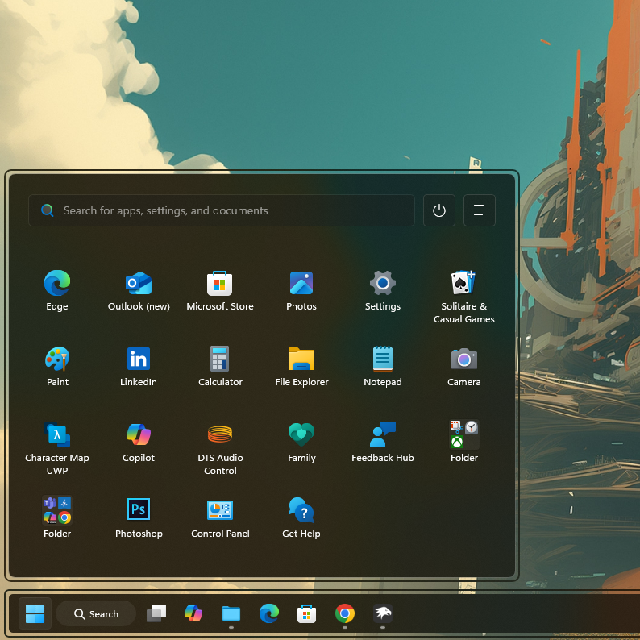

# UniMenu theme for Windows 11 Start Menu Styler

**Author**: [VIN STAR](https://github.com/vinstartheme)



## Theme selection

The theme is integrated into the mod and can be selected directly from the mod's
settings:

* Open the Windows 11 Start Menu Styler mod in Windhawk.
* Go to the "Settings" tab.
* Select the theme and save the settings.

## Manual installation

The theme styles can also be imported manually. To do that, follow these steps:

* Open the Windows 11 Start Menu Styler mod in Windhawk.
* Go to the "Settings" tab and select "Textual mode".
* Copy the content below to the text box and click "Save settings".

### Redesigned Start menu

A variant for the [redesigned Windows 11 Start
menu](https://microsoft.design/articles/start-fresh-redesigning-windows-start-menu/)
that is slowly rolling out in the 25H2 update.

<details>
<summary>Content to import (click to expand)</summary>

```yaml
controlStyles:
  - target: Windows.UI.Xaml.Controls.Grid#NoTopLevelSuggestionsText
    styles:
      - Visibility=Collapsed
  - target: Grid#MoreSuggestionsRoot > Grid
    styles:
      - RenderTransform:=<TranslateTransform Y="24" />
  - target: StartDocked.UserTileView
    styles:
      - Visibility=Collapsed
  - target: StartDocked.AppListView
    styles:
      - Visibility=Collapsed
  - target: Windows.UI.Xaml.Controls.Primitives.ScrollBar
    styles:
      - Visibility=Collapsed
  - target: Grid#FrameRoot
    styles:
      - MaxHeight=520
      - Margin=-8,10,0,0
  - target: StartMenu.PinnedList
    styles:
      - Margin=42,25,42,0
      - MaxHeight=380
  - target: StartMenu.SearchBoxToggleButton
    styles:
      - Width=430
      - Height=40
      - Margin=-50,0,0,0
      - Background:=<AcrylicBrush TintColor="{ThemeResource CardStrokeColorDefaultSolid}" FallbackColor="{ThemeResource CardStrokeColorDefaultSolid}" TintOpacity=".3" TintLuminosityOpacity=".5" Opacity="1"/>
      - RenderTransform:=<TranslateTransform Y="11" />
  - target: StartMenu.SearchBoxToggleButton > Grid > Border#BorderElement
    styles:
      - CornerRadius=5
      - Background:=<AcrylicBrush TintColor="{ThemeResource CardStrokeColorDefaultSolid}" FallbackColor="{ThemeResource CardStrokeColorDefaultSolid}" TintOpacity=".3" TintLuminosityOpacity=".5" Opacity="1"/>
  - target: StartDocked.PowerOptionsView
    styles:
      - Margin=-135,-950,0,0
      - Canvas.ZIndex=99
  - target: Windows.UI.Xaml.Controls.GridView#PinnedList > Windows.UI.Xaml.Controls.Border > Windows.UI.Xaml.Controls.ScrollViewer > Windows.UI.Xaml.Controls.Border > Windows.UI.Xaml.Controls.Grid > Windows.UI.Xaml.Controls.ScrollContentPresenter > Windows.UI.Xaml.Controls.ItemsPresenter > Windows.UI.Xaml.Controls.ItemsWrapGrid > Windows.UI.Xaml.Controls.GridViewItem
    styles:
      - Margin=5,0,0,0
      - Padding=-1,0
  - target: StartMenu.PinnedList > Grid#Root
    styles:
      - Padding=0
  - target: TextBlock#PinnedListHeaderText
    styles:
      - Visibility=Collapsed
  - target: Windows.UI.Xaml.Controls.TextBlock[Text=]
    styles:
      - Text=
      - FontSize=16
  - target: Grid#TopLevelHeader > Grid > Button > Grid@CommonStates > Border
    styles:
      - Width=40
      - Height=40
      - Background:=<AcrylicBrush TintColor="{ThemeResource CardStrokeColorDefaultSolid}" FallbackColor="{ThemeResource CardStrokeColorDefaultSolid}" TintOpacity=".3" TintLuminosityOpacity=".5" Opacity="1"/>
      - BorderBrush:=<AcrylicBrush TintColor="{ThemeResource SurfaceStrokeColorDefault}" FallbackColor="{ThemeResource SurfaceStrokeColorDefault}" TintOpacity=".2" TintLuminosityOpacity=".3" Opacity="1"/>
      - Background@PointerOver:=<AcrylicBrush TintColor="{ThemeResource SurfaceStrokeColorDefault}" FallbackColor="{ThemeResource SurfaceStrokeColorDefault}" TintOpacity="0" TintLuminosityOpacity=".2" Opacity="1"/>
  - target: StartDocked.NavigationPaneButton#PowerButton > Grid@CommonStates > Border#BackgroundBorder
    styles:
      - Background:=<AcrylicBrush TintColor="{ThemeResource CardStrokeColorDefaultSolid}" FallbackColor="{ThemeResource CardStrokeColorDefaultSolid}" TintOpacity=".3" TintLuminosityOpacity=".5" Opacity="1"/>
      - BorderThickness=1
      - BorderBrush:=<AcrylicBrush TintColor="{ThemeResource SurfaceStrokeColorDefault}" FallbackColor="{ThemeResource SurfaceStrokeColorDefault}" TintOpacity=".2" TintLuminosityOpacity=".3" Opacity="1"/>
      - Background@PointerOver:=<AcrylicBrush TintColor="{ThemeResource SurfaceStrokeColorDefault}" FallbackColor="{ThemeResource SurfaceStrokeColorDefault}" TintOpacity="0" TintLuminosityOpacity=".2" Opacity="1"/>
  - target: Windows.UI.Xaml.Controls.TextBlock[Text=]
    styles:
      - Text=
      - FontSize=16
  - target: Grid#AllAppsRoot
    styles:
      - Margin=0,-20,0,-40
  - target: Border#AcrylicOverlay
    styles:
      - Margin=0,-64,0,-58
      - BorderThickness=0
      - Background=Transparent
      - CornerRadius=8
  - target: Border#AcrylicBorder
    styles:
      - Margin=6,6,6,12
      - CornerRadius=8
  - target: Cortana.UI.Views.TaskbarSearchPage
    styles:
      - Margin=5,0,0,8
  - target: Cortana.UI.Views.TaskbarSearchPage > Grid#RootGrid
    styles:
      - BorderBrush:=<AcrylicBrush TintColor="{ThemeResource CardStrokeColorDefaultSolid}" FallbackColor="{ThemeResource CardStrokeColorDefaultSolid}" TintOpacity="0" TintLuminosityOpacity=".65" Opacity="1"/>
      - BorderThickness=2
      - Padding=3,3,3,-8
      - CornerRadius=8
  - target: Border#StartDropShadow
    styles:
      - Visibility=Collapsed
  - target: Border#LayerBorder
    styles:
      - Visibility=Collapsed
  - target: Grid#MainMenu
    styles:
      - MaxWidth=650
  - target: Grid#TopLevelHeader > Grid[2] > Button
    styles:
      - Width=40
      - Height=40
      - Margin=-73,-6,73,6
  - target: TextBlock#ShowMorePinnedButtonText
    styles:
      - Visibility=Collapsed
  - target: Windows.UI.Xaml.Controls.FontIcon[Glyph=]
    styles:
      - Glyph=
      - FontSize=16
      - Margin=0
  - target: Grid#FrameRoot
    styles:
      - Margin=0,-58,0,0
  - target: StartMenu.StartHome
    styles:
      - Margin=0,-17,0,-52
  - target: Windows.UI.Xaml.Controls.Primitives.ToggleButton
    styles:
      - Height=40
      - Width=40
  - target: Windows.UI.Xaml.Controls.Primitives.ToggleButton > Border@CommonStates > ContentPresenter
    styles:
      - Width=40
      - Height=40
      - Background@PointerOver:=<AcrylicBrush TintColor="{ThemeResource SurfaceStrokeColorDefault}" FallbackColor="{ThemeResource SurfaceStrokeColorDefault}" TintOpacity="0" TintLuminosityOpacity=".2" Opacity="1"/>
      - BorderBrush:=<AcrylicBrush TintColor="{ThemeResource SurfaceStrokeColorDefault}" FallbackColor="{ThemeResource SurfaceStrokeColorDefault}" TintOpacity=".2" TintLuminosityOpacity=".3" Opacity="1"/>
      - BorderThickness=1
      - Background:=<AcrylicBrush TintColor="{ThemeResource CardStrokeColorDefaultSolid}" FallbackColor="{ThemeResource CardStrokeColorDefaultSolid}" TintOpacity=".3" TintLuminosityOpacity=".5" Opacity="1"/>
      - CornerRadius=5
      - RenderTransform:=<TranslateTransform Y="11" X="-4" />
      - Background@CheckedPointerOver:=<AcrylicBrush TintColor="{ThemeResource SurfaceStrokeColorDefault}" FallbackColor="{ThemeResource SurfaceStrokeColorDefault}" TintOpacity="0" TintLuminosityOpacity=".2" Opacity="1"/>
  - target: Grid#MainMenu > Grid#MainContent > Grid
    styles:
      - Canvas.ZIndex=1
  - target: Grid#AnimationRoot
    styles:
      - CornerRadius=8
      - BorderThickness=2,2,2,3
      - Background=Transparent
      - BorderBrush:=<AcrylicBrush TintColor="{ThemeResource CardStrokeColorDefaultSolid}" FallbackColor="{ThemeResource CardStrokeColorDefaultSolid}" TintOpacity="0" TintLuminosityOpacity=".65" Opacity="1"/>
      - Padding=-1.5,-1.5,-1.5,-6
  - target: StartMenu.StartMenuCompanion#RightCompanion > Grid
    styles:
      - Margin=0
  - target: Grid#CompanionRoot > Grid#MainContent > Border#AcrylicOverlay
    styles:
      - Margin=0,-64,0,-58
      - BorderThickness=0
  - target: Border#Root > Grid > ScrollContentPresenter > AdaptiveCards.Rendering.Uwp.WholeItemsPanel > Border > AdaptiveCards.Rendering.Uwp.WholeItemsPanel > Grid > Border > AdaptiveCards.Rendering.Uwp.WholeItemsPanel > TextBlock
    styles:
      - Margin=6.5,5,0,-4
  - target: AdaptiveCards.Rendering.Uwp.WholeItemsPanel > Windows.UI.Xaml.Controls.TextBlock[Text=View your recent calls, messages, photos, and more.]
    styles:
      - Margin=5.5,0,0,0
  - target: Border#RightCompanionDropShadow
    styles:
      - Visibility=Collapsed
  - target: Grid#CompanionRoot@CloseCompanionButtonStates
    styles:
      - Margin=-6,0,6,0
      - Padding=-2,0
  - target: Grid#FrameRoot@CompanionStates > Grid > Grid#RightCompanionContainerGrid
    styles:
      - OpacityTransition:=<ScalarTransition Duration="0:0:0.014" />
      - Opacity@CloseCompanion=0
      - Opacity@OpeningCompanion_Large=0.14
      - Opacity@OpenCompanion=1
      - Opacity@OpeningOverlapCompanion=0.64
      - Opacity@ClosingOverlapCompanion=0.64
      - Opacity@ClosingCompanion_Large=0.24
  - target: Button#ShowMoreSuggestionsButton
    styles:
      - Margin=-67,-22,67,0
  - target: Button#ShowMoreSuggestionsButton > Grid > ContentPresenter > StackPanel > TextBlock
    styles:
      - Text=
      - Margin=0
  - target: Button#ShowMoreSuggestionsButton > Grid@CommonStates > ContentPresenter
    styles:
      - Background@PointerOver:=<AcrylicBrush TintColor="{ThemeResource SurfaceStrokeColorDefault}" FallbackColor="{ThemeResource SurfaceStrokeColorDefault}" TintOpacity="0" TintLuminosityOpacity=".2" Opacity="1"/>
      - BorderBrush:=<AcrylicBrush TintColor="{ThemeResource SurfaceStrokeColorDefault}" FallbackColor="{ThemeResource SurfaceStrokeColorDefault}" TintOpacity=".2" TintLuminosityOpacity=".3" Opacity="1"/>
      - Width=40
      - Background:=<AcrylicBrush TintColor="{ThemeResource CardStrokeColorDefaultSolid}" FallbackColor="{ThemeResource CardStrokeColorDefaultSolid}" TintOpacity=".3" TintLuminosityOpacity=".5" Opacity="1"/>
      - CornerRadius=5
      - Height=40
  - target: Grid#MainContent
    styles:
      - Margin=0,-50,0,0
  - target: Grid#MainContent > Grid
    styles:
      - Margin=-19,2,18,-80
  - target: Windows.UI.Xaml.Controls.ContentPresenter#PrimaryCardContainer
    styles:
      - Margin=0,40,0,0
  - target: Windows.UI.Xaml.Controls.ListView#ZoomedOutListView
    styles:
      - Margin=0,40,0,0
  - target: Button#HideMoreSuggestionsButton
    styles:
      - Margin=-67,-14,67,0
      - Height=40
  - target: Button#HideMoreSuggestionsButton > Grid@CommonStates > ContentPresenter
    styles:
      - Background:=<AcrylicBrush TintColor="{ThemeResource CardStrokeColorDefaultSolid}" FallbackColor="{ThemeResource CardStrokeColorDefaultSolid}" TintOpacity=".3" TintLuminosityOpacity=".5" Opacity="1"/>
      - Width=40
      - BorderBrush:=<AcrylicBrush TintColor="{ThemeResource SurfaceStrokeColorDefault}" FallbackColor="{ThemeResource SurfaceStrokeColorDefault}" TintOpacity=".2" TintLuminosityOpacity=".3" Opacity="1"/>
      - Background@PointerOver:=<AcrylicBrush TintColor="{ThemeResource SurfaceStrokeColorDefault}" FallbackColor="{ThemeResource SurfaceStrokeColorDefault}" TintOpacity="0" TintLuminosityOpacity=".2" Opacity="1"/>
      - CornerRadius=5
  - target: Button#HideMoreSuggestionsButton > Grid > Windows.UI.Xaml.Controls.ContentPresenter > Windows.UI.Xaml.Controls.StackPanel > TextBlock
    styles:
      - Text=
      - FontFamily=Segoe Fluent Icons
      - Margin=0
      - FontSize=16
  - target: Button#HideMoreSuggestionsButton > Grid > Windows.UI.Xaml.Controls.ContentPresenter > Windows.UI.Xaml.Controls.StackPanel > Windows.UI.Xaml.Controls.FontIcon > Grid > TextBlock
    styles:
      - Visibility=Collapsed
```
</details>

### Classic Start menu

<details>
<summary>Content to import (click to expand)</summary>

```yaml
controlStyles:
  - target: Windows.UI.Xaml.Controls.Grid#NoTopLevelSuggestionsText
    styles:
      - Visibility=Collapsed
  - target: Windows.UI.Xaml.Controls.Grid#TopLevelSuggestionsContainer
    styles:
      - Visibility=Collapsed
  - target: Windows.UI.Xaml.Controls.Grid#ShowMoreSuggestions
    styles:
      - Visibility=Collapsed
  - target: Windows.UI.Xaml.Controls.Grid#TopLevelSuggestionsListHeader
    styles:
      - Visibility=Collapsed
  - target: StartDocked.UserTileView
    styles:
      - Visibility=Collapsed
  - target: StartDocked.AppListView
    styles:
      - Visibility=Collapsed
  - target: Microsoft.UI.Xaml.Controls.PipsPager
    styles:
      - Visibility=Collapsed
  - target: StartDocked.LauncherFrame > Grid#RootGrid > Grid#RootContent > Grid#MainContent > Grid#InnerContent > Rectangle
    styles:
      - Visibility=Collapsed
  - target: StartDocked.StartSizingFrame
    styles:
      - MaxHeight=520
      - Margin=-8,10,0,0
  - target: Windows.UI.Xaml.Controls.Grid#UndockedRoot
    styles:
      - Margin=0,-70,0,-90
  - target: StartMenu.PinnedList
    styles:
      - Height=375
      - Margin=13,30,-13,0
  - target: StartDocked.SearchBoxToggleButton
    styles:
      - Width=480
      - Height=40
      - Margin=-100,0,0,30
      - Canvas.ZIndex=1
  - target: StartDocked.SearchBoxToggleButton > Grid > Windows.UI.Xaml.Controls.Border
    styles:
      - CornerRadius=5
      - Background:=<AcrylicBrush TintColor="{ThemeResource CardStrokeColorDefaultSolid}" FallbackColor="{ThemeResource CardStrokeColorDefaultSolid}" TintOpacity=".3" TintLuminosityOpacity=".5" Opacity="1"/>
  - target: StartDocked.PowerOptionsView
    styles:
      - Margin=-68,-870,0,0
  - target: Windows.UI.Xaml.Controls.GridView#PinnedList > Windows.UI.Xaml.Controls.Border > Windows.UI.Xaml.Controls.ScrollViewer > Windows.UI.Xaml.Controls.Border > Windows.UI.Xaml.Controls.Grid > Windows.UI.Xaml.Controls.ScrollContentPresenter > Windows.UI.Xaml.Controls.ItemsPresenter > Windows.UI.Xaml.Controls.ItemsWrapGrid > Windows.UI.Xaml.Controls.GridViewItem
    styles:
      - Margin=5,10,0,0
  - target: StartMenu.PinnedList > Grid#Root
    styles:
      - Padding=0
  - target: TextBlock#PinnedListHeaderText
    styles:
      - Visibility=Collapsed
  - target: TextBlock#ShowAllAppsButtonText
    styles:
      - Visibility=Collapsed
  - target: Button#ShowAllAppsButton
    styles:
      - Margin=0,-2,30,0
  - target: Windows.UI.Xaml.Controls.TextBlock[Text=]
    styles:
      - Text=
      - FontSize=16
  - target: Button#ShowAllAppsButton > Windows.UI.Xaml.Controls.ContentPresenter#ContentPresenter@CommonStates
    styles:
      - Width=40
      - Height=40
      - Background:=<AcrylicBrush TintColor="{ThemeResource CardStrokeColorDefaultSolid}" FallbackColor="{ThemeResource CardStrokeColorDefaultSolid}" TintOpacity=".3" TintLuminosityOpacity=".5" Opacity="1"/>
      - BorderBrush:=<AcrylicBrush TintColor="{ThemeResource SurfaceStrokeColorDefault}" FallbackColor="{ThemeResource SurfaceStrokeColorDefault}" TintOpacity=".2" TintLuminosityOpacity=".3" Opacity="1"/>
      - Background@PointerOver:=<AcrylicBrush TintColor="{ThemeResource SurfaceStrokeColorDefault}" FallbackColor="{ThemeResource SurfaceStrokeColorDefault}" TintOpacity="0" TintLuminosityOpacity=".2" Opacity="1"/>
  - target: StartDocked.NavigationPaneButton#PowerButton > Grid@CommonStates > Border#BackgroundBorder
    styles:
      - Background:=<AcrylicBrush TintColor="{ThemeResource CardStrokeColorDefaultSolid}" FallbackColor="{ThemeResource CardStrokeColorDefaultSolid}" TintOpacity=".3" TintLuminosityOpacity=".5" Opacity="1"/>
      - BorderThickness=1
      - BorderBrush:=<AcrylicBrush TintColor="{ThemeResource SurfaceStrokeColorDefault}" FallbackColor="{ThemeResource SurfaceStrokeColorDefault}" TintOpacity=".2" TintLuminosityOpacity=".3" Opacity="1"/>
      - Background@PointerOver:=<AcrylicBrush TintColor="{ThemeResource SurfaceStrokeColorDefault}" FallbackColor="{ThemeResource SurfaceStrokeColorDefault}" TintOpacity="0" TintLuminosityOpacity=".2" Opacity="1"/>
  - target: Windows.UI.Xaml.Controls.TextBlock[Text=Back]
    styles:
      - Visibility=Collapsed
  - target: Windows.UI.Xaml.Controls.TextBlock[Text=]
    styles:
      - Text=
      - FontSize=16
  - target: Button#CloseAllAppsButton > Windows.UI.Xaml.Controls.ContentPresenter#ContentPresenter@CommonStates
    styles:
      - Width=40
      - Height=40
      - Background:=<AcrylicBrush TintColor="{ThemeResource CardStrokeColorDefaultSolid}" FallbackColor="{ThemeResource CardStrokeColorDefaultSolid}" TintOpacity=".3" TintLuminosityOpacity=".5" Opacity="1"/>
      - BorderBrush:=<AcrylicBrush TintColor="{ThemeResource SurfaceStrokeColorDefault}" FallbackColor="{ThemeResource SurfaceStrokeColorDefault}" TintOpacity=".2" TintLuminosityOpacity=".3" Opacity="1"/>
      - Background@PointerOver:=<AcrylicBrush TintColor="{ThemeResource SurfaceStrokeColorDefault}" FallbackColor="{ThemeResource SurfaceStrokeColorDefault}" TintOpacity="0" TintLuminosityOpacity=".2" Opacity="1"/>
  - target: Button#CloseAllAppsButton
    styles:
      - Margin=0,-102,-33,0
  - target: Grid#AllAppsRoot
    styles:
      - Margin=0,-20,0,-40
  - target: Border#AcrylicOverlay
    styles:
      - Margin=0,0,0,-58
      - BorderBrush:=<AcrylicBrush TintColor="{ThemeResource CardStrokeColorDefaultSolid}" FallbackColor="{ThemeResource CardStrokeColorDefaultSolid}" TintOpacity="0" TintLuminosityOpacity=".65" Opacity="1"/>
      - BorderThickness=2
      - Background=Transparent
      - CornerRadius=8
  - target: Border#AcrylicBorder
    styles:
      - Margin=6,6,6,12
      - CornerRadius=8
  - target: Border#DropShadow
    styles:
      - Visibility=Collapsed
  - target: Border#StartDropShadow
    styles:
      - Visibility=Collapsed
  - target: Border#RootGridDropShadow
    styles:
      - Visibility=Collapsed
  - target: Border#RightCompanionDropShadow
    styles:
      - Visibility=Collapsed
  - target: Cortana.UI.Views.TaskbarSearchPage
    styles:
      - Margin=5,0,0,8
  - target: Cortana.UI.Views.TaskbarSearchPage > Grid#RootGrid
    styles:
      - BorderBrush:=<AcrylicBrush TintColor="{ThemeResource CardStrokeColorDefaultSolid}" FallbackColor="{ThemeResource CardStrokeColorDefaultSolid}" TintOpacity="0" TintLuminosityOpacity=".65" Opacity="1"/>
      - BorderThickness=2
      - Padding=3,3,3,-8
      - CornerRadius=8
  - target: Border#dropshadow
    styles:
      - Visibility=Collapsed
  - target: Border#LayerBorder
    styles:
      - Visibility=Collapsed
```
</details>
