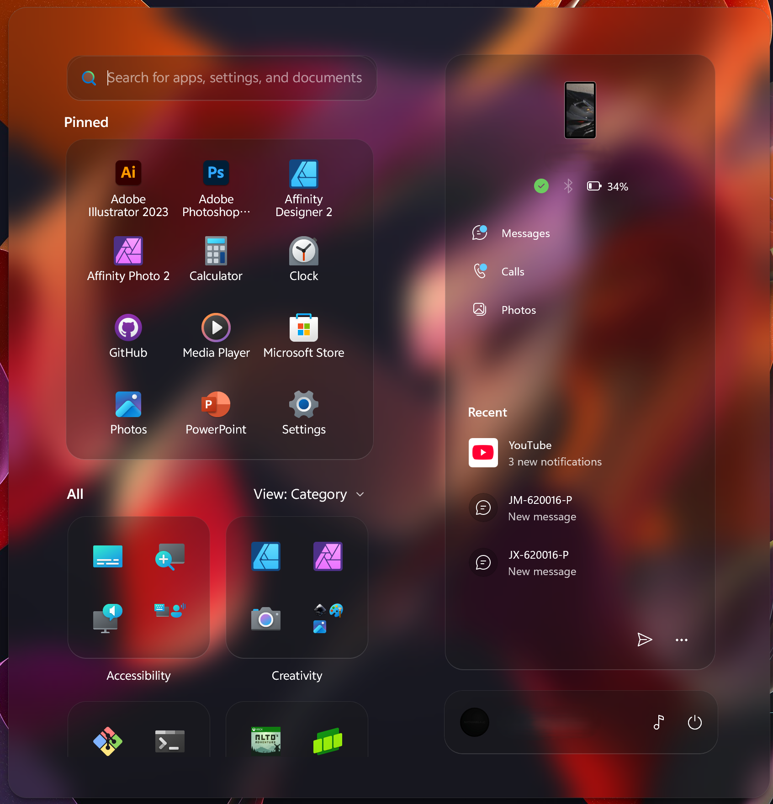
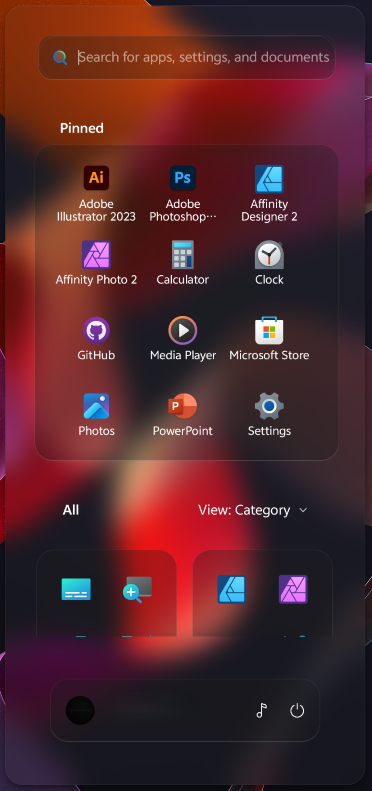

# WindowGlass theme for Windows 11 Start Menu Styler

A theme that adds a modern, glassy aesthetic with a compact layout to the Windows 11 Start menu.

**Author**: [Nathaniel4JC](https://github.com/Nathaniel4JC)

## Left/center-aligned


> [!IMPORTANT]
> This theme is made for the [redesigned Windows 11 Start menu](https://microsoft.design/articles/start-fresh-redesigning-windows-start-menu/) that is slowly rolling out in the 25H2 update.

## Notes
- This theme works best on Windows 11 **25H2** and later.
- Works best on devices with a screen resolution of 1930x1200 and above.
- This theme currently works on displays with a resolution **above** 1366x768.
- This theme places the start menu horizontally centered on the screen, regardless of whether the taskbar icons are centered or left aligned.
- This theme combines the start menu with the Phone Link panel and will only work on the 'New Windows 11 Start Menu'
- This theme consists of **three** backgrounds:
    - Glass
    - Frosted
    - Acrylic
  - In order to switch between these backgrounds, replace the value for "Background" with "$Glass", "$Frosted" or "$Acrylic".

## Bonus
- This theme can style your lock screen as well. 

## Lock Screen
 

To make it work, you'll need to:
- Add 'LockApp.exe' to the 'Custom process inclusion list' under 'Advanced settings' in the Windows 11 Start Menu Styler mod.
- Install the [Vivo Sans En VF](https://1drv.ms/u/c/67fedd4420ed716d/EXRoW1f5dABJrO2dPj0tbM0Bm1uYiGeoKyAYA7X7er2Zww?e=cLsiJJ) and [Vivo Sans Clock Stencil](https://1drv.ms/u/c/67fedd4420ed716d/EW6LJO1CAu1Fs-khbTGXWFUB5sXhRxM-I__B1lkKWgizdA?e=J1RJYy) fonts.

## More details about this theme
- Designed for Windows 11 24H2.
- Compatible with both light and dark modes.

## For a complete WindowGlass-themed UI, download the following mods and use the 'WindowGlass' theme:
- Windows 11 Taskbar Styler - for styling the taskbar.
- Windows 11 Notification Center Styler - for styling the Notification Center and Action Center.
- Windows 11 File Explorer Styler - for styling Windows Explorer windows.

---

## Theme selection

The theme is integrated into the mod and can simply be selected from the mod's
settings:

* Open the Windows 11 Start Menu Styler mod in Windhawk.
* Go to the "Settings" tab.
* Select the theme and save the settings.

## Manual installation

The theme styles can also be imported manually. To do that, follow these steps:

* Open the Windows 11 Start Menu Styler mod in Windhawk.
* Go to the "Advanced" tab.
* Copy the content below to the text box under "Mod settings" and click "Save".

<details>
<summary>Content to import (click to expand)</summary>

```json
{
  "controlStyles[0].target": "Border#AcrylicOverlay",
  "controlStyles[0].styles[0]": "Margin=0",
  "controlStyles[0].styles[1]": "BorderThickness=0",
  "controlStyles[0].styles[2]": "CornerRadius=10",
  "controlStyles[0].styles[3]": "Visibility=Collapsed",
  "controlStyles[1].target": "Border#AcrylicBorder",
  "controlStyles[1].styles[0]": "Background:=$Glass",
  "controlStyles[1].styles[1]": "CornerRadius=$CornerRadius",
  "controlStyles[1].styles[2]": "BorderThickness=$BorderThickness",
  "controlStyles[1].styles[3]": "BorderBrush:=$BorderBrush",
  "controlStyles[2].target": "StartMenu.SearchBoxToggleButton#SearchBoxToggleButton",
  "controlStyles[2].styles[0]": "Visibility=Visible",
  "controlStyles[2].styles[1]": "Width=340",
  "controlStyles[2].styles[2]": "Height=50",
  "controlStyles[2].styles[3]": "RenderTransform:=<TranslateTransform X=\"-185\" Y=\"35\"/>",
  "controlStyles[2].styles[4]": "Margin=0,-30,0,-50",
  "controlStyles[3].target": "Windows.UI.Xaml.Controls.Border#AppBorder",
  "controlStyles[3].styles[0]": "Background:=$Glass",
  "controlStyles[3].styles[1]": "BorderBrush:=$BorderBrush",
  "controlStyles[3].styles[2]": "BorderThickness=$BorderThickness",
  "controlStyles[4].target": "Windows.UI.Xaml.Controls.Border#AppBorder",
  "controlStyles[4].styles[0]": "Background:=$Glass",
  "controlStyles[4].styles[1]": "BorderBrush:=$BorderBrush",
  "controlStyles[4].styles[2]": "BorderThickness=$BorderThickness",
  "controlStyles[4].styles[3]": "CornerRadius=$CornerRadius",
  "controlStyles[5].target": "Windows.UI.Xaml.Controls.Border#BorderElement",
  "controlStyles[5].styles[0]": "Background:=Transparent",
  "controlStyles[5].styles[1]": "BorderBrush:=Transparent",
  "controlStyles[6].target": "StartMenu.CategoryControl > Windows.UI.Xaml.Controls.Grid#RootGrid > Windows.UI.Xaml.Controls.Border ",
  "controlStyles[6].styles[0]": "BorderThickness=$ElementBorderThickness",
  "controlStyles[6].styles[3]": "Background:=$ElementBG",
  "controlStyles[6].styles[1]": "CornerRadius=$ElementCornerRadius",
  "controlStyles[6].styles[2]": "BorderBrush:=$ElementBorderBrush",
  "controlStyles[7].target": "Windows.UI.Xaml.Controls.Border#BorderUnderline",
  "controlStyles[7].styles[0]": "Visibility=Visible",
  "controlStyles[8].target": "StackPanel#TimeAndDatePanel",
  "controlStyles[8].styles[0]": "VerticalAlignment=Top",
  "controlStyles[8].styles[1]": "HorizontalAlignment=Center",
  "controlStyles[8].styles[2]": "RenderTransform:=<TranslateTransform X=\"0\" />",
  "controlStyles[9].target": "StackPanel#TimePanel > TextBlock#Time",
  "controlStyles[9].styles[0]": "HorizontalAlignment=Center",
  "controlStyles[9].styles[1]": "RenderTransform:=<TranslateTransform X=\"0\" Y=\"50\" />",
  "controlStyles[9].styles[2]": "FontFamily=vivo Sans Clock Inline Regular",
  "controlStyles[9].styles[3]": "Foreground:=$ClockBG",
  "controlStyles[10].target": "StackPanel#TimeAndDatePanel > TextBlock#Date",
  "controlStyles[10].styles[0]": "HorizontalAlignment=Center",
  "controlStyles[10].styles[1]": "RenderTransform:=<TranslateTransform X=\"0\" Y=\"-150\" />",
  "controlStyles[10].styles[2]": "FontFamily=vivo Sans EN VF",
  "controlStyles[10].styles[3]": "Foreground:=$ClockBG",
  "controlStyles[11].target": "Windows.UI.Xaml.Controls.Grid#WidgetFrameGrid",
  "controlStyles[11].styles[0]": "Background:=$Glass",
  "controlStyles[11].styles[1]": "BorderBrush:=$BorderBrush",
  "controlStyles[11].styles[2]": "BorderThickness=$BorderThickness",
  "controlStyles[11].styles[3]": "CornerRadius=$CornerRadius",
  "controlStyles[12].target": "Windows.UI.Xaml.Controls.Grid#WidgetCanvasPanel",
  "controlStyles[12].styles[0]": "HorizontalAlignment=Center",
  "controlStyles[12].styles[1]": "RenderTransform:=<TranslateTransform X=\"0\" Y=\"50\" />",
  "controlStyles[13].target": "Windows.UI.Xaml.Controls.Grid#MediaTransportControls",
  "controlStyles[13].styles[0]": "Background:=$Glass",
  "controlStyles[13].styles[1]": "BorderBrush:=$BorderBrush",
  "controlStyles[13].styles[2]": "BorderThickness=$BorderThickness",
  "controlStyles[13].styles[3]": "CornerRadius=$CornerRadius",
  "controlStyles[14].target": "Windows.UI.Xaml.Controls.Grid#MediaControlsContainer",
  "controlStyles[14].styles[0]": "Visibility=Visible",
  "controlStyles[14].styles[1]": "RenderTransform:=<TranslateTransform X=\"0\" Y=\"-785\" />",
  "controlStyles[14].styles[2]": "Margin=0,0,0,0",
  "controlStyles[14].styles[3]": "CornerRadius=$CornerRadius",
  "controlStyles[15].target": "Windows.UI.Xaml.Controls.Border#BorderElement",
  "controlStyles[15].styles[0]": "CornerRadius=$CornerRadius",
  "controlStyles[16].target": "Windows.UI.Xaml.Controls.Primitives.ToggleButton#ShowHideCompanion",
  "controlStyles[16].styles[0]": "RenderTransform:=<TranslateTransform X=\"-120\" />",
  "controlStyles[16].styles[1]": "Visibility=1",
  "controlStyles[17].target": "Windows.UI.Xaml.Controls.Grid#CompanionRoot > Windows.UI.Xaml.Controls.Border#AcrylicOverlay",
  "controlStyles[17].styles[0]": "BorderThickness=0",
  "controlStyles[18].target": "Windows.UI.Xaml.Controls.Grid#Root > Windows.UI.Xaml.Controls.Border",
  "controlStyles[18].styles[0]": "BorderBrush:=$BorderBrush",
  "controlStyles[18].styles[1]": "Background:=$Glass",
  "controlStyles[18].styles[2]": "BorderThickness=$BorderThickness",
  "controlStyles[18].styles[3]": "CornerRadius=$CornerRadius",
  "controlStyles[19].target": "Windows.UI.Xaml.Controls.Border#StartDropShadow",
  "controlStyles[19].styles[0]": "CornerRadius=$CornerRadius",
  "controlStyles[20].target": "Windows.UI.Xaml.Controls.Border#RightCompanionDropShadow",
  "controlStyles[20].styles[0]": "CornerRadius=$CornerRadius",
  "controlStyles[20].styles[1]": "Visibility=1",
  "controlStyles[21].target": "Windows.UI.Xaml.Controls.Grid#DroppedFlickerWorkaroundWrapper > Windows.UI.Xaml.Controls.Border#BackgroundBorder",
  "controlStyles[21].styles[0]": "Background@PointerOver:=$Glass",
  "controlStyles[21].styles[1]": "Background@Pressed:=$Glass",
  "controlStyles[21].styles[2]": "Background@Selected:=$Glass",
  "controlStyles[22].target": "Windows.UI.Xaml.Controls.Border#BackgroundBorder",
  "controlStyles[22].styles[0]": "CornerRadius=10",
  "controlStyles[23].target": "Windows.UI.Xaml.Controls.Grid#ContentBorder",
  "controlStyles[23].styles[0]": "CornerRadius=10",
  "controlStyles[24].target": "Windows.UI.Xaml.Controls.Border#LayerBorder",
  "controlStyles[24].styles[0]": "CornerRadius=$CornerRadius",
  "controlStyles[25].target": "Windows.UI.Xaml.Controls.Grid#OuterBorderGrid",
  "controlStyles[25].styles[0]": "CornerRadius=$CornerRadius",
  "controlStyles[26].target": "Windows.UI.Xaml.Controls.Grid#MainMenu",
  "controlStyles[26].styles[0]": "",
  "controlStyles[27].target": "Windows.UI.Xaml.PopupRoot",
  "controlStyles[27].styles[0]": "CornerRadius=$CornerRadius",
  "controlStyles[28].target": "Windows.UI.Xaml.Controls.ContentPresenter#ZoomedInPresenter > Windows.UI.Xaml.Controls.GridView#AllAppsGrid > Windows.UI.Xaml.Controls.Border > Windows.UI.Xaml.Controls.ScrollViewer#ScrollViewer > Windows.UI.Xaml.Controls.Border#Root > Windows.UI.Xaml.Controls.Grid > Windows.UI.Xaml.Controls.ScrollContentPresenter#ScrollContentPresenter > Windows.UI.Xaml.Controls.ItemsPresenter > Windows.UI.Xaml.Controls.ItemsWrapGrid",
  "controlStyles[28].styles[0]": "MaximumRowsOrColumns=2",
  "controlStyles[29].target": "Windows.UI.Xaml.Controls.Grid#RightCompanionContainerGrid",
  "controlStyles[29].styles[0]": "Margin=-420,142,0,50",
  "controlStyles[29].styles[1]": "RenderTransform:=<TranslateTransform X=\"0\" Y=\"-90\" />",
  "controlStyles[29].styles[2]": "Width=300",
  "controlStyles[29].styles[3]": "Height=Auto",
  "controlStyles[29].styles[4]": "MaxHeight:=700",
  "controlStyles[29].styles[5]": "MinHeight:=300",
  "controlStyles[30].target": "StartMenu.PinnedList#StartMenuPinnedList",
  "controlStyles[30].styles[0]": "Visibility=0",
  "controlStyles[30].styles[1]": "Margin=30,0,25,0",
  "controlStyles[30].styles[2]": "RenderTransform:=<TranslateTransform X=\"-0\" Y=\"0\" />",
  "controlStyles[30].styles[3]": "Height=Auto",
  "controlStyles[30].styles[4]": "MinHeight:=200",
  "controlStyles[30].styles[5]": "MaxHeight:=1000",
  "controlStyles[31].target": "Windows.UI.Xaml.Controls.TextBlock#PinnedListHeaderText",
  "controlStyles[31].styles[0]": "Visibility=0",
  "controlStyles[31].styles[1]": "Margin=0",
  "controlStyles[31].styles[2]": "RenderTransform:=<TranslateTransform X=\"60\" Y=\"-10\" />",
  "controlStyles[32].target": "Microsoft.UI.Xaml.Controls.DropDownButton#ViewSelectionButton",
  "controlStyles[32].styles[0]": "RenderTransform:=<TranslateTransform X=\"0\" Y=\"0\" />",
  "controlStyles[33].target": "Windows.UI.Xaml.Controls.Grid#NavPanePlaceholder",
  "controlStyles[33].styles[0]": "Width=Auto",
  "controlStyles[33].styles[1]": "RenderTransform:=<TranslateTransform X=\"0\" Y=\"0\" />",
  "controlStyles[33].styles[2]": "Background:=$ElementBG",
  "controlStyles[33].styles[3]": "BorderBrush:=$ElementBorderBrush",
  "controlStyles[33].styles[4]": "CornerRadius=$ElementCornerRadius",
  "controlStyles[33].styles[5]": "BorderThickness=$ElementBorderThickness",
  "controlStyles[33].styles[6]": "Height=70",
  "controlStyles[33].styles[7]": "Padding=5",
  "controlStyles[33].styles[8]": "Margin=420,-100,0,0",
  "controlStyles[33].styles[9]": "MaxWidth:=300",
  "controlStyles[33].styles[10]": "MinWidth:=200",
  "controlStyles[34].target": "Windows.UI.Xaml.Controls.Primitives.ScrollBar#VerticalScrollBar",
  "controlStyles[34].styles[0]": "RenderTransform:=<TranslateTransform X=\"0\" Y=\"0\" />",
  "controlStyles[35].target": "StartMenu.PinnedList#StartMenuPinnedList > Windows.UI.Xaml.Controls.Grid#Root > Windows.UI.Xaml.Controls.GridView#PinnedList > Windows.UI.Xaml.Controls.Border",
  "controlStyles[35].styles[0]": "Background:=$ElementBG",
  "controlStyles[35].styles[1]": "BorderBrush:=$ElementBorderBrush",
  "controlStyles[35].styles[2]": "CornerRadius=$CornerRadius",
  "controlStyles[35].styles[3]": "BorderThickness=$ElementBorderThickness",
  "controlStyles[35].styles[4]": "Padding:=20,10,0,10",
  "controlStyles[36].target": "Windows.UI.Xaml.Controls.Grid#TopLevelHeader > Windows.UI.Xaml.Controls.Grid > Windows.UI.Xaml.Controls.Button",
  "controlStyles[36].styles[0]": "RenderTransform:=<TranslateTransform X=\"0\" Y=\"-5\" />",
  "controlStyles[37].target": "StartMenu.PinnedListTile > Windows.UI.Xaml.Controls.Grid#Root > Windows.UI.Xaml.Controls.Grid#DisplayNameAndDownloadIconContainer > Windows.UI.Xaml.Controls.TextBlock",
  "controlStyles[37].styles[0]": "Visibility=0",
  "controlStyles[38].target": "StartMenu.StartHome > Windows.UI.Xaml.Controls.Grid#PageRoot",
  "controlStyles[38].styles[0]": "Margin=190,40,190,0",
  "controlStyles[38].styles[1]": "RenderTransform:=<TranslateTransform X=\"-190\" Y=\"0\" />",
  "controlStyles[38].styles[2]": "Padding=0,0,0-20",
  "controlStyles[39].target": "StartMenu.StartMenuCompanion#RightCompanion > Windows.UI.Xaml.Controls.Grid#CompanionRoot > Windows.UI.Xaml.Controls.Border#AcrylicBorder",
  "controlStyles[39].styles[0]": "Background:=$ElementBG",
  "controlStyles[39].styles[1]": "BorderBrush:=$ElementBorderBrush",
  "controlStyles[39].styles[2]": "BorderThickness=$ElementBorderThickness",
  "controlStyles[39].styles[3]": "CornerRadius=$ElementCornerRadius",
  "controlStyles[40].target": "Windows.UI.Xaml.Controls.Grid#TopLevelHeader > Windows.UI.Xaml.Controls.Grid > Windows.UI.Xaml.Controls.Button",
  "controlStyles[40].styles[0]": "Visibility=1",
  "controlStyles[41].target": "Windows.UI.Xaml.Controls.MenuFlyoutPresenter > Windows.UI.Xaml.Controls.Border",
  "controlStyles[41].styles[0]": "BorderBrush:=$BorderBrush",
  "controlStyles[41].styles[1]": "Background:=$Glass",
  "controlStyles[41].styles[2]": "CornerRadius=15",
  "controlStyles[41].styles[3]": "BorderThickness=$BorderThickness",
  "controlStyles[42].target": "Windows.UI.Xaml.Controls.ToolTip > Windows.UI.Xaml.Controls.ContentPresenter#LayoutRoot",
  "controlStyles[42].styles[0]": "Background:=$Glass",
  "controlStyles[42].styles[1]": "BorderBrush:=$BorderBrush",
  "controlStyles[42].styles[2]": "BorderThickness=$BorderThickness",
  "controlStyles[42].styles[3]": "CornerRadius=15",
  "controlStyles[43].target": "Windows.UI.Xaml.Controls.Button#AddButton",
  "controlStyles[43].styles[0]": "Background:=$Glass",
  "controlStyles[43].styles[1]": "BorderBrush:=$BorderBrush",
  "controlStyles[43].styles[2]": "BorderThickness=$BorderThickness",
  "controlStyles[43].styles[3]": "CornerRadius=15",
  "controlStyles[44].target": "StartMenu.StartBlendedFlexFrame",
  "controlStyles[44].styles[0]": "Width=Auto",
  "controlStyles[44].styles[1]": "MaxWidth:=860",
  "controlStyles[44].styles[2]": "MinWidth:=500",
  "controlStyles[45].target": "Windows.UI.Xaml.Controls.GridView#PinnedList > Border > Windows.UI.Xaml.Controls.ScrollViewer",
  "controlStyles[45].styles[0]": "ScrollViewer.VerticalScrollMode=2",
  "controlStyles[45].styles[1]": "MaxHeight:=330",
  "controlStyles[45].styles[2]": "MinHeight:=100",
  "controlStyles[45].styles[3]": "Height=Auto",
  "controlStyles[46].target": "Windows.UI.Xaml.Controls.GridView#PinnedList > Border > Windows.UI.Xaml.Controls.ScrollViewer",
  "controlStyles[46].styles[0]": "ScrollViewer.VerticalScrollMode=2",
  "controlStyles[46].styles[1]": "MaxHeight:=330",
  "controlStyles[46].styles[2]": "MinHeight:=100",
  "controlStyles[46].styles[3]": "Height=Auto",
  "controlStyles[47].target": "StartMenu.CategoryControl",
  "controlStyles[47].styles[0]": "MaxWidth:=200",
  "controlStyles[47].styles[1]": "MinWidth:=100",
  "controlStyles[47].styles[2]": "Width=Auto",
  "controlStyles[47].styles[3]": "Margin=0,0,-10,0",
  "controlStyles[48].target": "Windows.UI.Xaml.Controls.GridViewHeaderItem > Windows.UI.Xaml.Controls.Border > Windows.UI.Xaml.Controls.ContentPresenter#ContentPresenter > Windows.UI.Xaml.Controls.Button#Header > Windows.UI.Xaml.Controls.Border#Border",
  "controlStyles[48].styles[0]": "CornerRadius=10",
  "controlStyles[49].target": "StartMenu.FolderModal#StartFolderModal > Windows.UI.Xaml.Controls.Grid#Root",
  "controlStyles[49].styles[0]": "MaxHeight:=420",
  "controlStyles[49].styles[1]": "MaxWidth:=420",
  "controlStyles[49].styles[2]": "Height=Auto",
  "controlStyles[49].styles[3]": "Width=Auto",
  "controlStyles[50].target": "StartMenu.FolderModal#StartFolderModal > Windows.UI.Xaml.Controls.Grid#Root > Windows.UI.Xaml.Controls.ContentControl#ContentControl > Windows.UI.Xaml.Controls.ContentPresenter > StartMenu.UniversalTileContainer#UniversalTileContainer > Windows.UI.Xaml.Controls.Grid#GridViewContainer",
  "controlStyles[50].styles[0]": "Width=400",
  "controlStyles[50].styles[1]": "Height=400",
  "controlStyles[51].target": "StartMenu.SearchBoxToggleButton#SearchBoxToggleButton > Windows.UI.Xaml.Controls.Grid",
  "controlStyles[51].styles[0]": "Background:=$ElementBG",
  "controlStyles[51].styles[1]": "BorderBrush:=$ElementBorderBrush",
  "controlStyles[51].styles[2]": "BorderThickness=$ElementBorderThickness",
  "controlStyles[51].styles[3]": "CornerRadius=20",
  "controlStyles[52].target": "Cortana.UI.Views.TaskbarSearchPage",
  "controlStyles[52].styles[0]": "Width=700",
  "controlStyles[52].styles[1]": "Height=700",
  "controlStyles[52].styles[2]": "Margin=10",
  "disableNewStartMenuLayout": 0,
  "webContentStyles[0].target": "",
  "webContentStyles[0].styles[0]": "",
  "resourceVariables[0].variableKey": "",
  "resourceVariables[0].value": "",
  "styleConstants[0]": "Glass=<WindhawkBlur BlurAmount=\"3\" TintColor=\"{ThemeResource SystemChromeMediumColor}\" TintOpacity=\"0.7\" />",
  "styleConstants[1]": "Frosted=<WindhawkBlur BlurAmount=\"20\" TintColor=\"{ThemeResource SystemChromeMediumColor}\" TintOpacity=\"0.7\" />",
  "styleConstants[2]": "Acrylic=<AcrylicBrush TintColor=\"{ThemeResource SystemChromeMediumColor}\" TintOpacity=\"0\" FallbackColor=\"{ThemeResource SystemChromeMediumColor}\" />",
  "styleConstants[3]": "BorderBrush=<LinearGradientBrush StartPoint=\"0,0\" EndPoint=\"0,1\"><GradientStop Color=\"#50808080\" Offset=\"0.0\" /><GradientStop Color=\"#50404040\" Offset=\"0.25\" /><GradientStop Color=\"#50808080\" Offset=\"1\" /></LinearGradientBrush>",
  "styleConstants[4]": "BorderBrush2=<WindhawkBlur BlurAmount=\"10\" TintColor=\"#909090\" TintOpacity=\"0.3\"/>",
  "styleConstants[5]": "ClockBG=<WindhawkBlur BlurAmount=\"15\" TintColor=\"{ThemeResource SystemAccentColorLight2}\" TintOpacity=\"0.3\" />",
  "styleConstants[6]": "BorderThickness=0.3,1,0.3,1",
  "styleConstants[7]": "CornerRadius=25",
  "styleConstants[8]": "SearchBoxRadius=15",
  "styleConstants[9]": "ElementBG=<SolidColorBrush Color=\"{ThemeResource SystemChromeAltHighColor}\" Opacity=\"0.3\" />",
  "styleConstants[10]": "ElementBorderThickness=0.3,0.3,0.3,1",
  "styleConstants[11]": "ElementCornerRadius=20",
  "styleConstants[12]": "ElementBorderBrush=<LinearGradientBrush StartPoint=\"0,0\" EndPoint=\"0,1\"><GradientStop Color=\"#50808080\" Offset=\"1\" /><GradientStop Color=\"#50606060\" Offset=\"0.15\" /></LinearGradientBrush>",
  "styleConstants[13]": "ElementBorderBrush2=<WindhawkBlur BlurAmount=\"30\" TintColor=\"#909090\" TintOpacity=\"0.3\"/>",
  "theme": "",
  "webContentCustomJs": ""
}
```
</details>

## Additional theme variant
This theme also includes a minimal version of the Start menu with the Phone Link companion removed.


<details>
<summary>Content to import (click to expand)</summary>

```json
{
  "controlStyles[0].target": "Border#AcrylicOverlay",
  "controlStyles[0].styles[0]": "Margin=0",
  "controlStyles[0].styles[1]": "BorderThickness=0",
  "controlStyles[0].styles[2]": "CornerRadius=10",
  "controlStyles[0].styles[3]": "Visibility=Collapsed",
  "controlStyles[1].target": "Border#AcrylicBorder",
  "controlStyles[1].styles[0]": "Background:=$Glass",
  "controlStyles[1].styles[1]": "CornerRadius=$CornerRadius",
  "controlStyles[1].styles[2]": "BorderThickness=$BorderThickness",
  "controlStyles[1].styles[3]": "BorderBrush:=$BorderBrush",
  "controlStyles[2].target": "StartMenu.SearchBoxToggleButton#SearchBoxToggleButton",
  "controlStyles[2].styles[0]": "Visibility=Visible",
  "controlStyles[2].styles[1]": "Width=330",
  "controlStyles[2].styles[2]": "Height=50",
  "controlStyles[2].styles[3]": "RenderTransform:=<TranslateTransform X=\"0\" Y=\"30\"/>",
  "controlStyles[2].styles[4]": "Margin=0,-10,0,20",
  "controlStyles[3].target": "Windows.UI.Xaml.Controls.Border#AppBorder",
  "controlStyles[3].styles[0]": "Background:=$Glass",
  "controlStyles[3].styles[1]": "BorderBrush:=$BorderBrush",
  "controlStyles[3].styles[2]": "BorderThickness=$BorderThickness",
  "controlStyles[4].target": "StartMenu.SearchBoxToggleButton#SearchBoxToggleButton > Windows.UI.Xaml.Controls.Grid > Windows.UI.Xaml.Controls.Border#BorderElement",
  "controlStyles[4].styles[0]": "BorderThickness=$BorderThickness",
  "controlStyles[4].styles[1]": "CornerRadius=$CornerRadius",
  "controlStyles[5].target": "Windows.UI.Xaml.Controls.Border#AppBorder",
  "controlStyles[5].styles[0]": "Background:=$Glass",
  "controlStyles[5].styles[1]": "BorderBrush:=$BorderBrush",
  "controlStyles[5].styles[2]": "BorderThickness=$BorderThickness",
  "controlStyles[5].styles[3]": "CornerRadius=$CornerRadius",
  "controlStyles[6].target": "Cortana.UI.Views.RichSearchBoxControl#SearchBoxControl",
  "controlStyles[6].styles[0]": "Width=500",
  "controlStyles[6].styles[1]": "RenderTransform:=<TranslateTransform X=\"-120\" />",
  "controlStyles[7].target": "Windows.UI.Xaml.Controls.Border#BorderElement",
  "controlStyles[7].styles[0]": "Background=Transparent",
  "controlStyles[7].styles[1]": "BorderThickness=$BorderThickness",
  "controlStyles[8].target": "StartMenu.CategoryControl > Windows.UI.Xaml.Controls.Grid#RootGrid > Windows.UI.Xaml.Controls.Border ",
  "controlStyles[8].styles[0]": "BorderThickness=$ElementBorderThickness",
  "controlStyles[8].styles[1]": "CornerRadius=$ElementCornerRadius",
  "controlStyles[8].styles[2]": "BorderBrush:=$ElementBorderBrush",
  "controlStyles[8].styles[3]": "Background:=$ElementBG",
  "controlStyles[9].target": "Windows.UI.Xaml.Controls.Border#BorderUnderline",
  "controlStyles[9].styles[0]": "Visibility=Visible",
  "controlStyles[10].target": "StackPanel#TimeAndDatePanel",
  "controlStyles[10].styles[0]": "VerticalAlignment=Top",
  "controlStyles[10].styles[1]": "HorizontalAlignment=Center",
  "controlStyles[10].styles[2]": "RenderTransform:=<TranslateTransform X=\"0\" />",
  "controlStyles[11].target": "StackPanel#TimePanel > TextBlock#Time",
  "controlStyles[11].styles[0]": "HorizontalAlignment=Center",
  "controlStyles[11].styles[1]": "RenderTransform:=<TranslateTransform X=\"0\" Y=\"0\" />",
  "controlStyles[11].styles[2]": "FontFamily=vivo Sans Clock Stencil Regular",
  "controlStyles[11].styles[3]": "Foreground:=$ClockBG",
  "controlStyles[11].styles[4]": "Margin=0,50,0,0",
  "controlStyles[11].styles[5]": "VerticalAlignment=Center",
  "controlStyles[12].target": "StackPanel#TimeAndDatePanel > TextBlock#Date",
  "controlStyles[12].styles[0]": "HorizontalAlignment=Center",
  "controlStyles[12].styles[1]": "RenderTransform:=<TranslateTransform X=\"0\" Y=\"0\" />",
  "controlStyles[12].styles[2]": "FontFamily=vivo Sans EN VF",
  "controlStyles[12].styles[3]": "Foreground:=$ClockBG",
  "controlStyles[12].styles[4]": "Margin=0,-180,0,180",
  "controlStyles[12].styles[5]": "VerticalAlignment=Center",
  "controlStyles[13].target": "Windows.UI.Xaml.Controls.Grid#WidgetFrameGrid",
  "controlStyles[13].styles[0]": "Background:=$Glass",
  "controlStyles[13].styles[1]": "BorderBrush:=$BorderBrush",
  "controlStyles[13].styles[2]": "BorderThickness=$BorderThickness",
  "controlStyles[13].styles[3]": "CornerRadius=$CornerRadius",
  "controlStyles[14].target": "Windows.UI.Xaml.Controls.Grid#WidgetCanvasPanel",
  "controlStyles[14].styles[0]": "HorizontalAlignment=Center",
  "controlStyles[14].styles[1]": "RenderTransform:=<TranslateTransform X=\"0\" Y=\"50\" />",
  "controlStyles[15].target": "Windows.UI.Xaml.Controls.Grid#MediaTransportControls",
  "controlStyles[15].styles[0]": "Background:=$Glass",
  "controlStyles[15].styles[1]": "BorderBrush:=$BorderBrush",
  "controlStyles[15].styles[2]": "BorderThickness=$BorderThickness",
  "controlStyles[15].styles[3]": "CornerRadius=$CornerRadius",
  "controlStyles[16].target": "Windows.UI.Xaml.Controls.Grid#MediaControlsContainer",
  "controlStyles[16].styles[0]": "Visibility=Visible",
  "controlStyles[16].styles[1]": "RenderTransform:=<TranslateTransform X=\"0\" Y=\"0\" />",
  "controlStyles[16].styles[2]": "Margin=0,-800,0,800",
  "controlStyles[16].styles[3]": "CornerRadius=$CornerRadius",
  "controlStyles[16].styles[4]": "VerticalAlignment=Center",
  "controlStyles[16].styles[5]": "HorizontalAlignment=Center",
  "controlStyles[17].target": "Windows.UI.Xaml.Controls.Border#BorderElement",
  "controlStyles[17].styles[0]": "CornerRadius=$CornerRadius",
  "controlStyles[18].target": "Windows.UI.Xaml.Controls.Primitives.ToggleButton#ShowHideCompanion",
  "controlStyles[18].styles[0]": "RenderTransform:=<TranslateTransform X=\"-120\" />",
  "controlStyles[18].styles[1]": "Visibility=Collapsed",
  "controlStyles[19].target": "Windows.UI.Xaml.Controls.Grid#CompanionRoot > Windows.UI.Xaml.Controls.Border#AcrylicOverlay",
  "controlStyles[19].styles[0]": "BorderThickness=0",
  "controlStyles[19].styles[1]": "Visibility=Collapsed",
  "controlStyles[20].target": "Windows.UI.Xaml.Controls.Grid#Root > Windows.UI.Xaml.Controls.Border",
  "controlStyles[20].styles[0]": "BorderBrush:=$BorderBrush",
  "controlStyles[20].styles[1]": "Background:=$Glass",
  "controlStyles[20].styles[2]": "BorderThickness=$BorderThickness",
  "controlStyles[20].styles[3]": "CornerRadius=$CornerRadius",
  "controlStyles[21].target": "Windows.UI.Xaml.Controls.Border#StartDropShadow",
  "controlStyles[21].styles[0]": "CornerRadius=$CornerRadius",
  "controlStyles[22].target": "Windows.UI.Xaml.Controls.Border#RightCompanionDropShadow",
  "controlStyles[22].styles[0]": "CornerRadius=$CornerRadius",
  "controlStyles[22].styles[1]": "Visibility=1",
  "controlStyles[23].target": "Windows.UI.Xaml.Controls.Grid#DroppedFlickerWorkaroundWrapper > Windows.UI.Xaml.Controls.Border#BackgroundBorder",
  "controlStyles[23].styles[0]": "Background@PointerOver:=$Glass",
  "controlStyles[23].styles[1]": "Background@Pressed:=$Glass",
  "controlStyles[23].styles[2]": "Background@Selected:=$Glass",
  "controlStyles[24].target": "Windows.UI.Xaml.Controls.Border#BackgroundBorder",
  "controlStyles[24].styles[0]": "CornerRadius=10",
  "controlStyles[25].target": "Windows.UI.Xaml.Controls.Grid#ContentBorder",
  "controlStyles[25].styles[0]": "CornerRadius=10",
  "controlStyles[26].target": "Windows.UI.Xaml.Controls.Border#LayerBorder",
  "controlStyles[26].styles[0]": "CornerRadius=$CornerRadius",
  "controlStyles[27].target": "Windows.UI.Xaml.Controls.Grid#OuterBorderGrid",
  "controlStyles[27].styles[0]": "CornerRadius=$CornerRadius",
  "controlStyles[28].target": "Windows.UI.Xaml.Controls.Grid#MainMenu",
  "controlStyles[28].styles[0]": "// Unused",
  "controlStyles[29].target": "Windows.UI.Xaml.PopupRoot",
  "controlStyles[29].styles[0]": "CornerRadius=$CornerRadius",
  "controlStyles[30].target": "Windows.UI.Xaml.Controls.ContentPresenter#ZoomedInPresenter > Windows.UI.Xaml.Controls.GridView#AllAppsGrid > Windows.UI.Xaml.Controls.Border > Windows.UI.Xaml.Controls.ScrollViewer#ScrollViewer > Windows.UI.Xaml.Controls.Border#Root > Windows.UI.Xaml.Controls.Grid > Windows.UI.Xaml.Controls.ScrollContentPresenter#ScrollContentPresenter > Windows.UI.Xaml.Controls.ItemsPresenter > Windows.UI.Xaml.Controls.ItemsWrapGrid",
  "controlStyles[30].styles[0]": "MaximumRowsOrColumns=2",
  "controlStyles[30].styles[1]": "Margin=5,-95,5,0",
  "controlStyles[30].styles[2]": "Width=Auto",
  "controlStyles[30].styles[3]": "MinWidth:=100",
  "controlStyles[30].styles[4]": "MaxWidth:=350",
  "controlStyles[31].target": "Windows.UI.Xaml.Controls.Grid#RightCompanionContainerGrid",
  "controlStyles[31].styles[0]": "Visibility=Collapsed",
  "controlStyles[32].target": "StartMenu.PinnedList#StartMenuPinnedList",
  "controlStyles[32].styles[0]": "Visibility=0",
  "controlStyles[32].styles[1]": "Margin=0,0,0,65",
  "controlStyles[32].styles[2]": "RenderTransform:=<TranslateTransform X=\"-0\" Y=\"0\" />",
  "controlStyles[32].styles[3]": "Height=Auto",
  "controlStyles[32].styles[4]": "MinHeight:=200",
  "controlStyles[32].styles[5]": "MaxHeight:=1000",
  "controlStyles[33].target": "Windows.UI.Xaml.Controls.TextBlock#PinnedListHeaderText",
  "controlStyles[33].styles[0]": "Visibility=0",
  "controlStyles[33].styles[1]": "Margin=0,10,0,0",
  "controlStyles[33].styles[2]": "RenderTransform:=<TranslateTransform X=\"60\" Y=\"-10\" />",
  "controlStyles[34].target": "Microsoft.UI.Xaml.Controls.DropDownButton#ViewSelectionButton",
  "controlStyles[34].styles[0]": "RenderTransform:=<TranslateTransform X=\"0\" Y=\"0\" />",
  "controlStyles[35].target": "Windows.UI.Xaml.Controls.Grid#NavPanePlaceholder",
  "controlStyles[35].styles[0]": "Width=Auto",
  "controlStyles[35].styles[1]": "RenderTransform:=<TranslateTransform X=\"0\" Y=\"0\" />",
  "controlStyles[35].styles[2]": "Background:=$ElementBG",
  "controlStyles[35].styles[3]": "BorderBrush:=$ElementBorderBrush",
  "controlStyles[35].styles[4]": "CornerRadius=$ElementCornerRadius",
  "controlStyles[35].styles[5]": "BorderThickness=$ElementBorderThickness",
  "controlStyles[35].styles[6]": "Height=70",
  "controlStyles[35].styles[7]": "Padding=5",
  "controlStyles[35].styles[8]": "Margin=0,-100,0,0",
  "controlStyles[35].styles[9]": "MaxWidth:=300",
  "controlStyles[35].styles[10]": "MinWidth=200",
  "controlStyles[36].target": "Windows.UI.Xaml.Controls.Primitives.ScrollBar#VerticalScrollBar",
  "controlStyles[36].styles[0]": "RenderTransform:=<TranslateTransform X=\"0\" Y=\"0\" />",
  "controlStyles[37].target": "StartMenu.PinnedList#StartMenuPinnedList > Windows.UI.Xaml.Controls.Grid#Root > Windows.UI.Xaml.Controls.GridView#PinnedList > Windows.UI.Xaml.Controls.Border",
  "controlStyles[37].styles[0]": "Background:=$ElementBG",
  "controlStyles[37].styles[1]": "BorderBrush:=$ElementBorderBrush",
  "controlStyles[37].styles[2]": "CornerRadius=$CornerRadius",
  "controlStyles[37].styles[3]": "BorderThickness=$ElementBorderThickness",
  "controlStyles[37].styles[4]": "Padding:=20,10,0,10",
  "controlStyles[38].target": "Windows.UI.Xaml.Controls.Grid#AllListHeading",
  "controlStyles[38].styles[0]": "RenderTransform:=<TranslateTransform X=\"0\" Y=\"-70\" />",
  "controlStyles[39].target": "StartMenu.PinnedListTile > Windows.UI.Xaml.Controls.Grid#Root > Windows.UI.Xaml.Controls.Grid#DisplayNameAndDownloadIconContainer > Windows.UI.Xaml.Controls.TextBlock",
  "controlStyles[39].styles[0]": "Visibility=0",
  "controlStyles[40].target": "StartMenu.StartHome",
  "controlStyles[40].styles[0]": "Margin=0,0,0,60",
  "controlStyles[40].styles[1]": "Padding=0",
  "controlStyles[41].target": "StartMenu.StartMenuCompanion#RightCompanion > Windows.UI.Xaml.Controls.Grid#CompanionRoot > Windows.UI.Xaml.Controls.Border#AcrylicBorder",
  "controlStyles[41].styles[0]": "Background:=$ElementBG",
  "controlStyles[41].styles[1]": "BorderBrush:=$ElementBorderBrush",
  "controlStyles[41].styles[2]": "BorderThickness=$ElementBorderThickness",
  "controlStyles[41].styles[3]": "CornerRadius=$ElementCornerRadius",
  "controlStyles[42].target": "Windows.UI.Xaml.Controls.Grid#TopLevelHeader > Windows.UI.Xaml.Controls.Grid > Windows.UI.Xaml.Controls.Button",
  "controlStyles[42].styles[0]": "Visibility=1",
  "controlStyles[43].target": "Windows.UI.Xaml.Controls.MenuFlyoutPresenter > Windows.UI.Xaml.Controls.Border",
  "controlStyles[43].styles[0]": "BorderBrush:=$BorderBrush",
  "controlStyles[43].styles[1]": "Background:=$Glass",
  "controlStyles[43].styles[2]": "CornerRadius=15",
  "controlStyles[43].styles[3]": "BorderThickness=$BorderThickness",
  "controlStyles[44].target": "Windows.UI.Xaml.Controls.ToolTip > Windows.UI.Xaml.Controls.ContentPresenter#LayoutRoot",
  "controlStyles[44].styles[0]": "Background:=$Glass",
  "controlStyles[44].styles[1]": "BorderBrush:=$BorderBrush",
  "controlStyles[44].styles[2]": "BorderThickness=$BorderThickness",
  "controlStyles[44].styles[3]": "CornerRadius=15",
  "controlStyles[45].target": "Windows.UI.Xaml.Controls.Button#AddButton",
  "controlStyles[45].styles[0]": "Background:=$Glass",
  "controlStyles[45].styles[1]": "BorderBrush:=$BorderBrush",
  "controlStyles[45].styles[2]": "BorderThickness=$BorderThickness",
  "controlStyles[45].styles[3]": "CornerRadius=15",
  "controlStyles[46].target": "Windows.UI.Xaml.Controls.Grid#MainMenu",
  "controlStyles[46].styles[0]": "MaxWidth:=400",
  "controlStyles[47].target": "Windows.UI.Xaml.Controls.GridView#PinnedList > Border > Windows.UI.Xaml.Controls.ScrollViewer",
  "controlStyles[47].styles[0]": "ScrollViewer.VerticalScrollMode=2",
  "controlStyles[47].styles[1]": "MaxHeight:=330",
  "controlStyles[47].styles[2]": "MinHeight:=100",
  "controlStyles[47].styles[3]": "Height=Auto",
  "controlStyles[48].target": "StartMenu.CategoryControl",
  "controlStyles[48].styles[0]": "MaxWidth:=200",
  "controlStyles[48].styles[1]": "MinWidth:=100",
  "controlStyles[48].styles[2]": "Width=Auto",
  "controlStyles[48].styles[3]": "Margin=10,40,-20,-40",
  "controlStyles[49].target": "Windows.UI.Xaml.Controls.GridViewHeaderItem > Windows.UI.Xaml.Controls.Border > Windows.UI.Xaml.Controls.ContentPresenter#ContentPresenter > Windows.UI.Xaml.Controls.Button#Header > Windows.UI.Xaml.Controls.Border#Border",
  "controlStyles[49].styles[0]": "CornerRadius=10",
  "controlStyles[50].target": "StartMenu.FolderModal#StartFolderModal > Windows.UI.Xaml.Controls.Grid#Root",
  "controlStyles[50].styles[0]": "MaxHeight:=400",
  "controlStyles[50].styles[1]": "MaxWidth:=400",
  "controlStyles[50].styles[2]": "Height=Auto",
  "controlStyles[50].styles[3]": "Width=Auto",
  "controlStyles[51].target": "StartMenu.FolderModal#StartFolderModal > Windows.UI.Xaml.Controls.Grid#Root > Windows.UI.Xaml.Controls.ContentControl#ContentControl > Windows.UI.Xaml.Controls.ContentPresenter > StartMenu.UniversalTileContainer#UniversalTileContainer > Windows.UI.Xaml.Controls.Grid#GridViewContainer",
  "controlStyles[51].styles[0]": "Width=350",
  "controlStyles[51].styles[1]": "Height=350",
  "controlStyles[52].target": "StartMenu.SearchBoxToggleButton#SearchBoxToggleButton > Windows.UI.Xaml.Controls.Grid",
  "controlStyles[52].styles[0]": "Background:=$ElementBG",
  "controlStyles[52].styles[1]": "BorderBrush:=$ElementBorderBrush",
  "controlStyles[52].styles[2]": "BorderThickness=$ElementBorderThickness",
  "controlStyles[52].styles[3]": "CornerRadius=20",
  "controlStyles[53].target": "StartMenu.StartBlendedFlexFrame",
  "controlStyles[53].styles[0]": "Width=480",
  "controlStyles[54].target": "Grid#TopLevelSuggestionsListHeader",
  "controlStyles[54].styles[0]": "Margin=-5,-40,5,0",
  "controlStyles[55].target": "Windows.UI.Xaml.Controls.GridView#RecommendedList",
  "controlStyles[55].styles[0]": "Margin=-5,-60,5,60",
  "controlStyles[56].target": "Button#ShowMoreSuggestionsButton",
  "controlStyles[56].styles[0]": "Margin=-55,-64,55,64",
  "controlStyles[57].target": "Windows.UI.Xaml.Controls.GridView#RecommendedList > Border > Windows.UI.Xaml.Controls.ScrollViewer > Border > Grid > Windows.UI.Xaml.Controls.ScrollContentPresenter > Windows.UI.Xaml.Controls.ItemsPresenter > Windows.UI.Xaml.Controls.ItemsWrapGrid > Windows.UI.Xaml.Controls.GridViewItem",
  "controlStyles[57].styles[0]": "MaxWidth=310",
  "controlStyles[57].styles[1]": "Width=310",
  "styleConstants[0]": "Glass=<WindhawkBlur BlurAmount=\"3\" TintColor=\"{ThemeResource SystemChromeMediumColor}\" TintOpacity=\"0.7\" />",
  "styleConstants[1]": "Frosted=<WindhawkBlur BlurAmount=\"20\" TintColor=\"{ThemeResource SystemChromeMediumColor}\" TintOpacity=\"0.7\" />",
  "styleConstants[2]": "Acrylic=<AcrylicBrush TintColor=\"{ThemeResource SystemChromeMediumColor}\" TintOpacity=\"0\" FallbackColor=\"{ThemeResource SystemChromeMediumColor}\" />",
  "styleConstants[3]": "BorderBrush=<LinearGradientBrush StartPoint=\"0,0\" EndPoint=\"0,1\"><GradientStop Color=\"#50808080\" Offset=\"0.0\" /><GradientStop Color=\"#50404040\" Offset=\"0.25\" /><GradientStop Color=\"#50808080\" Offset=\"1\" /></LinearGradientBrush>",
  "styleConstants[4]": "BorderBrush2=<WindhawkBlur BlurAmount=\"10\" TintColor=\"#909090\" TintOpacity=\"0.3\"/>",
  "styleConstants[5]": "ClockBG=<WindhawkBlur BlurAmount=\"15\" TintColor=\"{ThemeResource SystemAccentColorLight2}\" TintOpacity=\"0.3\" />",
  "styleConstants[6]": "BorderThickness=0.3,1,0.3,1",
  "styleConstants[7]": "CornerRadius=25",
  "styleConstants[8]": "SearchBoxRadius=15",
  "styleConstants[9]": "ElementBG=<SolidColorBrush Color=\"{ThemeResource SystemChromeAltHighColor}\" Opacity=\"0.3\" />",
  "styleConstants[10]": "ElementBorderThickness=0.3,0.3,0.3,1",
  "styleConstants[11]": "ElementCornerRadius=20",
  "styleConstants[12]": "ElementBorderBrush=<LinearGradientBrush StartPoint=\"0,0\" EndPoint=\"0,1\"><GradientStop Color=\"#50808080\" Offset=\"1\" /><GradientStop Color=\"#50606060\" Offset=\"0.15\" /></LinearGradientBrush>",
  "styleConstants[13]": "ElementBorderBrush2=<WindhawkBlur BlurAmount=\"30\" TintColor=\"#909090\" TintOpacity=\"0.3\"/>"
}
```
</details>
