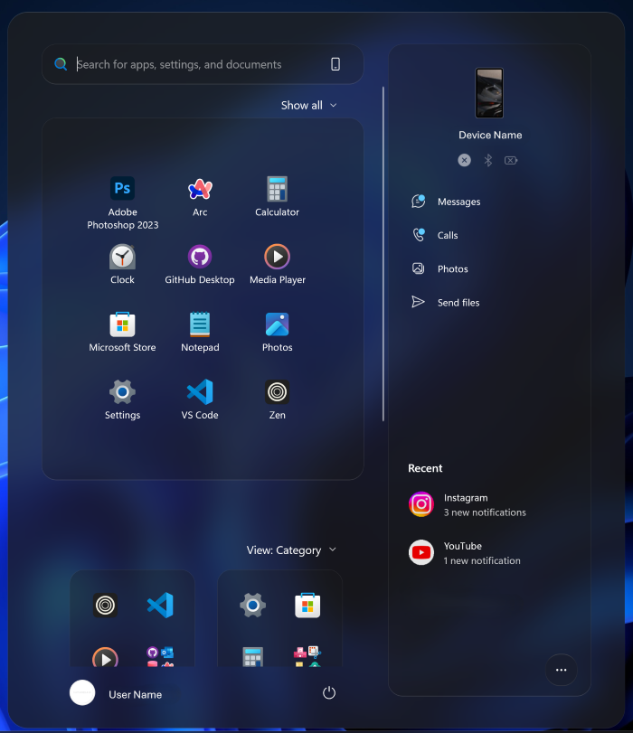
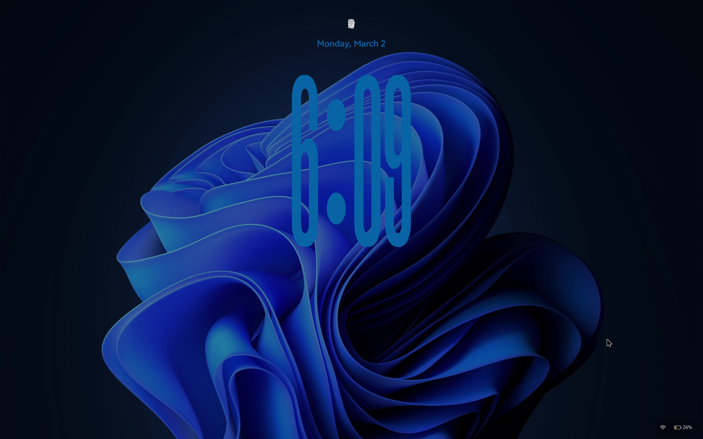

# WindowGlass theme for Windows 11 Start Menu Styler

A theme that adds a modern, glassy aesthetic with a compact layout to the Windows 11 Start menu.

**Author**: [Nathaniel4JC](https://github.com/Nathaniel4JC)



> [!IMPORTANT]
> This theme is designed for the [redesigned Windows 11 Start menu](https://microsoft.design/articles/start-fresh-redesigning-windows-start-menu/) that is gradually rolling out with the 25H2 update.

## Notes
- This theme works best on Windows 11 **25H2** and later.
- Works best on devices with a screen resolution of 1930x1200 and above.
- This theme currently works on displays with a resolution **above** 1366x768.
- This theme combines the start menu with the Phone Link panel and will only work on the 'New Windows 11 Start Menu'
- This theme consists of the following backgrounds:
  - Translucent
  - Glass
  - Frosted
  - Acrylic

  In order to switch between these backgrounds, set the value `Background=$Translucent`, `Background=$Glass`, `Background=$Frosted` or `Background=$Acrylic` in the "Style constants" section of the mod's settings.

## Bonus
- This theme can style your lock screen as well. 

## Lock Screen
 

To make it work, you'll need to:
- Add 'LockApp.exe' to the 'Custom process inclusion list' under 'Advanced settings' in the Windows 11 Start Menu Styler mod.
- Install the [Vivo Sans En VF](https://1drv.ms/u/c/67fedd4420ed716d/EXRoW1f5dABJrO2dPj0tbM0Bm1uYiGeoKyAYA7X7er2Zww?e=cLsiJJ) and [Morganite SemiBold](https://1drv.ms/u/c/67fedd4420ed716d/IQCHLlxP7GPITp4p-uPMw9O5AY3s2NJCHLKC-tYZZVWAGiY?e=yQrKQb) fonts.

## For a complete WindowGlass-themed UI, download the following mods and use the 'WindowGlass' theme:
- Windows 11 Taskbar Styler - for styling the taskbar.
- Windows 11 Notification Center Styler - for styling the Notification Center and Action Center.
- Windows 11 File Explorer Styler - for styling Windows Explorer windows.

---

## Theme selection

The theme is integrated into the mod and can be selected directly from the mod's
settings:

* Open the Windows 11 Start Menu Styler mod in Windhawk.
* Go to the "Settings" tab.
* Select the theme and save the settings.

## Manual installation

The theme styles can also be imported manually. To do that, follow these steps:

* Open the Windows 11 Start Menu Styler mod in Windhawk.
* Go to the "Advanced" tab.
* Copy the content below to the text box under "Mod settings" and click "Save".

<details>
<summary>Content to import (click to expand)</summary>

```yaml
styleConstants:
  - Translucent=<WindhawkBlur BlurAmount="15" TintColor="#10808080"/>
  - Glass=<WindhawkBlur BlurAmount="5" TintColor="{ThemeResource SystemChromeMediumColor}" TintOpacity="0.7" />
  - Frosted=<WindhawkBlur BlurAmount="20" TintColor="{ThemeResource SystemChromeMediumColor}" TintOpacity="0.7" />
  - Acrylic=<WindhawkBlur BlurAmount="30" TintColor="{ThemeResource SystemChromeMediumColor}" TintOpacity="0.8" />
  - Background=$Glass
  - BorderBrush=<LinearGradientBrush StartPoint="0,0" EndPoint="0,1"><GradientStop Color="#60808080" Offset="0.0" /><GradientStop Color="#50404040" Offset="0.25" /><GradientStop Color="#40808080" Offset="1" /></LinearGradientBrush>
  - BorderBrush2=<WindhawkBlur BlurAmount="10" TintColor="#909090" TintOpacity="0.3"/>
  - ClockBG=<SolidColorBrush Color="{ThemeResource SystemAccentColor}" Opacity="1"/>
  - BorderThickness=0.3,1,0.3,1
  - CornerRadius=35
  - SearchBoxRadius=20
  - ElementBG=<SolidColorBrush Color="{ThemeResource SystemChromeAltHighColor}" Opacity="0.3" />
  - ElementBorderThickness=0.3,0.3,0.3,1
  - ElementCornerRadius=25
  - ElementBorderBrush=<LinearGradientBrush StartPoint="0,0" EndPoint="0,1"><GradientStop Color="#50808080" Offset="1" /><GradientStop Color="#50606060" Offset="0.15" /></LinearGradientBrush>
  - ElementBorderBrush2=<WindhawkBlur BlurAmount="30" TintColor="#909090" TintOpacity="0.3"/>
  - HoverCornerRadius=15
controlStyles:
  - target: // Lock Screen
    styles:
      - ''
  - target: StackPanel#TimeAndDatePanel
    styles:
      - VerticalAlignment=Top
      - HorizontalAlignment=Center
      - RenderTransform:=<TranslateTransform X="0" />
  - target: StackPanel#TimePanel > TextBlock#Time
    styles:
      - HorizontalAlignment:=Center
      - RenderTransform:=<TransformGroup><TranslateTransform X="-30" Y="-10" /><ScaleTransform ScaleX="3.3" ScaleY="6" /></TransformGroup>
      - FontFamily=Morganite SemiBold
      - Foreground:=$ClockBG
  - target: StackPanel#TimeAndDatePanel > TextBlock#Date
    styles:
      - HorizontalAlignment=Center
      - RenderTransform:=<TranslateTransform X="0" Y="-110" />
      - FontFamily=vivo Sans EN VF
      - Foreground:=$ClockBG
  - target: Windows.UI.Xaml.Controls.Grid#WidgetFrameGrid
    styles:
      - Background:=$Background
      - BorderBrush:=$BorderBrush
      - BorderThickness=$BorderThickness
      - CornerRadius=$CornerRadius
  - target: Windows.UI.Xaml.Controls.Grid#WidgetCanvasPanel
    styles:
      - HorizontalAlignment=Center
      - RenderTransform:=<TranslateTransform X="0" Y="50" />
  - target: Windows.UI.Xaml.Controls.Grid#MediaTransportControls
    styles:
      - Background:=$Background
      - BorderBrush:=$BorderBrush
      - BorderThickness=$BorderThickness
      - CornerRadius=$CornerRadius
  - target: Windows.UI.Xaml.Controls.Grid#MediaControlsContainer
    styles:
      - Visibility=Visible
      - RenderTransform:=<TranslateTransform X="0" Y="-250" />
      - Margin=0,0,0,0
      - CornerRadius=$CornerRadius
  - target: // Start Menu
    styles:
      - ''
  - target: Windows.UI.Xaml.Controls.Grid#RootPanel > Windows.UI.Xaml.Controls.Grid#RootGrid > Windows.UI.Xaml.Controls.Grid#RootContent
    styles:
      - Margin=-20,-20,-20,0
  - target: StartDocked.StartSizingFrame
    styles:
      - Width=860
  - target: Windows.UI.Xaml.Controls.Border#RootGridDropShadow
    styles:
      - Visibility=1
  - target: Windows.UI.Xaml.Controls.Border#RightCompanionDropShadow
    styles:
      - Visibility=1
  - target: Windows.UI.Xaml.Controls.Border#StartDropShadow
    styles:
      - Visibility=1
  - target: Windows.UI.Xaml.Controls.Border#DropShadowDismissTarget
    styles:
      - Background:=$Background
      - BorderBrush:=$BorderBrush
      - BorderThickness=$BorderThickness
      - CornerRadius=$CornerRadius
      - Margin=2
      - Padding=0
  - target: Windows.UI.Xaml.Controls.Grid#RootContent > Windows.UI.Xaml.Controls.Border#AcrylicBorder
    styles:
      - Background:=$ElementBG
      - BorderBrush:=$ElementBorderBrush
      - BorderThickness=$ElementBorderThickness
      - CornerRadius=$ElementCornerRadius
      - Margin=0,60,0,10
      - Visibility=1
  - target: Windows.UI.Xaml.Controls.Border#AcrylicOverlay
    styles:
      - Visibility=1
  - target: StartDocked.SearchBoxToggleButton#StartMenuSearchBox
    styles:
      - Width=650
      - Height=50
      - Margin=0,-15,0,0
  - target: StartDocked.SearchBoxToggleButton#StartMenuSearchBox > Windows.UI.Xaml.Controls.Grid > Windows.UI.Xaml.Controls.Border#BorderElement
    styles:
      - Background:=$ElementBG
      - BorderBrush:=$ElementBorderBrush
      - BorderThickness=$ElementBorderThickness
      - CornerRadius=$ElementCornerRadius
  - target: StartDocked.SearchBoxToggleButton#StartMenuSearchBox > Windows.UI.Xaml.Controls.Grid > Windows.UI.Xaml.Controls.ContentPresenter#ContentPresenter > Windows.UI.Xaml.Controls.TextBlock#PlaceholderText
    styles:
      - Text=Search This Precision
  - target: Windows.UI.Xaml.Controls.Grid#TopLevelRoot > Windows.UI.Xaml.Controls.Grid
    styles:
      - Visibility=1
  - target: StartDocked.NavigationPaneView#NavigationPane
    styles:
      - Width=550
      - RenderTransform:=<TranslateTransform X="0" Y="10" />
  - target: Windows.UI.Xaml.Controls.Button#ShowAllAppsButton
    styles:
      - Visibility=1
  - target: StartMenu.PinnedList#StartMenuPinnedList
    styles:
      - Margin=0
      - Height=280
  - target: StartMenu.PinnedList#StartMenuPinnedList > Windows.UI.Xaml.Controls.Grid#Root
    styles:
      - Background:=$ElementBG
      - BorderBrush:=$ElementBorderBrush
      - BorderThickness=$ElementBorderThickness
      - CornerRadius=$ElementCornerRadius
  - target: Windows.UI.Xaml.Controls.Grid#UndockedRoot
    styles:
      - Visibility=0
      - Width=650
      - Margin=0,-130,0,230
      - Canvas.ZIndex=1
      - MaxHeight:=340
  - target: Windows.UI.Xaml.Controls.Grid#AllAppsRoot
    styles:
      - Visibility=0
      - Margin=-1600,190,115,-100
      - MaxHeight=330
      - Background:=$ElementBG
      - CornerRadius=$ElementCornerRadius
      - Width=650
      - BorderBrush:=$ElementBorderBrush
      - BorderThickness=$ElementBorderThickness
  - target: Windows.UI.Xaml.Controls.Button#CloseAllAppsButton
    styles:
      - Visibility=1
  - target: Windows.UI.Xaml.Controls.TextBlock#AllAppsHeading
    styles:
      - Visibility=1
  - target: StartDocked.AllAppsPane#AllAppsPanel
    styles:
      - Margin=-20,-20,20,20
  - target: // Phone Link Panel
    styles:
      - ''
  - target: StartDocked.StartMenuCompanion#RightCompanion > Windows.UI.Xaml.Controls.Grid#CompanionRoot > Windows.UI.Xaml.Controls.Border#AcrylicBorder
    styles:
      - Background:=$ElementBG
      - BorderBrush:=$ElementBorderBrush
      - BorderThickness=$ElementBorderThickness
      - CornerRadius:=$ElementCornerRadius
  - target: Windows.UI.Xaml.Controls.Grid#CompanionRoot > Windows.UI.Xaml.Controls.Grid#MainContent > Windows.UI.Xaml.Controls.Grid#ActionsBar > Windows.UI.Xaml.Controls.Button#PrimaryActionBarButton > Windows.UI.Xaml.Controls.ContentPresenter#ContentPresenter
    styles:
      - Background:=$ElementBG
      - BorderBrush:=$BorderBrush
      - BorderThickness=$BorderThickness
      - CornerRadius=$ElementCornerRadius
      - Height=40
  - target: Windows.UI.Xaml.Controls.Grid#ActionsBar > Windows.UI.Xaml.Controls.Button#ActionBarOverflowButton
    styles:
      - Background:=$ElementBG
      - BorderBrush:=$BorderBrush
      - BorderThickness=$BorderThickness
      - CornerRadius=$ElementCornerRadius
      - Height=40
  - target: StartDocked.StartMenuCompanion#RightCompanion > Windows.UI.Xaml.Controls.Grid#CompanionRoot
    styles:
      - Height=730
      - Margin=0,-10,0,-10
      - Padding=10,0,-2,0
  - target: // Flyouts and Menus
    styles:
      - ''
  - target: Windows.UI.Xaml.Controls.Border#OverflowFlyoutBackgroundBorder
    styles:
      - Background:=$Background
      - BorderBrush:=$BorderBrush
      - BorderThickness=$BorderThickness
      - CornerRadius=$ElementCornerRadius
  - target: Windows.UI.Xaml.Controls.MenuFlyoutPresenter > Windows.UI.Xaml.Controls.Border
    styles:
      - Background:=$Background
      - BorderBrush:=$BorderBrush
      - BorderThickness=$BorderThickness
      - CornerRadius=$ElementCornerRadius
  - target: Windows.UI.Xaml.Controls.Grid#HoverFlyoutGrid > Windows.UI.Xaml.Controls.Border#HoverFlyoutBackground
    styles:
      - Background:=$Background
      - BorderBrush:=$BorderBrush
      - BorderThickness=$BorderThickness
      - CornerRadius=$ElementCornerRadius
  - target: // Search Menu
    styles:
      - ''
  - target: Cortana.UI.Views.TaskbarSearchPage > Windows.UI.Xaml.Controls.Grid#RootGrid > Windows.UI.Xaml.Controls.Grid#OuterBorderGrid
    styles:
      - Background:=$Background
      - BorderBrush:=$BorderBrush
      - BorderThickness=$BorderThickness
      - CornerRadius=$CornerRadius
  - target: Windows.UI.Xaml.Controls.Border#LayerBorder
    styles:
      - Visibility=1
  - target: Windows.UI.Xaml.Controls.Border#AccentLayerBorder
    styles:
      - Visibility=1
  - target: Windows.UI.Xaml.Controls.Border#dropshadow
    styles:
      - Visibility=1
  - target: Windows.UI.Xaml.Controls.Border#AppBorder
    styles:
      - Visibility=1
  - target: // ToolTip
    styles:
      - ''
  - target: Windows.UI.Xaml.Controls.ToolTip > Windows.UI.Xaml.Controls.ContentPresenter#LayoutRoot
    styles:
      - Background:=$Background
      - BorderBrush:=$BorderBrush
      - BorderThickness=$BorderThickness
      - CornerRadius=15
  - target: // Folder
    styles:
      - ''
  - target: StartMenu.FolderModal#StartFolderModal > Windows.UI.Xaml.Controls.Grid#Root
    styles:
      - MaxHeight:=420
      - MaxWidth:=420
      - Height=Auto
      - Width=Auto
  - target: StartMenu.FolderModal#StartFolderModal > Windows.UI.Xaml.Controls.Grid#Root > Windows.UI.Xaml.Controls.ContentControl#ContentControl > Windows.UI.Xaml.Controls.ContentPresenter > StartMenu.UniversalTileContainer#UniversalTileContainer > Windows.UI.Xaml.Controls.Grid#GridViewContainer
    styles:
      - Width=400
      - Height=400
  - target: Windows.UI.Xaml.Controls.Grid#Root > Windows.UI.Xaml.Controls.Border
    styles:
      - Background:=$Background
      - BorderBrush:=$BorderBrush
      - BorderThickness=$BorderThickness
      - CornerRadius=$CornerRadius
  - target: StartMenu.ExpandedFolderList
    styles:
      - Margin=0,30,0,-120
  - target: // Start Menu
    styles:
      - ''
  - target: Windows.UI.Xaml.Controls.Grid#MainMenu > Windows.UI.Xaml.Controls.Border#AcrylicBorder
    styles:
      - Visibility=1
  - target: StartMenu.SearchBoxToggleButton#SearchBoxToggleButton
    styles:
      - Height=50
      - Margin=-20,20,-20,-20
      - Width=400
  - target: StartMenu.SearchBoxToggleButton#SearchBoxToggleButton > Windows.UI.Xaml.Controls.Grid > Windows.UI.Xaml.Controls.Border#BorderElement
    styles:
      - Background:=$ElementBG
      - BorderBrush:=$ElementBorderBrush
      - BorderThickness=$ElementBorderThickness
      - CornerRadius:=$ElementCornerRadius
  - target: Windows.UI.Xaml.Controls.Primitives.ToggleButton#ShowHideCompanion
    styles:
      - Margin=-50,40,0,0
  - target: Windows.UI.Xaml.Controls.TextBlock#PinnedListHeaderText
    styles:
      - Visibility=1
  - target: Windows.UI.Xaml.Controls.Grid#AllListHeading
    styles:
      - Margin=0,-10,0,0
  - target: Windows.UI.Xaml.Controls.Grid#AllListHeading > Windows.UI.Xaml.Controls.TextBlock#AllListHeadingText
    styles:
      - Visibility=1
  - target: StartMenu.CategoryControl > Windows.UI.Xaml.Controls.Grid#RootGrid > Windows.UI.Xaml.Controls.Border
    styles:
      - Background:=$ElementBG
      - BorderBrush:=$ElementBorderBrush
      - BorderThickness=$ElementBorderThickness
      - CornerRadius=$ElementCornerRadius
  - target: // Start menu Width
    styles:
      - ''
  - target: Windows.UI.Xaml.Controls.Grid#MainMenu
    styles:
      - Width=460
  - target: // inned Apps
    styles:
      - ''
  - target: StartMenu.PinnedList#StartMenuPinnedList
    styles:
      - Width=400
      - Height=450
      - Margin=0,0,0,30
  - target: Windows.UI.Xaml.Controls.GridView#PinnedList > Border > Windows.UI.Xaml.Controls.ScrollViewer
    styles:
      - ScrollViewer.VerticalScrollMode=2
      - MaxHeight:=336
      - MinHeight:=100
      - Width=300
      - Margin=0,0,60,0
  - target: // Phone Link Panel Dimensions
    styles:
      - ''
  - target: StartMenu.StartMenuCompanion#RightCompanion
    styles:
      - Height=810
      - Margin=15,0,30,0
  - target: // Phone Link Panel
    styles:
      - ''
  - target: Windows.UI.Xaml.Controls.Grid#CompanionRoot > Windows.UI.Xaml.Controls.Border#AcrylicBorder
    styles:
      - Background:=$ElementBG
      - BorderBrush:=$ElementBorderBrush
      - BorderThickness=$ElementBorderThickness
      - CornerRadius=$ElementCornerRadius
  - target: // All Apps Section
    styles:
      - ''
  - target: Windows.UI.Xaml.Controls.GridView#AllAppsGrid > Windows.UI.Xaml.Controls.ItemsWrapGrid
    styles:
      - Visibility=0
  - target: Windows.UI.Xaml.Controls.GridView#AllAppsGrid
    styles:
      - Margin=0,15,0,0
  - target: Windows.UI.Xaml.Controls.Grid#TopLevelHeader > Windows.UI.Xaml.Controls.Grid > Windows.UI.Xaml.Controls.Button
    styles:
      - Visibility=1
  - target: // Flyouts
    styles:
      - ''
  - target: Windows.UI.Xaml.Controls.FlyoutPresenter
    styles:
      - //Background:=$Background
      - BorderBrush:=$BorderBrush
      - BorderThickness:=$BorderThickness
      - CornerRadius:=$ElementCornerRadius
  - target: Windows.UI.Xaml.Controls.MenuFlyoutPresenter
    styles:
      - CornerRadius:=$ElementCornerRadius
  - target: Windows.UI.Xaml.Controls.Grid#AllListHeading > Microsoft.UI.Xaml.Controls.DropDownButton#ViewSelectionButton > Grid#RootGrid
    styles:
      - CornerRadius=$HoverCornerRadius
      - Margin=-12,0,12,0
  - target: MenuFlyoutItem
    styles:
      - CornerRadius:=$HoverCornerRadius
      - Margin=4,0,4,0
  - target: ToggleMenuFlyoutItem
    styles:
      - CornerRadius:=$HoverCornerRadius
      - Margin=4,0,4,0
```
</details>
