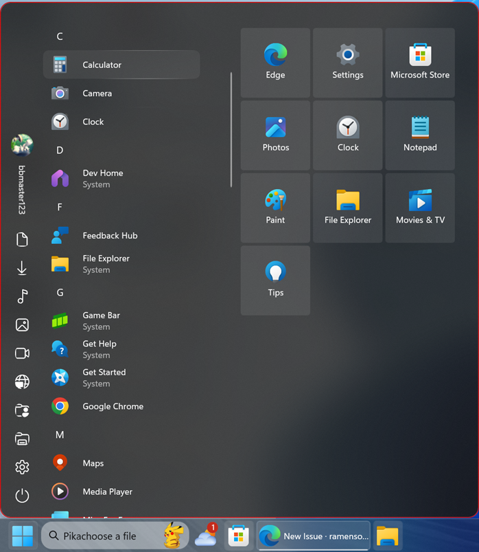

# Windows 10 theme for Windows 11 Start Menu Styler (WIP)

**Author**: BBmaster123 ([bbmaster123](https://github.com/bbmaster123))



## Installation

The easiest way to install this theme is to import its styles. To do that,
follow these steps:

* Open the Windows 11 Start Menu Styler mod in Windhawk.
* Go to the "Advanced" tab.
* Copy the content below to the text box under "Mod settings" and click "Save".

<details>
<summary>Content to import (click to expand)</summary>

```json
{  
  "controlStyles[0].target": "Windows.UI.Xaml.Controls.Grid#UndockedRoot",
  "controlStyles[0].styles[0]": "Visibility=Visible",
  "controlStyles[0].styles[1]": "MaxWidth=675",
  "controlStyles[1].target": "Windows.UI.Xaml.Controls.Grid#AllAppsRoot",
  "controlStyles[1].styles[0]": "Visibility=Visible",
  "controlStyles[1].styles[1]": "Width=325",
  "controlStyles[1].styles[2]": "Transform3D:=<CompositeTransform3D TranslateX=\"-842\" TranslateY=\"-45\" />",
  "controlStyles[2].target": "Windows.UI.Xaml.Controls.Button#CloseAllAppsButton",
  "controlStyles[2].styles[0]": "Visibility=Collapsed",
  "controlStyles[3].target": "StartDocked.StartSizingFrame",
  "controlStyles[3].styles[0]": "MinWidth=675",
  "controlStyles[4].target": "Windows.UI.Xaml.Controls.Grid#ShowMoreSuggestions",
  "controlStyles[4].styles[0]": "Visibility=Collapsed",
  "controlStyles[5].target": "Windows.UI.Xaml.Controls.Grid#SuggestionsParentContainer",
  "controlStyles[6].target": "Windows.UI.Xaml.Controls.Grid#TopLevelSuggestionsListHeader",
  "controlStyles[6].styles[0]": "Visibility=Collapsed",
  "controlStyles[5].styles[0]": "Visibility=Collapsed",
  "controlStyles[7].target": "Windows.UI.Xaml.Controls.Button#ShowAllAppsButton",
  "controlStyles[7].styles[0]": "Visibility=Collapsed",
  "controlStyles[8].target": "StartMenu.PinnedList#StartMenuPinnedList",
  "controlStyles[3].styles[1]": "MaxWidth=675",
  "controlStyles[0].styles[2]": "Transform3D:=<CompositeTransform3D TranslateX=\"280\" />",
  "controlStyles[9].target": "StartDocked.SearchBoxToggleButton",
  "controlStyles[9].styles[0]": "Height=0",
  "controlStyles[9].styles[1]": "Margin=0,0,0,0",
  "controlStyles[10].target": "Windows.UI.Xaml.Controls.TextBlock#DisplayName",
  "controlStyles[10].styles[0]": "Visibility=Visible",
  "controlStyles[11].target": "Windows.UI.Xaml.Controls.Grid#LogosContainer",
  "controlStyles[11].styles[0]": "Height=32",
  "controlStyles[11].styles[1]": "Width=32",
  "controlStyles[12].target": "Microsoft.UI.Xaml.Controls.PipsPager#PinnedListPipsPager",
  "controlStyles[12].styles[0]": "Visibility=Collapsed",
  "controlStyles[13].target": "Border#DropShadow",
  "controlStyles[13].styles[0]": "Visibility=Visible",
  "controlStyles[14].target": "Windows.UI.Xaml.Controls.Border#ContentBorder > Windows.UI.Xaml.Controls.Grid#DroppedFlickerWorkaroundWrapper > Border#BackgroundBorder",
  "controlStyles[15].target": "Windows.UI.Xaml.Controls.Grid#LogoContainer",
  "controlStyles[15].styles[0]": "Height=32",
  "controlStyles[15].styles[1]": "Width=32",
  "controlStyles[16].target": "Border#AcrylicBorder",
  "controlStyles[16].styles[0]": "CornerRadius=14",
  "controlStyles[17].target": "Windows.UI.Xaml.Controls.Border#BackgroundBorder@CommonStates",
  "controlStyles[17].styles[0]": "CornerRadius=4",
  "controlStyles[18].target": "Windows.UI.Xaml.Controls.Border#BorderBackground",
  "controlStyles[18].styles[0]": "CornerRadius=4",
  "controlStyles[19].target": "Windows.UI.Xaml.Controls.Border#Border@CommonStates",
  "controlStyles[19].styles[0]": "CornerRadius=4",
  "controlStyles[14].styles[0]": "CornerRadius=4",
  "controlStyles[16].styles[1]": "BorderThickness=1",
  "controlStyles[8].styles[0]": "Width=375",
  "controlStyles[8].styles[1]": "Margin=-250,-40,0,0",
  "controlStyles[20].target": "StartMenu.PinnedListTile",
  "controlStyles[20].styles[0]": "Padding=0",
  "controlStyles[21].target": "StartDocked.NavigationPaneView#NavigationPane",
  "controlStyles[21].styles[0]": "Grid.Row=0",
  "controlStyles[16].styles[2]": "Background:=<AcrylicBrush TintColor=\"Black\" TintOpacity=\"0.8\" TintLuminosityOpacity=\"0.7\" Opacity=\"1\"/>",
  "controlStyles[22].target": "Grid#RootContent",
  "controlStyles[22].styles[0]": "Height=800",
  "controlStyles[22].styles[1]": "CornerRadius=8",
  "controlStyles[23].target": "Grid@CommonStates",
  "controlStyles[23].styles[0]": "CornerRadius=8",
  "controlStyles[24].target": "Windows.UI.Xaml.Controls.Frame",
  "controlStyles[24].styles[0]": "CornerRadius=8",
  "controlStyles[25].target": "StartDocked.AppListView#NavigationPanePlacesListView",
  "controlStyles[25].styles[0]": "Grid.Column=0",
  "controlStyles[21].styles[1]": "Transform3D:=<CompositeTransform3D RotationZ=\"270\" TranslateY=\"-205\" TranslateX=\"-2\"/>",
  "controlStyles[26].target": "StartDocked.UserTileView",
  "controlStyles[25].styles[1]": "Transform3D:=<CompositeTransform3D TranslateX=\"170\" CenterX=\"250\" />",
  "controlStyles[21].styles[2]": "Canvas.ZIndex=100",
  "controlStyles[27].target": "Windows.UI.Xaml.Controls.FontIcon",
  "controlStyles[23].styles[1]": "RequestedTheme=2",
  "controlStyles[16].styles[3]": "BorderBrush:=<AcrylicBrush TintColor=\"Red\" TintOpacity=\"0.86\" Opacity=\"1\" />",
  "controlStyles[27].styles[0]": "FontSize=20",
  "controlStyles[28].target": "StartDocked.PowerOptionsView#PowerButton",
  "controlStyles[26].styles[0]": "Transform3D:=<CompositeTransform3D TranslateX=\"30\" TranslateY=\"0\" />",
  "controlStyles[16].styles[4]": "Height=725",
  "controlStyles[16].styles[5]": "Margin=0,-75,0,0",
  "controlStyles[3].styles[2]": "Margin=-12,12,0,0",
  "controlStyles[28].styles[0]": "Transform3D:=<CompositeTransform3D TranslateX=\"-275\" />",
  "controlStyles[21].styles[3]": "Width=745",
  "controlStyles[29].target": "Grid#AllAppsPaneHeader",
  "controlStyles[29].styles[0]": "Visibility=Collapsed",
  "controlStyles[28].styles[1]": "Margin=100,0,-100,0",
  "controlStyles[22].styles[2]": "Padding=0",
  "resourceVariables[0].variableKey": "ContextMenuMargin",
  "resourceVariables[0].value": "0",
  "controlStyles[30].target": "Windows.UI.Xaml.Controls.TextBlock#PinnedListHeaderText",
  "controlStyles[30].styles[0]": "Visibility=Collapsed",
  "controlStyles[31].target": "Windows.UI.Xaml.Controls.TextBlock#AllAppsHeading",
  "controlStyles[31].styles[0]": "Visibility=Collapsed",
  "controlStyles[20].styles[1]": "Margin=2",
  "controlStyles[1].styles[3]": "Height=800",
  "controlStyles[14].styles[1]": "Background:=<AcrylicBrush TintColor=\"Transparent\" TintOpacity=\"0\" TintLuminosityOpacity=\"0.08\" Opacity=\"1\"/>",
  "controlStyles[14].styles[2]": "Margin=2",
  "controlStyles[14].styles[3]": "Height=98",
  "controlStyles[14].styles[4]": "Width=98",
  "controlStyles[8].styles[2]": "Height=800",
  "controlStyles[32].target": "Grid#UserTileIcon",
  "controlStyles[32].styles[0]": "Transform3D:=<CompositeTransform3D RotateZ=\"180\" />",
  "controlStyles[27].styles[1]": "Transform3D:=<CompositeTransform3D RotationZ=\"90\" TranslateY=\"20\" />",
  "controlStyles[33].target": "Windows.UI.Xaml.Controls.Border#ContentBorder > Windows.UI.Xaml.Controls.Grid#DroppedFlickerWorkaroundWrapper > Border",
  "controlStyles[33].styles[0]": "BorderThickness=2",
  "controlStyles[25].styles[2]": "BorderBrush:=<RevealBorderBrush Color=\"White\" TargetTheme=\"1\" Opacity=\"0.32\"/>",
  "controlStyles[32].styles[1]": "Background:=<RevealBorderBrush Color=\"Transparent\" Opacity=\"1\"/>",
  "controlStyles[33].styles[1]": "BorderBrush:=<RevealBorderBrush Color=\"White\" TargetTheme=\"1\" Opacity=\"0.32\"/>",
  "controlStyles[17].styles[1]": "BorderBrush:=<RevealBorderBrush Color=\"Transparent\" TargetTheme=\"1\" Opacity=\"1\"/>",
  "controlStyles[18].styles[1]": "BorderBrush:=<RevealBorderBrush Color=\"Transparent\" TargetTheme=\"1\" Opacity=\"1\"/>",
  "controlStyles[18].styles[2]": "BorderThickness=0.5",
  "controlStyles[17].styles[2]": "BorderThickness=0.5",
  "controlStyles[19].styles[1]": "BorderBrush@ActivePointerOver:=<RevealBorderBrush Color=\"Transparent\" TargetTheme=\"1\" Opacity=\"0.32\"/>",
  "controlStyles[33].styles[2]": "Background:=<RevealBorderBrush Color=\"Transparent\" TargetTheme=\"1\" Opacity=\"0.5\"/>",
  "controlStyles[17].styles[3]": "Background@PointerOver:=<RevealBorderBrush Color=\"Transparent\" TargetTheme=\"1\" Opacity=\"0.32\"/>",
  "controlStyles[23].styles[2]": "Background@PointerOver:=<RevealBackgroundBrush Color=\"Transparent\" TargetTheme=\"1\" Opacity=\"1\"/>"
}
```
</details>
